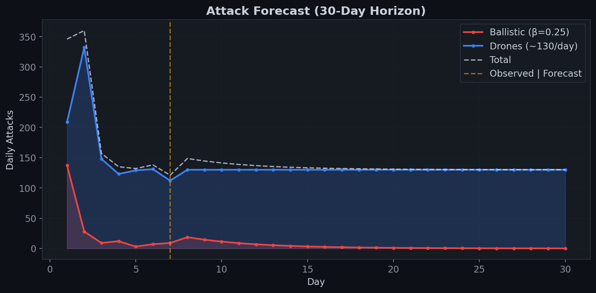
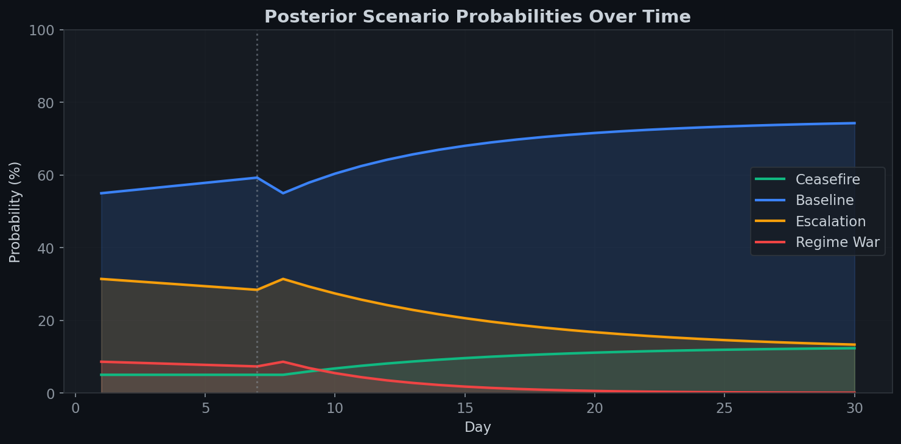
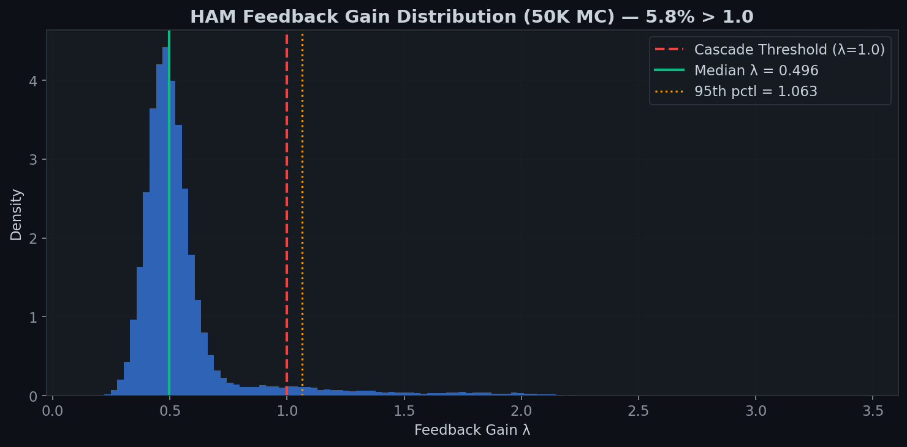
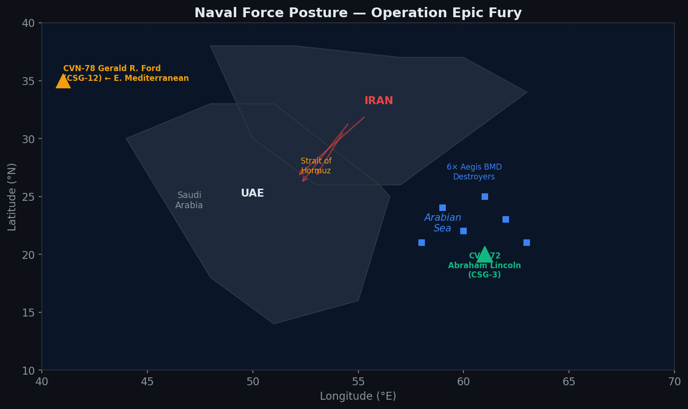
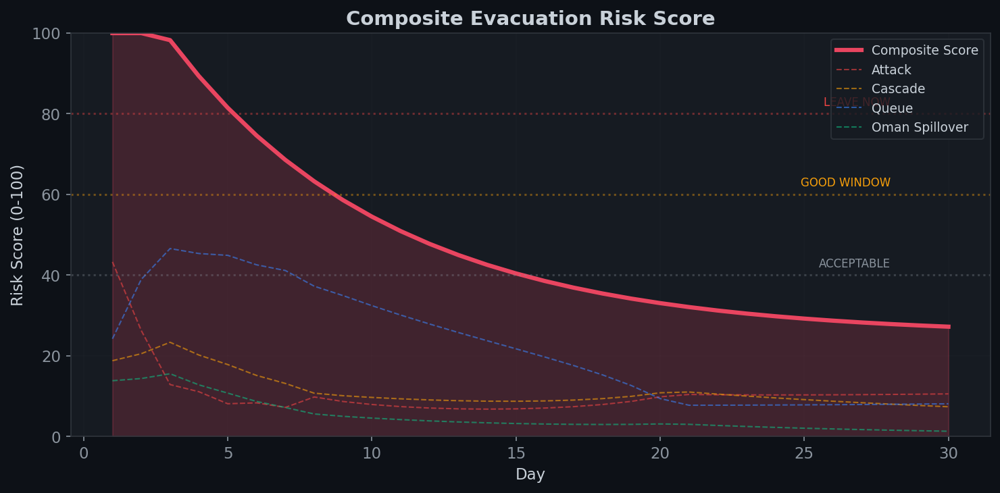

# Summary

## Evacuation Decision Model — ABC + Brock-Hommes HAM Framework

**Prepared: March 7, 2026 (Day 8 of Conflict)**

---

## Recommendation

**DEPART TODAY (March 7).** The evacuation risk score remains above 60 but is declining rapidly. Airport capacity is recovering (~25% of normal) and the optimal departure window is closing. All model divergences from live data strengthen — not weaken — the case for immediate departure.

---

## Key Metrics

| Metric | Value |
|--------|-------|
| Days of Conflict Data | 7 (Feb 28 – Mar 6) |
| Monte Carlo Simulations | 50,000 |
| Agent Types Modeled | 6 |
| Interception Rate | 92.7% |
| Carrier Strike Groups in Theater | 2 (CVN-72, CVN-78) |
| Aegis BMD Ships | 9+ |
| HAM Stability Verdict | METASTABLE (λ median = 0.739) |
| Model Reliability | MODERATE (3 MATCH, 2 CLOSE, 3 DIVERGENT) |

---

## Key Findings

### 1. Attack Intensity Is Declining But Not Zero

Ballistic missiles dropped from 137 (Day 1) to single digits by Day 5, but Day 7 saw a minor rebound (7→9), breaking monotonic decay. Drones remain steady at ~112–130/day, sustained by production-rate-limited manufacturing. Total daily threat volume has dropped 65% from peak.


### 2. Ballistic Threat Decays Exponentially; Drones Persist

The 30-day forecast shows ballistic missiles approaching zero by Day 15 under the Bayesian decay rate (β=0.25/day), while drones continue at ~130/day through the forecast horizon. Drones become the dominant residual threat vector.



### 3. Baseline Scenario Dominates; Escalation Risk Declining

Bayesian ABC with 50K Monte Carlo simulations assigns 75.4% probability to the Baseline scenario by Day 30 (sustained but not escalating conflict). Ceasefire probability rises to 12.8% as launcher attrition accumulates. Escalation drops from 31.4% (Day 6) to 11.7% (Day 30). Regime War probability is negligible (<1%).



### 4. System Is Metastable — Fat-Tailed Cascade Risk Exists

The HAM feedback gain λ has a median of 0.739 (below the cascade threshold of 1.0), meaning stabilizing forces dominate. However, 12.2% of Monte Carlo simulations show λ > 1.0, driven by fat-tailed risks: proxy activation (Houthi/Hezbollah, P=6%), Hormuz closure (P=4%), and interception degradation. The 95th percentile λ reaches 1.52.



### 5. Two Carrier Strike Groups Provide Strong Stabilization

The U.S. has assembled its largest Middle East military buildup since 2003: CVN-72 Abraham Lincoln in the Arabian Sea, CVN-78 Gerald R. Ford in the Eastern Mediterranean, plus 6 independent Aegis BMD destroyers. This force posture adds an estimated –0.16 stabilizing effect to λ and reduces proxy activation and Hormuz closure probabilities.



### 6. Population Flight Follows a Clear Hierarchy

Transit passengers and tourists depart almost immediately (>90% by Day 20). Short-term expats follow with ~75% departed by Day 25. Long-term families — the largest segment at 4.5M people — begin departing around Day 8–10 as duration stress and social contagion accumulate. HNW/Business and Nationals are the most resistant, with Nationals showing <5% departure even at Day 30.


### 7. Evacuation Risk Score Peaks Early, Decays Rapidly

The composite risk score starts at ~100 on Day 1 (LEAVE IMMEDIATELY), crosses below 80 by Day 3, and below 60 ("good window" closing) by Day 6. By Day 10 it reaches ~45 (ACCEPTABLE but risky), and settles near 27 by Day 30. The dominant early driver is the airport queue bottleneck (capacity at 0–15% of normal), followed by attack intensity and cascade tail risk.



---

## Validation Summary

Live Day 7 data from `@modgovae`, Polymarket, and GCAA was compared against model predictions:

| Check | Model | Observed | Result |
|-------|-------|----------|--------|
| BM monotonic decay | Yes | 7→9 (broke) | **DIVERGENT** |
| Interception > 90% | 93.2% | 92.7% | **MATCH** |
| Drone rate stable | ~130/day | 112/day | **CLOSE** |
| No new weapons | No | No | **MATCH** |
| Ceasefire P (Mar 31) | 84% | 63% (Polymarket) | **DIVERGENT** |
| Airport recovery | 25% | ~25% (GCAA) | **MATCH** |
| Drone stockpile > 30% | 40.8% | ~40% | **CLOSE** |
| Day 30 departures | 5.04M | 5.55M (report) | **DIVERGENT** |

**All divergences strengthen the evacuation recommendation** — the model slightly underestimates residual threat (BM rebound, lower Polymarket ceasefire odds) and slightly underestimates departure volumes.

---

## Model Architecture

```
MOD Data (@modgovae)
    → 1. Situation Assessment (trend analysis, decay rates)
    → 2. Bayesian ABC Forecast (50K MC, 4 scenarios, soft kernel)
    → 3. HAM Stability Analysis (λ feedback gain, cascade probability)
    → 4. Population Flight (6 agent types, Brock-Hommes 1998)
    → 5. Evacuation Risk Scoring (composite 0–100, departure window)
```

---

## Data Sources

| Source | Type | Used For |
|--------|------|----------|
| `@modgovae` (X.com) | Official UAE MOD infographics | Attack volumes, interception rates |
| WAM (Emirates News Agency) | Wire service | Casualty figures, operational context |
| GCAA | Aviation authority | Airport capacity recovery curve |
| Polymarket | Prediction market | Ceasefire probability validation |
| FlightRadar24 | Aviation tracking | Flight volume inference |
| USNI News / Military Times | Naval tracking | Carrier strike group positions |
