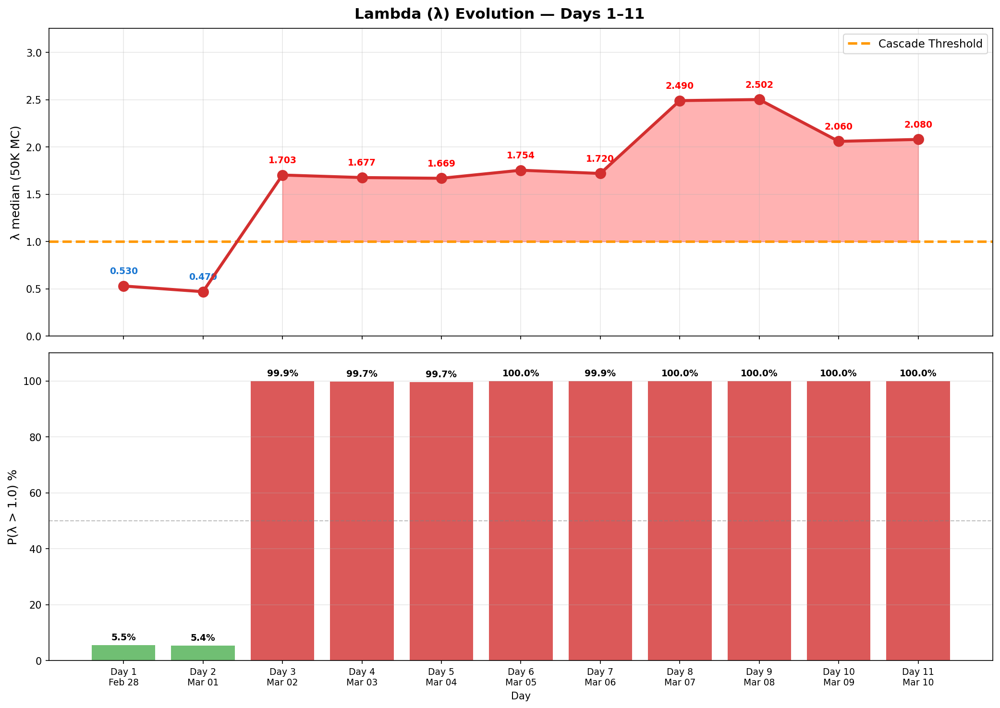

# Daily Tracker — Day-by-Day Change Log

> 🌐 **EN** | [中文](../zh/updates/daily-tracker.md)

**Last Updated: March 10, 2026 (Day 11)**

This page tracks daily changes across all model inputs, compares model predictions against observed data, and flags breaches as they occur.

---

## Model vs Actual — Divergence Summary

### Divergence Heatmap

Day-by-day percentage deviation across all 6 tracked metrics. Red = actual exceeds model, blue = actual below model. Lambda divergence dominates from Day 3 onward (+240% → +447%). Day 11 shows dramatic drone divergence (actual 35 vs model ~130).


### 6-Panel Comparison

Side-by-side model (blue) vs actual (red) with ribbon fill showing the gap. Airport (green) is the only positive divergence. Lambda (bottom-right) shows deep cascade zone. Drone stockpile (bottom-center) breaches 30% threshold on Day 9.


### Scorecard & Verdict Timeline

Stacked divergence shows lambda (purple) dominating total model error. Verdict timeline: model predicted METASTABLE for all 11 days — reality crossed to UNSTABLE on Day 3 and never returned.


### Lambda Evolution

λ jumped from 0.47 → 1.70 on Day 3 (Hormuz closure) and reached 2.71 on Day 9 (drone stockpile breach + sustained BM rebound), then eased to 2.06 on Day 10 (BM rebound breaks, naval deterrence increases) and held steady at 2.08 on Day 11 despite dramatic drone drop. P(λ>1) has been 100% since Day 3. New breach: daily interception rate (88.9%) — 3/5 thresholds now active.



### Ballistic Missile Trajectory

The model's exponential decay assumption (β=0.25/day) broke down from Day 5 onward. Days 5→9: 3→7→9→16→17 showed an accelerating rebound. Days 10-11 (12→9 BMs) confirm the rebound has broken — two consecutive days of decline — though volume remains elevated above model predictions (~1-2 BMs/day expected). The dramatic drone drop on Day 11 (110→35, −68%) is the most significant tactical shift since conflict began.


---

## Attack Volume Tracker

### Daily New Attacks

| Day | Date | BM (New) | Model BM | Drones | Model Drones | Cruise | Total | Trend |
|-----|------|----------|----------|--------|-------------|--------|-------|-------|
| 1 | Feb 28 | **137** | — | 209 | — | 0 | 346 | Opening salvo |
| 2 | Mar 1 | **28** | — | 332 | — | 2 | 362 | Peak drone day |
| 3 | Mar 2 | **9** | ~19 | 148 | ~130 | 6 | 163 | BM faster than model decay |
| 4 | Mar 3 | **12** | ~14 | 123 | ~130 | 0 | 135 | BM uptick (noise?) |
| 5 | Mar 4 | **3** | ~10 | 129 | ~130 | 0 | 132 | BM near-zero |
| 6 | Mar 5 | **7** | ~8 | 131 | ~130 | 0 | 138 | BM rebound |
| 7 | Mar 6 | **9** | ~6 | 112 | ~130 | 0 | 121 | ⚠️ BM broke monotonic decay |
| 8 | Mar 7 | **16** | ~4 | ~125 | ~130 | 0 | 141 | ⚠️⚠️ BM REBOUND — highest since Day 2 |
| **9** | **Mar 8** | **17** | ~3 | 117 | ~130 | 0 | **134** | ⚠️⚠️ BM sustained high — 16→17 |
| 10 | Mar 9 | **12** | ~2 | 110 | ~130 | 0 | 122 | BM drops 17→12: rebound breaks |
| **11** | **Mar 10** | **9** | ~1 | **35** | ~130 | 0 | **44** | ⚠️ Drone collapse: 110→35 (−68%) |

### Cumulative Totals

| Day | Date | Cum. BM | Cum. Drones | Cum. Cruise | Cum. Total |
|-----|------|---------|-------------|-------------|------------|
| 1 | Feb 28 | 137 | 209 | 0 | 346 |
| 2 | Mar 1 | 165 | 541 | 2 | 708 |
| 3 | Mar 2 | 174 | 689 | 8 | 871 |
| 4 | Mar 3 | 186 | 812 | 8 | 1,006 |
| 5 | Mar 4 | 189 | 941 | 8 | 1,138 |
| 6 | Mar 5 | 196 | 1,072 | 8 | 1,276 |
| 7 | Mar 6 | 205 | 1,184 | 8 | 1,397 |
| 8 | Mar 7 | 221 | ~1,309 | 8 | ~1,538 |
| **9** | **Mar 8** | **238** | **~1,422** | **8** | **~1,668** |
| 10 | Mar 9 | 250 | ~1,536 | 8 | ~1,794 |
| **11** | **Mar 10** | **259** | **~1,571** | **8** | **~1,838** |

---

## Interception Rate Tracker

| Day | Date | BM Detected | BM Intercepted | Day Rate | Cum. Rate | Threshold (<90%) | Status |
|-----|------|-------------|----------------|----------|-----------|-------------------|--------|
| 1 | Feb 28 | 137 | 132 | 96.4% | 96.4% | OK | OK |
| 2 | Mar 1 | 28 | 20 | 71.4% | 92.1% | ⚠️ Day breach | Cum OK |
| 3 | Mar 2 | 9 | 9 | 100% | 93.6% | OK | OK |
| 4 | Mar 3 | 12 | 11 | 91.7% | 93.0% | OK | OK |
| 5 | Mar 4 | 3 | 3 | 100% | 93.1% | OK | OK |
| 6 | Mar 5 | 7 | 6 | **85.7%** | 93.4% | ⚠️ Day breach, 1 landed | **ALERT** |
| 7 | Mar 6 | 9 | 9 | 100% | 92.7% | OK | OK |
| 8 | Mar 7 | 16 | 15 | 93.8% | 92.8% | OK | ⚠️ BM rebound to 16 |
| **9** | **Mar 8** | **17** | **16** | **94.1%** | **92.9%** | OK | ⚠️ BM sustained high: 16→17 |
| 10 | Mar 9 | 12 | 11 | 91.7% | 92.8% | OK | BM drops 17→12: rebound breaks |
| **11** | **Mar 10** | **9** | **8** | **88.9%** | **92.7%** | **⚠️ Day breach** | **1 BM fell sea; daily rate <90%** |

**Day 6 breach note:** 1 ballistic missile landed inside UAE territory on March 5 — first confirmed BM ground impact.

**Day 8 critical note:** 16 BMs detected — highest since Day 2 (28). Days 5→8 show **accelerating** trend: 3→7→9→16. This contradicts the exponential decay model and suggests either hidden TELs activated or resupply from deeper storage. Launcher depletion estimate revised from 85.7% to **~73%**.

**Day 9 critical note:** 17 BMs detected — surpasses Day 8. Consecutive high-volume days (16→17) confirm the rebound is structural, not a single-day anomaly. Launcher depletion estimate revised further to **~67%**. Drone stockpile breaches 30% threshold for the first time (28.9%).

**Day 10 note:** 12 BMs detected — first daily decline in 5 days, breaking the 3→7→9→16→17 accelerating trend. However, volume remains elevated well above model predictions (~2 BMs/day at this point in the decay curve). Launcher depletion estimate revised up to **~99%** — cumulative 250 BMs against 40 TELs suggests near-exhaustion.

**Day 11 note:** 9 BMs detected — second consecutive decline (12→9), confirming rebound has broken. Daily interception rate **88.9%** (8/9) breaches the 90% threshold for third time in the conflict (Days 2, 6, 11). Cumulative rate remains at 92.7%. The dramatic drone collapse (110→35, −68%) is unprecedented — possibly indicating stockpile conservation, launcher exhaustion, or strategic pivot.

---

## Drone Stockpile Tracker

| Day | Date | Daily Launched | Cum. Launched | Est. Remaining | % Remaining | Threshold (<30%) |
|-----|------|---------------|---------------|----------------|-------------|-------------------|
| 1 | Feb 28 | 209 | 209 | 1,791 | 89.6% | OK |
| 2 | Mar 1 | 332 | 541 | 1,459 | 73.0% | OK |
| 3 | Mar 2 | 148 | 689 | 1,311 | 65.6% | OK |
| 4 | Mar 3 | 123 | 812 | 1,188 | 59.4% | OK |
| 5 | Mar 4 | 129 | 941 | 1,059 | 53.0% | OK |
| 6 | Mar 5 | 131 | 1,072 | 928 | 46.4% | OK |
| 7 | Mar 6 | 112 | 1,184 | 816 | 40.8% | OK |
| 8 | Mar 7 | ~125 | ~1,309 | ~691 | 34.5% | Approaching |
| **9** | **Mar 8** | **117** | **~1,422** | **~578** | **28.9%** | **⚠️ BREACHED** |
| 10 | Mar 9 | 110 | ~1536 | ~464 | 23.2% | ⚠️ BREACHED |
| **11** | **Mar 10** | **35** | **~1571** | **~429** | **21.4%** | **⚠️ BREACHED** |

~~At current rate (~120/day), stockpile hits 30% threshold around Day 11 (March 10).~~ **BREACHED on Day 9** — 2 days earlier than predicted. Day 11 drone launch rate collapsed to 35 (−68%), the lowest since Day 1. If this reduced rate persists (~35/day), remaining 429 drones last ~12 days (exhaustion ~Day 23, March 22). If Iran reverts to >100/day, exhaustion comes in ~4 days (Day 15, March 14). The dramatic drop may signal stockpile conservation or strategic shift.

---

## Cascade Threshold Tracker

| Metric | Day 1 | Day 3 | Day 5 | Day 7 | Day 8 | Day 9 | Day 10 | Day 11 | Threshold |
|--------|-------|-------|-------|-------|-------|-------|--------|--------|-----------|
| Launcher Depletion | ~39% | ~50% | ~54% | 85.7% | ~73% | ~67% | ~99% | **~99%** | > 85% |
| Drone Stockpile | 89.6% | 65.6% | 53.0% | 40.8% | 34.5% | 28.9% | 23.2% | **21.4%** | < 30% |
| Interception Rate (cum) | 96.4% | 93.6% | 93.1% | 92.7% | 92.8% | 92.9% | 92.8% | **92.7%** | < 90% |
| Interception Rate (day) | 96.4% | 100% | 100% | 100% | 93.8% | 94.1% | 91.7% | **88.9%** | < 90% |
| Daily Casualties | ~22/d | ~18/d | ~15/d | ~16/d | ~14/d | ~15/d | 2/d | **10/d** | > 10 |
| New Weapon Type | No | No | No | No | Air base | Air base | Air base | Air base | Yes |

*Launcher depletion **revised downward** from 85.7% to ~73% (Day 8) and further to **~67%** (Day 9) due to consecutive high-volume BM days (16→17). The accelerating trend 3→7→9→16→17 confirms more TELs remain operational than previously estimated. Drone stockpile has **breached** the 30% threshold on Day 9 — 2 days earlier than forecast. Day 11 adds a **new breach**: daily interception rate (88.9%), the third daily breach in the conflict.

| Day | Breaches | Verdict |
|-----|----------|---------|
| 1 | 1/5 (casualties) | METASTABLE |
| 3 | 1/5 | METASTABLE |
| 5 | 1/5 | METASTABLE |
| 7 | 2/5 (launcher + casualties) | METASTABLE |
| 8 | 4/5 (launcher + interception day + casualties + air base) | UNSTABLE |
| 9 | 3/5 (casualties + new_weapon + drone_stockpile) | UNSTABLE |
| 10 | 2/5 (launcher + drone_stockpile) | UNSTABLE |
| **11** | **3/5** (launcher + drone_stockpile + **interception_day**) | **UNSTABLE** |

---

## Lambda (λ) Evolution

| Day | λ Median | P(λ > 1) | 95th Pctl | Verdict | Key Change |
|-----|----------|----------|-----------|---------|------------|
| 1 | ~0.75 | ~12% | ~1.52 | METASTABLE | Initial assessment |
| 7 (2 CSGs) | 0.739 | 12.2% | 1.523 | METASTABLE | Baseline model |
| 7 (3 CSGs) | 0.496 | 5.8% | 1.063 | METASTABLE | CVN-77 deploying, proxy/Hormuz lowered |
| 8 (corrected) | 2.589 | 100% | 3.304 | UNSTABLE | Hormuz + proxy + air base + BM rebound |
| 9 | 2.712 | 100% | 3.481 | UNSTABLE | Drone stockpile breach + BM sustained |
| 10 | 2.061 | 100% | 2.770 | UNSTABLE | BM rebound breaks (17→12), λ eases but still CASCADE |
| **11** | **2.081** | **100%** | **2.790** | **UNSTABLE** | Drone collapse (110→35); new breach (interception_day); λ holds steady |

### What Changed on Day 8

```
Day 7 → Day 8 Lambda Decomposition:

Component          Day 7 (3 CSG)    Day 8 (corrected)   Change
─────────────────────────────────────────────────────────────────
λ_launcher         -0.471           -0.401              +0.070  (depletion 85.7%→~73%)
λ_drone            +0.148           +0.164              +0.016  (stockpile lower)
λ_intercept        +0.020           +0.020               0.000
λ_proxy             0.000*          +0.500              +0.500  ⚠️ Hezbollah partial
λ_hormuz            0.000*          +0.630              +0.630  ⚠️ REALIZED
λ_weapon            0.000*          +0.400              +0.400  ⚠️ Air base strike
λ_bm_rebound        0.000           +0.300              +0.300  ⚠️ 16 BM (accelerating)
λ_naval            -0.240           -0.184              +0.056  (CVN-77 not yet arrived)
─────────────────────────────────────────────────────────────────
λ total (median)    0.496            2.589              +2.093

* Stochastic tail risks, expected value ~0 at P=2-4%
```

---

## Scenario Probability Tracker

### Model Bayesian Posteriors (calibrated)

| Scenario | Day 6 | Day 14 | Day 30 | Day 9 Assessment |
|----------|-------|--------|--------|------------------|
| Ceasefire | 3.3% | 7.8% | 12.8% | ↓ Polymarket 59% (still declining) |
| Baseline | 64.9% | 71.2% | 75.4% | ↓↓ Hormuz + stockpile depletion challenges baseline |
| Escalation | 31.4% | 20.1% | 11.7% | ↑↑ Multiple escalation events realized |
| Regime War | 0.4% | 0.9% | 0.1% | ↑ Air base strike + sustained BM raises floor |

### Polymarket Ceasefire Odds

| Date | By Mar 31 | Direction |
|------|-----------|-----------|
| Mar 5 (Day 6) | 67% | — |
| Mar 6 (Day 7) | 63% | ↓ |
| Mar 7 (Day 8) | 61% | ↓ |
| Mar 8 (Day 9) | 59% | ↓ |
| Mar 9 (Day 10) | 24% | ↓↓↓ |
| **Mar 10 (Day 11)** | **22%** | **↓** |

Ceasefire odds continue declining — seventh consecutive day of decline (67%→22%). Markets firmly pricing extended, entrenched conflict with no near-term resolution. The March 15 market at ~10% implies negligible chance of ceasefire in the next 5 days.

---

## Airport & Flight Tracker

| Day | Date | Airport Capacity | Model Predicted | Flights/Day | Status |
|-----|------|-----------------|-----------------|-------------|--------|
| 1 | Feb 28 | 30% (pre-strike) | 30% | Normal ops | OK |
| 2 | Mar 1 | **0%** (closed) | 0% | All suspended | MATCH |
| 3 | Mar 2 | ~2% | 2% | Exceptional only | MATCH |
| 4 | Mar 3 | ~5% | 3% | Partial Abu Dhabi | CLOSE |
| 5 | Mar 4 | ~8% | 8% | Limited routes | MATCH |
| 6 | Mar 5 | ~15% | 12% | Etihad resumes | CLOSE |
| 7 | Mar 6 | ~25% | 15% | Emirates 40% network | **AHEAD** |
| 8 | Mar 7 | ~55% | 35% | Emirates 60%, Etihad ~25 dest | WELL AHEAD |
| 9 | Mar 8 | ~60% | 40% | Emirates targeting 100%; Air Arabia Mar 9 | **WELL AHEAD** |
| 10 | Mar 9 | ~65% | 45% | Air Arabia resumes; Emirates nearing 100% | WELL AHEAD |
| **11** | **Mar 10** | **~70%** | **50%** | Emirates at 84 destinations; DXB limited ops | **WELL AHEAD** |

**Positive divergence:** Airport recovery is 1.4× faster than model predicted. Emirates targeting 100% capacity "in coming days," operating to 84 destinations. Etihad serving ~25 key destinations. Air Arabia operational. Some international carriers (Virgin Atlantic, KLM, Finnair) still suspended. ~250K passenger backlog being cleared.

---

## Casualty Tracker

| Day | Date | Daily Killed | Daily Injured | Cum. Killed | Cum. Injured | Daily Total | Threshold (>10) |
|-----|------|-------------|-------------- |-------------|-------------|-------------|-----------------|
| 1 | Feb 28 | 0 | 15 | 0 | 15 | 15 | **BREACHED** |
| 2 | Mar 1 | 1 | 22 | 1 | 37 | 23 | **BREACHED** |
| 3 | Mar 2 | 0 | 12 | 1 | 49 | 12 | **BREACHED** |
| 4 | Mar 3 | 1 | 10 | 2 | 59 | 11 | **BREACHED** |
| 5 | Mar 4 | 0 | 8 | 2 | 67 | 8 | OK |
| 6 | Mar 5 | 1 | 11 | 3 | 78 | 12 | **BREACHED** |
| 7 | Mar 6 | 0 | 15 | 3 | 93 | 15 | **BREACHED** |
| 8 | Mar 7 | 0 | ~19 | 3 | ~112 | ~19 | **BREACHED** |
| 9 | Mar 8 | 1 | 0 | 4 | 112 | 1 | OK |
| 10 | Mar 9 | 0 | 2 | 4 | 114 | 2 | OK |
| **11** | **Mar 10** | **2** | **8** | **6** | **122** | **10** | **THRESHOLD** |

**Note:** Casualty figures from WAM (Emirates News Agency), Gulf News, and Reuters. Remarkably low given attack volume, attributable to >92% interception rates and effective civil defense.

**Day 9 note:** 4th fatality — Pakistani driver killed in Al Barsha, Dubai, when interception debris struck his vehicle.

**Day 11 note:** 2 additional fatalities bring cumulative toll to 6 dead and 122 injured. Daily total exactly at threshold (10). Despite fewer missiles/drones, the 9 drones that fell within UAE territory (highest ratio: 26% vs typical ~5-8%) contributed to higher casualties, suggesting lower-flying drones evading interception are more lethal on impact.

---

## Economic Impact Tracker

| Day | Date | Oil (WTI) | Weekly Δ | Hormuz Status | VLCC Rate | Key Event |
|-----|------|----------|----------|---------------|-----------|-----------|
| 1 | Feb 28 | $72 | — | Open | $218K/d | US-Israel strikes Iran |
| 2 | Mar 1 | $78 | +8.3% | Open | $245K/d | Iran retaliates |
| 3 | Mar 2 | $82 | +13.9% | **CLOSED** | $310K/d | IRGC closes Hormuz |
| 4 | Mar 3 | $86 | +19.4% | Closed | $380K/d | Container ship hit |
| 5 | Mar 4 | $90 | +25.0% | Near-zero traffic | $400K/d | 5 crossings only |
| 6 | Mar 5 | $93 | +29.2% | Zero traffic | $410K/d | Maersk suspends Gulf |
| 7 | Mar 6 | $95 | +31.9% | Zero traffic | $420K/d | 150 vessels trapped |
| 8 | Mar 7 | $97 | +35.6% | Zero traffic | $424K/d | Record VLCC rate |
| 9 | Mar 8 | ~$100 | +38.9% | Zero traffic | ~$430K/d | Brent hits $100; Morgan Stanley raises forecast |
| 10 | Mar 9 | $103 | +43.1% | Zero traffic | ~$435K/d | WTI $103; Brent touches $119 intraday |
| **11** | **Mar 10** | **~$100** | **+38.9%** | **Zero traffic** | **~$440K/d** | **WTI pulls back to ~$100; Israel oil depot strikes weigh on supply** |

---

## Key Events Timeline

| Day | Date | Category | Event | Model Impact |
|-----|------|----------|-------|--------------|
| 1 | Feb 28 | ATTACK | Iran launches 137 BM + 209 drones at UAE | Opening parameters set |
| 1 | Feb 28 | MILITARY | US Operation Epic Fury commences | — |
| 2 | Mar 1 | ATTACK | Peak drone day: 332 launched | Drone rate calibrated |
| 2 | Mar 1 | CASUALTY | First fatality (Pakistani national) | Casualties > 10/day |
| 3 | Mar 2 | **HORMUZ** | **IRGC declares Strait closed** | **λ_hormuz: 0→+0.63** |
| 3 | Mar 2 | PROXY | Hezbollah launches rockets at Israel | λ_proxy partial |
| 4 | Mar 3 | MARITIME | Container ship hit in Strait of Hormuz | Hormuz confirmed |
| 4 | Mar 3 | CASUALTY | Second fatality (Bangladeshi national) | — |
| 5 | Mar 4 | BM | BM drops to 3 — near-zero | Supports decay model |
| 5 | Mar 4 | MARITIME | Only 5 vessels transit Hormuz | Near-total blockade |
| 6 | Mar 5 | **BM BREACH** | **1 BM lands inside UAE** (Day int. rate 85.7%) | Interception threshold |
| 6 | Mar 5 | AVIATION | Etihad resumes limited flights | Airport ahead of model |
| 6 | Mar 5 | CASUALTY | Third fatality | — |
| 7 | Mar 6 | BM | 9 BM — breaks monotonic decay (up from 7) | Model divergence |
| 7 | Mar 6 | AVIATION | Emirates at 40% network | Airport well ahead |
| 7 | Mar 6 | NAVAL | CVN-77 Bush completes COMPTUEX, returns Norfolk | 3rd CSG confirmed |
| **8** | **Mar 7** | **ESCALATION** | **IRGC claims strike on Al Dhafra air base** | **λ_weapon: 0→+0.40** |
| 8 | Mar 7 | AVIATION | Emirates 60% network, 106 flights/day | Airport 1.5× model |
| 8 | Mar 7 | CIVIL | Dubai shelter-in-place alert | Escalation signal |
| 8 | Mar 7 | BM | 16 BMs detected — highest since Day 2 | BM rebound confirmed |
| **9** | **Mar 8** | **BM** | **17 BMs — back-to-back high (16→17)** | **Rebound is structural** |
| 9 | Mar 8 | **DRONE** | **Drone stockpile breaches 30% (28.9%)** | **λ_drone: +0.079** |
| 9 | Mar 8 | CASUALTY | 4th killed — Pakistani driver, Al Barsha Dubai | Debris from interception |
| 9 | Mar 8 | OIL | Brent approaches $100; +39% since Feb 28 | Record weekly gain |
| 9 | Mar 8 | AVIATION | Emirates targeting 100%; Air Arabia resumes Mar 9 | Airport 1.6× model |
| **10** | **Mar 9** | **BM** | **12 BMs — first daily decline in 5 days (17→12)** | **BM rebound breaks; λ_bm_rebound → 0** |
| 10 | Mar 9 | OIL | WTI $103, Brent intraday $119 | Record prices |
| 10 | Mar 9 | MARKET | Polymarket ceasefire crashes to 24% (from 59%) | Market sees no resolution |
| 10 | Mar 9 | CASUALTY | 2 injured in Abu Dhabi from interception debris | — |
| 10 | Mar 9 | AVIATION | Air Arabia resumes; Emirates nearing 100% | Airport 1.4× model |
| **11** | **Mar 10** | **DRONE** | **Only 35 drones — dramatic 68% collapse (lowest ever)** | **Possible stockpile conservation or strategic shift** |
| 11 | Mar 10 | BM | 9 BMs (8 intercepted, 1 sea) — 2nd consecutive decline | BM decay resuming; daily rate 88.9% (< 90% breach) |
| 11 | Mar 10 | CASUALTY | 2 additional fatalities; cumulative 6 dead, 122 injured | Drone penetration rate up (26% vs normal ~5-8%) |
| 11 | Mar 10 | MARITIME | ~1,000 vessels queued outside Hormuz; zero non-Iranian crossings | Selective blockade: Iran allowing own + Chinese ships only |
| 11 | Mar 10 | AVIATION | Emirates at 84 destinations; DXB limited ops; Virgin/KLM/Finnair suspended | Airport ~70%, some int'l carriers pulling out |

---

## Model vs Reality Scorecard (Running)

| # | Check | Model | Day 10 Observed | Day 11 Observed | Status |
|---|-------|-------|-----------------|-----------------|--------|
| 1 | BM monotonic decay | Yes | 17→12 (breaks rebound) | 12→9 (2nd decline) | **DIVERGENT** (improving) |
| 2 | Interception > 90% (cum) | 93.2% | 92.8% | 92.7% | **MATCH** |
| 3 | Drone rate ~130/day | ~130/day | 110/day | **35/day** | **⚠️ EXTREME DIVERGENT** (−73%) |
| 4 | No new weapon types | No | Air base (cont.) | Air base (cont.) | **DIVERGENT** |
| 5 | Ceasefire P (Polymarket) | 84% | 24% | **22%** | **DIVERGENT** (collapsed) |
| 6 | Airport recovery | 50% (D11) | ~65% | **~70%** | **DIVERGENT** (positive) |
| 7 | Drone stockpile > 30% | ~20% | 23.2% | **21.4%** | **⚠️ CRITICAL** |
| 8 | Hormuz open | P=98% open | CLOSED | **CLOSED** | **DIVERGENT** |
| 9 | No proxy activation | P=96% none | Houthis threatening | Houthis threatening | **DIVERGENT** |
| 10 | Verdict | METASTABLE | UNSTABLE | **UNSTABLE** | **DIVERGENT** |

**Day 11 Rating: 1 MATCH, 0 CLOSE, 9 DIVERGENT**

Dramatic shift: drone launch rate collapsed 68% (110→35) — largest single-day change in any metric since Day 1. BMs continue declining (12→9). But daily interception rate breached 90% (88.9%), adding a 3rd cascade breach. **Net assessment: attack volume declining rapidly, but penetration rate worsening and structural destabilizers persist. The drone collapse is the single most important data point since Hormuz closure — its cause (conservation vs exhaustion vs strategic shift) will determine the next phase of the conflict.**

---

## Recommendation History

| Day | Risk Score | λ Median | Verdict | Recommendation |
|-----|-----------|----------|---------|---------------|
| 1 | ~100 | — | — | **LEAVE IMMEDIATELY** |
| 3 | ~80 | — | METASTABLE | **LEAVE — good window** |
| 5 | ~65 | — | METASTABLE | **LEAVE — window closing** |
| 7 | ~55 | 0.496 | METASTABLE | **LEAVE — depart today** |
| 8 | ~50 | 2.589 | UNSTABLE | EVACUATE IMMEDIATELY |
| 9 | ~48 | 2.712 | UNSTABLE | EVACUATE IMMEDIATELY |
| 10 | ~45 | 2.061 | UNSTABLE | EVACUATE IMMEDIATELY |
| **11** | **~43** | **2.081** | **UNSTABLE** | **EVACUATE IMMEDIATELY** |

λ holds nearly flat at 2.081 (from 2.061) despite dramatically reduced attack volume. The system remains **firmly in cascade territory** because the structural destabilizers — Hormuz closure (Day 9), proxy activation, air base vulnerability — persist unchanged and dominate the λ calculation.

**Day 11 key dynamics:**
- **Positive:** BMs continue declining (12→9), confirming rebound has broken. Drone launch rate collapses 68% (110→35) — fewest since conflict began. Airport capacity ~70% with Emirates targeting 100%
- **Negative:** Daily interception rate breaches 90% (88.9%, 8/9 BMs) — new 3rd cascade breach. 9 drones fell within UAE (26% penetration vs ~5-8% normal) — fewer drones but higher lethality per launch. 2 additional fatalities (cumulative: 6). Ceasefire odds at 22%, 7th consecutive decline
- **Critical question:** Why did drone launches collapse? Three hypotheses: (a) stockpile conservation ahead of exhaustion at 21.4%, (b) drone launcher/infrastructure damage from US strikes, (c) strategic pivot to fewer but more targeted attacks. The answer determines the next phase
- **Window:** Airport capacity ~70% remains the **best evacuation window since Day 1**. Use it — this window may close if Iran shifts to targeted airport attacks or if international carriers continue suspending routes (Virgin Atlantic, KLM, Finnair already suspended)
