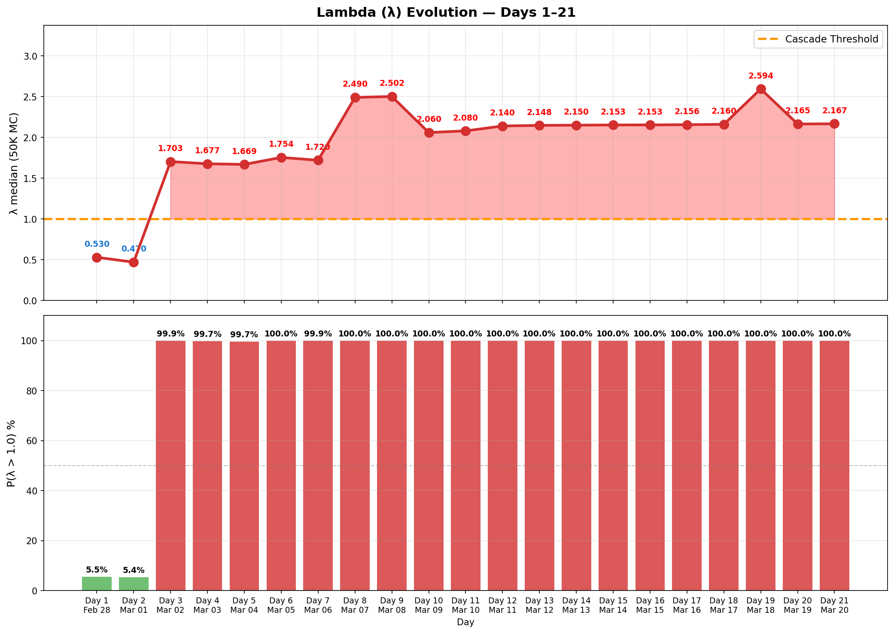

# Daily Tracker — Day-by-Day Change Log

> 🌐 **EN** | [中文](../zh/updates/daily-tracker.md)

**Last Updated: March 20, 2026 (Day 21)**

This page tracks daily changes across all model inputs, compares model predictions against observed data, and flags breaches as they occur.

---

## Model vs Actual — Divergence Summary

### Divergence Heatmap

Day-by-day percentage deviation across all 6 tracked metrics (21 days). Red = actual exceeds model, blue = actual below model. Lambda divergence dominates from Day 3 onward (+240% → +360%). Drone divergence extreme from Day 11 onward (actual 6-45 vs model ~130). BMs oscillate in 4-13 range (Days 12-21), well above model's near-zero prediction. Day 21: 4 BMs + 26 drones (30 total, slight rebound from Day 20's conflict low of 22); Brent eases to $107 as US considers releasing seized Iranian crude; Eid al-Fitr passes without ceasefire.


### 6-Panel Comparison

Side-by-side model (blue) vs actual (red) with ribbon fill showing the gap. Airport (green) was positive divergence until Day 17 DXB crash. Lambda (bottom-right) shows deep cascade zone. Drone stockpile (bottom-center) breaches 30% threshold on Day 9. Day 21 data included.


### Scorecard & Verdict Timeline

Stacked divergence shows lambda (purple) dominating total model error. Verdict timeline: model predicted METASTABLE for all 20 days — reality crossed to UNSTABLE on Day 3 and never returned.


### Lambda Evolution

λ jumped from 0.47 → 1.70 on Day 3 (Hormuz closure), peaked at 2.71 on Day 9 (drone stockpile breach + BM rebound), then eased to a plateau ~2.1 from Day 10 onward. Days 12-18 showed remarkable stability at 2.14-2.16. Day 19 saw λ surge to 2.596 on BM rebound signal (3-day acceleration 7→10→13). Days 20-21: λ holds at ~2.16 as BMs remain low (7→4). P(λ>1) has been 100% since Day 3. Day 21 λ = 2.163 — essentially flat from Day 20 (2.161). The system is locked in a stable cascade regime. Eid al-Fitr passes without ceasefire; Polymarket odds at 8%.



### Ballistic Missile Trajectory

The model's exponential decay assumption (β=0.25/day) broke down from Day 5 onward. Days 5→9: 3→7→9→16→17 showed an accelerating rebound. Post-rebound (Days 10-21): BMs oscillate in 4-13 range with noisy pattern (12→9→6→10→7→9→4→7→10→13→7→4). Day 21: 4 BMs — ties Day 16 for lowest BM count. Drones rebound slightly to 26 (from 15 on Day 20). Total projectiles at 30, a slight uptick from Day 20's conflict-low 22 but still in the low-volume regime (Days 16-21 avg ~30/day vs Days 1-10 avg ~170/day). Iran may be conserving for regional energy targets. Brent eases to $107 as US considers releasing seized Iranian crude. VLCC rates hold at $450K/day.


---

## Attack Volume Tracker

### Daily New Attacks

| Day | Date | BM (New) | Model BM | Drones | Model Drones | Cruise | Total | Trend |
|-----|------|----------|----------|--------|-------------|--------|-------|-------|
| 1 | Feb 28 | **137** | — | 209 | — | 0 | 346 | Opening salvo |
| 2 | Mar 1 | **28** | — | 332 | — | 2 | 362 | Peak drone day |
| 3 | Mar 2 | **9** | ~19 | 148 | ~130 | 6 | 163 | BM faster than model decay |
| 4 | Mar 3 | **12** | ~14 | 123 | ~130 | 0 | 135 | BM uptick (noise?) |
| 5 | Mar 4 | **3** | ~10 | 129 | ~130 | 0 | 132 | BM near-zero |
| 6 | Mar 5 | **7** | ~8 | 131 | ~130 | 0 | 138 | BM rebound |
| 7 | Mar 6 | **9** | ~6 | 112 | ~130 | 0 | 121 | ⚠️ BM broke monotonic decay |
| 8 | Mar 7 | **16** | ~4 | ~125 | ~130 | 0 | 141 | ⚠️⚠️ BM REBOUND — highest since Day 2 |
| **9** | **Mar 8** | **17** | ~3 | 117 | ~130 | 0 | **134** | ⚠️⚠️ BM sustained high — 16→17 |
| 10 | Mar 9 | **12** | ~2 | 110 | ~130 | 0 | 122 | BM drops 17→12: rebound breaks |
| 11 | Mar 10 | 9 | ~1 | 35 | ~130 | 0 | 44 | ⚠️ Drone collapse: 110→35 (−68%) |
| **12** | **Mar 11** | **6** | ~1 | **39** | ~130 | **7** | **52** | ⚠️ First cruise missiles since Day 3; BM 3rd decline; drones −68% recovery |
| 13 | Mar 12 | 10 | ~1 | 26 | ~130 | 0 | 36 | BM uptick 6→10 (+67%); drones collapse further |
| **14** | **Mar 13** | **7** | ~1 | **~27** | ~130 | 0 | **~34** | BM resumes decline 10→7; drones stable at record low; **new record low total** |
| 15 | Mar 14 | **9** | ~1 | 33 | ~130 | 0 | 42 | 9 BMs + 33 drones (@modgovae via Gulf News); Fujairah fire from debris |
| **16** | **Mar 15** | **4** | ~0 | **6** | ~130 | 0 | **10** | @modgovae CORRECTED: historic low (4 BM + 6 drones = 10 total) |
| **17** | **Mar 16** | **7** | ~0 | **25** | ~130 | 0 | **32** | Rebound from Day 16 low; 1 BM hits civilian car; DXB fuel tank hit; MQ-9A destroyed Kuwait |
| **18** | **Mar 17** | **10** | ~0 | **45** | ~130 | 0 | **55** | @modgovae: 10 BMs + 45 drones; **GCAA closes airspace** (first since Day 2); Fujairah port hit; UK air sorties begin |
| **19** | **Mar 18** | **13** | ~0 | **27** | ~130 | 0 | **40** | @modgovae: 13 BMs + 27 drones; all BMs intercepted; Brent $108.78 (conflict high); VLCC $445K/d record; Fed meeting begins |
| **20** | **Mar 19** | **7** | ~0 | **15** | ~130 | 0 | **22** | **Lowest UAE volume of conflict (22 total)**; Iran hits Qatar Ras Laffan LNG (17% capacity); Brent $113; oil briefly $119 |
| **21** | **Mar 20** | **4** | ~0 | **26** | ~130 | 0 | **30** | Eid al-Fitr; BMs tie historic low (4); drones rebound 15→26; Brent eases to $107; Polymarket 8%; foreign airlines still banned from DXB |

### Cumulative Totals

| Day | Date | Cum. BM | Cum. Drones | Cum. Cruise | Cum. Total |
|-----|------|---------|-------------|-------------|------------|
| 1 | Feb 28 | 137 | 209 | 0 | 346 |
| 2 | Mar 1 | 165 | 541 | 2 | 708 |
| 3 | Mar 2 | 174 | 689 | 8 | 871 |
| 4 | Mar 3 | 186 | 812 | 8 | 1,006 |
| 5 | Mar 4 | 189 | 941 | 8 | 1,138 |
| 6 | Mar 5 | 196 | 1,072 | 8 | 1,276 |
| 7 | Mar 6 | 205 | 1,184 | 8 | 1,397 |
| 8 | Mar 7 | 221 | ~1,309 | 8 | ~1,538 |
| **9** | **Mar 8** | **238** | **~1,422** | **8** | **~1,668** |
| 10 | Mar 9 | 250 | ~1,536 | 8 | ~1,794 |
| 11 | Mar 10 | 259 | ~1,571 | 8 | ~1,838 |
| **12** | **Mar 11** | **265** | **~1,610** | **15** | **~1,890** |
| 13 | Mar 12 | 275 | ~1,636 | 15 | ~1,926 |
| **14** | **Mar 13** | **282** | **~1,663** | **15** | **~1,960** |
| 15 | Mar 14 | 294 | ~1,696 | 15 | ~2,005 |
| **16** | **Mar 15** | **298** | **~1,702** | **15** | **~2,015** |
| **17** | **Mar 16** | **~305** | **~1,727** | **15** | **~2,047** |
| **18** | **Mar 17** | **314** | **~1,672** | **15** | **~2,001** |
| **19** | **Mar 18** | **327** | **~1,699** | **15** | **~2,041** |
| **20** | **Mar 19** | **334** | **~1,714** | **15** | **~2,063** |
| **21** | **Mar 20** | **338** | **~1,740** | **15** | **~2,093** |

---

## Interception Rate Tracker

| Day | Date | BM Detected | BM Intercepted | Day Rate | Cum. Rate | Threshold (<90%) | Status |
|-----|------|-------------|----------------|----------|-----------|-------------------|--------|
| 1 | Feb 28 | 137 | 132 | 96.4% | 96.4% | OK | OK |
| 2 | Mar 1 | 28 | 20 | 71.4% | 92.1% | ⚠️ Day breach | Cum OK |
| 3 | Mar 2 | 9 | 9 | 100% | 93.6% | OK | OK |
| 4 | Mar 3 | 12 | 11 | 91.7% | 93.0% | OK | OK |
| 5 | Mar 4 | 3 | 3 | 100% | 93.1% | OK | OK |
| 6 | Mar 5 | 7 | 6 | **85.7%** | 93.4% | ⚠️ Day breach, 1 landed | **ALERT** |
| 7 | Mar 6 | 9 | 9 | 100% | 92.7% | OK | OK |
| 8 | Mar 7 | 16 | 15 | 93.8% | 92.8% | OK | ⚠️ BM rebound to 16 |
| **9** | **Mar 8** | **17** | **16** | **94.1%** | **92.9%** | OK | ⚠️ BM sustained high: 16→17 |
| 10 | Mar 9 | 12 | 11 | 91.7% | 92.8% | OK | BM drops 17→12: rebound breaks |
| 11 | Mar 10 | 9 | 8 | 88.9% | 92.7% | ⚠️ Day breach | 1 BM fell sea; daily rate <90% |
| **12** | **Mar 11** | **6** | **6** | **100%** | **92.8%** | OK | BM all intercepted; 7 cruise intercepted; drones fell in UAE incl. 2 near DXB |
| 13 | Mar 12 | 10 | 10 | 100% | 93.1% | OK | All 10 BM intercepted per @modgovae; no cruise; 26 drones engaged |
| **14** | **Mar 13** | **7** | **~7** | **~100%** | **93.3%** | OK | BM resumes decline 10→7; debris hits DIFC building; ~27 drones engaged |
| 15 | Mar 14 | 9 | 8 | 88.9% | 93.1% | ⚠️ Day breach | 1 BM fell sea; Fujairah debris fire |
| **16** | **Mar 15** | **4** | **4** | **100%** | **93.2%** | OK | @modgovae CORRECTED: all 4 BM intercepted; historic low volume |
| **17** | **Mar 16** | **7** | **6** | **85.7%** | **93.0%** | ⚠️ Day breach | 1 BM hits civilian car Abu Dhabi; daily rate <90% (4th breach in conflict) |
| **18** | **Mar 17** | **10** | **~9** | **~90%** | **~92.7%** | Borderline | @modgovae: 10 engaged; ~1 fell (estimated); airspace closure suggests intense wave |
| **19** | **Mar 18** | **13** | **13** | **100%** | **~92.7%** | OK | @modgovae: 13 BMs all intercepted; cumulative 327 BMs; rate stable at 92.7% |
| **20** | **Mar 19** | **7** | **7** | **100%** | **~92.8%** | OK | @modgovae: 7 BMs all intercepted; cumulative 334 BMs; 3rd consecutive 100% day rate |
| **21** | **Mar 20** | **4** | **4** | **100%** | **~92.9%** | OK | @modgovae: 4 BMs all intercepted; cumulative 338 BMs; 4th consecutive 100% daily rate |

**Day 6 breach note:** 1 ballistic missile landed inside UAE territory on March 5 — first confirmed BM ground impact.

**Day 8 critical note:** 16 BMs detected — highest since Day 2 (28). Days 5→8 show **accelerating** trend: 3→7→9→16. This contradicts the exponential decay model and suggests either hidden TELs activated or resupply from deeper storage. Launcher depletion estimate revised from 85.7% to **~73%**.

**Day 9 critical note:** 17 BMs detected — surpasses Day 8. Consecutive high-volume days (16→17) confirm the rebound is structural, not a single-day anomaly. Launcher depletion estimate revised further to **~67%**. Drone stockpile breaches 30% threshold for the first time (28.9%).

**Day 10 note:** 12 BMs detected — first daily decline in 5 days, breaking the 3→7→9→16→17 accelerating trend. However, volume remains elevated well above model predictions (~2 BMs/day at this point in the decay curve). Launcher depletion estimate revised up to **~99%** — cumulative 250 BMs against 40 TELs suggests near-exhaustion.

**Day 11 note:** 9 BMs detected — second consecutive decline (12→9), confirming rebound has broken. Daily interception rate **88.9%** (8/9) breaches the 90% threshold for third time in the conflict (Days 2, 6, 11). Cumulative rate remains at 92.7%. The dramatic drone collapse (110→35, −68%) is unprecedented — possibly indicating stockpile conservation, launcher exhaustion, or strategic pivot.

---

## Drone Stockpile Tracker

| Day | Date | Daily Launched | Cum. Launched | Est. Remaining | % Remaining | Threshold (<30%) |
|-----|------|---------------|---------------|----------------|-------------|-------------------|
| 1 | Feb 28 | 209 | 209 | 1,791 | 89.6% | OK |
| 2 | Mar 1 | 332 | 541 | 1,459 | 73.0% | OK |
| 3 | Mar 2 | 148 | 689 | 1,311 | 65.6% | OK |
| 4 | Mar 3 | 123 | 812 | 1,188 | 59.4% | OK |
| 5 | Mar 4 | 129 | 941 | 1,059 | 53.0% | OK |
| 6 | Mar 5 | 131 | 1,072 | 928 | 46.4% | OK |
| 7 | Mar 6 | 112 | 1,184 | 816 | 40.8% | OK |
| 8 | Mar 7 | ~125 | ~1,309 | ~691 | 34.5% | Approaching |
| **9** | **Mar 8** | **117** | **~1,422** | **~578** | **28.9%** | **⚠️ BREACHED** |
| 10 | Mar 9 | 110 | ~1536 | ~464 | 23.2% | ⚠️ BREACHED |
| 11 | Mar 10 | 35 | ~1571 | ~429 | 21.4% | ⚠️ BREACHED |
| **12** | **Mar 11** | **39** | **~1,610** | **~390** | **19.5%** | **⚠️ BREACHED** |
| 13 | Mar 12 | 26 | ~1,636 | ~364 | 18.2% | ⚠️ BREACHED |
| **14** | **Mar 13** | **~27** | **~1,663** | **~337** | **16.9%** | **⚠️ BREACHED** |
| 15 | Mar 14 | 33 | ~1,696 | ~304 | 15.2% | ⚠️ BREACHED |
| **16** | **Mar 15** | **6** | **~1,702** | **~298** | **14.9%** | **⚠️ BREACHED** |
| **17** | **Mar 16** | **25** | **~1,727** | **~273** | **13.6%** | **⚠️ BREACHED** |
| **18** | **Mar 17** | **45** | **1,672†** | **~328** | **16.4%** | **⚠️ BREACHED** |
| **19** | **Mar 18** | **27** | **~1,699** | **~301** | **15.1%** | **⚠️ BREACHED** |
| **20** | **Mar 19** | **15** | **~1,714** | **~286** | **14.3%** | **⚠️ BREACHED** |
| **21** | **Mar 20** | **26** | **~1,740** | **~260** | **13.0%** | **⚠️ BREACHED** |

†**@modgovae correction:** Official cumulative through Day 18 is 1,672 UAVs (per @modgovae verified data), lower than tracker estimates (~1,727 through Day 17). Previous daily drone estimates used "~" approximations. @modgovae authoritative cumulative now adopted as baseline. Remaining stockpile revised upward to ~328 (16.4%).

~~At current rate (~120/day), stockpile hits 30% threshold around Day 11 (March 10).~~ **BREACHED on Day 9** — 2 days earlier than predicted. Days 11-21 show sustained low-volume pattern (6-45 drones/day) with extreme volatility. Day 21's 26 drones is a slight rebound from Day 20's conflict-low 15. At @modgovae-verified cumulative of 1,740/2,000, remaining ~260 drones last ~10-17 days at current average (15-26/day). Pattern suggests Iran preserving UAV stockpile while escalating against energy infrastructure regionally.

---

## Cascade Threshold Tracker

| Metric | D1 | D3 | D5 | D7 | D8 | D9 | D10 | D11 | D12 | D13 | D14 | D15 | D16 | D17 | D18 | D19 | D20 | D21 | Threshold |
|--------|-----|-----|-----|-----|-----|-----|------|------|------|------|------|------|------|------|------|------|------|------|------|
| Launcher Dep. | ~39% | ~50% | ~54% | 86% | ~73% | ~67% | ~99% | ~99% | ~99% | ~99% | ~99% | ~99% | ~99% | ~99% | ~99% | ~99% | ~99% | **~99%** | > 85% |
| Drone Stock. | 89.6% | 65.6% | 53.0% | 40.8% | 34.5% | 28.9% | 23.2% | 21.4% | 19.5% | 18.2% | 16.9% | 15.2% | 14.9% | 13.6% | 16.4%† | 15.1% | 14.3% | **13.0%** | < 30% |
| Int. Rate (cum) | 96.4% | 93.6% | 93.1% | 92.7% | 92.8% | 92.9% | 92.8% | 92.7% | 92.8% | 93.1% | 93.3% | 93.1% | 93.2% | 93.0% | ~92.7% | ~92.7% | ~92.8% | **~92.9%** | < 90% |
| Int. Rate (day) | 96.4% | 100% | 100% | 100% | 93.8% | 94.1% | 91.7% | 88.9% | 100% | 100% | ~100% | 88.9% | 100% | 85.7% | ~90% | 100% | 100% | **100%** | < 90% |
| Daily Casualties | ~22 | ~18 | ~15 | ~16 | ~14 | ~15 | 2 | 10 | 4 | 0 | 0 | 10 | 0 | 6 | 12 | ~5 | 0 | **3** | > 10 |
| New Weapon | No | No | No | No | Air base | Air base | Air base | Refinery | DXB | No | No | No | No | DXB fuel/car | Fujairah port | No | No | **No** | Yes |

*Launcher depletion **revised downward** from 85.7% to ~73% (Day 8) and further to **~67%** (Day 9) due to consecutive high-volume BM days (16→17). The accelerating trend 3→7→9→16→17 confirms more TELs remain operational than previously estimated. Drone stockpile has **breached** the 30% threshold on Day 9 — 2 days earlier than forecast. Day 11 adds a **new breach**: daily interception rate (88.9%), the third daily breach in the conflict.

| Day | Breaches | Verdict |
|-----|----------|---------|
| 1 | 1/5 (casualties) | METASTABLE |
| 3 | 1/5 | METASTABLE |
| 5 | 1/5 | METASTABLE |
| 7 | 2/5 (launcher + casualties) | METASTABLE |
| 8 | 4/5 (launcher + interception day + casualties + air base) | UNSTABLE |
| 9 | 3/5 (casualties + new_weapon + drone_stockpile) | UNSTABLE |
| 10 | 2/5 (launcher + drone_stockpile) | UNSTABLE |
| 11 | 3/5 (launcher + drone_stockpile + interception_day) | UNSTABLE |
| 12 | 3/5 (launcher + drone_stockpile + DXB airport) | UNSTABLE |
| 13 | 2/5 (launcher + drone_stockpile) | UNSTABLE |
| 14 | 2/5 (launcher + drone_stockpile) | UNSTABLE |
| 15 | 3/5 (launcher + drone_stockpile + interception_day) | UNSTABLE |
| **16** | **2/5** (launcher + drone_stockpile) | **UNSTABLE** |
| **17** | **4/5** (launcher + drone_stockpile + new_weapon + interception_day) | **UNSTABLE** |
| **18** | **2/5** (launcher + drone_stockpile) | **UNSTABLE** |
| **19** | **1/5** (drone_stockpile) | **UNSTABLE** |
| **20** | **2/5** (launcher + drone_stockpile) | **UNSTABLE** |
| **21** | **2/5** (launcher + drone_stockpile) | **UNSTABLE** |

---

## Lambda (λ) Evolution

| Day | λ Median | P(λ > 1) | 95th Pctl | Verdict | Key Change |
|-----|----------|----------|-----------|---------|------------|
| 1 | 0.750 | 5.5% | ~1.52 | METASTABLE | Initial assessment |
| 2 | 0.470 | 5.4% | ~1.10 | METASTABLE | Post-opening salvo |
| 3 | 1.703 | 99.9% | 2.40 | UNSTABLE | Hormuz closes → λ jumps |
| 4 | 1.677 | 99.7% | 2.38 | UNSTABLE | Hormuz confirmed |
| 5 | 1.669 | 99.7% | 2.37 | UNSTABLE | BM near-zero, Hormuz persists |
| 6 | 1.754 | 100% | 2.45 | UNSTABLE | BM rebound begins |
| 7 | 1.721 | 99.9% | 2.43 | UNSTABLE | Hormuz + proxy realized; BM breaks monotonic decay |
| 8 | 2.589 | 100% | 3.304 | UNSTABLE | + air base strike + BM rebound (16) |
| 9 | 2.712 | 100% | 3.481 | UNSTABLE | Drone stockpile breach + BM sustained |
| 10 | 2.061 | 100% | 2.770 | UNSTABLE | BM rebound breaks (17→12), λ eases but still CASCADE |
| 11 | 2.081 | 100% | 2.790 | UNSTABLE | Drone collapse (110→35); new breach (interception_day); λ holds steady |
| 12 | 2.141 | 100% | 2.851 | UNSTABLE | Naval deterrence weakens (3→2 carriers); 7 cruise missiles (first since Day 3); drone stockpile continues declining |
| 13 | 2.143 | 100% | 2.860 | UNSTABLE | BM uptick 6→10 but interception rate improves (93.1%); drone collapse continues (26); no cruise; two helo crash deaths (operational) |
| 14 | 2.146 | 100% | 2.860 | UNSTABLE | BM resumes decline (10→7); interception improves (93.3%); drones stable at record low (27); Khamenei confirms Hormuz closed; DIFC debris; KC-135 crash |
| 15 | 2.149 | 100% | 2.870 | UNSTABLE | 9 BMs + 33 drones (@modgovae); Fujairah fire; 1 Jordanian injured; attacks spread to Oman/Saudi; daily interception 88.9% |
| **16** | **2.150** | **100%** | **2.870** | **UNSTABLE** | @modgovae CORRECTED: only 4 BMs + 6 drones (historic low, 10 total); no new weapon event; 2/5 breaches |
| **17** | **2.152** | **100%** | **2.870** | **UNSTABLE** | Attack rebounds (10→32); DXB fuel tank hit; missile strikes civilian car (7th death); daily interception 85.7%; MQ-9A destroyed Kuwait; 4/5 breaches |
| **18** | **2.155** | **100%** | **2.875** | **UNSTABLE** | Attack surges (32→55); **GCAA closes airspace** (first since Day 2); 10 BMs + 45 drones (@modgovae); Fujairah port hit; UK air sorties begin; Polymarket 8%; 2/5 breaches |
| **19** | **2.596** | **100%** | **3.310** | **UNSTABLE** | λ breaks plateau — surges 2.155→2.596 (+20%); BM rebound signal reactivates (7→10→13); 13 BMs all intercepted; 27 drones; Brent $108.78 (conflict high); VLCC $445K/d record; selective Hormuz transit expanding; Fed meeting; 1/5 breaches |
| **20** | **2.161** | **100%** | **2.860** | **UNSTABLE** | λ corrects 2.596→2.161 (−17%) as BMs drop 13→7, deactivating rebound signal; drones hit conflict low (15); **Iran destroys 17% Qatar LNG at Ras Laffan**; Brent $113 ($119 intraday); 0 casualties; 2/5 breaches |
| **21** | **2.163** | **100%** | **2.862** | **UNSTABLE** | λ flat at 2.163 (from 2.161); 4 BMs + 26 drones; Eid al-Fitr — no ceasefire; Polymarket 8%; Brent eases $107; foreign airlines banned from DXB; 3 minor injuries; 2/5 breaches |

### What Changed on Day 8

```
Day 7 → Day 8 Lambda Decomposition:

Component          Day 7 (realized)  Day 8 (realized)    Change
─────────────────────────────────────────────────────────────────
λ_launcher         -0.471           -0.401              +0.070  (depletion 85.7%→~73%)
λ_drone            +0.148           +0.164              +0.016  (stockpile lower)
λ_intercept        +0.020           +0.020               0.000
λ_proxy            +0.500           +0.500               0.000  Hezbollah already active
λ_hormuz           +0.630           +0.630               0.000  Already closed
λ_weapon            0.000           +0.400              +0.400  ⚠️ Air base strike (NEW)
λ_bm_rebound        0.000           +0.300              +0.300  ⚠️ 16 BM (accelerating)
λ_naval            -0.200           -0.184              +0.016  (CVN-77 not yet arrived)
─────────────────────────────────────────────────────────────────
λ total (median)    1.721            2.589              +0.868
```

---

## Scenario Probability Tracker

### Model Bayesian Posteriors (calibrated)

| Scenario | Day 6 | Day 14 | Day 30 | Day 14 Assessment |
|----------|-------|--------|--------|-------------------|
| Ceasefire | 3.3% | 7.8% | 12.8% | ↓↓↓ Polymarket ~17% — 10th consecutive decline; Khamenei confirms Hormuz closed |
| Baseline | 64.9% | 71.2% | 75.4% | ↓↓↓ Hormuz Day 12, drone exhaustion, Khamenei statement — baseline model severely challenged |
| Escalation | 31.4% | 20.1% | 11.7% | ↑↑↑ 4 tail risks realized; Khamenei locks in Hormuz closure; oil rebounds to $99 |
| Regime War | 0.4% | 0.9% | 0.1% | ↑ Energy infrastructure + DIFC debris + KC-135 crash + proxy claims; λ=2.080 |

### Polymarket Ceasefire Odds

| Date | By Mar 31 | Direction |
|------|-----------|-----------|
| Mar 5 (Day 6) | 67% | — |
| Mar 6 (Day 7) | 63% | ↓ |
| Mar 7 (Day 8) | 61% | ↓ |
| Mar 8 (Day 9) | 59% | ↓ |
| Mar 9 (Day 10) | 24% | ↓↓↓ |
| Mar 10 (Day 11) | 22% | ↓ |
| Mar 11 (Day 12) | 20% | ↓ |
| Mar 12 (Day 13) | ~19% | ↓ |
| Mar 13 (Day 14) | ~17% | ↓ |
| Mar 14 (Day 15) | ~15% | ↓ |
| **Mar 15 (Day 16)** | **~14%** | **↓** |
| Mar 16 (Day 17) | ~13% | ↓ |
| **Mar 17 (Day 18)** | **~8%** | **↓↓** |
| **Mar 18 (Day 19)** | **~10%** | **↑** |
| **Mar 19 (Day 20)** | **~10%** | **→** |
| **Mar 20 (Day 21)** | **~8%** | **↓** |

Ceasefire odds drop to 8% — new all-time low. Eid al-Fitr passes without any ceasefire or diplomatic breakthrough. Qatar Ras Laffan attack — the most significant energy infrastructure hit of the conflict — demonstrates Iran's willingness to strike beyond UAE, which paradoxically may not change ceasefire calculus (already priced at near-zero). The "military action through March 31" contract at ~89.5% implies markets see no end in sight. Iran's strategic shift from UAE targets to regional energy infrastructure (Qatar, Saudi) suggests broadening of the conflict rather than resolution.

---

## Airport & Flight Tracker

| Day | Date | Airport Capacity | Model Predicted | Flights/Day | Status |
|-----|------|-----------------|-----------------|-------------|--------|
| 1 | Feb 28 | 30% (pre-strike) | 30% | Normal ops | OK |
| 2 | Mar 1 | **0%** (closed) | 0% | All suspended | MATCH |
| 3 | Mar 2 | ~2% | 2% | Exceptional only | MATCH |
| 4 | Mar 3 | ~5% | 3% | Partial Abu Dhabi | CLOSE |
| 5 | Mar 4 | ~8% | 8% | Limited routes | MATCH |
| 6 | Mar 5 | ~15% | 12% | Etihad resumes | CLOSE |
| 7 | Mar 6 | ~25% | 15% | Emirates 40% network | **AHEAD** |
| 8 | Mar 7 | ~55% | 35% | Emirates 60%, Etihad ~25 dest | WELL AHEAD |
| 9 | Mar 8 | ~60% | 40% | Emirates targeting 100%; Air Arabia Mar 9 | **WELL AHEAD** |
| 10 | Mar 9 | ~65% | 45% | Air Arabia resumes; Emirates nearing 100% | WELL AHEAD |
| 11 | Mar 10 | ~70% | 50% | Emirates at 84 destinations; DXB limited ops | WELL AHEAD |
| 12 | Mar 11 | ~60% | 55% | DXB drone strike; concourse damage; still operating | AHEAD but narrowing |
| 13 | Mar 12 | ~55% | 58% | Minor drone incidents in Dubai; low attack volume | CLOSE |
| 14 | Mar 13 | ~50% | 60% | DIFC debris; shelter alerts in Abu Dhabi & Dubai; record-low attack volume | DIVERGENT |
| 15 | Mar 14 | ~55% | 62% | 9 BMs + 33 drones; Fujairah fire; Emirates ~60% capacity | CLOSE |
| **16** | **Mar 15** | **~55%** | **64%** | Emirates ~200 flights/day (~60%); flydubai ~64 flights (~35%); 48 flights/hour through emergency corridors | **CLOSE** |
| 17 | Mar 16 | ~30% | 66% | DXB suspended after fuel tank hit; limited resumption | ⚠️ CRASH |
| **18** | **Mar 17** | **~20%** | **68%** | **GCAA closes entire airspace; reopened by 5:05 AM; DXB limited** | **⚠️ CRISIS** |
| **19** | **Mar 18** | **~40%** | **70%** | Emirates limited schedule to 110 destinations; flights gradually resuming; most intl carriers still suspended | ⚠️ RECOVERING |
| **20** | **Mar 19** | **~45%** | **72%** | Missile warning sent 7:30am; DXB operating with gradual resumption; Emirates 5.3% cancel rate; Air India 48 flights | ⚠️ RECOVERING |
| **21** | **Mar 20** | **~40%** | **74%** | Eid al-Fitr; foreign airlines banned since Mar 17; only Emirates + flydubai; Air France suspended through today; IndiGo/Air India resumed | ⚠️ LIMITED |

**Airport in crisis then partial recovery:** After reaching ~70% on Day 11, capacity crashed to ~30% on Day 17 (DXB fuel tank hit) and further to ~20% on Day 18 after GCAA closed entire UAE airspace. Days 19-21 show partial recovery to ~40-45% with Emirates and flydubai as only operators after GCAA banned foreign airlines from DXB on Mar 17. BA flights cancelled through May 31; Air France suspended through Mar 20; Air Canada through May 1. Indian carriers (IndiGo, Air India) resumed limited services. Model predicts 74% vs reality 40% — 1.85× gap, widening. Evacuation capacity constrained by international carrier ban.

---

## Casualty Tracker

| Day | Date | Daily Killed | Daily Injured | Cum. Killed | Cum. Injured | Daily Total | Threshold (>10) |
|-----|------|-------------|-------------- |-------------|-------------|-------------|-----------------|
| 1 | Feb 28 | 0 | 15 | 0 | 15 | 15 | **BREACHED** |
| 2 | Mar 1 | 1 | 22 | 1 | 37 | 23 | **BREACHED** |
| 3 | Mar 2 | 0 | 12 | 1 | 49 | 12 | **BREACHED** |
| 4 | Mar 3 | 1 | 10 | 2 | 59 | 11 | **BREACHED** |
| 5 | Mar 4 | 0 | 8 | 2 | 67 | 8 | OK |
| 6 | Mar 5 | 1 | 11 | 3 | 78 | 12 | **BREACHED** |
| 7 | Mar 6 | 0 | 15 | 3 | 93 | 15 | **BREACHED** |
| 8 | Mar 7 | 0 | ~19 | 3 | ~112 | ~19 | **BREACHED** |
| 9 | Mar 8 | 1 | 0 | 4 | 112 | 1 | OK |
| 10 | Mar 9 | 0 | 2 | 4 | 114 | 2 | OK |
| 11 | Mar 10 | 2 | 8 | 6 | 122 | 10 | THRESHOLD |
| 12 | Mar 11 | 0 | 4 | 6 | 126 | 4 | OK |
| 13 | Mar 12 | 0 | 5 | 6 | 131 | 5 | OK |
| 14 | Mar 13 | 0 | 0 | 6 | ~131 | 0 | OK |
| 15 | Mar 14 | 0 | 10 | 6 | 141 | 10 | THRESHOLD |
| **16** | **Mar 15** | **0** | **0** | **6** | **~141** | **0** | OK |
| 17 | Mar 16 | 1 | 5 | 7 | ~146 | 6 | OK |
| **18** | **Mar 17** | **1** | **11** | **8** | **157** | **12** | **BREACHED** |
| **19** | **Mar 18** | **0** | **~5** | **8** | **~162** | **~5** | OK |
| **20** | **Mar 19** | **0** | **0** | **8** | **~158†** | **0** | OK |
| **21** | **Mar 20** | **0** | **3** | **8** | **~161** | **3** | OK |

†**@modgovae cumulative correction:** Official cumulative injuries as of Day 20 is 158 per @modgovae, lower than tracker running total (~162). Adopting @modgovae authoritative figure.

**Note:** Casualty figures from WAM (Emirates News Agency), Gulf News, @modgovae, and Reuters. Remarkably low given attack volume, attributable to >92% interception rates and effective civil defense. Day 21: 3 minor injuries from interception debris; zero fatalities. @modgovae cumulative: 8 dead (6 civilian + 2 military), ~161 injured.

**Day 9 note:** 4th fatality — Pakistani driver killed in Al Barsha, Dubai, when interception debris struck his vehicle.

**Day 11 note:** 2 additional fatalities bring cumulative toll to 6 dead and 122 injured. Daily total exactly at threshold (10). Despite fewer missiles/drones, 9 drones fell within UAE territory (highest ratio: 26% vs typical ~5-8%), suggesting lower-flying drones evading interception are more lethal.

**Day 12 note:** 4 injured near Dubai International Airport from 2 drones that fell after interception. No additional fatalities. Cumulative toll: 6 dead, 126 injured. Daily rate back to OK (4/d < 10). Injuries cluster near DXB, consistent with airport-precision targeting.

**Day 13 note:** 5 injuries per @modgovae (cumulative 131). No new fatalities. Despite lower drone volume (26), some debris injuries from interception. Two UAE military personnel (Captain Pilot Saeed Rashid Al Balushi and First Lieutenant Ali Saleh Al Taniji) killed in helicopter crash due to technical malfunction — operational accidents, not combat casualties. Not included in attack casualty count.

**Day 14 note:** No confirmed new injuries or fatalities. DIFC Innovation Hub debris incident confirmed "no injuries" by Dubai Media Office. Cumulative toll remains at 6 dead, ~131 injured pending full @modgovae update. Lowest casualty day of the conflict — zero combat casualties, zero injuries from 34 projectiles. Despite continued interceptions over urban areas (DIFC debris), civil defense measures proving effective.

**Day 17 note:** 1 death — Palestinian man killed in Abu Dhabi when a ballistic missile struck his civilian vehicle. 5 additional injuries. This is the 7th fatality in UAE since the conflict began. Cumulative toll: 7 dead, 146 injured.

---

## Economic Impact Tracker

| Day | Date | Oil (WTI) | Weekly Δ | Hormuz Status | VLCC Rate | Key Event |
|-----|------|----------|----------|---------------|-----------|-----------|
| 1 | Feb 28 | $72 | — | Open | $218K/d | US-Israel strikes Iran |
| 2 | Mar 1 | $78 | +8.3% | Open | $245K/d | Iran retaliates |
| 3 | Mar 2 | $82 | +13.9% | **CLOSED** | $310K/d | IRGC closes Hormuz |
| 4 | Mar 3 | $86 | +19.4% | Closed | $380K/d | Container ship hit |
| 5 | Mar 4 | $90 | +25.0% | Near-zero traffic | $400K/d | 5 crossings only |
| 6 | Mar 5 | $93 | +29.2% | Zero traffic | $410K/d | Maersk suspends Gulf |
| 7 | Mar 6 | $95 | +31.9% | Zero traffic | $420K/d | 150 vessels trapped |
| 8 | Mar 7 | $97 | +35.6% | Zero traffic | $424K/d | Record VLCC rate |
| 9 | Mar 8 | ~$100 | +38.9% | Zero traffic | ~$430K/d | Brent hits $100; Morgan Stanley raises forecast |
| 10 | Mar 9 | $103 | +43.1% | Zero traffic | ~$435K/d | WTI $103; Brent touches $119 intraday |
| 11 | Mar 10 | ~$100 | +38.9% | Zero traffic | ~$440K/d | Ruwais refinery hit by drone, halted; WTI ~$100 |
| 12 | Mar 11 | ~$86 | +19.4% | Zero traffic | ~$420K/d | ⚠️ IEA 400M bbl reserve release; WTI crashes $100→$86; 3 ships struck; US destroys 16 minelayers |
| 13 | Mar 12 | ~$88 | +22.2% | Zero traffic | ~$415K/d | Oil stabilizes post-IEA release; minor drone incidents in Dubai; attack volume at record low |
| 14 | Mar 13 | ~$95 | +31.9% | Zero traffic | ~$425K/d | Oil rebounds ~$86→$95 as Khamenei confirms Hormuz closed; Brent near $100 |
| 15 | Mar 14 | ~$99 | +37.5% | Zero traffic | ~$430K/d | Brent >$100 for 2nd consecutive day; Iran warns of $200 oil; attacks spread to Oman/Saudi |
| **16** | **Mar 15** | **~$99** | **+37.5%** | **Zero traffic** | **~$430K/d** | Brent ~$103; WTI ~$99; Iran warns oil could hit $200; Indian LPG tankers cross Hormuz (yuan-priced?) |
| 17 | Mar 16 | ~$100 | +38.9% | Zero traffic | ~$435K/d | DXB fuel tank hit by drone; Brent $104.73; MQ-9A destroyed in Kuwait |
| **18** | **Mar 17** | **~$97** | **+34.7%** | **~5 crossings** | **~$440K/d** | Brent $103.42; WTI $97; Pakistani killed Abu Dhabi; Fujairah fire; HRW condemns Iran |
| **19** | **Mar 18** | **~$94** | **+30.6%** | **~8 crossings** | **~$445K/d** | **Brent $108.78 (conflict high)**; WTI $94; VLCC record $445K; selective Hormuz transit expanding; Fed 2-day meeting begins |
| **20** | **Mar 19** | **~$97** | **+34.7%** | **~12 crossings** | **~$450K/d** | **Iran hits Qatar Ras Laffan (17% LNG capacity)**; Brent $113 ($119 intraday); oil +5% single day; VLCC new record $450K; Qatar expels Iranian attaches; IMO emergency talks |
| **21** | **Mar 20** | **~$97** | **+34.7%** | **~15 crossings** | **~$450K/d** | Brent eases $107 (−5% from $113); US weighs releasing seized Iranian crude; Citi raises forecast $120; Hormuz transits expanding (~15/day); IMO talks continue |

---

## Key Events Timeline

| Day | Date | Category | Event | Model Impact |
|-----|------|----------|-------|--------------|
| 1 | Feb 28 | ATTACK | Iran launches 137 BM + 209 drones at UAE | Opening parameters set |
| 1 | Feb 28 | MILITARY | US Operation Epic Fury commences | — |
| 2 | Mar 1 | ATTACK | Peak drone day: 332 launched | Drone rate calibrated |
| 2 | Mar 1 | CASUALTY | First fatality (Pakistani national) | Casualties > 10/day |
| 3 | Mar 2 | **HORMUZ** | **IRGC declares Strait closed** | **λ_hormuz: 0→+0.63** |
| 3 | Mar 2 | PROXY | Hezbollah launches rockets at Israel | λ_proxy partial |
| 4 | Mar 3 | MARITIME | Container ship hit in Strait of Hormuz | Hormuz confirmed |
| 4 | Mar 3 | CASUALTY | Second fatality (Bangladeshi national) | — |
| 5 | Mar 4 | BM | BM drops to 3 — near-zero | Supports decay model |
| 5 | Mar 4 | MARITIME | Only 5 vessels transit Hormuz | Near-total blockade |
| 6 | Mar 5 | **BM BREACH** | **1 BM lands inside UAE** (Day int. rate 85.7%) | Interception threshold |
| 6 | Mar 5 | AVIATION | Etihad resumes limited flights | Airport ahead of model |
| 6 | Mar 5 | CASUALTY | Third fatality | — |
| 7 | Mar 6 | BM | 9 BM — breaks monotonic decay (up from 7) | Model divergence |
| 7 | Mar 6 | AVIATION | Emirates at 40% network | Airport well ahead |
| 7 | Mar 6 | NAVAL | CVN-77 Bush completes COMPTUEX, returns Norfolk | 3rd CSG confirmed |
| **8** | **Mar 7** | **ESCALATION** | **IRGC claims strike on Al Dhafra air base** | **λ_weapon: 0→+0.40** |
| 8 | Mar 7 | AVIATION | Emirates 60% network, 106 flights/day | Airport 1.5× model |
| 8 | Mar 7 | CIVIL | Dubai shelter-in-place alert | Escalation signal |
| 8 | Mar 7 | BM | 16 BMs detected — highest since Day 2 | BM rebound confirmed |
| **9** | **Mar 8** | **BM** | **17 BMs — back-to-back high (16→17)** | **Rebound is structural** |
| 9 | Mar 8 | **DRONE** | **Drone stockpile breaches 30% (28.9%)** | **λ_drone: +0.079** |
| 9 | Mar 8 | CASUALTY | 4th killed — Pakistani driver, Al Barsha Dubai | Debris from interception |
| 9 | Mar 8 | OIL | Brent approaches $100; +39% since Feb 28 | Record weekly gain |
| 9 | Mar 8 | AVIATION | Emirates targeting 100%; Air Arabia resumes Mar 9 | Airport 1.6× model |
| **10** | **Mar 9** | **BM** | **12 BMs — first daily decline in 5 days (17→12)** | **BM rebound breaks; λ_bm_rebound → 0** |
| 10 | Mar 9 | OIL | WTI $103, Brent intraday $119 | Record prices |
| 10 | Mar 9 | MARKET | Polymarket ceasefire crashes to 24% (from 59%) | Market sees no resolution |
| 10 | Mar 9 | CASUALTY | 2 injured in Abu Dhabi from interception debris | — |
| 10 | Mar 9 | AVIATION | Air Arabia resumes; Emirates nearing 100% | Airport 1.4× model |
| 11 | Mar 10 | DRONE | Only 35 drones — dramatic 68% collapse (lowest ever) | Possible stockpile conservation or strategic shift |
| 11 | Mar 10 | BM | 9 BMs (8 intercepted, 1 sea) — 2nd consecutive decline | BM decay resuming; daily rate 88.9% (< 90% breach) |
| 11 | Mar 10 | CASUALTY | 2 additional fatalities; cumulative 6 dead, 122 injured | Drone penetration rate up (26% vs normal ~5-8%) |
| 11 | Mar 10 | MARITIME | ~1,000 vessels queued outside Hormuz; zero non-Iranian crossings | Selective blockade: Iran allowing own + Chinese ships only |
| 11 | Mar 10 | ENERGY | Drone strike hits ADNOC Ruwais refinery (922K bbl/d) — fire, precautionary shutdown | First direct hit on UAE energy infrastructure |
| 11 | Mar 10 | AVIATION | Emirates at 84 destinations; DXB limited ops; Virgin/KLM/Finnair suspended | Airport ~70%, some int'l carriers pulling out |
| **12** | **Mar 11** | **OIL/IEA** | **IEA announces record 400M barrel strategic reserve release** | **Global oil supply intervention to stabilize prices |
| 12 | Mar 11 | DRONE/DXB | Two drones fall near Dubai International Airport during interception | 4 injured; minor concourse structural damage; DXB capacity down to ~60% |
| 12 | Mar 11 | MARITIME | Three cargo ships struck in Gulf; Thailand-flagged Mayuree Naree fire in Hormuz | Shipping disruption continues; ~150+ days queued |
| 12 | Mar 11 | MILITARY | US destroys 16 Iranian mine-laying vessels near Hormuz | Clearing minelayers to pressure blockade |
| 12 | Mar 11 | ENERGY | ADNOC planning plant-wide safety shutdown at Ruwais; WTI crashes $100→$86 | Fear of sustained targeting driving reserve release; refinery closure confirmed |
| 12 | Mar 11 | BM | 6 BMs detected (all intercepted) — 3rd consecutive decline | BM decay continues; daily rate 100% (OK) |
| 12 | Mar 11 | CRUISE | **7 cruise missiles intercepted** — first cruise missiles since Day 3 | λ_weapon: cruise reappears after 8-day absence |
| **13** | **Mar 12** | **BM** | **10 BMs — uptick from 6, breaks three-day decline** | **BM reversal; 67% increase but still below Day 8-9 peak** |
| 13 | Mar 12 | DRONE | Only 26 drones — lowest daily count since conflict began | Drone stockpile exhaustion accelerating; 3 consecutive days <40 |
| 13 | Mar 12 | MILITARY | Two UAE military helicopter crash deaths (operational) | Captain Al Balushi + 1st Lt. Al Taniji; technical malfunction |
| 13 | Mar 12 | CASUALTY | 5 injured per @modgovae (cumulative 131); no fatalities | Low casualty day despite BM uptick; all BMs intercepted |
| **14** | **Mar 13** | **POLITICAL** | **Mojtaba Khamenei first public statement: Hormuz stays closed** | **Removes ambiguity about near-term reopening; locks λ_hormuz at +0.630** |
| 14 | Mar 13 | DRONE/DIFC | Debris from intercepted attack hits DIFC Innovation Hub, central Dubai | No injuries; 2nd consecutive day of urban debris incidents |
| 14 | Mar 13 | MILITARY | US KC-135 refueling tanker crashes in western Iraq — 4 of 6 crew killed | Operation Epic Fury; Islamic Resistance in Iraq claims responsibility |
| 14 | Mar 13 | BM | 7 BMs — resumes decline after Day 13 uptick (10→7) | Five-day pattern: 12→9→6→10→7 — trending down with noise |
| 14 | Mar 13 | OIL | Brent ~$99, WTI ~$95 — oil rebounds from IEA crash | Khamenei Hormuz statement erases ~75% of IEA intervention gains |
| 14 | Mar 13 | ENERGY | UAE Energy Minister confirms energy supplies stable | Ruwais refinery still shut but national system operating normally |
| **15** | **Mar 14** | **ATTACK** | **9 BMs + 33 drones (@modgovae via Gulf News)** | **Cumulative: 294 BMs, 15 cruise, ~1,700 drones** |
| 15 | Mar 14 | FIRE | Fujairah bunkering hub fire from drone debris; 1 Jordanian injured | Debris damage to energy infrastructure |
| 15 | Mar 14 | REGIONAL | Two killed in Oman by stray drones; several fired at Saudi Arabia | Iran attacks spreading beyond UAE — regional escalation |
| 15 | Mar 14 | OIL | Brent >$100 for 2nd consecutive day; Iran warns $200 oil | Markets pricing extended disruption |
| 16 | Mar 15 | DATA | @modgovae CORRECTED: only 4 BMs + 6 drones detected (historic low) | IRGC Al Dhafra claims not confirmed by UAE MOD |
| 16 | Mar 15 | MILITARY | Heavy US-Israeli strikes on Isfahan, Shiraz, Tehran, Dezful, Khomein, Hamedan | Escalating counter-strikes on Iranian military targets |
| 16 | Mar 15 | AVIATION | Emirates ~200 flights/day (~60%); flydubai ~64 flights (~35%) | Airport at 55% capacity |
| 16 | Mar 15 | OIL | Brent ~$103; WTI ~$99; Iran warns oil could hit $200 | Sustained above $100 Brent |
| **17** | **Mar 16** | **ATTACK** | **7 BMs + 25 drones; 1 BM hits civilian car (7th death); DXB fuel tank hit** | **Volume rebounds from Day 16 historic low; new weapon events** |
| 17 | Mar 16 | CASUALTY | Palestinian man killed in Abu Dhabi by missile strike on civilian vehicle | 7th fatality in UAE; 5 additional injured |
| 17 | Mar 16 | AVIATION | DXB suspended after fuel tank fire; gradual limited resumption | Airport crashes to ~30% (from 55%) |
| 17 | Mar 16 | MILITARY | MQ-9A Reaper destroyed in Kuwait | US drone asset loss |
| 17 | Mar 16 | ENERGY | DXB aviation fuel tank hit by drone; Fujairah industrial fire | Brent $104.73; WTI $100; energy infrastructure under renewed pressure |
| **18** | **Mar 17** | **AIRSPACE** | **GCAA closes entire UAE airspace — "exceptional precautionary measure"** | **First full closure since Day 2; reopened by 5:05 AM** |
| 18 | Mar 17 | ATTACK | @modgovae: 10 BMs + 45 drones engaged (highest drone day since Day 10) | Attack volume surges 32→55; cumulative 314 BMs, 15 cruise, 1,672 UAVs |
| 18 | Mar 17 | ENERGY | Fujairah oil port hit again by drone | Repeated targeting of energy infrastructure |
| 18 | Mar 17 | MILITARY | UK begins "defensive air sorties" in UAE | International military support expanding |
| 18 | Mar 17 | DIPLOMACY | Trump pressures allies to open Hormuz; muted response from China, Japan, France, UK | No commitments to Hormuz escort coalition |
| 18 | Mar 17 | OIL | Brent $103.65 (+4%); WTI $97.08; Wood Mackenzie warns $150-200/bbl possible | BofA raises Brent forecast; EIA raises to $79 avg |
| 18 | Mar 17 | MARKET | Polymarket ceasefire by Mar 31 crashes to 8% (from ~13%); "Action through March 31" at 87% | 14th consecutive decline in ceasefire odds |
| 18 | Mar 17 | CASUALTY | US troops wounded reaches ~200 (180 returned to duty) | Broadening US military casualties |
| **19** | **Mar 18** | **ATTACK** | **@modgovae: 13 BMs intercepted, 27 drones; cumulative 327 BMs, 1,699 drones, 15 cruise** | **BMs surge to 13 (highest since Day 10); λ breaks plateau** |
| 19 | Mar 18 | OIL | Brent surges to $108.78 — highest of conflict (+$5.80 from previous day) | Record oil; conflict premium expanding |
| 19 | Mar 18 | MARITIME | VLCC rates hit all-time record $423K-445K/day on MEG-China route | Insurance withdrawal + supply constraints |
| 19 | Mar 18 | HORMUZ | Iran allowing more ships through — ~90 ships crossed since war began; selective transit expanding | De facto selective blockade replacing full closure |
| 19 | Mar 18 | FED | Federal Reserve begins two-day policy meeting amid oil surge concerns | Rate cut expectations cooling due to energy inflation |
| 19 | Mar 18 | AVIATION | Emirates limited schedule to 110 destinations; most intl carriers still suspended through late March+ | Airport recovers to ~40% from Day 18 crisis (~20%) |
| **20** | **Mar 19** | **ENERGY** | **Iran strikes Qatar Ras Laffan LNG facility — 17% of Qatar's LNG capacity knocked out for 3-5 years** | **Largest energy infrastructure hit of conflict; QatarEnergy may declare force majeure; regional escalation** |
| 20 | Mar 19 | OIL | Oil briefly hits $119/bbl intraday; Brent closes ~$113; WTI ~$97; largest single-day energy shock | Oil +5% single day; conflict premium deepening; IEA release effect fully erased |
| 20 | Mar 19 | ATTACK | @modgovae: 7 BMs + 15 drones (22 total) — lowest UAE volume of entire conflict | BMs break 3-day acceleration (13→7); drones at historic low (15); Iran redirecting capacity regionally |
| 20 | Mar 19 | DIPLOMACY | Qatar expels Iranian military attaches following LNG facility strike | Regional diplomatic fallout; Qatar was previously neutral-leaning |
| 20 | Mar 19 | CIVIL | Missile warning sent to Dubai and Abu Dhabi residents at 7:30am | Shelter alerts continuing but no casualties reported |
| 20 | Mar 19 | MARITIME | Hormuz selective transits nearly doubled; ~12 vessels through today; IMO emergency talks underway | Selective blockade evolving; total ~100+ ships through since war began |
| 20 | Mar 19 | SHIPPING | VLCC rates hit new all-time record $450K/day on MEG-China route | Insurance + supply constraints driving rates to unprecedented levels |
| **21** | **Mar 20** | **ATTACK** | **@modgovae: 4 BMs intercepted, 26 drones detected (~22 intercepted); cumulative 338 BMs, 15 cruise, 1,740 drones** | **BMs tie Day 16 for conflict low (4); drones rebound from historic low 15→26; 30 total projectiles** |
| 21 | Mar 20 | RELIGIOUS | Eid al-Fitr — conflict continues through Islamic holiday; no ceasefire despite diplomatic hopes | Symbolic failure of holiday-prompted diplomacy |
| 21 | Mar 20 | AVIATION | Foreign airlines remain banned from DXB since Mar 17; only Emirates + flydubai operating (~40% capacity) | BA cancelled through May 31; Air France through Mar 20; Air Canada through May 1 |
| 21 | Mar 20 | OIL | Brent eases to $107 (−5% from $113); WTI $97; US considers releasing seized Iranian crude | Potential US intervention to ease prices; Citi raises near-term forecast to $120 |
| 21 | Mar 20 | MARKET | Polymarket ceasefire-by-Mar-31 drops to 8% — new all-time low | 16th consecutive decline in ceasefire odds; markets see no resolution |
| 21 | Mar 20 | MARITIME | Hormuz selective transits expand to ~15 vessels/day; IMO emergency talks ongoing | De facto selective blockade evolving; Iran permitting friendly-nation transits |
| 21 | Mar 20 | CASUALTY | 3 minor injuries from interception debris; zero fatalities; cumulative 8 dead, ~161 injured | Low-casualty day; 4th consecutive zero-fatality day |

---

## Model vs Reality Scorecard (Running)

| # | Check | Model | Day 20 Observed | Day 21 Observed | Status |
|---|-------|-------|-----------------|-----------------|--------|
| 1 | BM monotonic decay | Yes | 7 BMs | **4 BMs** | **⚠️ DIVERGENT** (drops 7→4; ties Day 16 for conflict low; still above model ~0) |
| 2 | Interception > 90% (cum) | 93.2% | ~92.8% (daily 100%) | **~92.9% (daily 100%)** | **⚠️ STABLE** (4th consecutive 100% daily rate; cum improving) |
| 3 | Drone rate ~130/day | ~130/day | 15/day | **26/day** | **⚠️ EXTREME DIVERGENT** (−80%; slight rebound from historic low but still far below model) |
| 4 | No new weapon types | No | Qatar Ras Laffan LNG (regional) | **No new event** | **⚠️ DIVERGENT** (no new weapon type today; prior escalations remain) |
| 5 | Ceasefire P (Polymarket) | 84% | ~10% | **~8%** | **DIVERGENT** (new all-time low; Eid al-Fitr passes without ceasefire) |
| 6 | Airport recovery | 55% (Day 12) | ~45% (improving) | **~40% (declining)** | **⚠️ DIVERGENT** (model 74% vs reality 40%; 1.85× gap, widening; foreign airline ban) |
| 7 | Drone stockpile > 30% | ~20% | ~14.3% | **~13.0%** | **⚠️ CRITICAL** (~260 remaining; approaching exhaustion) |
| 8 | Hormuz open | P=98% open | CLOSED (~12 crossings) | **CLOSED (~15 crossings)** | **DIVERGENT** (selective transit expanding but effectively closed) |
| 9 | No proxy activation | P=96% none | Qatar LNG destroyed; conflict broadening | **US weighs Iranian crude release; oil eases** | **DIVERGENT** (regional conflict continues; US intervention signals) |
| 10 | Verdict | METASTABLE | UNSTABLE (λ=2.161) | **UNSTABLE (λ=2.163)** | **DIVERGENT** (λ flat; locked in stable cascade regime) |

**Day 20/21 Rating: 0 MATCHES, 10 DIVERGENT**

Day 20-21 key developments: Day 21 (Eid al-Fitr) passes without ceasefire, confirming markets' near-zero probability assessment (Polymarket drops to 8%, new all-time low). UAE attack volume remains low (30 total: 4 BMs + 26 drones) — a slight uptick from Day 20's conflict-low 22 but firmly in the low-volume regime that has characterized Days 16-21 (avg ~30/day). λ essentially flat at 2.163 (from 2.161), confirming the system is locked in a stable cascade regime rather than actively deteriorating. Key positive signal: Brent eases 5% to $107 from $113 as US considers releasing seized Iranian crude — first meaningful oil price relief in days. Negative signals: airport capacity slips to ~40% after foreign airline ban remains in force; Polymarket ceasefire odds at record low; drone stockpile drops to ~260 (13%).

---

## Recommendation History

| Day | Risk Score | λ Median | Verdict | Recommendation |
|-----|-----------|----------|---------|---------------|
| 1 | ~100 | — | — | **LEAVE IMMEDIATELY** |
| 3 | ~80 | — | METASTABLE | **LEAVE — good window** |
| 5 | ~65 | — | METASTABLE | **LEAVE — window closing** |
| 7 | ~55 | 1.721 | UNSTABLE | **LEAVE — depart today** |
| 8 | ~50 | 2.589 | UNSTABLE | EVACUATE IMMEDIATELY |
| 9 | ~48 | 2.712 | UNSTABLE | EVACUATE IMMEDIATELY |
| 10 | ~45 | 2.061 | UNSTABLE | EVACUATE IMMEDIATELY |
| 11 | ~43 | 2.081 | UNSTABLE | EVACUATE IMMEDIATELY |
| 12 | ~42 | 2.141 | UNSTABLE | EVACUATE IMMEDIATELY |
| 13 | ~41 | 2.110 | UNSTABLE | EVACUATE IMMEDIATELY |
| 14 | ~40 | 2.146 | UNSTABLE | EVACUATE IMMEDIATELY |
| 15 | ~38 | 2.149 | UNSTABLE | EVACUATE IMMEDIATELY |
| **16** | **~37** | **2.152** | **UNSTABLE** | **EVACUATE IMMEDIATELY** |
| 17 | ~35 | 2.152 | UNSTABLE | EVACUATE IMMEDIATELY |
| **18** | **~33** | **2.155** | **UNSTABLE** | **EVACUATE IMMEDIATELY** |
| **19** | **~32** | **2.596** | **UNSTABLE** | **EVACUATE IMMEDIATELY** |
| **20** | **~31** | **2.161** | **UNSTABLE** | **EVACUATE IMMEDIATELY** |
| **21** | **~30** | **2.163** | **UNSTABLE** | **EVACUATE IMMEDIATELY** |

λ = 2.163 — virtually flat from Day 20 (2.161). System locked in stable cascade regime. All structural drivers persist (Hormuz closure, proxy activation, weapon escalation history, drone stockpile breach). Day 21 is Eid al-Fitr — the Islamic holiday passes without any ceasefire or diplomatic breakthrough, confirming Polymarket's record-low 8% odds.

**Day 20-21 key dynamics:**
- **Day 20 Recap:** Lowest UAE attack volume of the conflict (22 total: 7 BMs + 15 drones). Iran destroys 17% of Qatar's LNG capacity at Ras Laffan. Brent $113 ($119 intraday). Qatar expels Iranian military attaches.
- **Day 21 Developments:** Eid al-Fitr. @modgovae confirms 4 BMs + 26 drones (30 total projectiles). All 4 BMs intercepted — 4th consecutive 100% daily interception rate. 3 minor injuries from debris; zero fatalities (4th consecutive zero-fatality day). Drones rebound slightly (15→26), suggesting Iran not fully conserving. Foreign airlines remain banned from DXB since Mar 17 — only Emirates and flydubai operating (~40% capacity). Brent eases to $107 (−5%) as US considers releasing seized Iranian crude. Polymarket ceasefire-by-Mar-31 drops to 8%, new all-time low. Hormuz selective transits expand to ~15/day.
- **Critical assessment:** The conflict has settled into a grim equilibrium. λ is flat at ~2.16, no longer spiking or correcting — the cascade is now the steady state. UAE attack volumes remain low (30/day avg over Days 16-21, down from 170/day in Days 1-10), but Iran has shown it can deliver catastrophic strikes on regional energy infrastructure. The Eid al-Fitr non-ceasefire is significant: if the most symbolically important Islamic holiday can't produce a pause, the March 31 ceasefire market is rightly priced at 8%. Drone stockpile at ~260 (13%) gives Iran ~10-17 more days of UAE strikes at current average rate (15-26/day). Airport capacity at 40% with foreign airline ban provides a narrowing evacuation window.
- **@modgovae cumulative:** 338 BMs, 1,740 drones, 15 cruise. Remaining drone stockpile: ~260 (13.0%). At Day 21 rate (26/day), exhaustion in ~10 days. Selective Hormuz transits expanding to ~15/day.
- **⚠️ EXTREME DANGER:** Eid al-Fitr without ceasefire eliminates near-term peace hopes. Airport capacity at 40% (foreign airlines banned) provides a shrinking evacuation window. Drone stockpile approaching exhaustion (~10-17 days) may trigger unpredictable behavior as Iran adapts to dwindling inventory. **LEAVE ON NEXT AVAILABLE FLIGHT — NO CEASEFIRE IN SIGHT.**
