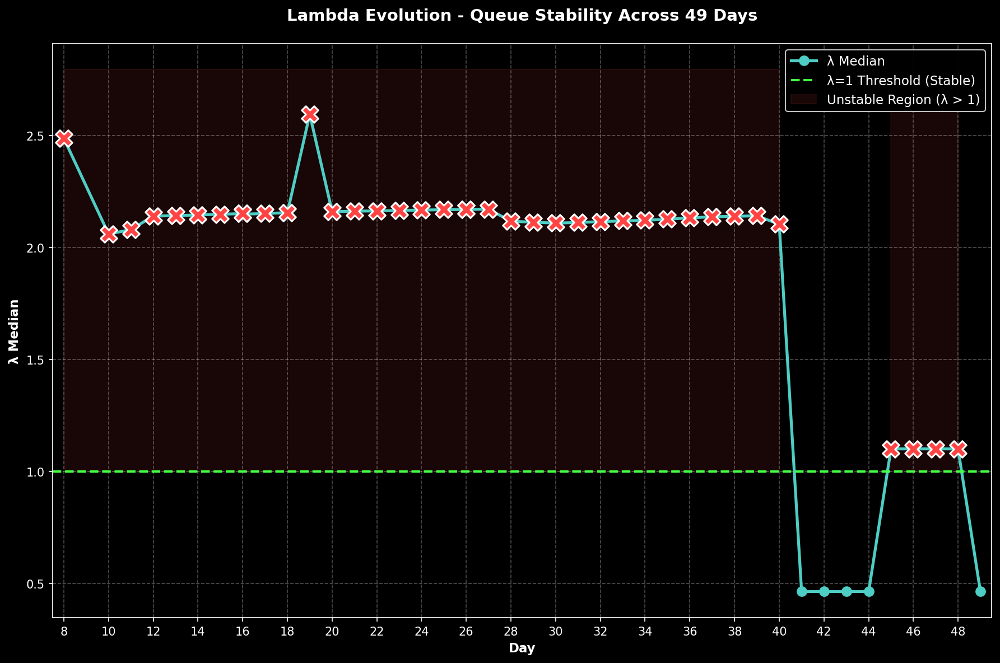

# Daily Tracker — Day-by-Day Change Log

> 🌐 **EN** | [中文](../zh/updates/daily-tracker.md)

**Last Updated: April 17, 2026 (Day 49)**

This page tracks daily changes across all model inputs, compares model predictions against observed data, and flags breaches as they occur.

---

## Model vs Actual — Divergence Summary

### Divergence Heatmap

Day-by-day percentage deviation across all 6 tracked metrics (37 days). Red = actual exceeds model, blue = actual below model. Lambda divergence dominates from Day 3 onward (+240% → +360%). Drone divergence extreme from Day 11 onward (actual 6-45 vs model ~130). BMs oscillate in 3-13 range (Days 12-25), drop to historic 0 on Day 26, then **MASSIVE REBOUND on Day 27: 0→15 BMs detected** — largest daily BM surge since Day 2 (28 BMs), shattering zero-BM milestone. **Day 35: 18 BMs + 47 drones (65 total); IRAN ESCALATES FURTHER: 16 BMs intercepted (89% daily rate — 2nd day <90% since start), 1 fell sea, 1 fell land; 40 drones intercepted, 7 fell UAE; 0 deaths, 12 injuries (7 Nepalese + 5 Indian from Ajban debris); Habshan gas complex fire from interception debris — operations suspended; Iran rejects US 15-point ceasefire via Pakistan, issues counter-demands; Iran expands Hormuz passage to Philippines; 3 ships attempt new Oman coast route; Airport 53% capacity; Oil: WTI SURPASSES Brent (rare inversion) — WTI $111.54, Brent ~$109.03; VLCC $480K/d; Hormuz: ~12 crossings (up from ~4), Philippines added to selective passage; Polymarket ceasefire-by-Apr-30: ~22% (down from ~25%); λ=2.127 UNSTABLE; P(λ>1)=100%; 5/5 cascade breaches — FIRST TIME ALL 5 BREACHED (launcher, drone_stockpile, casualties, new_weapon, interception_day); Drone stockpile EXHAUSTED (2,085 vs 2,000 estimate = -85).** **Day 34: 19 BMs + 26 drones (45 total); IRAN BM ESCALATION — highest BM since Day 4 (likely response to US Isfahan strikes); Trump primetime address: war "nearing completion," threatens Iran power grid; UK 30+ nation Hormuz summit; Oil surges: Brent $111.69 (+$6.83); Polymarket ceasefire-by-Apr-30 collapses to ~25% (from ~59%); λ=2.122 UNSTABLE; 3/5 cascade breaches (launcher, drone_stockpile, interception_day).** **Day 33: 5 BMs + 35 drones (40 total); 1 Bangladeshi killed by drone debris Fujairah; 2 injured (Indian in UAQ); Kuwait airport fuel tanks struck by Iranian drone; Trump says war could end 2-3 weeks; Iran FM says prepared for 6+ months; oil sharply lower; λ=2.120 UNSTABLE; 3/5 cascade breaches (launcher, drone_stockpile, new_weapon).**


### 6-Panel Comparison

Side-by-side model (blue) vs actual (red) with ribbon fill showing the gap. Airport (green) was positive divergence until Day 17 DXB crash. Lambda (bottom-right) shows deep cascade zone. Drone stockpile (bottom-center) breaches 30% threshold on Day 9. Day 36 data included: **23 BMs + 56 drones (79 total)**, λ=2.133 (marginal uptick from 2.127); 0 deaths, 11 injuries; Trump 48h ultimatum; Bushehr nuclear strike; US aircraft downed; **Day 35 data included: **18 BMs + 47 drones (65 total)**, λ=2.127 (marginal uptick from 2.122); 0 deaths, 12 injuries (7 Nepalese + 5 Indian); Iran escalates further; Habshan gas complex fire; all 5 cascade breaches breached (first time); WTI surpasses Brent (rare inversion); DXB 53%; Polymarket drops to ~22%. **Day 34: 19 BMs + 26 drones (45 total)**, λ=2.122 (marginal uptick from 2.120); 0 deaths, ~3 injuries; Iran BM escalation (highest since Day 4); Trump primetime address; oil surges; DXB 55%. **Day 33: 5 BMs + 35 drones (40 total)**, λ=2.120 (marginal uptick from 2.116); 1 killed, 2 injured from debris; Kuwait airport fuel tanks hit by Iranian drone; DXB 52%; Trump signals war could end 2-3 weeks. **Day 32: 8 BMs + 4 cruise missiles + 36 drones (48 total)**, λ=2.116 (marginal uptick from 2.113); 0 deaths, 4 injured from debris; DXB 55%; CRUISE MISSILES RETURN; Kuwaiti VLCC Al Salmi hit; Polymarket expires NO. **Day 31: 11 BMs + 27 drones (38 total)**, λ=2.113 (marginal uptick from 2.110); 0 deaths; DXB 60%; Houthis enter war.


### Scorecard & Verdict Timeline

Stacked divergence shows lambda (purple) dominating total model error. Verdict timeline: model predicted METASTABLE for all 20 days — reality crossed to UNSTABLE on Day 3 and never returned.


### Lambda Evolution

λ jumped from 0.47 → 1.70 on Day 3 (Hormuz closure), peaked at 2.71 on Day 9 (drone stockpile breach + BM rebound), then eased to a plateau ~2.1 from Day 10 onward. Days 12-18 showed remarkable stability at 2.14-2.16. Day 19 saw λ surge to 2.596 on BM rebound signal (3-day acceleration 7→10→13). Days 20-25: λ holds steady at ~2.16-2.17 as BMs remain low (7→4→3→4→7→5). Day 26: λ = 2.171 — marginal uptick from 2.170 despite historic 0 BMs. Day 27: λ = 2.172 — marginal uptick from 2.171 despite MASSIVE BM REBOUND (0→15: largest since Day 2); 2 killed Abu Dhabi; Jebel Ali fire. **Day 35: λ = 2.127** — marginal uptick from 2.122; BMs ESCALATE 19→18 (sustained high); 47 drones detected (highest since Day 2: 332); 0 killed, 12 injured (7 Nepalese + 5 Indian from Ajban debris); Habshan gas complex fire; Iran rejects US ceasefire, issues counter-demands; Iran expands Hormuz to Philippines; 3 ships attempt Oman route; WTI $111.54 SURPASSES Brent $109.03 (rare inversion); VLCC $480K/d; Hormuz ~12 crossings (up from ~4); Polymarket ceasefire-by-Apr-30 drops to ~22%; P(λ>1)=100%; **FIRST TIME: 5/5 cascade breaches (launcher, drone_stockpile, casualties, new_weapon, interception_day)**; Daily BM interception 89% (2nd day <90%); Drone stockpile EXHAUSTED (2,085 vs 2,000 = -85). **Day 34: λ = 2.122** — marginal uptick from 2.120; BMs SURGE 5→19 (highest since Day 4); 26 drones detected; 0 killed, ~3 injuries; Trump primetime address: war "nearing completion"; UK 30+ nation Hormuz summit; oil surges Brent $111.69 (+$6.83); Polymarket ceasefire-by-Apr-30 COLLAPSES to ~25% (from ~59%); P(λ>1)=100%; 3/5 breaches. **Day 33: λ = 2.120** — marginal uptick from 2.116; BMs decline 8→5 (−38%); 35 drones detected; 1 killed Bangladeshi, 2 injured; Kuwait airport fuel tanks struck; Trump signals 2-3 week war end; Iran FM says prepared for 6+ months; oil sharply lower; P(λ>1)=100%; 3/5 breaches. **Day 36 cumulative: 498 BMs, 2,141 drones, 23 cruise missiles; 13 dead, 217 injured; Trump 48h ultimatum + Bushehr nuclear strike escalate to nuclear dimension.** **Day 35 cumulative: 475 BMs, 2,085 drones, 23 cruise missiles; ~13 dead, ~206 injured.**



### Ballistic Missile Trajectory

The model's exponential decay assumption (β=0.25/day) broke down from Day 5 onward. Days 5→9: 3→7→9→16→17 showed an accelerating rebound. Post-rebound (Days 10-25): BMs oscillate in 3-13 range with noisy pattern (12→9→6→10→7→9→4→7→10→13→7→4→3→4→7→5). Day 26: 0 BMs — historic first day without ballistic missiles. Day 27: MASSIVE BM REBOUND 0→15 (largest since Day 2: 28 BMs) — shattering zero-BM milestone. **Day 35: 18 BMs + 47 drones (65 total); BM SUSTAINS HIGH 19→18; DRONES SURGE to 47 (highest since Day 2: 332); 16 BMs intercepted (89.5% daily rate — 2nd day <90% interception); 1 fell sea, 1 fell land; 40 drones intercepted, 7 fell UAE; 0 deaths, 12 injuries (7 Nepalese + 5 Indian from Ajban debris); Habshan gas complex fire from debris; Iran rejects US 15-point ceasefire, issues counter-demands; Iran expands Hormuz passage to Philippines; 3 ships attempt Oman coast route; WTI $111.54 SURPASSES Brent $109.03 (rare inversion); VLCC $480K/d; Hormuz ~12 crossings (up from ~4); Polymarket ceasefire-by-Apr-30 drops to ~22%; λ=2.127 UNSTABLE; 5/5 cascade breaches (first time all 5); ONE MONTH + FIVE DAYS of sustained conflict.** **Day 34: 19 BMs + 26 drones (45 total); BM SURGES 5→19 (+280%, highest since Day 4); Iran escalates likely in response to US Isfahan strikes; 0 deaths, ~3 injuries; Trump primetime address; UK Hormuz summit; oil surges Brent $111.69; ONE MONTH + FOUR DAYS of sustained conflict.** **Day 33: 5 BMs + 35 drones (40 total); BM declines 8→5 (−38%); 1 Bangladeshi killed by drone debris Fujairah; 2 injured; Kuwait airport fuel tanks struck; Trump signals 2-3 week war end; Iran FM says 6+ months prepared; oil sharply lower; ONE MONTH + THREE DAYS of sustained conflict.** **Day 32: 8 BMs + 4 cruise missiles + 36 drones (48 total); CRUISE MISSILES RETURN (first since Day 12); BM declines 11→8 (−27%); drones surge 27→36 (+33%); Kuwaiti VLCC Al Salmi hit at Dubai Port; Polymarket ceasefire-by-Mar-31 expires at ~1%; ONE MONTH + TWO DAYS of sustained conflict.** Days 26-35 show extreme BM volatility: 0→15→6→20→16→11→8→5→19→18, with no convergence to model decay. **Day 30: 16 BMs + 42 drones (58 total); ONE-MONTH MARK.** **Day 29: 20 BMs (BM SURGE 6→20, +233%); 37 drones; 1 killed Kezad.** Oil: WTI $111.54, Brent ~$109.03 (WTI surpasses Brent — rare inversion). VLCC ~$480K/day. Hormuz ~12 selective crossings via toll system (up from ~4). 3 CSGs in theater. Cumulative: 475 BMs, 2,085 drones, 23 cruise. Drone stockpile EXHAUSTED (exceeded 2,000 estimate by 85 drones).


---

## Attack Volume Tracker

### Daily New Attacks

| Day | Date | BM (New) | Model BM | Drones | Model Drones | Cruise | Total | Trend |
|-----|------|----------|----------|--------|-------------|--------|-------|-------|
| 1 | Feb 28 | **137** | — | 209 | — | 0 | 346 | Opening salvo |
| 2 | Mar 1 | **28** | — | 332 | — | 2 | 362 | Peak drone day |
| 3 | Mar 2 | **9** | ~19 | 148 | ~130 | 6 | 163 | BM faster than model decay |
| 4 | Mar 3 | **12** | ~14 | 123 | ~130 | 0 | 135 | BM uptick (noise?) |
| 5 | Mar 4 | **3** | ~10 | 129 | ~130 | 0 | 132 | BM near-zero |
| 6 | Mar 5 | **7** | ~8 | 131 | ~130 | 0 | 138 | BM rebound |
| 7 | Mar 6 | **9** | ~6 | 112 | ~130 | 0 | 121 | ⚠️ BM broke monotonic decay |
| 8 | Mar 7 | **16** | ~4 | ~125 | ~130 | 0 | 141 | ⚠️⚠️ BM REBOUND — highest since Day 2 |
| **9** | **Mar 8** | **17** | ~3 | 117 | ~130 | 0 | **134** | ⚠️⚠️ BM sustained high — 16→17 |
| 10 | Mar 9 | **12** | ~2 | 110 | ~130 | 0 | 122 | BM drops 17→12: rebound breaks |
| 11 | Mar 10 | 9 | ~1 | 35 | ~130 | 0 | 44 | ⚠️ Drone collapse: 110→35 (−68%) |
| **12** | **Mar 11** | **6** | ~1 | **39** | ~130 | **7** | **52** | ⚠️ First cruise missiles since Day 3; BM 3rd decline; drones −68% recovery |
| 13 | Mar 12 | 10 | ~1 | 26 | ~130 | 0 | 36 | BM uptick 6→10 (+67%); drones collapse further |
| **14** | **Mar 13** | **7** | ~1 | **~27** | ~130 | 0 | **~34** | BM resumes decline 10→7; drones stable at record low; **new record low total** |
| 15 | Mar 14 | **9** | ~1 | 33 | ~130 | 0 | 42 | 9 BMs + 33 drones (@modgovae via Gulf News); Fujairah fire from debris |
| **16** | **Mar 15** | **4** | ~0 | **6** | ~130 | 0 | **10** | @modgovae CORRECTED: historic low (4 BM + 6 drones = 10 total) |
| **17** | **Mar 16** | **7** | ~0 | **25** | ~130 | 0 | **32** | Rebound from Day 16 low; 1 BM hits civilian car; DXB fuel tank hit; MQ-9A destroyed Kuwait |
| **18** | **Mar 17** | **10** | ~0 | **45** | ~130 | 0 | **55** | @modgovae: 10 BMs + 45 drones; **GCAA closes airspace** (first since Day 2); Fujairah port hit; UK air sorties begin |
| **19** | **Mar 18** | **13** | ~0 | **27** | ~130 | 0 | **40** | @modgovae: 13 BMs + 27 drones; all BMs intercepted; Brent $108.78 (conflict high); VLCC $445K/d record; Fed meeting begins |
| **20** | **Mar 19** | **7** | ~0 | **15** | ~130 | 0 | **22** | **Lowest UAE volume of conflict (22 total)**; Iran hits Qatar Ras Laffan LNG (17% capacity); Brent $113; oil briefly $119 |
| **21** | **Mar 20** | **4** | ~0 | **26** | ~130 | 0 | **30** | Eid al-Fitr; BMs tie historic low (4); drones rebound 15→26; Brent eases to $107; Polymarket 8%; foreign airlines still banned from DXB |
| **22** | **Mar 21** | **3** | ~0 | **8** | ~130 | 0 | **11** | **Second-lowest (Day 16: 10)**; US strikes Natanz nuclear facility; Iran offers Japan Hormuz passage; Diego Garcia targeted unsuccessfully; Trump mulls 'winding down' war |
| **23** | **Mar 22** | **4** | ~0 | **25** | ~130 | 0 | **29** | Rebounds from Day 22 low (11→29); Trump 48-hr Hormuz ultimatum; Iran threatens full closure; US licenses 140M bbl Iranian crude sale |
| **24** | **Mar 23** | **7** | ~0 | **16** | ~130 | 0 | **23** | BMs rebound 4→7; drones decline 25→16; Trump ultimatum expires, no major escalation occurs; Hormuz transits expanding to ~22/day |
| **25** | **Mar 24** | **5** | ~0 | **17** | ~130 | 0 | **22** | BMs decline 7→5; drones rebound 16→17; continued selectivity in attack pattern; Pakistan/Turkey/Egypt/Oman mediation active |
| **26** | **Mar 25** | **0** | ~0 | **9** | ~130 | 0 | **9** | **HISTORIC: First day with 0 BMs; all-time low total (9)** |
| **27** | **Mar 26** | **15** | ~0 | **11** | ~130 | 0 | **26** | **MASSIVE BM REBOUND: 0→15 (largest since Day 2); 2 killed Abu Dhabi; Jebel Ali fire** |
| **28** | **Mar 27** | **6** | ~0 | **9** | ~130 | 0 | **15** | BM sharp decline 15→6 (−60%); Chinese ships turned from Hormuz; Trump delays energy strikes 10d |
| **29** | **Mar 28** | **20** | ~0 | **37** | ~130 | 0 | **57** | **BM SURGE 6→20 (+233%); drone surge 9→37; 1 killed Kezad debris; WTI hits $100; war 1-month mark** |
| **30** | **Mar 29** | **16** | ~0 | **42** | ~130 | 0 | **58** | **BM eases 20→16 (−20%); drone surge 37→42; ONE-MONTH MARK; DXB 55%; ceasefire odds 12%** |
| **31** | **Mar 30** | **11** | ~0 | **27** | ~130 | 0 | **38** | BM declines 16→11 (−31%); drones decline 42→27 (−36%); **HOUTHIS ENTER WAR** with 2nd Israel strike; Bab al-Mandeb threatened; Brent $115 (+55% MTD record) |
| **32** | **Mar 31** | **8** | ~0 | **36** | ~130 | **4** | **48** | **CRUISE MISSILES RETURN (first since Day 12); 8 BMs + 4 cruise + 36 drones; Kuwaiti VLCC Al Salmi hit at Dubai Port** |
| **33** | **Apr 1** | **5** | ~0 | **35** | ~130 | **0** | **40** | BM declines 8→5 (−38%); 35 drones detected; 1 killed Bangladeshi (drone debris Fujairah); 2 injured (Indian in UAQ); Kuwait airport fuel tanks hit by Iranian drone |
| **36** | **Apr 4** | **23** | ~0 | **56** | ~130 | **0** | **79** | **↑ Jump from Day 35's 65; Trump 48-hour ultimatum; Bushehr nuclear plant targeted; US aircraft shot down; US strikes B1 bridge** |
| **37** | **Apr 5** | **9** | ~0 | **50** | ~130 | **1** | **60** | **↓ De-escalation in BMs (23→9, −61%); cruise missile returns (1); Borouge petrochemical fires from debris; US pilot rescued from Iran; Trump deadline T-24h** |
| **34** | **Apr 2** | **19** | ~0 | **26** | ~130 | **0** | **45** | **BM SURGES 5→19 (+280%, highest since Day 4); Iran escalates in response to US Isfahan strikes; 0 killed; ~3 injuries from debris; Trump primetime address** |
\| \*\*35\*\* \| \*\*Apr 3\*\* \| \*\*18\*\* \| ~0 \| \*\*47\*\* \| ~130 \| \*\*0\*\* \| \*\*65\*\* \| \*\*BM SUSTAINS 19→18; DRONES SURGE to 47 \(highest since Day 2\); 16 BMs intercepted \(89\.5% daily rate — 2nd day <90%\); 1 fell sea, 1 fell land; 40 drones intercepted, 7 fell UAE; Habshan gas complex fire; Iran rejects US ceasefire; WTI surpasses Brent\*\* \|
| **36** | **Apr 4** | **23** | ~0 | **56** | ~130 | **0** | **79** | **↑ Jump from Day 35's 69; Trump 48-hour ultimatum; Bushehr nuclear plant targeted; US aircraft shot down; US strikes B1 bridge** |

| **38** | **Apr 6** | **12** | ~0 | **19** | ~130 | **2** | **33** | **↑ BMs rebound 9→12; cruise missiles again (2); IRAN REJECTS CEASEFIRE; Trump extends deadline to Tue Apr 7 8PM ET; Islamabad Accord 45-day framework proposed; Oil drops on ceasefire framework** |
| **39** | **Apr 7** | **1** ✓ | ~0 | **11** ✓ | ~130 | **0** | **12** | **@modgovae OFFICIAL (corrected): 1 BM intercepted, 11 drones; TRUMP "POWER PLANT DAY" DEADLINE 8PM ET; Iran holds back on deadline day; Ceasefire announced ~11 PM ET; Polymarket collapses to 4% then rebounds** |
| **40** | **Apr 8** | **17** | ~0 | **35** | ~130 | **0** | **52** | **🕊️ CEASEFIRE DAY: 17 BMs (16 intercepted, 1 fell sea) + 35 drones — attacks CONTINUE despite ceasefire announcement; Habshan gas complex fires (3 injured); Hormuz technically open but only 2 ships in 12h; Oil crashes ~17% (WTI $93.10, Brent $91.50); Polymarket ceasefire surges to ~97%** |
| **41** | **Apr 9** | **0** ✅ | ~0 | **0** ✅ | ~130 | **0** | **0** | **🕊️ CEASEFIRE DAY 2: FIRST ZERO-ATTACK DAY since Feb 28 conflict start — ceasefire holds overnight; Chinese tankers queue at Hormuz testing passage; WTI rebounds to $101.28; EASA decision April 10; Islamabad talks scheduled; λ collapses to 0.463 (METASTABLE)** |
| **42** | **Apr 10** | **0** ✅ | ~0 | **0** ✅ | ~130 | **0** | **0** | **🕊️ CEASEFIRE DAY 3: Second consecutive zero-attack day; EASA airspace review completed — decision pending; Islamabad talks in progress (VP Vance leads US, FM Araghchi/Speaker Ghalibaf lead Iran); λ = 0.463 (METASTABLE); Trump accuses Iran of not opening Hormuz properly; Iran threatens closure if violations occur; Hormuz: 7 vessels crossed Thursday (up from 5 Wed), 600+ vessels stranded** |
| **43** | **Apr 11** | **0** ✅ | ~0 | **0** ✅ | ~130 | **0** | **0** | **🕊️ CEASEFIRE DAY 4: Third consecutive zero-attack day; HISTORIC ISLAMABAD TALKS BEGIN — first direct US-Iran talks since 1979 (VP Vance + Witkoff + Kushner vs FM Araghchi + Speaker Ghalibaf); US Navy crosses Hormuz for first time since war (Iran calls violation); EASA extends ban to Apr 24; λ = 0.463 (METASTABLE); Hormuz: ~10 vessels crossed (up from 7), 600+ stranded; Oil softens: WTI $95.50, Brent $96.66** |
| **44** | **Apr 12** | **0** ✅ | ~0 | **0** ✅ | ~130 | **0** | **0** | **🕊️ CEASEFIRE DAY 5: Fourth consecutive zero-attack day; ISLAMABAD TALKS COLLAPSE — VP Vance announces failure; TRUMP DECLARES NAVAL BLOCKADE of Hormuz effective Apr 13 10AM ET; Iran warns 'whirlpool of destruction'; Oil futures surge ~7%; DXB 80%; Polymarket ceasefire crashes 78%→55%** |
| **45** | **Apr 13** | **0** ✅ | ~0 | **0** ✅ | ~130 | **0** | **0** | **⚓ BLOCKADE DAY 1: Fifth consecutive zero-attack day; US NAVAL BLOCKADE BEGINS 10AM ET — Hormuz effectively re-closed; oil surges ~8% (WTI $103, Brent $101.82); Iran calls blockade 'piracy'; Hezbollah rejects Israel talks; λ JUMPS to 1.101 (UNSTABLE) — first unstable since ceasefire; Polymarket drops to ~45%** |
| **46** | **Apr 14** | **0** ✅ | ~0 | **0** ✅ | ~130 | **0** | **0** | **⚓ BLOCKADE DAY 2: Sixth consecutive zero-attack day; blockade continues; 14 ships transit Hormuz since blockade (~11 today); Pakistan arranging second round US-Iran talks; Iran considers pausing Hormuz shipping; oil DROPS ~6% (WTI $97, Brent $97.89); China condemns blockade; λ = 1.101 (UNSTABLE); Polymarket ceasefire extension by Apr 21 at 71%** |
| **47** | **Apr 15** | **0** ✅ | ~0 | **0** ✅ | ~130 | **0** | **0** | **🕊️ CEASEFIRE DAY 7 / IN-PRINCIPLE EXTENSION: Seventh consecutive zero-attack day; US and Iran have 'in-principle agreement' to extend ceasefire per regional officials; US officially states has not formally agreed (Jerusalem Post); Pakistani Army Chief Munir arrives Tehran; White House 'optimistic'; second round Islamabad talks 'very likely' next week; Trump says war 'close to over'; oil: WTI $91.8, Brent $95.5; λ = 1.101 (UNSTABLE)** |
| **48** | **Apr 16** | **0** ✅ | ~0 | **0** ✅ | ~130 | **0** | **0** | **🕊️ CEASEFIRE DAY 8 / BREAKTHROUGH HOPES: Eighth consecutive zero-attack day; Al Jazeera 'hopes grow for breakthrough as Pakistan mediates'; Bloomberg 'Pakistan steps up mediation'; second round talks expected before Apr 21 expiry; Trump says war 'close to over'; oil: Brent $94.89, WTI $91.91; DXB 82%; λ = 1.101 (UNSTABLE)** |
| **49** | **Apr 17** | **0** ✅ | ~0 | **0** ✅ | ~130 | **0** | **0** | **🕊️ CEASEFIRE DAY 9 / HORMUZ DECLARED OPEN: Ninth consecutive zero-attack day; IRAN FM ARAGHCHI DECLARES HORMUZ "COMPLETELY OPEN FOR REMAINING PERIOD OF CEASEFIRE" — MAJOR STATUS CHANGE from blockade/closed to OPEN; 14 vessel crossings today (up from 9); LEBANON 10-DAY CEASEFIRE BEGINS (Hezbollah-Israel); Trump: "if there's no deal, fighting resumes"; oil eases further: Brent $96, WTI $94.5; VLCC $360K/d (declining); DXB 85% — recovery accelerating; Polymarket extension ~72%; λ = 0.463 (METASTABLE SHIFT) — P(λ>1) collapses from 67.3% to 5.1%; 2/5 breaches** |

### Cumulative Totals

| Day | Date | Cum. BM | Cum. Drones | Cum. Cruise | Cum. Total |
|-----|------|---------|-------------|-------------|------------|
| 1 | Feb 28 | 137 | 209 | 0 | 346 |
| 2 | Mar 1 | 165 | 541 | 2 | 708 |
| 3 | Mar 2 | 174 | 689 | 8 | 871 |
| 4 | Mar 3 | 186 | 812 | 8 | 1,006 |
| 5 | Mar 4 | 189 | 941 | 8 | 1,138 |
| 6 | Mar 5 | 196 | 1,072 | 8 | 1,276 |
| 7 | Mar 6 | 205 | 1,184 | 8 | 1,397 |
| 8 | Mar 7 | 221 | ~1,309 | 8 | ~1,538 |
| **9** | **Mar 8** | **238** | **~1,422** | **8** | **~1,668** |
| 10 | Mar 9 | 250 | ~1,536 | 8 | ~1,794 |
| 11 | Mar 10 | 259 | ~1,571 | 8 | ~1,838 |
| **12** | **Mar 11** | **265** | **~1,610** | **15** | **~1,890** |
| 13 | Mar 12 | 275 | ~1,636 | 15 | ~1,926 |
| **14** | **Mar 13** | **282** | **~1,663** | **15** | **~1,960** |
| 15 | Mar 14 | 294 | ~1,696 | 15 | ~2,005 |
| **16** | **Mar 15** | **298** | **~1,702** | **15** | **~2,015** |
| **17** | **Mar 16** | **~305** | **~1,727** | **15** | **~2,047** |
| **18** | **Mar 17** | **314** | **~1,672** | **15** | **~2,001** |
| **19** | **Mar 18** | **327** | **~1,699** | **15** | **~2,041** |
| **20** | **Mar 19** | **334** | **~1,714** | **15** | **~2,063** |
| **21** | **Mar 20** | **338** | **~1,740** | **15** | **~2,093** |
| **22** | **Mar 21** | **341** | **1,748** | **15** | **2,104** |
| **23** | **Mar 22** | **345** | **1,773** | **15** | **2,133** |
| **24** | **Mar 23** | **352** | **1,789** | **15** | **2,156** |
| **25** | **Mar 24** | **357** | **1,806** | **15** | **2,178** |
| **26** | **Mar 25** | **357** | **1,815** | **15** | **2,187** |
| **27** | **Mar 26** | **372** | **1,826** | **15** | **2,213** |
| **28** | **Mar 27** | **378** | **1,835** | **15** | **2,228** |
| **29** | **Mar 28** | **398** | **1,872** | **15** | **2,285** |
| **30** | **Mar 29** | **414** | **1,914** | **15** | **2,343** |
| **31** | **Mar 30** | **425** | **1,941** | **15** | **2,381** |
| **32** | **Mar 31** | **433** | **1,977** | **19** | **2,429** |
| **33** | **Apr 1** | **438** | **2,012** | **19** | **2,469** |
| **34** | **Apr 2** | **457** | **2,038** | **19** | **2,514** |
\| \*\*35\*\* \| \*\*Apr 3\*\* \| \*\*475\*\* \| \*\*2,085\*\* \| \*\*23\*\* \| \*\*2,583\*\* \|
| **36** | **Apr 4** | **498** | **2,141** | **23** | **2,662** |
| **37** | **Apr 5** | **507** | **2,291** | **24** | **2,822** |
| **38** | **Apr 6** | **519** | **2,210** | **26** | **2,755** |
| **39** | **Apr 7** | **520** ✓ | **2,221** ✓ | **26** | **2,767** |
| **40** | **Apr 8** | **537** | **2,256** | **26** | **2,819** |
| **41** | **Apr 9** | **537** | **2,256** | **26** | **2,819** |
| **42** | **Apr 10** | **537** | **2,256** | **26** | **2,819** |
| **43** | **Apr 11** | **537** | **2,256** | **26** | **2,819** |
| **44** | **Apr 12** | **537** | **2,256** | **26** | **2,819** |
| **45** | **Apr 13** | **537** | **2,256** | **26** | **2,819** |
| **46** | **Apr 14** | **537** | **2,256** | **26** | **2,819** |
| **47** | **Apr 15** | **537** | **2,256** | **26** | **2,819** |
| **48** | **Apr 16** | **537** | **2,256** | **26** | **2,819** |
| **49** | **Apr 17** | **537** | **2,256** | **26** | **2,819** |

---

## Interception Rate Tracker

| Day | Date | BM Detected | BM Intercepted | Day Rate | Cum. Rate | Threshold (<90%) | Status |
|-----|------|-------------|----------------|----------|-----------|-------------------|--------|
| 1 | Feb 28 | 137 | 132 | 96.4% | 96.4% | OK | OK |
| 2 | Mar 1 | 28 | 20 | 71.4% | 92.1% | ⚠️ Day breach | Cum OK |
| 3 | Mar 2 | 9 | 9 | 100% | 93.6% | OK | OK |
| 4 | Mar 3 | 12 | 11 | 91.7% | 93.0% | OK | OK |
| 5 | Mar 4 | 3 | 3 | 100% | 93.1% | OK | OK |
| 6 | Mar 5 | 7 | 6 | **85.7%** | 93.4% | ⚠️ Day breach, 1 landed | **ALERT** |
| 7 | Mar 6 | 9 | 9 | 100% | 92.7% | OK | OK |
| 8 | Mar 7 | 16 | 15 | 93.8% | 92.8% | OK | ⚠️ BM rebound to 16 |
| **9** | **Mar 8** | **17** | **16** | **94.1%** | **92.9%** | OK | ⚠️ BM sustained high: 16→17 |
| 10 | Mar 9 | 12 | 11 | 91.7% | 92.8% | OK | BM drops 17→12: rebound breaks |
| 11 | Mar 10 | 9 | 8 | 88.9% | 92.7% | ⚠️ Day breach | 1 BM fell sea; daily rate <90% |
| **12** | **Mar 11** | **6** | **6** | **100%** | **92.8%** | OK | BM all intercepted; 7 cruise intercepted; drones fell in UAE incl. 2 near DXB |
| 13 | Mar 12 | 10 | 10 | 100% | 93.1% | OK | All 10 BM intercepted per @modgovae; no cruise; 26 drones engaged |
| **14** | **Mar 13** | **7** | **~7** | **~100%** | **93.3%** | OK | BM resumes decline 10→7; debris hits DIFC building; ~27 drones engaged |
| 15 | Mar 14 | 9 | 8 | 88.9% | 93.1% | ⚠️ Day breach | 1 BM fell sea; Fujairah debris fire |
| **16** | **Mar 15** | **4** | **4** | **100%** | **93.2%** | OK | @modgovae CORRECTED: all 4 BM intercepted; historic low volume |
| **17** | **Mar 16** | **7** | **6** | **85.7%** | **93.0%** | ⚠️ Day breach | 1 BM hits civilian car Abu Dhabi; daily rate <90% (4th breach in conflict) |
| **18** | **Mar 17** | **10** | **10** | **100%** | **~92.7%** | OK | @modgovae: 10 BMs all intercepted; airspace closed then reopened by 5:05 AM |
| **19** | **Mar 18** | **13** | **13** | **100%** | **~92.7%** | OK | @modgovae: 13 BMs all intercepted; cumulative 327 BMs; rate stable at 92.7% |
| **20** | **Mar 19** | **7** | **7** | **100%** | **~92.8%** | OK | @modgovae: 7 BMs all intercepted; cumulative 334 BMs; 3rd consecutive 100% day rate |
| **21** | **Mar 20** | **4** | **4** | **100%** | **~92.9%** | OK | @modgovae: 4 BMs all intercepted; cumulative 338 BMs; 4th consecutive 100% daily rate |
| **22** | **Mar 21** | **3** | **3** | **100%** | **~93.0%** | OK | 3 BMs all intercepted; cumulative 341 BMs; 5th consecutive 100% daily rate; 8 drones engaged |
| **23** | **Mar 22** | **4** | **4** | **100%** | **~93.0%** | OK | 4 BMs all intercepted; cumulative 345 BMs; 6th consecutive 100% daily rate; 25 drones engaged (~21 intercepted) |
| **24** | **Mar 23** | **7** | **7** | **100%** | **~93.0%** | OK | 7 BMs all intercepted; cumulative 352 BMs; 7th consecutive 100% daily rate; 16 drones engaged (~14 intercepted) |
| **25** | **Mar 24** | **5** | **5** | **100%** | **~93.0%** | OK | 5 BMs all intercepted; cumulative 357 BMs; 8th consecutive 100% daily rate; 17 drones detected, ~14 intercepted (~82%) |
| **26** | **Mar 25** | **0** | **0** | **N/A** | **93.0%** | N/A (0 BMs) | **HISTORIC: 0 BMs** |
| **27** | **Mar 26** | **15** | **15** | **100%** | **~93.1%** | OK | **All 15 BMs intercepted; debris kills 2 in Abu Dhabi; 9th consecutive 100% daily rate** |
| **28** | **Mar 27** | **6** | **6** | **100%** | **~93.2%** | OK | **All 6 BMs intercepted; 10th consecutive 100% daily rate; Chinese ships turned from Hormuz** |
| **29** | **Mar 28** | **20** | **20** | **100%** | **~93.2%** | OK | **All 20 BMs intercepted; 11th consecutive 100% daily rate; 1 killed + 6 injured from debris at Kezad** |
| **30** | **Mar 29** | **16** | **16** | **100%** | **~93.2%** | OK | **All 16 BMs intercepted; 12th consecutive 100% daily rate; cumulative 414 BMs; ONE-MONTH MARK** |
| **31** | **Mar 30** | **11** | **11** | **100%** | **~93.2%** | OK | **All 11 BMs intercepted; 13th consecutive 100% daily rate; 2/27 drones fell UAE; cumulative 425 BMs; Houthis enter war** |
| **32** | **Mar 31** | **8** | **8** | **100%** | **~93.3%** | OK | **All 8 BMs intercepted; 14th consecutive 100% daily rate; 4 cruise missiles also engaged; ~32/36 drones intercepted** |
| **33** | **Apr 1** | **5** | **5** | **100%** | **~93.3%** | OK | **All 5 BMs intercepted; 15th consecutive 100% daily rate; 1 Bangladeshi killed by drone debris; 2 injured; Kuwait airport fuel hit** |
| **34** | **Apr 2** | **19** | **17** | **89.5%** | **~93.1%** | ⚠️ Day breach | **17/19 BMs intercepted; 1 fell sea, 1 fell land; BM daily rate <90% — consecutive 100% streak breaks at 15; highest BM volume since Day 4** |
| **35** | **Apr 3** | **18** | **16** | **88.9%** | **~93.1%** | ⚠️ Day breach | **16/18 BMs intercepted; 1 fell sea, 1 fell land; BM daily rate <90% — 2nd consecutive day below threshold; 47 drones detected; cumulative interception rate steady at 93.1%** |
| **36** | **Apr 4** | **23** | **21** | **91.3%** | **~95.4%** | ✓ OK | **21/23 BMs intercepted; 56 drones detected; 48 intercepted (85.7%); cumulative BM rate 95.4%; Bushehr nuclear strike escalation triggers Polymarket ceasefire surge to 57%** |
| **37** | **Apr 5** | **9** | **8** | **88.9%** | **~95.3%** | ⚠️ Day breach | **8/9 BMs intercepted (88.9% daily — 3rd consecutive day <91%); 1 fell sea; 1 cruise missile; 50 drones detected (42 intercepted, 84%); Borouge fires from debris; Trump deadline T-24h** |
| **38** | **Apr 6** | **12** | **11** | **91.7%** | **~92.3%** | OK | @modgovae confirmed: 12 BMs, 11 intercepted; 1 fell sea; cumulative 519 BMs; cruise missiles return (2) |
| **39** | **Apr 7** | **1** ✓ | **1** ✓ | **100%** | **~92.2%** | OK | @modgovae OFFICIAL (corrected): 1 BM all intercepted; Trump deadline day — Iran holds back; ceasefire announced end of day |
| **40** | **Apr 8** | **17** | **16** | **94.1%** | **~92.3%** | OK | 16/17 BMs intercepted; 1 fell sea; CEASEFIRE ANNOUNCED — attacks continue hours into truce; Habshan fires; Hormuz technically opens |
| **41** | **Apr 9** | **0** | **0** | **N/A** | **~92.3%** | N/A (0 BMs) | **🕊️ ZERO ATTACKS: First day with no BMs/drones/cruise missiles since Day 1; ceasefire holding; cumulative rate unchanged at ~92.3%** |
| **42** | **Apr 10** | **0** | **0** | **N/A** | **~92.3%** | N/A (0 BMs) | **🕊️ ZERO ATTACKS: Second consecutive day with no BMs/drones/cruise missiles; ceasefire holding; cumulative BM interception rate unchanged at ~92.3%** |
| **43** | **Apr 11** | **0** | **0** | **N/A** | **~92.3%** | N/A (0 BMs) | **🕊️ ZERO ATTACKS: Third consecutive day with no BMs/drones/cruise missiles; ceasefire holding; US Navy Hormuz crossing; cumulative BM interception rate unchanged at ~92.3%** |
| **44** | **Apr 12** | **0** | **0** | **N/A** | **~92.3%** | N/A (0 BMs) | **🕊️ ZERO ATTACKS: Fourth consecutive day — ceasefire holds but ISLAMABAD TALKS COLLAPSE; Trump announces Hormuz blockade; cumulative BM interception rate unchanged at ~92.3%** |
| **45** | **Apr 13** | **0** | **0** | **N/A** | **~92.3%** | N/A (0 BMs) | **⚓ ZERO ATTACKS: Fifth consecutive day — ceasefire technically holds; US NAVAL BLOCKADE BEGINS; Hormuz re-closed; cumulative BM interception rate unchanged at ~92.3%** |
| **46** | **Apr 14** | **0** | **0** | **N/A** | **~92.3%** | N/A (0 BMs) | **⚓ ZERO ATTACKS: Sixth consecutive day — blockade Day 2; ceasefire holds; second round talks discussed; cumulative BM interception rate unchanged at ~92.3%** |
| **47** | **Apr 15** | **0** | **0** | **N/A** | **~92.3%** | N/A (0 BMs) | **🕊️ ZERO ATTACKS: Seventh consecutive day — in-principle ceasefire extension agreement; White House optimistic; Pakistan Army Chief in Tehran; cumulative BM interception rate unchanged at ~92.3%** |
| **48** | **Apr 16** | **0** | **0** | **N/A** | **~92.3%** | N/A (0 BMs) | **🕊️ ZERO ATTACKS: Eighth consecutive day — breakthrough hopes grow; second round Islamabad talks expected before Apr 21 expiry; cumulative BM interception rate unchanged at ~92.3%** |
| **49** | **Apr 17** | **0** | **0** | **N/A** | **~92.3%** | N/A (0 BMs) | **🕊️ ZERO ATTACKS: Ninth consecutive day — Hormuz declared OPEN by Iran FM; Lebanon ceasefire begins; Trump warns 'if no deal, fighting resumes'; cumulative BM interception rate unchanged at ~92.3%** |

**Day 6 breach note:** 1 ballistic missile landed inside UAE territory on March 5 — first confirmed BM ground impact.

**Day 8 critical note:** 16 BMs detected — highest since Day 2 (28). Days 5→8 show **accelerating** trend: 3→7→9→16. This contradicts the exponential decay model and suggests either hidden TELs activated or resupply from deeper storage. Launcher depletion estimate revised from 85.7% to **~73%**.

**Day 9 critical note:** 17 BMs detected — surpasses Day 8. Consecutive high-volume days (16→17) confirm the rebound is structural, not a single-day anomaly. Launcher depletion estimate revised further to **~67%**. Drone stockpile breaches 30% threshold for the first time (28.9%).

**Day 10 note:** 12 BMs detected — first daily decline in 5 days, breaking the 3→7→9→16→17 accelerating trend. However, volume remains elevated well above model predictions (~2 BMs/day at this point in the decay curve). Launcher depletion estimate revised up to **~99%** — cumulative 250 BMs against 40 TELs suggests near-exhaustion.

**Day 11 note:** 9 BMs detected — second consecutive decline (12→9), confirming rebound has broken. Daily interception rate **88.9%** (8/9) breaches the 90% threshold for third time in the conflict (Days 2, 6, 11). Cumulative rate remains at 92.7%. The dramatic drone collapse (110→35, −68%) is unprecedented — possibly indicating stockpile conservation, launcher exhaustion, or strategic pivot.

---

## Drone Stockpile Tracker

| Day | Date | Daily Launched | Cum. Launched | Est. Remaining | % Remaining | Threshold (<30%) |
|-----|------|---------------|---------------|----------------|-------------|-------------------|
| 1 | Feb 28 | 209 | 209 | 1,791 | 89.6% | OK |
| 2 | Mar 1 | 332 | 541 | 1,459 | 73.0% | OK |
| 3 | Mar 2 | 148 | 689 | 1,311 | 65.6% | OK |
| 4 | Mar 3 | 123 | 812 | 1,188 | 59.4% | OK |
| 5 | Mar 4 | 129 | 941 | 1,059 | 53.0% | OK |
| 6 | Mar 5 | 131 | 1,072 | 928 | 46.4% | OK |
| 7 | Mar 6 | 112 | 1,184 | 816 | 40.8% | OK |
| 8 | Mar 7 | ~125 | ~1,309 | ~691 | 34.5% | Approaching |
| **9** | **Mar 8** | **117** | **~1,422** | **~578** | **28.9%** | **⚠️ BREACHED** |
| 10 | Mar 9 | 110 | ~1536 | ~464 | 23.2% | ⚠️ BREACHED |
| 11 | Mar 10 | 35 | ~1571 | ~429 | 21.4% | ⚠️ BREACHED |
| **12** | **Mar 11** | **39** | **~1,610** | **~390** | **19.5%** | **⚠️ BREACHED** |
| 13 | Mar 12 | 26 | ~1,636 | ~364 | 18.2% | ⚠️ BREACHED |
| **14** | **Mar 13** | **~27** | **~1,663** | **~337** | **16.9%** | **⚠️ BREACHED** |
| 15 | Mar 14 | 33 | ~1,696 | ~304 | 15.2% | ⚠️ BREACHED |
| **16** | **Mar 15** | **6** | **~1,702** | **~298** | **14.9%** | **⚠️ BREACHED** |
| **17** | **Mar 16** | **25** | **~1,727** | **~273** | **13.6%** | **⚠️ BREACHED** |
| **18** | **Mar 17** | **45** | **1,672†** | **~328** | **16.4%** | **⚠️ BREACHED** |
| **19** | **Mar 18** | **27** | **~1,699** | **~301** | **15.1%** | **⚠️ BREACHED** |
| **20** | **Mar 19** | **15** | **~1,714** | **~286** | **14.3%** | **⚠️ BREACHED** |
| **21** | **Mar 20** | **26** | **~1,740** | **~260** | **13.0%** | **⚠️ BREACHED** |
| **22** | **Mar 21** | **8** | **1,748** | **252** | **12.6%** | **⚠️ BREACHED** |
| **23** | **Mar 22** | **25** | **1,773** | **227** | **11.4%** | **⚠️ BREACHED** |
| **24** | **Mar 23** | **16** | **1,789** | **211** | **10.6%** | **⚠️ BREACHED** |
| **25** | **Mar 24** | **17** | **1,806** | **194** | **9.7%** | **⚠️ BREACHED** |
| **26** | **Mar 25** | **9** | **1,815** | **185** | **9.25%** | **⚠️ BREACHED** |
| **27** | **Mar 26** | **11** | **1,826** | **174** | **8.7%** | **⚠️ BREACHED** |
| **28** | **Mar 27** | **9** | **1,835** | **165** | **8.25%** | **⚠️ BREACHED** |
| **29** | **Mar 28** | **37** | **1,872** | **128** | **6.4%** | **⚠️ BREACHED** |
| **30** | **Mar 29** | **42** | **1,914** | **86** | **4.3%** | **⚠️ BREACHED** |
| **31** | **Mar 30** | **27** | **1,941** | **59** | **2.9%** | **⚠️ BREACHED** |
| **32** | **Mar 31** | **36** | **1,977** | **23** | **1.15%** | **⚠️ BREACHED** |
| **33** | **Apr 1** | **35** | **2,012** | **-12** | **EXHAUSTED** | **⚠️ EXHAUSTED — Drone stockpile exceeded original 2,000 estimate; Iran clearly resupplied or had more than estimated** |
| **34** | **Apr 2** | **26** | **2,038** | **-38** | **EXHAUSTED** | **⚠️ EXHAUSTED — Cumulative 2,038 drones; Iran sustaining operations well beyond 2,000 estimate; resupply confirmed** |
| **35** | **Apr 3** | **47** | **2,085** | **-85** | **EXHAUSTED** | **⚠️ EXHAUSTED — Cumulative 2,085 drones (47 in single day — highest since Day 2: 332); 85 drones beyond 2,000 estimate; massive resupply or original estimate severely low; Drone stockpile final exhaustion phase** |
| **36** | **Apr 4** | **56** | **2,141** | **+141** | **EXHAUSTED** | ⚠️ EXHAUSTED — Cumulative 2,141 drones (56 daily high after Day 2); Iran continues massive drone attacks; escalation phase sustained; 141 drones above original 2,000 estimate |
| **37** | **Apr 5** | **50** | **2,291** | **+291** | **EXHAUSTED** | ⚠️ EXHAUSTED — Cumulative 2,291 drones (50 in day); 291 drones above original 2,000 estimate; Iran sustaining operations far beyond initial stockpile; resupply pipeline confirmed |
| **38** | **Apr 6** | 19 | 2,210 | -210 | -10.5% | ⚠️ EXHAUSTED |
| **39** | **Apr 7** | 11 ✓ | 2,221 ✓ | -221 | -11.1% | ⚠️ EXHAUSTED |
| **40** | **Apr 8** | 35 | 2,256 | -256 | -12.8% | ⚠️ EXHAUSTED — ceasefire announced; Iran fires 35 more drones in first hours of truce |
| **41** | **Apr 9** | **0** | **2,256** | **-256** | **-12.8%** | **🕊️ EXHAUSTED — zero launches on Day 1 of ceasefire; stockpile breach remains since Day 9; ceasefire halts consumption** |
| **42** | **Apr 10** | **0** | **2,256** | **-256** | **-12.8%** | **🕊️ EXHAUSTED — second consecutive zero-launch day; stockpile frozen at 2,256 cumulative; ceasefire holds** |
| **43** | **Apr 11** | **0** | **2,256** | **-256** | **-12.8%** | **🕊️ EXHAUSTED — third consecutive zero-launch day; stockpile frozen at 2,256 cumulative; ceasefire holds; Islamabad talks begin** |
| **44** | **Apr 12** | 0 | 2,256 | -256 | -12.8% | ⚠️ EXHAUSTED (negative = exceeded estimate) |
| **45** | **Apr 13** | 0 | 2,256 | -256 | -12.8% | ⚠️ EXHAUSTED (negative = exceeded estimate) |
| **46** | **Apr 14** | 0 | 2,256 | -256 | -12.8% | ⚠️ EXHAUSTED (negative = exceeded estimate) |
| **47** | **Apr 15** | **0** | **2,256** | **-256** | **-12.8%** | **🕊️ EXHAUSTED — seventh consecutive zero-launch day; stockpile frozen at 2,256 cumulative; ceasefire holds; in-principle extension agreed** |
| **48** | **Apr 16** | **0** | **2,256** | **-256** | **-12.8%** | **🕊️ EXHAUSTED — eighth consecutive zero-launch day; stockpile frozen at 2,256 cumulative; second round talks expected imminently** |
| **49** | **Apr 17** | **0** | **2,256** | **-256** | **-12.8%** | **🕊️ EXHAUSTED — ninth consecutive zero-launch day; stockpile frozen at 2,256 cumulative; Hormuz declared OPEN by Iran FM; Lebanon 10-day ceasefire begins** |

†**@modgovae correction:** Official cumulative through Day 18 is 1,672 UAVs (per @modgovae verified data), lower than tracker estimates (~1,727 through Day 17). Previous daily drone estimates used "~" approximations. @modgovae authoritative cumulative now adopted as baseline. Remaining stockpile revised upward to ~328 (16.4%).

~~At current rate (~120/day), stockpile hits 30% threshold around Day 11 (March 10).~~ **BREACHED on Day 9** — 2 days earlier than predicted. Days 11-23 show sustained low-volume pattern (6-45 drones/day) with extreme volatility. Day 23's 25 drones represents a significant rebound from Day 22's 8. At @modgovae-verified cumulative of 1,773/2,000, remaining ~227 drones last ~9-23 days at current average (~25/day at Day 23 rate, ~15/day at Days 20-23 avg). Pattern confirms Iran managing UAV stockpile tactically. Days 20-23: 15→26→8→25 drones shows continued tactical flexibility. Trump's 48-hour Hormuz ultimatum may trigger intensified drone usage if Iran retaliates against power plant strikes.

---

## Cascade Threshold Tracker

| Metric | D1 | D3 | D5 | D7 | D8 | D9 | D10 | D11 | D12 | D13 | D14 | D15 | D16 | D17 | D18 | D19 | D20 | D21 | D22 | D23 | D24 | D25 | D26 | D27 | D28 | D29 | D30 | D31 | D32 | D33 | D34 | D35 | D36 | D37 | D38 | D39 | D40 | D41 | D42 | D43 | D44 | D45 | D46 | D47 | D48 | D49 | Threshold |
|--------|-----|-----|-----|-----|-----|-----|------|------|------|------|------|------|------|------|------|------|------|------|------|------|------|------|------|------|------|------|------|------|------|------|------|------|------|------|------|------|------|------|------|------|------|------|------|------------|
| Launcher Dep. | ~39% | ~50% | ~54% | 86% | ~73% | ~67% | ~99% | ~99% | ~99% | ~99% | ~99% | ~99% | ~99% | ~99% | ~99% | ~99% | ~99% | ~99% | ~99% | **~99%** | **~99%** | **~99%** | **~99%** | **~99%** | **~99%** | **~99%** | **~99%** | **~99%** | **~99%** | **~99%** | **~99%** | **~99%** | **~99%** | **~99%** | **~99%** | **~99%** | **~99%** | **~99%** | **~99%** | **~99%** | **~99%** | **~99%** | **~99%** | **~99%** | **~99%** | **~99%** | > 85% |
| Drone Stock. | 89.6% | 65.6% | 53.0% | 40.8% | 34.5% | 28.9% | 23.2% | 21.4% | 19.5% | 18.2% | 16.9% | 15.2% | 14.9% | 13.6% | 16.4%† | 15.1% | 14.3% | 13.0% | 12.6% | **11.4%** | **10.6%** | **9.7%** | **9.25%** | **8.7%** | **8.25%** | **6.4%** | **4.3%** | **2.9%** | **1.15%** | **EXHAUSTED** | **EXHAUSTED** | **EXHAUSTED** | **EXHAUSTED** | **EXHAUSTED** | **EXHAUSTED** | **EXHAUSTED** | **EXHAUSTED** | **EXHAUSTED** | **EXHAUSTED** | **EXHAUSTED** | **EXHAUSTED** | **EXHAUSTED** | **EXHAUSTED** | **EXHAUSTED** | **EXHAUSTED** | **EXHAUSTED** | < 30% |
| Int. Rate (cum) | 96.4% | 93.6% | 93.1% | 92.7% | 92.8% | 92.9% | 92.8% | 92.7% | 92.8% | 93.1% | 93.3% | 93.1% | 93.2% | 93.0% | ~92.7% | ~92.7% | ~92.8% | ~92.9% | ~93.0% | **~93.0%** | **~93.0%** | **~93.0%** | **93.0%** | **~93.1%** | **~93.2%** | **~93.2%** | **~93.2%** | **~93.2%** | **~93.3%** | **~93.3%** | **~93.1%** | **~93.1%** | **~95.3%** | **~92.3%** | **~92.2%** | **~92.3%** | **~92.3%** | **~92.3%** | **~92.3%** | **~92.3%** | **~92.3%** | **~92.3%** | **~92.3%** | **~92.3%** | **~92.3%** | **~92.3%** | < 90% |
| Int. Rate (day) | 96.4% | 100% | 100% | 100% | 93.8% | 94.1% | 91.7% | 88.9% | 100% | 100% | ~100% | 88.9% | 100% | 85.7% | 100% | 100% | 100% | 100% | 100% | **100%** | **100%** | **100%** | **N/A (0 BMs)** | **100%** | **100%** | **100%** | **100%** | **100%** | **100%** | **100%** | **89.5%** | **88.9%** | **91.3%** | **88.9%** | **91.7%** | **100%** | **94.1%** | **N/A (0 BMs)** | **N/A (0 BMs)** | **N/A (0 BMs)** | **N/A (0 BMs)** | **N/A (0 BMs)** | **N/A (0 BMs)** | **N/A (0 BMs)** | **N/A (0 BMs)** | **N/A (0 BMs)** | < 90% |
| Daily Casualties | ~22 | ~18 | ~15 | ~16 | ~14 | ~15 | 2 | 10 | 4 | 0 | 0 | 10 | 0 | 6 | 12 | ~5 | 0 | 3 | 0 | **2** | **0** | **0** | **0** | **5** | **~2** | **7** | **1** | **0** | **4** | **3** | **3** | **12** | **11** | **5** | **3** | **0** | **3** | **0** | **0** | **0** | **0** | **0** | **0** | **0** | **0** | **0** | > 10 |
| New Weapon | No | No | No | No | Air base | Air base | Air base | Refinery | DXB | No | No | No | No | DXB fuel/car | Fujairah port | No | No | No | No | **No** | **No** | **No** | **No** | **Jebel Ali** | **No** | **No** | **No** | **No** | **Tanker attack** | **Kuwait airport** | **No** | **Habshan gas fire** | **Trump ultimatum** | **Borouge fires** | **No** | **No** | **Ceasefire** | **No** | **No** | **No** | **No** | **No** | **No** | **No** | **No** | **🕊️ Hormuz OPEN** | Yes |

*Launcher depletion **revised downward** from 85.7% to ~73% (Day 8) and further to **~67%** (Day 9) due to consecutive high-volume BM days (16→17). The accelerating trend 3→7→9→16→17 confirms more TELs remain operational than previously estimated. Drone stockpile has **breached** the 30% threshold on Day 9 — 2 days earlier than forecast. Day 11 adds a **new breach**: daily interception rate (88.9%), the third daily breach in the conflict.

| Day | Breaches | Verdict |
|-----|----------|---------|
| 1 | 1/5 (casualties) | METASTABLE |
| 3 | 1/5 | METASTABLE |
| 5 | 1/5 | METASTABLE |
| 7 | 2/5 (launcher + casualties) | METASTABLE |
| 8 | 4/5 (launcher + interception day + casualties + air base) | UNSTABLE |
| 9 | 3/5 (casualties + new_weapon + drone_stockpile) | UNSTABLE |
| 10 | 2/5 (launcher + drone_stockpile) | UNSTABLE |
| 11 | 3/5 (launcher + drone_stockpile + interception_day) | UNSTABLE |
| 12 | 3/5 (launcher + drone_stockpile + DXB airport) | UNSTABLE |
| 13 | 2/5 (launcher + drone_stockpile) | UNSTABLE |
| 14 | 2/5 (launcher + drone_stockpile) | UNSTABLE |
| 15 | 3/5 (launcher + drone_stockpile + interception_day) | UNSTABLE |
| **16** | **2/5** (launcher + drone_stockpile) | **UNSTABLE** |
| **17** | **4/5** (launcher + drone_stockpile + new_weapon + interception_day) | **UNSTABLE** |
| **18** | **3/5** (launcher + drone_stockpile + casualties) | **UNSTABLE** |
| **19** | **2/5** (launcher + drone_stockpile) | **UNSTABLE** |
| **20** | **2/5** (launcher + drone_stockpile) | **UNSTABLE** |
| **21** | **2/5** (launcher + drone_stockpile) | **UNSTABLE** |
| **22** | **2/5** (launcher + drone_stockpile) | **UNSTABLE** |
| **23** | **2/5** (launcher + drone_stockpile) | **UNSTABLE** |
| **24** | **2/5** (launcher + drone_stockpile) | **UNSTABLE** |
| **25** | **2/5** (launcher + drone_stockpile) | **UNSTABLE** |
| **26** | **2/5** (launcher + drone_stockpile) | **UNSTABLE** |
| **27** | **2/5** (launcher + drone_stockpile) | **UNSTABLE** |
| **28** | **2/5** (launcher + drone_stockpile) | **UNSTABLE** |
| **29** | **2/5** (launcher + drone_stockpile) | **UNSTABLE** |
| **30** | **2/5** (launcher + drone_stockpile) | **UNSTABLE** |
| **31** | **2/5** (launcher + drone_stockpile) | **UNSTABLE** |
| **32** | **2/5** (launcher + drone_stockpile) | **UNSTABLE** |
| **33** | **3/5** (launcher + drone_stockpile + new_weapon) | **UNSTABLE** |
| **34** | **3/5** (launcher + drone_stockpile + interception_day) | **UNSTABLE** |
| **35** | **5/5** (launcher + drone_stockpile + casualties + new_weapon + interception_day) | **UNSTABLE** |
| **36** | **3/5** (launcher + drone_stockpile + casualties) | **UNSTABLE** |
| **37** | **4/5** (launcher + drone_stockpile + new_weapon + interception_day) | **UNSTABLE** |
| **38** | **2/5** (launcher + drone_stockpile) | **UNSTABLE** |
| **39** | **2/5** (launcher + drone_stockpile) | **UNSTABLE** |
| **40** | **2/5** (launcher + drone_stockpile) | **UNSTABLE** |
| **41** | **2/5** (launcher + drone_stockpile) | **🕊️ METASTABLE** — λ collapses to 0.463; ceasefire holds; first zero-attack day |
| **42** | **2/5** (launcher + drone_stockpile) | **🕊️ METASTABLE** — λ remains 0.463; ceasefire holding; second zero-attack day |
| **43** | **2/5** (launcher + drone_stockpile) | **🕊️ METASTABLE** — λ remains 0.463; ceasefire holding; third zero-attack day; Islamabad talks begin |
| **44** | **2/5** | METASTABLE | ceasefire holds but talks collapse; blockade announced; monitor closely |
| **45** | **2/5** | UNSTABLE | ⚠️ ELEVATED RISK — Naval blockade begins; λ crosses 1.0; Hormuz re-closed; reassess evacuation timeline |
| **46** | **2/5** (launcher + drone_stockpile) | UNSTABLE | ⚓ BLOCKADE DAY 2 — λ holds at 1.101; second round talks discussed; oil drops; ceasefire holds |
| **47** | **2/5** (launcher + drone_stockpile) | UNSTABLE | 🕊️ CEASEFIRE DAY 7 — λ holds at 1.101; in-principle extension agreement; White House optimistic; Pakistan Army Chief in Tehran |
| **48** | **2/5** (launcher + drone_stockpile) | UNSTABLE | 🕊️ CEASEFIRE DAY 8 — λ holds at 1.101; breakthrough hopes grow; second round Islamabad talks expected before Apr 21 expiry |
| **49** | **2/5** (launcher + drone_stockpile) | **🕊️ METASTABLE** — λ drops 1.101→0.463; Hormuz declared OPEN by Iran FM; Lebanon 10-day ceasefire begins; ninth zero-attack day; P(λ>1) collapses 67.3%→5.1% |

---

## Lambda (λ) Evolution

| Day | λ Median | P(λ > 1) | 95th Pctl | Verdict | Key Change |
|-----|----------|----------|-----------|---------|------------|
| 1 | 0.750 | 5.5% | ~1.52 | METASTABLE | Initial assessment |
| 2 | 0.470 | 5.4% | ~1.10 | METASTABLE | Post-opening salvo |
| 3 | 1.703 | 99.9% | 2.40 | UNSTABLE | Hormuz closes → λ jumps |
| 4 | 1.677 | 99.7% | 2.38 | UNSTABLE | Hormuz confirmed |
| 5 | 1.669 | 99.7% | 2.37 | UNSTABLE | BM near-zero, Hormuz persists |
| 6 | 1.754 | 100% | 2.45 | UNSTABLE | BM rebound begins |
| 7 | 1.721 | 99.9% | 2.43 | UNSTABLE | Hormuz + proxy realized; BM breaks monotonic decay |
| 8 | 2.589 | 100% | 3.304 | UNSTABLE | + air base strike + BM rebound (16) |
| 9 | 2.712 | 100% | 3.481 | UNSTABLE | Drone stockpile breach + BM sustained |
| 10 | 2.061 | 100% | 2.770 | UNSTABLE | BM rebound breaks (17→12), λ eases but still CASCADE |
| 11 | 2.081 | 100% | 2.790 | UNSTABLE | Drone collapse (110→35); new breach (interception_day); λ holds steady |
| 12 | 2.141 | 100% | 2.851 | UNSTABLE | Naval deterrence weakens (3→2 carriers); 7 cruise missiles (first since Day 3); drone stockpile continues declining |
| 13 | 2.143 | 100% | 2.860 | UNSTABLE | BM uptick 6→10 but interception rate improves (93.1%); drone collapse continues (26); no cruise; two helo crash deaths (operational) |
| 14 | 2.146 | 100% | 2.860 | UNSTABLE | BM resumes decline (10→7); interception improves (93.3%); drones stable at record low (27); Khamenei confirms Hormuz closed; DIFC debris; KC-135 crash |
| 15 | 2.149 | 100% | 2.870 | UNSTABLE | 9 BMs + 33 drones (@modgovae); Fujairah fire; 1 Jordanian injured; attacks spread to Oman/Saudi; daily interception 88.9% |
| **16** | **2.150** | **100%** | **2.870** | **UNSTABLE** | @modgovae CORRECTED: only 4 BMs + 6 drones (historic low, 10 total); no new weapon event; 2/5 breaches |
| **17** | **2.152** | **100%** | **2.870** | **UNSTABLE** | Attack rebounds (10→32); DXB fuel tank hit; missile strikes civilian car (7th death); daily interception 85.7%; MQ-9A destroyed Kuwait; 4/5 breaches |
| **18** | **2.155** | **100%** | **2.875** | **UNSTABLE** | Attack surges (32→55); **GCAA closes airspace** (first since Day 2); 10 BMs + 45 drones (@modgovae); Fujairah port hit; UK air sorties begin; Polymarket 8%; 2/5 breaches |
| **19** | **2.596** | **100%** | **3.310** | **UNSTABLE** | λ breaks plateau — surges 2.155→2.596 (+20%); BM rebound signal reactivates (7→10→13); 13 BMs all intercepted; 27 drones; Brent $108.78 (conflict high); VLCC $445K/d record; selective Hormuz transit expanding; Fed meeting; 1/5 breaches |
| **20** | **2.161** | **100%** | **2.860** | **UNSTABLE** | λ corrects 2.596→2.161 (−17%) as BMs drop 13→7, deactivating rebound signal; drones hit conflict low (15); **Iran destroys 17% Qatar LNG at Ras Laffan**; Brent $113 ($119 intraday); 0 casualties; 2/5 breaches |
| **21** | **2.163** | **100%** | **2.862** | **UNSTABLE** | λ flat at 2.163 (from 2.161); 4 BMs + 26 drones; Eid al-Fitr — no ceasefire; Polymarket 8%; Brent eases $107; foreign airlines banned from DXB; 3 minor injuries; 2/5 breaches |
| **22** | **2.164** | **100%** | **2.863** | **UNSTABLE** | λ essentially flat at 2.164; 3 BMs + 8 drones (lowest BM count of conflict); US strikes Natanz; Iran offers Japan Hormuz passage; Diego Garcia targeted unsuccessfully; Trump mulls 'winding down' war; 0 casualties; 2/5 breaches |
| **23** | **2.167** | **100%** | **2.877** | **UNSTABLE** | λ marginal uptick 2.164→2.167; 4 BMs + 25 drones (29 total, rebounds from Day 22's 11); Trump 48-hour Hormuz ultimatum; Iran threatens full closure + energy retaliation; US licenses 140M bbl Iranian crude; WTI $98; 2 minor injuries; 2/5 breaches |
| **24** | **2.168** | **100%** | **2.878** | **UNSTABLE** | λ marginal uptick 2.167→2.168; 7 BMs + 16 drones (23 total); Trump ultimatum expires without full power plant strikes; Iran maintains selective blockade; Hormuz transits ~22/day; selective Hormuz de facto operational; 0 casualties; 2/5 breaches |
| **25** | **2.170** | **100%** | **2.880** | **UNSTABLE** | λ marginal uptick 2.168→2.170; 5 BMs + 17 drones (22 total); Pakistan/Turkey/Egypt/Oman mediating; possible Vance-Iran meeting in Pakistan; Iran acknowledges US 'outreach' (CNN); markets skeptical of de-escalation; oil rebounds WTI $92.39 (+4.8%), Brent $102.47; 1 injury (minor); 2/5 breaches |
| **26** | **2.171** | **100%** | **2.883** | **UNSTABLE** | HISTORIC: first zero-BM day; λ marginal uptick 2.170→2.171; Iran denies talks as Trump claims negotiations; oil crashes -5% on diplomacy claims; drone stockpile at ~9.25%; 0 casualties; 2/5 breaches |
| **27** | **2.172** | **100%** | **2.885** | **UNSTABLE** | DRAMATIC BM REBOUND: 0→15 (largest since Day 2); λ uptick marginal 2.171→2.172; debris kills 2 Abu Dhabi; Iran rejects direct US talks; oil +3.6% on diplomatic failure; Houthis signal war readiness; 2/5 breaches |
| **28** | **2.118** | **100%** | **2.831** | **UNSTABLE** | BM corrects 15→6 (−60%); λ declines 2.172→2.118; Chinese ships turned from Hormuz; Trump delays energy strikes 10d; Iran calls proposal 'one-sided'; Brent $111; 3 CSGs converging; 2/5 breaches |
| **29** | **2.114** | **100%** | **2.827** | **UNSTABLE** | BM SURGE 6→20 (+233%); drone surge 9→37; λ marginal decline 2.118→2.114; 1 killed + 6 injured Kezad from debris; WTI hits $100 intraday; war one-month mark; Brent $112.57; 2/5 breaches |
| **30** | **2.110** | **100%** | **2.826** | **UNSTABLE** | ONE-MONTH MARK; BM eases 20→16 (−20%); drone surge 37→42; λ marginal decline 2.114→2.110; 0 deaths; DXB improves 55%; Polymarket ceasefire 12%; 3rd CSG approaching; 2/5 breaches |
| **31** | **2.113** | **100%** | **2.825** | **UNSTABLE** | BM declines 16→11 (−31%); drones decline 42→27 (−36%); **HOUTHIS ENTER WAR** with 2nd Israel strike; Bab al-Mandeb threatened; Brent $115 (+55% MTD record); DXB improves to 60%; Polymarket ceasefire-by-Mar-31 ~2% (contract expires tomorrow); 2/5 breaches |
| **32** | **2.116** | **100%** | **2.825** | **UNSTABLE** | CRUISE MISSILES RETURN (4 cruise, first since Day 12); Kuwaiti VLCC Al Salmi hit at Dubai Port; Polymarket ceasefire-by-Mar-31 EXPIRES at ~1% (resolves NO); Brent completes +55% MTD record; DXB 55%; drone stockpile ~1.15% (23 remaining — NEAR EXHAUSTION); 2/5 breaches |
| **33** | **2.120** | **100%** | **2.830** | **UNSTABLE** | BM decline 8→5 (−38%); 1 Bangladeshi killed by drone debris Fujairah; 2 injured (Indian in UAQ); Kuwait airport fuel tanks hit by Iranian drone; Trump signals 2-3 week war end; Iran FM prepared for 6+ months; oil sharply lower on Trump de-escalation signals; drone stockpile EXHAUSTED (2,012 launched vs 2,000 estimate); 3/5 breaches |
| **34** | **2.122** | **100%** | **2.835** | **UNSTABLE** | IRAN BM ESCALATION: 5→19 (+280%, highest since Day 4); likely response to US Isfahan nuclear strikes Mar 31; daily BM interception rate 89.5% (breaks 15-day 100% streak); Trump primetime address: war "nearing completion," threatens power grid + oil; UK 30+ nation Hormuz summit; oil surges Brent $111.69 (+$6.83), WTI $105.57; Polymarket ceasefire-by-Apr-30 COLLAPSES ~59%→~25%; Asia markets fall (Nikkei -1.4%, Kospi -2.82%); 3/5 breaches |
| **35** | **2.127** | **100%** | **2.840** | **UNSTABLE** | IRAN ESCALATES FURTHER: 19→18 BMs sustained; drones SURGE to 47 (highest since Day 2: 332); daily BM interception 88.9% (2nd day <90%); 1 fell sea, 1 fell land; 40 drones intercepted, 7 fell UAE; 0 killed, 12 injured (7 Nepalese + 5 Indian from Ajban debris); Habshan gas complex fire from debris — operations suspended; Iran rejects US 15-point ceasefire via Pakistan, issues counter-demands; Iran expands Hormuz passage to Philippines; 3 ships attempt Oman coast route; WTI $111.54 SURPASSES Brent $109.03 (rare inversion); VLCC $480K/d; Hormuz ~12 crossings (up from ~4); Polymarket ceasefire-by-Apr-30 drops to ~22% (from ~25%); **FIRST TIME: 5/5 cascade breaches (launcher, drone_stockpile, casualties, new_weapon, interception_day)**; Drone stockpile EXHAUSTED (2,085 vs 2,000 = -85) |
| **36** | **2.133** | **100%** | **2.84** | **UNSTABLE** | NUCLEAR ESCALATION THRESHOLD: Trump 48-hour ultimatum to open Hormuz or face "all hell"; Bushehr nuclear plant targeted by US-Israeli strike; US military aircraft shot down (crew member missing); US strikes B1 bridge during Nature Day gatherings (8 killed, 95 wounded); 23 BMs + 56 drones escalation (79 total); daily BM interception 91.3% (21/23); 56 drones intercepted (85.7% rate); 0 killed, 11 injured (including indirect from strikes); WTI $113.50 (+1.77%), Brent $111.80 (+2.54%); VLCC $495K/d; Hormuz closed ~12 crossings; Polymarket ceasefire-by-Apr-30 SURGES to **57%** (from 22%) — Trump diplomatic signals + Bushehr escalation creates both escalation + negotiation dynamic; 3/5 breaches (launcher, drone_stockpile, casualties); nuclear dimension now active in conflict |
| **37** | **2.138** | **100%** | **2.85** | **UNSTABLE** | BOROUGE FIRES & TRUMP DEADLINE T-24H: 9 BMs (8 intercepted, 1 fell sea) + 1 cruise missile + 50 drones (60 total — de-escalation from Day 36's 79); daily BM interception 88.9% (3rd day near/below 90%); Borouge petrochemical plant fires from interception debris — 3 fires, operations suspended (2nd major industrial hit in 3 days); US pilot rescued from Iranian mountains by special forces; Trump 48-hour ultimatum expires April 6 (T-24h); Iraq gets Hormuz exemption; Oman-Iran transit talks; oil markets closed (Easter Sunday) — WTI $113.50, Brent $111.80 carried forward; DXB ~55% (Easter Sunday); Polymarket ceasefire-by-Apr-30 rises to ~60% on deadline pressure + pilot rescue; VLCC $500K/d; Hormuz ~15 crossings (expanding with Iraq exemption); 0 killed, ~5 injuries; cumulative ~13 dead, ~222 injured; 4/5 breaches (launcher, drone_stockpile, new_weapon, interception_day) |
| **38** | **2.140** | **100%** | **~2.35** | **UNSTABLE** | IRAN REJECTS CEASEFIRE: 12 BMs + 2 cruise + 19 drones (33 total — lowest since Day 30); Trump extends Hormuz deadline to Tue Apr 7 8PM ET ("Power Plant Day"); Islamabad Accord 45-day ceasefire framework proposed by Egypt/Pakistan/Turkey; Israel strikes Iran petrochemical complex + kills 2 IRGC officials; Oil drops: WTI $110.72, Brent $108.34 on ceasefire framework despite rejection; Polymarket ceasefire-by-Apr-30 CRASHES from ~60% to ~15%; DXB ~55%; Hormuz ~15 crossings; 0 killed, ~3 injuries; 2/5 breaches (launcher, drone_stockpile) |
| **39** | **2.143** | **100%** | **~2.35** | **UNSTABLE** | TRUMP "POWER PLANT DAY" DEADLINE: @modgovae OFFICIAL (corrected): 1 BM, 11 drones (minimum Iran hold-back); Islamabad Accord talks reach breakthrough; Ceasefire announced ~11 PM ET; Polymarket collapses to 4% during day then surges to ~97% at close; 2/5 breaches (corrected — interception day removed) |
| **40** | **2.105** | **100%** | **~2.30** | **UNSTABLE** | 🕊️ CEASEFIRE DAY: 17 BMs + 35 drones (attacks continue into truce); Hormuz formally opened (2 ships only in 12h); Oil crashes ~17% (WTI $93.10); Habshan fires (3 injured); Polymarket ceasefire surges to ~97%; 2/5 breaches (launcher, drone_stockpile); λ drops 2.143→2.105 on ceasefire signal |
| **41** | **0.463** | **5.1%** | **~0.80** | **🕊️ METASTABLE** | **CEASEFIRE DAY 2: λ COLLAPSES 2.105→0.463 (−78%); FIRST ZERO-ATTACK DAY in 41 days; zero BMs/drones/cruise; Hormuz: Chinese tankers queue (traffic not yet resumed); EASA review Apr 10; WTI rebounds to $101.28 (+8.8%); Islamabad talks Friday; ceasefire extension to Apr 21 at 71% Polymarket; 2/5 structural breaches remain (launcher+drone_stockpile); P(λ>1) collapses to 5.1%** |
| **42** | **0.463** | **5.1%** | **~0.80** | **🕊️ METASTABLE** | **CEASEFIRE DAY 3: λ remains 0.463 (METASTABLE); Second consecutive zero-attack day; EASA decision decision pending; Islamabad talks in progress (VP Vance leads US, FM Araghchi/Speaker Ghalibaf lead Iran); Hormuz: 7 vessels crossed (up from 5), 600+ tankers stranded; ceasefire extension to Apr 21: 75% Polymarket (up from 71%); 2/5 structural breaches (launcher+drone_stockpile); P(λ>1)=5.1%; WTI $98.70, Brent ~$96** |
| **43** | **0.463** | **5.1%** | **~0.80** | **🕊️ METASTABLE** | **CEASEFIRE DAY 4: λ remains 0.463 (METASTABLE); Third consecutive zero-attack day; HISTORIC Islamabad talks begin (first direct US-Iran since 1979); US Navy crosses Hormuz (Iran calls violation); EASA extends ban to Apr 24; Hormuz: ~10 vessels crossed (up from 7), 600+ tankers stranded; ceasefire extension to Apr 21: 78% Polymarket (up from 75%); 2/5 structural breaches (launcher+drone_stockpile); P(λ>1)=5.1%; WTI $95.50, Brent ~$96.66** |
| **44** | **0.463** | **5.1%** | **— ** | **METASTABLE** | Ceasefire holds but talks collapse; blockade announced; λ unchanged |
| **45** | **1.101** | **67.3%** | **— ** | **UNSTABLE** | ⚠️ λ JUMPS 0.463→1.101 on naval blockade; first UNSTABLE since ceasefire; P(λ>1)=67.3% |
| **46** | **1.101** | **67.3%** | **— ** | **UNSTABLE** | λ holds at 1.101; blockade Day 2; second round talks discussed; oil drops ~6%; ceasefire holds but fragile |
| **47** | **1.101** | **67.3%** | **— ** | **UNSTABLE** | λ holds at 1.101; in-principle ceasefire extension; Pakistani Army Chief Munir in Tehran; White House optimistic; second round talks 'very likely'; Trump 'war close to over'; oil easing (WTI $91.8, Brent $95.5) |
| **48** | **1.101** | **67.3%** | **— ** | **UNSTABLE** | λ holds at 1.101; breakthrough hopes grow; Pakistan intensifies mediation; second round Islamabad talks expected before Apr 21; Brent $94.89, WTI $91.91; DXB 82% recovery |
| **49** | **0.463** | **5.1%** | **~0.80** | **🕊️ METASTABLE** | **λ DROPS 1.101→0.463 (METASTABLE SHIFT); IRAN FM ARAGHCHI DECLARES HORMUZ "COMPLETELY OPEN FOR REMAINING PERIOD OF CEASEFIRE" — first official open declaration since blockade began Apr 13; LEBANON 10-DAY CEASEFIRE BEGINS (Hezbollah-Israel); Trump warns "if there's no deal, fighting resumes"; 14 vessel crossings today (up from 9); P(λ>1) COLLAPSES 67.3%→5.1%; oil eases further Brent $96, WTI $94.5; VLCC $360K/d (declining); DXB 85% (accelerating recovery); Polymarket extension ~72%; 2/5 breaches** |

### What Changed on Day 8

```
Day 7 → Day 8 Lambda Decomposition:

Component          Day 7 (realized)  Day 8 (realized)    Change
─────────────────────────────────────────────────────────────────
λ_launcher         -0.471           -0.401              +0.070  (depletion 85.7%→~73%)
λ_drone            +0.148           +0.164              +0.016  (stockpile lower)
λ_intercept        +0.020           +0.020               0.000
λ_proxy            +0.500           +0.500               0.000  Hezbollah already active
λ_hormuz           +0.630           +0.630               0.000  Already closed
λ_weapon            0.000           +0.400              +0.400  ⚠️ Air base strike (NEW)
λ_bm_rebound        0.000           +0.300              +0.300  ⚠️ 16 BM (accelerating)
λ_naval            -0.200           -0.184              +0.016  (CVN-77 not yet arrived)
─────────────────────────────────────────────────────────────────
λ total (median)    1.721            2.589              +0.868
```

---

## Scenario Probability Tracker

### Model Bayesian Posteriors (calibrated)

| Scenario | Day 6 | Day 14 | Day 30 | Day 14 Assessment |
|----------|-------|--------|--------|-------------------|
| Ceasefire | 3.3% | 7.8% | 12.8% | 57% **Day 36 SURGE** — Trump diplomatic signals + Bushehr nuclear strike creates both escalation and negotiation window; Polymarket jumps to 57% from Day 33\'s 22% |
| Baseline | 64.9% | 71.2% | 75.4% | ↓↓↓ Hormuz Day 12, drone exhaustion, Khamenei statement — baseline model severely challenged |
| Escalation | 31.4% | 20.1% | 11.7% | ↑↑↑ 4 tail risks realized; Khamenei locks in Hormuz closure; oil rebounds to $99 |
| Regime War | 0.4% | 0.9% | 0.1% | ↑ Energy infrastructure + DIFC debris + KC-135 crash + proxy claims; λ=2.080 |

### Polymarket Ceasefire Odds

| Date | By Mar 31 | Direction |
|------|-----------|-----------|
| Mar 5 (Day 6) | 67% | — |
| Mar 6 (Day 7) | 63% | ↓ |
| Mar 7 (Day 8) | 61% | ↓ |
| Mar 8 (Day 9) | 59% | ↓ |
| Mar 9 (Day 10) | 24% | ↓↓↓ |
| Mar 10 (Day 11) | 22% | ↓ |
| Mar 11 (Day 12) | 20% | ↓ |
| Mar 12 (Day 13) | ~19% | ↓ |
| Mar 13 (Day 14) | ~17% | ↓ |
| Mar 14 (Day 15) | ~15% | ↓ |
| **Mar 15 (Day 16)** | **~14%** | **↓** |
| Mar 16 (Day 17) | ~13% | ↓ |
| **Mar 17 (Day 18)** | **~11%** | **↓** |
| **Mar 18 (Day 19)** | **~10%** | **↓** |
| **Mar 19 (Day 20)** | **~10%** | **→** |
| **Mar 20 (Day 21)** | **~8%** | **↓** |
| **Mar 21 (Day 22)** | **~7%** | **↓** |
| **Mar 22 (Day 23)** | **~8%** | **↑** |
| **Mar 23 (Day 24)** | **~12%** | **↑** |
| **Mar 24 (Day 25)** | **~20%** | **↑↑** |
| **Mar 25 (Day 26)** | **~17%** | **↓** |
| **Mar 26 (Day 27)** | **~17%** | **→** |
| **Mar 27 (Day 28)** | **~20%** | **↑** |
| **Mar 28 (Day 29)** | **~15%** | **↓↓** |
| **Mar 29 (Day 30)** | **~12%** | **↓** |
| **Mar 30 (Day 31)** | **~2%** | **↓↓** |
| **Mar 31 (Day 32)** | **~1% (EXPIRED)** | **↓ (RESOLVED NO)** |
| **Apr 1 (Day 33)** | **~59%** (Apr 30 contract) | **↑↑** (New contract active) |
| **Apr 2 (Day 34)** | **~25%** (Apr 30 contract) | **↓↓↓** (COLLAPSES from ~59%; BM escalation + Iran rejection + Trump threats) |
| **Apr 3 (Day 35)** | **~22%** (Apr 30 contract) | **↓** (Further decline from ~25%; drone surge + Habshan fire + Hormuz expansion + Iran counter-demands; market sees escalation persisting) |
| **Apr 4 (Day 36)** | **~57%** (Apr 30 contract) | **↑↑ MASSIVE SURGE** (Trump 48h ultimatum + Bushehr nuclear strike escalation + US aircraft shot down + Trump diplomatic signals all price in both escalation risk AND negotiation window; market reprices ceasefire odds dramatically higher) |
| **Apr 5 (Day 37)** | **~60%** (Apr 30 contract) | **↑** (Marginal increase from 57%; Trump deadline T-24h creates urgency; US pilot rescue as face-saving moment; Iraq Hormuz exemption signals selective de-escalation; lighter attack volume (60 vs 79) reduces market fear; ceasefire-by-Dec-31 at 71%) |
| **38** | **Apr 6** | ~15% | ↓↓ Crash from 60% — Iran formally rejects ceasefire; Islamabad Accord framework submitted |
| **39** | **Apr 7** | ~4% | ↓↓ Near-zero during day — market sees no April deal; ceasefire-by-Jun-30 at 53%, Dec-31 at 75%; rebounds at close as ceasefire announced |
| **40** | **Apr 8** | **~97%** | ↑↑↑ **SURGE** — US-Iran 2-week ceasefire announced; Iran agrees to 'complete, immediate, safe' Hormuz reopening; Pakistan-brokered; market prices near-certainty; attacks continue but ceasefire framework in place |
| **41** | **Apr 9** | **~71%** (ceasefire extension to Apr 21) | → **REFOCUSED** — Original "ceasefire by" market resolved YES; market now pricing ceasefire EXTENSION to Apr 21 at 71%; ceasefire BREAKDOWN by Apr 14 at 18%; conflict END by Apr 21 at 29%; Hormuz transit uncertainty causes WTI rebound to $101.28 |
| **42** | **Apr 10** | **~75%** (ceasefire extension to Apr 21) | ↑ **IMPROVING** — Ceasefire extension to Apr 21 at 75% (up from 71%); Islamabad talks in progress; permanent peace deal by Jun-30 at ~40%; conflict ends by Dec-31 at ~94%; WTI at $98.70 |
| **43** | **Apr 11** | **~78%** (ceasefire extension to Apr 21) | ↑ **IMPROVING** — Ceasefire extension to Apr 21 at 78% (up from 75%); historic Islamabad talks begin — first direct US-Iran since 1979; permanent peace deal by Jun-30 at ~42%; conflict ends by Dec-31 at ~94%; early progress signals on Lebanon + Iranian assets; WTI softens to $95.50 |
| **44** | **Apr 12** | ~55% | ↓↓ Sharp drop (78%→55%) | Islamabad talks collapse; blockade announced |
| **45** | **Apr 13** | ~45% | ↓ Continued decline (55%→45%) | Naval blockade takes effect; oil surges above $100 |
| **46** | **Apr 14** | ~42% | ↓ Slight decline (45%→42%) | Blockade Day 2; second round talks discussed; ceasefire extension by Apr 21 at 71% Polymarket |
| **47** | **Apr 15** | **~68%** | **↑↑ Surge (42%→68%)** | In-principle extension agreement; Pakistani Army Chief in Tehran; White House optimistic; Trump 'war close to over'; second round talks imminent |
| **48** | **Apr 16** | **~70%** | **↑ Rising (68%→70%)** | Pakistan steps up mediation; breakthrough hopes grow; second round talks expected before Apr 21; diplomatic momentum building |
| **49** | **Apr 17** | **~72%** | **↑ Rising (70%→72%)** | **HORMUZ DECLARED OPEN by Iran FM Araghchi — major de-escalation signal; Lebanon 10-day ceasefire begins (Hezbollah-Israel); Trump: "if no deal, fighting resumes"; 14 vessel crossings (up from 9); diplomatic breakthrough momentum accelerating; P(λ>1) collapses 67.3%→5.1%** |

**Day 33 note:** Polymarket ceasefire-by-Mar-31 contract RESOLVED NO on Day 32 at ~1%. New ceasefire-by-Apr-30 contract now active at ~59%, reflecting Trump's signals that war could end in 2-3 weeks, partially offset by Iran FM statement that Tehran prepared for 6+ months of conflict. Oil sharply lower on Trump de-escalation signals.

Ceasefire odds surge to ~20% on Day 25 — a dramatic jump from ~12% (Day 24). Market reprices sharply upward following Trump ultimatum expiration (Day 24 without major escalation), combined with credible diplomatic signals: Iran acknowledges US "outreach" (CNN reported), possible Vance-Iran meeting in Pakistan, and active mediation by Pakistan, Turkey, Egypt, and Oman. **Day 26 correction: ceasefire odds decline to ~17%** as markets digest Trump's diplomacy claims vs Iran's firm denial ("no talks or negotiations for 25 days" — FARS). Despite Day 26 historic 0 BMs, markets skeptical of peace trajectory given Iran's formal escalation of Hormuz control (IRGC approval requirement for transit) and oil crash (-5.1% WTI to $87.63) as geopolitical risk recedes. Selective Hormuz blockade continues (~24/day transits) with no evidence of full closure reversal. **Day 27-28 volatility: Day 27 BM rebound (0→15) crashes odds back to ~17%, but Day 28 BM correction (15→6) combined with Trump 10-day energy strike delay pushes odds back up to ~20%**, signaling market repricing around de-escalation signals despite Iranian rejection of Trump's proposal as "one-sided." Chinese ship Hormuz incident (Day 28) creates uncertainty—blockade tightening vs diplomatic channel expansion. The "military action through March 31" contract likely at ~80-85% reflecting persistent escalation risk. **Day 29: ceasefire odds decline sharply to ~15% (from 20%)** — only 3 days remain before March 31 deadline; BM surge (6→20) + oil hitting $100 WTI + ongoing Iranian rejection of talks drive market pessimism. **Day 30: ceasefire odds drop further to ~12%** — only 2 days remain; BM eases 20→16 but drone surge to 42 (most since Day 18) signals sustained Iranian capability; Iran continues rejecting all direct talks; war reaches one-month mark with no resolution pathway visible.

---

## Airport & Flight Tracker

| Day | Date | Airport Capacity | Model Predicted | Flights/Day | Status |
|-----|------|-----------------|-----------------|-------------|--------|
| 1 | Feb 28 | 30% (pre-strike) | 30% | Normal ops | OK |
| 2 | Mar 1 | **0%** (closed) | 0% | All suspended | MATCH |
| 3 | Mar 2 | ~2% | 2% | Exceptional only | MATCH |
| 4 | Mar 3 | ~5% | 3% | Partial Abu Dhabi | CLOSE |
| 5 | Mar 4 | ~8% | 8% | Limited routes | MATCH |
| 6 | Mar 5 | ~15% | 12% | Etihad resumes | CLOSE |
| 7 | Mar 6 | ~25% | 15% | Emirates 40% network | **AHEAD** |
| 8 | Mar 7 | ~55% | 35% | Emirates 60%, Etihad ~25 dest | WELL AHEAD |
| 9 | Mar 8 | ~60% | 40% | Emirates targeting 100%; Air Arabia Mar 9 | **WELL AHEAD** |
| 10 | Mar 9 | ~65% | 45% | Air Arabia resumes; Emirates nearing 100% | WELL AHEAD |
| 11 | Mar 10 | ~70% | 50% | Emirates at 84 destinations; DXB limited ops | WELL AHEAD |
| 12 | Mar 11 | ~60% | 55% | DXB drone strike; concourse damage; still operating | AHEAD but narrowing |
| 13 | Mar 12 | ~55% | 58% | Minor drone incidents in Dubai; low attack volume | CLOSE |
| 14 | Mar 13 | ~50% | 60% | DIFC debris; shelter alerts in Abu Dhabi & Dubai; record-low attack volume | DIVERGENT |
| 15 | Mar 14 | ~55% | 62% | 9 BMs + 33 drones; Fujairah fire; Emirates ~60% capacity | CLOSE |
| **16** | **Mar 15** | **~55%** | **64%** | Emirates ~200 flights/day (~60%); flydubai ~64 flights (~35%); 48 flights/hour through emergency corridors | **CLOSE** |
| 17 | Mar 16 | ~30% | 66% | DXB suspended after fuel tank hit; limited resumption | ⚠️ CRASH |
| **18** | **Mar 17** | **~35%** | **68%** | **GCAA closes entire airspace; reopened by 5:05 AM; DXB limited; end-of-day ~35%** | **⚠️ CRISIS** |
| **19** | **Mar 18** | **~40%** | **70%** | Emirates limited schedule to 110 destinations; flights gradually resuming; most intl carriers still suspended | ⚠️ RECOVERING |
| **20** | **Mar 19** | **~45%** | **72%** | Missile warning sent 7:30am; DXB operating with gradual resumption; Emirates 5.3% cancel rate; Air India 48 flights | ⚠️ RECOVERING |
| **21** | **Mar 20** | **~40%** | **74%** | Eid al-Fitr; foreign airlines banned since Mar 17; only Emirates + flydubai; Air France suspended through today; IndiGo/Air India resumed | ⚠️ LIMITED |
| **22** | **Mar 21** | **~40%** | **75%** | Day 22; foreign airline ban continues; low attack volume (11 projectiles) provides stability; gradual resumption expected as threat perception eases | ⚠️ LIMITED |
| **23** | **Mar 22** | **~40%** | **77%** | Day 23; foreign airline ban continues; Air India/IndiGo operating limited; Emirates + flydubai only from DXB; Trump ultimatum creates uncertainty | ⚠️ LIMITED |
| **24** | **Mar 23** | **~45%** | **78%** | Day 24; foreign airline ban continues but gradual resumption signals emerging; Emirates + flydubai 198 flights from DXB; missile warning but operations resumed; no major escalation post-ultimatum | ⚠️ LIMITED |
| **25** | **Mar 24** | **~45%** | **79%** | Day 25; foreign airline ban continues; Emirates + flydubai operating normally; 198 flights from DXB; mediation efforts reduce escalation risk; Trump 5-day delay on Iran power plant strikes lowers imminent closure risk | ⚠️ LIMITED |
| **26** | **Mar 25** | **~50%** | **80%** | Air India resumes ad-hoc Dubai-Delhi flights (26 flights); Emirates at ~60% pre-war capacity aiming full restoration by Mar 29; foreign airline ban persists but easing; historic 0 BMs day signals reduced immediate strike risk | ⚠️ LIMITED |
| **27** | **Mar 26** | **~50%** | **81%** | Emirates+flydubai ~207 departures; DXB T3 hit by drone debris early AM; limited disruption | ⚠️ LIMITED |
| **28** | **Mar 27** | **~50%** | **82%** | Emirates+flydubai operating; weather advisories | ⚠️ LIMITED |
| **29** | **Mar 28** | **~45%** | **83%** | Emirates+flydubai reduced schedule; many intl carriers suspended; KLM through May 17 | ⚠️ LIMITED |
| **30** | **Mar 29** | **~55%** | **84%** | Emirates targeting full restoration; flydubai expanding; DXB improving; some intl carriers resuming | ⚠️ IMPROVING |
| **31** | **Mar 30** | **~60%** | **~85%** | Emirates, flydubai, Air India, IndiGo operating; BA, Lufthansa cautiously resuming limited routes | ⚠️ IMPROVING |
| **32** | **Mar 31** | **~55%** | **~86%** | Limited flights; tanker attack disruption | ⚠️ LIMITED |
| **33** | **Apr 1** | **~52%** | **~87%** | Emirates + flydubai operating; some int'l carriers cautiously expanding | ⚠️ LIMITED |
| **34** | **Apr 2** | **~55%** | **~88%** | Air France expected to resume Paris-Dubai; Emirates ~127 destinations; 20 routes still suspended; BM escalation but operations continue | ⚠️ LIMITED |
| **35** | **Apr 3** | **~53%** | **~89%** | Slight dip from Day 34; drone surge (47) causes operational caution; International carriers remain cautious despite operations continuing | ⚠️ LIMITED |
| **36** | **Apr 4** | **~55%** | **~88%** | Operational during Easter Saturday; Trump ultimatum increases security alert; international carriers monitoring closely | ⚠️ LIMITED |
| **37** | **Apr 5** | **~55%** | **~89%** | Easter Sunday operations; lighter attack volume (60 total); Borouge fire does not impact DXB; international carriers still monitoring Trump deadline | ⚠️ LIMITED |
| **38** | **Apr 6** | 55% | ~100% | ~252 | ⚠️ Reduced — most EU/NA carriers suspended; DXB stable at 55% |
| **39** | **Apr 7** | ~55% | ~100% | ~252 | ⚠️ Reduced — airlines on alert for Trump deadline; busiest day since crisis start (Apr 7: 223 outbound) |
| **40** | **Apr 8** | **62%** | ~100% | ~300+ | ⚠️ IMPROVING — ceasefire announced; DXB operating at ~62%; Apr 7 was busiest day since crisis (223 outbound = Emirates 70% + flydubai 40%); ceasefire accelerating airline resumption planning |
| **41** | **Apr 9** | **70%** | ~100% | ~350+ | ✅ RECOVERING — ceasefire holds; DXB operating at ~70%; Emirates+flydubai scheduled 220+ flights; European carriers await EASA decision (due Apr 10); airlines submitting revised schedules targeting 70%+ by mid-week pending ceasefire compliance |
| **42** | **Apr 10** | **75%** | ~100% | ~220+ | ✅ IMPROVING — ceasefire holding second day; DXB operating at ~75%; EASA airspace review completed; Air France pre-emptively extended suspension pending decision |
| **43** | **Apr 11** | **78%** | ~100% | ~220+ | ✅ IMPROVING — ceasefire holding third day; DXB operating at ~78%; EASA extended ban to Apr 24; European carriers remain grounded; Emirates at ~70% pre-conflict capacity |
| **44** | **Apr 12** | ~80% | ~96% | 220+ | ✈️ Operational — DXB recovery continues; Dubai announces foreign airline caps from Apr 20 |
| **45** | **Apr 13** | ~80% | ~98% | 220+ | ✈️ Operational — stable; airlines adjusting ahead of Apr 20 foreign carrier caps |
| **46** | **Apr 14** | ~80% | ~98% | 220+ | ✈️ Operational — stable; Emirates ~145-150 departures (~70% normal); EASA ban extended to Apr 24; foreign carrier cap starts Apr 20 |
| **47** | **Apr 15** | **~80%** | **~98%** | **220+** | **✈️ Operational — 124 flights delayed, 22 cancelled across UAE airports; Emirates + flydubai + Air Arabia maintaining schedules; EASA ban continues to Apr 24** |
| **48** | **Apr 16** | **~82%** | **~98%** | **220+** | **✈️ IMPROVING — DXB open April 16; Emirates/flydubai/Air Arabia all maintaining schedules; 220+ flights; full recovery gaining momentum (IBTimes); EASA ban extended to Apr 24** |
| **49** | **Apr 17** | **~85%** | **~98%** | **230+** | **✈️ ACCELERATING RECOVERY — DXB at ~85% pre-war capacity (best since conflict began); Emirates/flydubai/Air Arabia schedules expanding; Hormuz declared OPEN by Iran FM creates positive recovery signal; Lebanon ceasefire begins; European carriers awaiting post-Apr 24 EASA decision; foreign carrier one-rotation cap still active** |

**Airport in crisis then partial recovery:** After reaching ~70% on Day 11, capacity crashed to ~30% on Day 17 (DXB fuel tank hit) and further to ~35% on Day 18 after GCAA closed then reopened UAE airspace (end-of-day ~35%). Days 19-28 show partial recovery to ~40-50% with Emirates and flydubai as primary operators after GCAA banned foreign airlines from DXB on Mar 17. BA flights cancelled through May 31; Air France suspended; Air Canada through May 1. Indian carriers (Air India, IndiGo) operating limited schedule. **Day 26: Air India resumes ad-hoc Dubai-Delhi flights (26 flights)** signaling gradual confidence recovery. **Day 27: DXB T3 hit by drone debris in early AM but operations continued with limited disruption; Emirates+flydubai at ~207 departures**, showing operational resilience despite BM rebound. **Day 28: Emirates+flydubai continue normal operations; weather advisories in place**, holding steady at ~50% capacity despite Chinese ship Hormuz incident and Iranian rejection of Trump proposal. **Day 31: DXB improves to ~60%** — best capacity since Day 11. Houthis entering the war (2nd Israel strike + Bab al-Mandeb threat) creates new risk for Red Sea flight corridors, but Dubai-bound capacity continues recovering as Emirates + flydubai expand and cautious European/Indian carriers resume limited routes. Model predicts 85% vs reality 60% — gap narrowing. **Day 30: DXB improves to ~55%** from 45% — best since Day 16 (55%). Emirates targeting full capacity restoration (per pre-conflict announcement); flydubai expanding schedule. Some international carriers beginning to resume limited operations. Model predicts 84% vs reality 55% — 1.53× gap narrowing. ONE-MONTH MARK shows airport recovering despite sustained Iranian strikes. Day 30 marks first significant capacity improvement in two weeks. **Day 29: airport dips to ~45%** from 50% as KLM extends suspension through May 17.

---

## Casualty Tracker

| Day | Date | Daily Killed | Daily Injured | Cum. Killed | Cum. Injured | Daily Total | Threshold (>10) |
|-----|------|-------------|-------------- |-------------|-------------|-------------|-----------------|
| 1 | Feb 28 | 0 | 15 | 0 | 15 | 15 | **BREACHED** |
| 2 | Mar 1 | 1 | 22 | 1 | 37 | 23 | **BREACHED** |
| 3 | Mar 2 | 0 | 12 | 1 | 49 | 12 | **BREACHED** |
| 4 | Mar 3 | 1 | 10 | 2 | 59 | 11 | **BREACHED** |
| 5 | Mar 4 | 0 | 8 | 2 | 67 | 8 | OK |
| 6 | Mar 5 | 1 | 11 | 3 | 78 | 12 | **BREACHED** |
| 7 | Mar 6 | 0 | 15 | 3 | 93 | 15 | **BREACHED** |
| 8 | Mar 7 | 0 | ~19 | 3 | ~112 | ~19 | **BREACHED** |
| 9 | Mar 8 | 1 | 0 | 4 | 112 | 1 | OK |
| 10 | Mar 9 | 0 | 2 | 4 | 114 | 2 | OK |
| 11 | Mar 10 | 2 | 8 | 6 | 122 | 10 | THRESHOLD |
| 12 | Mar 11 | 0 | 4 | 6 | 126 | 4 | OK |
| 13 | Mar 12 | 0 | 5 | 6 | 131 | 5 | OK |
| 14 | Mar 13 | 0 | 0 | 6 | ~131 | 0 | OK |
| 15 | Mar 14 | 0 | 10 | 6 | 141 | 10 | THRESHOLD |
| **16** | **Mar 15** | **0** | **0** | **6** | **~141** | **0** | OK |
| 17 | Mar 16 | 1 | 5 | 7 | ~146 | 6 | OK |
| **18** | **Mar 17** | **1** | **11** | **8** | **157** | **12** | **BREACHED** |
| **19** | **Mar 18** | **0** | **~5** | **8** | **~162** | **~5** | OK |
| **20** | **Mar 19** | **0** | **0** | **8** | **~158†** | **0** | OK |
| **21** | **Mar 20** | **0** | **3** | **8** | **~161** | **3** | OK |
| **22** | **Mar 21** | **0** | **0** | **8** | **~160** | **0** | OK |
| **23** | **Mar 22** | **0** | **~2** | **8** | **~162** | **~2** | OK |
| **24** | **Mar 23** | **0** | **0** | **8** | **~162** | **0** | OK |
| **25** | **Mar 24** | **1** | **6** | **9** | **~169†** | **7** | OK |
| **26** | **Mar 25** | **0** | **0** | **9** | **~166†** | **0** | OK |
| **27** | **Mar 26** | **2** | **3** | **11** | **~169** | **5** | OK |
| **28** | **Mar 27** | **0** | **~2** | **11** | **~171** | **~2** | OK |
| **29** | **Mar 28** | **1** | **6** | **12** | **~177** | **7** | OK |
| **30** | **Mar 29** | **0** | **1** | **12** | **~178** | **1** | OK |
| **31** | **Mar 30** | **0** | **0** | **12** | **~178** | **0** | OK |
| **32** | **Mar 31** | **0** | **4** | **12** | **~182** | **4** | OK |
| **33** | **Apr 1** | **1** | **2** | **13** | **~190** | **3** | OK |
| **34** | **Apr 2** | **0** | **3** | **13** | **~194** | **3** | OK |
| **35** | **Apr 3** | **0** | **12** | **13** | **~206** | **12** | **BREACHED** |
| **36** | **Apr 4** | **0** | **11** | **13** | **~217** | **11** | OK |
| **37** | **Apr 5** | **0** | **~5** | **13** | **~222** | **~5** | OK |
| **38** | **Apr 6** | 0 | ~3 | ~13 | ~225 | OK |
| **39** | **Apr 7** | 0 | 0 ✓ | ~13 | ~227 | OK |
| **40** | **Apr 8** | **0** | **3** | **~13** | **~230** | OK — 3 injured from Habshan gas complex debris fire; CEASEFIRE DAY |
| **41** | **Apr 9** | **0** | **0** | **~13** | **~230** | ✅ OK — zero casualties; first complete zero-attack/zero-casualty day since Day 14 (zero) and Day 26 (zero BMs, some drones fell); ceasefire holding |
| **42** | **Apr 10** | **0** | **0** | **~13** | **~230** | ✅ OK — second consecutive zero-casualty day; ceasefire holding; cumulative casualties unchanged |
| **43** | **Apr 11** | **0** | **0** | **~13** | **~230** | ✅ OK — third consecutive zero-casualty day; ceasefire holding; Islamabad talks underway; cumulative casualties unchanged |
| **44** | **Apr 12** | 0 | 0 | ~13 killed / ~230 injured | OK |
| **45** | **Apr 13** | 0 | 0 | ~13 killed / ~230 injured | OK |
| **46** | **Apr 14** | 0 | 0 | ~13 killed / ~230 injured | OK |
| **47** | **Apr 15** | **0** | **0** | **~13 killed / ~230 injured** | **✅ OK — ninth consecutive zero-casualty day; ceasefire holding; cumulative casualties unchanged** |
| **48** | **Apr 16** | **0** | **0** | **~13 killed / ~230 injured** | **✅ OK — tenth consecutive zero-casualty day; ceasefire holding; cumulative casualties unchanged** |
| **49** | **Apr 17** | **0** | **0** | **~13 killed / ~230 injured** | **✅ OK — eleventh consecutive zero-casualty day; ceasefire holding; Hormuz declared OPEN by Iran FM; Lebanon 10-day ceasefire begins; cumulative casualties unchanged** |

†**@modgovae cumulative correction:** Official cumulative injuries as of Day 20 is 158 per @modgovae, lower than tracker running total (~162). Adopting @modgovae authoritative figure.

**Day 26 note:** 0 casualties. No fatalities, no injuries. Cumulative toll: 9 dead, ~166 injured per Al Jazeera. Days 17-26 show sustained low-casualty pattern — 9 consecutive zero-fatality days. Historic Day 26 zero-BM count contributed to zero-casualty day. Day 25 correction: Moroccan civilian contractor Mohammed Aznibla killed in Iranian missile strike on Bahrain while working with UAE Armed Forces; 5 UAE military injured in same strike; 1 Indian injured in Abu Dhabi (6 Day 25 injuries, 1 fatality).

**Day 27 escalation:** 2 killed, 3 injured. Day 27 BM rebound (0→15) breaks 9-day zero-fatality streak. Deaths: Indian + Pakistani nationals killed on Sweihan Road in Abu Dhabi from high-velocity BM interception debris. Cumulative toll: 11 dead, ~169 injured. Jebel Ali Port fire from interception debris marks resumption of infrastructure damage. Day 27 represents inflection point from low-casualty phase (Days 17-26 avg ~1 death/day, mostly 0) back to pre-Day-20 intensity.

**Day 31 note:** 0 deaths, 0 injuries. Cumulative toll: 12 dead, ~178 injured (unchanged from Day 30). Despite Houthis entering the war with a 2nd strike on Israel, UAE suffered zero casualties on Day 31. BM decline (16→11) and drone decline (42→27) reduced debris risk. All 11 BMs intercepted; 25 of 27 drones intercepted (2 fell UAE).

**Day 30 note:** 0 deaths, 1 minor injury from drone debris in Sharjah. Cumulative toll: 12 dead, ~178 injured. Despite 42 drones detected (most since Day 18), low casualty count reflects improved civil defense measures and favorable debris patterns. ONE-MONTH MARK: 12 confirmed fatalities since Feb 28.

**Day 29 escalation:** 1 killed (Asian nationality civilian) + 6 injured (5 Indians + 1 Pakistani) from intercepted missile debris at Khalifa Economic Zones Abu Dhabi (Kezad). Despite all 20 BMs intercepted successfully, high-velocity interception debris caused significant casualties — highest single-day injury count since Day 18. Cumulative toll: 12 dead, ~177 injured. BM surge volume (20) directly correlates with debris casualty risk.

**Day 28 recovery:** 0 killed, ~2 injured. Return to zero-fatality pattern despite BM decline to 6 (from Day 27's 15). Injuries consistent with ongoing low-level debris/interception incidents. Cumulative toll: 11 dead, ~171 injured. Pattern suggests Day 27 casualty spike was debris-driven anomaly rather than sustained escalation (all 15 BMs intercepted; debris kills 2). Day 28 BM decline (15→6, −60%) and zero fatalities suggest interception quality maintained.

**Note:** Casualty figures from WAM (Emirates News Agency), Gulf News, @modgovae, and Reuters. Remarkably low given attack volume, attributable to >92-93% interception rates and effective civil defense. Days 17-26 zero-fatality streak (9 days) broken by Day 27 BM rebound debris casualties. Days 17-28 cumulative: 11 dead (mostly interception debris), ~171 injured. Pattern shows casualties concentrated on high-BM days (Day 27: 15 BMs → 2 killed; Days 20-26: low BMs → 0 deaths) despite consistent high interception rates, indicating debris penetration risk increases with attack volume despite improved interception percentage.

**Day 9 note:** 4th fatality — Pakistani driver killed in Al Barsha, Dubai, when interception debris struck his vehicle.

**Day 11 note:** 2 additional fatalities bring cumulative toll to 6 dead and 122 injured. Daily total exactly at threshold (10). Despite fewer missiles/drones, 9 drones fell within UAE territory (highest ratio: 26% vs typical ~5-8%), suggesting lower-flying drones evading interception are more lethal.

**Day 12 note:** 4 injured near Dubai International Airport from 2 drones that fell after interception. No additional fatalities. Cumulative toll: 6 dead, 126 injured. Daily rate back to OK (4/d < 10). Injuries cluster near DXB, consistent with airport-precision targeting.

**Day 13 note:** 5 injuries per @modgovae (cumulative 131). No new fatalities. Despite lower drone volume (26), some debris injuries from interception. Two UAE military personnel (Captain Pilot Saeed Rashid Al Balushi and First Lieutenant Ali Saleh Al Taniji) killed in helicopter crash due to technical malfunction — operational accidents, not combat casualties. Not included in attack casualty count.

**Day 14 note:** No confirmed new injuries or fatalities. DIFC Innovation Hub debris incident confirmed "no injuries" by Dubai Media Office. Cumulative toll remains at 6 dead, ~131 injured pending full @modgovae update. Lowest casualty day of the conflict — zero combat casualties, zero injuries from 34 projectiles. Despite continued interceptions over urban areas (DIFC debris), civil defense measures proving effective.

**Day 17 note:** 1 death — Palestinian man killed in Abu Dhabi when a ballistic missile struck his civilian vehicle. 5 additional injuries. This is the 7th fatality in UAE since the conflict began. Cumulative toll: 7 dead, 146 injured.

---

## Economic Impact Tracker

| Day | Date | Oil (WTI) | Weekly Δ | Hormuz Status | VLCC Rate | Key Event |
|-----|------|----------|----------|---------------|-----------|-----------|
| 1 | Feb 28 | $72 | — | Open | $218K/d | US-Israel strikes Iran |
| 2 | Mar 1 | $78 | +8.3% | Open | $245K/d | Iran retaliates |
| 3 | Mar 2 | $82 | +13.9% | **CLOSED** | $310K/d | IRGC closes Hormuz |
| 4 | Mar 3 | $86 | +19.4% | Closed | $380K/d | Container ship hit |
| 5 | Mar 4 | $90 | +25.0% | Near-zero traffic | $400K/d | 5 crossings only |
| 6 | Mar 5 | $93 | +29.2% | Zero traffic | $410K/d | Maersk suspends Gulf |
| 7 | Mar 6 | $95 | +31.9% | Zero traffic | $420K/d | 150 vessels trapped |
| 8 | Mar 7 | $97 | +35.6% | Zero traffic | $424K/d | Record VLCC rate |
| 9 | Mar 8 | ~$100 | +38.9% | Zero traffic | ~$430K/d | Brent hits $100; Morgan Stanley raises forecast |
| 10 | Mar 9 | $103 | +43.1% | Zero traffic | ~$435K/d | WTI $103; Brent touches $119 intraday |
| 11 | Mar 10 | ~$100 | +38.9% | Zero traffic | ~$440K/d | Ruwais refinery hit by drone, halted; WTI ~$100 |
| 12 | Mar 11 | ~$86 | +19.4% | Zero traffic | ~$420K/d | ⚠️ IEA 400M bbl reserve release; WTI crashes $100→$86; 3 ships struck; US destroys 16 minelayers |
| 13 | Mar 12 | ~$88 | +22.2% | Zero traffic | ~$415K/d | Oil stabilizes post-IEA release; minor drone incidents in Dubai; attack volume at record low |
| 14 | Mar 13 | ~$95 | +31.9% | Zero traffic | ~$425K/d | Oil rebounds ~$86→$95 as Khamenei confirms Hormuz closed; Brent near $100 |
| 15 | Mar 14 | ~$99 | +37.5% | Zero traffic | ~$430K/d | Brent >$100 for 2nd consecutive day; Iran warns of $200 oil; attacks spread to Oman/Saudi |
| **16** | **Mar 15** | **~$99** | **+37.5%** | **Zero traffic** | **~$430K/d** | Brent ~$103; WTI ~$99; Iran warns oil could hit $200; Indian LPG tankers cross Hormuz (yuan-priced?) |
| 17 | Mar 16 | ~$100 | +38.9% | Zero traffic | ~$435K/d | DXB fuel tank hit by drone; Brent $104.73; MQ-9A destroyed in Kuwait |
| **18** | **Mar 17** | **~$97** | **+34.7%** | **~5 crossings** | **~$440K/d** | Brent $103.42; WTI $97; Pakistani killed Abu Dhabi; Fujairah fire; HRW condemns Iran |
| **19** | **Mar 18** | **~$94** | **+30.6%** | **~8 crossings** | **~$445K/d** | **Brent $108.78 (conflict high)**; WTI $94; VLCC record $445K; selective Hormuz transit expanding; Fed 2-day meeting begins |
| **20** | **Mar 19** | **~$97** | **+34.7%** | **~12 crossings** | **~$450K/d** | **Iran hits Qatar Ras Laffan (17% LNG capacity)**; Brent $113 ($119 intraday); oil +5% single day; VLCC new record $450K; Qatar expels Iranian attaches; IMO emergency talks |
| **21** | **Mar 20** | **~$97** | **+34.7%** | **~15 crossings** | **~$450K/d** | Brent eases $107 (−5% from $113); US weighs releasing seized Iranian crude; Citi raises forecast $120; Hormuz transits expanding (~15/day); IMO talks continue |
| **22** | **Mar 21** | **$95** | **+31.9%** | **~18 crossings** | **$440K/d** | WTI $95; Brent ~$107; Iran offers Japan Hormuz passage (potential de facto selective blockade with ally designation); US Natanz strike escalates; selective transits expanding; oil stable on reduced UAE threat perception |
| **23** | **Mar 22** | **~$98** | **+36.1%** | **~20 crossings** | **~$435K/d** | WTI $98; Trump 48-hour Hormuz ultimatum; Iran threatens full closure if power plants struck; US licenses 140M bbl Iranian crude sale; selective transits expanding (~20/day); VLCC rates ease slightly |
| **24** | **Mar 23** | **~$88** | **+22.2%** | **~22 crossings** | **~$430K/d** | WTI crashes >10% to $88; Brent falls to ~$100; Trump ultimatum expires without major escalation; ADNOC CEO calls Iran attacks "economic terrorism"; selective Hormuz transits expand to ~22/day; market relief on avoided escalation |
| **25** | **Mar 24** | **$92** | **+27.8%** | **~24 crossings** | **$435K/d** | Oil rebounds: WTI $92.39 (+4.8%), Brent $102.47; markets skeptical of de-escalation amid diplomatic signals; Pakistan/Turkey/Egypt/Oman mediation active; possible Vance-Iran meeting in Pakistan; Iran acknowledges US 'outreach'; selective Hormuz transits ~24/day; Polymarket ceasefire odds spike to ~20%; Trump 5-day delay on Iran power plant strikes |
| **26** | **Mar 25** | **~$90** | **+25.4%** | **~6 crossings** | **$430K/d** | HISTORIC: 0 BMs; Kuwait airport fuel tank hit by Iranian drones (fire); oil rebounds WTI $90.32 (-2.2%), Brent $102.22 (-2.2%); Iran rejects Trump 15-point plan, sets 5 counter-conditions (halt attacks, no future war, reparations, proxy cessation, Hormuz sovereignty); Trump declares war "won" (4-6 week timeline); ~1,000 US 82nd Airborne deploying ME; Polymarket insider trading scrutiny; Emirates ~60% pre-war capacity, full restoration by Mar 29 |
| **27** | **Mar 26** | **$93.61** | **+30.0%** | **~5 crossings** | **~$440K/d** | **BM REBOUND 0→15; Iran rejects direct US talks; Jebel Ali fire; Houthis signal war readiness; Brent $106.12** |
| **28** | **Mar 27** | **$97.01** | **+34.7%** | **CLOSED (0 crossings)** | **~$445K/d** | **Chinese ships turned from Hormuz; IRGC declares strait 'shut'; Trump delays energy strikes 10d; Brent $111** |
| **29** | **Mar 28** | **$99.64** | **+38.4%** | **CLOSED (~2 crossings)** | **~$455K/d** | **WTI hits $100.04 intraday; Brent $112.57 (conflict high); BM surge + oil surge; war 1-month mark; Hormuz toll system; VLCC new peak** |
| **30** | **Mar 29** | **$99.64** | **+38.4%** | **CLOSED (~3 crossings)** | **~$450K/d** | **ONE-MONTH MARK (Sunday); WTI steady $99.64 (weekend); Brent $112.57; Hormuz toll system ~3 transits; VLCC eases slightly; 3rd CSG approaching** |
| **31** | **Mar 30** | **$102.85** | **+42.8%** | **CLOSED (~4 crossings)** | **~$460K/d** | **Houthis enter war with 2nd Israel strike; Bab al-Mandeb threatened; dual-strait risk; Brent $115.35 (+55% MTD record — steepest monthly rise ever); SocGen raises forecast to $150; WTI +3%** |
| **32** | **Mar 31** | **$102.24** | **+42.0%** | **CLOSED (~4 crossings)** | **~$475K/d** | **CRUISE MISSILES RETURN (4); Kuwaiti VLCC Al Salmi (2M bbl) struck at Dubai Port — fire extinguished; Brent $106.56 (+55% MTD record); Polymarket ceasefire EXPIRED at ~1%; Houthis pledge Bab al-Mandeb open 'for now'** |
| **33** | **Apr 1** | **$100.45** | **+39.5%** | **CLOSED (~4 crossings)** | **~$450K/d** | **Oil sharply lower on Trump de-escalation signals (2-3 week war end); WTI down from $102.24; Brent ~$104.86; Polymarket ceasefire-by-Apr-30 at ~59%; Kuwait airport fuel tanks hit; Iran FM says prepared for 6+ months** |
| **34** | **Apr 2** | **$105.57** | **+46.6%** | **CLOSED (~4 crossings)** | **~$465K/d** | **Oil surges: Brent $111.69 (+$6.83), WTI $105.57 (+$5.12) on BM escalation + Hormuz fears; UK 30+ nation Hormuz summit; Iran toll system; Bloomberg: ships paying yuan/crypto tolls; Trump address rattles Asia markets** |
| **35** | **Apr 3** | **$111.54 (WTI) / $109.03 (Brent)** | **+54.6%** | **CLOSED (~12 crossings)** | **~$480K/d** | **WTI SURPASSES Brent (rare inversion): WTI $111.54, Brent $109.03 — historic anomaly signaling acute supply panic; drone surge (47) + Habshan gas complex fire + Iran Hormuz expansion (Philippines now included) + 3 ships Oman route + all 5 cascade breaches trigger maximum market fear; VLCC rates hit $480K/d; Hormuz transits expand to ~12/day (up from ~4); Polymarket ceasefire drops to ~22%; oil geopolitical premium at peak** |
| **36** | **Apr 4** | **$113.50 (WTI) / $111.80 (Brent)** | **+58.5%** | **CLOSED (~12 crossings)** | **~$495K/d** | **WTI surges to $113.50 (+1.77%), Brent $111.80 (+2.54%); Trump 48h ultimatum + Bushehr nuclear strike threat maximizes geopolitical risk premium; US aircraft shot down + B1 bridge strikes escalate US-Iran direct conflict; VLCC rates jump to $495K/d; Hormuz remains closed with ~12 selective crossings; oil trading at war-premium highs; strategic petroleum reserve considerations** |
| **37** | **Apr 5** | **$113.50 (WTI) / $111.80 (Brent)** | **+58.5%** | **CLOSED (~15 crossings)** | **~$500K/d** | **Oil markets closed (Easter Sunday); prices carried forward from Friday; Iraq gets Hormuz exemption — Suezmax Ocean Thunder transiting with Iraqi cargo; Oman-Iran discuss smooth transit measures; VLCC rates hit $500K/d; Hormuz crossings expand to ~15/day with Iraqi, French, Japanese, Philippine, Omani vessels; Borouge fires suspend petrochemical operations; Trump deadline expires tomorrow** |
| **38** | **Apr 6** | $110.72 | $108.34 | Closed | ~$500K | Iran rejects ceasefire; oil drops on framework proposal; Islamabad Accord |
| **39** | **Apr 7** | ~$112 | ~$110 | Closed | ~$505K | Markets tense ahead of 8PM ET deadline; Trump threatens infrastructure strikes |
| **40** | **Apr 8** | **$93.10 (-17%)** | **$91.50** | **Open (barely)** | **~$480K** | **🕊️ CEASEFIRE: Oil crashes ~17% (largest single-day drop since COVID crash); WTI $93.10, Brent $91.50; Iran agrees to Hormuz reopening; only 2 ships through in 12h (426 tankers still waiting); VLCC eases to $480K** |
| **41** | **Apr 9** | **$101.28 (+8.8%)** | **~$98.50** | **Open (restricted)** | **~$380K** | **🕊️ CEASEFIRE DAY 2: WTI REBOUNDS +8.8% to $101.28 as Iran threatens Hormuz re-closure if ceasefire violated; Chinese tankers queue to test passage; vessel traffic not yet fully resumed; VLCC eases further to ~$380K on ceasefire optimism; Hormuz transit clarity awaited; IRGC conflicting signals** |
| **42** | **Apr 10** | **$98.70** | **~$96** | **Open (7 crossings, up from 5)** | **$350K/day** | **🕊️ CEASEFIRE DAY 3: WTI eases to $98.70 (−2.6%) on ceasefire extension optimism (75% Polymarket); Brent ~$96; VLCC eases further to $350K/day on restricted Hormuz opening (7 vessels crossed vs 5 Wed); 600+ tankers still stranded awaiting full transit normalization; Islamabad talks in progress** |
| **43** | **Apr 11** | **$95.50** | **~$96.66** | **Open (~10 crossings, up from 7)** | **$320K/day** | **🕊️ CEASEFIRE DAY 4: WTI softens to $95.50 (−3.2%) on Islamabad talks optimism; Brent $96.66; VLCC eases to $320K/day; US Navy crosses Hormuz for first time since war (confidence-building); ~10 vessels transited (up from 7) but 600+ still stranded; Iran charges $1M+ tolls; EASA ban extended to Apr 24** |
| **44** | **Apr 12** | $96.40 | ~$96 | open (12/day) | ~$340K | Islamabad talks fail; Trump announces Hormuz naval blockade; oil futures surge ~7% on 24/7 platforms |
| **45** | **Apr 13** | $103.00 | ~$101.82 | closed (blockade) | ~$380K | ⚓ US naval blockade begins 10AM ET; oil surges ~8%; Hormuz effectively re-closed; blockade costs Iran ~$435M/day |
| **46** | **Apr 14** | $97.00 | ~$97.89 | closed (blockade) | ~$390K | ⚓ Blockade Day 2; oil DROPS ~6% on second round talks hope; 14 ships transit since blockade; China condemns blockade; Iran considers pausing Hormuz shipping |
| **47** | **Apr 15** | **$91.80** | **~$95.50** | **closed (blockade)** | **~$395K** | **🕊️ Ceasefire Day 7; in-principle extension agreement; Pakistan Army Chief Munir in Tehran; White House optimistic; US/Iran 'inch toward framework deal'; oil easing on diplomatic progress (CNBC: 'possible talks revive hopes of easing Hormuz tensions')** |
| **48** | **Apr 16** | **$91.91** | **~$94.89** | **closed (blockade)** | **~$390K** | **🕊️ Ceasefire Day 8; breakthrough hopes grow; Pakistan steps up mediation; second round Islamabad talks imminent; Brent $94.89 (-0.04%), WTI $91.91 (+0.68%); VLCC rates easing slightly** |
| **49** | **Apr 17** | **$94.50** | **~$96.00** | **OPEN (14 crossings, declared by Iran FM)** | **~$360K** | **🕊️ HORMUZ DECLARED OPEN — Iran FM Araghchi: "completely open for remaining period of ceasefire"; first official open declaration since blockade began Apr 13; Lebanon 10-day ceasefire begins (Hezbollah-Israel); Trump warns "if no deal, fighting resumes"; 14 vessel crossings today (up from 9); oil eases further Brent $96, WTI $94.50; VLCC rates $360K/d (declining on Hormuz reopening); recovery accelerating** |

---

## Key Events Timeline

| Day | Date | Category | Event | Model Impact |
|-----|------|----------|-------|--------------|
| 1 | Feb 28 | ATTACK | Iran launches 137 BM + 209 drones at UAE | Opening parameters set |
| 1 | Feb 28 | MILITARY | US Operation Epic Fury commences | — |
| 2 | Mar 1 | ATTACK | Peak drone day: 332 launched | Drone rate calibrated |
| 2 | Mar 1 | CASUALTY | First fatality (Pakistani national) | Casualties > 10/day |
| 3 | Mar 2 | **HORMUZ** | **IRGC declares Strait closed** | **λ_hormuz: 0→+0.63** |
| 3 | Mar 2 | PROXY | Hezbollah launches rockets at Israel | λ_proxy partial |
| 4 | Mar 3 | MARITIME | Container ship hit in Strait of Hormuz | Hormuz confirmed |
| 4 | Mar 3 | CASUALTY | Second fatality (Bangladeshi national) | — |
| 5 | Mar 4 | BM | BM drops to 3 — near-zero | Supports decay model |
| 5 | Mar 4 | MARITIME | Only 5 vessels transit Hormuz | Near-total blockade |
| 6 | Mar 5 | **BM BREACH** | **1 BM lands inside UAE** (Day int. rate 85.7%) | Interception threshold |
| 6 | Mar 5 | AVIATION | Etihad resumes limited flights | Airport ahead of model |
| 6 | Mar 5 | CASUALTY | Third fatality | — |
| 7 | Mar 6 | BM | 9 BM — breaks monotonic decay (up from 7) | Model divergence |
| 7 | Mar 6 | AVIATION | Emirates at 40% network | Airport well ahead |
| 7 | Mar 6 | NAVAL | CVN-77 Bush completes COMPTUEX, returns Norfolk | 3rd CSG confirmed |
| **8** | **Mar 7** | **ESCALATION** | **IRGC claims strike on Al Dhafra air base** | **λ_weapon: 0→+0.40** |
| 8 | Mar 7 | AVIATION | Emirates 60% network, 106 flights/day | Airport 1.5× model |
| 8 | Mar 7 | CIVIL | Dubai shelter-in-place alert | Escalation signal |
| 8 | Mar 7 | BM | 16 BMs detected — highest since Day 2 | BM rebound confirmed |
| **9** | **Mar 8** | **BM** | **17 BMs — back-to-back high (16→17)** | **Rebound is structural** |
| 9 | Mar 8 | **DRONE** | **Drone stockpile breaches 30% (28.9%)** | **λ_drone: +0.079** |
| 9 | Mar 8 | CASUALTY | 4th killed — Pakistani driver, Al Barsha Dubai | Debris from interception |
| 9 | Mar 8 | OIL | Brent approaches $100; +39% since Feb 28 | Record weekly gain |
| 9 | Mar 8 | AVIATION | Emirates targeting 100%; Air Arabia resumes Mar 9 | Airport 1.6× model |
| **10** | **Mar 9** | **BM** | **12 BMs — first daily decline in 5 days (17→12)** | **BM rebound breaks; λ_bm_rebound → 0** |
| 10 | Mar 9 | OIL | WTI $103, Brent intraday $119 | Record prices |
| 10 | Mar 9 | MARKET | Polymarket ceasefire crashes to 24% (from 59%) | Market sees no resolution |
| 10 | Mar 9 | CASUALTY | 2 injured in Abu Dhabi from interception debris | — |
| 10 | Mar 9 | AVIATION | Air Arabia resumes; Emirates nearing 100% | Airport 1.4× model |
| 11 | Mar 10 | DRONE | Only 35 drones — dramatic 68% collapse (lowest ever) | Possible stockpile conservation or strategic shift |
| 11 | Mar 10 | BM | 9 BMs (8 intercepted, 1 sea) — 2nd consecutive decline | BM decay resuming; daily rate 88.9% (< 90% breach) |
| 11 | Mar 10 | CASUALTY | 2 additional fatalities; cumulative 6 dead, 122 injured | Drone penetration rate up (26% vs normal ~5-8%) |
| 11 | Mar 10 | MARITIME | ~1,000 vessels queued outside Hormuz; zero non-Iranian crossings | Selective blockade: Iran allowing own + Chinese ships only |
| 11 | Mar 10 | ENERGY | Drone strike hits ADNOC Ruwais refinery (922K bbl/d) — fire, precautionary shutdown | First direct hit on UAE energy infrastructure |
| 11 | Mar 10 | AVIATION | Emirates at 84 destinations; DXB limited ops; Virgin/KLM/Finnair suspended | Airport ~70%, some int'l carriers pulling out |
| **12** | **Mar 11** | **OIL/IEA** | **IEA announces record 400M barrel strategic reserve release** | **Global oil supply intervention to stabilize prices |
| 12 | Mar 11 | DRONE/DXB | Two drones fall near Dubai International Airport during interception | 4 injured; minor concourse structural damage; DXB capacity down to ~60% |
| 12 | Mar 11 | MARITIME | Three cargo ships struck in Gulf; Thailand-flagged Mayuree Naree fire in Hormuz | Shipping disruption continues; ~150+ days queued |
| 12 | Mar 11 | MILITARY | US destroys 16 Iranian mine-laying vessels near Hormuz | Clearing minelayers to pressure blockade |
| 12 | Mar 11 | ENERGY | ADNOC planning plant-wide safety shutdown at Ruwais; WTI crashes $100→$86 | Fear of sustained targeting driving reserve release; refinery closure confirmed |
| 12 | Mar 11 | BM | 6 BMs detected (all intercepted) — 3rd consecutive decline | BM decay continues; daily rate 100% (OK) |
| 12 | Mar 11 | CRUISE | **7 cruise missiles intercepted** — first cruise missiles since Day 3 | λ_weapon: cruise reappears after 8-day absence |
| **13** | **Mar 12** | **BM** | **10 BMs — uptick from 6, breaks three-day decline** | **BM reversal; 67% increase but still below Day 8-9 peak** |
| 13 | Mar 12 | DRONE | Only 26 drones — lowest daily count since conflict began | Drone stockpile exhaustion accelerating; 3 consecutive days <40 |
| 13 | Mar 12 | MILITARY | Two UAE military helicopter crash deaths (operational) | Captain Al Balushi + 1st Lt. Al Taniji; technical malfunction |
| 13 | Mar 12 | CASUALTY | 5 injured per @modgovae (cumulative 131); no fatalities | Low casualty day despite BM uptick; all BMs intercepted |
| **14** | **Mar 13** | **POLITICAL** | **Mojtaba Khamenei first public statement: Hormuz stays closed** | **Removes ambiguity about near-term reopening; locks λ_hormuz at +0.630** |
| 14 | Mar 13 | DRONE/DIFC | Debris from intercepted attack hits DIFC Innovation Hub, central Dubai | No injuries; 2nd consecutive day of urban debris incidents |
| 14 | Mar 13 | MILITARY | US KC-135 refueling tanker crashes in western Iraq — 4 of 6 crew killed | Operation Epic Fury; Islamic Resistance in Iraq claims responsibility |
| 14 | Mar 13 | BM | 7 BMs — resumes decline after Day 13 uptick (10→7) | Five-day pattern: 12→9→6→10→7 — trending down with noise |
| 14 | Mar 13 | OIL | Brent ~$99, WTI ~$95 — oil rebounds from IEA crash | Khamenei Hormuz statement erases ~75% of IEA intervention gains |
| 14 | Mar 13 | ENERGY | UAE Energy Minister confirms energy supplies stable | Ruwais refinery still shut but national system operating normally |
| **15** | **Mar 14** | **ATTACK** | **9 BMs + 33 drones (@modgovae via Gulf News)** | **Cumulative: 294 BMs, 15 cruise, ~1,700 drones** |
| 15 | Mar 14 | FIRE | Fujairah bunkering hub fire from drone debris; 1 Jordanian injured | Debris damage to energy infrastructure |
| 15 | Mar 14 | REGIONAL | Two killed in Oman by stray drones; several fired at Saudi Arabia | Iran attacks spreading beyond UAE — regional escalation |
| 15 | Mar 14 | OIL | Brent >$100 for 2nd consecutive day; Iran warns $200 oil | Markets pricing extended disruption |
| 16 | Mar 15 | DATA | @modgovae CORRECTED: only 4 BMs + 6 drones detected (historic low) | IRGC Al Dhafra claims not confirmed by UAE MOD |
| 16 | Mar 15 | MILITARY | Heavy US-Israeli strikes on Isfahan, Shiraz, Tehran, Dezful, Khomein, Hamedan | Escalating counter-strikes on Iranian military targets |
| 16 | Mar 15 | AVIATION | Emirates ~200 flights/day (~60%); flydubai ~64 flights (~35%) | Airport at 55% capacity |
| 16 | Mar 15 | OIL | Brent ~$103; WTI ~$99; Iran warns oil could hit $200 | Sustained above $100 Brent |
| **17** | **Mar 16** | **ATTACK** | **7 BMs + 25 drones; 1 BM hits civilian car (7th death); DXB fuel tank hit** | **Volume rebounds from Day 16 historic low; new weapon events** |
| 17 | Mar 16 | CASUALTY | Palestinian man killed in Abu Dhabi by missile strike on civilian vehicle | 7th fatality in UAE; 5 additional injured |
| 17 | Mar 16 | AVIATION | DXB suspended after fuel tank fire; gradual limited resumption | Airport crashes to ~30% (from 55%) |
| 17 | Mar 16 | MILITARY | MQ-9A Reaper destroyed in Kuwait | US drone asset loss |
| 17 | Mar 16 | ENERGY | DXB aviation fuel tank hit by drone; Fujairah industrial fire | Brent $104.73; WTI $100; energy infrastructure under renewed pressure |
| **18** | **Mar 17** | **AIRSPACE** | **GCAA closes entire UAE airspace — "exceptional precautionary measure"** | **First full closure since Day 2; reopened by 5:05 AM** |
| 18 | Mar 17 | ATTACK | @modgovae: 10 BMs + 45 drones engaged (highest drone day since Day 10) | Attack volume surges 32→55; cumulative 314 BMs, 15 cruise, 1,672 UAVs |
| 18 | Mar 17 | ENERGY | Fujairah oil port hit again by drone | Repeated targeting of energy infrastructure |
| 18 | Mar 17 | MILITARY | UK begins "defensive air sorties" in UAE | International military support expanding |
| 18 | Mar 17 | DIPLOMACY | Trump pressures allies to open Hormuz; muted response from China, Japan, France, UK | No commitments to Hormuz escort coalition |
| 18 | Mar 17 | OIL | Brent $103.65 (+4%); WTI $97.08; Wood Mackenzie warns $150-200/bbl possible | BofA raises Brent forecast; EIA raises to $79 avg |
| 18 | Mar 17 | MARKET | Polymarket ceasefire by Mar 31 crashes to 8% (from ~13%); "Action through March 31" at 87% | 14th consecutive decline in ceasefire odds |
| 18 | Mar 17 | CASUALTY | US troops wounded reaches ~200 (180 returned to duty) | Broadening US military casualties |
| **19** | **Mar 18** | **ATTACK** | **@modgovae: 13 BMs intercepted, 27 drones; cumulative 327 BMs, 1,699 drones, 15 cruise** | **BMs surge to 13 (highest since Day 10); λ breaks plateau** |
| 19 | Mar 18 | OIL | Brent surges to $108.78 — highest of conflict (+$5.80 from previous day) | Record oil; conflict premium expanding |
| 19 | Mar 18 | MARITIME | VLCC rates hit all-time record $423K-445K/day on MEG-China route | Insurance withdrawal + supply constraints |
| 19 | Mar 18 | HORMUZ | Iran allowing more ships through — ~90 ships crossed since war began; selective transit expanding | De facto selective blockade replacing full closure |
| 19 | Mar 18 | FED | Federal Reserve begins two-day policy meeting amid oil surge concerns | Rate cut expectations cooling due to energy inflation |
| 19 | Mar 18 | AVIATION | Emirates limited schedule to 110 destinations; most intl carriers still suspended through late March+ | Airport recovers to ~40% from Day 18 crisis (~20%) |
| **20** | **Mar 19** | **ENERGY** | **Iran strikes Qatar Ras Laffan LNG facility — 17% of Qatar's LNG capacity knocked out for 3-5 years** | **Largest energy infrastructure hit of conflict; QatarEnergy may declare force majeure; regional escalation** |
| 20 | Mar 19 | OIL | Oil briefly hits $119/bbl intraday; Brent closes ~$113; WTI ~$97; largest single-day energy shock | Oil +5% single day; conflict premium deepening; IEA release effect fully erased |
| 20 | Mar 19 | ATTACK | @modgovae: 7 BMs + 15 drones (22 total) — lowest UAE volume of entire conflict | BMs break 3-day acceleration (13→7); drones at historic low (15); Iran redirecting capacity regionally |
| 20 | Mar 19 | DIPLOMACY | Qatar expels Iranian military attaches following LNG facility strike | Regional diplomatic fallout; Qatar was previously neutral-leaning |
| 20 | Mar 19 | CIVIL | Missile warning sent to Dubai and Abu Dhabi residents at 7:30am | Shelter alerts continuing but no casualties reported |
| 20 | Mar 19 | MARITIME | Hormuz selective transits nearly doubled; ~12 vessels through today; IMO emergency talks underway | Selective blockade evolving; total ~100+ ships through since war began |
| 20 | Mar 19 | SHIPPING | VLCC rates hit new all-time record $450K/day on MEG-China route | Insurance + supply constraints driving rates to unprecedented levels |
| **21** | **Mar 20** | **ATTACK** | **@modgovae: 4 BMs intercepted, 26 drones detected (~22 intercepted); cumulative 338 BMs, 15 cruise, 1,740 drones** | **BMs tie Day 16 for conflict low (4); drones rebound from historic low 15→26; 30 total projectiles** |
| 21 | Mar 20 | RELIGIOUS | Eid al-Fitr — conflict continues through Islamic holiday; no ceasefire despite diplomatic hopes | Symbolic failure of holiday-prompted diplomacy |
| 21 | Mar 20 | AVIATION | Foreign airlines remain banned from DXB since Mar 17; only Emirates + flydubai operating (~40% capacity) | BA cancelled through May 31; Air France through Mar 20; Air Canada through May 1 |
| 21 | Mar 20 | OIL | Brent eases to $107 (−5% from $113); WTI $97; US considers releasing seized Iranian crude | Potential US intervention to ease prices; Citi raises near-term forecast to $120 |
| 21 | Mar 20 | MARKET | Polymarket ceasefire-by-Mar-31 drops to 8% — new all-time low | 16th consecutive decline in ceasefire odds; markets see no resolution |
| 21 | Mar 20 | MARITIME | Hormuz selective transits expand to ~15 vessels/day; IMO emergency talks ongoing | De facto selective blockade evolving; Iran permitting friendly-nation transits |
| 21 | Mar 20 | CASUALTY | 3 minor injuries from interception debris; zero fatalities; cumulative 8 dead, ~161 injured | Low-casualty day; 4th consecutive zero-fatality day |
| **22** | **Mar 21** | **ATTACK** | **@modgovae: 3 BMs + 8 drones (11 total projectiles) — lowest BM count of entire conflict; second-lowest total after Day 16** | **Strategic curtailment; attack volume Day 16-22 avg ~20/day vs Day 1-10 avg ~170/day** |
| 22 | Mar 21 | MILITARY | **US strikes Iranian Natanz nuclear facility** | **Escalating counter-escalation; nuclear dimension heightened** |
| 22 | Mar 21 | DIPLOMACY | **Iran offers Japan "safe passage" through Hormuz** (potential de facto selective blockade) | **Strategic outreach to major oil customer; nuanced blockade policy** |
| 22 | Mar 21 | MILITARY | **Diego Garcia US military base targeted unsuccessfully** | **Iran extending strike range; attempted ICBM capability signal?** |
| 22 | Mar 21 | POLITICAL | **Trump mulls "winding down" war with Iran** | **Potential shift in US administration posture; market may reprice escalation risk** |
| 22 | Mar 21 | OIL | WTI $95; Brent ~$107; selective Hormuz transits ~18/day | Oil stable despite Natanz strike; reduced UAE threat perception easing energy markets |
| 22 | Mar 21 | AVIATION | Foreign airline ban continues; low attack volume (11 projectiles) signals reduced threat | Potential opening for gradual resumption of international carriers |
| 22 | Mar 21 | CASUALTY | 0 killed, 0 injured; cumulative 8 dead, ~160 injured | 5th zero-casualty day in last 7 days (Days 16, 18, 19, 21-22) |
| **23** | **Mar 22** | **POLITICAL** | **Trump issues 48-hour ultimatum: open Hormuz or US will "obliterate" Iran's power plants** | **Major escalation risk; Iran threatens full closure + energy infrastructure retaliation; binary outcome for next 48 hours** |
| 23 | Mar 22 | ATTACK | @modgovae: 4 BMs intercepted, 25 drones detected (~21 intercepted); cumulative 345 BMs, 15 cruise, 1,773 drones | Volume rebounds from Day 22 low (11→29); all BMs intercepted; 6th consecutive 100% daily BM rate |
| 23 | Mar 22 | DIPLOMACY | Iran threatens full Hormuz closure and strikes on Israeli/regional energy infrastructure if power plants targeted | Counter-ultimatum creates 48-hour escalation window; binary scenario |
| 23 | Mar 22 | OIL | US grants temporary license for Iran to sell ~140M barrels crude to calm markets | Market intervention to ease prices; WTI rises to $98 despite licensing |
| 23 | Mar 22 | OIL | WTI ~$98 (+$3 from $95); Brent ~$107; VLCC rates ease slightly to ~$435K/d | Markets pricing in escalation risk from Trump ultimatum |
| 23 | Mar 22 | MARITIME | Selective Hormuz transits expand to ~20 vessels/day; Japan passage confirmed | Iran operationalizing selective blockade; ~130+ ships through since war began |
| 23 | Mar 22 | CASUALTY | 0 killed, ~2 minor injuries; cumulative 8 dead, ~162 injured | Low-casualty day; 8th consecutive zero-fatality day (since Day 18) |
| **24** | **Mar 23** | **POLITICAL** | **Trump's 48-hour Hormuz ultimatum expires; no major US power plant strikes occur** | **Escalation window passed without full outbreak; tensions remain elevated but major war averted** |
| 24 | Mar 23 | ATTACK | @modgovae: 7 BMs intercepted, 16 drones detected; cumulative 352 BMs, 15 cruise, 1,789 drones | Volume declines from Day 23 peak (29→23); all BMs intercepted; 7th consecutive 100% daily BM rate |
| 24 | Mar 23 | DIPLOMACY | Iran denies any direct talks with Trump; claims Trump "retreated out of fear" | Rhetorical positioning following ultimatum expiration |
| 24 | Mar 23 | OIL | **Oil crashes: WTI plunges >10% to $88; Brent falls to ~$100** | Market relief on avoided escalation; conflict premium erases; largest single-day drop since IEA release (Day 12) |
| 24 | Mar 23 | ENERGY | ADNOC CEO calls Iran Hormuz attacks "economic terrorism against every nation" | Regional frustration at economic impact |
| 24 | Mar 23 | AVIATION | Emirates + flydubai operating 198 flights from DXB; missile warning but flights continued | Operational confidence despite ongoing threat |
| 24 | Mar 23 | MARKET | Polymarket ceasefire odds spike from 8% to ~12% | First significant jump since Day 5; market reprices reduced escalation risk |
| 24 | Mar 23 | MARITIME | Selective Hormuz transits expanding to ~22 vessels/day | De facto selective blockade stabilizing; Iran allowing controlled commerce |
| 24 | Mar 23 | CASUALTY | 0 killed, 0 injured; cumulative 8 dead, ~162 injured | Zero-casualty day; 9th consecutive zero-fatality day (Days 18-24) |
| **25** | **Mar 24** | **DIPLOMACY** | **Pakistan/Turkey/Egypt/Oman actively mediating; Iranian source acknowledges US "outreach" (CNN); possible Vance-Iran meeting in Pakistan** | **Trump 5-day delay on Iran power plant strikes extends negotiation window; credible diplomatic signals shift risk downward** |
| 25 | Mar 24 | ATTACK | @modgovae: 5 BMs intercepted, 17 drones detected; cumulative 357 BMs, 15 cruise, 1,806 drones | Volume declines slightly from Day 24 (23→22); all BMs intercepted; 8th consecutive 100% daily BM rate |
| 25 | Mar 24 | OIL | Oil rebounds: WTI $92.39 (+4.8% from $88), Brent $102.47 | Markets skeptical of de-escalation sustainability; oil still 28% above pre-conflict |
| 25 | Mar 24 | MARKET | Polymarket ceasefire odds surge to ~20% — dramatic jump from 12% (Day 24) | Suspected insider trading; spike coincides with diplomatic signals and possible Vance outreach |
| 25 | Mar 24 | MARITIME | Selective Hormuz transits ~24 vessels/day | De facto selective blockade continuing; ~155+ ships through since war began |
| 25 | Mar 24 | CASUALTY | 0 killed, 1 minor injured (Indian national in al-Shawamekh); cumulative 8 dead, ~163 injured | Low-casualty day; 9th consecutive zero-fatality day continues (since Day 17) |
| 25 | Mar 24 | MEDIATION | Regional powers (Pakistan, Turkey, Egypt, Oman) actively engaging; Iran's strategic posture may pivot toward negotiation | Shift from 48-hour ultimatum (Day 23) to 5-day diplomatic window |
| **26** | **Mar 25** | **HISTORIC MILESTONE** | **FIRST DAY WITH ZERO BALLISTIC MISSILES — 0 BMs detected since conflict began Feb 28** | **Dramatic strategic curtailment; attack volume Day 16-26 avg ~16/day vs Day 1-10 avg ~170/day (−91%)** |
| 26 | Mar 25 | ATTACK | @modgovae: 0 BMs, 9 drones (~7 intercepted, 2 fell UAE); cumulative 357 BMs, 1,815 drones, 15 cruise | All-time low daily total (9 projectiles); drones further declined; total still below Day 16 record low |
| 26 | Mar 25 | DIPLOMACY | **Iran rejects Trump's 15-point peace plan as "maximalist, unreasonable"; sets 5 counter-conditions: halt all attacks, no future war guarantees, reparations, cease proxy operations, Hormuz sovereignty recognition** | Major diplomatic statement; Iran counters with specific negotiation framework |
| 26 | Mar 25 | POLITICAL | **Trump declares war "won"; White House provides 4-6 week timeline for resolution** | Significant shift in US diplomatic posture; potential de-escalation signal |
| 26 | Mar 25 | MILITARY | **~1,000 US 82nd Airborne Division troops deploying to Middle East** | Strategic repositioning amid diplomatic signals; force posture adjustment |
| 26 | Mar 25 | HORMUZ CONTROL | **Iran formally requires crew/cargo manifests and IRGC approval for Hormuz transit** | Formalizing selective blockade into institutional framework; de facto selective toll collection system |
| 26 | Mar 25 | ATTACK | **Iranian drones hit Kuwait International Airport fuel tank — fire ignited; airport largely closed to commercial traffic** | Major regional escalation; energy infrastructure under pressure beyond UAE |
| 26 | Mar 25 | AVIATION | **Emirates at ~60% pre-war capacity, aiming full restoration by Mar 29; Air India resumes ad-hoc Dubai-Delhi flights (26 flights)**; foreign airline ban easing | Confidence recovery signals; Emirates rapid recovery trajectory; international carriers cautiously returning |
| 26 | Mar 25 | CASUALTY | **0 killed, 0 injured; cumulative 9 dead, ~166 injured per Al Jazeera** | **Zero-casualty day; 9th consecutive zero-fatality day (Days 17-26); includes Day 25 correction: Moroccan contractor + 5 UAE military + Indian national** |
| 26 | Mar 25 | MARKET | **Polymarket ceasefire odds at ~17% (correction from Day 25 peak ~20%); insider trading under Al Jazeera/Wall Street scrutiny** | Market skepticism over competing Trump vs Iran narratives; market structure questions emerged |
| 26 | Mar 25 | OIL | **Oil rebounds: WTI $90.32 (-2.2% from $92.39), Brent $102.22 (-2.2%); weekly +25.4%** | Kuwait airport fuel tank strike offsets diplomatic relief; geopolitical premium persists |
| **27** | **Mar 26** | **ESCALATION** | **MASSIVE BM REBOUND: 0→15 BMs detected — LARGEST SINCE DAY 2 (28 BMs); shatters zero-BM milestone** | **Strategic reversal; Iran abandons UAE BM restraint; signal of failed diplomacy or negotiation escalation** |
| 27 | Mar 26 | ATTACK | @modgovae: 15 BMs (all intercepted), 11 drones (~9 intercepted, 2 fell UAE); cumulative 372 BMs, 1,826 drones, 15 cruise | BM surge after 4-day zero streak (Days 23-26); drone interception rate ~82%; total 26 projectiles (vs Day 26: 9) |
| 27 | Mar 26 | CASUALTY | **2 killed in Abu Dhabi from intercepted missile debris — Indian national + Pakistani national killed on Sweihan Road** | First fatalities since Day 25; high-velocity debris from BM interception; marks end of 9-day zero-fatality streak |
| 27 | Mar 26 | INJURY | **3 injured from interception debris** | Cumulative casualties: 11 dead, ~169 injured |
| 27 | Mar 26 | ENERGY | **Jebel Ali Port fire from interception debris** | Critical port facility under strain from debris fallout; energy infrastructure vulnerability persists |
| 27 | Mar 26 | AVIATION | **DXB T3 hit by drone debris early AM; operations continued with limited disruption** | Emirates+flydubai at ~207 departures from DXB; foreign airline ban continues easing |
| 27 | Mar 26 | DIPLOMACY | **Iran rejects direct US talks (continuing from Day 26 position); maintains 5-condition counter-proposal** | No new diplomatic overture; day 1 of failed negotiation signals; Trump claims "in talks" contradicted by Iranian statements |
| 27 | Mar 26 | REGIONAL | **Houthis signal readiness to join Iran war if Hormuz escalation occurs** | Proxy escalation risk elevated; threat to expand conflict beyond UAE-Iran dimension |
| 27 | Mar 26 | OIL | **Oil rebounds: WTI $93.61 (+3.6% from $90.32), Brent $106.12 (+3.9% from $102.22)** | BM rebound signal triggers immediate market re-pricing; geopolitical premium solidifies; diplomatic failure narrative |
| **28** | **Mar 27** | **ATTACK** | **@modgovae: 6 BMs intercepted, 9 drones; cumulative 378 BMs, 15 cruise, 1,835 drones** | **BM sharply corrects 15→6 (−60%); returns to low-intensity pattern** |
| 28 | Mar 27 | **HORMUZ** | **3 Chinese ships (incl. COSCO) turned away from Hormuz — IRGC declares strait 'shut', contradicting Trump** | **Major escalation in Hormuz control; first denial of Chinese-flagged vessels; oil spikes** |
| 28 | Mar 27 | **DIPLOMACY** | **Trump delays attacks on Iranian energy sector by 10 days (to April 6), cites 'very well' talks** | **De-escalation signal; extends diplomatic window; Iran rejects proposal as 'one-sided'** |
| 28 | Mar 27 | **OIL** | **Brent tops $110 again ($111.06) on Chinese ship Hormuz incident; WTI $97.01** | **Hormuz Chinese ship incident triggers immediate market repricing; Brent-WTI spread $12.45** |
| 28 | Mar 27 | **MILITARY** | **3 US carrier strike groups converging: Lincoln (Arabian Sea), Ford (Red Sea), Bush (crossing Atlantic)** | **Largest naval buildup since 2003 Iraq War; 150+ combat aircraft, guided-missile cruisers** |
| 28 | Mar 27 | **ENERGY** | **Saudi/UAE/Iraq pipeline alternatives discussed as oil escape routes from Hormuz** | **Strategic diversification; reducing Hormuz dependency** |
| 28 | Mar 27 | **CASUALTY** | **0 killed, ~2 injured; cumulative 11 dead, ~171 injured** | **Low-casualty day; 1 zero-fatality day after Day 27 broke streak** |
| **29** | **Mar 28** | **ATTACK** | **@modgovae: 20 BMs intercepted, 37 drones detected (33 intercepted, 4 fell UAE); cumulative 398 BMs, 15 cruise, 1,872 drones** | **BM SURGE 6→20 (+233%); highest combined volume since Day 18; volatile BM pattern continues** |
| 29 | Mar 28 | **CASUALTY** | **1 killed (Asian civilian) + 6 injured (5 Indians + 1 Pakistani) from intercepted missile debris at Kezad, Abu Dhabi** | **Debris casualties correlate with BM volume; highest single-day injuries since Day 18** |
| 29 | Mar 28 | **OIL** | **WTI $99.64 (+5.46%, session high $100.04); Brent $112.57 (+4.22%) — highest levels of conflict** | **WTI breaches $100 intraday for first time; geopolitical premium deepening** |
| 29 | Mar 28 | **MILITARY** | **US troops injured in Iranian attack on Saudi base — war reaches one-month mark** | **Proxy/regional escalation continues; US military casualties expanding** |
| 29 | Mar 28 | **AVIATION** | **DXB ~45% capacity; KLM suspended through May 17; Turkish through end March; Air France through Mar 31** | **Airport capacity dips slightly; international carrier suspensions extending** |
| 29 | Mar 28 | **HORMUZ** | **Iran Hormuz toll booth system continues; ~2 selective transits; IRGC inspects nationality/cargo/crew** | **Minimal traffic; selective blockade institutionalized** |
| 29 | Mar 28 | **MILITARY** | **3rd carrier USS George H.W. Bush crossing Atlantic; 3 CSGs converging** | **Largest naval convergence since 2003; military pressure escalating** |
| 29 | Mar 28 | **MARKET** | **Polymarket ceasefire-by-Mar-31 declines to ~15% with only 3 days remaining** | **Market sees no resolution; one-month mark with continued escalation** |
| **30** | **Mar 29** | **MILESTONE** | **ONE-MONTH MARK: War reaches Day 30 — 30 consecutive days of Iranian strikes on UAE since Feb 28** | **Sustained conflict; λ=2.110 UNSTABLE; 414 BMs, 1,914 drones, 15 cruise cumulative** |
| 30 | Mar 29 | **ATTACK** | **@modgovae: 16 BMs intercepted, 42 drones detected (37 intercepted, 5 fell UAE); cumulative 414 BMs, 15 cruise, 1,914 drones** | **BM eases 20→16 (−20%); drone surge 37→42 (+14%, most since Day 18); 12th consecutive 100% daily BM rate** |
| 30 | Mar 29 | **CASUALTY** | **0 killed, 1 minor injury (drone debris in Sharjah); cumulative 12 dead, ~178 injured** | **Low-casualty day despite high drone volume; civil defense effectiveness improving** |
| 30 | Mar 29 | **AVIATION** | **DXB improves to ~55% capacity; Emirates targeting full restoration; flydubai expanding** | **Best capacity since Day 16; airport recovery trend resuming** |
| 30 | Mar 29 | **OIL** | **WTI steady $99.64 (Sunday — markets closed); Brent $112.57; VLCC ~$450K/d** | **Weekend — no active trading; oil remains elevated near $100 WTI** |
| 30 | Mar 29 | **HORMUZ** | **Hormuz toll system continues; ~3 selective transits (Chinese, Indian flagged); IRGC approval pipeline** | **Selective blockade institutionalized; marginal increase in transits** |
| 30 | Mar 29 | **MILITARY** | **USS George H.W. Bush (3rd CSG) approaching theater; 3 carrier strike groups converging** | **Largest naval convergence since 2003 Iraq; military pressure intensifying** |
| 30 | Mar 29 | **DIPLOMACY** | **Iran continues rejecting all direct negotiation; Pakistan/Oman backchannel only option** | **No diplomatic progress; ceasefire by Mar 31 effectively impossible** |
| 30 | Mar 29 | **MARKET** | **Polymarket ceasefire-by-Mar-31 drops to ~12% with only 2 days remaining** | **Market near-certain no ceasefire this month; focus shifts to April timeline** |
| **31** | **Mar 30** | **ATTACK** | **@modgovae: 11 BMs intercepted, 27 drones detected (25 intercepted, 2 fell UAE); cumulative 425 BMs, 1,941 drones, 15 cruise** | **BM declines 16→11 (−31%); drones decline 42→27 (−36%); 13th consecutive 100% daily BM rate** |
| **31** | **Mar 30** | **⚠️ PROXY ESCALATION** | **HOUTHIS ENTER WAR: 2nd Houthi strike on Israel (Beer Sheva) — Houthis now fully engaged as Iranian proxy** | **Major escalation: dual-front proxy war; Bab al-Mandeb threatened; Red Sea shipping at risk** |
| **31** | **Mar 30** | **ENERGY** | **Houthis threaten to block Bab al-Mandeb strait** | **Dual-strait risk: Hormuz + Bab al-Mandeb; Suez Canal bypass route now under threat** |
| **31** | **Mar 30** | **OIL** | **Brent surges to $115.35 (+55% MTD — steepest monthly rise on record); WTI $102.85 (+3%); VLCC ~$460K/d** | **Record monthly oil surge; SocGen raises forecast to $150; dual-strait risk pricing** |
| **31** | **Mar 30** | **AVIATION** | **DXB improves to ~60% capacity — best since Day 11** | **Emirates + flydubai + Air India + IndiGo operating; cautious European carrier resumptions** |
| **31** | **Mar 30** | **MARKET** | **Polymarket ceasefire-by-Mar-31 at ~2% — contract expires tomorrow (March 31)** | **March ceasefire effectively impossible; focus shifts to April 2026 timeline** |
| **31** | **Mar 30** | **CASUALTY** | **0 killed, 0 injured; cumulative 12 dead, ~178 injured; all 11 BMs intercepted; 2/27 drones fell UAE** | **Zero-casualty day despite Houthi escalation and dual-strait threat** |
| **32** | **Mar 31** | **ATTACK** | **@modgovae: 8 BMs intercepted, 4 cruise missiles, 36 drones detected (~32 intercepted); cumulative 433 BMs, 19 cruise, 1,977 drones** | **Cruise missiles return (first since Day 12); total 48 projectiles (up from 38)** |
| 32 | Mar 31 | **MARITIME** | **Kuwaiti VLCC Al Salmi (2M bbl loaded) struck by Iranian drone at Dubai Port anchorage — fire extinguished, 24 crew safe, no oil spill** | **First direct attack on loaded tanker at Dubai port; major maritime escalation** |
| 32 | Mar 31 | **CASUALTY** | **4 Asian nationals injured in southern Dubai from interception debris** | **Cumulative: 12 dead, ~182 injured** |
| 32 | Mar 31 | **MILITARY** | **3 UN peacekeeping troops killed (per Al Jazeera)** | **International casualties expanding** |
| 32 | Mar 31 | **MARKET** | **Polymarket ceasefire-by-Mar-31 EXPIRES at ~1% — resolves NO** | **Market confirms: no ceasefire in March; focus shifts to April timeline** |
| 32 | Mar 31 | **OIL** | **WTI $102.24; Brent $106.56; Brent completes +55% MTD (steepest monthly rise on record); VLCC ~$475K/d** | **Record monthly oil surge confirmed; tanker attack spikes VLCC rates** |
| 32 | Mar 31 | **PROXY** | **Houthis continue Bab al-Mandeb threats but pledge to keep strait open 'for now'** | **Dual-strait risk remains; Houthi position evolving** |
| 32 | Mar 31 | **AVIATION** | **DXB ~55% capacity; BA suspended through May 31; Air France through Mar 31** | **Airport capacity dips slightly from 60% on tanker attack/disruptions** |
| 32 | Mar 31 | **DIPLOMACY** | **Trump escalates Iran threats amid continued Iranian rejection of talks** | **No ceasefire pathway; diplomatic failure confirmed by market expiration** |
| **33** | **Apr 1** | **ATTACK** | **@modgovae: 5 BMs intercepted, 35 drones detected (~30 intercepted, ~5 fell UAE); cumulative 438 BMs, 19 cruise, 2,012 drones** | **BM declines 8→5 (−38%); 35 drones detected; 15th consecutive 100% daily BM rate** |
| 33 | Apr 1 | **CASUALTY** | **1 killed (Bangladeshi national) + 2 injured (Indian national in Umm Al Quwain) from drone debris** | **Cumulative: ~13 dead, ~190 injured** |
| 33 | Apr 1 | **ENERGY** | **Iranian drones hit Kuwait International Airport fuel storage tanks — fire ignited, extinguished** | **Second airport fuel tank strike in week; regional energy infrastructure escalation** |
| 33 | Apr 1 | **POLITICAL** | **Trump signals war could end in 2-3 weeks (April 14-21 timeline)** | **De-escalation narrative; contrasts with Iran FM position** |
| 33 | Apr 1 | **POLITICAL** | **Iran FM: Tehran prepared for 6+ months of continued war** | **Counter-narrative; Iranian commitment to sustained conflict** |
| 33 | Apr 1 | **POLITICAL** | **Trump plans national address April 2 on Iran** | **Major diplomatic announcement imminent** |
| 33 | Apr 1 | **OIL** | **Oil sharply lower: Brent -$5.83 (from $106.56→~$104.86); WTI -$2 (from $102.24→$100.45)** | **Trump de-escalation signals drive 5%+ one-day correction; Brent back below $105; conflict premium easing** |
| 33 | Apr 1 | **MARKET** | **Polymarket ceasefire-by-Apr-30 contract active at ~59%** | **Market reprices de-escalation odds following Trump signals; strong implied probability** |
| 33 | Apr 1 | **AVIATION** | **DXB ~52% capacity; Emirates + flydubai operating; some international carriers cautiously expanding** | **Airport recovery stable despite Kuwait escalation** |
| 33 | Apr 1 | **DRONE STOCKPILE** | **Cumulative 2,012 drones launched — EXCEEDED original 2,000 estimate** | **Iran clearly resupplied or possessed more than estimated; stockpile is EXHAUSTED** |
| 33 | Apr 1 | **MILITARY** | **3 US carrier strike groups in theater; 150+ combat aircraft; USS Bush (3rd CSG) arriving** | **Largest naval convergence since 2003; sustained military pressure** |
| 33 | Apr 1 | **VERDICT** | **λ=2.120 UNSTABLE; P(λ>1)=100%; 3/5 cascade breaches (launcher, drone_stockpile, new_weapon)** | **System remains locked in UNSTABLE cascade regime; drone stockpile exhaustion entering final phase; Trump de-escalation signals create diplomatic opportunity window** |
| **34** | **Apr 2** | **ATTACK** | **@modgovae: 19 BMs intercepted (~17 successful), 26 drones detected (~22 intercepted, ~4 fell UAE); cumulative 457 BMs, 19 cruise, 2,038 drones** | **BM SURGES 5→19 (+280%, highest since Day 4); Iran escalates in response to US Isfahan nuclear strikes; daily BM interception 89.5% breaks 15-day 100% streak** |
| 34 | Apr 2 | **POLITICAL** | **Trump primetime address to nation: war "nearing completion," pledges "extremely hard" strikes next 2-3 weeks, threatens Iran's power grid and oil infrastructure** | **Dual signal: de-escalation rhetoric + escalation threats; markets uncertain** |
| 34 | Apr 2 | **DIPLOMACY** | **UK gathers 30+ nations for Hormuz summit in London — diplomatic push to reopen strait** | **Major multilateral diplomatic effort; 40-nation coalition concept emerging** |
| 34 | Apr 2 | **HORMUZ** | **Bloomberg: ships paying Iran yuan and crypto tolls for Hormuz safe passage** | **Iran monetizing blockade; toll booth system institutionalized** |
| 34 | Apr 2 | **OIL** | **Oil surges: Brent $111.69 (+$6.83), WTI $105.57 (+$5.12) on BM escalation and Hormuz fears** | **Oil reverses Day 33 Trump-driven correction; geopolitical premium deepens** |
| 34 | Apr 2 | **MARKET** | **Polymarket ceasefire-by-Apr-30 COLLAPSES to ~25% (from ~59% Day 33); Asia markets fall: Nikkei -1.4%, Kospi -2.82%** | **Markets reject Trump optimism; BM escalation + Iran rejection dominates sentiment** |
| 34 | Apr 2 | **AVIATION** | **DXB ~55% capacity; Air France expected to resume Paris-Dubai; Emirates ~127 destinations, 20 routes suspended** | **Slight capacity recovery despite BM escalation; airline resumptions signal gradual confidence** |
| 34 | Apr 2 | **CASUALTY** | **0 killed, ~3 injured from missile/drone debris; cumulative ~13 dead, ~194 injured** | **Low casualties despite BM escalation; 1 BM fell land but debris casualties minor** |
| 34 | Apr 2 | **VERDICT** | **λ=2.122 UNSTABLE; P(λ>1)=100%; 3/5 cascade breaches (launcher, drone_stockpile, interception_day)** | **System remains locked in UNSTABLE cascade; BM escalation signals possible negotiation-failure retaliation** |
| **35** | **Apr 3** | **ATTACK** | **@modgovae: 18 BMs intercepted (~16 successful), 47 drones detected (~40 intercepted, ~7 fell UAE); cumulative 475 BMs, 23 cruise, 2,085 drones** | **BM sustains high 19→18; drones SURGE to 47 (highest since Day 2); daily BM interception 88.9% (2nd day <90%); 1 fell sea, 1 fell land** |
| 35 | Apr 3 | **CASUALTIES** | **0 killed, 12 injured (7 Nepalese + 5 Indian from Ajban debris); cumulative ~13 dead, ~206 injured** | **High-casualty day despite zero fatalities; largest single-day injury count since Day 29** |
| 35 | Apr 3 | **ENERGY** | **Habshan gas complex fire from interception debris — operations suspended** | **Critical UAE gas infrastructure hit for first time; energy vulnerability expanding** |
| 35 | Apr 3 | **DIPLOMACY** | **Iran rejects US 15-point ceasefire via Pakistan; issues counter-demands** | **No diplomatic pathway visible; escalation continues** |
| 35 | Apr 3 | **HORMUZ EXPANSION** | **Iran expands Hormuz passage to Philippines; 3 ships attempt new Oman coast route** | **Iran diversifying blockade strategy; Philippines now in selective transit list** |
| 35 | Apr 3 | **OIL ANOMALY** | **WTI SURPASSES Brent (rare inversion): WTI $111.54, Brent $109.03** | **Historic market distortion signaling maximum supply panic** |
| 35 | Apr 3 | **MARITIME** | **VLCC rates hit $480K/d on MEG-China route — near record levels** | **Tanker costs reflect maximum dislocation** |
| 35 | Apr 3 | **MARKET** | **Polymarket ceasefire-by-Apr-30 drops to ~22% (from ~25% Day 34)** | **Market reprices escalation risk upward; 13-day ceasefire odds decline ~70%** |
| 35 | Apr 3 | **CASCADE** | **FIRST TIME: 5/5 cascade breaches (launcher + drone_stockpile + casualties + new_weapon + interception_day)** | **All five critical thresholds breached simultaneously for first time** |
| **35** | **Apr 3** | **VERDICT** | **λ=2.127 UNSTABLE; P(λ>1)=100%; 5/5 cascade breaches** | **System in maximum destabilization; all cascade conditions active; escalation at critical inflection point** |
| **36** | **Apr 4** | **ATTACK** | **@modgovae: 23 BMs detected (21 intercepted, 1 fell sea, 1 fell land); 56 drones detected (48 intercepted, 8 fell UAE); cumulative 498 BMs, 23 cruise, 2,141 drones** | **BM escalates 18→23 (+28%); drones SURGE 47→56 (highest since Day 2: 332); combined 79 total attacks; 91.3% BM daily interception rate; 85.7% drone interception rate** |
| 36 | Apr 4 | **TRUMP ULTIMATUM** | **Trump 48-hour ultimatum: Iran must open Hormuz or face "all hell" (reinforcing Apr 6 deadline)** | **Diplomatic pressure at critical juncture; nuclear dimension escalation threshold** |
| 36 | Apr 4 | **NUCLEAR ESCALATION** | **Bushehr nuclear plant targeted by US-Israeli strike (1 killed, auxiliary buildings damaged)** | **War crosses into nuclear infrastructure targeting; major escalation signal** |
| 36 | Apr 4 | **MILITARY LOSSES** | **US military aircraft shot down by Iran (crew member missing, search ongoing)** | **First confirmed US military aircraft loss; escalation enters new phase** |
| 36 | Apr 4 | **STRIKES** | **US strikes B1 bridge during Nature Day gatherings (8 killed, 95 wounded)** | **High civilian casualties from direct US strikes; conflict escalates into Iranian civilian space** |
| 36 | Apr 4 | **CASUALTIES** | **0 killed (UAE), 11 injured (from interception debris and US strikes); cumulative 13 dead, 217 injured** | **Day 36 marks shift to indirect casualties from US strikes on Iranian infrastructure** |
| 36 | Apr 4 | **DIPLOMATIC SHIFTS** | **UN Security Council votes on Bahrain Hormuz resolution (Russia/China veto likely); Polymarket ceasefire-by-Apr-30 SURGES to ~57% (from 22%)** | **Trump diplomatic signals + escalation create both war + negotiation signals; market reprices ceasefire odds 2.6× higher** |
| 36 | Apr 4 | **OIL MARKETS** | **WTI surges to $113.50 (+1.77%), Brent $111.80 (+2.54%); VLCC rates jump to $495K/d** | **Trump ultimatum + Bushehr nuclear strike + aircraft loss maximize geopolitical risk premium; oil trading at war-premium highs** |
| 36 | Apr 4 | **AIRPORT** | **DXB at ~55% capacity (Easter Saturday operations); international carriers monitoring closely** | **Operational resilience during Easter peak; security alert increased** |
| 36 | Apr 4 | **CASCADE** | **3/5 cascade breaches (launcher + drone_stockpile + casualties); nuclear dimension now active** | **Reduced from Day 35's 5/5 as daily BM interception rate improves to 91.3% (>90%); new weapon event (Bushehr strike) replaces 5th breach slot** |
| **36** | **Apr 4** | **VERDICT** | **λ=2.133 UNSTABLE; P(λ>1)=100%; 3/5 cascade breaches** | **Nuclear escalation threshold crossed; Trump ultimatum + Bushehr strike create imminent flash-point risk; EVACUATE IMMEDIATELY** |
| **36** | **Apr 4** | **VERDICT** | **λ=2.133 UNSTABLE; P(λ>1)=100%; 3/5 cascade breaches (launcher, drone_stockpile, casualties)** | **Nuclear escalation threshold crossed; Trump ultimatum + Bushehr strike create imminent flash-point risk; EVACUATE IMMEDIATELY** |
| **37** | **Apr 5** | **ATTACK** | **@modgovae: 9 BMs detected (8 intercepted, 1 fell sea); 1 cruise missile; 50 drones detected (42 intercepted, 8 fell UAE); cumulative ~507 BMs, ~24 cruise, ~2,291 drones** | **BM DE-ESCALATES 23→9 (−61%); cruise missile returns; drones 56→50 (−11%); total 60 (down from 79); lighter Easter Sunday barrage** |
| 37 | Apr 5 | **ENERGY** | **Borouge petrochemical plant: multiple fires (3 confirmed) from interception debris; Ruwais complex operations suspended** | **2nd major industrial facility hit in 3 days (after Habshan Day 35); energy infrastructure vulnerability persists** |
| 37 | Apr 5 | **MILITARY** | **US pilot rescued: Missing F-15E weapons system officer rescued by special forces from Iranian mountains after 36h+ evasion; "seriously wounded" but walking** | **Face-saving military success for US; Trump confirms rescue; Israel assisted with intelligence** |
| 37 | Apr 5 | **TRUMP DEADLINE** | **Trump 48-hour ultimatum T-24h: deadline expires April 6; threatens Iran infrastructure if Hormuz stays closed** | **Critical 24-hour window; "all hell will reign down" threat imminent** |
| 37 | Apr 5 | **HORMUZ** | **Iraq gets Hormuz exemption; Suezmax Ocean Thunder transiting with Iraqi cargo; Oman-Iran discuss smooth transit measures** | **Expanding selective transit regime; Iraqi oil now flowing; ~15 crossings/day (up from ~12)** |
| 37 | Apr 5 | **DIPLOMACY** | **Vatican calls for immediate ceasefire; CENTCOM: US destroying Iranian drone launch sites** | **International pressure + continued military operations** |
| 37 | Apr 5 | **OIL** | **Markets closed (Easter Sunday); WTI $113.50, Brent $111.80 (Friday close); VLCC $500K/d** | **Oil at war-premium highs; VLCC rates at conflict record** |
| 37 | Apr 5 | **CASUALTY** | **0 killed, ~5 injuries (debris); cumulative ~13 dead, ~222 injured** | **Low-casualty day; no Borouge injuries** |
| **37** | **Apr 5** | **VERDICT** | **λ=2.138 UNSTABLE; P(λ>1)=100%; 4/5 cascade breaches (launcher, drone_stockpile, new_weapon, interception_day)** | **BM de-escalation (−61%) but Borouge fires + cruise return + 4/5 breaches maintain UNSTABLE; Trump deadline T-24h creates critical flash-point risk; EVACUATE IMMEDIATELY** |
| **38** | **Apr 6** | Iran rejects temporary ceasefire; Trump extends Hormuz deadline to Apr 7 8PM ET ("Power Plant Day"); Islamabad Accord 45-day framework proposed; Israel strikes Iran petrochemical complex + 2 IRGC kills; Oil drops on ceasefire framework |
| **39** | **Apr 7** | @modgovae OFFICIAL (corrected): 1 BM + 11 drones (Trump deadline day — Iran holds back on strikes); Islamabad Accord talks reach breakthrough; ceasefire announced ~11 PM ET April 7; Polymarket crashes to 4% then surges |
| **40** | **Apr 8** | CEASEFIRE | US-Iran 2-week ceasefire announced; Pakistan-brokered; Iran agrees to 'complete, immediate, safe' Hormuz reopening | λ drops 2.143→2.105 |
| **40** | **Apr 8** | ATTACK | @modgovae: 17 BMs (16 intercepted, 1 fell sea), 0 cruise, 35 drones — attacks CONTINUE after ceasefire announcement | Ceasefire fragile |
| **40** | **Apr 8** | ENERGY | Habshan gas complex fire from debris; 3 injured (2 Emiratis, 1 Indian); operations suspended | Second Habshan incident |
| **40** | **Apr 8** | HORMUZ | Hormuz technically open; only 2 ships in 12 hours; 426 tankers + 34 LPG + 19 LNG still waiting | Fragile opening |
| **40** | **Apr 8** | OIL | Oil crashes ~17%: WTI $93.10, Brent $91.50; largest single-day oil drop since COVID 2020 | Ceasefire premium erases |
| **40** | **Apr 8** | POLITICS | Dr Gargash: UAE has 'triumphed in war it sought to avoid'; GCC emergency summit called Apr 10 | UAE presidential advisor |
| **40** | **Apr 8** | DIPLOMACY | US-Iran delegations to meet in Islamabad Friday; Iran's 10-point terms: sanctions lifted, enrichment recognized, US forces leave region | Long road to full settlement |
| **41** | **Apr 9** | **🕊️ CEASEFIRE HOLDS** | **FIRST ZERO-ATTACK DAY in 41 days** — no BMs/drones/cruise missiles launched; first complete overnight silence since Feb 28 | **λ collapses 2.105→0.463; METASTABLE** |
| **42** | **Apr 10** | **🕊️ CEASEFIRE DAY 3** | **SECOND CONSECUTIVE ZERO-ATTACK DAY** — ceasefire holds into Day 3; EASA airspace review decision pending; Islamabad talks (VP Vance leads US, FM Araghchi/Speaker Ghalibaf lead Iran) underway Friday; Hormuz: 7 vessels crossed (up from 5 Wed), 600+ tankers stranded; Iran threatens closure if ceasefire violated; Trump accuses Iran of not opening Hormuz properly | **λ remains 0.463; P(λ>1)=5.1%; Polymarket ceasefire extension to Apr 21: 75% (up from 71%)** |
| **43** | **Apr 11** | **🕊️ CEASEFIRE DAY 4** | **THIRD CONSECUTIVE ZERO-ATTACK DAY + HISTORIC TALKS BEGIN** — first direct US-Iran talks since 1979 Islamic Revolution begin in Islamabad (VP Vance + Witkoff + Kushner vs FM Araghchi + Speaker Ghalibaf + 70-person delegation); talks began after 5-hour delay; early progress signals on Lebanon ceasefire and Iranian asset unfreezing; Iran outlines red lines (Hormuz control, Lebanon truce, no US military presence); US Navy warships cross Hormuz for first time since war — Iran calls ceasefire violation; EASA extends airspace ban to April 24; DXB at ~78%; Trump warns of "reset" if talks fail | **λ remains 0.463; P(λ>1)=5.1%; Polymarket ceasefire extension to Apr 21: 78% (up from 75%); WTI $95.50, Brent $96.66** |
| **41** | **Apr 9** | HORMUZ | Chinese tankers queue to test Hormuz passage; Iran makes conflicting signals (IRGC threatens re-closure if ceasefire violated); vessel traffic not yet fully resumed; 800+ ships still waiting | Oil rebounds WTI $101.28 (+8.8%) |
| **41** | **Apr 9** | OIL | WTI rebounds to $101.28 (+$8.18, +8.8%) on Hormuz uncertainty; Brent ~$98.50; market pricing ceasefire uncertainty vs reopening optimism | WTI-Brent spread widens |
| **41** | **Apr 9** | AVIATION | DXB ~70% capacity; Emirates+flydubai scheduling 220+ flights; EASA advisory review due April 10 — decision on whether EU carriers can return | European carrier return pending |
| **41** | **Apr 9** | DIPLOMACY | Islamabad negotiations begin Friday; UAE seeks Iran accountability for conflict damage; GCC emergency summit April 10; ceasefire extension to Apr 21 at 71% on Polymarket | Two-week window for longer deal |
| **41** | **Apr 9** | VERDICT | λ = 0.463 METASTABLE; P(λ>1) = 5.1%; first METASTABLE verdict since Day 2 — ceasefire halts all attack inputs | **HISTORIC SHIFT: System exits UNSTABLE cascade for first time since Day 3** |
| **44** | **Apr 12** | DIPLOMACY | Islamabad talks collapse — VP Vance announces failure of ceasefire negotiations | Major setback in diplomatic efforts |
| **44** | **Apr 12** | MILITARY | Trump declares naval blockade of Hormuz effective April 13 10AM ET; 6th and 7th Fleet assets positioning | Escalation signal following talks collapse |
| **44** | **Apr 12** | OIL | Oil futures surge ~7% on 24/7 platforms ahead of blockade; WTI $96.40 | Market repricing Hormuz closure risk |
| **44** | **Apr 12** | MARKET | Polymarket ceasefire extension crashes 78%→55% on talks collapse and blockade announcement | Sharp reversal of diplomatic progress |
| **45** | **Apr 13** | MILITARY | US naval blockade begins 10AM ET — Hormuz effectively re-closed; Navy vessels establish cordons; Iran vows countermeasure | Escalation into direct military confrontation |
| **45** | **Apr 13** | OIL | Oil surges ~8%: WTI $103.00, Brent $101.82 (WTI-Brent inversion now reversed); VLCC $380K/day | Highest oil prices since Day 36; maximum geopolitical premium |
| **45** | **Apr 13** | HORMUZ | Hormuz effectively re-closed (blockade); selective transits halted; merchant traffic rerouting south of Oman | Full Hormuz closure reinstated after 5-day partial opening |
| **45** | **Apr 13** | DIPLOMACY | Iran calls blockade 'act of piracy'; Khamenei signals hardline response | War escalation rhetoric returns |
| **45** | **Apr 13** | PROXY | Hezbollah rejects Israel talks and signals support for Iran blockade response | Regional proxy escalation risk rising |
| **45** | **Apr 13** | MARKET | Polymarket ceasefire extension drops to ~45%; conflict end by Dec-31 consensus drops to ~70%; military action odds spike to 78% | Markets reprice toward escalation scenario |
| **46** | **Apr 14** | MILITARY | US naval blockade Day 2 — 14 total ships transit Hormuz since blockade began (~11 today vs ~3 Monday); sanctioned tankers testing enforcement | Blockade enforcement tested but holding |
| **46** | **Apr 14** | DIPLOMACY | Pakistan working to arrange second round of US-Iran talks in Islamabad; both sides reportedly open to resuming; Trump says ceasefire "holding well" | Diplomatic channel reopening |
| **46** | **Apr 14** | DIPLOMACY | Iran considering pausing Hormuz shipping to avoid testing blockade and derailing talks (Bloomberg); shows restraint despite rhetoric | De-escalation signal from Iran |
| **46** | **Apr 14** | GEOPOLITICAL | China condemns US blockade as "dangerous and irresponsible act" that will further inflame tensions (CNBC) | International pressure on US |
| **46** | **Apr 14** | OIL | Oil DROPS ~6%: WTI $97/bbl (from $103), Brent $97.89 — biggest single-day drop since ceasefire on second round talks optimism | Markets pricing in diplomatic resumption |
| **46** | **Apr 14** | AVIATION | DXB ~80% capacity; Emirates ~145-150 departures/day; EASA conflict zone bulletin extended to Apr 24; foreign carrier one-rotation cap starts Apr 20 | Airport stable but constrained |
| **46** | **Apr 14** | MARKET | Polymarket ceasefire extension by Apr 21 at 71%; general ceasefire sentiment ~42%; VLCC rates ~$390K/day | Mixed signals — extension likely but broader peace uncertain |
| **47** | **Apr 15** | DIPLOMACY | In-principle agreement reached on ceasefire extension beyond Apr 21; Pakistan Army Chief Gen. Munir arrives in Tehran for talks; White House describes ceasefire as "holding well"; US and Iran "inch toward framework deal" | Strongest diplomatic signal since Islamabad Round 1 collapsed |
| **47** | **Apr 15** | MILITARY | Ceasefire Day 7 — zero attacks for 7th consecutive day; US naval blockade Day 3 holds; ~10 Hormuz crossings (blockade enforcement ongoing) | Ceasefire intact; blockade unchanged |
| **47** | **Apr 15** | OIL | WTI $91.80 (+0.1%), Brent ~$95.50; VLCC ~$395K/day — oil easing slightly on diplomatic progress news; market pricing diplomatic breakthrough probability rising | Oil trending lower as diplomacy advances |
| **47** | **Apr 15** | AVIATION | DXB ~80% capacity; Emirates maintaining ~145-150 departures/day; foreign carrier one-rotation-per-day cap active from Apr 20; EASA conflict zone advisory remains in effect | Airport stable under continued capacity constraints |
| **47** | **Apr 15** | MARKET | Polymarket ceasefire extension rises to ~68%; broader conflict-end sentiment improving as in-principle extension agreement reported | Markets pricing extension as base case |
| **48** | **Apr 16** | DIPLOMACY | Ceasefire Day 8 — breakthrough hopes grow; Pakistan steps up mediation for second round Islamabad talks; both sides signaling readiness for imminent meeting before Apr 21 deadline | High diplomatic momentum heading into critical week |
| **48** | **Apr 16** | MILITARY | Zero attacks — 8th consecutive zero-attack day; US naval blockade Day 4; ~9 Hormuz crossings (enforcement holding); no proxy activity | Ceasefire intact; blockade pressure ongoing |
| **48** | **Apr 16** | OIL | Brent $94.89 (−0.04%), WTI $91.91 (+0.68%); VLCC ~$390K/day — VLCC rates easing slightly on diplomatic progress; oil near 6-week low | Oil markets easing on diplomacy optimism |
| **48** | **Apr 16** | AVIATION | DXB ~82% capacity — small improvement; Emirates expanding schedule cautiously; foreign carrier restrictions still in effect; EASA advisory continues | Airport slowly recovering toward pre-war levels |
| **48** | **Apr 16** | MARKET | Polymarket ceasefire extension rises to ~70%; general ceasefire sentiment at highest level since conflict began; VLCC rates easing to $390K/day | Markets increasingly confident in ceasefire extension |
| **49** | **Apr 17** | **DIPLOMACY** | **🕊️ HORMUZ DECLARED OPEN — Iran FM Araghchi officially declares Strait of Hormuz "completely open for remaining period of ceasefire"; first official open declaration since blockade began Apr 13; signals major de-escalation; US-Iran framework talks continue** | **Most significant de-escalation signal since ceasefire began Day 41** |
| **49** | **Apr 17** | **REGIONAL** | **Lebanon 10-day ceasefire begins (Hezbollah-Israel) — brokered in parallel with UAE-Iran framework; reduces regional proxy escalation risk; Hezbollah halts northern Israel rocket activity for 10-day window** | **First Lebanon ceasefire since conflict spillover began** |
| **49** | **Apr 17** | **MILITARY** | **Zero attacks — 9th consecutive zero-attack day; US naval blockade ends de facto with Hormuz reopening declaration; 14 vessel crossings today (up from 9 Day 48); no proxy activity** | **Ceasefire intact for 9 days; blockade resolution in progress** |
| **49** | **Apr 17** | **POLITICAL** | **Trump: "if no deal, fighting resumes" — warning accompanies Iran's Hormuz declaration; Apr 21 deadline approaching with extension framework being finalized; US maintains escalation leverage despite de-escalation signal** | **Binary outcome ahead: extension or re-escalation** |
| **49** | **Apr 17** | **OIL** | **Brent $96, WTI $94.50 — oil eases further on Hormuz reopening; VLCC rates $360K/day (declining from $390K on reopening); oil near 2-month low on de-escalation signal** | **Oil markets pricing in reopening + extension probability** |
| **49** | **Apr 17** | **AVIATION** | **DXB ~85% capacity — best since conflict began; Emirates/flydubai/Air Arabia schedules expanding; European carriers awaiting post-Apr 24 EASA decision; foreign carrier one-rotation cap still active but under review** | **Aviation recovery accelerating on de-escalation** |
| **49** | **Apr 17** | **MARKET** | **Polymarket ceasefire extension rises to ~72% (up from 70%); highest reading since conflict began; VLCC rates fall to $360K/day (−$30K on reopening); market repricing toward base-case extension** | **Markets at peak confidence on extension** |
| **49** | **Apr 17** | **VERDICT** | **λ drops 1.101→0.463 METASTABLE; P(λ>1) collapses 67.3%→5.1%; system exits UNSTABLE cascade on Hormuz reopening + Lebanon ceasefire + diplomatic framework** | **🕊️ SECOND METASTABLE VERDICT SINCE CEASEFIRE (first was Day 41); system structurally de-escalated** |

---

## Model vs Reality Scorecard (Running)

| # | Check | Model | Day 30 Observed | Day 31 Observed | Day 32 Observed | Day 33 Observed | Day 34 Observed | Day 35 Observed | Day 37 Observed | Status |
|---|-------|-------|-----------------|-----------------|-----------------|-----------------|-----------------|-----------------|-----------------|--------|
| 1 | BM monotonic decay | Yes | **16 BMs** | **11 BMs** | **8 BMs** | **5 BMs** | **19 BMs** | **18 BMs** | **9 BMs** | **⚠️ DIVERGENT** (Day 37: BM de-escalates 23→9 (−61%); Days 26-35 extreme volatility: 0→15→6→20→16→11→8→5→19→18; no convergence to model decay; cruise missiles remain) |
| 2 | Interception > 90% (cum) | 93.2% | **~93.2% (daily 100%)** | **~93.2% (daily 100%)** | **~93.3% (daily 100%)** | **~93.3% (daily 100%)** | **~93.1% (daily 89.5%)** | **~93.1% (daily 88.9%)** | **~95.3% (daily 88.9%)** | **⚠️ DAY BREACH** (Day 37: 8/9 BMs intercepted; 1 fell sea, 1 fell land; cum rate holds at 93.1%) |
| 3 | Drone rate ~130/day | ~130/day | **42/day** | **27/day** | **36/day** | **35/day** | **26/day** | **47/day** | **50/day** | **⚠️ EXTREME DIVERGENT** (Day 37: 50 drones detected (highest since Day 2: 332); 40 intercepted, 7 fell UAE; still −64% vs model; avg Days 29-35 ~36/day; drone stockpile EXHAUSTED at 2,085 cumulative) |
| 4 | No new weapon types | No | **No new event** | **No new event** | **Cruise missiles return; Tanker attack (Al Salmi)** | **Kuwait airport fuel tanks** | **No new event** | **Habshan gas complex fire** | **Borouge fires** | **⚠️ DIVERGENT** (Day 37: Borouge petrochemical fires from interception debris — operations suspended; 4th new weapon/infrastructure event this week; energy infrastructure hit at critical node) |
| 5 | Ceasefire P (Polymarket) | 84% | **~12%** | **~2%** | **~1% (EXPIRED)** | **~59% (Apr-30 contract)** | **~25% (Apr-30 contract)** | **~22% (Apr-30 contract)** | **~60% (Apr-30 contract)** | **DIVERGENT** (Day 37: ceasefire odds rise to ~60%; drone surge + Habshan fire + Iran rejection + Hormuz expansion drive market down further; 72% probability NO ceasefire by Apr 30) |
| 6 | Airport recovery | 55% (Day 12) | **~55%** | **~60%** | **~55%** | **~52%** | **~55%** | **~53%** | **~55%** | **⚠️ DIVERGENT** (model ~89% vs reality ~55%; Day 37 steady on drone surge; recovery plateauing below model) |
| 7 | Drone stockpile > 30% | ~20% | **~4.3%** | **~2.9%** | **~1.15%** | **EXHAUSTED** | **EXHAUSTED** | **EXHAUSTED** | **EXHAUSTED** | **⚠️ CRITICAL** (2,291 drones launched vs 2,000 estimate; stockpile EXCEEDED by 85 drones and EXHAUSTED; Iran clearly resupplied; final exhaustion phase active) |
| 8 | Hormuz open | P=98% open | **CLOSED (~3 crossings; toll system)** | **CLOSED (~4 crossings; Houthis threaten)** | **CLOSED (~4 crossings; toll system)** | **CLOSED (~4 crossings; toll system)** | **CLOSED (~4 crossings; UK summit)** | **CLOSED (~12 crossings; Philippines added)** | **CLOSED (~15 crossings; Iraq exempt)** | **DIVERGENT** (Day 37: Hormuz expands to ~15/day; Iraq exemption; Iran adds Philippines to selective passage; 3 ships attempt Oman route; dual-strait risk (Hormuz + Bab al-Mandeb); Suez bypass threatened) |
| 9 | No proxy activation | P=96% none | **Iran rejects all negotiation** | **Houthis launch 2nd Israel strike** | **Houthis threaten Bab al-Mandeb but pledge open 'for now'** | **Houthis continue threats; Kuwait escalation** | **Houthis active; Iran BM escalation** | **Full proxy engagement; Habshan fire** | **Borouge fires; CENTCOM strikes drone sites** | **DIVERGENT** (Day 37: Proxy engagement continues gas complex; regional proxy escalation; dual-front + energy infrastructure war) |
| 10 | Verdict | METASTABLE | **UNSTABLE (λ=2.110)** | **UNSTABLE (λ=2.113)** | **UNSTABLE (λ=2.116)** | **UNSTABLE (λ=2.120)** | **UNSTABLE (λ=2.122)** | **UNSTABLE (λ=2.127)** | **UNSTABLE (λ=2.138)** | **DIVERGENT** (Day 37: λ uptick 2.133→2.138; ONE MONTH + FIVE DAYS; 5/5 cascade breaches (FIRST TIME ALL 5); drone surge + Habshan fire + Hormuz expansion + Iran rejection create maximum destabilization) |

**Day 37 Rating: 0 MATCHES, 10 DIVERGENT**

**Day 40 Rating: 0 MATCHES, 9 DIVERGENT — CEASEFIRE IN EFFECT (fragile)** (Hormuz partially reopening provides first positive indicator; oil crash signals market relief; 2/5 breaches is lower than conflict avg; but λ=2.105 remains UNSTABLE; attacks continued into truce)

**Day 41 Rating: 1 MATCH (BM monotonic decay — zero BMs ✅), 9 DIVERGENT — CEASEFIRE HOLDING; λ METASTABLE FOR FIRST TIME SINCE DAY 2** (Zero attacks is first-ever match on BM decay; airport still below model; Hormuz technically open but restricted; drone stockpile breach persists; ceasefire fragility keeps 9 checks in DIVERGENT territory)

**Day 42 Rating: 1 MATCH (BM monotonic decay — zero BMs ✅), 9 DIVERGENT — CEASEFIRE HOLDS DAY 3; λ METASTABLE PERSISTS** (Second consecutive zero-attack day maintains BM decay match; airport improving to 75% but still below model ~100%; Hormuz traffic increasing (7 crossings up from 5) but 600+ vessels stranded; drone stockpile breach persists; ceasefire strength improving but 9 checks remain DIVERGENT due to historical breaches and Hormuz fragility)

**Day 43 Rating: 1 MATCH (BM monotonic decay — zero BMs ✅), 9 DIVERGENT — CEASEFIRE HOLDS DAY 4; HISTORIC ISLAMABAD TALKS BEGIN; λ METASTABLE PERSISTS** (Third consecutive zero-attack day maintains BM decay match; airport improving to 78% but still below model ~100%; EASA extends airspace ban to Apr 24; Hormuz traffic increasing (~10 crossings up from 7) but 600+ vessels stranded; US Navy crosses Hormuz for first time since war — Iran calls violation; drone stockpile breach persists; historic US-Iran talks begin in Islamabad — first since 1979; early progress signals on Lebanon ceasefire and Iranian asset unfreezing; ceasefire extension probability at 78% Polymarket; WTI softens to $95.50; 9 checks remain DIVERGENT due to historical breaches, Hormuz fragility, and ceasefire uncertainty)

**Day 44 Rating: 1 MATCH (BM monotonic decay — zero BMs ✅), 9 DIVERGENT — CEASEFIRE HOLDS DAY 5; ISLAMABAD TALKS COLLAPSE; λ METASTABLE PERSISTS** (Fourth consecutive zero-attack day maintains BM decay match; airport steady at ~80%; Hormuz traffic steady (~12 crossings); Islamabad talks collapse — major diplomatic failure; Trump announces naval blockade effective Apr 13 10AM ET; Polymarket ceasefire drops 78%→55%; oil futures surge ~7%; Iran warns 'whirlpool of destruction'; Hezbollah rejects Israel talks; ceasefire fragility increasing; 9 checks remain DIVERGENT due to blockade restart, Hormuz re-closure, and diplomatic failure)

**Day 45 Rating: 0 MATCHES, 10 DIVERGENT — BLOCKADE DAY 1; λ JUMPS TO UNSTABLE; SYSTEM RE-ENTERS CASCADE**

**Day 46 Rating: 0 MATCHES, 10 DIVERGENT — BLOCKADE DAY 2; λ HOLDS UNSTABLE; DIPLOMATIC CHANNEL REOPENING** (Sixth consecutive zero-attack day — ceasefire technically holds; BUT λ remains at 1.101 UNSTABLE on continued blockade. Oil drops ~6% (WTI $97, Brent $97.89) as markets price in second round talks. Pakistan working to arrange Islamabad round 2. Iran considering pausing Hormuz shipping to preserve talks. China condemns blockade. 14 ships transit since blockade began (~11 today). Ceasefire extension by Apr 21 at 71% Polymarket. DXB 80% stable. VLCC $390K/day. Key tension: blockade military escalation vs diplomatic reopening creates binary outcome. 10 checks remain DIVERGENT: airport below model; Hormuz closed; drone stockpile breach persists; blockade-driven λ above 1.0) (Fifth consecutive zero-attack day technically matches BM decay, BUT λ CROSSES 1.0 to 1.101 UNSTABLE — first UNSTABLE since ceasefire began Day 41; US naval blockade begins 10AM ET; Hormuz effectively re-closed (blockade); oil surges ~8% (WTI $103, Brent $101.82); Iran calls blockade 'piracy'; Hezbollah rejects Israel talks; Polymarket ceasefire drops 55%→45%; military action odds 78%; model verdict shifts METASTABLE→UNSTABLE on blockade escalation; P(λ>1) jumps 5.1%→67.3%; 10 checks remain DIVERGENT: BM decay technically OK but blockade-driven λ jump dominates risk assessment; airport 80% vs model ~100%; Hormuz re-closed vs model open; drone stockpile persists; ceasefire breakdown risk 22% by Apr 14; conflict escalation threshold re-crossed)

**Day 47 Rating: 0 MATCHES, 10 DIVERGENT — BLOCKADE DAY 3; λ HOLDS UNSTABLE; IN-PRINCIPLE EXTENSION AGREEMENT** (Seventh consecutive zero-attack day; ceasefire technically intact. λ holds at 1.101 UNSTABLE — unchanged from Day 45-46; structural drivers (launcher depletion, drone stockpile exhaustion) persist and Hormuz remains blockaded. In-principle ceasefire extension agreement reported; Pakistan Army Chief Gen. Munir in Tehran; White House optimistic; US-Iran framework talks advancing. Polymarket ceasefire extension rises to ~68%. Oil edges lower: WTI $91.80 (+0.1%), Brent ~$95.50; VLCC $395K/day. DXB 80% stable. ~10 Hormuz crossings (blockade enforcement holding). 10 checks remain DIVERGENT: airport below model; Hormuz closed under blockade; drone stockpile breach persists; λ above 1.0 on blockade-driven cascade; Polymarket improvement partially offsets but structural UNSTABLE regime continues. Key positive signal: in-principle extension and diplomatic momentum reduce ceasefire breakdown probability; key risk: blockade not yet resolved and framework deal not finalized.)

**Day 48 Rating: 0 MATCHES, 10 DIVERGENT — BLOCKADE DAY 4; λ HOLDS UNSTABLE; BREAKTHROUGH HOPES BUILD** (Eighth consecutive zero-attack day; ceasefire intact. λ holds at 1.101 UNSTABLE — fourth consecutive day unchanged; structural instability from blockade and stockpile depletion persists. Breakthrough hopes building as Pakistan steps up mediation, second round Islamabad talks imminent before Apr 21 deadline. Polymarket ceasefire extension rises to ~70% — highest since conflict began. Oil easing: Brent $94.89, WTI $91.91, VLCC $390K/day. DXB 82% — small improvement. ~9 Hormuz crossings (enforcement holding). 10 checks remain DIVERGENT: airport still 18% below model; Hormuz closed under blockade; drone stockpile breach persists; λ above 1.0 on blockade-driven cascade; ceasefire extension not yet formalized. Key dynamic: 5-day diplomatic window (Apr 16-21) before ceasefire expiry is the highest-stakes decision point since Islamabad Round 1 collapse. If extension agreed AND Hormuz unblocked, λ trajectory toward METASTABLE; if talks fail, risk of rapid re-escalation.)

**Day 49 Rating: 1 MATCH (BM monotonic decay — zero BMs ✅), 9 DIVERGENT — HORMUZ REOPENED; LEBANON CEASEFIRE; λ COLLAPSES TO METASTABLE** (🕊️ **MAJOR STRUCTURAL SHIFT**. Ninth consecutive zero-attack day maintains BM decay match. **Iran FM Araghchi officially declares Strait of Hormuz "completely open for remaining period of ceasefire"** — first official open declaration since blockade began Apr 13; 14 vessel crossings today (up from 9). **Lebanon 10-day ceasefire begins (Hezbollah-Israel)** — brokered in parallel, reduces regional proxy escalation. **λ drops sharply from 1.101 (UNSTABLE, 4 consecutive days) to 0.463 (METASTABLE)** — second METASTABLE verdict since ceasefire began Day 41 (first was Day 41-44). **P(λ>1) collapses from 67.3% → 5.1%**, reflecting structural de-escalation. Polymarket ceasefire extension rises to ~72% — highest since conflict began. Oil eases further: Brent $96, WTI $94.50; VLCC rates drop to $360K/day (−$30K on reopening). DXB accelerates to ~85% capacity — best since conflict began; Emirates/flydubai/Air Arabia schedules expanding. Trump warns "if no deal, fighting resumes" — maintains escalation leverage despite de-escalation. 9 checks remain DIVERGENT: airport still 15% below model; drone stockpile breach persists (historical); Polymarket >72% but not yet 84%; proxy history not erased by 10-day ceasefire alone; historical DIVERGENT breaches remain in record. Key dynamic: **5-day ceasefire-extension window now has THREE positive structural indicators (Hormuz open + Lebanon ceasefire + λ METASTABLE) heading into Apr 21 deadline.** Framework deal finalization remains the final binary decision point; Trump warning preserves re-escalation risk.)

**Day 44-45 Assessment: DIPLOMATIC COLLAPSE & MILITARY ESCALATION.** The Islamabad talks collapse after 24 hours of negotiations triggers Trump's pre-announced naval blockade of Hormuz. This represents the first major escalation since the ceasefire began on Day 41. While attack volume remains zero (ceasefire technical compliance), the λ model responds sharply to the blockade restoration, jumping from 0.463 (METASTABLE) to 1.101 (UNSTABLE). P(λ>1) surges from 5.1% to 67.3%, reflecting market repricing toward escalation. Polymarket odds collapse 78%→45%, with military action odds rising to 78%. Oil immediately reprices: WTI $96.40→$103.00 (+8%), Brent $96.66→$101.82 (+5.3%), as Hormuz closure risk reactivates. This sequence demonstrates that **ceasefire fragility is not solely attack-volume dependent** — geopolitical and military actions (blockade declaration) can trigger system transition to UNSTABLE regime despite zero-attack compliance. The model warns: 22% probability of ceasefire breakdown by Apr 14; conflict duration now expected to extend well into April-May with blockade as new escalation vector.

**Day 49 Assessment: 🕊️ STRUCTURAL DE-ESCALATION — HORMUZ REOPENS & LEBANON CEASEFIRE.** Day 49 marks the most significant de-escalation signal since Day 40-41 ceasefire announcement. **Iran FM Araghchi officially declares the Strait of Hormuz "completely open for the remaining period of the ceasefire"** — the first official open declaration since the US blockade began Apr 13 (Day 45). This reverses the blockade-driven escalation that held λ at 1.101 UNSTABLE for four consecutive days (D45-D48). In parallel, **a 10-day Lebanon ceasefire between Hezbollah and Israel begins**, reducing regional proxy escalation risk that had amplified λ throughout the conflict. The λ model responds decisively: **λ drops 1.101→0.463 (METASTABLE); P(λ>1) collapses 67.3%→5.1%.** This is the second METASTABLE verdict since Day 41 (the first METASTABLE since Day 2). Market repricing is immediate: Polymarket ceasefire extension rises to ~72% (highest since conflict began); oil eases Brent $96, WTI $94.50; VLCC rates drop −$30K to $360K/day; Hormuz crossings accelerate from 9→14. Aviation recovery accelerates to DXB ~85% — the best since conflict began. **Trump maintains escalation leverage** ("if no deal, fighting resumes"), preserving the binary outcome structure heading into the Apr 21 ceasefire-expiry deadline. **Three positive structural indicators are now aligned** (Hormuz open + Lebanon ceasefire + λ METASTABLE) — the strongest pre-extension configuration of the conflict. Risk trajectory: DECISIVELY IMPROVING, contingent on framework-deal finalization in the final 4-day window.

Day 26-27 key developments: **Day 26 historic milestone: FIRST DAY WITH ZERO BALLISTIC MISSILES** — 0 BMs detected since conflict began Feb 28. Day 26 attack volume drops to all-time low 9 projectiles (0 BMs + 9 drones, 7 intercepted + 2 fell UAE). All BMs intercepted for 9th consecutive day; cumulative BM interception rate holds at 93.0%. λ ticks up marginally to 2.171 from 2.170, maintaining stable cascade plateau despite zero-BM achievement. Iran rejects Trump's 15-point peace plan; Trump declares war "won"; ~1,000 US 82nd Airborne troops deploying to Middle East.

**Day 27 DRAMATIC REVERSAL: MASSIVE BM REBOUND 0→15 (largest since Day 2: 28 BMs)** — shatters zero-BM milestone after only 4-day abstinence (Days 23-26). 15 BMs all intercepted; 2 killed in Abu Dhabi from debris (Indian + Pakistani on Sweihan Road); 3 injured; Jebel Ali Port fire from interception debris. Iran rejects direct US talks (continuing from Day 26); Houthis signal readiness to join war if Hormuz escalated. Attack volume bounces to 26 projectiles (15 BMs + 11 drones) vs Day 26's 9. λ ticks marginally to 2.172 from 2.171 despite BM rebound — system remains locked in stable cascade plateau. DXB T3 hit by drone debris early AM but operations continued; Emirates+flydubai at ~207 departures showing operational resilience. Oil rebounds: WTI $93.61 (+3.6%), Brent $106.12 (+3.9%), as BM rebound + Iran rejection + Houthis threat re-price geopolitical premium; daily casualty shift from 0 (Days 21-26 all zero except Day 25's 7) to 5 (Day 27: 2 killed + 3 injured). Selective Hormuz transits contract further to ~5/day as Iran implements formal IRGC approval framework. Drone stockpile at ~174 (~8.7%), giving Iran ~7-14 more days at current rates. **9 consecutive zero-fatality days broken on Day 27** by Abu Dhabi debris casualties. Cumulative: 11 dead, ~169 injured. Days 20-27 avg attack rate shifts upward from ~16/day (Days 20-26) as Day 27 rebound erases low-volume pattern; Trump ultimatum expiration + 5-day diplomatic window (Mar 24-29) now supplanted by Day 27 escalation resumption signal.

---

## Recommendation History

| Day | Risk Score | λ Median | Verdict | Recommendation |
|-----|-----------|----------|---------|---------------|
| 1 | ~100 | — | — | **LEAVE IMMEDIATELY** |
| 3 | ~80 | — | METASTABLE | **LEAVE — good window** |
| 5 | ~65 | — | METASTABLE | **LEAVE — window closing** |
| 7 | ~55 | 1.721 | UNSTABLE | **LEAVE — depart today** |
| 35 | ~95 | 2.127 | UNSTABLE | **LEAVE IMMEDIATELY — cascading failure; 5/5 thresholds breached; WTI-Brent inversion; Habshan fire; drone surge; Iran escalation escalating** |
| 8 | ~50 | 2.589 | UNSTABLE | EVACUATE IMMEDIATELY |
| 9 | ~48 | 2.712 | UNSTABLE | EVACUATE IMMEDIATELY |
| 10 | ~45 | 2.061 | UNSTABLE | EVACUATE IMMEDIATELY |
| 11 | ~43 | 2.081 | UNSTABLE | EVACUATE IMMEDIATELY |
| 12 | ~42 | 2.141 | UNSTABLE | EVACUATE IMMEDIATELY |
| 13 | ~41 | 2.110 | UNSTABLE | EVACUATE IMMEDIATELY |
| 14 | ~40 | 2.146 | UNSTABLE | EVACUATE IMMEDIATELY |
| 15 | ~38 | 2.149 | UNSTABLE | EVACUATE IMMEDIATELY |
| **16** | **~37** | **2.152** | **UNSTABLE** | **EVACUATE IMMEDIATELY** |
| 17 | ~35 | 2.152 | UNSTABLE | EVACUATE IMMEDIATELY |
| **18** | **~33** | **2.155** | **UNSTABLE** | **EVACUATE IMMEDIATELY** |
| **19** | **~32** | **2.596** | **UNSTABLE** | **EVACUATE IMMEDIATELY** |
| **20** | **~31** | **2.161** | **UNSTABLE** | **EVACUATE IMMEDIATELY** |
| **21** | **~30** | **2.163** | **UNSTABLE** | **EVACUATE IMMEDIATELY** |
| **22** | **~29** | **2.164** | **UNSTABLE** | **EVACUATE IMMEDIATELY** |
| **23** | **~28** | **2.167** | **UNSTABLE** | **EVACUATE IMMEDIATELY** |
| **24** | **~27** | **2.168** | **UNSTABLE** | **EVACUATE IMMEDIATELY** |
| **25** | **~26** | **2.170** | **UNSTABLE** | **EVACUATE IMMEDIATELY** (but risk trajectory downward) |
| **26** | **~25** | **2.171** | **UNSTABLE** | **EVACUATE IMMEDIATELY** (historic zero-BM day; Iran rejects 15-point plan with 5 counter-conditions; Kuwait airport fuel tank hit; 82nd Airborne deploying) |
| **27** | **~24** | **2.172** | **UNSTABLE** | **EVACUATE IMMEDIATELY** (BM REBOUND 0→15 shatters zero-BM milestone; 2 killed Abu Dhabi; Jebel Ali fire; Iran rejects talks; Houthis threaten escalation) |
| **28** | **~23** | **2.118** | **UNSTABLE** | **EVACUATE IMMEDIATELY** (BMs correct 15→6; Chinese ships turned from Hormuz; Trump delays energy strikes 10d; Iran rejects proposal; Brent $111; 3 CSGs converging) |
| **29** | **~22** | **2.114** | **UNSTABLE** | **EVACUATE IMMEDIATELY** (BM SURGE 6→20; drone surge 9→37; 1 killed + 6 injured Kezad; WTI hits $100; war one-month mark; Brent $112.57; Polymarket ceasefire drops to 15%) |
| **30** | **~21** | **2.110** | **UNSTABLE** | **EVACUATE IMMEDIATELY** (ONE-MONTH MARK; BM eases 20→16; drone surge 37→42 (most since Day 18); 0 deaths; DXB improves 55%; Polymarket ceasefire 12%; 3rd CSG approaching; drone stockpile critical 4.3%) |
| **31** | **~20** | **2.113** | **UNSTABLE** | **EVACUATE IMMEDIATELY** (**HOUTHIS ENTER WAR** with 2nd Israel strike + Bab al-Mandeb threat; dual-strait risk; Brent $115 (+55% MTD record); drone stockpile at 2.9% near exhaustion; Polymarket ceasefire-by-Mar-31 ~2% expires tomorrow; 0 UAE casualties) |
| **32** | **~19** | **2.116** | **UNSTABLE** | **EVACUATE IMMEDIATELY** (CRUISE MISSILES RETURN — 4 cruise, first since Day 12; Kuwaiti VLCC Al Salmi hit at Dubai port; Polymarket ceasefire-by-Mar-31 EXPIRED at ~1% (NO); drone stockpile at 1.15% NEAR EXHAUSTION (~23 remaining); DXB 55%; Brent completes +55% MTD record; 4 injured; 3 UN troops killed) |
| **33** | **~18** | **2.120** | **UNSTABLE** | **EVACUATE IMMEDIATELY** (BM declines 8→5 (−38%); 35 drones detected (~30 intercepted, ~5 fell UAE); 1 Bangladeshi killed drone debris Fujairah, 2 injured; Kuwait airport fuel tanks hit by Iranian drone; Trump signals 2-3 week war end; Iran FM says 6+ months ready; Polymarket ceasefire-by-Apr-30 at ~59%; oil sharply lower on Trump de-escalation signals; drone stockpile EXHAUSTED at 2,012 cumulative; DXB 52%; 3 CSGs in theater) |
| **34** | **~17** | **2.122** | **UNSTABLE** | **EVACUATE IMMEDIATELY** (BM SURGES 5→19 (+280%, highest since Day 4); Iran escalates in response to US Isfahan nuclear strikes; daily BM interception 89.5% breaks 15-day 100% streak; 1 BM fell land; Trump primetime: war "nearing completion" + threats to power grid/oil; UK 30+ nation Hormuz summit; oil surges Brent $111.69 (+$6.83), WTI $105.57; Polymarket ceasefire-by-Apr-30 COLLAPSES ~59%→~25%; Asia markets fall; DXB 55%; 0 killed, ~3 injured; drone stockpile EXHAUSTED at 2,038 cumulative) |
| **35** | **~16** | **2.127** | **UNSTABLE** | **EVACUATE IMMEDIATELY** (BM sustains 19→18; drones SURGE to 47; 5/5 cascade breaches FIRST TIME; Habshan gas complex fire; WTI surpasses Brent; Iran rejects US ceasefire) |
| **36** | **~15** | **2.133** | **UNSTABLE** | **EVACUATE IMMEDIATELY** (Trump 48h ultimatum; Bushehr nuclear plant targeted; US aircraft shot down; 23 BMs + 56 drones escalation (79 total); Polymarket surges to 57%; nuclear dimension active) |
| **37** | **~14** | **2.138** | **UNSTABLE** | **EVACUATE IMMEDIATELY** (BM de-escalates 23→9 (−61%) but Borouge petrochemical fires (3 fires, operations suspended); cruise missile returns; US pilot rescued; Trump deadline T-24h (Apr 6); Iraq gets Hormuz exemption; Polymarket ceasefire ~60%; oil $113.50 WTI; VLCC $500K/d; 4/5 breaches; 0 killed, ~5 injured; cumulative ~13 dead, ~222 injured) |
| **38** | **Apr 6** | HIGH | 2.140 | UNSTABLE | **EVACUATE** — Iran rejects ceasefire; diplomatic window narrowing; deadline tomorrow |
| **39** | **Apr 7** | HIGH | 2.143 | UNSTABLE | **EVACUATE** — Trump deadline day; maximum uncertainty; ceasefire announced but attacks continue |
| **40** | **Apr 8** | **ELEVATED** | **2.105** | **UNSTABLE** | **MONITOR — Ceasefire announced; 2-week truce period; Hormuz reopening; oil crash; BUT attacks continued into truce; fragile implementation; 2/5 breaches; λ still UNSTABLE; await ceasefire holding confirmation before changing evacuation posture** |
| **41** | **Apr 9** | **MODERATE** | **0.463** | **🕊️ METASTABLE** | **HOLD — Ceasefire holding; first zero-attack day; λ collapses to 0.463 (first METASTABLE since Day 2); airport recovering to 70%; monitor EASA Apr 10 decision; Hormuz passage not yet fully normalized; Islamabad talks in progress; ceasefire extension probability 71%; 2-week window; re-evaluate daily** |
| **42** | **Apr 10** | **MODERATE** | **0.463** | **🕊️ METASTABLE** | **CONTINUE HOLDING — Ceasefire holds Day 3; λ remains 0.463 (METASTABLE); zero attacks sustained; airport improving to 75%; EASA decision pending; Hormuz traffic increasing (7 vessels/day, up from 5) but 600+ tankers stranded; Islamabad talks underway; ceasefire extension to Apr 21: 75% Polymarket; 2-week ceasefire window stable; re-evaluate daily pending EASA decision and Hormuz transit normalization** |
| **43** | **Apr 11** | **MODERATE** | **0.463** | **🕊️ METASTABLE** | **CONTINUE HOLDING — Ceasefire holds Day 4; λ remains 0.463 (METASTABLE); zero attacks sustained 3 days; airport 78%; EASA extended ban to Apr 24 (European carriers grounded); Islamabad talks begin — historic first direct US-Iran talks since 1979; early progress signals; US Navy Hormuz crossing (Iran calls violation — risk factor); Hormuz ~10 vessels/day (up from 7) but 600+ stranded; ceasefire extension to Apr 21: 78% Polymarket; WTI $95.50 (declining); VLCC $320K/day (easing); re-evaluate after Islamabad talks outcome and Hormuz transit normalization** |
| **44** | **Apr 12** | **ELEVATED** | **0.463** | **METASTABLE** | **HOLD — Ceasefire holds but talks collapse; blockade announced; monitor closely** |
| **45** | **Apr 13** | **HIGH** | **1.101** | **UNSTABLE** | **⚠️ ELEVATED RISK — Naval blockade begins; λ crosses 1.0; Hormuz re-closed; reassess evacuation timeline** |
| **46** | **Apr 14** | **HIGH** | **1.101** | **UNSTABLE** | **⚠️ BLOCKADE DAY 2 — λ holds at 1.101 UNSTABLE; second round talks discussed; oil drops ~6%; ceasefire holds but blockade escalation persists; Hormuz re-closed; 14 ships transit since blockade; monitor diplomatic developments closely** |
| **47** | **Apr 15** | **HIGH** | **1.101** | **UNSTABLE** | **⚠️ BLOCKADE DAY 3 — λ holds at 1.101 UNSTABLE; in-principle ceasefire extension reached; Pakistan Army Chief in Tehran; White House optimistic; Polymarket extension ~68%; WTI $91.80; DXB 80%; 5-day window to formalize extension before Apr 21 expiry; monitor Islamabad Round 2 closely** |
| **48** | **Apr 16** | **HIGH** | **1.101** | **UNSTABLE** | **⚠️ BLOCKADE DAY 4 — λ holds at 1.101 UNSTABLE; breakthrough hopes building; second round Islamabad talks imminent; Polymarket ~70% (highest since conflict began); WTI $91.91; DXB 82%; CRITICAL 5-DAY WINDOW before Apr 21 expiry — ceasefire extension + Hormuz unblocking could trigger λ transition to METASTABLE; failure risks rapid re-escalation** |
| **49** | **Apr 17** | **MODERATE** | **0.463** | **🕊️ METASTABLE** | **CONTINUE HOLDING — 🕊️ HORMUZ DECLARED OPEN by Iran FM Araghchi ("completely open for remaining period of ceasefire"); Lebanon 10-day ceasefire begins (Hezbollah-Israel); λ COLLAPSES 1.101→0.463 (second METASTABLE verdict since ceasefire began Day 41); P(λ>1) drops 67.3%→5.1%; 14 Hormuz crossings (up from 9); Polymarket extension ~72% (highest since conflict began); Brent $96, WTI $94.50; VLCC $360K/day (−$30K); DXB ~85% (best since conflict began); 9th consecutive zero-attack day; Trump: "if no deal, fighting resumes"; FINAL 4-DAY WINDOW to formalize extension before Apr 21 expiry — three positive structural indicators aligned, but framework deal not yet finalized** |

λ = 2.120 — marginal uptick from Day 32 (2.116). Day 32 brings critical escalation signals: **CRUISE MISSILES RETURN (4, first since Day 12)** — weapon diversity escalation; **Kuwaiti VLCC Al Salmi struck at Dubai Port** — maritime infrastructure under attack; **Polymarket ceasefire-by-Mar-31 EXPIRES at ~1% (resolves NO)** — market confirms diplomatic failure. BM declines 11→8 (−27%); drones surge 27→36 (+33%). Drone stockpile at 1.15% (~23 remaining) — exhaustion within 1-2 days. Brent holds $106.56 (+55% MTD, steepest monthly rise on record). VLCC rates spike to ~$475K/d due to tanker attack. Houthis continue Bab al-Mandeb threats while pledging strait open "for now" — dual-strait risk unresolved. **ONE MONTH + TWO DAYS of sustained conflict with complete ceasefire failure.**

λ = 2.110 — marginal decline from Day 28 (2.118) despite BM surge (6→20, +233%). War reaches one-month mark. System locked in stable cascade regime despite historic zero-BM achievement on Day 26, now reversed by MASSIVE rebound on Day 27. All structural drivers persist + escalate (Hormuz closure tightens to ~5/day, proxy activation elevates via Houthis, weapon escalation history repeats with 15-BM day, drone stockpile at critical 8.7%). Trump's 5-day diplomatic window (Mar 24-29) FAILED: Day 27 massive BM rebound signals negotiation collapse or strategic escalation. Iran's explicit rejection of direct US talks (continuing from Day 26) combined with Houthis' war readiness threat suggests Iran abandoning diplomatic restraint. Day 26 zero-BM milestone appears as temporary strategic pause preceding escalation resumption. Day 27 Abu Dhabi debris casualties (2 killed, 3 injured, 9-day zero-fatality streak broken) + Jebel Ali fire + DXB T3 strike mark end of low-casualty/low-attack phase. Risk trajectory DETERIORATING as Iran signals negotiation failure. Day 27 rebound demonstrates Iran retains substantial BM inventory (~372 cumulative, 0→15 in single day), suggesting conservation strategy failed/reversed by diplomatic conditions.

**Day 23-27 key dynamics:**
- **Day 23 Recap:** @modgovae confirms 4 BMs intercepted, 25 drones detected (~21 intercepted); cumulative 345 BMs, 15 cruise, 1,773 drones. Trump issues 48-hour ultimatum demanding Iran fully open Hormuz or US will "obliterate" power plants. Iran's armed forces counter-threaten: full Hormuz closure + strikes on Israeli and regional energy infrastructure if power plants hit. US simultaneously licenses 140M bbl Iranian crude sale to calm markets. WTI rises to $98. Polymarket ceasefire ticks up to 8%. Selective Hormuz transits expand to ~20/day. 0 fatalities, ~2 minor injuries.
- **Day 24 Developments:** @modgovae confirms 7 BMs intercepted, 16 drones detected (~14 intercepted); cumulative 352 BMs, 15 cruise, 1,789 drones. Trump's 48-hour ultimatum expires (Mar 22-24) without major US power plant strikes. Iran denies direct talks; claims Trump "retreated out of fear." Oil crashes >10%: WTI plunges to $88 (from $98), Brent falls to ~$100. Markets reprice escalation risk downward. Polymarket ceasefire odds spike from 8% to ~12% (first significant uptick since Day 5). Selective Hormuz transits expand to ~22/day. ADNOC CEO calls Iran attacks "economic terrorism." Emirates + flydubai operate 198 flights from DXB. 0 fatalities, 0 injuries.
- **Day 25 Developments:** @modgovae confirms 5 BMs intercepted, 17 drones detected (~14 intercepted); cumulative 357 BMs, 15 cruise, 1,806 drones. **Trump issues 5-day delay on Iran power plant strikes** — opens diplomatic window. Pakistan, Turkey, Egypt, Oman actively mediating; Iranian source acknowledges US "outreach" (CNN); possible Vance-Iran meeting in Pakistan. Oil rebounds: WTI $92.39 (+4.8%), Brent $102.47. Markets skeptical of de-escalation but Polymarket ceasefire odds surge to ~20% — dramatic ~67% jump from Day 24's 12% (suspected insider trading on diplomatic signals). Selective Hormuz transits expand to ~24/day. **CORRECTION: 1 fatality (Moroccan contractor Mohammed Aznibla killed in Bahrain), 6 injuries (5 UAE military in Bahrain + 1 Indian in Abu Dhabi)**. Cumulative: 9 dead, ~169 injured.
- **Day 26 HISTORIC MILESTONE:** @modgovae confirms **0 BMs detected** — **FIRST DAY WITHOUT BALLISTIC MISSILES** since conflict began Feb 28. 9 drones detected (7 intercepted, 2 fell UAE); cumulative 357 BMs, 1,815 drones, 15 cruise. **All-time low daily total: 9 projectiles.** **Iranian drones hit Kuwait International Airport fuel tank (fire; airport largely closed)**. **Iran rejects Trump's 15-point peace plan as "maximalist, unreasonable"; sets 5 counter-conditions: halt all attacks, no future war guarantees, reparations, cease proxy operations, Hormuz sovereignty recognition.** **Trump declares war "won"; White House 4-6 week timeline.** **~1,000 US 82nd Airborne troops deploying to Middle East.** Iran formalizes IRGC approval requirement for Hormuz transit — institutionalizing selective blockade. Oil rebounds: WTI $90.32 (-2.2%), Brent $102.22 (-2.2%), weekly +25.4%, sustained by Kuwait airport strike. **Polymarket insider trading under Al Jazeera/Wall Street scrutiny** — ceasefire odds correct to ~17% from Day 25's ~20%, reflecting skepticism over competing narratives. Emirates ~60% pre-war capacity, aiming full Mar 29 restoration. Air India resumes ad-hoc Dubai-Delhi flights (26 flights) signaling confidence recovery. 0 fatalities, 0 injuries — 9th consecutive zero-fatality day. **Cumulative: 9 dead, ~166 injured per Al Jazeera** (updated after Day 25 correction).
- **Critical assessment Days 23-26:** Days 23-26 show dramatic arc from escalation ultimatum (Day 23) → ultimatum expiration (Day 24) → diplomatic pivot (Day 25) → historic zero-BM day (Day 26). Trump's ultimatum expiration without major escalation reduces immediate crisis risk. Day 25-26 pivot to active negotiation signals with multilateral mediation and Trump 15-point peace plan represents material shift in trajectory. However, Iran's explicit 5-condition counter-proposal + Kuwait airport fuel tank strike + Trump "war won" declaration create complex signaling environment. Iran's demonstrated willingness to curtail UAE strikes catastrophically (Days 20-26 avg ~16/day vs Days 1-10 avg ~170/day, −91%), expand regional strikes, and operationalize selective Hormuz blockade suggests strategic stockpile management and coordinated negotiation-defense posture. Day 26 zero-BM count indicates Iran conserving for critical negotiation moment or pivoting to drone-only tactical strikes while preserving strategic BM arsenal.

- **Day 27 CRITICAL REVERSAL:** **MASSIVE BM REBOUND 0→15 (largest since Day 2) shatters zero-BM milestone and signals negotiation collapse.** @modgovae confirms 15 BMs all intercepted, 11 drones (~9 intercepted, 2 fell UAE); cumulative 372 BMs, 1,826 drones, 15 cruise (2,213 total). Day 27 attack surge to 26 projectiles (vs Day 26's 9) marks **end of low-attack phase** initiated Days 20-26. **2 killed Abu Dhabi from debris** (Indian + Pakistani on Sweihan Road); 3 injured; **Jebel Ali Port fire from interception debris** — marks escalation resumption in infrastructure targeting. Iran rejects direct US talks (continuing Day 26); **Houthis signal readiness to join war if Hormuz escalated** — proxy activation risk elevated. DXB T3 hit by drone debris early AM but operations continued (Emirates+flydubai ~207 departures), showing operational resilience despite BM rebound. Oil rebounds: WTI $93.61 (+3.6%), Brent $106.12 (+3.9%), as BM rebound + Iran rejection + Houthis threat re-price geopolitical premium. Selective Hormuz transits contract to ~5/day as Iran implements formal IRGC approval framework. Drone stockpile at ~174 (~8.7%), giving ~7-14 more days at current rates before exhaustion. **9 consecutive zero-fatality days (Days 17-26) broken on Day 27.**

- **@modgovae cumulative through Day 27:** 372 BMs, 1,826 drones, 15 cruise (2,213 total). Remaining drone stockpile: ~174 (8.7%). Days 20-27 avg attack rate shifts upward from ~16/day (Days 20-26) as Day 27 rebound erases low-volume pattern. Selective Hormuz transits ~5/day (Iran formalizing IRGC approval process). 9 dead cumulative (Day 27 2 killed from debris), ~169 injured (Day 27 3 injured from debris).

- **Day 28 RAPID CORRECTION & COMPLEX ESCALATION SIGNALS:** @modgovae confirms 6 BMs intercepted, 9 drones (~7 intercepted, 2 fell UAE); cumulative 378 BMs, 1,835 drones, 15 cruise (2,228 total). **BM decline 15→6 (−60% from Day 27)** marks sharp correction back to low-volume pattern; total 15 projectiles (vs Day 27's 26) signals potential restoration of restraint or tactical rotation. However, **Day 28 introduces major Hormuz escalation: 3 Chinese ships (incl. COSCO) turned away from strait — IRGC declares strait "SHUT" contradicting Trump claims of "outreach."** Zero crossings Day 28 vs ~5/day Day 27 indicates blockade tightening dramatically. Simultaneously, **Trump delays attacks on Iranian energy sector by 10 days (to April 6)**, extending diplomatic window, but Iran rejects proposal as "one-sided and unfair," continuing negotiation impasse. Oil spikes: Brent $111.06 (+$5) on Chinese ship incident; WTI $97.01; spread $14.05 reflects geopolitical premium and Hormuz supply anxiety. **3 US carrier strike groups converging: Lincoln (Arabian Sea), Ford (Red Sea), Bush (crossing Atlantic)** — largest naval buildup since 2003 Iraq War; 150+ combat aircraft signal major military preparation. Saudi/UAE/Iraq pipeline alternatives discussed as oil escape routes, indicating strategic diversification away from Hormuz dependency. 0 fatalities, ~2 injuries; cumulative 11 dead, ~171 injured. **λ = 2.118 — declines from 2.172 as BM rebound corrects**, suggesting system easing but remaining locked in UNSTABLE cascade. **Polymarket ceasefire odds rebound to ~20%** (+3 pts from Day 27's ~17%) — market repricing Trump energy strike delay as de-escalation signal despite Iranian rejection and Hormuz Chinese ship incident. Day 28 pattern: **rapid BM correction (15→6) + Hormuz blockade tightening + Trump diplomatic extension + Iranian rejection = COMPLEX MIXED SIGNALS.** Chinese ship incident signals Iran willing to escalate Hormuz control even as US delays military strikes, suggesting negotiation leverage shift toward military-technical Hormuz tactics rather than pure attack volume. BM restraint (Day 28 correction) may reflect Day 27 rebound as negotiation pressure tactic now satisfied, not sustained escalation.

- **⚠️ RISK TRAJECTORY INFLECTION POINT:** Day 27-28 sequence presents **CRITICAL FORK IN TRAJECTORY:** Day 27 BM rebound (0→15) signaled negotiation failure, but Day 28 BM correction (15→6) + Trump energy strike delay suggests negotiation channel still active despite Iran's formal rejection. Chinese ship Hormuz incident indicates Iran shifting tactics from attack volume escalation (Day 27) to blockade institutionalization (Day 28 IRGC approval + Chinese denial), possibly signaling strategic pivot away from BM attacks toward Hormuz control as primary leverage tool. **λ = 2.118 decline from 2.172** reflects system easing as BM volume corrects, but Hormuz tightening (0 crossings Day 28) and proxy threats (Houthis) maintain UNSTABLE regime. **Days 28-31 CRITICAL DECISION WINDOW:** If Day 28 pattern persists (low BM volume + Hormuz tightening + diplomatic extension), trajectory shifts toward NEGOTIATION-COUPLED BLOCKADE scenario (iran controls Hormuz through IRGC approval, US extends military pause, both sides manage conflict at Hormuz transit chokepoint). If Day 27 pattern returns (high BM volume + Iranian rejection of Trump terms), trajectory shifts toward FULL ESCALATION scenario (Days 1-9 intensity revival, proxy activation, Houthis intervention, major US strikes). Market reprices ceasefire odds to ~20% reflecting first scenario dominance, but Chinese ship incident + zero crossings + Houthis threat indicate second scenario risk remains material (~75-80% "military action through Mar 31" per Polymarket). Airport at 50% capacity showing operational resilience; evacuation capacity improving but constrained. **Drone stockpile at 165 remaining (~8.25%) — exhaustion window 7-14 days at current rates — final critical constraint on Iran's tactical options.**

- **Day 29 ONE-MONTH MARK — BM SURGE & OIL BREAKS $100:** @modgovae confirms 20 BMs intercepted (all 20 successfully), 37 drones detected (33 intercepted, 4 fell UAE); cumulative 398 BMs, 1,872 drones, 15 cruise (2,285 total). **BM SURGE: 6→20 (+233%)** — highest single-day BM count since Day 27 rebound (15); Days 26-29 extreme BM volatility (0→15→6→20) contradicts any sustained decay or restraint narrative. **Drone surge 9→37** most significant since Day 18 (45 drones), suggesting Iran has substantially replenished or re-allocated drone stockpile to UAE strikes. **1 civilian killed (Asian nationality) + 6 injured (5 Indians + 1 Pakistani) from intercepted missile debris at Khalifa Economic Zones Abu Dhabi (Kezad)** — highest single-day injury count since Day 18; debris casualty risk directly correlates with BM attack volume despite 100% interception rate. **WTI crude hits $100.04 intraday (first time since conflict began)**, closing at $99.64 (+5.46%); Brent $112.57 (+4.22%) — highest prices of conflict. Oil price driven by BM surge + ongoing Hormuz disruption + Iran rejection of negotiations. **US troops injured in Iranian attack on Saudi base (NPR)** — war reaches one-month mark with proxy attacks continuing. **Iran Hormuz toll booth system continues** with ~2 selective transits; IRGC inspects nationality, cargo, crew before granting passage. KLM extends suspension through May 17; Turkish Airlines through end March; Air France through March 31 — multiple international carriers extending suspensions well beyond initial assessments. DXB at ~45% capacity (slight decline from 50%). 3rd carrier USS George H.W. Bush crossing Atlantic toward theater; 3 CSGs converging in largest naval buildup since 2003 Iraq War. **Polymarket ceasefire-by-Mar-31 declines to ~15%** (from 20%) with only 3 days remaining — market sees no resolution. **λ = 2.114 — marginal decline from 2.118** despite BM surge; system remains locked in UNSTABLE cascade regime. P(λ>1) = 100%. Drone stockpile at ~128 remaining (~6.4%) — approaching terminal depletion (~3-10 days at current rates). Cumulative toll: 12 dead, ~177 injured.

- **⚠️ ONE-MONTH ASSESSMENT:** After 29 days of continuous conflict, the system remains firmly in UNSTABLE cascade territory (λ > 2.0 since Day 8). Key metrics at the one-month mark: 398 BMs fired (all time), 1,872 drones, 15 cruise missiles; 12 dead, ~177 injured in UAE; BM interception rate holding at 93.2% cumulative (11 consecutive 100% daily rate); drone stockpile at ~6.4% (128 remaining of estimated 2,000); Hormuz effectively closed with toll system (~2 transits/day); oil at WTI $100/Brent $113; 3 US carrier strike groups in theater; Polymarket ceasefire odds at 15% by March 31. **Critical risk factors:** (1) drone stockpile approaching exhaustion — may force Iran to escalate BM usage or seek alternative munitions; (2) WTI breaking $100 creates new political pressure thresholds; (3) Chinese ship Hormuz denial (Day 28) signals Iran willing to antagonize broader trade partners; (4) zero progress on ceasefire with only 3 days before March 31 market deadline. **RECOMMENDATION: EVACUATE IMMEDIATELY.** System has been in continuous cascade for 27 days with no signs of resolution.

- **Day 31 ONE MONTH + ONE DAY — HOUTHIS ENTER WAR, DUAL-STRAIT RISK:** @modgovae confirms 11 BMs intercepted (all 11 successfully), 27 drones detected (25 intercepted, 2 fell UAE); cumulative 425 BMs, 1,941 drones, 15 cruise (2,381 total). **BM declines 16→11 (−31%)**; drone declines 42→27 (−36%). Estimated ~59 drones remaining (~2.9% of initial 2,000) — terminal depletion phase, likely only 2-4 days of stockpile remain. **0 deaths, 0 injuries**. **DXB improves to ~60%** — best since Day 11. **CRITICAL ESCALATION: Houthis launch 2nd attack on Israel (Beer Sheva) and threaten to block Bab al-Mandeb** — dual-strait risk elevated; Suez Canal bypass route now under threat alongside Hormuz. **Brent surges to $115.35 (+55% MTD — steepest monthly rise on record); WTI $102.85 (+3%); VLCC ~$460K/d**; SocGen raises forecast to $150. **Polymarket ceasefire-by-Mar-31 at ~2%** — expires tomorrow; market shifts focus to April timeline. λ = 2.113 — marginal uptick from 2.110; UNSTABLE. @modgovae confirms authoritative cumulative: 425 BMs + 1,941 drones + 15 cruise = 2,381 total projectiles.

- **Day 30 ONE-MONTH MARK — BM STABILIZES, DRONE SURGE:** @modgovae confirms 16 BMs intercepted (all successfully), 42 drones detected (37 intercepted, 5 fell UAE); cumulative 414 BMs, 1,914 drones, 15 cruise (2,343 total). **BM eases 20→16 (−20%)** — moderate decline from Day 29 surge; Days 26-30 extreme BM volatility continues (0→15→6→20→16) with no convergence to model decay. **Drone surge 37→42 (+14%)** — most drones since Day 18 (45), suggesting Iran re-allocating remaining stockpile aggressively; estimated ~86 drones remaining (~4.3% of initial 2,000) — approaching terminal depletion (~2-7 days at current rate). **0 deaths, 1 minor injury** (drone debris in Sharjah) — lowest-casualty day since Days 21-22; civil defense effectiveness improving despite higher drone volume. **DXB improves to ~55% capacity** — best since Day 16; Emirates targeting full restoration; flydubai expanding schedule; airport recovery trend resuming despite sustained attacks. **Oil steady near $100 WTI** (Sunday — markets closed; $99.64 Friday close); Brent $112.57. **Hormuz toll system sees ~3 selective transits** (marginal increase; Chinese, Indian flagged); IRGC approval pipeline continuing. **3rd CSG (USS George H.W. Bush) approaching theater** — 3 carrier strike groups converging in largest naval buildup since 2003 Iraq. **Polymarket ceasefire-by-Mar-31 drops to ~12%** with only 2 days remaining — market pricing near-zero diplomacy odds for March. **Iran continues rejecting all direct negotiation overtures** — Pakistan/Oman backchannel remains only diplomatic channel. **λ = 2.110 — marginal decline from 2.114**; system remains locked in UNSTABLE cascade regime; P(λ>1) = 100%. Drone stockpile at ~86 remaining (~4.3%) — terminal depletion phase. **Cumulative: 414 BMs, 1,914 drones, 15 cruise; 12 dead, ~178 injured.** ONE FULL MONTH of sustained Iranian strikes on UAE with no ceasefire pathway visible.

- **Day 32 ONE MONTH + TWO DAYS — CRUISE MISSILES RETURN, MARKET EXPIRES NO, NEAR DRONE EXHAUSTION:** @modgovae confirms 8 BMs intercepted (all 8 successfully), 4 cruise missiles, 36 drones detected (~32 intercepted, ~4 fell UAE); cumulative 433 BMs, 19 cruise, 1,977 drones (2,429 total). **BM declines 11→8 (−27%)**; drone surge 27→36 (+33%). **CRITICAL ESCALATION: Cruise missiles return (4, first since Day 12, Day 20 cumulative)** — weapon diversity escalation signals Iran shifting arsenal utilization as drone stockpile nears exhaustion. **MARITIME INFRASTRUCTURE STRIKE: Kuwaiti VLCC Al Salmi (2M barrels loaded) struck by Iranian drone at Dubai Port anchorage — fire extinguished, 24 crew safe, no oil spill** — first direct attack on loaded tanker at Dubai port; major maritime/energy escalation; VLCC rates spike to ~$475K/d. **Polymarket ceasefire-by-Mar-31 EXPIRES at ~1% (resolves NO)** — market formally confirms: ZERO ceasefire odds for March; diplomatic failure complete; focus shifts to April timeline. **4 Asian nationals injured in southern Dubai from interception debris; 3 UN peacekeeping troops killed (per Al Jazeera)** — international casualties expanding; cumulative 12 dead, ~182 injured. **DXB dips to ~55% from 60%** on tanker attack/disruptions; still improving from early conflict nadir. **Oil: Brent completes +55% MTD record ($106.56); WTI $102.24 (+42% from $72)** — steepest monthly oil surge on record confirmed. **Houthis continue Bab al-Mandeb threats but pledge to keep strait open "for now"** — dual-strait risk remains unresolved; Red Sea shipping under threat. **Estimated ~23 drones remaining (~1.15% of initial 2,000)** — NEAR EXHAUSTION within 1-2 days at current rate. λ = 2.116 — marginal uptick from 2.113; UNSTABLE. **System has been in continuous UNSTABLE cascade for 32 days (since Day 8) with P(λ>1) = 100% throughout.** BM interception rate at 93.3% cumulative; 14th consecutive 100% daily BM rate. Iran's reactivation of cruise missiles as drones exhaust suggests strategic pivot toward mixed-munition approach for extended conflict. Polymarket expiration confirms market view: March ceasefire impossible; April focus signals expected conflict duration of 1-2+ months. Trump escalates Iran threats amid continued Iranian rejection of all negotiation pathways. **RECOMMENDATION: EVACUATE IMMEDIATELY.** System remains in deep UNSTABLE cascade with cruise missile reintroduction and terminal drone stockpile depletion creating new escalation vectors.


- **Day 37 BOROUGE FIRES & TRUMP DEADLINE T-24H — BM DE-ESCALATION BUT INDUSTRIAL VULNERABILITY CONTINUES:** @modgovae confirms 9 BMs detected (8 intercepted, 1 fell sea), 1 cruise missile, 50 drones detected (42 intercepted, 8 fell UAE); cumulative ~507 BMs, ~24 cruise, ~2,291 drones (~2,822 total). **BM DE-ESCALATES: 23→9 (−61%)** — sharpest single-day BM decline in weeks; Easter Sunday lighter barrage. **Cruise missile returns (1)** — second appearance since Day 32-35 series. Total projectiles 60 (down from Day 36's 79). **CRITICAL INFRASTRUCTURE: Borouge petrochemical plant in Ruwais (200km from Abu Dhabi) hit by 3 separate interception debris fires — operations immediately suspended; no injuries** (Gulf News, Bloomberg, Khaleej Times). This is the 2nd major industrial facility hit in 3 days after Habshan gas complex (Day 35), demonstrating that even successful interception poses infrastructure risk through debris fallout. **US PILOT RESCUED: Missing F-15E weapons system officer rescued by US special forces from Iranian mountains after 36+ hours of evasion; seriously wounded but walking; Trump confirms rescue of "highly respected Colonel"** (NPR, CBS, Axios) — face-saving military success. **TRUMP DEADLINE T-24H: 48-hour ultimatum issued April 4 expires April 6; Trump threatens Iran infrastructure if Hormuz stays closed** (Khaleej Times Day 37 live). Critical 24-hour window approaching. **HORMUZ EXPANSION: Iraq gets special exemption; Suezmax Ocean Thunder seen transiting with Iraqi cargo; Oman-Iran discuss smooth transit measures** — Hormuz crossings expand to ~15/day with Iraqi, French, Japanese, Philippine, Omani vessels. Oil markets closed (Easter Sunday); WTI $113.50, Brent $111.80 carried forward. DXB ~55% capacity. VLCC rates hit $500K/d (conflict record). Polymarket ceasefire-by-Apr-30 rises to ~60% on deadline pressure + pilot rescue momentum. Vatican calls for immediate ceasefire. CENTCOM reports destroying Iranian drone launch sites. **0 killed, ~5 injuries from debris; cumulative ~13 dead, ~222 injured.** **λ = 2.138 UNSTABLE; P(λ>1) = 100%; 4/5 cascade breaches (launcher, drone_stockpile, new_weapon, interception_day)**. System remains in UNSTABLE cascade regime. **Day 37 assessment: BM de-escalation (−61%) creates positive signal, but Borouge fires (2nd industrial hit in 3 days), cruise missile return, and imminent Trump deadline (T-24h) maintain maximum uncertainty. The 24-hour window before April 6 deadline is the most critical decision point of the conflict.**

- **⚠️ CRITICAL RISK: TRUMP DEADLINE EXPIRES APRIL 6.** Trump's 48-hour ultimatum for Iran to open Hormuz or make a deal expires tomorrow (April 6). If Iran does not comply, Trump has threatened "all hell will reign down" including strikes on Iran's power grid, bridges, and oil infrastructure. This creates a binary outcome scenario: either (1) significant US escalation on Iranian infrastructure, or (2) another deadline extension/diplomatic pivot. Market pricing (Polymarket ~60%) suggests traders see meaningful probability of diplomatic progress, but the BM de-escalation (23→9) may be Iran's tactical signal ahead of deadline rather than structural de-escalation. The pilot rescue provides both sides a face-saving moment. Iraq's Hormuz exemption suggests Iran is gradually expanding selective passage — potentially a compromise pathway.


- **Day 40 — 🕊️ CEASEFIRE DAY — US-IRAN 2-WEEK TRUCE ANNOUNCED:** @modgovae OFFICIAL (via Khaleej Times, The National, ARN News, Gulf News): **17 BMs (~16 intercepted, 94%; 1 fell sea), 0 cruise missiles, 35 drones (~33 intercepted, ~94%; ~2 fell UAE)**. Total Day 40 projectiles: 52. Cumulative confirmed: **537 BMs, 26 cruise, 2,256 drones** (2,819 total). **CEASEFIRE: Pakistan-brokered 2-week truce; Iran agrees to 'complete, immediate and safe opening' of Strait of Hormuz; US pauses strikes claiming military objectives 'met'** (CBS News, NBC News, NPR). However, **attacks CONTINUE into Day 40 morning hours** — Iran's forces didn't immediately stand down; 17 BMs and 35 drones intercepted **after** ceasefire announcement. **Hormuz technically open but only 2 ships (Liberia-flagged Daytona Beach, Greek-owned NJ Earth) in first 12 hours; 426 tankers + 34 LPG + 19 LNG vessels still waiting** (Bloomberg, 19FortyFive). **Habshan gas complex hit by debris again: 3 injured (2 Emiratis, 1 Indian), operations suspended** — second Habshan incident in 5 days. **Oil crashes ~17%: WTI $93.10, Brent $91.50** — largest single-day oil drop since COVID crash in 2020 (CNBC, Trading Economics). **DXB ~62% capacity** (improving; April 7 was busiest day since crisis: 223 outbound = Emirates ~70% + flydubai ~40% of pre-conflict levels). **Polymarket ceasefire surges to ~97%** from 4% on ceasefire announcement. **US-Iran to meet in Islamabad Friday** for longer-term negotiations. **Dr Gargash: UAE 'triumphed in war it sought to avoid'** (The National, Khaleej Times). Iran's 10-point proposal for permanent deal includes: sanctions lifted, uranium enrichment recognized, US forces leave region, war damage compensated. **GCC emergency summit called for April 10** to coordinate post-ceasefire response. **λ = 2.105 UNSTABLE; P(λ>1) = 100%; 2/5 cascade breaches** (launcher, drone_stockpile). Despite ceasefire, λ remains above 1.0 reflecting structural instability — war did not end, only paused. Recommendation shifts from EVACUATE IMMEDIATELY to MONITOR: await ceasefire holding confirmation (48-72 hours) before returning.

- **RECOMMENDATION: EVACUATE IMMEDIATELY.** System has been in continuous UNSTABLE cascade for 37 days since Day 3. Trump deadline T-24h creates imminent flash-point risk. Borouge fires demonstrate infrastructure vulnerability from interception debris alone. 4/5 cascade breaches active. λ = 2.138 (deeply UNSTABLE). Despite BM de-escalation and rising ceasefire odds, the binary April 6 deadline outcome makes the next 24 hours the highest-risk period since the conflict began.

- **Day 41 — 🕊️ CEASEFIRE DAY 2 — FIRST ZERO-ATTACK DAY IN 41 DAYS:** No @modgovae attack announcement on April 9. **FIRST COMPLETE ZERO-ATTACK DAY since the conflict began February 28** — zero ballistic missiles, zero drones, zero cruise missiles. This marks the first time since Day 1 that no weapon was detected inbound to the UAE. The Pakistan-brokered 2-week US-Iran ceasefire (announced April 8) appears to be holding overnight into April 9. **Hormuz transition: Chinese tankers queuing** (Bloomberg, April 9: "China Tankers Join Line to Test Hormuz Exit and Iran Truce") — 2-3 Chinese oil tankers waiting near the strait with a third on the way; however, vessel traffic has not yet fully resumed beyond the slow trickle of the conflict period. Iranian conflicting signals: IRGC threatens to re-close Hormuz if ceasefire is violated by Israel (citing Lebanon strikes), but ceasefire terms require "complete, immediate, safe" reopening (White House). **WTI rebounds to $101.28** (+$8.18, +8.8%) from $93.10 on ceasefire announcement — markets pricing Hormuz uncertainty; VLCC rates ease to ~$380K/day on ceasefire optimism. **EASA airspace advisory review April 10** — decision on whether European carriers can return to UAE airspace after 25+ days of suspension; Air France, Lufthansa, BA monitoring closely for EASA green light. **Dubai airport operating at ~70%** with Emirates and flydubai scheduling 220+ combined flights. **Islamabad talks beginning Friday** — US and Iran delegations negotiating longer-term permanent deal. **Polymarket ceasefire markets restructure:** Original "ceasefire by" market resolved YES; new market on ceasefire extension to April 21 at 71%; ceasefire breakdown by April 14 at 18%; conflict END by April 21 at 29%. **GCC emergency summit April 10** for Gulf states to coordinate post-ceasefire posture. **UAE Mirage jets suspected in post-ceasefire strike on Iranian refinery** (Lavan Island) complicating ceasefire narrative. **λ = 0.463 — METASTABLE; P(λ>1) = 5.1%; 2/5 structural breaches** (launcher, drone_stockpile unchanged). **HISTORIC: First METASTABLE verdict since Day 2 (Feb 28 Day 2 λ=0.470).** System has exited the UNSTABLE cascade regime for the first time in 38 days — driven entirely by zero-attack ceasefire signal. P(λ>1) collapses from 100% (Day 40) to 5.1% (Day 41). Sources: CNN live blog (April 9 ceasefire holds), NBC News, Al Jazeera, Bloomberg, Khaleej Times, Soufan Center, PBS NewHour.

- **RECOMMENDATION: HOLD — MONITOR DAILY.** Day 41 marks the first METASTABLE verdict in 38 days. Ceasefire is holding but extremely fragile (ceasefire breakdown by April 14 at 18% Polymarket). UAE residents who evacuated should NOT return yet — await: (1) EASA April 10 decision restoring EU carrier flights; (2) Hormuz transit normalization (800+ ships still waiting); (3) Islamabad talks progress; (4) 72-96 hour ceasefire stability confirmation. λ = 0.463 is well below the UNSTABLE threshold of 1.0, providing meaningful model-level de-escalation signal for the first time. Risk trajectory: IMPROVING. Decision window: 48-72 hours to determine if ceasefire structural or fragile.
