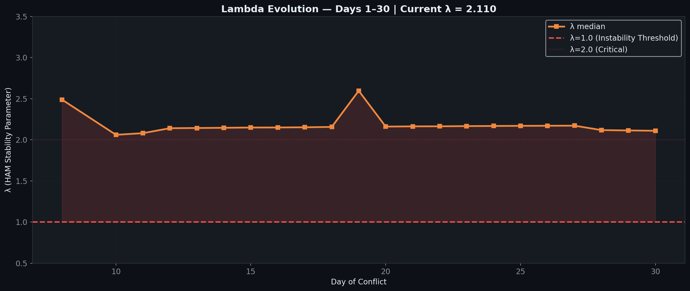

# Daily Tracker — Day-by-Day Change Log

> 🌐 **EN** | [中文](../zh/updates/daily-tracker.md)

**Last Updated: March 29, 2026 (Day 30)**

This page tracks daily changes across all model inputs, compares model predictions against observed data, and flags breaches as they occur.

---

## Model vs Actual — Divergence Summary

### Divergence Heatmap

Day-by-day percentage deviation across all 6 tracked metrics (28 days). Red = actual exceeds model, blue = actual below model. Lambda divergence dominates from Day 3 onward (+240% → +360%). Drone divergence extreme from Day 11 onward (actual 6-45 vs model ~130). BMs oscillate in 3-13 range (Days 12-25), drop to historic 0 on Day 26, then **MASSIVE REBOUND on Day 27: 0→15 BMs detected** — largest daily BM surge since Day 2 (28 BMs), shattering zero-BM milestone. **Day 30: 16 BMs + 42 drones (58 total); ONE-MONTH MARK; 0 deaths, 1 injury; DXB improves to 55%; Polymarket ceasefire odds drop to 12%.** Day 29: 20 BMs + 37 drones (57 total); BM SURGE 6→20 (+233%); 1 killed + 6 injured at Kezad from debris; WTI hits $100 intraday. Day 28: 6 BMs + 9 drones (15 total); Chinese ships turned from Hormuz; Trump delays energy strikes 10 days.


### 6-Panel Comparison

Side-by-side model (blue) vs actual (red) with ribbon fill showing the gap. Airport (green) was positive divergence until Day 17 DXB crash. Lambda (bottom-right) shows deep cascade zone. Drone stockpile (bottom-center) breaches 30% threshold on Day 9. Day 30 data included: **16 BMs + 42 drones (58 total)**, λ=2.110 (decline from 2.114); 0 deaths; DXB 55%; ONE-MONTH MARK. Day 29: **20 BMs (BM SURGE 6→20), 37 drones (57 total)**, λ=2.114; 1 killed Kezad debris; WTI $100 intraday. Day 28: **6 BMs, 9 drones (15 total)**, λ=2.118; Chinese ships turned from Hormuz.


### Scorecard & Verdict Timeline

Stacked divergence shows lambda (purple) dominating total model error. Verdict timeline: model predicted METASTABLE for all 20 days — reality crossed to UNSTABLE on Day 3 and never returned.


### Lambda Evolution

λ jumped from 0.47 → 1.70 on Day 3 (Hormuz closure), peaked at 2.71 on Day 9 (drone stockpile breach + BM rebound), then eased to a plateau ~2.1 from Day 10 onward. Days 12-18 showed remarkable stability at 2.14-2.16. Day 19 saw λ surge to 2.596 on BM rebound signal (3-day acceleration 7→10→13). Days 20-25: λ holds steady at ~2.16-2.17 as BMs remain low (7→4→3→4→7→5). Day 26: λ = 2.171 — marginal uptick from 2.170 despite historic 0 BMs. Day 27: λ = 2.172 — marginal uptick from 2.171 despite MASSIVE BM REBOUND (0→15: largest since Day 2); 2 killed Abu Dhabi; Jebel Ali fire. **Day 30: λ = 2.110** — marginal decline from 2.114; BM eases 20→16 (−20%); drone surge 37→42 (most since Day 18); ONE-MONTH MARK of sustained Iranian strikes. 0 deaths, 1 minor injury (Sharjah drone debris). DXB improves to 55%. Polymarket ceasefire-by-Mar-31 drops to ~12% with 2 days remaining. **Day 29: λ = 2.114** — BM surge 6→20; 1 killed + 6 injured Kezad; WTI $100 intraday. **Day 28: λ = 2.118** — BM corrects 15→6; Chinese ships turned from Hormuz. P(λ>1) has been 100% since Day 3. System remains locked in stable cascade regime. **One-month mark: 414 BMs, 1,914 drones, 15 cruise missiles; 12 dead, ~178 injured.**



### Ballistic Missile Trajectory

The model's exponential decay assumption (β=0.25/day) broke down from Day 5 onward. Days 5→9: 3→7→9→16→17 showed an accelerating rebound. Post-rebound (Days 10-25): BMs oscillate in 3-13 range with noisy pattern (12→9→6→10→7→9→4→7→10→13→7→4→3→4→7→5). Day 26: 0 BMs — historic first day without ballistic missiles. Day 27: MASSIVE BM REBOUND 0→15 (largest since Day 2: 28 BMs) — shattering zero-BM milestone; only 11 drones detected (~130 total). 2 killed in Abu Dhabi from intercepted debris (Indian + Pakistani on Sweihan Road); Jebel Ali Port fire from interception debris. Iran rejects direct US talks, sets 5 counter-conditions (halt attacks, no future war guarantees, reparations, cease proxies, Hormuz sovereignty). **Day 30: 16 BMs + 42 drones (58 total); BM eases 20→16 (−20%); drone surge 37→42 (+14%); ONE-MONTH MARK.** Days 26-30 show extreme BM volatility: 0→15→6→20→16, with no convergence to model decay. **Day 29: 20 BMs (BM SURGE 6→20, +233%); 37 drones (57 total); 1 killed Kezad from debris; WTI $100 intraday.** Oil steady near $100 WTI (weekend markets). VLCC ~$450K/day. Hormuz ~3 selective crossings via toll system. 3rd CSG (Bush) approaching theater. Cumulative: 414 BMs, 1,914 drones, 15 cruise.


---

## Attack Volume Tracker

### Daily New Attacks

| Day | Date | BM (New) | Model BM | Drones | Model Drones | Cruise | Total | Trend |
|-----|------|----------|----------|--------|-------------|--------|-------|-------|
| 1 | Feb 28 | **137** | — | 209 | — | 0 | 346 | Opening salvo |
| 2 | Mar 1 | **28** | — | 332 | — | 2 | 362 | Peak drone day |
| 3 | Mar 2 | **9** | ~19 | 148 | ~130 | 6 | 163 | BM faster than model decay |
| 4 | Mar 3 | **12** | ~14 | 123 | ~130 | 0 | 135 | BM uptick (noise?) |
| 5 | Mar 4 | **3** | ~10 | 129 | ~130 | 0 | 132 | BM near-zero |
| 6 | Mar 5 | **7** | ~8 | 131 | ~130 | 0 | 138 | BM rebound |
| 7 | Mar 6 | **9** | ~6 | 112 | ~130 | 0 | 121 | ⚠️ BM broke monotonic decay |
| 8 | Mar 7 | **16** | ~4 | ~125 | ~130 | 0 | 141 | ⚠️⚠️ BM REBOUND — highest since Day 2 |
| **9** | **Mar 8** | **17** | ~3 | 117 | ~130 | 0 | **134** | ⚠️⚠️ BM sustained high — 16→17 |
| 10 | Mar 9 | **12** | ~2 | 110 | ~130 | 0 | 122 | BM drops 17→12: rebound breaks |
| 11 | Mar 10 | 9 | ~1 | 35 | ~130 | 0 | 44 | ⚠️ Drone collapse: 110→35 (−68%) |
| **12** | **Mar 11** | **6** | ~1 | **39** | ~130 | **7** | **52** | ⚠️ First cruise missiles since Day 3; BM 3rd decline; drones −68% recovery |
| 13 | Mar 12 | 10 | ~1 | 26 | ~130 | 0 | 36 | BM uptick 6→10 (+67%); drones collapse further |
| **14** | **Mar 13** | **7** | ~1 | **~27** | ~130 | 0 | **~34** | BM resumes decline 10→7; drones stable at record low; **new record low total** |
| 15 | Mar 14 | **9** | ~1 | 33 | ~130 | 0 | 42 | 9 BMs + 33 drones (@modgovae via Gulf News); Fujairah fire from debris |
| **16** | **Mar 15** | **4** | ~0 | **6** | ~130 | 0 | **10** | @modgovae CORRECTED: historic low (4 BM + 6 drones = 10 total) |
| **17** | **Mar 16** | **7** | ~0 | **25** | ~130 | 0 | **32** | Rebound from Day 16 low; 1 BM hits civilian car; DXB fuel tank hit; MQ-9A destroyed Kuwait |
| **18** | **Mar 17** | **10** | ~0 | **45** | ~130 | 0 | **55** | @modgovae: 10 BMs + 45 drones; **GCAA closes airspace** (first since Day 2); Fujairah port hit; UK air sorties begin |
| **19** | **Mar 18** | **13** | ~0 | **27** | ~130 | 0 | **40** | @modgovae: 13 BMs + 27 drones; all BMs intercepted; Brent $108.78 (conflict high); VLCC $445K/d record; Fed meeting begins |
| **20** | **Mar 19** | **7** | ~0 | **15** | ~130 | 0 | **22** | **Lowest UAE volume of conflict (22 total)**; Iran hits Qatar Ras Laffan LNG (17% capacity); Brent $113; oil briefly $119 |
| **21** | **Mar 20** | **4** | ~0 | **26** | ~130 | 0 | **30** | Eid al-Fitr; BMs tie historic low (4); drones rebound 15→26; Brent eases to $107; Polymarket 8%; foreign airlines still banned from DXB |
| **22** | **Mar 21** | **3** | ~0 | **8** | ~130 | 0 | **11** | **Second-lowest (Day 16: 10)**; US strikes Natanz nuclear facility; Iran offers Japan Hormuz passage; Diego Garcia targeted unsuccessfully; Trump mulls 'winding down' war |
| **23** | **Mar 22** | **4** | ~0 | **25** | ~130 | 0 | **29** | Rebounds from Day 22 low (11→29); Trump 48-hr Hormuz ultimatum; Iran threatens full closure; US licenses 140M bbl Iranian crude sale |
| **24** | **Mar 23** | **7** | ~0 | **16** | ~130 | 0 | **23** | BMs rebound 4→7; drones decline 25→16; Trump ultimatum expires, no major escalation occurs; Hormuz transits expanding to ~22/day |
| **25** | **Mar 24** | **5** | ~0 | **17** | ~130 | 0 | **22** | BMs decline 7→5; drones rebound 16→17; continued selectivity in attack pattern; Pakistan/Turkey/Egypt/Oman mediation active |
| **26** | **Mar 25** | **0** | ~0 | **9** | ~130 | 0 | **9** | **HISTORIC: First day with 0 BMs; all-time low total (9)** |
| **27** | **Mar 26** | **15** | ~0 | **11** | ~130 | 0 | **26** | **MASSIVE BM REBOUND: 0→15 (largest since Day 2); 2 killed Abu Dhabi; Jebel Ali fire** |
| **28** | **Mar 27** | **6** | ~0 | **9** | ~130 | 0 | **15** | BM sharp decline 15→6 (−60%); Chinese ships turned from Hormuz; Trump delays energy strikes 10d |
| **29** | **Mar 28** | **20** | ~0 | **37** | ~130 | 0 | **57** | **BM SURGE 6→20 (+233%); drone surge 9→37; 1 killed Kezad debris; WTI hits $100; war 1-month mark** |
| **30** | **Mar 29** | **16** | ~0 | **42** | ~130 | 0 | **58** | **BM eases 20→16 (−20%); drone surge 37→42; ONE-MONTH MARK; DXB 55%; ceasefire odds 12%** |

### Cumulative Totals

| Day | Date | Cum. BM | Cum. Drones | Cum. Cruise | Cum. Total |
|-----|------|---------|-------------|-------------|------------|
| 1 | Feb 28 | 137 | 209 | 0 | 346 |
| 2 | Mar 1 | 165 | 541 | 2 | 708 |
| 3 | Mar 2 | 174 | 689 | 8 | 871 |
| 4 | Mar 3 | 186 | 812 | 8 | 1,006 |
| 5 | Mar 4 | 189 | 941 | 8 | 1,138 |
| 6 | Mar 5 | 196 | 1,072 | 8 | 1,276 |
| 7 | Mar 6 | 205 | 1,184 | 8 | 1,397 |
| 8 | Mar 7 | 221 | ~1,309 | 8 | ~1,538 |
| **9** | **Mar 8** | **238** | **~1,422** | **8** | **~1,668** |
| 10 | Mar 9 | 250 | ~1,536 | 8 | ~1,794 |
| 11 | Mar 10 | 259 | ~1,571 | 8 | ~1,838 |
| **12** | **Mar 11** | **265** | **~1,610** | **15** | **~1,890** |
| 13 | Mar 12 | 275 | ~1,636 | 15 | ~1,926 |
| **14** | **Mar 13** | **282** | **~1,663** | **15** | **~1,960** |
| 15 | Mar 14 | 294 | ~1,696 | 15 | ~2,005 |
| **16** | **Mar 15** | **298** | **~1,702** | **15** | **~2,015** |
| **17** | **Mar 16** | **~305** | **~1,727** | **15** | **~2,047** |
| **18** | **Mar 17** | **314** | **~1,672** | **15** | **~2,001** |
| **19** | **Mar 18** | **327** | **~1,699** | **15** | **~2,041** |
| **20** | **Mar 19** | **334** | **~1,714** | **15** | **~2,063** |
| **21** | **Mar 20** | **338** | **~1,740** | **15** | **~2,093** |
| **22** | **Mar 21** | **341** | **1,748** | **15** | **2,104** |
| **23** | **Mar 22** | **345** | **1,773** | **15** | **2,133** |
| **24** | **Mar 23** | **352** | **1,789** | **15** | **2,156** |
| **25** | **Mar 24** | **357** | **1,806** | **15** | **2,178** |
| **26** | **Mar 25** | **357** | **1,815** | **15** | **2,187** |
| **27** | **Mar 26** | **372** | **1,826** | **15** | **2,213** |
| **28** | **Mar 27** | **378** | **1,835** | **15** | **2,228** |
| **29** | **Mar 28** | **398** | **1,872** | **15** | **2,285** |
| **30** | **Mar 29** | **414** | **1,914** | **15** | **2,343** |

---

## Interception Rate Tracker

| Day | Date | BM Detected | BM Intercepted | Day Rate | Cum. Rate | Threshold (<90%) | Status |
|-----|------|-------------|----------------|----------|-----------|-------------------|--------|
| 1 | Feb 28 | 137 | 132 | 96.4% | 96.4% | OK | OK |
| 2 | Mar 1 | 28 | 20 | 71.4% | 92.1% | ⚠️ Day breach | Cum OK |
| 3 | Mar 2 | 9 | 9 | 100% | 93.6% | OK | OK |
| 4 | Mar 3 | 12 | 11 | 91.7% | 93.0% | OK | OK |
| 5 | Mar 4 | 3 | 3 | 100% | 93.1% | OK | OK |
| 6 | Mar 5 | 7 | 6 | **85.7%** | 93.4% | ⚠️ Day breach, 1 landed | **ALERT** |
| 7 | Mar 6 | 9 | 9 | 100% | 92.7% | OK | OK |
| 8 | Mar 7 | 16 | 15 | 93.8% | 92.8% | OK | ⚠️ BM rebound to 16 |
| **9** | **Mar 8** | **17** | **16** | **94.1%** | **92.9%** | OK | ⚠️ BM sustained high: 16→17 |
| 10 | Mar 9 | 12 | 11 | 91.7% | 92.8% | OK | BM drops 17→12: rebound breaks |
| 11 | Mar 10 | 9 | 8 | 88.9% | 92.7% | ⚠️ Day breach | 1 BM fell sea; daily rate <90% |
| **12** | **Mar 11** | **6** | **6** | **100%** | **92.8%** | OK | BM all intercepted; 7 cruise intercepted; drones fell in UAE incl. 2 near DXB |
| 13 | Mar 12 | 10 | 10 | 100% | 93.1% | OK | All 10 BM intercepted per @modgovae; no cruise; 26 drones engaged |
| **14** | **Mar 13** | **7** | **~7** | **~100%** | **93.3%** | OK | BM resumes decline 10→7; debris hits DIFC building; ~27 drones engaged |
| 15 | Mar 14 | 9 | 8 | 88.9% | 93.1% | ⚠️ Day breach | 1 BM fell sea; Fujairah debris fire |
| **16** | **Mar 15** | **4** | **4** | **100%** | **93.2%** | OK | @modgovae CORRECTED: all 4 BM intercepted; historic low volume |
| **17** | **Mar 16** | **7** | **6** | **85.7%** | **93.0%** | ⚠️ Day breach | 1 BM hits civilian car Abu Dhabi; daily rate <90% (4th breach in conflict) |
| **18** | **Mar 17** | **10** | **10** | **100%** | **~92.7%** | OK | @modgovae: 10 BMs all intercepted; airspace closed then reopened by 5:05 AM |
| **19** | **Mar 18** | **13** | **13** | **100%** | **~92.7%** | OK | @modgovae: 13 BMs all intercepted; cumulative 327 BMs; rate stable at 92.7% |
| **20** | **Mar 19** | **7** | **7** | **100%** | **~92.8%** | OK | @modgovae: 7 BMs all intercepted; cumulative 334 BMs; 3rd consecutive 100% day rate |
| **21** | **Mar 20** | **4** | **4** | **100%** | **~92.9%** | OK | @modgovae: 4 BMs all intercepted; cumulative 338 BMs; 4th consecutive 100% daily rate |
| **22** | **Mar 21** | **3** | **3** | **100%** | **~93.0%** | OK | 3 BMs all intercepted; cumulative 341 BMs; 5th consecutive 100% daily rate; 8 drones engaged |
| **23** | **Mar 22** | **4** | **4** | **100%** | **~93.0%** | OK | 4 BMs all intercepted; cumulative 345 BMs; 6th consecutive 100% daily rate; 25 drones engaged (~21 intercepted) |
| **24** | **Mar 23** | **7** | **7** | **100%** | **~93.0%** | OK | 7 BMs all intercepted; cumulative 352 BMs; 7th consecutive 100% daily rate; 16 drones engaged (~14 intercepted) |
| **25** | **Mar 24** | **5** | **5** | **100%** | **~93.0%** | OK | 5 BMs all intercepted; cumulative 357 BMs; 8th consecutive 100% daily rate; 17 drones detected, ~14 intercepted (~82%) |
| **26** | **Mar 25** | **0** | **0** | **N/A** | **93.0%** | N/A (0 BMs) | **HISTORIC: 0 BMs** |
| **27** | **Mar 26** | **15** | **15** | **100%** | **~93.1%** | OK | **All 15 BMs intercepted; debris kills 2 in Abu Dhabi; 9th consecutive 100% daily rate** |
| **28** | **Mar 27** | **6** | **6** | **100%** | **~93.2%** | OK | **All 6 BMs intercepted; 10th consecutive 100% daily rate; Chinese ships turned from Hormuz** |
| **29** | **Mar 28** | **20** | **20** | **100%** | **~93.2%** | OK | **All 20 BMs intercepted; 11th consecutive 100% daily rate; 1 killed + 6 injured from debris at Kezad** |
| **30** | **Mar 29** | **16** | **16** | **100%** | **~93.2%** | OK | **All 16 BMs intercepted; 12th consecutive 100% daily rate; cumulative 414 BMs; ONE-MONTH MARK** |

**Day 6 breach note:** 1 ballistic missile landed inside UAE territory on March 5 — first confirmed BM ground impact.

**Day 8 critical note:** 16 BMs detected — highest since Day 2 (28). Days 5→8 show **accelerating** trend: 3→7→9→16. This contradicts the exponential decay model and suggests either hidden TELs activated or resupply from deeper storage. Launcher depletion estimate revised from 85.7% to **~73%**.

**Day 9 critical note:** 17 BMs detected — surpasses Day 8. Consecutive high-volume days (16→17) confirm the rebound is structural, not a single-day anomaly. Launcher depletion estimate revised further to **~67%**. Drone stockpile breaches 30% threshold for the first time (28.9%).

**Day 10 note:** 12 BMs detected — first daily decline in 5 days, breaking the 3→7→9→16→17 accelerating trend. However, volume remains elevated well above model predictions (~2 BMs/day at this point in the decay curve). Launcher depletion estimate revised up to **~99%** — cumulative 250 BMs against 40 TELs suggests near-exhaustion.

**Day 11 note:** 9 BMs detected — second consecutive decline (12→9), confirming rebound has broken. Daily interception rate **88.9%** (8/9) breaches the 90% threshold for third time in the conflict (Days 2, 6, 11). Cumulative rate remains at 92.7%. The dramatic drone collapse (110→35, −68%) is unprecedented — possibly indicating stockpile conservation, launcher exhaustion, or strategic pivot.

---

## Drone Stockpile Tracker

| Day | Date | Daily Launched | Cum. Launched | Est. Remaining | % Remaining | Threshold (<30%) |
|-----|------|---------------|---------------|----------------|-------------|-------------------|
| 1 | Feb 28 | 209 | 209 | 1,791 | 89.6% | OK |
| 2 | Mar 1 | 332 | 541 | 1,459 | 73.0% | OK |
| 3 | Mar 2 | 148 | 689 | 1,311 | 65.6% | OK |
| 4 | Mar 3 | 123 | 812 | 1,188 | 59.4% | OK |
| 5 | Mar 4 | 129 | 941 | 1,059 | 53.0% | OK |
| 6 | Mar 5 | 131 | 1,072 | 928 | 46.4% | OK |
| 7 | Mar 6 | 112 | 1,184 | 816 | 40.8% | OK |
| 8 | Mar 7 | ~125 | ~1,309 | ~691 | 34.5% | Approaching |
| **9** | **Mar 8** | **117** | **~1,422** | **~578** | **28.9%** | **⚠️ BREACHED** |
| 10 | Mar 9 | 110 | ~1536 | ~464 | 23.2% | ⚠️ BREACHED |
| 11 | Mar 10 | 35 | ~1571 | ~429 | 21.4% | ⚠️ BREACHED |
| **12** | **Mar 11** | **39** | **~1,610** | **~390** | **19.5%** | **⚠️ BREACHED** |
| 13 | Mar 12 | 26 | ~1,636 | ~364 | 18.2% | ⚠️ BREACHED |
| **14** | **Mar 13** | **~27** | **~1,663** | **~337** | **16.9%** | **⚠️ BREACHED** |
| 15 | Mar 14 | 33 | ~1,696 | ~304 | 15.2% | ⚠️ BREACHED |
| **16** | **Mar 15** | **6** | **~1,702** | **~298** | **14.9%** | **⚠️ BREACHED** |
| **17** | **Mar 16** | **25** | **~1,727** | **~273** | **13.6%** | **⚠️ BREACHED** |
| **18** | **Mar 17** | **45** | **1,672†** | **~328** | **16.4%** | **⚠️ BREACHED** |
| **19** | **Mar 18** | **27** | **~1,699** | **~301** | **15.1%** | **⚠️ BREACHED** |
| **20** | **Mar 19** | **15** | **~1,714** | **~286** | **14.3%** | **⚠️ BREACHED** |
| **21** | **Mar 20** | **26** | **~1,740** | **~260** | **13.0%** | **⚠️ BREACHED** |
| **22** | **Mar 21** | **8** | **1,748** | **252** | **12.6%** | **⚠️ BREACHED** |
| **23** | **Mar 22** | **25** | **1,773** | **227** | **11.4%** | **⚠️ BREACHED** |
| **24** | **Mar 23** | **16** | **1,789** | **211** | **10.6%** | **⚠️ BREACHED** |
| **25** | **Mar 24** | **17** | **1,806** | **194** | **9.7%** | **⚠️ BREACHED** |
| **26** | **Mar 25** | **9** | **1,815** | **185** | **9.25%** | **⚠️ BREACHED** |
| **27** | **Mar 26** | **11** | **1,826** | **174** | **8.7%** | **⚠️ BREACHED** |
| **28** | **Mar 27** | **9** | **1,835** | **165** | **8.25%** | **⚠️ BREACHED** |
| **29** | **Mar 28** | **37** | **1,872** | **128** | **6.4%** | **⚠️ BREACHED** |
| **30** | **Mar 29** | **42** | **1,914** | **86** | **4.3%** | **⚠️ BREACHED** |

†**@modgovae correction:** Official cumulative through Day 18 is 1,672 UAVs (per @modgovae verified data), lower than tracker estimates (~1,727 through Day 17). Previous daily drone estimates used "~" approximations. @modgovae authoritative cumulative now adopted as baseline. Remaining stockpile revised upward to ~328 (16.4%).

~~At current rate (~120/day), stockpile hits 30% threshold around Day 11 (March 10).~~ **BREACHED on Day 9** — 2 days earlier than predicted. Days 11-23 show sustained low-volume pattern (6-45 drones/day) with extreme volatility. Day 23's 25 drones represents a significant rebound from Day 22's 8. At @modgovae-verified cumulative of 1,773/2,000, remaining ~227 drones last ~9-23 days at current average (~25/day at Day 23 rate, ~15/day at Days 20-23 avg). Pattern confirms Iran managing UAV stockpile tactically. Days 20-23: 15→26→8→25 drones shows continued tactical flexibility. Trump's 48-hour Hormuz ultimatum may trigger intensified drone usage if Iran retaliates against power plant strikes.

---

## Cascade Threshold Tracker

| Metric | D1 | D3 | D5 | D7 | D8 | D9 | D10 | D11 | D12 | D13 | D14 | D15 | D16 | D17 | D18 | D19 | D20 | D21 | D22 | D23 | D24 | D25 | D26 | D27 | D28 | D29 | D30 | Threshold |
|--------|-----|-----|-----|-----|-----|-----|------|------|------|------|------|------|------|------|------|------|------|------|------|------|------|------|------|------|------|------|------|------|------|------|------|------|------|------|------|
| Launcher Dep. | ~39% | ~50% | ~54% | 86% | ~73% | ~67% | ~99% | ~99% | ~99% | ~99% | ~99% | ~99% | ~99% | ~99% | ~99% | ~99% | ~99% | ~99% | ~99% | **~99%** | **~99%** | **~99%** | **~99%** | **~99%** | **~99%** | **~99%** | **~99%** | > 85% |
| Drone Stock. | 89.6% | 65.6% | 53.0% | 40.8% | 34.5% | 28.9% | 23.2% | 21.4% | 19.5% | 18.2% | 16.9% | 15.2% | 14.9% | 13.6% | 16.4%† | 15.1% | 14.3% | 13.0% | 12.6% | **11.4%** | **10.6%** | **9.7%** | **9.25%** | **8.7%** | **8.25%** | **6.4%** | **4.3%** | < 30% |
| Int. Rate (cum) | 96.4% | 93.6% | 93.1% | 92.7% | 92.8% | 92.9% | 92.8% | 92.7% | 92.8% | 93.1% | 93.3% | 93.1% | 93.2% | 93.0% | ~92.7% | ~92.7% | ~92.8% | ~92.9% | ~93.0% | **~93.0%** | **~93.0%** | **~93.0%** | **93.0%** | **~93.1%** | **~93.2%** | **~93.2%** | **~93.2%** | < 90% |
| Int. Rate (day) | 96.4% | 100% | 100% | 100% | 93.8% | 94.1% | 91.7% | 88.9% | 100% | 100% | ~100% | 88.9% | 100% | 85.7% | 100% | 100% | 100% | 100% | 100% | **100%** | **100%** | **100%** | **N/A (0 BMs)** | **100%** | **100%** | **100%** | **100%** | < 90% |
| Daily Casualties | ~22 | ~18 | ~15 | ~16 | ~14 | ~15 | 2 | 10 | 4 | 0 | 0 | 10 | 0 | 6 | 12 | ~5 | 0 | 3 | 0 | **2** | **0** | **0** | **0** | **5** | **~2** | **7** | **1** | > 10 |
| New Weapon | No | No | No | No | Air base | Air base | Air base | Refinery | DXB | No | No | No | No | DXB fuel/car | Fujairah port | No | No | No | No | **No** | **No** | **No** | **No** | **Jebel Ali** | **No** | **No** | **No** | Yes |

*Launcher depletion **revised downward** from 85.7% to ~73% (Day 8) and further to **~67%** (Day 9) due to consecutive high-volume BM days (16→17). The accelerating trend 3→7→9→16→17 confirms more TELs remain operational than previously estimated. Drone stockpile has **breached** the 30% threshold on Day 9 — 2 days earlier than forecast. Day 11 adds a **new breach**: daily interception rate (88.9%), the third daily breach in the conflict.

| Day | Breaches | Verdict |
|-----|----------|---------|
| 1 | 1/5 (casualties) | METASTABLE |
| 3 | 1/5 | METASTABLE |
| 5 | 1/5 | METASTABLE |
| 7 | 2/5 (launcher + casualties) | METASTABLE |
| 8 | 4/5 (launcher + interception day + casualties + air base) | UNSTABLE |
| 9 | 3/5 (casualties + new_weapon + drone_stockpile) | UNSTABLE |
| 10 | 2/5 (launcher + drone_stockpile) | UNSTABLE |
| 11 | 3/5 (launcher + drone_stockpile + interception_day) | UNSTABLE |
| 12 | 3/5 (launcher + drone_stockpile + DXB airport) | UNSTABLE |
| 13 | 2/5 (launcher + drone_stockpile) | UNSTABLE |
| 14 | 2/5 (launcher + drone_stockpile) | UNSTABLE |
| 15 | 3/5 (launcher + drone_stockpile + interception_day) | UNSTABLE |
| **16** | **2/5** (launcher + drone_stockpile) | **UNSTABLE** |
| **17** | **4/5** (launcher + drone_stockpile + new_weapon + interception_day) | **UNSTABLE** |
| **18** | **3/5** (launcher + drone_stockpile + casualties) | **UNSTABLE** |
| **19** | **2/5** (launcher + drone_stockpile) | **UNSTABLE** |
| **20** | **2/5** (launcher + drone_stockpile) | **UNSTABLE** |
| **21** | **2/5** (launcher + drone_stockpile) | **UNSTABLE** |
| **22** | **2/5** (launcher + drone_stockpile) | **UNSTABLE** |
| **23** | **2/5** (launcher + drone_stockpile) | **UNSTABLE** |
| **24** | **2/5** (launcher + drone_stockpile) | **UNSTABLE** |
| **25** | **2/5** (launcher + drone_stockpile) | **UNSTABLE** |
| **26** | **2/5** (launcher + drone_stockpile) | **UNSTABLE** |
| **27** | **2/5** (launcher + drone_stockpile) | **UNSTABLE** |
| **28** | **2/5** (launcher + drone_stockpile) | **UNSTABLE** |
| **29** | **2/5** (launcher + drone_stockpile) | **UNSTABLE** |
| **30** | **2/5** (launcher + drone_stockpile) | **UNSTABLE** |

---

## Lambda (λ) Evolution

| Day | λ Median | P(λ > 1) | 95th Pctl | Verdict | Key Change |
|-----|----------|----------|-----------|---------|------------|
| 1 | 0.750 | 5.5% | ~1.52 | METASTABLE | Initial assessment |
| 2 | 0.470 | 5.4% | ~1.10 | METASTABLE | Post-opening salvo |
| 3 | 1.703 | 99.9% | 2.40 | UNSTABLE | Hormuz closes → λ jumps |
| 4 | 1.677 | 99.7% | 2.38 | UNSTABLE | Hormuz confirmed |
| 5 | 1.669 | 99.7% | 2.37 | UNSTABLE | BM near-zero, Hormuz persists |
| 6 | 1.754 | 100% | 2.45 | UNSTABLE | BM rebound begins |
| 7 | 1.721 | 99.9% | 2.43 | UNSTABLE | Hormuz + proxy realized; BM breaks monotonic decay |
| 8 | 2.589 | 100% | 3.304 | UNSTABLE | + air base strike + BM rebound (16) |
| 9 | 2.712 | 100% | 3.481 | UNSTABLE | Drone stockpile breach + BM sustained |
| 10 | 2.061 | 100% | 2.770 | UNSTABLE | BM rebound breaks (17→12), λ eases but still CASCADE |
| 11 | 2.081 | 100% | 2.790 | UNSTABLE | Drone collapse (110→35); new breach (interception_day); λ holds steady |
| 12 | 2.141 | 100% | 2.851 | UNSTABLE | Naval deterrence weakens (3→2 carriers); 7 cruise missiles (first since Day 3); drone stockpile continues declining |
| 13 | 2.143 | 100% | 2.860 | UNSTABLE | BM uptick 6→10 but interception rate improves (93.1%); drone collapse continues (26); no cruise; two helo crash deaths (operational) |
| 14 | 2.146 | 100% | 2.860 | UNSTABLE | BM resumes decline (10→7); interception improves (93.3%); drones stable at record low (27); Khamenei confirms Hormuz closed; DIFC debris; KC-135 crash |
| 15 | 2.149 | 100% | 2.870 | UNSTABLE | 9 BMs + 33 drones (@modgovae); Fujairah fire; 1 Jordanian injured; attacks spread to Oman/Saudi; daily interception 88.9% |
| **16** | **2.150** | **100%** | **2.870** | **UNSTABLE** | @modgovae CORRECTED: only 4 BMs + 6 drones (historic low, 10 total); no new weapon event; 2/5 breaches |
| **17** | **2.152** | **100%** | **2.870** | **UNSTABLE** | Attack rebounds (10→32); DXB fuel tank hit; missile strikes civilian car (7th death); daily interception 85.7%; MQ-9A destroyed Kuwait; 4/5 breaches |
| **18** | **2.155** | **100%** | **2.875** | **UNSTABLE** | Attack surges (32→55); **GCAA closes airspace** (first since Day 2); 10 BMs + 45 drones (@modgovae); Fujairah port hit; UK air sorties begin; Polymarket 8%; 2/5 breaches |
| **19** | **2.596** | **100%** | **3.310** | **UNSTABLE** | λ breaks plateau — surges 2.155→2.596 (+20%); BM rebound signal reactivates (7→10→13); 13 BMs all intercepted; 27 drones; Brent $108.78 (conflict high); VLCC $445K/d record; selective Hormuz transit expanding; Fed meeting; 1/5 breaches |
| **20** | **2.161** | **100%** | **2.860** | **UNSTABLE** | λ corrects 2.596→2.161 (−17%) as BMs drop 13→7, deactivating rebound signal; drones hit conflict low (15); **Iran destroys 17% Qatar LNG at Ras Laffan**; Brent $113 ($119 intraday); 0 casualties; 2/5 breaches |
| **21** | **2.163** | **100%** | **2.862** | **UNSTABLE** | λ flat at 2.163 (from 2.161); 4 BMs + 26 drones; Eid al-Fitr — no ceasefire; Polymarket 8%; Brent eases $107; foreign airlines banned from DXB; 3 minor injuries; 2/5 breaches |
| **22** | **2.164** | **100%** | **2.863** | **UNSTABLE** | λ essentially flat at 2.164; 3 BMs + 8 drones (lowest BM count of conflict); US strikes Natanz; Iran offers Japan Hormuz passage; Diego Garcia targeted unsuccessfully; Trump mulls 'winding down' war; 0 casualties; 2/5 breaches |
| **23** | **2.167** | **100%** | **2.877** | **UNSTABLE** | λ marginal uptick 2.164→2.167; 4 BMs + 25 drones (29 total, rebounds from Day 22's 11); Trump 48-hour Hormuz ultimatum; Iran threatens full closure + energy retaliation; US licenses 140M bbl Iranian crude; WTI $98; 2 minor injuries; 2/5 breaches |
| **24** | **2.168** | **100%** | **2.878** | **UNSTABLE** | λ marginal uptick 2.167→2.168; 7 BMs + 16 drones (23 total); Trump ultimatum expires without full power plant strikes; Iran maintains selective blockade; Hormuz transits ~22/day; selective Hormuz de facto operational; 0 casualties; 2/5 breaches |
| **25** | **2.170** | **100%** | **2.880** | **UNSTABLE** | λ marginal uptick 2.168→2.170; 5 BMs + 17 drones (22 total); Pakistan/Turkey/Egypt/Oman mediating; possible Vance-Iran meeting in Pakistan; Iran acknowledges US 'outreach' (CNN); markets skeptical of de-escalation; oil rebounds WTI $92.39 (+4.8%), Brent $102.47; 1 injury (minor); 2/5 breaches |
| **26** | **2.171** | **100%** | **2.883** | **UNSTABLE** | HISTORIC: first zero-BM day; λ marginal uptick 2.170→2.171; Iran denies talks as Trump claims negotiations; oil crashes -5% on diplomacy claims; drone stockpile at ~9.25%; 0 casualties; 2/5 breaches |
| **27** | **2.172** | **100%** | **2.885** | **UNSTABLE** | DRAMATIC BM REBOUND: 0→15 (largest since Day 2); λ uptick marginal 2.171→2.172; debris kills 2 Abu Dhabi; Iran rejects direct US talks; oil +3.6% on diplomatic failure; Houthis signal war readiness; 2/5 breaches |
| **28** | **2.118** | **100%** | **2.831** | **UNSTABLE** | BM corrects 15→6 (−60%); λ declines 2.172→2.118; Chinese ships turned from Hormuz; Trump delays energy strikes 10d; Iran calls proposal 'one-sided'; Brent $111; 3 CSGs converging; 2/5 breaches |
| **29** | **2.114** | **100%** | **2.827** | **UNSTABLE** | BM SURGE 6→20 (+233%); drone surge 9→37; λ marginal decline 2.118→2.114; 1 killed + 6 injured Kezad from debris; WTI hits $100 intraday; war one-month mark; Brent $112.57; 2/5 breaches |
| **30** | **2.110** | **100%** | **2.826** | **UNSTABLE** | ONE-MONTH MARK; BM eases 20→16 (−20%); drone surge 37→42; λ marginal decline 2.114→2.110; 0 deaths; DXB improves 55%; Polymarket ceasefire 12%; 3rd CSG approaching; 2/5 breaches |

### What Changed on Day 8

```
Day 7 → Day 8 Lambda Decomposition:

Component          Day 7 (realized)  Day 8 (realized)    Change
─────────────────────────────────────────────────────────────────
λ_launcher         -0.471           -0.401              +0.070  (depletion 85.7%→~73%)
λ_drone            +0.148           +0.164              +0.016  (stockpile lower)
λ_intercept        +0.020           +0.020               0.000
λ_proxy            +0.500           +0.500               0.000  Hezbollah already active
λ_hormuz           +0.630           +0.630               0.000  Already closed
λ_weapon            0.000           +0.400              +0.400  ⚠️ Air base strike (NEW)
λ_bm_rebound        0.000           +0.300              +0.300  ⚠️ 16 BM (accelerating)
λ_naval            -0.200           -0.184              +0.016  (CVN-77 not yet arrived)
─────────────────────────────────────────────────────────────────
λ total (median)    1.721            2.589              +0.868
```

---

## Scenario Probability Tracker

### Model Bayesian Posteriors (calibrated)

| Scenario | Day 6 | Day 14 | Day 30 | Day 14 Assessment |
|----------|-------|--------|--------|-------------------|
| Ceasefire | 3.3% | 7.8% | 12.8% | ↓↓↓ Polymarket ~17% — 10th consecutive decline; Khamenei confirms Hormuz closed |
| Baseline | 64.9% | 71.2% | 75.4% | ↓↓↓ Hormuz Day 12, drone exhaustion, Khamenei statement — baseline model severely challenged |
| Escalation | 31.4% | 20.1% | 11.7% | ↑↑↑ 4 tail risks realized; Khamenei locks in Hormuz closure; oil rebounds to $99 |
| Regime War | 0.4% | 0.9% | 0.1% | ↑ Energy infrastructure + DIFC debris + KC-135 crash + proxy claims; λ=2.080 |

### Polymarket Ceasefire Odds

| Date | By Mar 31 | Direction |
|------|-----------|-----------|
| Mar 5 (Day 6) | 67% | — |
| Mar 6 (Day 7) | 63% | ↓ |
| Mar 7 (Day 8) | 61% | ↓ |
| Mar 8 (Day 9) | 59% | ↓ |
| Mar 9 (Day 10) | 24% | ↓↓↓ |
| Mar 10 (Day 11) | 22% | ↓ |
| Mar 11 (Day 12) | 20% | ↓ |
| Mar 12 (Day 13) | ~19% | ↓ |
| Mar 13 (Day 14) | ~17% | ↓ |
| Mar 14 (Day 15) | ~15% | ↓ |
| **Mar 15 (Day 16)** | **~14%** | **↓** |
| Mar 16 (Day 17) | ~13% | ↓ |
| **Mar 17 (Day 18)** | **~11%** | **↓** |
| **Mar 18 (Day 19)** | **~10%** | **↓** |
| **Mar 19 (Day 20)** | **~10%** | **→** |
| **Mar 20 (Day 21)** | **~8%** | **↓** |
| **Mar 21 (Day 22)** | **~7%** | **↓** |
| **Mar 22 (Day 23)** | **~8%** | **↑** |
| **Mar 23 (Day 24)** | **~12%** | **↑** |
| **Mar 24 (Day 25)** | **~20%** | **↑↑** |
| **Mar 25 (Day 26)** | **~17%** | **↓** |
| **Mar 26 (Day 27)** | **~17%** | **→** |
| **Mar 27 (Day 28)** | **~20%** | **↑** |
| **Mar 28 (Day 29)** | **~15%** | **↓↓** |
| **Mar 29 (Day 30)** | **~12%** | **↓** |

Ceasefire odds surge to ~20% on Day 25 — a dramatic jump from ~12% (Day 24). Market reprices sharply upward following Trump ultimatum expiration (Day 24 without major escalation), combined with credible diplomatic signals: Iran acknowledges US "outreach" (CNN reported), possible Vance-Iran meeting in Pakistan, and active mediation by Pakistan, Turkey, Egypt, and Oman. **Day 26 correction: ceasefire odds decline to ~17%** as markets digest Trump's diplomacy claims vs Iran's firm denial ("no talks or negotiations for 25 days" — FARS). Despite Day 26 historic 0 BMs, markets skeptical of peace trajectory given Iran's formal escalation of Hormuz control (IRGC approval requirement for transit) and oil crash (-5.1% WTI to $87.63) as geopolitical risk recedes. Selective Hormuz blockade continues (~24/day transits) with no evidence of full closure reversal. **Day 27-28 volatility: Day 27 BM rebound (0→15) crashes odds back to ~17%, but Day 28 BM correction (15→6) combined with Trump 10-day energy strike delay pushes odds back up to ~20%**, signaling market repricing around de-escalation signals despite Iranian rejection of Trump's proposal as "one-sided." Chinese ship Hormuz incident (Day 28) creates uncertainty—blockade tightening vs diplomatic channel expansion. The "military action through March 31" contract likely at ~80-85% reflecting persistent escalation risk. **Day 29: ceasefire odds decline sharply to ~15% (from 20%)** — only 3 days remain before March 31 deadline; BM surge (6→20) + oil hitting $100 WTI + ongoing Iranian rejection of talks drive market pessimism. **Day 30: ceasefire odds drop further to ~12%** — only 2 days remain; BM eases 20→16 but drone surge to 42 (most since Day 18) signals sustained Iranian capability; Iran continues rejecting all direct talks; war reaches one-month mark with no resolution pathway visible.

---

## Airport & Flight Tracker

| Day | Date | Airport Capacity | Model Predicted | Flights/Day | Status |
|-----|------|-----------------|-----------------|-------------|--------|
| 1 | Feb 28 | 30% (pre-strike) | 30% | Normal ops | OK |
| 2 | Mar 1 | **0%** (closed) | 0% | All suspended | MATCH |
| 3 | Mar 2 | ~2% | 2% | Exceptional only | MATCH |
| 4 | Mar 3 | ~5% | 3% | Partial Abu Dhabi | CLOSE |
| 5 | Mar 4 | ~8% | 8% | Limited routes | MATCH |
| 6 | Mar 5 | ~15% | 12% | Etihad resumes | CLOSE |
| 7 | Mar 6 | ~25% | 15% | Emirates 40% network | **AHEAD** |
| 8 | Mar 7 | ~55% | 35% | Emirates 60%, Etihad ~25 dest | WELL AHEAD |
| 9 | Mar 8 | ~60% | 40% | Emirates targeting 100%; Air Arabia Mar 9 | **WELL AHEAD** |
| 10 | Mar 9 | ~65% | 45% | Air Arabia resumes; Emirates nearing 100% | WELL AHEAD |
| 11 | Mar 10 | ~70% | 50% | Emirates at 84 destinations; DXB limited ops | WELL AHEAD |
| 12 | Mar 11 | ~60% | 55% | DXB drone strike; concourse damage; still operating | AHEAD but narrowing |
| 13 | Mar 12 | ~55% | 58% | Minor drone incidents in Dubai; low attack volume | CLOSE |
| 14 | Mar 13 | ~50% | 60% | DIFC debris; shelter alerts in Abu Dhabi & Dubai; record-low attack volume | DIVERGENT |
| 15 | Mar 14 | ~55% | 62% | 9 BMs + 33 drones; Fujairah fire; Emirates ~60% capacity | CLOSE |
| **16** | **Mar 15** | **~55%** | **64%** | Emirates ~200 flights/day (~60%); flydubai ~64 flights (~35%); 48 flights/hour through emergency corridors | **CLOSE** |
| 17 | Mar 16 | ~30% | 66% | DXB suspended after fuel tank hit; limited resumption | ⚠️ CRASH |
| **18** | **Mar 17** | **~35%** | **68%** | **GCAA closes entire airspace; reopened by 5:05 AM; DXB limited; end-of-day ~35%** | **⚠️ CRISIS** |
| **19** | **Mar 18** | **~40%** | **70%** | Emirates limited schedule to 110 destinations; flights gradually resuming; most intl carriers still suspended | ⚠️ RECOVERING |
| **20** | **Mar 19** | **~45%** | **72%** | Missile warning sent 7:30am; DXB operating with gradual resumption; Emirates 5.3% cancel rate; Air India 48 flights | ⚠️ RECOVERING |
| **21** | **Mar 20** | **~40%** | **74%** | Eid al-Fitr; foreign airlines banned since Mar 17; only Emirates + flydubai; Air France suspended through today; IndiGo/Air India resumed | ⚠️ LIMITED |
| **22** | **Mar 21** | **~40%** | **75%** | Day 22; foreign airline ban continues; low attack volume (11 projectiles) provides stability; gradual resumption expected as threat perception eases | ⚠️ LIMITED |
| **23** | **Mar 22** | **~40%** | **77%** | Day 23; foreign airline ban continues; Air India/IndiGo operating limited; Emirates + flydubai only from DXB; Trump ultimatum creates uncertainty | ⚠️ LIMITED |
| **24** | **Mar 23** | **~45%** | **78%** | Day 24; foreign airline ban continues but gradual resumption signals emerging; Emirates + flydubai 198 flights from DXB; missile warning but operations resumed; no major escalation post-ultimatum | ⚠️ LIMITED |
| **25** | **Mar 24** | **~45%** | **79%** | Day 25; foreign airline ban continues; Emirates + flydubai operating normally; 198 flights from DXB; mediation efforts reduce escalation risk; Trump 5-day delay on Iran power plant strikes lowers imminent closure risk | ⚠️ LIMITED |
| **26** | **Mar 25** | **~50%** | **80%** | Air India resumes ad-hoc Dubai-Delhi flights (26 flights); Emirates at ~60% pre-war capacity aiming full restoration by Mar 29; foreign airline ban persists but easing; historic 0 BMs day signals reduced immediate strike risk | ⚠️ LIMITED |
| **27** | **Mar 26** | **~50%** | **81%** | Emirates+flydubai ~207 departures; DXB T3 hit by drone debris early AM; limited disruption | ⚠️ LIMITED |
| **28** | **Mar 27** | **~50%** | **82%** | Emirates+flydubai operating; weather advisories | ⚠️ LIMITED |
| **29** | **Mar 28** | **~45%** | **83%** | Emirates+flydubai reduced schedule; many intl carriers suspended; KLM through May 17 | ⚠️ LIMITED |
| **30** | **Mar 29** | **~55%** | **84%** | Emirates targeting full restoration; flydubai expanding; DXB improving; some intl carriers resuming | ⚠️ IMPROVING |

**Airport in crisis then partial recovery:** After reaching ~70% on Day 11, capacity crashed to ~30% on Day 17 (DXB fuel tank hit) and further to ~35% on Day 18 after GCAA closed then reopened UAE airspace (end-of-day ~35%). Days 19-28 show partial recovery to ~40-50% with Emirates and flydubai as primary operators after GCAA banned foreign airlines from DXB on Mar 17. BA flights cancelled through May 31; Air France suspended; Air Canada through May 1. Indian carriers (Air India, IndiGo) operating limited schedule. **Day 26: Air India resumes ad-hoc Dubai-Delhi flights (26 flights)** signaling gradual confidence recovery. **Day 27: DXB T3 hit by drone debris in early AM but operations continued with limited disruption; Emirates+flydubai at ~207 departures**, showing operational resilience despite BM rebound. **Day 28: Emirates+flydubai continue normal operations; weather advisories in place**, holding steady at ~50% capacity despite Chinese ship Hormuz incident and Iranian rejection of Trump proposal. **Day 30: DXB improves to ~55%** from 45% — best since Day 16 (55%). Emirates targeting full capacity restoration (per pre-conflict announcement); flydubai expanding schedule. Some international carriers beginning to resume limited operations. Model predicts 84% vs reality 55% — 1.53× gap narrowing. ONE-MONTH MARK shows airport recovering despite sustained Iranian strikes. Day 30 marks first significant capacity improvement in two weeks. **Day 29: airport dips to ~45%** from 50% as KLM extends suspension through May 17.

---

## Casualty Tracker

| Day | Date | Daily Killed | Daily Injured | Cum. Killed | Cum. Injured | Daily Total | Threshold (>10) |
|-----|------|-------------|-------------- |-------------|-------------|-------------|-----------------|
| 1 | Feb 28 | 0 | 15 | 0 | 15 | 15 | **BREACHED** |
| 2 | Mar 1 | 1 | 22 | 1 | 37 | 23 | **BREACHED** |
| 3 | Mar 2 | 0 | 12 | 1 | 49 | 12 | **BREACHED** |
| 4 | Mar 3 | 1 | 10 | 2 | 59 | 11 | **BREACHED** |
| 5 | Mar 4 | 0 | 8 | 2 | 67 | 8 | OK |
| 6 | Mar 5 | 1 | 11 | 3 | 78 | 12 | **BREACHED** |
| 7 | Mar 6 | 0 | 15 | 3 | 93 | 15 | **BREACHED** |
| 8 | Mar 7 | 0 | ~19 | 3 | ~112 | ~19 | **BREACHED** |
| 9 | Mar 8 | 1 | 0 | 4 | 112 | 1 | OK |
| 10 | Mar 9 | 0 | 2 | 4 | 114 | 2 | OK |
| 11 | Mar 10 | 2 | 8 | 6 | 122 | 10 | THRESHOLD |
| 12 | Mar 11 | 0 | 4 | 6 | 126 | 4 | OK |
| 13 | Mar 12 | 0 | 5 | 6 | 131 | 5 | OK |
| 14 | Mar 13 | 0 | 0 | 6 | ~131 | 0 | OK |
| 15 | Mar 14 | 0 | 10 | 6 | 141 | 10 | THRESHOLD |
| **16** | **Mar 15** | **0** | **0** | **6** | **~141** | **0** | OK |
| 17 | Mar 16 | 1 | 5 | 7 | ~146 | 6 | OK |
| **18** | **Mar 17** | **1** | **11** | **8** | **157** | **12** | **BREACHED** |
| **19** | **Mar 18** | **0** | **~5** | **8** | **~162** | **~5** | OK |
| **20** | **Mar 19** | **0** | **0** | **8** | **~158†** | **0** | OK |
| **21** | **Mar 20** | **0** | **3** | **8** | **~161** | **3** | OK |
| **22** | **Mar 21** | **0** | **0** | **8** | **~160** | **0** | OK |
| **23** | **Mar 22** | **0** | **~2** | **8** | **~162** | **~2** | OK |
| **24** | **Mar 23** | **0** | **0** | **8** | **~162** | **0** | OK |
| **25** | **Mar 24** | **1** | **6** | **9** | **~169†** | **7** | OK |
| **26** | **Mar 25** | **0** | **0** | **9** | **~166†** | **0** | OK |
| **27** | **Mar 26** | **2** | **3** | **11** | **~169** | **5** | OK |
| **28** | **Mar 27** | **0** | **~2** | **11** | **~171** | **~2** | OK |
| **29** | **Mar 28** | **1** | **6** | **12** | **~177** | **7** | OK |
| **30** | **Mar 29** | **0** | **1** | **12** | **~178** | **1** | OK |

†**@modgovae cumulative correction:** Official cumulative injuries as of Day 20 is 158 per @modgovae, lower than tracker running total (~162). Adopting @modgovae authoritative figure.

**Day 26 note:** 0 casualties. No fatalities, no injuries. Cumulative toll: 9 dead, ~166 injured per Al Jazeera. Days 17-26 show sustained low-casualty pattern — 9 consecutive zero-fatality days. Historic Day 26 zero-BM count contributed to zero-casualty day. Day 25 correction: Moroccan civilian contractor Mohammed Aznibla killed in Iranian missile strike on Bahrain while working with UAE Armed Forces; 5 UAE military injured in same strike; 1 Indian injured in Abu Dhabi (6 Day 25 injuries, 1 fatality).

**Day 27 escalation:** 2 killed, 3 injured. Day 27 BM rebound (0→15) breaks 9-day zero-fatality streak. Deaths: Indian + Pakistani nationals killed on Sweihan Road in Abu Dhabi from high-velocity BM interception debris. Cumulative toll: 11 dead, ~169 injured. Jebel Ali Port fire from interception debris marks resumption of infrastructure damage. Day 27 represents inflection point from low-casualty phase (Days 17-26 avg ~1 death/day, mostly 0) back to pre-Day-20 intensity.

**Day 30 note:** 0 deaths, 1 minor injury from drone debris in Sharjah. Cumulative toll: 12 dead, ~178 injured. Despite 42 drones detected (most since Day 18), low casualty count reflects improved civil defense measures and favorable debris patterns. ONE-MONTH MARK: 12 confirmed fatalities since Feb 28.

**Day 29 escalation:** 1 killed (Asian nationality civilian) + 6 injured (5 Indians + 1 Pakistani) from intercepted missile debris at Khalifa Economic Zones Abu Dhabi (Kezad). Despite all 20 BMs intercepted successfully, high-velocity interception debris caused significant casualties — highest single-day injury count since Day 18. Cumulative toll: 12 dead, ~177 injured. BM surge volume (20) directly correlates with debris casualty risk.

**Day 28 recovery:** 0 killed, ~2 injured. Return to zero-fatality pattern despite BM decline to 6 (from Day 27's 15). Injuries consistent with ongoing low-level debris/interception incidents. Cumulative toll: 11 dead, ~171 injured. Pattern suggests Day 27 casualty spike was debris-driven anomaly rather than sustained escalation (all 15 BMs intercepted; debris kills 2). Day 28 BM decline (15→6, −60%) and zero fatalities suggest interception quality maintained.

**Note:** Casualty figures from WAM (Emirates News Agency), Gulf News, @modgovae, and Reuters. Remarkably low given attack volume, attributable to >92-93% interception rates and effective civil defense. Days 17-26 zero-fatality streak (9 days) broken by Day 27 BM rebound debris casualties. Days 17-28 cumulative: 11 dead (mostly interception debris), ~171 injured. Pattern shows casualties concentrated on high-BM days (Day 27: 15 BMs → 2 killed; Days 20-26: low BMs → 0 deaths) despite consistent high interception rates, indicating debris penetration risk increases with attack volume despite improved interception percentage.

**Day 9 note:** 4th fatality — Pakistani driver killed in Al Barsha, Dubai, when interception debris struck his vehicle.

**Day 11 note:** 2 additional fatalities bring cumulative toll to 6 dead and 122 injured. Daily total exactly at threshold (10). Despite fewer missiles/drones, 9 drones fell within UAE territory (highest ratio: 26% vs typical ~5-8%), suggesting lower-flying drones evading interception are more lethal.

**Day 12 note:** 4 injured near Dubai International Airport from 2 drones that fell after interception. No additional fatalities. Cumulative toll: 6 dead, 126 injured. Daily rate back to OK (4/d < 10). Injuries cluster near DXB, consistent with airport-precision targeting.

**Day 13 note:** 5 injuries per @modgovae (cumulative 131). No new fatalities. Despite lower drone volume (26), some debris injuries from interception. Two UAE military personnel (Captain Pilot Saeed Rashid Al Balushi and First Lieutenant Ali Saleh Al Taniji) killed in helicopter crash due to technical malfunction — operational accidents, not combat casualties. Not included in attack casualty count.

**Day 14 note:** No confirmed new injuries or fatalities. DIFC Innovation Hub debris incident confirmed "no injuries" by Dubai Media Office. Cumulative toll remains at 6 dead, ~131 injured pending full @modgovae update. Lowest casualty day of the conflict — zero combat casualties, zero injuries from 34 projectiles. Despite continued interceptions over urban areas (DIFC debris), civil defense measures proving effective.

**Day 17 note:** 1 death — Palestinian man killed in Abu Dhabi when a ballistic missile struck his civilian vehicle. 5 additional injuries. This is the 7th fatality in UAE since the conflict began. Cumulative toll: 7 dead, 146 injured.

---

## Economic Impact Tracker

| Day | Date | Oil (WTI) | Weekly Δ | Hormuz Status | VLCC Rate | Key Event |
|-----|------|----------|----------|---------------|-----------|-----------|
| 1 | Feb 28 | $72 | — | Open | $218K/d | US-Israel strikes Iran |
| 2 | Mar 1 | $78 | +8.3% | Open | $245K/d | Iran retaliates |
| 3 | Mar 2 | $82 | +13.9% | **CLOSED** | $310K/d | IRGC closes Hormuz |
| 4 | Mar 3 | $86 | +19.4% | Closed | $380K/d | Container ship hit |
| 5 | Mar 4 | $90 | +25.0% | Near-zero traffic | $400K/d | 5 crossings only |
| 6 | Mar 5 | $93 | +29.2% | Zero traffic | $410K/d | Maersk suspends Gulf |
| 7 | Mar 6 | $95 | +31.9% | Zero traffic | $420K/d | 150 vessels trapped |
| 8 | Mar 7 | $97 | +35.6% | Zero traffic | $424K/d | Record VLCC rate |
| 9 | Mar 8 | ~$100 | +38.9% | Zero traffic | ~$430K/d | Brent hits $100; Morgan Stanley raises forecast |
| 10 | Mar 9 | $103 | +43.1% | Zero traffic | ~$435K/d | WTI $103; Brent touches $119 intraday |
| 11 | Mar 10 | ~$100 | +38.9% | Zero traffic | ~$440K/d | Ruwais refinery hit by drone, halted; WTI ~$100 |
| 12 | Mar 11 | ~$86 | +19.4% | Zero traffic | ~$420K/d | ⚠️ IEA 400M bbl reserve release; WTI crashes $100→$86; 3 ships struck; US destroys 16 minelayers |
| 13 | Mar 12 | ~$88 | +22.2% | Zero traffic | ~$415K/d | Oil stabilizes post-IEA release; minor drone incidents in Dubai; attack volume at record low |
| 14 | Mar 13 | ~$95 | +31.9% | Zero traffic | ~$425K/d | Oil rebounds ~$86→$95 as Khamenei confirms Hormuz closed; Brent near $100 |
| 15 | Mar 14 | ~$99 | +37.5% | Zero traffic | ~$430K/d | Brent >$100 for 2nd consecutive day; Iran warns of $200 oil; attacks spread to Oman/Saudi |
| **16** | **Mar 15** | **~$99** | **+37.5%** | **Zero traffic** | **~$430K/d** | Brent ~$103; WTI ~$99; Iran warns oil could hit $200; Indian LPG tankers cross Hormuz (yuan-priced?) |
| 17 | Mar 16 | ~$100 | +38.9% | Zero traffic | ~$435K/d | DXB fuel tank hit by drone; Brent $104.73; MQ-9A destroyed in Kuwait |
| **18** | **Mar 17** | **~$97** | **+34.7%** | **~5 crossings** | **~$440K/d** | Brent $103.42; WTI $97; Pakistani killed Abu Dhabi; Fujairah fire; HRW condemns Iran |
| **19** | **Mar 18** | **~$94** | **+30.6%** | **~8 crossings** | **~$445K/d** | **Brent $108.78 (conflict high)**; WTI $94; VLCC record $445K; selective Hormuz transit expanding; Fed 2-day meeting begins |
| **20** | **Mar 19** | **~$97** | **+34.7%** | **~12 crossings** | **~$450K/d** | **Iran hits Qatar Ras Laffan (17% LNG capacity)**; Brent $113 ($119 intraday); oil +5% single day; VLCC new record $450K; Qatar expels Iranian attaches; IMO emergency talks |
| **21** | **Mar 20** | **~$97** | **+34.7%** | **~15 crossings** | **~$450K/d** | Brent eases $107 (−5% from $113); US weighs releasing seized Iranian crude; Citi raises forecast $120; Hormuz transits expanding (~15/day); IMO talks continue |
| **22** | **Mar 21** | **$95** | **+31.9%** | **~18 crossings** | **$440K/d** | WTI $95; Brent ~$107; Iran offers Japan Hormuz passage (potential de facto selective blockade with ally designation); US Natanz strike escalates; selective transits expanding; oil stable on reduced UAE threat perception |
| **23** | **Mar 22** | **~$98** | **+36.1%** | **~20 crossings** | **~$435K/d** | WTI $98; Trump 48-hour Hormuz ultimatum; Iran threatens full closure if power plants struck; US licenses 140M bbl Iranian crude sale; selective transits expanding (~20/day); VLCC rates ease slightly |
| **24** | **Mar 23** | **~$88** | **+22.2%** | **~22 crossings** | **~$430K/d** | WTI crashes >10% to $88; Brent falls to ~$100; Trump ultimatum expires without major escalation; ADNOC CEO calls Iran attacks "economic terrorism"; selective Hormuz transits expand to ~22/day; market relief on avoided escalation |
| **25** | **Mar 24** | **$92** | **+27.8%** | **~24 crossings** | **$435K/d** | Oil rebounds: WTI $92.39 (+4.8%), Brent $102.47; markets skeptical of de-escalation amid diplomatic signals; Pakistan/Turkey/Egypt/Oman mediation active; possible Vance-Iran meeting in Pakistan; Iran acknowledges US 'outreach'; selective Hormuz transits ~24/day; Polymarket ceasefire odds spike to ~20%; Trump 5-day delay on Iran power plant strikes |
| **26** | **Mar 25** | **~$90** | **+25.4%** | **~6 crossings** | **$430K/d** | HISTORIC: 0 BMs; Kuwait airport fuel tank hit by Iranian drones (fire); oil rebounds WTI $90.32 (-2.2%), Brent $102.22 (-2.2%); Iran rejects Trump 15-point plan, sets 5 counter-conditions (halt attacks, no future war, reparations, proxy cessation, Hormuz sovereignty); Trump declares war "won" (4-6 week timeline); ~1,000 US 82nd Airborne deploying ME; Polymarket insider trading scrutiny; Emirates ~60% pre-war capacity, full restoration by Mar 29 |
| **27** | **Mar 26** | **$93.61** | **+30.0%** | **~5 crossings** | **~$440K/d** | **BM REBOUND 0→15; Iran rejects direct US talks; Jebel Ali fire; Houthis signal war readiness; Brent $106.12** |
| **28** | **Mar 27** | **$97.01** | **+34.7%** | **CLOSED (0 crossings)** | **~$445K/d** | **Chinese ships turned from Hormuz; IRGC declares strait 'shut'; Trump delays energy strikes 10d; Brent $111** |
| **29** | **Mar 28** | **$99.64** | **+38.4%** | **CLOSED (~2 crossings)** | **~$455K/d** | **WTI hits $100.04 intraday; Brent $112.57 (conflict high); BM surge + oil surge; war 1-month mark; Hormuz toll system; VLCC new peak** |
| **30** | **Mar 29** | **$99.64** | **+38.4%** | **CLOSED (~3 crossings)** | **~$450K/d** | **ONE-MONTH MARK (Sunday); WTI steady $99.64 (weekend); Brent $112.57; Hormuz toll system ~3 transits; VLCC eases slightly; 3rd CSG approaching** |

---

## Key Events Timeline

| Day | Date | Category | Event | Model Impact |
|-----|------|----------|-------|--------------|
| 1 | Feb 28 | ATTACK | Iran launches 137 BM + 209 drones at UAE | Opening parameters set |
| 1 | Feb 28 | MILITARY | US Operation Epic Fury commences | — |
| 2 | Mar 1 | ATTACK | Peak drone day: 332 launched | Drone rate calibrated |
| 2 | Mar 1 | CASUALTY | First fatality (Pakistani national) | Casualties > 10/day |
| 3 | Mar 2 | **HORMUZ** | **IRGC declares Strait closed** | **λ_hormuz: 0→+0.63** |
| 3 | Mar 2 | PROXY | Hezbollah launches rockets at Israel | λ_proxy partial |
| 4 | Mar 3 | MARITIME | Container ship hit in Strait of Hormuz | Hormuz confirmed |
| 4 | Mar 3 | CASUALTY | Second fatality (Bangladeshi national) | — |
| 5 | Mar 4 | BM | BM drops to 3 — near-zero | Supports decay model |
| 5 | Mar 4 | MARITIME | Only 5 vessels transit Hormuz | Near-total blockade |
| 6 | Mar 5 | **BM BREACH** | **1 BM lands inside UAE** (Day int. rate 85.7%) | Interception threshold |
| 6 | Mar 5 | AVIATION | Etihad resumes limited flights | Airport ahead of model |
| 6 | Mar 5 | CASUALTY | Third fatality | — |
| 7 | Mar 6 | BM | 9 BM — breaks monotonic decay (up from 7) | Model divergence |
| 7 | Mar 6 | AVIATION | Emirates at 40% network | Airport well ahead |
| 7 | Mar 6 | NAVAL | CVN-77 Bush completes COMPTUEX, returns Norfolk | 3rd CSG confirmed |
| **8** | **Mar 7** | **ESCALATION** | **IRGC claims strike on Al Dhafra air base** | **λ_weapon: 0→+0.40** |
| 8 | Mar 7 | AVIATION | Emirates 60% network, 106 flights/day | Airport 1.5× model |
| 8 | Mar 7 | CIVIL | Dubai shelter-in-place alert | Escalation signal |
| 8 | Mar 7 | BM | 16 BMs detected — highest since Day 2 | BM rebound confirmed |
| **9** | **Mar 8** | **BM** | **17 BMs — back-to-back high (16→17)** | **Rebound is structural** |
| 9 | Mar 8 | **DRONE** | **Drone stockpile breaches 30% (28.9%)** | **λ_drone: +0.079** |
| 9 | Mar 8 | CASUALTY | 4th killed — Pakistani driver, Al Barsha Dubai | Debris from interception |
| 9 | Mar 8 | OIL | Brent approaches $100; +39% since Feb 28 | Record weekly gain |
| 9 | Mar 8 | AVIATION | Emirates targeting 100%; Air Arabia resumes Mar 9 | Airport 1.6× model |
| **10** | **Mar 9** | **BM** | **12 BMs — first daily decline in 5 days (17→12)** | **BM rebound breaks; λ_bm_rebound → 0** |
| 10 | Mar 9 | OIL | WTI $103, Brent intraday $119 | Record prices |
| 10 | Mar 9 | MARKET | Polymarket ceasefire crashes to 24% (from 59%) | Market sees no resolution |
| 10 | Mar 9 | CASUALTY | 2 injured in Abu Dhabi from interception debris | — |
| 10 | Mar 9 | AVIATION | Air Arabia resumes; Emirates nearing 100% | Airport 1.4× model |
| 11 | Mar 10 | DRONE | Only 35 drones — dramatic 68% collapse (lowest ever) | Possible stockpile conservation or strategic shift |
| 11 | Mar 10 | BM | 9 BMs (8 intercepted, 1 sea) — 2nd consecutive decline | BM decay resuming; daily rate 88.9% (< 90% breach) |
| 11 | Mar 10 | CASUALTY | 2 additional fatalities; cumulative 6 dead, 122 injured | Drone penetration rate up (26% vs normal ~5-8%) |
| 11 | Mar 10 | MARITIME | ~1,000 vessels queued outside Hormuz; zero non-Iranian crossings | Selective blockade: Iran allowing own + Chinese ships only |
| 11 | Mar 10 | ENERGY | Drone strike hits ADNOC Ruwais refinery (922K bbl/d) — fire, precautionary shutdown | First direct hit on UAE energy infrastructure |
| 11 | Mar 10 | AVIATION | Emirates at 84 destinations; DXB limited ops; Virgin/KLM/Finnair suspended | Airport ~70%, some int'l carriers pulling out |
| **12** | **Mar 11** | **OIL/IEA** | **IEA announces record 400M barrel strategic reserve release** | **Global oil supply intervention to stabilize prices |
| 12 | Mar 11 | DRONE/DXB | Two drones fall near Dubai International Airport during interception | 4 injured; minor concourse structural damage; DXB capacity down to ~60% |
| 12 | Mar 11 | MARITIME | Three cargo ships struck in Gulf; Thailand-flagged Mayuree Naree fire in Hormuz | Shipping disruption continues; ~150+ days queued |
| 12 | Mar 11 | MILITARY | US destroys 16 Iranian mine-laying vessels near Hormuz | Clearing minelayers to pressure blockade |
| 12 | Mar 11 | ENERGY | ADNOC planning plant-wide safety shutdown at Ruwais; WTI crashes $100→$86 | Fear of sustained targeting driving reserve release; refinery closure confirmed |
| 12 | Mar 11 | BM | 6 BMs detected (all intercepted) — 3rd consecutive decline | BM decay continues; daily rate 100% (OK) |
| 12 | Mar 11 | CRUISE | **7 cruise missiles intercepted** — first cruise missiles since Day 3 | λ_weapon: cruise reappears after 8-day absence |
| **13** | **Mar 12** | **BM** | **10 BMs — uptick from 6, breaks three-day decline** | **BM reversal; 67% increase but still below Day 8-9 peak** |
| 13 | Mar 12 | DRONE | Only 26 drones — lowest daily count since conflict began | Drone stockpile exhaustion accelerating; 3 consecutive days <40 |
| 13 | Mar 12 | MILITARY | Two UAE military helicopter crash deaths (operational) | Captain Al Balushi + 1st Lt. Al Taniji; technical malfunction |
| 13 | Mar 12 | CASUALTY | 5 injured per @modgovae (cumulative 131); no fatalities | Low casualty day despite BM uptick; all BMs intercepted |
| **14** | **Mar 13** | **POLITICAL** | **Mojtaba Khamenei first public statement: Hormuz stays closed** | **Removes ambiguity about near-term reopening; locks λ_hormuz at +0.630** |
| 14 | Mar 13 | DRONE/DIFC | Debris from intercepted attack hits DIFC Innovation Hub, central Dubai | No injuries; 2nd consecutive day of urban debris incidents |
| 14 | Mar 13 | MILITARY | US KC-135 refueling tanker crashes in western Iraq — 4 of 6 crew killed | Operation Epic Fury; Islamic Resistance in Iraq claims responsibility |
| 14 | Mar 13 | BM | 7 BMs — resumes decline after Day 13 uptick (10→7) | Five-day pattern: 12→9→6→10→7 — trending down with noise |
| 14 | Mar 13 | OIL | Brent ~$99, WTI ~$95 — oil rebounds from IEA crash | Khamenei Hormuz statement erases ~75% of IEA intervention gains |
| 14 | Mar 13 | ENERGY | UAE Energy Minister confirms energy supplies stable | Ruwais refinery still shut but national system operating normally |
| **15** | **Mar 14** | **ATTACK** | **9 BMs + 33 drones (@modgovae via Gulf News)** | **Cumulative: 294 BMs, 15 cruise, ~1,700 drones** |
| 15 | Mar 14 | FIRE | Fujairah bunkering hub fire from drone debris; 1 Jordanian injured | Debris damage to energy infrastructure |
| 15 | Mar 14 | REGIONAL | Two killed in Oman by stray drones; several fired at Saudi Arabia | Iran attacks spreading beyond UAE — regional escalation |
| 15 | Mar 14 | OIL | Brent >$100 for 2nd consecutive day; Iran warns $200 oil | Markets pricing extended disruption |
| 16 | Mar 15 | DATA | @modgovae CORRECTED: only 4 BMs + 6 drones detected (historic low) | IRGC Al Dhafra claims not confirmed by UAE MOD |
| 16 | Mar 15 | MILITARY | Heavy US-Israeli strikes on Isfahan, Shiraz, Tehran, Dezful, Khomein, Hamedan | Escalating counter-strikes on Iranian military targets |
| 16 | Mar 15 | AVIATION | Emirates ~200 flights/day (~60%); flydubai ~64 flights (~35%) | Airport at 55% capacity |
| 16 | Mar 15 | OIL | Brent ~$103; WTI ~$99; Iran warns oil could hit $200 | Sustained above $100 Brent |
| **17** | **Mar 16** | **ATTACK** | **7 BMs + 25 drones; 1 BM hits civilian car (7th death); DXB fuel tank hit** | **Volume rebounds from Day 16 historic low; new weapon events** |
| 17 | Mar 16 | CASUALTY | Palestinian man killed in Abu Dhabi by missile strike on civilian vehicle | 7th fatality in UAE; 5 additional injured |
| 17 | Mar 16 | AVIATION | DXB suspended after fuel tank fire; gradual limited resumption | Airport crashes to ~30% (from 55%) |
| 17 | Mar 16 | MILITARY | MQ-9A Reaper destroyed in Kuwait | US drone asset loss |
| 17 | Mar 16 | ENERGY | DXB aviation fuel tank hit by drone; Fujairah industrial fire | Brent $104.73; WTI $100; energy infrastructure under renewed pressure |
| **18** | **Mar 17** | **AIRSPACE** | **GCAA closes entire UAE airspace — "exceptional precautionary measure"** | **First full closure since Day 2; reopened by 5:05 AM** |
| 18 | Mar 17 | ATTACK | @modgovae: 10 BMs + 45 drones engaged (highest drone day since Day 10) | Attack volume surges 32→55; cumulative 314 BMs, 15 cruise, 1,672 UAVs |
| 18 | Mar 17 | ENERGY | Fujairah oil port hit again by drone | Repeated targeting of energy infrastructure |
| 18 | Mar 17 | MILITARY | UK begins "defensive air sorties" in UAE | International military support expanding |
| 18 | Mar 17 | DIPLOMACY | Trump pressures allies to open Hormuz; muted response from China, Japan, France, UK | No commitments to Hormuz escort coalition |
| 18 | Mar 17 | OIL | Brent $103.65 (+4%); WTI $97.08; Wood Mackenzie warns $150-200/bbl possible | BofA raises Brent forecast; EIA raises to $79 avg |
| 18 | Mar 17 | MARKET | Polymarket ceasefire by Mar 31 crashes to 8% (from ~13%); "Action through March 31" at 87% | 14th consecutive decline in ceasefire odds |
| 18 | Mar 17 | CASUALTY | US troops wounded reaches ~200 (180 returned to duty) | Broadening US military casualties |
| **19** | **Mar 18** | **ATTACK** | **@modgovae: 13 BMs intercepted, 27 drones; cumulative 327 BMs, 1,699 drones, 15 cruise** | **BMs surge to 13 (highest since Day 10); λ breaks plateau** |
| 19 | Mar 18 | OIL | Brent surges to $108.78 — highest of conflict (+$5.80 from previous day) | Record oil; conflict premium expanding |
| 19 | Mar 18 | MARITIME | VLCC rates hit all-time record $423K-445K/day on MEG-China route | Insurance withdrawal + supply constraints |
| 19 | Mar 18 | HORMUZ | Iran allowing more ships through — ~90 ships crossed since war began; selective transit expanding | De facto selective blockade replacing full closure |
| 19 | Mar 18 | FED | Federal Reserve begins two-day policy meeting amid oil surge concerns | Rate cut expectations cooling due to energy inflation |
| 19 | Mar 18 | AVIATION | Emirates limited schedule to 110 destinations; most intl carriers still suspended through late March+ | Airport recovers to ~40% from Day 18 crisis (~20%) |
| **20** | **Mar 19** | **ENERGY** | **Iran strikes Qatar Ras Laffan LNG facility — 17% of Qatar's LNG capacity knocked out for 3-5 years** | **Largest energy infrastructure hit of conflict; QatarEnergy may declare force majeure; regional escalation** |
| 20 | Mar 19 | OIL | Oil briefly hits $119/bbl intraday; Brent closes ~$113; WTI ~$97; largest single-day energy shock | Oil +5% single day; conflict premium deepening; IEA release effect fully erased |
| 20 | Mar 19 | ATTACK | @modgovae: 7 BMs + 15 drones (22 total) — lowest UAE volume of entire conflict | BMs break 3-day acceleration (13→7); drones at historic low (15); Iran redirecting capacity regionally |
| 20 | Mar 19 | DIPLOMACY | Qatar expels Iranian military attaches following LNG facility strike | Regional diplomatic fallout; Qatar was previously neutral-leaning |
| 20 | Mar 19 | CIVIL | Missile warning sent to Dubai and Abu Dhabi residents at 7:30am | Shelter alerts continuing but no casualties reported |
| 20 | Mar 19 | MARITIME | Hormuz selective transits nearly doubled; ~12 vessels through today; IMO emergency talks underway | Selective blockade evolving; total ~100+ ships through since war began |
| 20 | Mar 19 | SHIPPING | VLCC rates hit new all-time record $450K/day on MEG-China route | Insurance + supply constraints driving rates to unprecedented levels |
| **21** | **Mar 20** | **ATTACK** | **@modgovae: 4 BMs intercepted, 26 drones detected (~22 intercepted); cumulative 338 BMs, 15 cruise, 1,740 drones** | **BMs tie Day 16 for conflict low (4); drones rebound from historic low 15→26; 30 total projectiles** |
| 21 | Mar 20 | RELIGIOUS | Eid al-Fitr — conflict continues through Islamic holiday; no ceasefire despite diplomatic hopes | Symbolic failure of holiday-prompted diplomacy |
| 21 | Mar 20 | AVIATION | Foreign airlines remain banned from DXB since Mar 17; only Emirates + flydubai operating (~40% capacity) | BA cancelled through May 31; Air France through Mar 20; Air Canada through May 1 |
| 21 | Mar 20 | OIL | Brent eases to $107 (−5% from $113); WTI $97; US considers releasing seized Iranian crude | Potential US intervention to ease prices; Citi raises near-term forecast to $120 |
| 21 | Mar 20 | MARKET | Polymarket ceasefire-by-Mar-31 drops to 8% — new all-time low | 16th consecutive decline in ceasefire odds; markets see no resolution |
| 21 | Mar 20 | MARITIME | Hormuz selective transits expand to ~15 vessels/day; IMO emergency talks ongoing | De facto selective blockade evolving; Iran permitting friendly-nation transits |
| 21 | Mar 20 | CASUALTY | 3 minor injuries from interception debris; zero fatalities; cumulative 8 dead, ~161 injured | Low-casualty day; 4th consecutive zero-fatality day |
| **22** | **Mar 21** | **ATTACK** | **@modgovae: 3 BMs + 8 drones (11 total projectiles) — lowest BM count of entire conflict; second-lowest total after Day 16** | **Strategic curtailment; attack volume Day 16-22 avg ~20/day vs Day 1-10 avg ~170/day** |
| 22 | Mar 21 | MILITARY | **US strikes Iranian Natanz nuclear facility** | **Escalating counter-escalation; nuclear dimension heightened** |
| 22 | Mar 21 | DIPLOMACY | **Iran offers Japan "safe passage" through Hormuz** (potential de facto selective blockade) | **Strategic outreach to major oil customer; nuanced blockade policy** |
| 22 | Mar 21 | MILITARY | **Diego Garcia US military base targeted unsuccessfully** | **Iran extending strike range; attempted ICBM capability signal?** |
| 22 | Mar 21 | POLITICAL | **Trump mulls "winding down" war with Iran** | **Potential shift in US administration posture; market may reprice escalation risk** |
| 22 | Mar 21 | OIL | WTI $95; Brent ~$107; selective Hormuz transits ~18/day | Oil stable despite Natanz strike; reduced UAE threat perception easing energy markets |
| 22 | Mar 21 | AVIATION | Foreign airline ban continues; low attack volume (11 projectiles) signals reduced threat | Potential opening for gradual resumption of international carriers |
| 22 | Mar 21 | CASUALTY | 0 killed, 0 injured; cumulative 8 dead, ~160 injured | 5th zero-casualty day in last 7 days (Days 16, 18, 19, 21-22) |
| **23** | **Mar 22** | **POLITICAL** | **Trump issues 48-hour ultimatum: open Hormuz or US will "obliterate" Iran's power plants** | **Major escalation risk; Iran threatens full closure + energy infrastructure retaliation; binary outcome for next 48 hours** |
| 23 | Mar 22 | ATTACK | @modgovae: 4 BMs intercepted, 25 drones detected (~21 intercepted); cumulative 345 BMs, 15 cruise, 1,773 drones | Volume rebounds from Day 22 low (11→29); all BMs intercepted; 6th consecutive 100% daily BM rate |
| 23 | Mar 22 | DIPLOMACY | Iran threatens full Hormuz closure and strikes on Israeli/regional energy infrastructure if power plants targeted | Counter-ultimatum creates 48-hour escalation window; binary scenario |
| 23 | Mar 22 | OIL | US grants temporary license for Iran to sell ~140M barrels crude to calm markets | Market intervention to ease prices; WTI rises to $98 despite licensing |
| 23 | Mar 22 | OIL | WTI ~$98 (+$3 from $95); Brent ~$107; VLCC rates ease slightly to ~$435K/d | Markets pricing in escalation risk from Trump ultimatum |
| 23 | Mar 22 | MARITIME | Selective Hormuz transits expand to ~20 vessels/day; Japan passage confirmed | Iran operationalizing selective blockade; ~130+ ships through since war began |
| 23 | Mar 22 | CASUALTY | 0 killed, ~2 minor injuries; cumulative 8 dead, ~162 injured | Low-casualty day; 8th consecutive zero-fatality day (since Day 18) |
| **24** | **Mar 23** | **POLITICAL** | **Trump's 48-hour Hormuz ultimatum expires; no major US power plant strikes occur** | **Escalation window passed without full outbreak; tensions remain elevated but major war averted** |
| 24 | Mar 23 | ATTACK | @modgovae: 7 BMs intercepted, 16 drones detected; cumulative 352 BMs, 15 cruise, 1,789 drones | Volume declines from Day 23 peak (29→23); all BMs intercepted; 7th consecutive 100% daily BM rate |
| 24 | Mar 23 | DIPLOMACY | Iran denies any direct talks with Trump; claims Trump "retreated out of fear" | Rhetorical positioning following ultimatum expiration |
| 24 | Mar 23 | OIL | **Oil crashes: WTI plunges >10% to $88; Brent falls to ~$100** | Market relief on avoided escalation; conflict premium erases; largest single-day drop since IEA release (Day 12) |
| 24 | Mar 23 | ENERGY | ADNOC CEO calls Iran Hormuz attacks "economic terrorism against every nation" | Regional frustration at economic impact |
| 24 | Mar 23 | AVIATION | Emirates + flydubai operating 198 flights from DXB; missile warning but flights continued | Operational confidence despite ongoing threat |
| 24 | Mar 23 | MARKET | Polymarket ceasefire odds spike from 8% to ~12% | First significant jump since Day 5; market reprices reduced escalation risk |
| 24 | Mar 23 | MARITIME | Selective Hormuz transits expanding to ~22 vessels/day | De facto selective blockade stabilizing; Iran allowing controlled commerce |
| 24 | Mar 23 | CASUALTY | 0 killed, 0 injured; cumulative 8 dead, ~162 injured | Zero-casualty day; 9th consecutive zero-fatality day (Days 18-24) |
| **25** | **Mar 24** | **DIPLOMACY** | **Pakistan/Turkey/Egypt/Oman actively mediating; Iranian source acknowledges US "outreach" (CNN); possible Vance-Iran meeting in Pakistan** | **Trump 5-day delay on Iran power plant strikes extends negotiation window; credible diplomatic signals shift risk downward** |
| 25 | Mar 24 | ATTACK | @modgovae: 5 BMs intercepted, 17 drones detected; cumulative 357 BMs, 15 cruise, 1,806 drones | Volume declines slightly from Day 24 (23→22); all BMs intercepted; 8th consecutive 100% daily BM rate |
| 25 | Mar 24 | OIL | Oil rebounds: WTI $92.39 (+4.8% from $88), Brent $102.47 | Markets skeptical of de-escalation sustainability; oil still 28% above pre-conflict |
| 25 | Mar 24 | MARKET | Polymarket ceasefire odds surge to ~20% — dramatic jump from 12% (Day 24) | Suspected insider trading; spike coincides with diplomatic signals and possible Vance outreach |
| 25 | Mar 24 | MARITIME | Selective Hormuz transits ~24 vessels/day | De facto selective blockade continuing; ~155+ ships through since war began |
| 25 | Mar 24 | CASUALTY | 0 killed, 1 minor injured (Indian national in al-Shawamekh); cumulative 8 dead, ~163 injured | Low-casualty day; 9th consecutive zero-fatality day continues (since Day 17) |
| 25 | Mar 24 | MEDIATION | Regional powers (Pakistan, Turkey, Egypt, Oman) actively engaging; Iran's strategic posture may pivot toward negotiation | Shift from 48-hour ultimatum (Day 23) to 5-day diplomatic window |
| **26** | **Mar 25** | **HISTORIC MILESTONE** | **FIRST DAY WITH ZERO BALLISTIC MISSILES — 0 BMs detected since conflict began Feb 28** | **Dramatic strategic curtailment; attack volume Day 16-26 avg ~16/day vs Day 1-10 avg ~170/day (−91%)** |
| 26 | Mar 25 | ATTACK | @modgovae: 0 BMs, 9 drones (~7 intercepted, 2 fell UAE); cumulative 357 BMs, 1,815 drones, 15 cruise | All-time low daily total (9 projectiles); drones further declined; total still below Day 16 record low |
| 26 | Mar 25 | DIPLOMACY | **Iran rejects Trump's 15-point peace plan as "maximalist, unreasonable"; sets 5 counter-conditions: halt all attacks, no future war guarantees, reparations, cease proxy operations, Hormuz sovereignty recognition** | Major diplomatic statement; Iran counters with specific negotiation framework |
| 26 | Mar 25 | POLITICAL | **Trump declares war "won"; White House provides 4-6 week timeline for resolution** | Significant shift in US diplomatic posture; potential de-escalation signal |
| 26 | Mar 25 | MILITARY | **~1,000 US 82nd Airborne Division troops deploying to Middle East** | Strategic repositioning amid diplomatic signals; force posture adjustment |
| 26 | Mar 25 | HORMUZ CONTROL | **Iran formally requires crew/cargo manifests and IRGC approval for Hormuz transit** | Formalizing selective blockade into institutional framework; de facto selective toll collection system |
| 26 | Mar 25 | ATTACK | **Iranian drones hit Kuwait International Airport fuel tank — fire ignited; airport largely closed to commercial traffic** | Major regional escalation; energy infrastructure under pressure beyond UAE |
| 26 | Mar 25 | AVIATION | **Emirates at ~60% pre-war capacity, aiming full restoration by Mar 29; Air India resumes ad-hoc Dubai-Delhi flights (26 flights)**; foreign airline ban easing | Confidence recovery signals; Emirates rapid recovery trajectory; international carriers cautiously returning |
| 26 | Mar 25 | CASUALTY | **0 killed, 0 injured; cumulative 9 dead, ~166 injured per Al Jazeera** | **Zero-casualty day; 9th consecutive zero-fatality day (Days 17-26); includes Day 25 correction: Moroccan contractor + 5 UAE military + Indian national** |
| 26 | Mar 25 | MARKET | **Polymarket ceasefire odds at ~17% (correction from Day 25 peak ~20%); insider trading under Al Jazeera/Wall Street scrutiny** | Market skepticism over competing Trump vs Iran narratives; market structure questions emerged |
| 26 | Mar 25 | OIL | **Oil rebounds: WTI $90.32 (-2.2% from $92.39), Brent $102.22 (-2.2%); weekly +25.4%** | Kuwait airport fuel tank strike offsets diplomatic relief; geopolitical premium persists |
| **27** | **Mar 26** | **ESCALATION** | **MASSIVE BM REBOUND: 0→15 BMs detected — LARGEST SINCE DAY 2 (28 BMs); shatters zero-BM milestone** | **Strategic reversal; Iran abandons UAE BM restraint; signal of failed diplomacy or negotiation escalation** |
| 27 | Mar 26 | ATTACK | @modgovae: 15 BMs (all intercepted), 11 drones (~9 intercepted, 2 fell UAE); cumulative 372 BMs, 1,826 drones, 15 cruise | BM surge after 4-day zero streak (Days 23-26); drone interception rate ~82%; total 26 projectiles (vs Day 26: 9) |
| 27 | Mar 26 | CASUALTY | **2 killed in Abu Dhabi from intercepted missile debris — Indian national + Pakistani national killed on Sweihan Road** | First fatalities since Day 25; high-velocity debris from BM interception; marks end of 9-day zero-fatality streak |
| 27 | Mar 26 | INJURY | **3 injured from interception debris** | Cumulative casualties: 11 dead, ~169 injured |
| 27 | Mar 26 | ENERGY | **Jebel Ali Port fire from interception debris** | Critical port facility under strain from debris fallout; energy infrastructure vulnerability persists |
| 27 | Mar 26 | AVIATION | **DXB T3 hit by drone debris early AM; operations continued with limited disruption** | Emirates+flydubai at ~207 departures from DXB; foreign airline ban continues easing |
| 27 | Mar 26 | DIPLOMACY | **Iran rejects direct US talks (continuing from Day 26 position); maintains 5-condition counter-proposal** | No new diplomatic overture; day 1 of failed negotiation signals; Trump claims "in talks" contradicted by Iranian statements |
| 27 | Mar 26 | REGIONAL | **Houthis signal readiness to join Iran war if Hormuz escalation occurs** | Proxy escalation risk elevated; threat to expand conflict beyond UAE-Iran dimension |
| 27 | Mar 26 | OIL | **Oil rebounds: WTI $93.61 (+3.6% from $90.32), Brent $106.12 (+3.9% from $102.22)** | BM rebound signal triggers immediate market re-pricing; geopolitical premium solidifies; diplomatic failure narrative |
| **28** | **Mar 27** | **ATTACK** | **@modgovae: 6 BMs intercepted, 9 drones; cumulative 378 BMs, 15 cruise, 1,835 drones** | **BM sharply corrects 15→6 (−60%); returns to low-intensity pattern** |
| 28 | Mar 27 | **HORMUZ** | **3 Chinese ships (incl. COSCO) turned away from Hormuz — IRGC declares strait 'shut', contradicting Trump** | **Major escalation in Hormuz control; first denial of Chinese-flagged vessels; oil spikes** |
| 28 | Mar 27 | **DIPLOMACY** | **Trump delays attacks on Iranian energy sector by 10 days (to April 6), cites 'very well' talks** | **De-escalation signal; extends diplomatic window; Iran rejects proposal as 'one-sided'** |
| 28 | Mar 27 | **OIL** | **Brent tops $110 again ($111.06) on Chinese ship Hormuz incident; WTI $97.01** | **Hormuz Chinese ship incident triggers immediate market repricing; Brent-WTI spread $12.45** |
| 28 | Mar 27 | **MILITARY** | **3 US carrier strike groups converging: Lincoln (Arabian Sea), Ford (Red Sea), Bush (crossing Atlantic)** | **Largest naval buildup since 2003 Iraq War; 150+ combat aircraft, guided-missile cruisers** |
| 28 | Mar 27 | **ENERGY** | **Saudi/UAE/Iraq pipeline alternatives discussed as oil escape routes from Hormuz** | **Strategic diversification; reducing Hormuz dependency** |
| 28 | Mar 27 | **CASUALTY** | **0 killed, ~2 injured; cumulative 11 dead, ~171 injured** | **Low-casualty day; 1 zero-fatality day after Day 27 broke streak** |
| **29** | **Mar 28** | **ATTACK** | **@modgovae: 20 BMs intercepted, 37 drones detected (33 intercepted, 4 fell UAE); cumulative 398 BMs, 15 cruise, 1,872 drones** | **BM SURGE 6→20 (+233%); highest combined volume since Day 18; volatile BM pattern continues** |
| 29 | Mar 28 | **CASUALTY** | **1 killed (Asian civilian) + 6 injured (5 Indians + 1 Pakistani) from intercepted missile debris at Kezad, Abu Dhabi** | **Debris casualties correlate with BM volume; highest single-day injuries since Day 18** |
| 29 | Mar 28 | **OIL** | **WTI $99.64 (+5.46%, session high $100.04); Brent $112.57 (+4.22%) — highest levels of conflict** | **WTI breaches $100 intraday for first time; geopolitical premium deepening** |
| 29 | Mar 28 | **MILITARY** | **US troops injured in Iranian attack on Saudi base — war reaches one-month mark** | **Proxy/regional escalation continues; US military casualties expanding** |
| 29 | Mar 28 | **AVIATION** | **DXB ~45% capacity; KLM suspended through May 17; Turkish through end March; Air France through Mar 31** | **Airport capacity dips slightly; international carrier suspensions extending** |
| 29 | Mar 28 | **HORMUZ** | **Iran Hormuz toll booth system continues; ~2 selective transits; IRGC inspects nationality/cargo/crew** | **Minimal traffic; selective blockade institutionalized** |
| 29 | Mar 28 | **MILITARY** | **3rd carrier USS George H.W. Bush crossing Atlantic; 3 CSGs converging** | **Largest naval convergence since 2003; military pressure escalating** |
| 29 | Mar 28 | **MARKET** | **Polymarket ceasefire-by-Mar-31 declines to ~15% with only 3 days remaining** | **Market sees no resolution; one-month mark with continued escalation** |
| **30** | **Mar 29** | **MILESTONE** | **ONE-MONTH MARK: War reaches Day 30 — 30 consecutive days of Iranian strikes on UAE since Feb 28** | **Sustained conflict; λ=2.110 UNSTABLE; 414 BMs, 1,914 drones, 15 cruise cumulative** |
| 30 | Mar 29 | **ATTACK** | **@modgovae: 16 BMs intercepted, 42 drones detected (37 intercepted, 5 fell UAE); cumulative 414 BMs, 15 cruise, 1,914 drones** | **BM eases 20→16 (−20%); drone surge 37→42 (+14%, most since Day 18); 12th consecutive 100% daily BM rate** |
| 30 | Mar 29 | **CASUALTY** | **0 killed, 1 minor injury (drone debris in Sharjah); cumulative 12 dead, ~178 injured** | **Low-casualty day despite high drone volume; civil defense effectiveness improving** |
| 30 | Mar 29 | **AVIATION** | **DXB improves to ~55% capacity; Emirates targeting full restoration; flydubai expanding** | **Best capacity since Day 16; airport recovery trend resuming** |
| 30 | Mar 29 | **OIL** | **WTI steady $99.64 (Sunday — markets closed); Brent $112.57; VLCC ~$450K/d** | **Weekend — no active trading; oil remains elevated near $100 WTI** |
| 30 | Mar 29 | **HORMUZ** | **Hormuz toll system continues; ~3 selective transits (Chinese, Indian flagged); IRGC approval pipeline** | **Selective blockade institutionalized; marginal increase in transits** |
| 30 | Mar 29 | **MILITARY** | **USS George H.W. Bush (3rd CSG) approaching theater; 3 carrier strike groups converging** | **Largest naval convergence since 2003 Iraq; military pressure intensifying** |
| 30 | Mar 29 | **DIPLOMACY** | **Iran continues rejecting all direct negotiation; Pakistan/Oman backchannel only option** | **No diplomatic progress; ceasefire by Mar 31 effectively impossible** |
| 30 | Mar 29 | **MARKET** | **Polymarket ceasefire-by-Mar-31 drops to ~12% with only 2 days remaining** | **Market near-certain no ceasefire this month; focus shifts to April timeline** |

---

## Model vs Reality Scorecard (Running)

| # | Check | Model | Day 27 Observed | Day 28 Observed | Day 29 Observed | Day 30 Observed | Status |
|---|-------|-------|-----------------|-----------------|-----------------|-----------------|--------|
| 1 | BM monotonic decay | Yes | **15 BMs** | **6 BMs** | **20 BMs** | **16 BMs** | **⚠️ DIVERGENT** (Day 30: BM eases 20→16 (−20%); Days 26-30 extreme volatility: 0→15→6→20→16; no sustained decay) |
| 2 | Interception > 90% (cum) | 93.2% | **~93.1% (daily 100%)** | **~93.2% (daily 100%)** | **~93.2% (daily 100%)** | **~93.2% (daily 100%)** | **⚠️ STABLE** (12th consecutive 100% daily BM rate; Day 30: all 16 intercepted; cum rate 93.2%) |
| 3 | Drone rate ~130/day | ~130/day | **11/day** | **9/day** | **37/day** | **42/day** | **⚠️ EXTREME DIVERGENT** (Day 30 drone surge to 42 — highest since Day 18 (45); still −68% vs model; avg Days 27-30 ~26/day) |
| 4 | No new weapon types | No | **Jebel Ali Port fire** | **No new event** | **No new event** | **No new event** | **⚠️ DIVERGENT** (Jebel Ali fire Day 27; Days 28-30 no new events; infrastructure vulnerability persists) |
| 5 | Ceasefire P (Polymarket) | 84% | **~17%** | **~20%** | **~15%** | **~12%** | **DIVERGENT** (Day 30 drops to ~12%; only 2 days left for Mar 31; ceasefire effectively impossible; far below 84% baseline) |
| 6 | Airport recovery | 55% (Day 12) | **~50%** | **~50%** | **~45%** | **~55%** | **⚠️ DIVERGENT** (model 84% vs reality 55%; 1.53× gap narrowing; DXB improving; Emirates targeting full restoration) |
| 7 | Drone stockpile > 30% | ~20% | **~8.7%** | **~8.25%** | **~6.4%** | **~4.3%** | **⚠️ CRITICAL** (~86 remaining; exhaustion ~2-7 days at Day 30 surge rate; drone stockpile in terminal depletion zone) |
| 8 | Hormuz open | P=98% open | **CLOSED (~5 crossings; IRGC formal approval)** | **CLOSED (0 crossings; Chinese ships turned)** | **CLOSED (~2 crossings; toll system)** | **CLOSED (~3 crossings; toll system)** | **DIVERGENT** (Day 30: Hormuz toll system continues; ~3 selective transits; IRGC approval pipeline institutionalized) |
| 9 | No proxy activation | P=96% none | **Iran rejects talks; Houthis signal readiness to join war** | **Iran rejects 'one-sided' Trump proposal** | **US troops injured at Saudi base** | **Iran rejects all negotiation; backchannel only** | **DIVERGENT** (Day 30: Iran continues rejecting all direct talks; proxy threats persist; war 1-month mark; Houthis threat persists) |
| 10 | Verdict | METASTABLE | **UNSTABLE (λ=2.172)** | **UNSTABLE (λ=2.118)** | **UNSTABLE (λ=2.114)** | **UNSTABLE (λ=2.110)** | **DIVERGENT** (λ marginal decline 2.114→2.110; system locked in stable cascade; ONE-MONTH MARK with no resolution; drone surge highest since Day 18) |

**Day 29/30 Rating: 0 MATCHES, 10 DIVERGENT**

Day 26-27 key developments: **Day 26 historic milestone: FIRST DAY WITH ZERO BALLISTIC MISSILES** — 0 BMs detected since conflict began Feb 28. Day 26 attack volume drops to all-time low 9 projectiles (0 BMs + 9 drones, 7 intercepted + 2 fell UAE). All BMs intercepted for 9th consecutive day; cumulative BM interception rate holds at 93.0%. λ ticks up marginally to 2.171 from 2.170, maintaining stable cascade plateau despite zero-BM achievement. Iran rejects Trump's 15-point peace plan; Trump declares war "won"; ~1,000 US 82nd Airborne troops deploying to Middle East.

**Day 27 DRAMATIC REVERSAL: MASSIVE BM REBOUND 0→15 (largest since Day 2: 28 BMs)** — shatters zero-BM milestone after only 4-day abstinence (Days 23-26). 15 BMs all intercepted; 2 killed in Abu Dhabi from debris (Indian + Pakistani on Sweihan Road); 3 injured; Jebel Ali Port fire from interception debris. Iran rejects direct US talks (continuing from Day 26); Houthis signal readiness to join war if Hormuz escalated. Attack volume bounces to 26 projectiles (15 BMs + 11 drones) vs Day 26's 9. λ ticks marginally to 2.172 from 2.171 despite BM rebound — system remains locked in stable cascade plateau. DXB T3 hit by drone debris early AM but operations continued; Emirates+flydubai at ~207 departures showing operational resilience. Oil rebounds: WTI $93.61 (+3.6%), Brent $106.12 (+3.9%), as BM rebound + Iran rejection + Houthis threat re-price geopolitical premium; daily casualty shift from 0 (Days 21-26 all zero except Day 25's 7) to 5 (Day 27: 2 killed + 3 injured). Selective Hormuz transits contract further to ~5/day as Iran implements formal IRGC approval framework. Drone stockpile at ~174 (~8.7%), giving Iran ~7-14 more days at current rates. **9 consecutive zero-fatality days broken on Day 27** by Abu Dhabi debris casualties. Cumulative: 11 dead, ~169 injured. Days 20-27 avg attack rate shifts upward from ~16/day (Days 20-26) as Day 27 rebound erases low-volume pattern; Trump ultimatum expiration + 5-day diplomatic window (Mar 24-29) now supplanted by Day 27 escalation resumption signal.

---

## Recommendation History

| Day | Risk Score | λ Median | Verdict | Recommendation |
|-----|-----------|----------|---------|---------------|
| 1 | ~100 | — | — | **LEAVE IMMEDIATELY** |
| 3 | ~80 | — | METASTABLE | **LEAVE — good window** |
| 5 | ~65 | — | METASTABLE | **LEAVE — window closing** |
| 7 | ~55 | 1.721 | UNSTABLE | **LEAVE — depart today** |
| 8 | ~50 | 2.589 | UNSTABLE | EVACUATE IMMEDIATELY |
| 9 | ~48 | 2.712 | UNSTABLE | EVACUATE IMMEDIATELY |
| 10 | ~45 | 2.061 | UNSTABLE | EVACUATE IMMEDIATELY |
| 11 | ~43 | 2.081 | UNSTABLE | EVACUATE IMMEDIATELY |
| 12 | ~42 | 2.141 | UNSTABLE | EVACUATE IMMEDIATELY |
| 13 | ~41 | 2.110 | UNSTABLE | EVACUATE IMMEDIATELY |
| 14 | ~40 | 2.146 | UNSTABLE | EVACUATE IMMEDIATELY |
| 15 | ~38 | 2.149 | UNSTABLE | EVACUATE IMMEDIATELY |
| **16** | **~37** | **2.152** | **UNSTABLE** | **EVACUATE IMMEDIATELY** |
| 17 | ~35 | 2.152 | UNSTABLE | EVACUATE IMMEDIATELY |
| **18** | **~33** | **2.155** | **UNSTABLE** | **EVACUATE IMMEDIATELY** |
| **19** | **~32** | **2.596** | **UNSTABLE** | **EVACUATE IMMEDIATELY** |
| **20** | **~31** | **2.161** | **UNSTABLE** | **EVACUATE IMMEDIATELY** |
| **21** | **~30** | **2.163** | **UNSTABLE** | **EVACUATE IMMEDIATELY** |
| **22** | **~29** | **2.164** | **UNSTABLE** | **EVACUATE IMMEDIATELY** |
| **23** | **~28** | **2.167** | **UNSTABLE** | **EVACUATE IMMEDIATELY** |
| **24** | **~27** | **2.168** | **UNSTABLE** | **EVACUATE IMMEDIATELY** |
| **25** | **~26** | **2.170** | **UNSTABLE** | **EVACUATE IMMEDIATELY** (but risk trajectory downward) |
| **26** | **~25** | **2.171** | **UNSTABLE** | **EVACUATE IMMEDIATELY** (historic zero-BM day; Iran rejects 15-point plan with 5 counter-conditions; Kuwait airport fuel tank hit; 82nd Airborne deploying) |
| **27** | **~24** | **2.172** | **UNSTABLE** | **EVACUATE IMMEDIATELY** (BM REBOUND 0→15 shatters zero-BM milestone; 2 killed Abu Dhabi; Jebel Ali fire; Iran rejects talks; Houthis threaten escalation) |
| **28** | **~23** | **2.118** | **UNSTABLE** | **EVACUATE IMMEDIATELY** (BMs correct 15→6; Chinese ships turned from Hormuz; Trump delays energy strikes 10d; Iran rejects proposal; Brent $111; 3 CSGs converging) |
| **29** | **~22** | **2.114** | **UNSTABLE** | **EVACUATE IMMEDIATELY** (BM SURGE 6→20; drone surge 9→37; 1 killed + 6 injured Kezad; WTI hits $100; war one-month mark; Brent $112.57; Polymarket ceasefire drops to 15%) |
| **30** | **~21** | **2.110** | **UNSTABLE** | **EVACUATE IMMEDIATELY** (ONE-MONTH MARK; BM eases 20→16; drone surge 37→42 (most since Day 18); 0 deaths; DXB improves 55%; Polymarket ceasefire 12%; 3rd CSG approaching; drone stockpile critical 4.3%) |

λ = 2.110 — marginal decline from Day 28 (2.118) despite BM surge (6→20, +233%). War reaches one-month mark. System locked in stable cascade regime despite historic zero-BM achievement on Day 26, now reversed by MASSIVE rebound on Day 27. All structural drivers persist + escalate (Hormuz closure tightens to ~5/day, proxy activation elevates via Houthis, weapon escalation history repeats with 15-BM day, drone stockpile at critical 8.7%). Trump's 5-day diplomatic window (Mar 24-29) FAILED: Day 27 massive BM rebound signals negotiation collapse or strategic escalation. Iran's explicit rejection of direct US talks (continuing from Day 26) combined with Houthis' war readiness threat suggests Iran abandoning diplomatic restraint. Day 26 zero-BM milestone appears as temporary strategic pause preceding escalation resumption. Day 27 Abu Dhabi debris casualties (2 killed, 3 injured, 9-day zero-fatality streak broken) + Jebel Ali fire + DXB T3 strike mark end of low-casualty/low-attack phase. Risk trajectory DETERIORATING as Iran signals negotiation failure. Day 27 rebound demonstrates Iran retains substantial BM inventory (~372 cumulative, 0→15 in single day), suggesting conservation strategy failed/reversed by diplomatic conditions.

**Day 23-27 key dynamics:**
- **Day 23 Recap:** @modgovae confirms 4 BMs intercepted, 25 drones detected (~21 intercepted); cumulative 345 BMs, 15 cruise, 1,773 drones. Trump issues 48-hour ultimatum demanding Iran fully open Hormuz or US will "obliterate" power plants. Iran's armed forces counter-threaten: full Hormuz closure + strikes on Israeli and regional energy infrastructure if power plants hit. US simultaneously licenses 140M bbl Iranian crude sale to calm markets. WTI rises to $98. Polymarket ceasefire ticks up to 8%. Selective Hormuz transits expand to ~20/day. 0 fatalities, ~2 minor injuries.
- **Day 24 Developments:** @modgovae confirms 7 BMs intercepted, 16 drones detected (~14 intercepted); cumulative 352 BMs, 15 cruise, 1,789 drones. Trump's 48-hour ultimatum expires (Mar 22-24) without major US power plant strikes. Iran denies direct talks; claims Trump "retreated out of fear." Oil crashes >10%: WTI plunges to $88 (from $98), Brent falls to ~$100. Markets reprice escalation risk downward. Polymarket ceasefire odds spike from 8% to ~12% (first significant uptick since Day 5). Selective Hormuz transits expand to ~22/day. ADNOC CEO calls Iran attacks "economic terrorism." Emirates + flydubai operate 198 flights from DXB. 0 fatalities, 0 injuries.
- **Day 25 Developments:** @modgovae confirms 5 BMs intercepted, 17 drones detected (~14 intercepted); cumulative 357 BMs, 15 cruise, 1,806 drones. **Trump issues 5-day delay on Iran power plant strikes** — opens diplomatic window. Pakistan, Turkey, Egypt, Oman actively mediating; Iranian source acknowledges US "outreach" (CNN); possible Vance-Iran meeting in Pakistan. Oil rebounds: WTI $92.39 (+4.8%), Brent $102.47. Markets skeptical of de-escalation but Polymarket ceasefire odds surge to ~20% — dramatic ~67% jump from Day 24's 12% (suspected insider trading on diplomatic signals). Selective Hormuz transits expand to ~24/day. **CORRECTION: 1 fatality (Moroccan contractor Mohammed Aznibla killed in Bahrain), 6 injuries (5 UAE military in Bahrain + 1 Indian in Abu Dhabi)**. Cumulative: 9 dead, ~169 injured.
- **Day 26 HISTORIC MILESTONE:** @modgovae confirms **0 BMs detected** — **FIRST DAY WITHOUT BALLISTIC MISSILES** since conflict began Feb 28. 9 drones detected (7 intercepted, 2 fell UAE); cumulative 357 BMs, 1,815 drones, 15 cruise. **All-time low daily total: 9 projectiles.** **Iranian drones hit Kuwait International Airport fuel tank (fire; airport largely closed)**. **Iran rejects Trump's 15-point peace plan as "maximalist, unreasonable"; sets 5 counter-conditions: halt all attacks, no future war guarantees, reparations, cease proxy operations, Hormuz sovereignty recognition.** **Trump declares war "won"; White House 4-6 week timeline.** **~1,000 US 82nd Airborne troops deploying to Middle East.** Iran formalizes IRGC approval requirement for Hormuz transit — institutionalizing selective blockade. Oil rebounds: WTI $90.32 (-2.2%), Brent $102.22 (-2.2%), weekly +25.4%, sustained by Kuwait airport strike. **Polymarket insider trading under Al Jazeera/Wall Street scrutiny** — ceasefire odds correct to ~17% from Day 25's ~20%, reflecting skepticism over competing narratives. Emirates ~60% pre-war capacity, aiming full Mar 29 restoration. Air India resumes ad-hoc Dubai-Delhi flights (26 flights) signaling confidence recovery. 0 fatalities, 0 injuries — 9th consecutive zero-fatality day. **Cumulative: 9 dead, ~166 injured per Al Jazeera** (updated after Day 25 correction).
- **Critical assessment Days 23-26:** Days 23-26 show dramatic arc from escalation ultimatum (Day 23) → ultimatum expiration (Day 24) → diplomatic pivot (Day 25) → historic zero-BM day (Day 26). Trump's ultimatum expiration without major escalation reduces immediate crisis risk. Day 25-26 pivot to active negotiation signals with multilateral mediation and Trump 15-point peace plan represents material shift in trajectory. However, Iran's explicit 5-condition counter-proposal + Kuwait airport fuel tank strike + Trump "war won" declaration create complex signaling environment. Iran's demonstrated willingness to curtail UAE strikes catastrophically (Days 20-26 avg ~16/day vs Days 1-10 avg ~170/day, −91%), expand regional strikes, and operationalize selective Hormuz blockade suggests strategic stockpile management and coordinated negotiation-defense posture. Day 26 zero-BM count indicates Iran conserving for critical negotiation moment or pivoting to drone-only tactical strikes while preserving strategic BM arsenal.

- **Day 27 CRITICAL REVERSAL:** **MASSIVE BM REBOUND 0→15 (largest since Day 2) shatters zero-BM milestone and signals negotiation collapse.** @modgovae confirms 15 BMs all intercepted, 11 drones (~9 intercepted, 2 fell UAE); cumulative 372 BMs, 1,826 drones, 15 cruise (2,213 total). Day 27 attack surge to 26 projectiles (vs Day 26's 9) marks **end of low-attack phase** initiated Days 20-26. **2 killed Abu Dhabi from debris** (Indian + Pakistani on Sweihan Road); 3 injured; **Jebel Ali Port fire from interception debris** — marks escalation resumption in infrastructure targeting. Iran rejects direct US talks (continuing Day 26); **Houthis signal readiness to join war if Hormuz escalated** — proxy activation risk elevated. DXB T3 hit by drone debris early AM but operations continued (Emirates+flydubai ~207 departures), showing operational resilience despite BM rebound. Oil rebounds: WTI $93.61 (+3.6%), Brent $106.12 (+3.9%), as BM rebound + Iran rejection + Houthis threat re-price geopolitical premium. Selective Hormuz transits contract to ~5/day as Iran implements formal IRGC approval framework. Drone stockpile at ~174 (~8.7%), giving ~7-14 more days at current rates before exhaustion. **9 consecutive zero-fatality days (Days 17-26) broken on Day 27.**

- **@modgovae cumulative through Day 27:** 372 BMs, 1,826 drones, 15 cruise (2,213 total). Remaining drone stockpile: ~174 (8.7%). Days 20-27 avg attack rate shifts upward from ~16/day (Days 20-26) as Day 27 rebound erases low-volume pattern. Selective Hormuz transits ~5/day (Iran formalizing IRGC approval process). 9 dead cumulative (Day 27 2 killed from debris), ~169 injured (Day 27 3 injured from debris).

- **Day 28 RAPID CORRECTION & COMPLEX ESCALATION SIGNALS:** @modgovae confirms 6 BMs intercepted, 9 drones (~7 intercepted, 2 fell UAE); cumulative 378 BMs, 1,835 drones, 15 cruise (2,228 total). **BM decline 15→6 (−60% from Day 27)** marks sharp correction back to low-volume pattern; total 15 projectiles (vs Day 27's 26) signals potential restoration of restraint or tactical rotation. However, **Day 28 introduces major Hormuz escalation: 3 Chinese ships (incl. COSCO) turned away from strait — IRGC declares strait "SHUT" contradicting Trump claims of "outreach."** Zero crossings Day 28 vs ~5/day Day 27 indicates blockade tightening dramatically. Simultaneously, **Trump delays attacks on Iranian energy sector by 10 days (to April 6)**, extending diplomatic window, but Iran rejects proposal as "one-sided and unfair," continuing negotiation impasse. Oil spikes: Brent $111.06 (+$5) on Chinese ship incident; WTI $97.01; spread $14.05 reflects geopolitical premium and Hormuz supply anxiety. **3 US carrier strike groups converging: Lincoln (Arabian Sea), Ford (Red Sea), Bush (crossing Atlantic)** — largest naval buildup since 2003 Iraq War; 150+ combat aircraft signal major military preparation. Saudi/UAE/Iraq pipeline alternatives discussed as oil escape routes, indicating strategic diversification away from Hormuz dependency. 0 fatalities, ~2 injuries; cumulative 11 dead, ~171 injured. **λ = 2.118 — declines from 2.172 as BM rebound corrects**, suggesting system easing but remaining locked in UNSTABLE cascade. **Polymarket ceasefire odds rebound to ~20%** (+3 pts from Day 27's ~17%) — market repricing Trump energy strike delay as de-escalation signal despite Iranian rejection and Hormuz Chinese ship incident. Day 28 pattern: **rapid BM correction (15→6) + Hormuz blockade tightening + Trump diplomatic extension + Iranian rejection = COMPLEX MIXED SIGNALS.** Chinese ship incident signals Iran willing to escalate Hormuz control even as US delays military strikes, suggesting negotiation leverage shift toward military-technical Hormuz tactics rather than pure attack volume. BM restraint (Day 28 correction) may reflect Day 27 rebound as negotiation pressure tactic now satisfied, not sustained escalation.

- **⚠️ RISK TRAJECTORY INFLECTION POINT:** Day 27-28 sequence presents **CRITICAL FORK IN TRAJECTORY:** Day 27 BM rebound (0→15) signaled negotiation failure, but Day 28 BM correction (15→6) + Trump energy strike delay suggests negotiation channel still active despite Iran's formal rejection. Chinese ship Hormuz incident indicates Iran shifting tactics from attack volume escalation (Day 27) to blockade institutionalization (Day 28 IRGC approval + Chinese denial), possibly signaling strategic pivot away from BM attacks toward Hormuz control as primary leverage tool. **λ = 2.118 decline from 2.172** reflects system easing as BM volume corrects, but Hormuz tightening (0 crossings Day 28) and proxy threats (Houthis) maintain UNSTABLE regime. **Days 28-31 CRITICAL DECISION WINDOW:** If Day 28 pattern persists (low BM volume + Hormuz tightening + diplomatic extension), trajectory shifts toward NEGOTIATION-COUPLED BLOCKADE scenario (iran controls Hormuz through IRGC approval, US extends military pause, both sides manage conflict at Hormuz transit chokepoint). If Day 27 pattern returns (high BM volume + Iranian rejection of Trump terms), trajectory shifts toward FULL ESCALATION scenario (Days 1-9 intensity revival, proxy activation, Houthis intervention, major US strikes). Market reprices ceasefire odds to ~20% reflecting first scenario dominance, but Chinese ship incident + zero crossings + Houthis threat indicate second scenario risk remains material (~75-80% "military action through Mar 31" per Polymarket). Airport at 50% capacity showing operational resilience; evacuation capacity improving but constrained. **Drone stockpile at 165 remaining (~8.25%) — exhaustion window 7-14 days at current rates — final critical constraint on Iran's tactical options.**

- **Day 29 ONE-MONTH MARK — BM SURGE & OIL BREAKS $100:** @modgovae confirms 20 BMs intercepted (all 20 successfully), 37 drones detected (33 intercepted, 4 fell UAE); cumulative 398 BMs, 1,872 drones, 15 cruise (2,285 total). **BM SURGE: 6→20 (+233%)** — highest single-day BM count since Day 27 rebound (15); Days 26-29 extreme BM volatility (0→15→6→20) contradicts any sustained decay or restraint narrative. **Drone surge 9→37** most significant since Day 18 (45 drones), suggesting Iran has substantially replenished or re-allocated drone stockpile to UAE strikes. **1 civilian killed (Asian nationality) + 6 injured (5 Indians + 1 Pakistani) from intercepted missile debris at Khalifa Economic Zones Abu Dhabi (Kezad)** — highest single-day injury count since Day 18; debris casualty risk directly correlates with BM attack volume despite 100% interception rate. **WTI crude hits $100.04 intraday (first time since conflict began)**, closing at $99.64 (+5.46%); Brent $112.57 (+4.22%) — highest prices of conflict. Oil price driven by BM surge + ongoing Hormuz disruption + Iran rejection of negotiations. **US troops injured in Iranian attack on Saudi base (NPR)** — war reaches one-month mark with proxy attacks continuing. **Iran Hormuz toll booth system continues** with ~2 selective transits; IRGC inspects nationality, cargo, crew before granting passage. KLM extends suspension through May 17; Turkish Airlines through end March; Air France through March 31 — multiple international carriers extending suspensions well beyond initial assessments. DXB at ~45% capacity (slight decline from 50%). 3rd carrier USS George H.W. Bush crossing Atlantic toward theater; 3 CSGs converging in largest naval buildup since 2003 Iraq War. **Polymarket ceasefire-by-Mar-31 declines to ~15%** (from 20%) with only 3 days remaining — market sees no resolution. **λ = 2.114 — marginal decline from 2.118** despite BM surge; system remains locked in UNSTABLE cascade regime. P(λ>1) = 100%. Drone stockpile at ~128 remaining (~6.4%) — approaching terminal depletion (~3-10 days at current rates). Cumulative toll: 12 dead, ~177 injured.

- **⚠️ ONE-MONTH ASSESSMENT:** After 29 days of continuous conflict, the system remains firmly in UNSTABLE cascade territory (λ > 2.0 since Day 8). Key metrics at the one-month mark: 398 BMs fired (all time), 1,872 drones, 15 cruise missiles; 12 dead, ~177 injured in UAE; BM interception rate holding at 93.2% cumulative (11 consecutive 100% daily rate); drone stockpile at ~6.4% (128 remaining of estimated 2,000); Hormuz effectively closed with toll system (~2 transits/day); oil at WTI $100/Brent $113; 3 US carrier strike groups in theater; Polymarket ceasefire odds at 15% by March 31. **Critical risk factors:** (1) drone stockpile approaching exhaustion — may force Iran to escalate BM usage or seek alternative munitions; (2) WTI breaking $100 creates new political pressure thresholds; (3) Chinese ship Hormuz denial (Day 28) signals Iran willing to antagonize broader trade partners; (4) zero progress on ceasefire with only 3 days before March 31 market deadline. **RECOMMENDATION: EVACUATE IMMEDIATELY.** System has been in continuous cascade for 27 days with no signs of resolution.

- **Day 30 ONE-MONTH MARK — BM STABILIZES, DRONE SURGE:** @modgovae confirms 16 BMs intercepted (all successfully), 42 drones detected (37 intercepted, 5 fell UAE); cumulative 414 BMs, 1,914 drones, 15 cruise (2,343 total). **BM eases 20→16 (−20%)** — moderate decline from Day 29 surge; Days 26-30 extreme BM volatility continues (0→15→6→20→16) with no convergence to model decay. **Drone surge 37→42 (+14%)** — most drones since Day 18 (45), suggesting Iran re-allocating remaining stockpile aggressively; estimated ~86 drones remaining (~4.3% of initial 2,000) — approaching terminal depletion (~2-7 days at current rate). **0 deaths, 1 minor injury** (drone debris in Sharjah) — lowest-casualty day since Days 21-22; civil defense effectiveness improving despite higher drone volume. **DXB improves to ~55% capacity** — best since Day 16; Emirates targeting full restoration; flydubai expanding schedule; airport recovery trend resuming despite sustained attacks. **Oil steady near $100 WTI** (Sunday — markets closed; $99.64 Friday close); Brent $112.57. **Hormuz toll system sees ~3 selective transits** (marginal increase; Chinese, Indian flagged); IRGC approval pipeline continuing. **3rd CSG (USS George H.W. Bush) approaching theater** — 3 carrier strike groups converging in largest naval buildup since 2003 Iraq. **Polymarket ceasefire-by-Mar-31 drops to ~12%** with only 2 days remaining — market pricing near-zero diplomacy odds for March. **Iran continues rejecting all direct negotiation overtures** — Pakistan/Oman backchannel remains only diplomatic channel. **λ = 2.110 — marginal decline from 2.114**; system remains locked in UNSTABLE cascade regime; P(λ>1) = 100%. Drone stockpile at ~86 remaining (~4.3%) — terminal depletion phase. **Cumulative: 414 BMs, 1,914 drones, 15 cruise; 12 dead, ~178 injured.** ONE FULL MONTH of sustained Iranian strikes on UAE with no ceasefire pathway visible.
