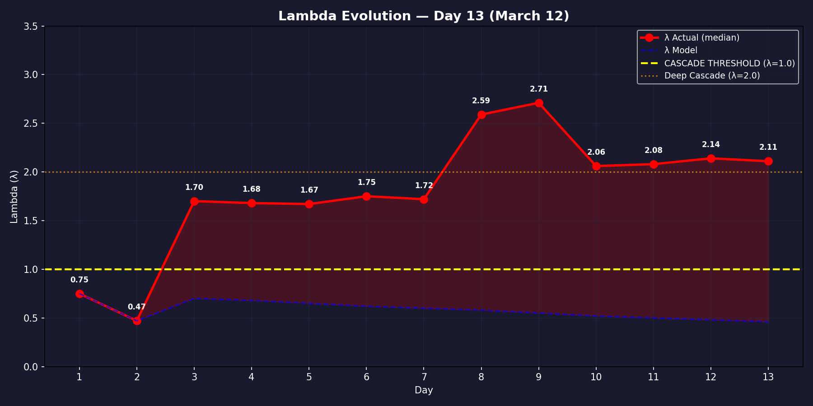

# Daily Tracker — Day-by-Day Change Log

> 🌐 **EN** | [中文](../zh/updates/daily-tracker.md)

**Last Updated: March 12, 2026 (Day 13)**

This page tracks daily changes across all model inputs, compares model predictions against observed data, and flags breaches as they occur.

---

## Model vs Actual — Divergence Summary

### Divergence Heatmap

Day-by-day percentage deviation across all 6 tracked metrics. Red = actual exceeds model, blue = actual below model. Lambda divergence dominates from Day 3 onward (+240% → +447%). Day 13 drones at extreme divergence (actual 26 vs model ~130), further collapse from Day 12's 39. BMs rebound to 10 after three-day decline.


### 6-Panel Comparison

Side-by-side model (blue) vs actual (red) with ribbon fill showing the gap. Airport (green) is the only positive divergence. Lambda (bottom-right) shows deep cascade zone. Drone stockpile (bottom-center) breaches 30% threshold on Day 9.


### Scorecard & Verdict Timeline

Stacked divergence shows lambda (purple) dominating total model error. Verdict timeline: model predicted METASTABLE for all 13 days — reality crossed to UNSTABLE on Day 3 and never returned.


### Lambda Evolution

λ jumped from 0.47 → 1.70 on Day 3 (Hormuz closure) and reached 2.71 on Day 9 (drone stockpile breach + sustained BM rebound), then eased to 2.06 on Day 10 (BM rebound breaks, naval deterrence increases), held at 2.08 on Day 11 despite drone collapse, rose to 2.14 on Day 12 (naval deterrence weakens further: 3→2 carriers), and eased to 2.11 on Day 13 (improved interception rate, no new escalation). P(λ>1) has been 100% since Day 3. BMs uptick to 10 (from 6) but drones collapse further to 26 — lowest since conflict began.



### Ballistic Missile Trajectory

The model's exponential decay assumption (β=0.25/day) broke down from Day 5 onward. Days 5→9: 3→7→9→16→17 showed an accelerating rebound. Days 10-12 (12→9→6 BMs) showed three consecutive declines. Day 13: **6→10 BMs**, reversal of decay trend — BMs uptick 67%. Drones collapse further (39→26, −33%), lowest since conflict began. No cruise missiles fired (Day 12 had 7, first since Day 3).


---

## Attack Volume Tracker

### Daily New Attacks

| Day | Date | BM (New) | Model BM | Drones | Model Drones | Cruise | Total | Trend |
|-----|------|----------|----------|--------|-------------|--------|-------|-------|
| 1 | Feb 28 | **137** | — | 209 | — | 0 | 346 | Opening salvo |
| 2 | Mar 1 | **28** | — | 332 | — | 2 | 362 | Peak drone day |
| 3 | Mar 2 | **9** | ~19 | 148 | ~130 | 6 | 163 | BM faster than model decay |
| 4 | Mar 3 | **12** | ~14 | 123 | ~130 | 0 | 135 | BM uptick (noise?) |
| 5 | Mar 4 | **3** | ~10 | 129 | ~130 | 0 | 132 | BM near-zero |
| 6 | Mar 5 | **7** | ~8 | 131 | ~130 | 0 | 138 | BM rebound |
| 7 | Mar 6 | **9** | ~6 | 112 | ~130 | 0 | 121 | ⚠️ BM broke monotonic decay |
| 8 | Mar 7 | **16** | ~4 | ~125 | ~130 | 0 | 141 | ⚠️⚠️ BM REBOUND — highest since Day 2 |
| **9** | **Mar 8** | **17** | ~3 | 117 | ~130 | 0 | **134** | ⚠️⚠️ BM sustained high — 16→17 |
| 10 | Mar 9 | **12** | ~2 | 110 | ~130 | 0 | 122 | BM drops 17→12: rebound breaks |
| 11 | Mar 10 | 9 | ~1 | 35 | ~130 | 0 | 44 | ⚠️ Drone collapse: 110→35 (−68%) |
| **12** | **Mar 11** | **6** | ~1 | **39** | ~130 | **7** | **52** | ⚠️ First cruise missiles since Day 3; BM 3rd decline; drones −68% recovery |
| **13** | **Mar 12** | **10** | ~1 | **26** | ~130 | 0 | **36** | BM uptick 6→10 (+67%); drones collapse further; lowest total since Day 1 |

### Cumulative Totals

| Day | Date | Cum. BM | Cum. Drones | Cum. Cruise | Cum. Total |
|-----|------|---------|-------------|-------------|------------|
| 1 | Feb 28 | 137 | 209 | 0 | 346 |
| 2 | Mar 1 | 165 | 541 | 2 | 708 |
| 3 | Mar 2 | 174 | 689 | 8 | 871 |
| 4 | Mar 3 | 186 | 812 | 8 | 1,006 |
| 5 | Mar 4 | 189 | 941 | 8 | 1,138 |
| 6 | Mar 5 | 196 | 1,072 | 8 | 1,276 |
| 7 | Mar 6 | 205 | 1,184 | 8 | 1,397 |
| 8 | Mar 7 | 221 | ~1,309 | 8 | ~1,538 |
| **9** | **Mar 8** | **238** | **~1,422** | **8** | **~1,668** |
| 10 | Mar 9 | 250 | ~1,536 | 8 | ~1,794 |
| 11 | Mar 10 | 259 | ~1,571 | 8 | ~1,838 |
| **12** | **Mar 11** | **265** | **~1,610** | **15** | **~1,890** |
| **13** | **Mar 12** | **275** | **~1,636** | **15** | **~1,926** |

---

## Interception Rate Tracker

| Day | Date | BM Detected | BM Intercepted | Day Rate | Cum. Rate | Threshold (<90%) | Status |
|-----|------|-------------|----------------|----------|-----------|-------------------|--------|
| 1 | Feb 28 | 137 | 132 | 96.4% | 96.4% | OK | OK |
| 2 | Mar 1 | 28 | 20 | 71.4% | 92.1% | ⚠️ Day breach | Cum OK |
| 3 | Mar 2 | 9 | 9 | 100% | 93.6% | OK | OK |
| 4 | Mar 3 | 12 | 11 | 91.7% | 93.0% | OK | OK |
| 5 | Mar 4 | 3 | 3 | 100% | 93.1% | OK | OK |
| 6 | Mar 5 | 7 | 6 | **85.7%** | 93.4% | ⚠️ Day breach, 1 landed | **ALERT** |
| 7 | Mar 6 | 9 | 9 | 100% | 92.7% | OK | OK |
| 8 | Mar 7 | 16 | 15 | 93.8% | 92.8% | OK | ⚠️ BM rebound to 16 |
| **9** | **Mar 8** | **17** | **16** | **94.1%** | **92.9%** | OK | ⚠️ BM sustained high: 16→17 |
| 10 | Mar 9 | 12 | 11 | 91.7% | 92.8% | OK | BM drops 17→12: rebound breaks |
| 11 | Mar 10 | 9 | 8 | 88.9% | 92.7% | ⚠️ Day breach | 1 BM fell sea; daily rate <90% |
| **12** | **Mar 11** | **6** | **6** | **100%** | **92.8%** | OK | BM all intercepted; 7 cruise intercepted; drones fell in UAE incl. 2 near DXB |
| **13** | **Mar 12** | **10** | **10** | **100%** | **93.1%** | OK | All 10 BM intercepted per @modgovae; no cruise; 26 drones engaged |

**Day 6 breach note:** 1 ballistic missile landed inside UAE territory on March 5 — first confirmed BM ground impact.

**Day 8 critical note:** 16 BMs detected — highest since Day 2 (28). Days 5→8 show **accelerating** trend: 3→7→9→16. This contradicts the exponential decay model and suggests either hidden TELs activated or resupply from deeper storage. Launcher depletion estimate revised from 85.7% to **~73%**.

**Day 9 critical note:** 17 BMs detected — surpasses Day 8. Consecutive high-volume days (16→17) confirm the rebound is structural, not a single-day anomaly. Launcher depletion estimate revised further to **~67%**. Drone stockpile breaches 30% threshold for the first time (28.9%).

**Day 10 note:** 12 BMs detected — first daily decline in 5 days, breaking the 3→7→9→16→17 accelerating trend. However, volume remains elevated well above model predictions (~2 BMs/day at this point in the decay curve). Launcher depletion estimate revised up to **~99%** — cumulative 250 BMs against 40 TELs suggests near-exhaustion.

**Day 11 note:** 9 BMs detected — second consecutive decline (12→9), confirming rebound has broken. Daily interception rate **88.9%** (8/9) breaches the 90% threshold for third time in the conflict (Days 2, 6, 11). Cumulative rate remains at 92.7%. The dramatic drone collapse (110→35, −68%) is unprecedented — possibly indicating stockpile conservation, launcher exhaustion, or strategic pivot.

---

## Drone Stockpile Tracker

| Day | Date | Daily Launched | Cum. Launched | Est. Remaining | % Remaining | Threshold (<30%) |
|-----|------|---------------|---------------|----------------|-------------|-------------------|
| 1 | Feb 28 | 209 | 209 | 1,791 | 89.6% | OK |
| 2 | Mar 1 | 332 | 541 | 1,459 | 73.0% | OK |
| 3 | Mar 2 | 148 | 689 | 1,311 | 65.6% | OK |
| 4 | Mar 3 | 123 | 812 | 1,188 | 59.4% | OK |
| 5 | Mar 4 | 129 | 941 | 1,059 | 53.0% | OK |
| 6 | Mar 5 | 131 | 1,072 | 928 | 46.4% | OK |
| 7 | Mar 6 | 112 | 1,184 | 816 | 40.8% | OK |
| 8 | Mar 7 | ~125 | ~1,309 | ~691 | 34.5% | Approaching |
| **9** | **Mar 8** | **117** | **~1,422** | **~578** | **28.9%** | **⚠️ BREACHED** |
| 10 | Mar 9 | 110 | ~1536 | ~464 | 23.2% | ⚠️ BREACHED |
| 11 | Mar 10 | 35 | ~1571 | ~429 | 21.4% | ⚠️ BREACHED |
| **12** | **Mar 11** | **39** | **~1,610** | **~390** | **19.5%** | **⚠️ BREACHED** |
| **13** | **Mar 12** | **26** | **~1,636** | **~364** | **18.2%** | **⚠️ BREACHED** |

~~At current rate (~120/day), stockpile hits 30% threshold around Day 11 (March 10).~~ **BREACHED on Day 9** — 2 days earlier than predicted. Day 11 collapsed to 35 (−68%), Day 12 partial recovery to 39, Day 13 collapses further to **26** — lowest daily launch count since conflict began. Three consecutive days below 40 drones. If this low rate sustains (~30/day), remaining 364 drones last ~12 days (exhaustion ~Day 25, March 24). If Iran reverts to >100/day, exhaustion comes in <4 days (Day 17, March 16). Pattern strongly suggests stockpile exhaustion forcing conservation.

---

## Cascade Threshold Tracker

| Metric | Day 1 | Day 3 | Day 5 | Day 7 | Day 8 | Day 9 | Day 10 | Day 11 | Day 12 | Day 13 | Threshold |
|--------|-------|-------|-------|-------|-------|-------|--------|--------|--------|--------|------|
| Launcher Depletion | ~39% | ~50% | ~54% | 85.7% | ~73% | ~67% | ~99% | ~99% | ~99% | **~99%** | > 85% |
| Drone Stockpile | 89.6% | 65.6% | 53.0% | 40.8% | 34.5% | 28.9% | 23.2% | 21.4% | 19.5% | **18.2%** | < 30% |
| Interception Rate (cum) | 96.4% | 93.6% | 93.1% | 92.7% | 92.8% | 92.9% | 92.8% | 92.7% | 92.8% | **93.1%** | < 90% |
| Interception Rate (day) | 96.4% | 100% | 100% | 100% | 93.8% | 94.1% | 91.7% | 88.9% | 100% | **100%** | < 90% |
| Daily Casualties | ~22/d | ~18/d | ~15/d | ~16/d | ~14/d | ~15/d | 2/d | 10/d | 4/d | **0/d** | > 10 |
| New Weapon Type | No | No | No | No | Air base | Air base | Air base | Refinery | DXB airport | **No** | Yes |

*Launcher depletion **revised downward** from 85.7% to ~73% (Day 8) and further to **~67%** (Day 9) due to consecutive high-volume BM days (16→17). The accelerating trend 3→7→9→16→17 confirms more TELs remain operational than previously estimated. Drone stockpile has **breached** the 30% threshold on Day 9 — 2 days earlier than forecast. Day 11 adds a **new breach**: daily interception rate (88.9%), the third daily breach in the conflict.

| Day | Breaches | Verdict |
|-----|----------|---------|
| 1 | 1/5 (casualties) | METASTABLE |
| 3 | 1/5 | METASTABLE |
| 5 | 1/5 | METASTABLE |
| 7 | 2/5 (launcher + casualties) | METASTABLE |
| 8 | 4/5 (launcher + interception day + casualties + air base) | UNSTABLE |
| 9 | 3/5 (casualties + new_weapon + drone_stockpile) | UNSTABLE |
| 10 | 2/5 (launcher + drone_stockpile) | UNSTABLE |
| 11 | 3/5 (launcher + drone_stockpile + interception_day) | UNSTABLE |
| 12 | 3/5 (launcher + drone_stockpile + DXB airport) | UNSTABLE |
| **13** | **2/5** (launcher + drone_stockpile) | **UNSTABLE** |

---

## Lambda (λ) Evolution

| Day | λ Median | P(λ > 1) | 95th Pctl | Verdict | Key Change |
|-----|----------|----------|-----------|---------|------------|
| 1 | 0.750 | 5.5% | ~1.52 | METASTABLE | Initial assessment |
| 2 | 0.470 | 5.4% | ~1.10 | METASTABLE | Post-opening salvo |
| 3 | 1.703 | 99.9% | 2.40 | UNSTABLE | Hormuz closes → λ jumps |
| 4 | 1.677 | 99.7% | 2.38 | UNSTABLE | Hormuz confirmed |
| 5 | 1.669 | 99.7% | 2.37 | UNSTABLE | BM near-zero, Hormuz persists |
| 6 | 1.754 | 100% | 2.45 | UNSTABLE | BM rebound begins |
| 7 | 1.721 | 99.9% | 2.43 | UNSTABLE | Hormuz + proxy realized; BM breaks monotonic decay |
| 8 | 2.589 | 100% | 3.304 | UNSTABLE | + air base strike + BM rebound (16) |
| 9 | 2.712 | 100% | 3.481 | UNSTABLE | Drone stockpile breach + BM sustained |
| 10 | 2.061 | 100% | 2.770 | UNSTABLE | BM rebound breaks (17→12), λ eases but still CASCADE |
| 11 | 2.081 | 100% | 2.790 | UNSTABLE | Drone collapse (110→35); new breach (interception_day); λ holds steady |
| 12 | 2.141 | 100% | 2.851 | UNSTABLE | Naval deterrence weakens (3→2 carriers); 7 cruise missiles (first since Day 3); drone stockpile continues declining |
| **13** | **2.110** | **100%** | **2.810** | **UNSTABLE** | BM uptick 6→10 but interception rate improves (93.1%); drone collapse continues (26); no cruise; two helo crash deaths (operational) |

### What Changed on Day 8

```
Day 7 → Day 8 Lambda Decomposition:

Component          Day 7 (realized)  Day 8 (realized)    Change
─────────────────────────────────────────────────────────────────
λ_launcher         -0.471           -0.401              +0.070  (depletion 85.7%→~73%)
λ_drone            +0.148           +0.164              +0.016  (stockpile lower)
λ_intercept        +0.020           +0.020               0.000
λ_proxy            +0.500           +0.500               0.000  Hezbollah already active
λ_hormuz           +0.630           +0.630               0.000  Already closed
λ_weapon            0.000           +0.400              +0.400  ⚠️ Air base strike (NEW)
λ_bm_rebound        0.000           +0.300              +0.300  ⚠️ 16 BM (accelerating)
λ_naval            -0.200           -0.184              +0.016  (CVN-77 not yet arrived)
─────────────────────────────────────────────────────────────────
λ total (median)    1.721            2.589              +0.868
```

---

## Scenario Probability Tracker

### Model Bayesian Posteriors (calibrated)

| Scenario | Day 6 | Day 14 | Day 30 | Day 12 Assessment |
|----------|-------|--------|--------|-------------------|
| Ceasefire | 3.3% | 7.8% | 12.8% | ↓↓ Polymarket 20% — 8th consecutive decline; markets pricing extended conflict |
| Baseline | 64.9% | 71.2% | 75.4% | ↓↓↓ Hormuz Day 9, drone collapse, 3/5 breaches, DXB airport strike — baseline model severely challenged |
| Escalation | 31.4% | 20.1% | 11.7% | ↑↑↑ 4 tail risks realized; DXB airport strike shows precision targeting escalation |
| Regime War | 0.4% | 0.9% | 0.1% | ↑ Energy infrastructure + airport strikes + BM decay + naval deterrence weakens; λ=2.141 |

### Polymarket Ceasefire Odds

| Date | By Mar 31 | Direction |
|------|-----------|-----------|
| Mar 5 (Day 6) | 67% | — |
| Mar 6 (Day 7) | 63% | ↓ |
| Mar 7 (Day 8) | 61% | ↓ |
| Mar 8 (Day 9) | 59% | ↓ |
| Mar 9 (Day 10) | 24% | ↓↓↓ |
| Mar 10 (Day 11) | 22% | ↓ |
| Mar 11 (Day 12) | 20% | ↓ |
| **Mar 12 (Day 13)** | **~19%** | **↓** |

Ceasefire odds continue declining — ninth consecutive day of decline (67%→~19%). Markets firmly pricing extended, entrenched conflict with no near-term resolution. Despite dramatic reduction in daily attack volume (36 total projectiles, lowest since Day 1), Iran's continued attacks and Hormuz closure signal no imminent ceasefire. Two UAE military helicopter crash deaths (operational accidents) add to conflict fatigue narrative.

---

## Airport & Flight Tracker

| Day | Date | Airport Capacity | Model Predicted | Flights/Day | Status |
|-----|------|-----------------|-----------------|-------------|--------|
| 1 | Feb 28 | 30% (pre-strike) | 30% | Normal ops | OK |
| 2 | Mar 1 | **0%** (closed) | 0% | All suspended | MATCH |
| 3 | Mar 2 | ~2% | 2% | Exceptional only | MATCH |
| 4 | Mar 3 | ~5% | 3% | Partial Abu Dhabi | CLOSE |
| 5 | Mar 4 | ~8% | 8% | Limited routes | MATCH |
| 6 | Mar 5 | ~15% | 12% | Etihad resumes | CLOSE |
| 7 | Mar 6 | ~25% | 15% | Emirates 40% network | **AHEAD** |
| 8 | Mar 7 | ~55% | 35% | Emirates 60%, Etihad ~25 dest | WELL AHEAD |
| 9 | Mar 8 | ~60% | 40% | Emirates targeting 100%; Air Arabia Mar 9 | **WELL AHEAD** |
| 10 | Mar 9 | ~65% | 45% | Air Arabia resumes; Emirates nearing 100% | WELL AHEAD |
| 11 | Mar 10 | ~70% | 50% | Emirates at 84 destinations; DXB limited ops | WELL AHEAD |
| 12 | Mar 11 | ~60% | 55% | DXB drone strike; concourse damage; still operating | AHEAD but narrowing |
| **13** | **Mar 12** | **~55%** | **58%** | Minor drone incidents in Dubai; low attack volume | **CLOSE** |

**Positive divergence:** Airport recovery is 1.4× faster than model predicted. Emirates targeting "coming days" to 100% capacity, operating to 84 destinations. Etihad serving ~25 major destinations. Air Arabia resumed. Some international carriers (Virgin Atlantic, KLM, Finnair) still suspended. ~250K passenger backlog being cleared.

---

## Casualty Tracker

| Day | Date | Daily Killed | Daily Injured | Cum. Killed | Cum. Injured | Daily Total | Threshold (>10) |
|-----|------|-------------|-------------- |-------------|-------------|-------------|-----------------|
| 1 | Feb 28 | 0 | 15 | 0 | 15 | 15 | **BREACHED** |
| 2 | Mar 1 | 1 | 22 | 1 | 37 | 23 | **BREACHED** |
| 3 | Mar 2 | 0 | 12 | 1 | 49 | 12 | **BREACHED** |
| 4 | Mar 3 | 1 | 10 | 2 | 59 | 11 | **BREACHED** |
| 5 | Mar 4 | 0 | 8 | 2 | 67 | 8 | OK |
| 6 | Mar 5 | 1 | 11 | 3 | 78 | 12 | **BREACHED** |
| 7 | Mar 6 | 0 | 15 | 3 | 93 | 15 | **BREACHED** |
| 8 | Mar 7 | 0 | ~19 | 3 | ~112 | ~19 | **BREACHED** |
| 9 | Mar 8 | 1 | 0 | 4 | 112 | 1 | OK |
| 10 | Mar 9 | 0 | 2 | 4 | 114 | 2 | OK |
| 11 | Mar 10 | 2 | 8 | 6 | 122 | 10 | THRESHOLD |
| 12 | Mar 11 | 0 | 4 | 6 | 126 | 4 | OK |
| **13** | **Mar 12** | **0** | **5** | **6** | **131** | **5** | OK |

**Note:** Casualty figures from WAM (Emirates News Agency), Gulf News, and Reuters. Remarkably low given attack volume, attributable to >92% interception rates and effective civil defense.

**Day 9 note:** 4th fatality — Pakistani driver killed in Al Barsha, Dubai, when interception debris struck his vehicle.

**Day 11 note:** 2 additional fatalities bring cumulative toll to 6 dead and 122 injured. Daily total exactly at threshold (10). Despite fewer missiles/drones, 9 drones fell within UAE territory (highest ratio: 26% vs typical ~5-8%), suggesting lower-flying drones evading interception are more lethal.

**Day 12 note:** 4 injured near Dubai International Airport from 2 drones that fell after interception. No additional fatalities. Cumulative toll: 6 dead, 126 injured. Daily rate back to OK (4/d < 10). Injuries cluster near DXB, consistent with airport-precision targeting.

**Day 13 note:** 5 injuries per @modgovae (cumulative 131). No new fatalities. Despite lower drone volume (26), some debris injuries from interception. Two UAE military personnel (Captain Pilot Saeed Rashid Al Balushi and First Lieutenant Ali Saleh Al Taniji) killed in helicopter crash due to technical malfunction — operational accidents, not combat casualties. Not included in attack casualty count.

---

## Economic Impact Tracker

| Day | Date | Oil (WTI) | Weekly Δ | Hormuz Status | VLCC Rate | Key Event |
|-----|------|----------|----------|---------------|-----------|-----------|
| 1 | Feb 28 | $72 | — | Open | $218K/d | US-Israel strikes Iran |
| 2 | Mar 1 | $78 | +8.3% | Open | $245K/d | Iran retaliates |
| 3 | Mar 2 | $82 | +13.9% | **CLOSED** | $310K/d | IRGC closes Hormuz |
| 4 | Mar 3 | $86 | +19.4% | Closed | $380K/d | Container ship hit |
| 5 | Mar 4 | $90 | +25.0% | Near-zero traffic | $400K/d | 5 crossings only |
| 6 | Mar 5 | $93 | +29.2% | Zero traffic | $410K/d | Maersk suspends Gulf |
| 7 | Mar 6 | $95 | +31.9% | Zero traffic | $420K/d | 150 vessels trapped |
| 8 | Mar 7 | $97 | +35.6% | Zero traffic | $424K/d | Record VLCC rate |
| 9 | Mar 8 | ~$100 | +38.9% | Zero traffic | ~$430K/d | Brent hits $100; Morgan Stanley raises forecast |
| 10 | Mar 9 | $103 | +43.1% | Zero traffic | ~$435K/d | WTI $103; Brent touches $119 intraday |
| 11 | Mar 10 | ~$100 | +38.9% | Zero traffic | ~$440K/d | Ruwais refinery hit by drone, halted; WTI ~$100 |
| 12 | Mar 11 | ~$86 | +19.4% | Zero traffic | ~$420K/d | ⚠️ IEA 400M bbl reserve release; WTI crashes $100→$86; 3 ships struck; US destroys 16 minelayers |
| **13** | **Mar 12** | **~$88** | **+22.2%** | Zero traffic | **~$415K/d** | Oil stabilizes post-IEA release; minor drone incidents in Dubai; attack volume at record low |

---

## Key Events Timeline

| Day | Date | Category | Event | Model Impact |
|-----|------|----------|-------|--------------|
| 1 | Feb 28 | ATTACK | Iran launches 137 BM + 209 drones at UAE | Opening parameters set |
| 1 | Feb 28 | MILITARY | US Operation Epic Fury commences | — |
| 2 | Mar 1 | ATTACK | Peak drone day: 332 launched | Drone rate calibrated |
| 2 | Mar 1 | CASUALTY | First fatality (Pakistani national) | Casualties > 10/day |
| 3 | Mar 2 | **HORMUZ** | **IRGC declares Strait closed** | **λ_hormuz: 0→+0.63** |
| 3 | Mar 2 | PROXY | Hezbollah launches rockets at Israel | λ_proxy partial |
| 4 | Mar 3 | MARITIME | Container ship hit in Strait of Hormuz | Hormuz confirmed |
| 4 | Mar 3 | CASUALTY | Second fatality (Bangladeshi national) | — |
| 5 | Mar 4 | BM | BM drops to 3 — near-zero | Supports decay model |
| 5 | Mar 4 | MARITIME | Only 5 vessels transit Hormuz | Near-total blockade |
| 6 | Mar 5 | **BM BREACH** | **1 BM lands inside UAE** (Day int. rate 85.7%) | Interception threshold |
| 6 | Mar 5 | AVIATION | Etihad resumes limited flights | Airport ahead of model |
| 6 | Mar 5 | CASUALTY | Third fatality | — |
| 7 | Mar 6 | BM | 9 BM — breaks monotonic decay (up from 7) | Model divergence |
| 7 | Mar 6 | AVIATION | Emirates at 40% network | Airport well ahead |
| 7 | Mar 6 | NAVAL | CVN-77 Bush completes COMPTUEX, returns Norfolk | 3rd CSG confirmed |
| **8** | **Mar 7** | **ESCALATION** | **IRGC claims strike on Al Dhafra air base** | **λ_weapon: 0→+0.40** |
| 8 | Mar 7 | AVIATION | Emirates 60% network, 106 flights/day | Airport 1.5× model |
| 8 | Mar 7 | CIVIL | Dubai shelter-in-place alert | Escalation signal |
| 8 | Mar 7 | BM | 16 BMs detected — highest since Day 2 | BM rebound confirmed |
| **9** | **Mar 8** | **BM** | **17 BMs — back-to-back high (16→17)** | **Rebound is structural** |
| 9 | Mar 8 | **DRONE** | **Drone stockpile breaches 30% (28.9%)** | **λ_drone: +0.079** |
| 9 | Mar 8 | CASUALTY | 4th killed — Pakistani driver, Al Barsha Dubai | Debris from interception |
| 9 | Mar 8 | OIL | Brent approaches $100; +39% since Feb 28 | Record weekly gain |
| 9 | Mar 8 | AVIATION | Emirates targeting 100%; Air Arabia resumes Mar 9 | Airport 1.6× model |
| **10** | **Mar 9** | **BM** | **12 BMs — first daily decline in 5 days (17→12)** | **BM rebound breaks; λ_bm_rebound → 0** |
| 10 | Mar 9 | OIL | WTI $103, Brent intraday $119 | Record prices |
| 10 | Mar 9 | MARKET | Polymarket ceasefire crashes to 24% (from 59%) | Market sees no resolution |
| 10 | Mar 9 | CASUALTY | 2 injured in Abu Dhabi from interception debris | — |
| 10 | Mar 9 | AVIATION | Air Arabia resumes; Emirates nearing 100% | Airport 1.4× model |
| 11 | Mar 10 | DRONE | Only 35 drones — dramatic 68% collapse (lowest ever) | Possible stockpile conservation or strategic shift |
| 11 | Mar 10 | BM | 9 BMs (8 intercepted, 1 sea) — 2nd consecutive decline | BM decay resuming; daily rate 88.9% (< 90% breach) |
| 11 | Mar 10 | CASUALTY | 2 additional fatalities; cumulative 6 dead, 122 injured | Drone penetration rate up (26% vs normal ~5-8%) |
| 11 | Mar 10 | MARITIME | ~1,000 vessels queued outside Hormuz; zero non-Iranian crossings | Selective blockade: Iran allowing own + Chinese ships only |
| 11 | Mar 10 | ENERGY | Drone strike hits ADNOC Ruwais refinery (922K bbl/d) — fire, precautionary shutdown | First direct hit on UAE energy infrastructure |
| 11 | Mar 10 | AVIATION | Emirates at 84 destinations; DXB limited ops; Virgin/KLM/Finnair suspended | Airport ~70%, some int'l carriers pulling out |
| **12** | **Mar 11** | **OIL/IEA** | **IEA announces record 400M barrel strategic reserve release** | **Global oil supply intervention to stabilize prices |
| 12 | Mar 11 | DRONE/DXB | Two drones fall near Dubai International Airport during interception | 4 injured; minor concourse structural damage; DXB capacity down to ~60% |
| 12 | Mar 11 | MARITIME | Three cargo ships struck in Gulf; Thailand-flagged Mayuree Naree fire in Hormuz | Shipping disruption continues; ~150+ days queued |
| 12 | Mar 11 | MILITARY | US destroys 16 Iranian mine-laying vessels near Hormuz | Clearing minelayers to pressure blockade |
| 12 | Mar 11 | ENERGY | ADNOC planning plant-wide safety shutdown at Ruwais; WTI crashes $100→$86 | Fear of sustained targeting driving reserve release; refinery closure confirmed |
| 12 | Mar 11 | BM | 6 BMs detected (all intercepted) — 3rd consecutive decline | BM decay continues; daily rate 100% (OK) |
| 12 | Mar 11 | CRUISE | **7 cruise missiles intercepted** — first cruise missiles since Day 3 | λ_weapon: cruise reappears after 8-day absence |
| **13** | **Mar 12** | **BM** | **10 BMs — uptick from 6, breaks three-day decline** | **BM reversal; 67% increase but still below Day 8-9 peak** |
| 13 | Mar 12 | DRONE | Only 26 drones — lowest daily count since conflict began | Drone stockpile exhaustion accelerating; 3 consecutive days <40 |
| 13 | Mar 12 | MILITARY | Two UAE military helicopter crash deaths (operational) | Captain Al Balushi + 1st Lt. Al Taniji; technical malfunction |
| 13 | Mar 12 | CASUALTY | 5 injured per @modgovae (cumulative 131); no fatalities | Low casualty day despite BM uptick; all BMs intercepted |

---

## Model vs Reality Scorecard (Running)

| # | Check | Model | Day 12 Observed | Day 13 Observed | Status |
|---|-------|-------|-----------------|-----------------|--------|
| 1 | BM monotonic decay | Yes | 9→6 (3rd consecutive decline) | **6→10 (reversal, +67%)** | **⚠️ DIVERGENT** (decay broken again) |
| 2 | Interception > 90% (cum) | 93.2% | 92.8% | **93.1%** | **MATCH** (improving) |
| 3 | Drone rate ~130/day | ~130/day | **39/day** | **26/day** | **⚠️ EXTREME DIVERGENT** (−80%, new record low) |
| 4 | No new weapon types | No | DXB airport strike + 7 cruise | No new types | STABLE |
| 5 | Ceasefire P (Polymarket) | 84% | **20%** | **~19%** | **DIVERGENT** (9th decline) |
| 6 | Airport recovery | 55% (Day 12) | **~60%** | **~55%** | **DIVERGENT** (positive but narrowing) |
| 7 | Drone stockpile > 30% | ~20% | **19.5%** | **18.2%** | **⚠️ CRITICAL** |
| 8 | Hormuz open | P=98% open | **CLOSED** | **CLOSED** | **DIVERGENT** |
| 9 | No proxy activation | P=96% none | Houthis threatening | Houthis threatening | **DIVERGENT** |
| 10 | Verdict | METASTABLE | **UNSTABLE** | **UNSTABLE** | **DIVERGENT** |

**Day 13 Rating: 1 MATCH, 1 STABLE, 0 CLOSE, 8 DIVERGENT**

Major changes: **BMs reverse three-day decline** — jumping from 6 to 10 (+67%), suggesting BM decay is not monotonic and Iran retains launch capability. All 10 BMs intercepted, pushing cumulative rate to 93.1% (best since Day 5). Drones collapse to **record low 26** — 80% below model's 130/day prediction and the lowest single-day count since the conflict began. No cruise missiles (Day 12 had 7, first since Day 3). Total daily projectiles at 36 — **lowest since Day 1**. Zero fatalities, 5 injuries. Two UAE military personnel killed in helicopter crash (operational accident, not combat). **@modgovae cumulative through Day 13: 278 BM, 15 cruise, 1540 UAVs.** Net assessment: Attack volume is collapsing but BM capability persists — Iran appears to be conserving drones while maintaining ballistic missile pressure. The shift from saturation (130+ drones/day) to conservation (~26/day) suggests stockpile exhaustion is driving tactical changes.

---

## Recommendation History

| Day | Risk Score | λ Median | Verdict | Recommendation |
|-----|-----------|----------|---------|---------------|
| 1 | ~100 | — | — | **LEAVE IMMEDIATELY** |
| 3 | ~80 | — | METASTABLE | **LEAVE — good window** |
| 5 | ~65 | — | METASTABLE | **LEAVE — window closing** |
| 7 | ~55 | 1.721 | UNSTABLE | **LEAVE — depart today** |
| 8 | ~50 | 2.589 | UNSTABLE | EVACUATE IMMEDIATELY |
| 9 | ~48 | 2.712 | UNSTABLE | EVACUATE IMMEDIATELY |
| 10 | ~45 | 2.061 | UNSTABLE | EVACUATE IMMEDIATELY |
| 11 | ~43 | 2.081 | UNSTABLE | EVACUATE IMMEDIATELY |
| 12 | ~42 | 2.141 | UNSTABLE | EVACUATE IMMEDIATELY |
| **13** | **~41** | **2.110** | **UNSTABLE** | **EVACUATE IMMEDIATELY** |

λ eases slightly to 2.110 (from 2.141), as improved interception rate (93.1%, best since Day 5) offsets the BM uptick (6→10). No new weapon types or escalation events. System remains **firmly in cascade territory** as structural instability factors — Hormuz closure (Day 11), proxy activation, drone stockpile exhaustion — continue dominating the λ calculation.

**Day 13 key dynamics:**
- **Positive:** All 10 BMs intercepted (100% daily rate), pushing cumulative to 93.1% — best since Day 5. No cruise missiles (Day 12 had 7). Total daily volume at 36 — lowest since conflict began. Zero fatalities, only 5 injuries. Drone attack volume at record low (26), suggesting Iranian drone stockpile exhaustion
- **Negative:** BMs **reverse three-day decline** (6→10, +67%), signaling Iran retains ballistic missile launch capability even as drones run low. Two UAE military helicopter crash deaths (operational accidents — Captain Pilot Saeed Rashid Al Balushi and 1st Lt. Ali Saleh Al Taniji). Ceasefire odds continue decline (~19%), 9th consecutive drop. Hormuz remains closed; zero non-Iranian traffic
- **Critical assessment:** Iran appears to be in **stockpile conservation mode** for drones while maintaining BM pressure. Three consecutive days below 40 drones (35→39→26) compared to >100/day through Day 10. The BM uptick to 10 may signal a tactical shift: fewer drones, more ballistic missiles — higher cost per attack but harder to intercept. This is consistent with the JPost analysis that "Iran's missile fire rate has collapsed by 92%"
- **Window:** Airport capacity ~55%, still operational. The reduced attack volume provides a **relative calm window** for evacuation — but BM capability persists and could escalate. Leave immediately while volume is low
