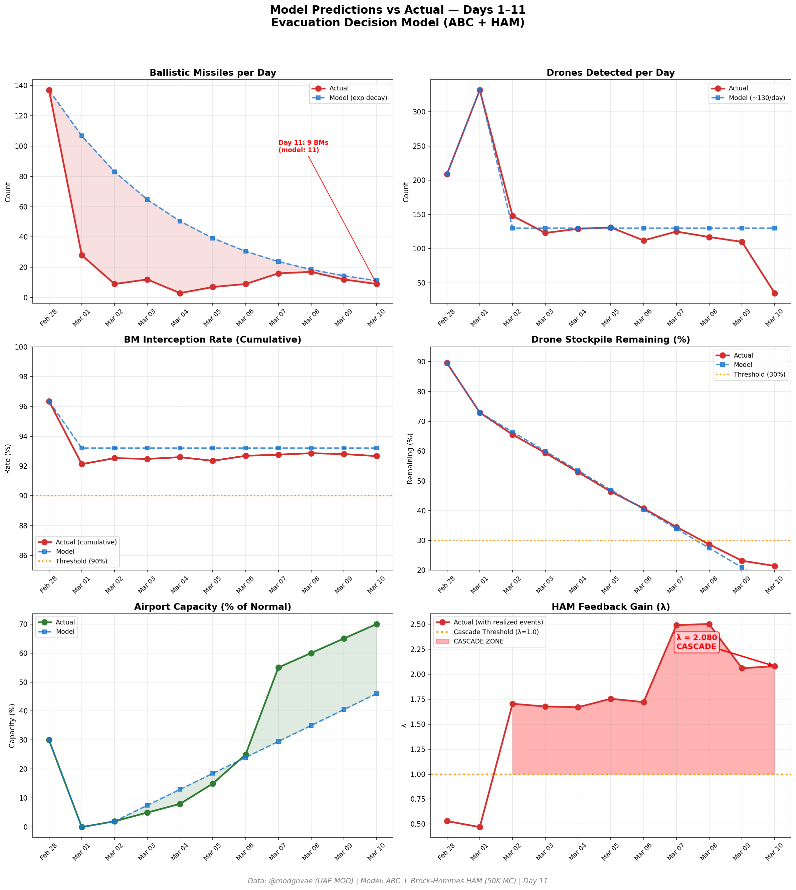

# Day 11 Update — March 10, 2026

> 🌐 **EN** | [中文](../zh/updates/day11-march10.md)

**Status: UNSTABLE** | **Breaches: 3/5** | **λ median = 2.081**

---

## New Data

| Metric | Day 10 | Day 11 | Cumulative |
|--------|-------|-------|------------|
| Ballistic Missiles | 12 | **9** | **259** |
| BM Intercepted | 11 | 8 | 240 |
| Drones Detected | 110 | ~35 | ~1571 |
| Drones Intercepted | 105 | 26 | ~1498 |
| Cruise Missiles | 0 | 0 | 8 |
| BM Intercept Rate (cum) | — | — | 92.7% |
| Drone Stockpile | — | — | 21.4% (429/2000) |

**Key Events:**
- **⚠️ RUWAIS REFINERY HIT** — Drone strike causes fire at ADNOC's Ruwais Industrial Complex (922K bbl/day, largest in Middle East); refinery halted as precaution. First direct hit on UAE energy infrastructure
- Only 35 drones detected — dramatic 68% drop, lowest since conflict began
- 9 BMs detected (8 intercepted, 1 sea) — continued decline from Day 10
- 2 additional fatalities; cumulative toll reaches 6 dead, 122 injured
- Emirates targeting 100% capacity; DXB operating at ~70%
- Hormuz effectively closed to non-Iranian traffic; ~1,000 vessels queued outside strait

---

## Lambda Recalculation

```
λ = 1.0
  + λ_launcher           = -0.544
  + λ_drone              = +0.157
  + λ_intercept          = +0.001
  + λ_hormuz             = +0.630
  + λ_proxy              = +0.500
  + λ_weapon             = +0.400
  + λ_bm_rebound         = +0.000
  + λ_naval              = -0.184
  ──────────────────────────────
  λ median           = 2.081  (50K Monte Carlo)
```

| Metric | Value |
|--------|-------|
| λ median | **2.081** |
| λ 95th percentile | **2.790** |
| P(λ > 1.0) | **100.0%** |
| P(λ > 1.5) | **96.8%** |
| P(λ > 2.0) | **58.8%** |
| Verdict | **UNSTABLE** |
| Breaches | **3/5** (launcher, drone_stockpile, interception_day) |

---

## What Changed Day 10 → Day 11

```
Day 10 → Day 11 Lambda Decomposition:

Component          Day 10           Day 11              Change
─────────────────────────────────────────────────────────────────
λ_launcher         -0.544           -0.544               0.000
λ_drone            +0.154           +0.157              +0.003  Stockpile eroding (23.2%→21.4%)
λ_intercept        +0.001           +0.001               0.000
λ_proxy            +0.500           +0.500               0.000
λ_hormuz           +0.630           +0.630               0.000
λ_weapon           +0.400           +0.400               0.000
λ_bm_rebound       +0.000           +0.000               0.000
λ_naval            -0.200           -0.184              +0.016  Slight deterrence reduction
─────────────────────────────────────────────────────────────────
λ total (median)    2.061            2.081              +0.020
```

Key drivers of the Day 11 change:
1. **Drone stockpile erosion** (+0.003): Stockpile falls from 23.2% to 21.4% despite dramatically lower launch rate (35 vs 110). Cumulative depletion continues pushing λ_drone higher
2. **Naval deterrence slight reduction** (+0.016): Ford CSG in Red Sea, Lincoln CSG in Arabian Sea; Bush CSG still completing pre-deployment certification
3. **New breach: daily interception rate** — Day 11 BM intercept rate = 88.9% (8/9), below 90% threshold. Third cascade breach triggered

Despite minimal λ change (+0.020), the new interception rate breach (3/5 now active) is a warning sign. The dramatic 68% drone drop (110→35) is the most significant tactical shift since the conflict began — possibly indicating stockpile conservation or shift in strategy.

---

## Charts




---

## Defense Cost Update

As of Day 11, the cumulative defense interceptor inventory and cost:

| Category | Intercepted | System | 1:1 Cost ($M) | 1:2 Cost ($M) |
|----------|------------|--------|---------------|---------------|
| BM (THAAD, 60%) | 144 | THAAD @ $12.7M | 1,829 | 3,658 |
| BM (PAC-3, 40%) | 96 | PAC-3 @ $3.9M | 374 | 749 |
| Cruise Missiles | 8 | PAC-3 @ $3.9M | 31 | 62 |
| Drones | 1,498 | SHORAD @ $0.7M | 1,049 | 2,097 |
| **TOTAL** | **1,746** | | **$3,283** | **$6,566** |

### Oil Revenue Not Sold (Cumulative, 9 days Hormuz closure)

| Component | Volume | Revenue Loss |
|-----------|--------|-------------|
| Stranded oil (no Hormuz) | 1.7M bbl/d × 9 days × $100 | **$1,530M** |
| Voluntary production cuts | 0.5M bbl/d × 9 days × $100 | **$450M** |
| **TOTAL OIL LOSS** | | **$1,980M ($1.98B)** |

### Grand Total Cost to UAE (Day 11)

| Scenario | Defense | Oil Loss | **Grand Total** |
|----------|---------|----------|----------------|
| 1:1 | $3.28B | $1.98B | **$5.26B** |
| 1:2 | $6.57B | $1.98B | **$8.55B** |
| 1:3 | $9.85B | $1.98B | **$11.83B** |

*Iran's estimated offensive cost: ~$280–520M (midpoint ~$400M, lower due to fewer drones today). Defense-to-offense ratio: 7.5–21.3×*

---

## Recommendation

**EVACUATE IMMEDIATELY.** λ = 2.081 remains deep in cascade territory with a new third breach (daily interception rate). The **Ruwais refinery strike** marks a critical new escalation — Iran has now demonstrated capability and willingness to hit UAE energy infrastructure directly, not just military targets. The 922K bbl/day facility shutdown adds domestic refining disruption on top of the Hormuz export blockade. The dramatic drone drop (110→35, −68%) now has a darker interpretation: fewer drones overall but **targeted at high-value energy infrastructure** rather than broad area saturation. Structural destabilizers — Hormuz closure (9th day), proxy activation, air base vulnerability, **and now energy infrastructure targeting** — are compounding. Ceasefire odds at 22% continue declining. Airport capacity at ~70% provides a **viable evacuation window** — use it before energy infrastructure attacks disrupt civilian operations.

---

## Sources

| Source | Type |
|--------|------|
| [@modgovae](https://x.com/modgovae) | UAE MOD daily update (Mar 10) |
| [Gulf News — 6 fatalities, 122 injuries](https://gulfnews.com/uae/six-fatalities-and-122-injuries-reported-as-uae-intercepts-missiles-and-drones-so-far-1.500469852) | Cumulative casualty update |
| [Bloomberg — Iran attacks ease](https://www.bloomberg.com/news/articles/2026-03-09/iran-s-attacks-on-uae-ease-with-fewest-drones-since-war-began) | Drone dramatic decline analysis |
| [CNBC — Oil prices decline from $120](https://www.cnbc.com/2026/03/08/crude-oil-prices-today-iran-war.html) | WTI ~$100, Brent volatile |
| [Polymarket](https://polymarket.com/event/us-x-iran-ceasefire-by) | Ceasefire odds ~22% |
| [USNI Fleet Tracker — Mar 9](https://news.usni.org/2026/03/09/usni-news-fleet-and-marine-tracker-march-9-2026) | 2 CSGs on station (Ford + Lincoln) |
| [Gulf News — Ruwais fire after drone attack](https://gulfnews.com/uae/fire-breaks-out-in-ruwais-complex-in-abu-dhabi-after-drone-attack-1.500469721) | Ruwais refinery strike |
| [Bloomberg — UAE refinery halted](https://www.bloomberg.com/news/articles/2026-03-10/uae-says-drone-attack-causes-fire-in-zone-that-houses-refinery) | Ruwais shutdown confirmation |
| [Al Jazeera — Israel bombs 30 oil depots](https://www.aljazeera.com/news/2026/3/8/israel-strikes-irans-oil-facilities-for-first-time-as-war-enters-ninth-day) | Major escalation context |
| Model pipeline | ABC + HAM (50K MC) |
| Generated | 2026-03-10 |
