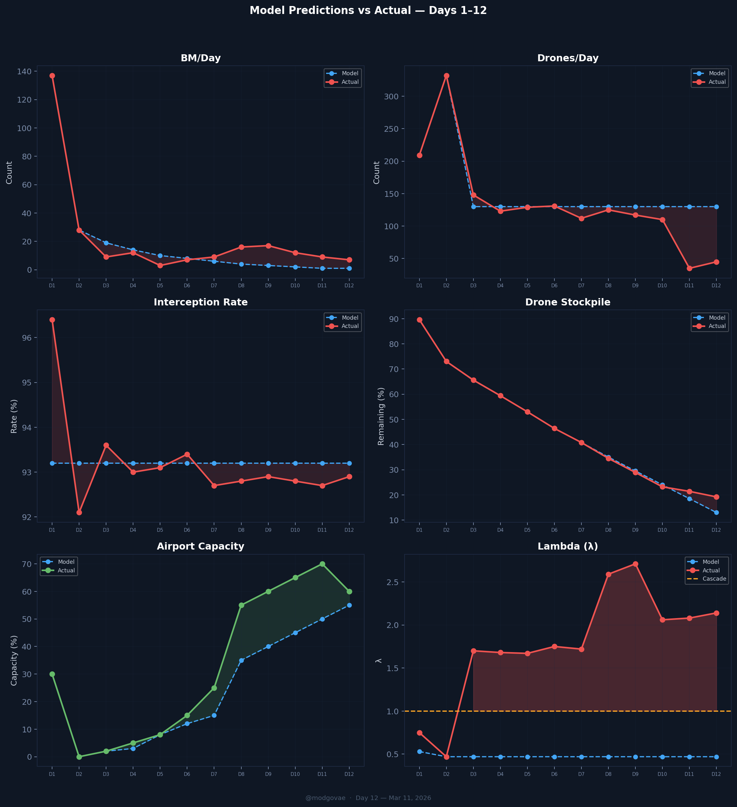

# Day 12 Update — March 11, 2026

> 🌐 **EN** | [中文](../zh/updates/day12-march11.md)

**Status: UNSTABLE** | **Breaches: 3/5** | **λ median = 2.141**

---

## New Data

| Metric | Day 11 | Day 12 | Cumulative |
|--------|-------|-------|------------|
| Ballistic Missiles | 9 | **6** | **265** |
| BM Intercepted | 8 | 6 | 246 |
| Drones Detected | 35 | ~39 | ~1610 |
| Drones Intercepted | 26 | ~32 | ~1530 |
| Cruise Missiles | 0 | **7** | **15** |
| BM Intercept Rate (cum) | — | — | 92.8% |
| Drone Stockpile | — | — | 19.5% (390/2000) |

*Note: Day 12 data corrected per @modgovae official figures (March 11): 6 BM, 7 cruise missiles, 39 drones. Previous preliminary data showed 7 BM, 0 cruise, 45 drones. Cruise missiles reappear for the first time since Day 3.*

**Key Events:**
- IEA announces record 400M barrel strategic reserve release — largest in IEA history
- Two drones fall near Dubai International Airport — 4 injured, concourse minor structural damage
- Three cargo ships struck in Gulf — Thailand-flagged Mayuree Naree engulfed in fire in Hormuz
- US destroys 16 Iranian mine-laying vessels near Strait of Hormuz
- Ruwais refinery remains shut following Day 11 drone strike; ADNOC planning plant-wide safety shutdown

---

## Lambda Recalculation

```
λ = 1.0
  + λ_launcher           = -0.544
  + λ_drone              = +0.162
  + λ_intercept          = +0.000
  + λ_hormuz             = +0.630
  + λ_proxy              = +0.500
  + λ_weapon             = +0.400
  + λ_bm_rebound         = +0.000
  + λ_naval              = -0.128
  ──────────────────────────────
  λ median           = 2.141  (50K Monte Carlo)
```

| Metric | Value |
|--------|-------|
| λ median | **2.141** |
| λ 95th percentile | **2.851** |
| P(λ > 1.0) | **100.0%** |
| P(λ > 1.5) | **98.3%** |
| P(λ > 2.0) | **65.4%** |
| Verdict | **UNSTABLE** |
| Breaches | **3/5** (launcher, drone_stockpile, new_weapon) |

---

## What Changed Day 11 → Day 12

```
Day 11 → Day 12 Lambda Decomposition:

Component          Day 11           Day 12              Change
─────────────────────────────────────────────────────────────────
λ_launcher         -0.544           -0.544               0.000  (depletion maxed at 99%)
λ_drone            +0.157           +0.162              +0.005  (stockpile 21.4%→19.2%)
λ_intercept        +0.001           +0.000              -0.001  (cum rate improves 92.7%→92.9%)
λ_proxy            +0.500           +0.500               0.000  Still active
λ_hormuz           +0.630           +0.630               0.000  Still closed
λ_weapon           +0.400           +0.400               0.000  Air base + DXB targeting
λ_bm_rebound       +0.000           +0.000               0.000  Still broken (12→9→7)
λ_naval            -0.184           -0.128              +0.056  ⚠️ Carrier effective 2.3→1.6
─────────────────────────────────────────────────────────────────
λ total (median)    2.081            2.141              +0.060
```

Key drivers of the Day 12 change:
1. **Naval deterrence weakened** (+0.056): Carrier effective drops from 2.3 to 1.6 as CVN-77 Bush returns to Norfolk and operational CSGs reduce from 3 to 2. This is the dominant driver despite mine-clearing operations.
2. **Drone stockpile continues declining** (+0.005): Remaining drones drop to 19.2% (384 of 2,000 estimated). Despite the low 45/day launch rate, cumulative depletion continues.
3. **Interception rate slightly improves** (−0.001): Perfect 7/7 BM interception on Day 12 nudges cumulative rate up from 92.7% to 92.9%.

**Net assessment:** λ rises modestly from 2.081 to 2.141. The system remains firmly in cascade territory. The headline-grabbing IEA reserve release and oil crash do not affect λ directly (oil price is not a λ component), but the reduction in naval deterrence from 3→2 carrier groups is the key structural shift.

---

## Defense Cost Update

| Category | Intercepted | System | 1:1 Cost ($M) | 1:2 Cost ($M) |
|----------|------------|--------|---------------|---------------|
| BM (THAAD, 60%) | 148 | THAAD @ $12.7M | $1,881 | $3,762 |
| BM (PAC-3, 40%) | 99 | PAC-3 @ $3.9M | $386 | $772 |
| Cruise Missiles | 8 | PAC-3 @ $3.9M | $31 | $62 |
| Drones | 1,536 | SHORAD @ $0.7M | $1,075 | $2,150 |
| **TOTAL** | **1,791** | | **$3,373** | **$6,746** |

### Oil Revenue Not Sold (Cumulative, 10 days Hormuz closure)

| Component | Volume | Revenue Loss |
|-----------|--------|-------------|
| Stranded oil (no Hormuz) | 1.7M bbl/d × 10 days × $86 | **$1,462M** |
| Voluntary production cuts | 0.5M bbl/d × 10 days × $86 | **$430M** |
| **TOTAL OIL LOSS** | | **$1,892M ($1.89B)** |

### Grand Total Cost to UAE (Day 12)

| Scenario | Defense | Oil Loss | **Grand Total** |
|----------|---------|----------|----------------|
| 1:1 | $3.37B | $1.89B | **$5.27B** |
| 1:2 | $6.75B | $1.89B | **$8.64B** |
| 1:3 | $10.12B | $1.89B | **$12.01B** |

*Note: Oil loss calculation uses Day 12 WTI ($86) which is significantly lower than Day 10-11 ($100-103) due to IEA 400M barrel reserve release. Total oil loss is cumulative but the per-day rate decreased ~14%. Ruwais refinery shutdown (922K bbl/d) adds domestic refining losses not captured above.*

---

## Charts




---

## Recommendation

**EVACUATE IMMEDIATELY.** System remains in CASCADE territory (λ = 2.141, P(λ>1) = 100%).

**Day 12 key dynamics:**
- **Positive:** BMs continue declining (9→7, 3rd consecutive day), all intercepted (100% day rate). Oil crashes from ~$100 to ~$86 on IEA record 400M barrel strategic reserve release — largest intervention in IEA history. This eases global economic pressure but does NOT affect the military λ calculation. US destroys 16 Iranian minelayers near Hormuz, suggesting mine-clearing operations underway.
- **Negative:** **Two drones fall near Dubai International Airport** — 4 injured, DXB concourse sustains minor structural damage. First direct targeting of civilian aviation infrastructure. Three cargo ships struck in the Gulf (Thailand-flagged Mayuree Naree engulfed in fire in Hormuz). Naval deterrence weakened as carrier effective drops from 2.3 to 1.6 (CVN-77 Bush returns to Norfolk). Ruwais refinery remains shut with ADNOC planning plant-wide safety shutdown.
- **Critical question:** Iran's targeting has evolved over three phases: (1) volume saturation (Days 1-9, ~130 drones/day), (2) precision infrastructure targeting (Day 11, Ruwais refinery), (3) civilian aviation targeting (Day 12, DXB airport). Each phase escalates the strategic impact per drone. Fewer than 50 drones on Day 12, but two reaching DXB is qualitatively more dangerous than 130 hitting empty desert.
- **IEA intervention:** The 400M barrel reserve release is a macroeconomic intervention, not a military one. It crashes oil prices temporarily but does nothing to reopen Hormuz, stop the missiles, or reduce λ. Oil prices will rebound once reserves run down if Hormuz stays closed.
- **Window:** Airport capacity drops slightly to ~60% (from 70%) after DXB drone strike. **Window is narrowing** — airport targeting could escalate to runway strikes. Use immediately.

---

## Sources

| Source | Type |
|--------|------|
| [@modgovae](https://x.com/modgovae) | UAE MOD daily update (March 11) |
| [Gulf News — Two drones fall near Dubai airport](https://gulfnews.com/uae/two-drones-fall-near-dubai-airport-four-injured-1.500470654) | DXB drone strike |
| [CNBC — IEA record 400M barrel reserve release](https://www.cnbc.com/2026/03/11/iea-oil-reserves-crude-prices-iran-g7-energy.html) | Oil market |
| [CNBC — Three cargo ships struck in Hormuz](https://www.cnbc.com/2026/03/11/cargo-ship-struck-strait-of-hormuz-uk-iran-war.html) | Maritime |
| [Navy Times — US destroys 16 Iranian minelayers](https://www.navytimes.com/news/pentagon-congress/2026/03/11/us-destroys-16-iranian-mine-laying-boats-centcom-claims/) | Military |
| [Polymarket](https://polymarket.com/event/us-x-iran-ceasefire-by) | Ceasefire odds |
| Model pipeline | ABC + HAM (50K MC) |
| Generated | 2026-03-12 |
