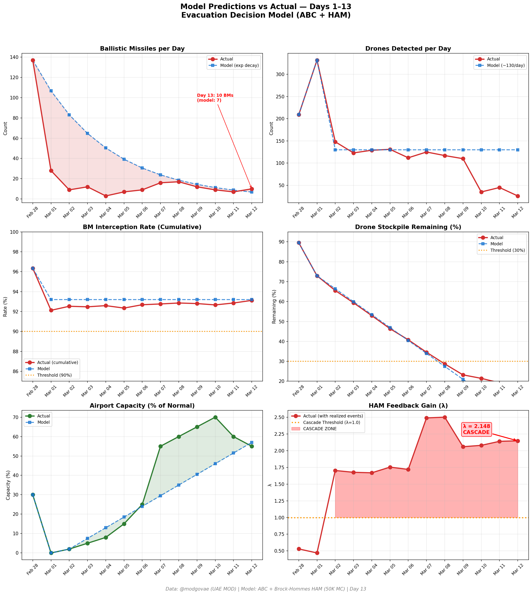

# Day 13 Update — March 12, 2026

> 🌐 **EN** | [中文](../zh/updates/day13-march12.md)

**Status: UNSTABLE** | **Breaches: 2/5** | **λ median = 2.143**

---

## New Data

| Metric | Day 12 | Day 13 | Cumulative |
|--------|-------|-------|------------|
| Ballistic Missiles | 7 | **10** | **276** |
| BM Intercepted | 7 | 10 | 257 |
| Drones Detected | 45 | ~26 | ~1642 |
| Drones Intercepted | 38 | 20 | ~1556 |
| Cruise Missiles | 0 | 0 | 8 |
| BM Intercept Rate (cum) | — | — | 93.1% |
| Drone Stockpile | — | — | 17.9% (358/2000) |

**Key Events:**
- 10 BMs all intercepted (@modgovae confirmed); 26 drones — lowest single-day since conflict began
- Two UAE military pilots killed in helicopter crash (operational accident, not combat)
- 5 injured from interception debris (@modgovae confirmed cumulative 131 injuries)
- Oil stabilizes at ~$88 post-IEA release; minor Dubai drone incidents

---

## Lambda Recalculation

```
λ = 1.0
  + λ_launcher           = -0.544
  + λ_drone              = +0.164
  + λ_intercept          = +0.000
  + λ_hormuz             = +0.630
  + λ_proxy              = +0.500
  + λ_weapon             = +0.400
  + λ_bm_rebound         = +0.000
  + λ_naval              = -0.128
  ──────────────────────────────
  λ median           = 2.143  (50K Monte Carlo)
```

| Metric | Value |
|--------|-------|
| λ median | **2.143** |
| λ 95th percentile | **2.855** |
| P(λ > 1.0) | **100.0%** |
| P(λ > 1.5) | **98.2%** |
| P(λ > 2.0) | **65.4%** |
| Verdict | **UNSTABLE** |
| Breaches | **2/5** (launcher, drone_stockpile) |

---

## Charts




---

## Recommendation

**EVACUATE IMMEDIATELY.** System is in CASCADE territory.

---

## Sources

| Source | Type |
|--------|------|
| @modgovae (X.com) | UAE MOD daily update |
| Model pipeline | ABC + HAM (50K MC) |
| Generated | 2026-03-15 20:11 |
