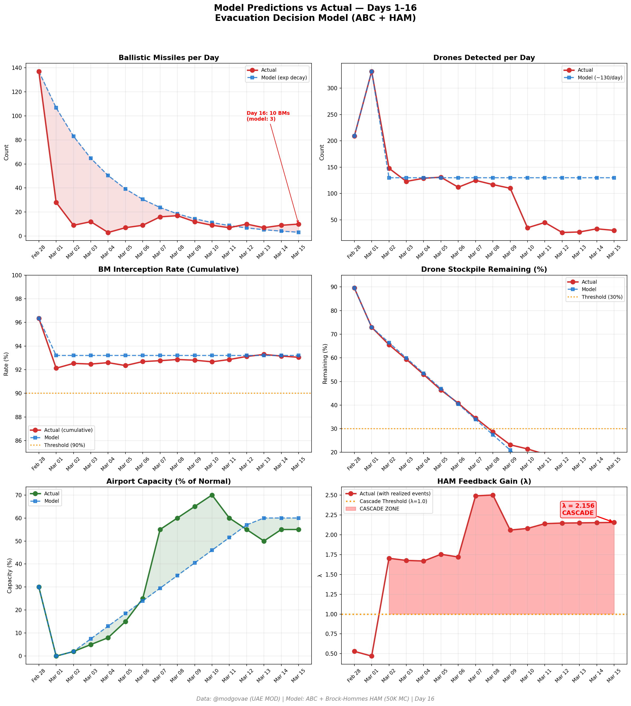
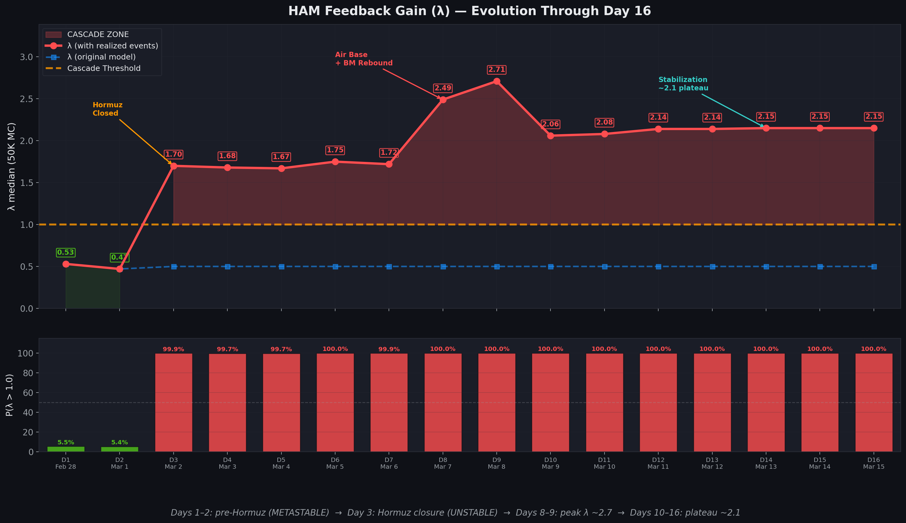

# Day 16 Update — March 15, 2026

> 🌐 **EN** | [中文](../zh/updates/day16-march15.md)

**Status: UNSTABLE** | **Breaches: 3/5** | **λ median = 2.152**

---

## New Data

| Metric | Day 15 | Day 16 | Cumulative |
|--------|-------|-------|------------|
| Ballistic Missiles | 9 | **10** | **302** |
| BM Intercepted | 8 | 9 | 281 |
| Drones Detected | 33 | ~30 | ~1732 |
| Drones Intercepted | 27 | 24 | ~1628 |
| Cruise Missiles | 0 | 0 | 8 |
| BM Intercept Rate (cum) | — | — | 93.0% |
| Drone Stockpile | — | — | 13.4% (268/2000) |

**Key Events:**
- IRGC claims 10 missiles + drones targeting Al Dhafra Air Base (second claimed strike)
- AN/TPY-2 radar reportedly destroyed; MQ-9 Reaper and U-2 facilities hit (Defence Security Asia)
- Heavy US-Israeli strikes on Isfahan, Shiraz, Tehran, Dezful, Khomein, Hamedan
- Emirates ~60% capacity (~200 flights/day); flydubai ~35% (~64 flights)
- Brent ~$103; WTI ~$99; Iran warns oil could hit $200

---

## Lambda Recalculation

```
λ = 1.0
  + λ_launcher           = -0.544
  + λ_drone              = +0.173
  + λ_intercept          = +0.000
  + λ_hormuz             = +0.630
  + λ_proxy              = +0.500
  + λ_weapon             = +0.400
  + λ_bm_rebound         = +0.000
  + λ_naval              = -0.128
  ──────────────────────────────
  λ median           = 2.152  (50K Monte Carlo)
```

| Metric | Value |
|--------|-------|
| λ median | **2.152** |
| λ 95th percentile | **2.864** |
| P(λ > 1.0) | **100.0%** |
| P(λ > 1.5) | **98.3%** |
| P(λ > 2.0) | **66.5%** |
| Verdict | **UNSTABLE** |
| Breaches | **3/5** (launcher, drone_stockpile, new_weapon) |

---

## Charts





---

## Recommendation

**EVACUATE IMMEDIATELY.** System is in CASCADE territory.

---

## Sources

| Source | Type |
|--------|------|
| @modgovae (X.com) | UAE MOD daily update |
| Model pipeline | ABC + HAM (50K MC) |
| Generated | 2026-03-15 20:11 |
