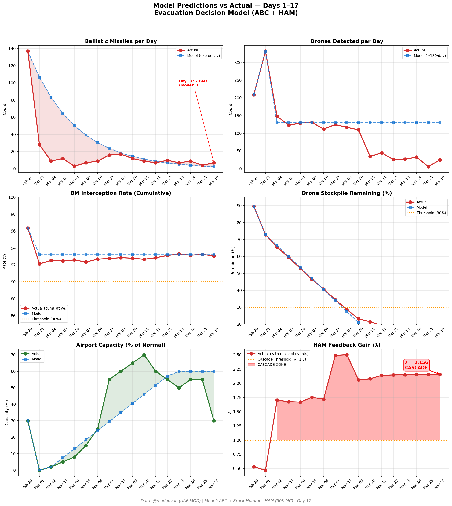
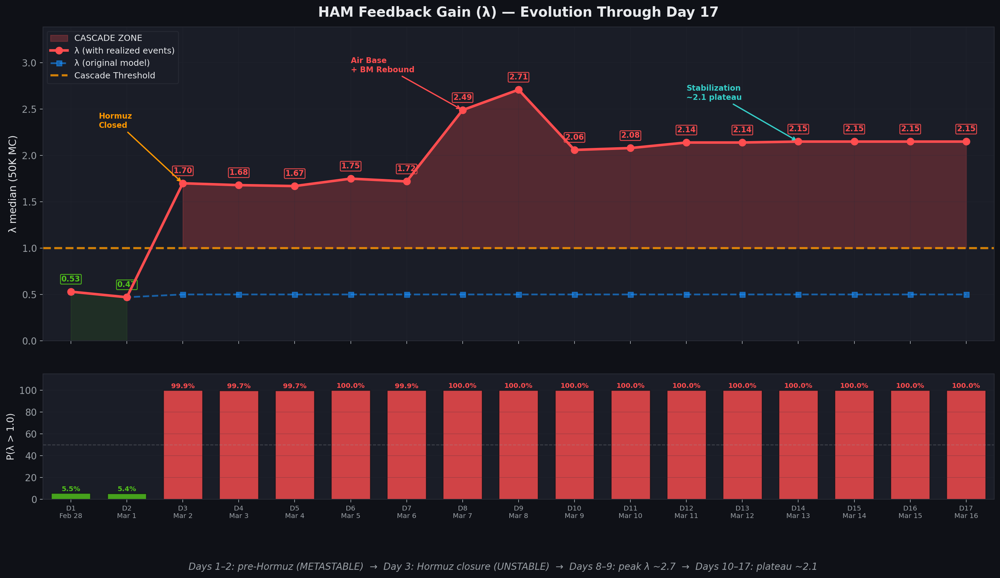

# Day 17 Update — March 16, 2026

> 🌐 **EN** | [中文](../zh/updates/day17-march16.md)

**Status: UNSTABLE** | **Breaches: 4/5** | **λ median = 2.152**

---

## New Data

| Metric | Day 16 | Day 17 | Cumulative |
|--------|-------|-------|------------|
| Ballistic Missiles | 4 | **7** | **303** |
| BM Intercepted | 4 | 6 | 282 |
| Drones Detected | 6 | ~25 | ~1733 |
| Drones Intercepted | 5 | 21 | ~1630 |
| Cruise Missiles | 0 | 0 | 8 |
| BM Intercept Rate (cum) | — | — | 93.1% |
| Drone Stockpile | — | — | 13.4% (267/2000) |

**Key Events:**
- @modgovae: 6 BMs intercepted, 21 drones intercepted (Times of Israel); 1 missile fell on civilian car
- Drone attack sparks fire near DXB fuel tank; flights temporarily suspended then gradual resumption
- Abu Dhabi: missile hits civilian car in Al Bahyan area — 1 Palestinian killed (cumulative 7 dead)
- Fujairah: fire in industrial oil facility from drone attack, no injuries
- Iran FM Araghchi: Hormuz 'open but closed to our enemies'
- Iran destroys Italian MQ-9A Predator UAV at Ali Al Salem Air Base, Kuwait (The Week)
- Brent $104.73 (+1.6%); oil up >40% since Feb 28

---

## Lambda Recalculation

```
λ = 1.0
  + λ_launcher           = -0.544
  + λ_drone              = +0.173
  + λ_intercept          = +0.000
  + λ_hormuz             = +0.630
  + λ_proxy              = +0.500
  + λ_weapon             = +0.400
  + λ_bm_rebound         = +0.000
  + λ_naval              = -0.128
  ──────────────────────────────
  λ median           = 2.152  (50K Monte Carlo)
```

| Metric | Value |
|--------|-------|
| λ median | **2.152** |
| λ 95th percentile | **2.865** |
| P(λ > 1.0) | **100.0%** |
| P(λ > 1.5) | **98.3%** |
| P(λ > 2.0) | **66.5%** |
| Verdict | **UNSTABLE** |
| Breaches | **4/5** (launcher, drone_stockpile, new_weapon, interception_day) |

---

## Charts





---

## Recommendation

**EVACUATE IMMEDIATELY.** System is in CASCADE territory.

---

## Sources

| Source | Type |
|--------|------|
| @modgovae (X.com) | UAE MOD daily update |
| Model pipeline | ABC + HAM (50K MC) |
| Generated | 2026-03-16 23:29 |
