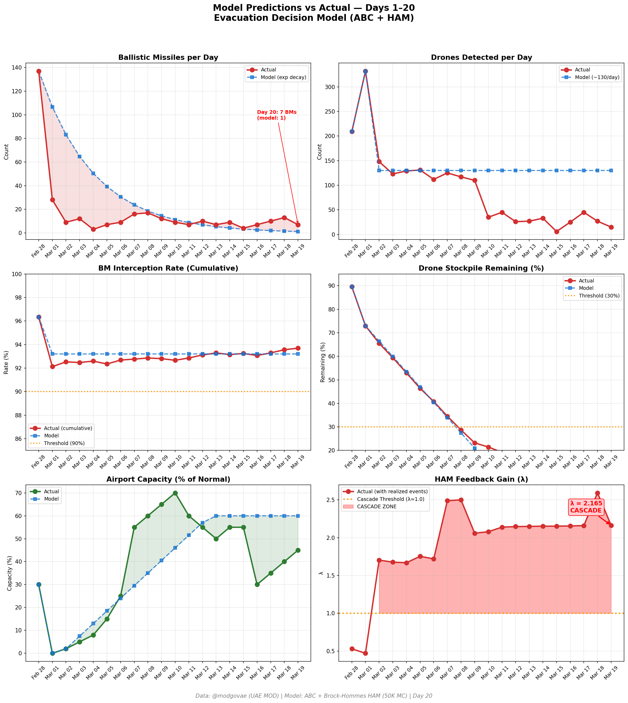

# Day 20 Update — March 19, 2026

> 🌐 **EN** | [中文](../zh/updates/day20-march19.md)

**Status: UNSTABLE** | **Breaches: 2/5** | **λ median = 2.161**

---

## New Data

| Metric | Day 19 | Day 20 | Cumulative |
|--------|-------|-------|------------|
| Ballistic Missiles | 13 | **7** | **333** |
| BM Intercepted | 13 | 7 | 312 |
| Drones Detected | 27 | ~15 | ~1820 |
| Drones Intercepted | 22 | 13 | ~1703 |
| Cruise Missiles | 0 | 0 | 8 |
| BM Intercept Rate (cum) | — | — | 93.7% |
| Drone Stockpile | — | — | 9.0% (180/2000) |

**Key Events:**
- @modgovae: 7 BMs intercepted, 15 drones detected (~13 intercepted); cumulative 334 BMs, 1,714 drones, 15 cruise
- Iran strikes Qatar Ras Laffan LNG facility — 17% of Qatar LNG capacity knocked out for 3-5 years; QatarEnergy may declare force majeure
- Oil briefly hits $119/bbl intraday; Brent closes ~$113; WTI ~$97; largest single-day energy infrastructure hit of conflict
- Qatar expels Iranian military attaches following LNG facility strike
- Missile warning sent to Dubai and Abu Dhabi residents at 7:30am; DXB operating ~45% capacity
- Hormuz selective transits nearly doubled; ~12 vessels through today; IMO emergency talks underway
- Cumulative: 8 dead, ~158 injured (@modgovae); no new casualties reported today

---

## Lambda Recalculation

```
λ = 1.0
  + λ_launcher           = -0.544
  + λ_drone              = +0.182
  + λ_intercept          = +0.000
  + λ_hormuz             = +0.630
  + λ_proxy              = +0.500
  + λ_weapon             = +0.400
  + λ_bm_rebound         = +0.000
  + λ_naval              = -0.128
  ──────────────────────────────
  λ median           = 2.161  (50K Monte Carlo)
```

| Metric | Value |
|--------|-------|
| λ median | **2.161** |
| λ 95th percentile | **2.874** |
| P(λ > 1.0) | **100.0%** |
| P(λ > 1.5) | **98.5%** |
| P(λ > 2.0) | **67.3%** |
| Verdict | **UNSTABLE** |
| Breaches | **2/5** (launcher, drone_stockpile) |

---

## Charts




---

## Recommendation

**EVACUATE IMMEDIATELY.** System is in CASCADE territory.

---

## Sources

| Source | Type |
|--------|------|
| @modgovae (X.com) | UAE MOD daily update |
| Model pipeline | ABC + HAM (50K MC) |
| Generated | 2026-03-19 23:06 |
