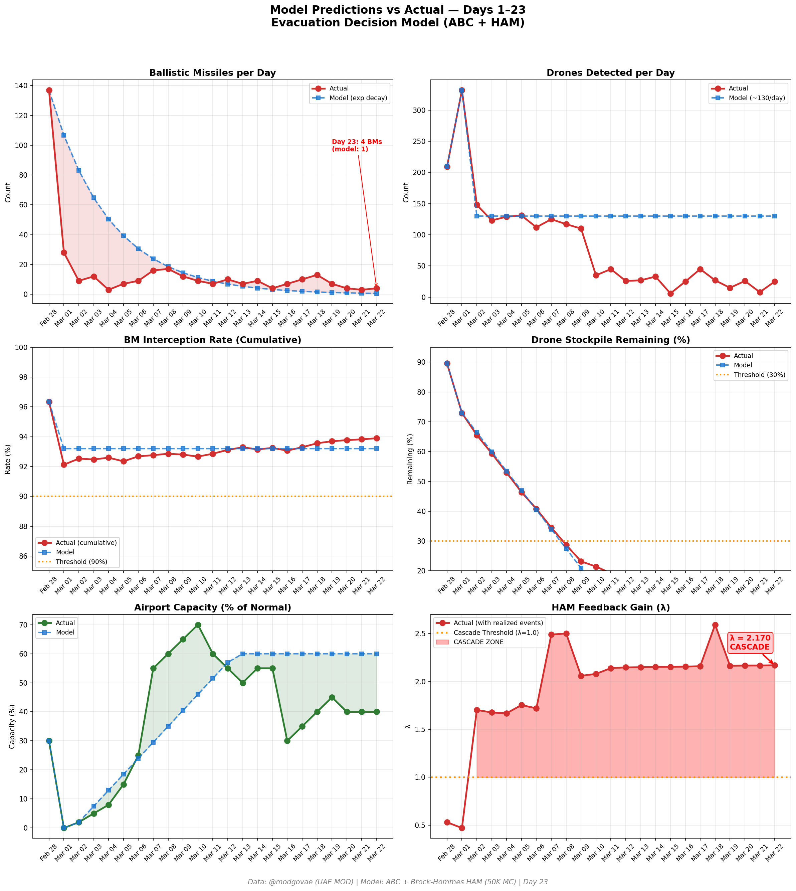

# Day 23 Update — March 22, 2026

> 🌐 **EN** | [中文](../zh/updates/day23-march22.md)

**Status: UNSTABLE** | **Breaches: 2/5** | **λ median = 2.167**

---

## New Data

| Metric | Day 22 | Day 23 | Cumulative |
|--------|-------|-------|------------|
| Ballistic Missiles | 3 | **4** | **344** |
| BM Intercepted | 3 | 4 | 323 |
| Drones Detected | 8 | ~25 | ~1879 |
| Drones Intercepted | 6 | 21 | ~1752 |
| Cruise Missiles | 0 | 0 | 8 |
| BM Intercept Rate (cum) | — | — | 93.9% |
| Drone Stockpile | — | — | 6.0% (121/2000) |

**Key Events:**
- @modgovae: 4 BMs intercepted, 25 drones detected (~21 intercepted); cumulative 345 BMs, 15 cruise, 1,773 drones
- Trump issues 48-hour ultimatum: open Hormuz fully or US will 'obliterate' Iran's power plants
- Iran threatens full Hormuz closure and strikes on Israeli/regional energy infrastructure if power plants targeted
- US grants temporary license for Iran to sell ~140M barrels crude to calm markets
- WTI ~$98; Brent ~$107; VLCC rates ~$435K/day
- Cumulative: 8 dead, ~162 injured (@modgovae); no new deaths

---

## Lambda Recalculation

```
λ = 1.0
  + λ_launcher           = -0.544
  + λ_drone              = +0.188
  + λ_intercept          = +0.000
  + λ_hormuz             = +0.630
  + λ_proxy              = +0.500
  + λ_weapon             = +0.400
  + λ_bm_rebound         = +0.000
  + λ_naval              = -0.128
  ──────────────────────────────
  λ median           = 2.167  (50K Monte Carlo)
```

| Metric | Value |
|--------|-------|
| λ median | **2.167** |
| λ 95th percentile | **2.880** |
| P(λ > 1.0) | **100.0%** |
| P(λ > 1.5) | **98.5%** |
| P(λ > 2.0) | **67.9%** |
| Verdict | **UNSTABLE** |
| Breaches | **2/5** (launcher, drone_stockpile) |

---

## Charts




---

## Recommendation

**EVACUATE IMMEDIATELY.** System is in CASCADE territory.

---

## Sources

| Source | Type |
|--------|------|
| @modgovae (X.com) | UAE MOD daily update |
| Model pipeline | ABC + HAM (50K MC) |
| Generated | 2026-03-22 23:31 |
