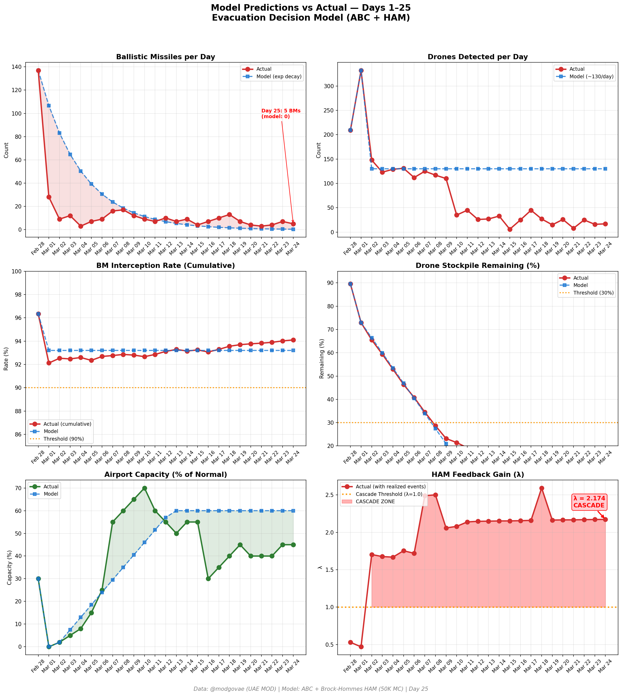
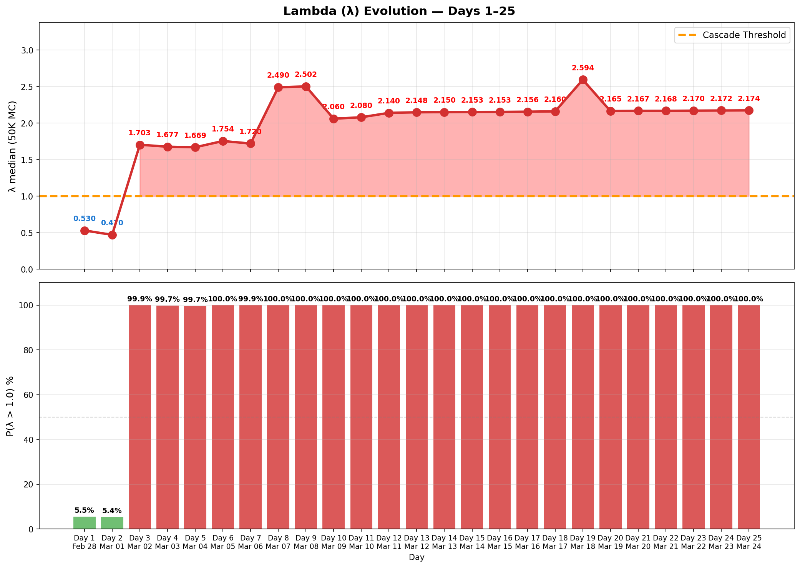

# Day 25 Update — March 24, 2026

> 🌐 **EN** | [中文](../zh/updates/day25-march24.md)

**Status: UNSTABLE** | **Breaches: 2/5** | **λ median = 2.170**

---

## New Data

| Metric | Day 24 | Day 25 | Cumulative |
|--------|-------|-------|------------|
| Ballistic Missiles | 7 | **5** | **356** |
| BM Intercepted | 7 | 5 | 335 |
| Drones Detected | 16 | ~17 | ~1912 |
| Drones Intercepted | 14 | 14 | ~1780 |
| Cruise Missiles | 0 | 0 | 8 |
| BM Intercept Rate (cum) | — | — | 94.1% |
| Drone Stockpile | — | — | 4.4% (88/2000) |

**Key Events:**
- @modgovae: 5 BMs intercepted, 17 drones detected (~14 intercepted); cumulative ~357 BMs, 15 cruise, ~1,806 drones
- Trump 5-day delay on Iran power plant strikes enters Day 2; Pakistan/Turkey/Egypt/Oman mediating
- Iranian source acknowledges US 'outreach' to CNN; possible Vance-Iran meeting in Pakistan this week
- Oil rebounds: WTI $92.39 (+4.8%), Brent $102.47 — markets skeptical of de-escalation durability
- Indian national suffers minor injuries from interception debris in al-Shawamekh, Abu Dhabi
- Polymarket ceasefire-by-Mar-31 surges to ~20% amid suspected insider trading (10 new accounts wagered $160K)
- Selective Hormuz transits continue expanding; ~24 vessels/day; Japan, China, India, Pakistan permitted

---

## Lambda Recalculation

```
λ = 1.0
  + λ_launcher           = -0.544
  + λ_drone              = +0.191
  + λ_intercept          = +0.000
  + λ_hormuz             = +0.630
  + λ_proxy              = +0.500
  + λ_weapon             = +0.400
  + λ_bm_rebound         = +0.000
  + λ_naval              = -0.128
  ──────────────────────────────
  λ median           = 2.170  (50K Monte Carlo)
```

| Metric | Value |
|--------|-------|
| λ median | **2.170** |
| λ 95th percentile | **2.883** |
| P(λ > 1.0) | **100.0%** |
| P(λ > 1.5) | **98.6%** |
| P(λ > 2.0) | **68.3%** |
| Verdict | **UNSTABLE** |
| Breaches | **2/5** (launcher, drone_stockpile) |

---

## Charts





---

## Recommendation

**EVACUATE IMMEDIATELY.** System is in CASCADE territory.

---

## Sources

| Source | Type |
|--------|------|
| @modgovae (X.com) | UAE MOD daily update |
| Model pipeline | ABC + HAM (50K MC) |
| Generated | 2026-03-25 01:31 |
