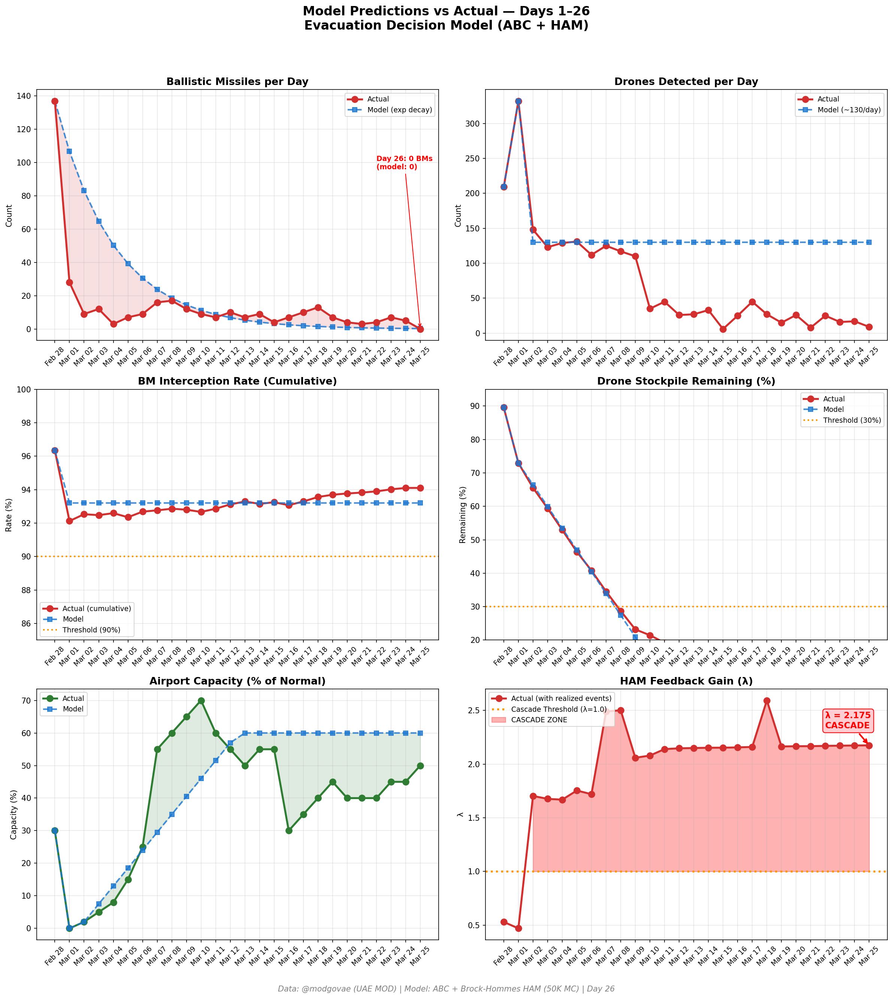
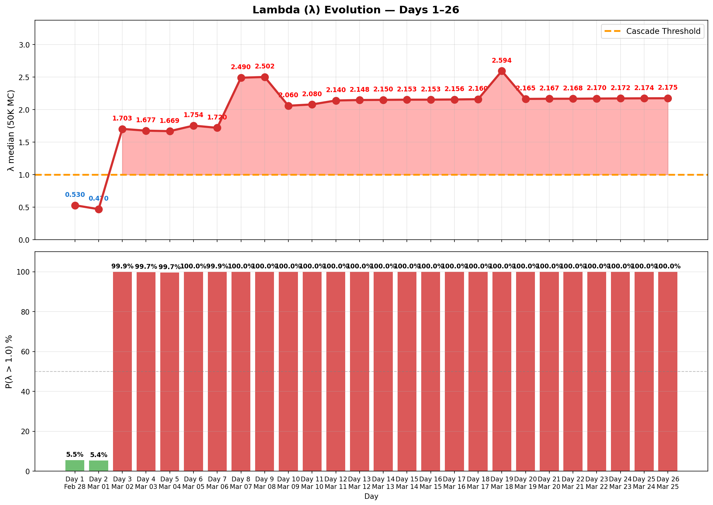

# Day 26 Update — March 25, 2026

> 🌐 **EN** | [中文](../zh/updates/day26-march25.md)

**Status: UNSTABLE** | **Breaches: 2/5** | **λ median = 2.171**

---

## New Data

| Metric | Day 25 | Day 26 | Cumulative |
|--------|-------|-------|------------|
| Ballistic Missiles | 5 | **0** | **356** |
| BM Intercepted | 5 | 0 | 335 |
| Drones Detected | 17 | ~9 | ~1921 |
| Drones Intercepted | 14 | 7 | ~1787 |
| Cruise Missiles | 0 | 0 | 8 |
| BM Intercept Rate (cum) | — | — | 94.1% |
| Drone Stockpile | — | — | 4.0% (79/2000) |

**Key Events:**
- FIRST DAY WITHOUT BALLISTIC MISSILES — 0 BMs detected since conflict began Feb 28 (@modgovae via Sharjah24, Gulf News)
- Only 9 UAVs engaged (@modgovae); cumulative 357 BMs, 15 cruise, 1,815 UAVs
- Iranian drones hit fuel tank at Kuwait International Airport — fire ignited; Kuwait airport largely closed to commercial traffic
- Iran rejects Trump's 15-point peace plan as 'maximalist, unreasonable'; sets 5 counter-conditions including Hormuz sovereignty and reparations
- Trump declares war 'won'; claims US-Iran 'in negotiations now'; Iran: 'negotiating with yourselves'
- Oil drops: WTI -2.2% to $90.32; Brent -2.2% to $102.22 on diplomatic signals
- ~1,000 US troops (82nd Airborne) deploying to Middle East
- Emirates at ~60% pre-war capacity; Air India 26 flights; Emirates aiming full restoration by Mar 29
- Iran formalizes Hormuz transit: crew/cargo manifests + IRGC approval required; 6 vessels transited openly
- Polymarket ceasefire-by-Mar-31 at ~17% (down from ~20%); insider trading under Al Jazeera/Wall Street scrutiny
- White House says timeline for war end is 4-6 weeks; 'productive' talks continue per Karoline Leavitt

---

## Lambda Recalculation

```
λ = 1.0
  + λ_launcher           = -0.544
  + λ_drone              = +0.192
  + λ_intercept          = +0.000
  + λ_hormuz             = +0.630
  + λ_proxy              = +0.500
  + λ_weapon             = +0.400
  + λ_bm_rebound         = +0.000
  + λ_naval              = -0.128
  ──────────────────────────────
  λ median           = 2.171  (50K Monte Carlo)
```

| Metric | Value |
|--------|-------|
| λ median | **2.171** |
| λ 95th percentile | **2.884** |
| P(λ > 1.0) | **100.0%** |
| P(λ > 1.5) | **98.6%** |
| P(λ > 2.0) | **68.3%** |
| Verdict | **UNSTABLE** |
| Breaches | **2/5** (launcher, drone_stockpile) |

---

## Charts





---

## Recommendation

**EVACUATE IMMEDIATELY.** System is in CASCADE territory.

---

## Sources

| Source | Type |
|--------|------|
| @modgovae (X.com) | UAE MOD daily update |
| Model pipeline | ABC + HAM (50K MC) |
| Generated | 2026-03-26 17:40 |
