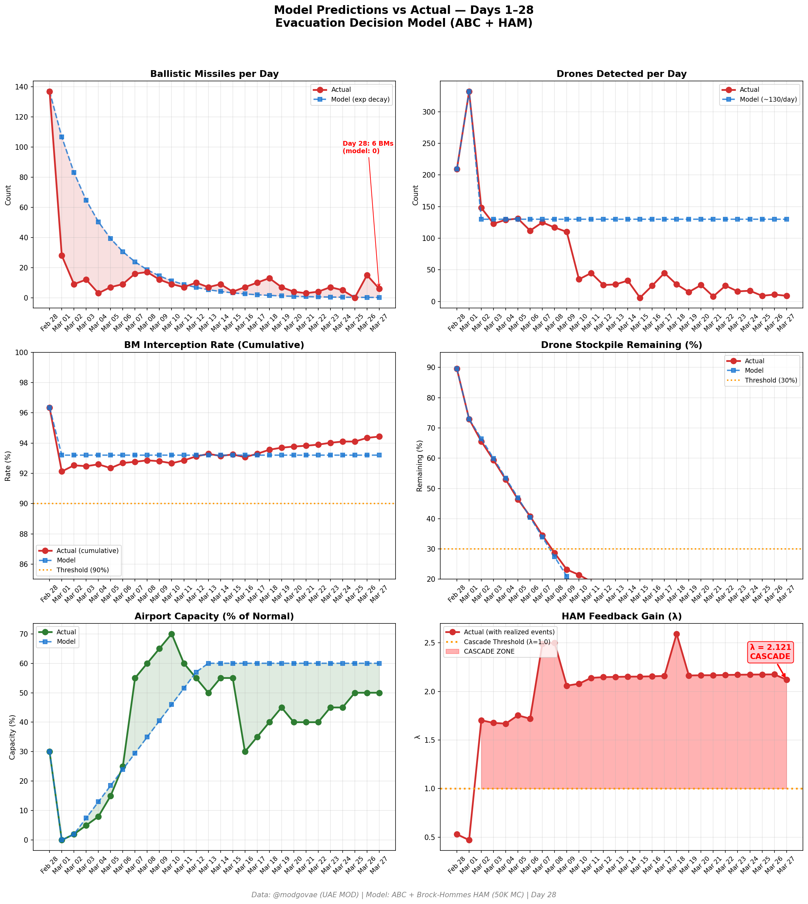

# Day 28 Update — March 27, 2026

> 🌐 **EN** | [中文](../zh/updates/day28-march27.md)

**Status: UNSTABLE** | **Breaches: 2/5** | **λ median = 2.118**

---

## New Data

| Metric | Day 27 | Day 28 | Cumulative |
|--------|-------|-------|------------|
| Ballistic Missiles | 15 | **6** | **377** |
| BM Intercepted | 15 | 6 | 356 |
| Drones Detected | 11 | ~9 | ~1941 |
| Drones Intercepted | 9 | 7 | ~1803 |
| Cruise Missiles | 0 | 0 | 8 |
| BM Intercept Rate (cum) | — | — | 94.4% |
| Drone Stockpile | — | — | 2.9% (59/2000) |

**Key Events:**
- @modgovae: 6 BMs intercepted, 9 drones detected; cumulative 378 BMs, 15 cruise, 1,835 drones
- 3 Chinese ships (incl. COSCO vessels) turned away from Hormuz — IRGC declares strait 'shut', contradicting Trump claims
- Trump delays attacks on Iranian energy sector by 10 days (to April 6), cites 'very well' talks
- Iran calls US proposal 'one-sided and unfair'; Pakistan relaying messages between Washington and Tehran
- Brent tops $110 again ($111.06) on Chinese ship Hormuz incident; WTI $97.01
- 3 US carrier strike groups converging: Lincoln (Arabian Sea), Ford (Red Sea), Bush (crossing Atlantic)
- Saudi/UAE/Iraq pipeline alternatives discussed as oil escape routes from Hormuz dependency
- Cumulative: 11 dead, ~171 injured

---

## Lambda Recalculation

```
λ = 1.0
  + λ_launcher           = -0.544
  + λ_drone              = +0.194
  + λ_intercept          = +0.000
  + λ_hormuz             = +0.630
  + λ_proxy              = +0.500
  + λ_weapon             = +0.400
  + λ_bm_rebound         = +0.000
  + λ_naval              = -0.184
  ──────────────────────────────
  λ median           = 2.118  (50K Monte Carlo)
```

| Metric | Value |
|--------|-------|
| λ median | **2.118** |
| λ 95th percentile | **2.830** |
| P(λ > 1.0) | **100.0%** |
| P(λ > 1.5) | **97.6%** |
| P(λ > 2.0) | **62.6%** |
| Verdict | **UNSTABLE** |
| Breaches | **2/5** (launcher, drone_stockpile) |

---

## Charts




---

## Recommendation

**EVACUATE IMMEDIATELY.** System is in CASCADE territory.

---

## Sources

| Source | Type |
|--------|------|
| @modgovae (X.com) | UAE MOD daily update |
| Model pipeline | ABC + HAM (50K MC) |
| Generated | 2026-03-27 23:09 |
