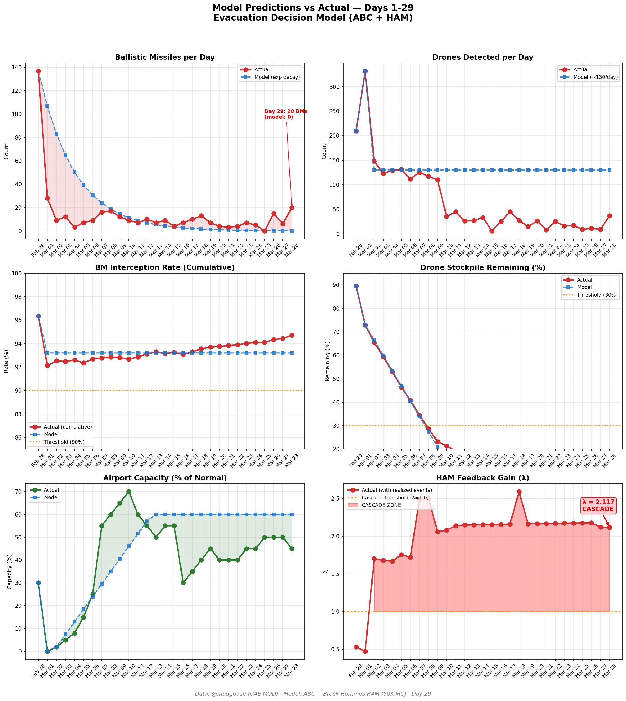
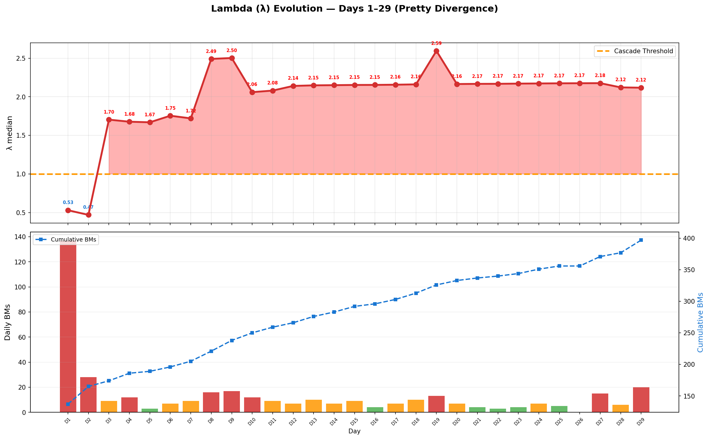

# Day 29 Update — March 28, 2026

> 🌐 **EN** | [中文](../zh/updates/day29-march28.md)

**Status: UNSTABLE** | **Breaches: 2/5** | **λ median = 2.114**

---

## New Data

| Metric | Day 28 | Day 29 | Cumulative |
|--------|-------|-------|------------|
| Ballistic Missiles | 6 | **20** | **397** |
| BM Intercepted | 6 | 20 | 376 |
| Drones Detected | 9 | ~37 | ~1978 |
| Drones Intercepted | 7 | 33 | ~1836 |
| Cruise Missiles | 0 | 0 | 8 |
| BM Intercept Rate (cum) | — | — | 94.7% |
| Drone Stockpile | — | — | 1.1% (22/2000) |

**Key Events:**
- @modgovae: 20 BMs intercepted, 37 drones detected (33 intercepted, 4 fell UAE); cumulative 398 BMs, 15 cruise, 1,872 drones
- BM SURGE: 6→20 (+233%) — largest daily count since Day 27 rebound (15); volatile pattern continues (Day 26: 0, Day 27: 15, Day 28: 6, Day 29: 20)
- 1 civilian killed (Asian nationality) + 6 injured (5 Indians + 1 Pakistani) from interception debris at Kezad, Abu Dhabi
- US troops injured in Iran attack on Saudi base — war reaches one-month mark (NPR)
- Oil surges sharply: WTI $99.64 (+5.46%, session high $100.04 breaches $100 intraday); Brent $112.57 (+4.22%)
- Iran Hormuz toll booth system continues; ~2 selective transits; IRGC checks nationality/cargo/crew
- Multiple international carriers still suspended (KLM through May 17, Turkish through end March, Air France through Mar 31)
- DXB operating ~45% capacity; Emirates + flydubai maintaining reduced schedules
- 3rd carrier (USS George H.W. Bush) crossing Atlantic toward theater; 3 CSGs converging
- Polymarket ceasefire-by-Mar-31 declining to ~15% with only 3 days remaining
- Cumulative: 12 dead, ~177 injured

---

## Lambda Recalculation

```
λ = 1.0
  + λ_launcher           = -0.544
  + λ_drone              = +0.198
  + λ_intercept          = +0.000
  + λ_hormuz             = +0.630
  + λ_proxy              = +0.500
  + λ_weapon             = +0.400
  + λ_bm_rebound         = +0.000
  + λ_naval              = -0.192
  ──────────────────────────────
  λ median           = 2.114  (50K Monte Carlo)
```

| Metric | Value |
|--------|-------|
| λ median | **2.114** |
| λ 95th percentile | **2.826** |
| P(λ > 1.0) | **100.0%** |
| P(λ > 1.5) | **97.5%** |
| P(λ > 2.0) | **62.1%** |
| Verdict | **UNSTABLE** |
| Breaches | **2/5** (launcher, drone_stockpile) |

---

## Charts





---

## Recommendation

**EVACUATE IMMEDIATELY.** System is in CASCADE territory.

---

## Sources

| Source | Type |
|--------|------|
| @modgovae (X.com) | UAE MOD daily update |
| Model pipeline | ABC + HAM (50K MC) |
| Generated | 2026-03-28 23:07 |
