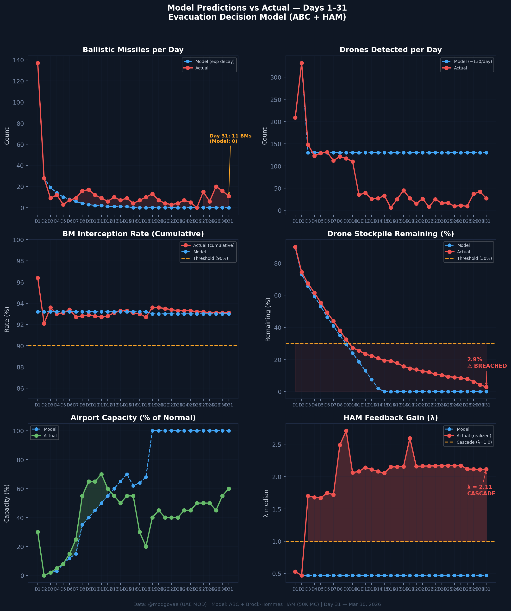
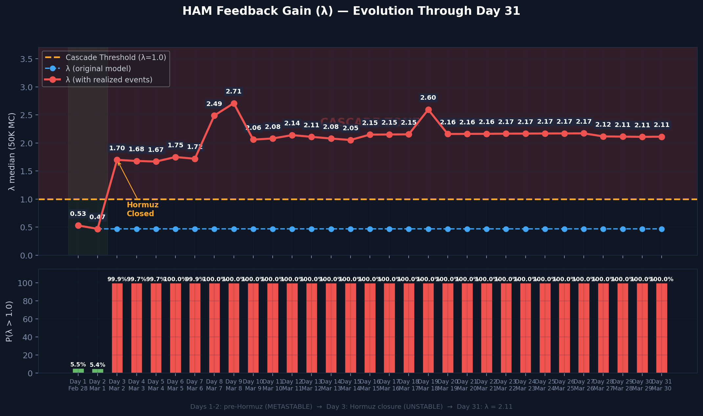

# Day 31 Update — March 30, 2026

> 🌐 **EN** | [中文](../zh/updates/day31-march30.md)

**Status: UNSTABLE** | **Breaches: 2/5** | **λ median = 2.113**

---

## New Data

| Metric | Day 30 | Day 31 | Cumulative |
|--------|-------|-------|------------|
| Ballistic Missiles | 16 | **11** | **424** |
| BM Intercepted | 16 | 11 | 403 |
| Drones Detected | 42 | ~27 | ~2047 |
| Drones Intercepted | 37 | 25 | ~1898 |
| Cruise Missiles | 0 | 0 | 8 |
| BM Intercept Rate (cum) | — | — | 95.0% |
| Drone Stockpile | — | — | -2.4% (-47/2000) |

**Key Events:**
- @modgovae: 11 BMs engaged, 27 UAVs engaged; cumulative 425 BMs, 15 cruise, 1,941 UAVs
- HOUTHIS ENTER WAR: Launch 2nd strike on Israel (cruise missiles + drones); threaten Bab al-Mandeb closure
- Oil surges 3%: WTI $102.85, Brent $115.35 — Brent on pace for steepest monthly rise on record (+55% in March)
- SocGen forecasts $150/bbl possible in April if Houthis block Bab al-Mandeb
- Polymarket ceasefire-by-Mar-31 collapses to ~2% (market expires tomorrow)
- DXB improving: Emirates, British Airways, Lufthansa, Air India, IndiGo all operating at ~60% capacity
- Houthis: 'Closing Bab al-Mandeb is among our options' — dual-strait closure risk emerges
- 0 new deaths; 0 new injuries; cumulative: 12 dead, ~178 injured

---

## Lambda Recalculation

```
λ = 1.0
  + λ_launcher           = -0.544
  + λ_drone              = +0.205
  + λ_intercept          = +0.000
  + λ_hormuz             = +0.630
  + λ_proxy              = +0.500
  + λ_weapon             = +0.400
  + λ_bm_rebound         = +0.000
  + λ_naval              = -0.200
  ──────────────────────────────
  λ median           = 2.113  (50K Monte Carlo)
```

| Metric | Value |
|--------|-------|
| λ median | **2.113** |
| λ 95th percentile | **2.825** |
| P(λ > 1.0) | **100.0%** |
| P(λ > 1.5) | **97.5%** |
| P(λ > 2.0) | **62.0%** |
| Verdict | **UNSTABLE** |
| Breaches | **2/5** (launcher, drone_stockpile) |

---

## Charts





---

## Recommendation

**EVACUATE IMMEDIATELY.** System is in CASCADE territory.

---

## Sources

| Source | Type |
|--------|------|
| @modgovae (X.com) | UAE MOD daily update |
| Model pipeline | ABC + HAM (50K MC) |
| Generated | 2026-03-30 23:07 |
