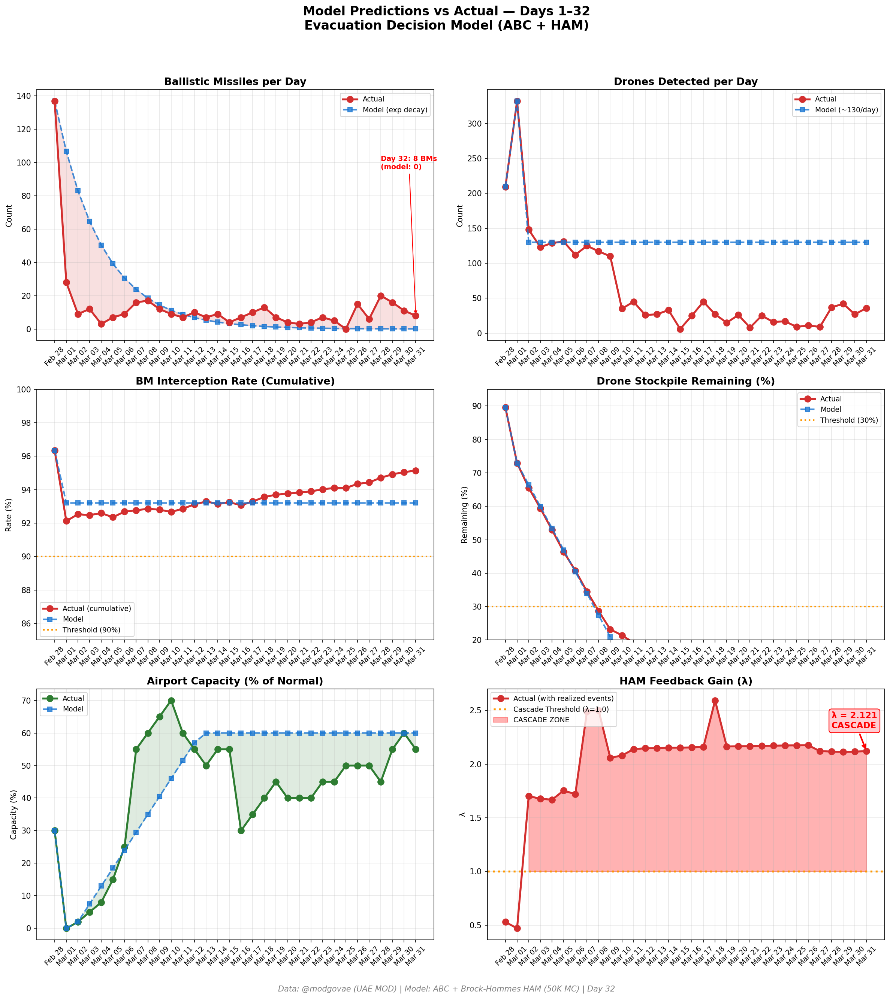
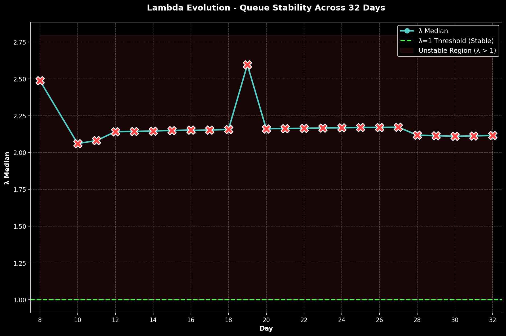

# Day 32 Update — March 31, 2026

> 🌐 **EN** | [中文](../zh/updates/day32-march31.md)

**Status: UNSTABLE** | **Breaches: 2/5** | **λ median = 2.116**

---

## New Data

| Metric | Day 31 | Day 32 | Cumulative |
|--------|-------|-------|------------|
| Ballistic Missiles | 11 | **8** | **432** |
| BM Intercepted | 11 | 8 | 411 |
| Drones Detected | 27 | ~36 | ~2083 |
| Drones Intercepted | 25 | 32 | ~1930 |
| Cruise Missiles | 0 | 4 | 12 |
| BM Intercept Rate (cum) | — | — | 95.1% |
| Drone Stockpile | — | — | -4.2% (-83/2000) |

**Key Events:**
- @modgovae: 8 BMs intercepted, 4 cruise missiles, 36 drones detected (~32 intercepted); cumulative 433 BMs, 19 cruise, 1,977 drones
- CRUISE MISSILES RETURN: First cruise missiles since early March — 4 launched, marking significant escalation in weapon diversity
- Kuwaiti VLCC Al Salmi (2M bbl loaded) struck by Iranian drone at Dubai Port anchorage — fire extinguished, 24 crew safe, no oil spill
- 4 Asian nationals injured in southern Dubai from interception debris falling on residential houses
- 3 UN peacekeeping troops killed (per Al Jazeera liveblog)
- Trump escalates Iran threats; Polymarket ceasefire-by-Mar-31 expires at ~1% (resolving NO)
- Oil: WTI $102.24, Brent ~$106.56; Brent completes steepest monthly rise on record (~55% in March)
- Houthis continue Bab al-Mandeb threats but pledge to keep strait open 'for now'
- DXB operating limited flights ~55% capacity; BA suspended through May 31; Air France through Mar 31
- Hormuz selective transits continue; ~4 vessels; Iran toll booth system active
- Cumulative: 12 dead, ~182 injured

---

## Lambda Recalculation

```
λ = 1.0
  + λ_launcher           = -0.544
  + λ_drone              = +0.208
  + λ_intercept          = +0.000
  + λ_hormuz             = +0.630
  + λ_proxy              = +0.500
  + λ_weapon             = +0.400
  + λ_bm_rebound         = +0.000
  + λ_naval              = -0.200
  ──────────────────────────────
  λ median           = 2.116  (50K Monte Carlo)
```

| Metric | Value |
|--------|-------|
| λ median | **2.116** |
| λ 95th percentile | **2.828** |
| P(λ > 1.0) | **100.0%** |
| P(λ > 1.5) | **97.5%** |
| P(λ > 2.0) | **62.4%** |
| Verdict | **UNSTABLE** |
| Breaches | **2/5** (launcher, drone_stockpile) |

---

## Charts





---

## Recommendation

**EVACUATE IMMEDIATELY.** System is in CASCADE territory.

---

## Sources

| Source | Type |
|--------|------|
| @modgovae (X.com) | UAE MOD daily update |
| Model pipeline | ABC + HAM (50K MC) |
| Generated | 2026-03-31 23:07 |
