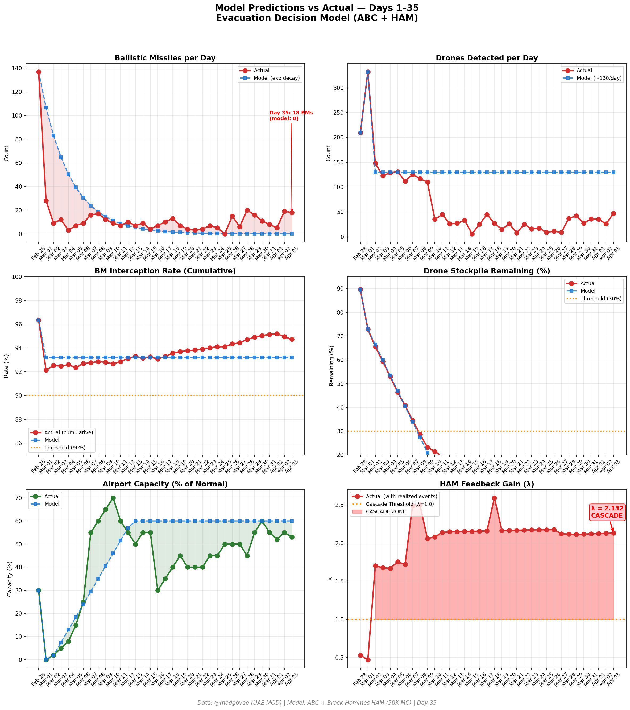
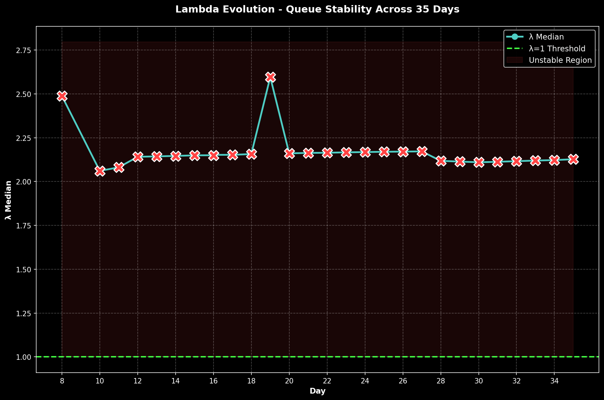

# Day 35 Update — April 03, 2026

> 🌐 **EN** | [中文](../zh/updates/day35-april3.md)

**Status: UNSTABLE** | **Breaches: 5/5** | **λ median = 2.127**

---

## New Data

| Metric | Day 34 | Day 35 | Cumulative |
|--------|-------|-------|------------|
| Ballistic Missiles | 19 | **18** | **474** |
| BM Intercepted | 17 | 16 | 449 |
| Drones Detected | 26 | ~47 | ~2191 |
| Drones Intercepted | 22 | 40 | ~2022 |
| Cruise Missiles | 0 | 4 | 16 |
| BM Intercept Rate (cum) | — | — | 94.7% |
| Drone Stockpile | — | — | -9.6% (-191/2000) |

**Key Events:**
- @modgovae: 18 BMs engaged (~16 intercepted, 1 fell sea, 1 fell land), 4 cruise missiles, 47 drones detected (~40 intercepted, ~7 fell UAE); cumulative 475 BMs, 23 cruise, 2,085 drones
- CRUISE MISSILES RETURN AGAIN: 4 cruise missiles fired — second consecutive salvo after Day 32's 4; cumulative now 23
- HABSHAN GAS COMPLEX FIRE: Falling debris from successful interception ignites fire at Abu Dhabi Habshan gas facility; operations suspended; no injuries reported
- 12 injured in Ajban area from falling interception debris — 7 Nepalese, 5 Indian nationals
- Iran expands Hormuz selective passage — Philippine-flagged vessels and Filipino seafarers now permitted after talks
- 12 vessels transit Hormuz (up from ~4/day in late March) — Iran toll booth system continues
- WTI surpasses Brent in rare inversion: WTI ~$111.54, Brent ~$109.03; WTI surges 12%+ on Iran escalation fears
- UK 30+ nation Hormuz summit continues; 3 ships attempt new Oman coast route to bypass Iranian waters
- Iran rejects US 15-point ceasefire proposal transmitted via Pakistan; issues counter-demands
- Polymarket ceasefire-by-Apr-30 at ~22% (down from ~25% Day 34) — markets increasingly skeptical
- DXB operating at ~53% capacity; most European/North American carriers remain suspended
- Total projectiles today: 69 (18 BM + 4 CM + 47 drones) — highest since early conflict days
- Cumulative: ~13 dead, ~206 injured

---

## Lambda Recalculation

```
λ = 1.0
  + λ_launcher           = -0.544
  + λ_drone              = +0.219
  + λ_intercept          = +0.000
  + λ_hormuz             = +0.630
  + λ_proxy              = +0.500
  + λ_weapon             = +0.400
  + λ_bm_rebound         = +0.000
  + λ_naval              = -0.200
  ──────────────────────────────
  λ median           = 2.127  (50K Monte Carlo)
```

| Metric | Value |
|--------|-------|
| λ median | **2.127** |
| λ 95th percentile | **2.841** |
| P(λ > 1.0) | **100.0%** |
| P(λ > 1.5) | **97.7%** |
| P(λ > 2.0) | **63.6%** |
| Verdict | **UNSTABLE** |
| Breaches | **5/5** (launcher, drone_stockpile, casualties, new_weapon, interception_day) |

---

## Charts





---

## Recommendation

**EVACUATE IMMEDIATELY.** System is in CASCADE territory.

---

## Sources

| Source | Type |
|--------|------|
| @modgovae (X.com) | UAE MOD daily update |
| Model pipeline | ABC + HAM (50K MC) |
| Generated | 2026-04-03 19:03 |
