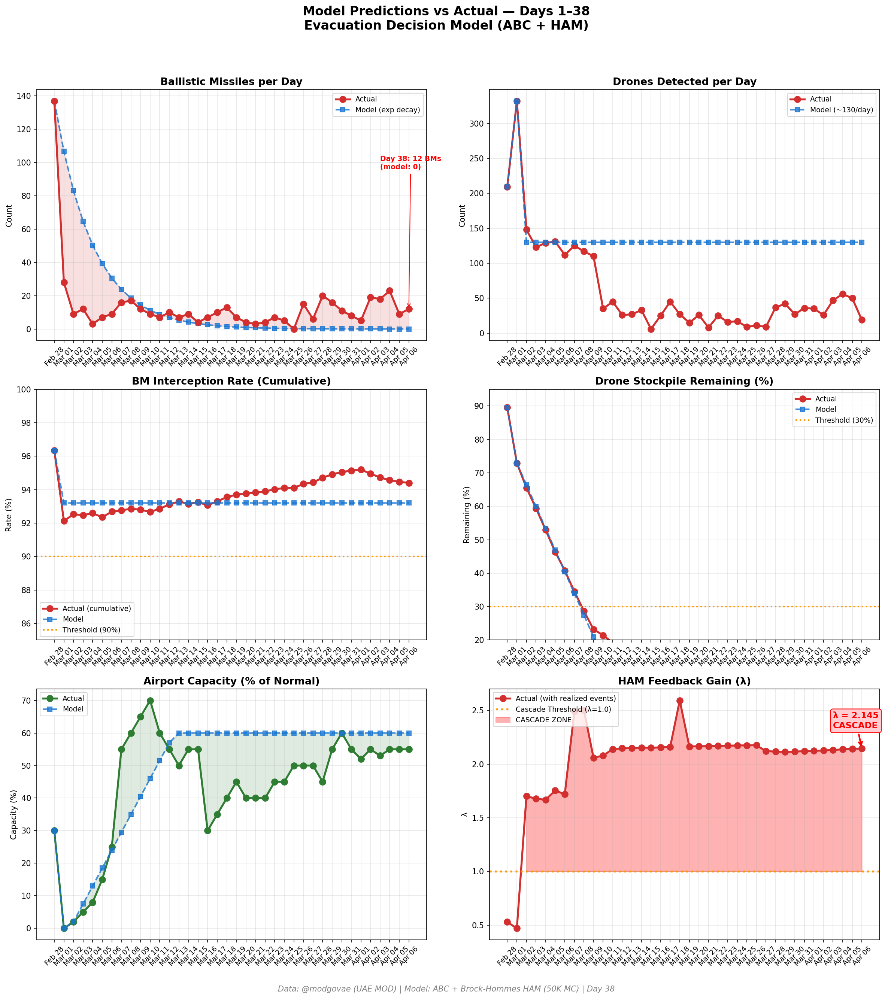
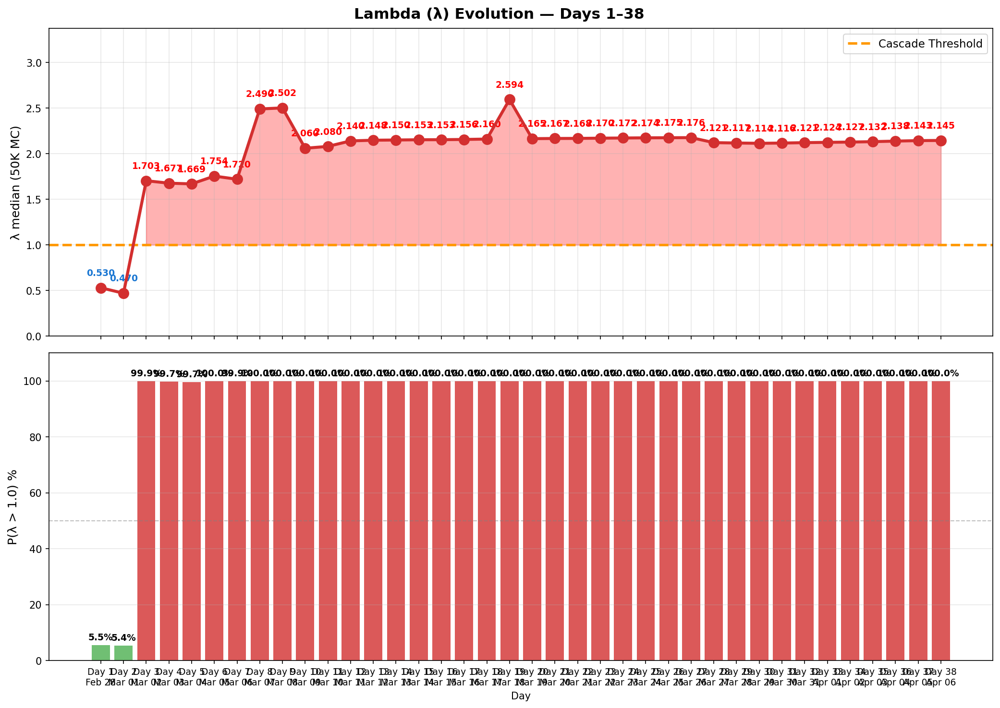

# Day 38 Update — April 06, 2026

> 🌐 **EN** | [中文](../zh/updates/day38-april6.md)

**Status: UNSTABLE** | **Breaches: 2/5** | **λ median = 2.140**

---

## New Data

| Metric | Day 37 | Day 38 | Cumulative |
|--------|-------|-------|------------|
| Ballistic Missiles | 9 | **12** | **518** |
| BM Intercepted | 8 | 11 | 489 |
| Drones Detected | 50 | ~19 | ~2316 |
| Drones Intercepted | 42 | 16 | ~2128 |
| Cruise Missiles | 1 | 2 | 19 |
| BM Intercept Rate (cum) | — | — | 94.4% |
| Drone Stockpile | — | — | -15.8% (-316/2000) |

**Key Events:**
- @modgovae: 12 BMs engaged (~11 intercepted, 1 fell sea), 2 cruise missiles, 19 drones detected (~16 intercepted, ~3 fell UAE); cumulative 519 BMs, 26 cruise, 2,210 drones
- TRUMP DEADLINE EXTENDS: Apr 4 48-hour ultimatum passes; Trump extends to Tuesday Apr 7 8PM ET — 'Power Plant Day, and Bridge Day' in Iran; expletive-laden Truth Social post
- IRAN REJECTS CEASEFIRE: Iran rejects temporary ceasefire proposed by regional mediators; says Hormuz will open when war damage is compensated through new legal regime
- ISLAMABAD ACCORD FRAMEWORK: Egyptian, Pakistani, Turkish envoys submit 45-day ceasefire proposal ('Islamabad Accord') — immediate ceasefire + Hormuz reopening, 15-20 days for broader settlement; Pakistan army chief in contact with VP Vance and Iranian FM Araqchi
- Israel strikes Iran's largest petrochemical complex (Euronews); IDF kills 2 senior IRGC officials
- Du telecom building in Fujairah targeted by drone; Ghanaian national in Abu Dhabi sustains moderate injuries from falling shrapnel
- Oil drops on ceasefire proposal framework: WTI ~$110.72 (-$2.78), Brent ~$108.34 (-$3.46); markets cautiously optimistic despite Iran rejection
- Polymarket ceasefire-by-Apr-30 crashes from ~60% (Day 37) to ~15% on Iran's formal ceasefire rejection
- DXB operating at ~55% capacity; most European/North American carriers still suspended
- Hormuz: 15 vessels/day selective transit continues; Iran toll booth system active
- UAE presidential advisor tells CNN Abu Dhabi wants end to conflict that must address Tehran nuclear program and missiles/drones
- Cumulative: ~13 dead, ~225 injured

---

## Lambda Recalculation

```
λ = 1.0
  + λ_launcher           = -0.544
  + λ_drone              = +0.232
  + λ_intercept          = +0.000
  + λ_hormuz             = +0.630
  + λ_proxy              = +0.500
  + λ_weapon             = +0.400
  + λ_bm_rebound         = +0.000
  + λ_naval              = -0.200
  ──────────────────────────────
  λ median           = 2.140  (50K Monte Carlo)
```

| Metric | Value |
|--------|-------|
| λ median | **2.140** |
| λ 95th percentile | **2.854** |
| P(λ > 1.0) | **100.0%** |
| P(λ > 1.5) | **97.9%** |
| P(λ > 2.0) | **64.8%** |
| Verdict | **UNSTABLE** |
| Breaches | **2/5** (launcher, drone_stockpile) |

---

## Charts





---

## Recommendation

**EVACUATE IMMEDIATELY.** System is in CASCADE territory.

---

## Sources

| Source | Type |
|--------|------|
| @modgovae (X.com) | UAE MOD daily update |
| Model pipeline | ABC + HAM (50K MC) |
| Generated | 2026-04-07 00:09 |
