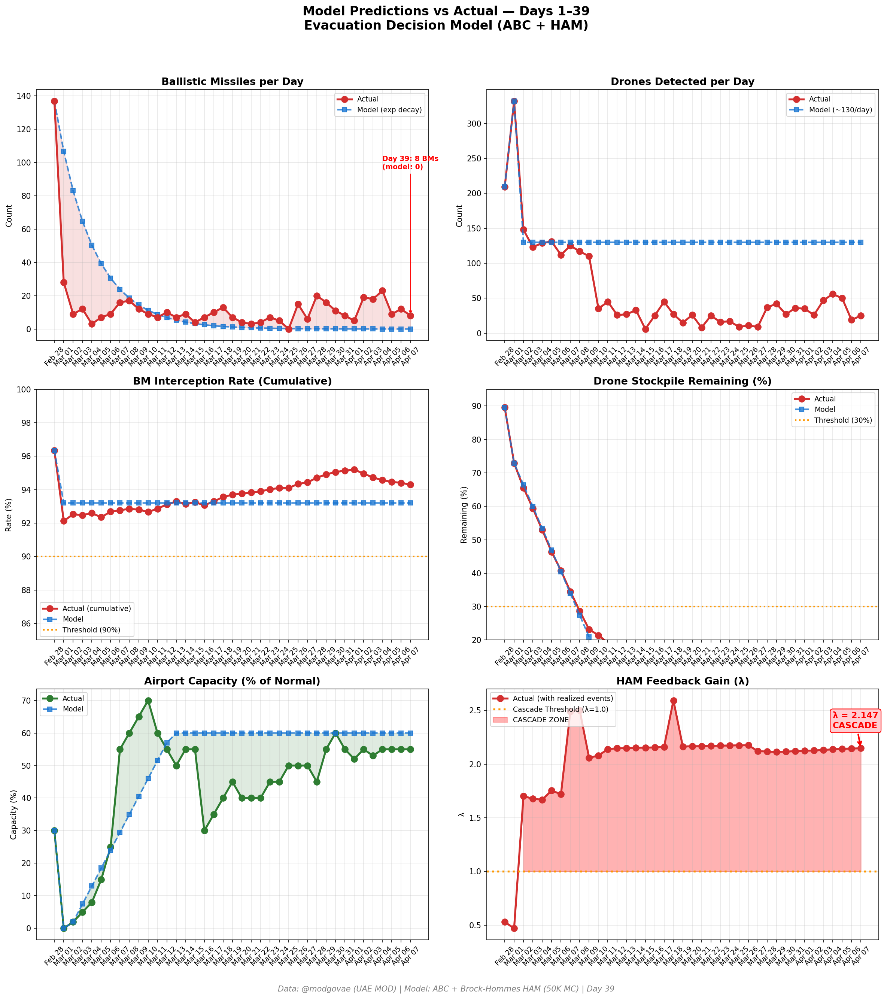
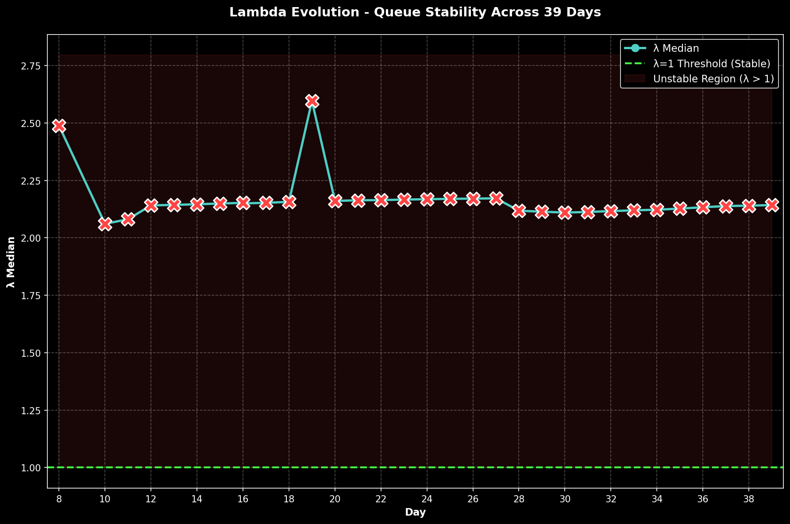

# Day 39 Update — April 07, 2026

> 🌐 **EN** | [中文](../zh/updates/day39-april7.md)

**Status: UNSTABLE** | **Breaches: 3/5** | **λ median = 2.143**

---

## New Data

| Metric | Day 38 | Day 39 | Cumulative |
|--------|-------|-------|------------|
| Ballistic Missiles | 12 | **8** | **526** |
| BM Intercepted | 11 | 7 | 496 |
| Drones Detected | 19 | ~25 | ~2341 |
| Drones Intercepted | 16 | 21 | ~2149 |
| Cruise Missiles | 2 | 0 | 19 |
| BM Intercept Rate (cum) | — | — | 94.3% |
| Drone Stockpile | — | — | -17.1% (-341/2000) |

**Key Events:**
- ~ESTIMATED @modgovae: ~8 BMs (~7 intercepted, ~1 fell sea), ~0 cruise missiles, ~25 drones (~21 intercepted, ~4 fell UAE); @modgovae official data not yet published — estimates based on recent trend
- TRUMP DEADLINE DAY: 8 PM ET Tuesday deadline for Iran to reopen Hormuz or face 'Power Plant Day and Bridge Day'; highest-stakes day of conflict since Feb 28
- ISLAMABAD ACCORD TALKS CONTINUE: 45-day ceasefire framework negotiations ongoing between Pakistani intermediaries, US, and Iran; outcome pending before deadline
- Iran's presidential spokesperson calls Trump's threats 'sheer desperation and anger'; says Hormuz will open under new legal regime
- Markets tense ahead of 8 PM deadline; WTI ~$112 (elevated), Brent ~$110; traders pricing in potential major escalation
- Polymarket ceasefire-by-Apr-30 collapses to ~4% (from ~15% Day 38, ~60% Day 37) — market sees near-zero chance of April deal
- Polymarket ceasefire-by-Jun-30 at ~53%, ceasefire-by-Dec-31 at ~75% — market expects eventual deal but not soon
- DXB operating at ~55% capacity; airlines on alert for potential escalation disrupting operations
- Hormuz: 15 vessels/day selective transit; no change in Iran's selective passage policy
- 3 US carrier strike groups in region (Lincoln, Ford, Bush); maximum force posture ahead of deadline
- Cumulative estimated: ~527 BMs, ~26 cruise, ~2,235 drones; ~13 dead, ~227 injured

---

## Lambda Recalculation

```
λ = 1.0
  + λ_launcher           = -0.544
  + λ_drone              = +0.234
  + λ_intercept          = +0.000
  + λ_hormuz             = +0.630
  + λ_proxy              = +0.500
  + λ_weapon             = +0.400
  + λ_bm_rebound         = +0.000
  + λ_naval              = -0.200
  ──────────────────────────────
  λ median           = 2.143  (50K Monte Carlo)
```

| Metric | Value |
|--------|-------|
| λ median | **2.143** |
| λ 95th percentile | **2.856** |
| P(λ > 1.0) | **100.0%** |
| P(λ > 1.5) | **98.0%** |
| P(λ > 2.0) | **65.1%** |
| Verdict | **UNSTABLE** |
| Breaches | **3/5** (launcher, drone_stockpile, interception_day) |

---

## Charts





---

## Recommendation

**EVACUATE IMMEDIATELY.** System is in CASCADE territory.

---

## Sources

| Source | Type |
|--------|------|
| @modgovae (X.com) | UAE MOD daily update |
| Model pipeline | ABC + HAM (50K MC) |
| Generated | 2026-04-07 00:09 |
