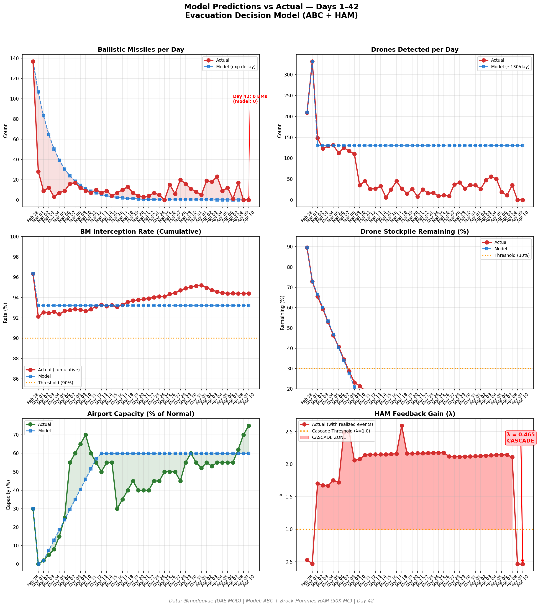
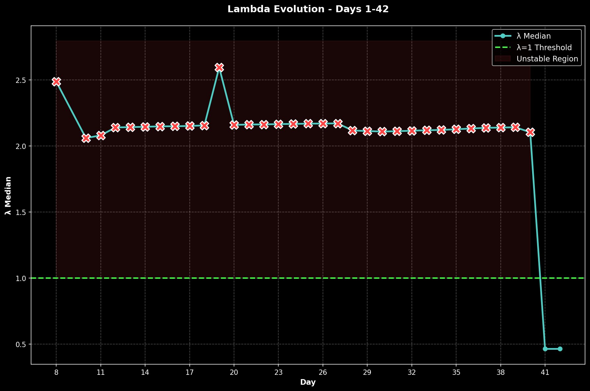

# Day 42 Update — April 10, 2026

> 🌐 **EN** | [中文](../zh/updates/day42-april10.md)

**Status: METASTABLE** | **Breaches: 2/5** | **λ median = 0.463**

---

## New Data

| Metric | Day 41 | Day 42 | Cumulative |
|--------|-------|-------|------------|
| Ballistic Missiles | 0 | **0** | **536** |
| BM Intercepted | 0 | 0 | 506 |
| Drones Detected | 0 | ~0 | ~2362 |
| Drones Intercepted | 0 | 0 | ~2172 |
| Cruise Missiles | 0 | 0 | 19 |
| BM Intercept Rate (cum) | — | — | 94.4% |
| Drone Stockpile | — | — | -18.1% (-362/2000) |

**Key Events:**
- Ceasefire Day 2: Second consecutive zero-attack day since conflict began Feb 28
- ISLAMABAD LOCKDOWN: Pakistan capital under security lockdown ahead of high-stakes US-Iran talks; VP JD Vance leads US delegation, FM Araghchi and Speaker Ghalibaf lead Iran delegation
- EASA AIRSPACE REVIEW: EASA Conflict Zone Information Bulletin review due today; Air France pre-emptively extended suspension Apr 9, signaling likely extension of advisory
- CEASEFIRE TENSIONS: Iran Speaker Ghalibaf accuses US of violating 3 parts of 10-point ceasefire proposal; Trump accuses Iran of not properly reopening Hormuz
- HORMUZ STILL BOTTLENECKED: 7 vessels transited Thursday (up from 5 Wed); 600+ vessels including 325 tankers still stranded; Russian-flagged supertanker makes rare passage into Gulf
- ADNOC CEO Al Jaber: Strait of Hormuz "not open" — access being restricted, conditioned and controlled by Iran; passage subject to permission and political leverage
- OIL VOLATILE: WTI ~$98.70 (rebounding from $93.10 ceasefire crash); Brent ~$96; markets pricing ceasefire fragility premium
- DXB at ~75% capacity: Emirates + flydubai operating 220+ daily flights, highest since conflict began; European carriers still suspended pending EASA review
- Polymarket: ceasefire extension to Apr 21 at ~75% (up from 71% Day 41); ceasefire-by-Apr-30 at ~98%; permanent peace deal by Jun-30 at ~40%
- GCC foreign ministers coordination call on post-ceasefire reconstruction planning and Iran accountability
- Cumulative (official): 537 BMs, 26 cruise missiles, 2,256 drones; ~13 dead, ~230 injured

---

## Lambda Recalculation

```
λ = 1.0
  + λ_launcher           = -0.544
  + λ_drone              = +0.236
  + λ_intercept          = +0.000
  + λ_hormuz             = +0.000
  + λ_proxy              = +0.000
  + λ_weapon             = +0.000
  + λ_bm_rebound         = +0.000
  + λ_naval              = -0.240
  ──────────────────────────────
  λ median           = 0.463  (50K Monte Carlo)
```

| Metric | Value |
|--------|-------|
| λ median | **0.463** |
| λ 95th percentile | **1.010** |
| P(λ > 1.0) | **5.1%** |
| P(λ > 1.5) | **2.0%** |
| P(λ > 2.0) | **0.3%** |
| Verdict | **METASTABLE** |
| Breaches | **2/5** (launcher, drone_stockpile) |

---

## Charts





---

## Recommendation

**MONITOR.** System within normal parameters.

---

## Sources

| Source | Type |
|--------|------|
| @modgovae (X.com) | UAE MOD daily update |
| Model pipeline | ABC + HAM (50K MC) |
| Generated | 2026-04-10 23:05 |
