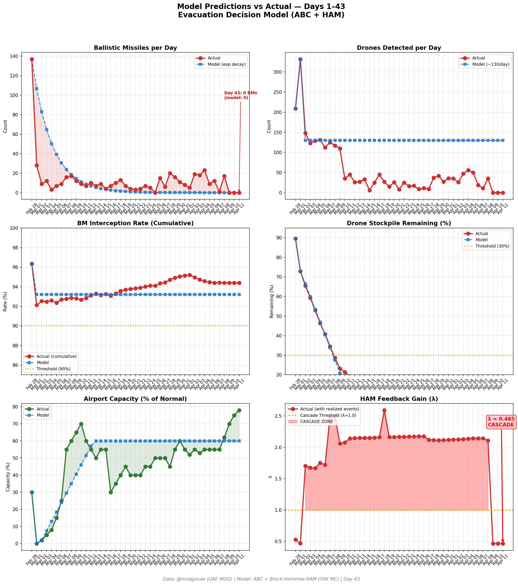
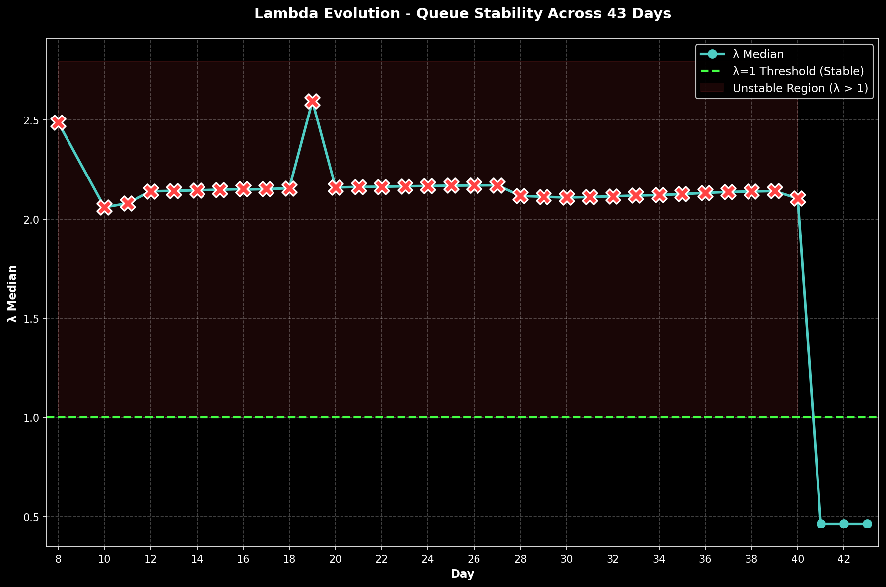

# Day 43 Update — April 11, 2026

> 🌐 **EN** | [中文](../zh/updates/day43-april11.md)

**Status: METASTABLE** | **Breaches: 2/5** | **λ median = 0.463**

---

## New Data

| Metric | Day 42 | Day 43 | Cumulative |
|--------|-------|-------|------------|
| Ballistic Missiles | 0 | **0** | **536** |
| BM Intercepted | 0 | 0 | 506 |
| Drones Detected | 0 | ~0 | ~2362 |
| Drones Intercepted | 0 | 0 | ~2172 |
| Cruise Missiles | 0 | 0 | 19 |
| BM Intercept Rate (cum) | — | — | 94.4% |
| Drone Stockpile | — | — | -18.1% (-362/2000) |

**Key Events:**
- Ceasefire Day 3: Third consecutive zero-attack day; no BMs, drones, or cruise missiles detected by @modgovae
- HISTORIC ISLAMABAD TALKS BEGIN: First direct US-Iran talks since 1979 Islamic Revolution. VP JD Vance + Steve Witkoff + Jared Kushner lead US delegation; FM Abbas Araghchi + Speaker Mohammad Bagher Ghalibaf lead Iranian delegation of 70+. Talks began after 5-hour delay (CNN, Al Jazeera, ABC News, Washington Times)
- PROGRESS SIGNALS: Sources report 'some progress on basic conditions including Lebanon ceasefire'; reports of potential 'movement on unfreezing of Iranian assets' (Al Jazeera live blog, Times of Israel)
- IRAN RED LINES: Iran state TV outlines red lines — control of Strait of Hormuz, Lebanon truce included in ceasefire, no US military presence in region (Times of Israel)
- US NAVY CROSSES HORMUZ: US warships cross Strait of Hormuz for first time since war began — east-to-west transit into Gulf and back (Bloomberg, Axios). Iran calls it a 'ceasefire violation' and threatens response. Aimed at building confidence for commercial shipping
- HORMUZ STILL BOTTLENECKED: ~10 vessels transited Saturday (up from 7 Thu); Iran still restricting passage, charging $1M+ tolls; 600+ vessels still stranded including 300+ tankers (NBC News, Al Jazeera)
- EASA EXTENDS AIRSPACE BAN: EASA extended Conflict Zone Information Bulletin (CZIB 2026-03-R6) to April 24 — European carriers (BA, Lufthansa, Air France, KLM) remain grounded on Gulf routes; next review April 24 (Wego, TravelPirates)
- DXB ~78% capacity: Emirates + flydubai operating 220+ daily flights; recovery continues but EASA extension blocks European carriers; Emirates at ~70% of pre-conflict capacity (IBTimes, Time Out Dubai)
- OIL SOFTENS ON TALKS OPTIMISM: WTI ~$95.50 (down from $98.70 Day 42); Brent ~$96.66; markets pricing increased probability of lasting ceasefire as talks begin (Trading Economics, Fortune)
- Polymarket: ceasefire extension to Apr 21 at ~78% (up from 75% Day 42); permanent peace deal by Jun-30 at ~42%; conflict ends by Dec-31 at ~94%
- Cumulative (official): 537 BMs, 26 cruise missiles, 2,256 drones; ~13 dead, ~230 injured (unchanged — third consecutive zero-casualty day)
- Trump warns of 'reset' if talks fail; Iran's Ghalibaf: 'We are here to find peace but not at any cost' (News24Online, The Week India)

---

## Lambda Recalculation

```
λ = 1.0
  + λ_launcher           = -0.544
  + λ_drone              = +0.236
  + λ_intercept          = +0.000
  + λ_hormuz             = +0.000
  + λ_proxy              = +0.000
  + λ_weapon             = +0.000
  + λ_bm_rebound         = +0.000
  + λ_naval              = -0.240
  ──────────────────────────────
  λ median           = 0.463  (50K Monte Carlo)
```

| Metric | Value |
|--------|-------|
| λ median | **0.463** |
| λ 95th percentile | **1.010** |
| P(λ > 1.0) | **5.1%** |
| P(λ > 1.5) | **2.0%** |
| P(λ > 2.0) | **0.3%** |
| Verdict | **METASTABLE** |
| Breaches | **2/5** (launcher, drone_stockpile) |

---

## Charts





---

## Recommendation

**MONITOR.** System within normal parameters.

---

## Sources

| Source | Type |
|--------|------|
| @modgovae (X.com) | UAE MOD daily update |
| Model pipeline | ABC + HAM (50K MC) |
| Generated | 2026-04-11 23:06 |
