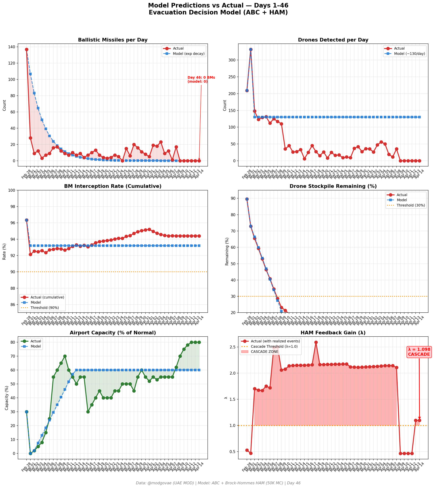
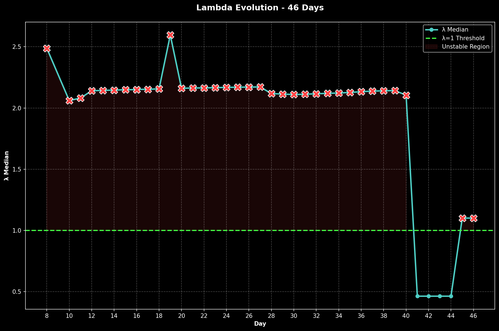

# Day 46 Update — April 14, 2026

> 🌐 **EN** | [中文](../zh/updates/day46-april14.md)

**Status: UNSTABLE** | **Breaches: 2/5** | **λ median = 1.101**

---

## New Data

| Metric | Day 45 | Day 46 | Cumulative |
|--------|-------|-------|------------|
| Ballistic Missiles | 0 | **0** | **536** |
| BM Intercepted | 0 | 0 | 506 |
| Drones Detected | 0 | ~0 | ~2362 |
| Drones Intercepted | 0 | 0 | ~2172 |
| Cruise Missiles | 0 | 0 | 19 |
| BM Intercept Rate (cum) | — | — | 94.4% |
| Drone Stockpile | — | — | -18.1% (-362/2000) |

**Key Events:**
- Ceasefire Day 6: Sixth consecutive zero-attack day; no BMs, drones, or cruise missiles — ceasefire holds despite US naval blockade of Iranian ports
- US BLOCKADE DAY 2: Naval blockade of Iranian ports continues; 14 total ships have transited Hormuz since blockade began (~11 today vs ~3 Monday). US allows non-Iranian port traffic through strait
- SECOND ROUND TALKS DISCUSSED: Pakistan working to set up second round of US-Iran peace talks in Islamabad after first round (21-hour marathon Apr 11-12) collapsed. Both sides reportedly open to resuming negotiations
- Iran considering pausing Hormuz shipping to avoid testing US blockade and derailing potential talks (Bloomberg). Shows restraint despite rhetoric
- CHINA CONDEMNS BLOCKADE: Beijing calls US naval blockade of Hormuz "dangerous and irresponsible act" that will further inflame tensions (CNBC)
- Sanctioned tankers testing blockade: US-sanctioned tanker attempts Hormuz transit, testing enforcement resolve (Bloomberg)
- OIL DROPS ~6%: WTI falls to ~7/bbl (from 03 Monday), Brent ~7.89 — both drop ~5-6% as markets price in potential second round of talks. Biggest single-day drop since ceasefire began
- DXB ~80% capacity: Emirates operating ~145-150 departures/day to ~125 destinations (~70% of normal). EASA conflict zone bulletin extended to Apr 24. Foreign carrier one-rotation cap starts Apr 20
- Polymarket: Ceasefire extension by Apr 21 market at 71%. General ceasefire sentiment drops to ~42% as blockade creates uncertainty
- Trump says ceasefire "holding well" but "I don't care" whether Iran returns to negotiating table. Contradictory signals from White House
- Hezbollah-Israel escalation continues separately from Iran ceasefire; Israel asserts ceasefire does not cover Lebanon
- VLCC rates surge to ~90K/day as war-risk premiums remain extreme; major P&I clubs suspend war risk cover for Gulf transits
- Cumulative (official): 537 BMs, 26 cruise missiles, 2,256 drones; ~13 dead, ~230 injured (unchanged — sixth consecutive zero-casualty day)

---

## Lambda Recalculation

```
λ = 1.0
  + λ_launcher           = -0.544
  + λ_drone              = +0.236
  + λ_intercept          = +0.000
  + λ_hormuz             = +0.630
  + λ_proxy              = +0.000
  + λ_weapon             = +0.000
  + λ_bm_rebound         = +0.000
  + λ_naval              = -0.240
  ──────────────────────────────
  λ median           = 1.101  (50K Monte Carlo)
```

| Metric | Value |
|--------|-------|
| λ median | **1.101** |
| λ 95th percentile | **1.515** |
| P(λ > 1.0) | **67.3%** |
| P(λ > 1.5) | **5.2%** |
| P(λ > 2.0) | **2.4%** |
| Verdict | **UNSTABLE** |
| Breaches | **2/5** (launcher, drone_stockpile) |

---

## Charts





---

## Recommendation

**EVACUATE.** System has crossed cascade threshold.

---

## Sources

| Source | Type |
|--------|------|
| @modgovae (X.com) | UAE MOD daily update |
| Model pipeline | ABC + HAM (50K MC) |
| Generated | 2026-04-14 23:06 |
