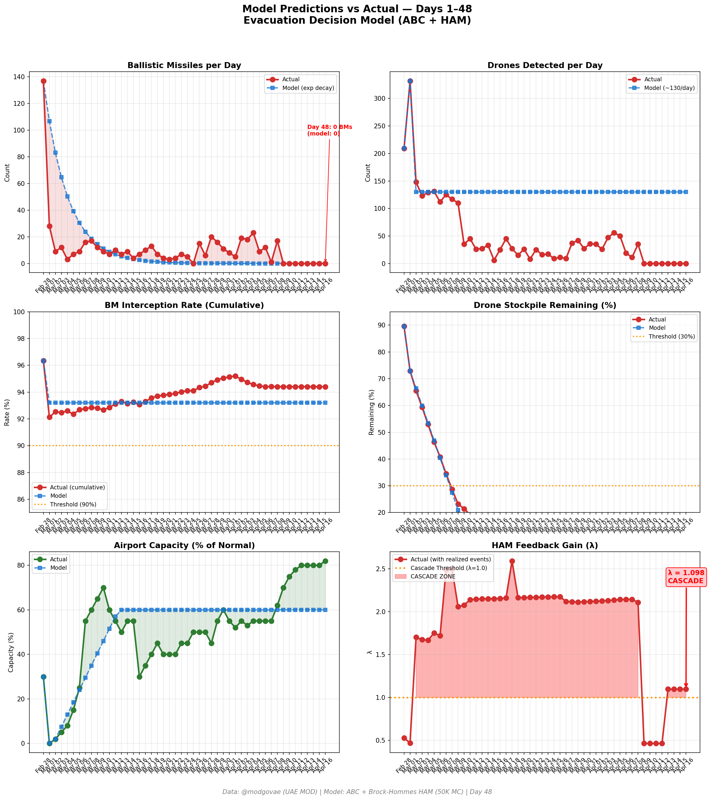
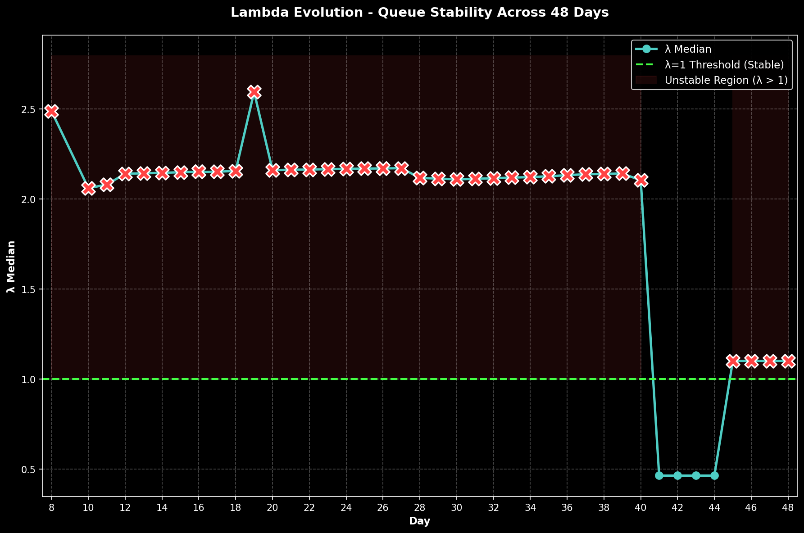

# Day 48 Update — April 16, 2026

> 🌐 **EN** | [中文](../zh/updates/day48-april16.md)

**Status: UNSTABLE** | **Breaches: 2/5** | **λ median = 1.101**

---

## New Data

| Metric | Day 47 | Day 48 | Cumulative |
|--------|-------|-------|------------|
| Ballistic Missiles | 0 | **0** | **536** |
| BM Intercepted | 0 | 0 | 506 |
| Drones Detected | 0 | ~0 | ~2362 |
| Drones Intercepted | 0 | 0 | ~2172 |
| Cruise Missiles | 0 | 0 | 19 |
| BM Intercept Rate (cum) | — | — | 94.4% |
| Drone Stockpile | — | — | -18.1% (-362/2000) |

**Key Events:**
- Ceasefire Day 8: Eighth consecutive zero-attack day; ceasefire holds as diplomatic momentum builds ahead of April 21 expiry
- DIPLOMATIC BREAKTHROUGH HOPES: Al Jazeera: 'Hopes grow for a breakthrough in US-Iran talks as Pakistan mediates'; Bloomberg: 'Pakistan Steps Up Mediation as US, Iran Consider Extending Ceasefire'
- SECOND ROUND TALKS EXPECTED IMMINENTLY: Second round of Islamabad talks expected before ceasefire expires April 21; Trump says Iran war 'close to over' as Pakistan pushes hard for peace (CBS News, CNN)
- Pakistan mediation intensifying: Pakistani delegation working both sides; ceasefire extension and second round talks now appear likely before April 21 deadline
- HORMUZ: US naval blockade continues; ~9 ship crossings; first Western ships reportedly crossing paying Iran in Yuan (House of Saud report); VLCC rates ~$390K/day easing from peak
- OIL: Brent $94.89 (-0.04%), WTI $91.91 (+0.68%) — market stabilizing, pricing in ceasefire extension and diplomatic progress (oilpriceapi.com)
- DXB OPEN APRIL 16: Emirates, flydubai, Air Arabia maintaining schedules; airport running 220+ flights; full recovery gaining momentum (IBTimes, TravelPirates); EASA bulletin extended to Apr 24
- USS George H.W. Bush CSG now operational in CENTCOM AOR — 3 US carrier strike groups in region; ~27 Navy vessels deployed (~41% of actively-at-sea ships)
- Polymarket: ceasefire extension by Apr 21 at ~78%; general ceasefire sentiment rises to ~70% as Pakistan intensifies mediation and diplomatic signals improve
- Cumulative (official): 537 BMs, 26 cruise missiles, 2,256 drones; ~13 dead, ~230 injured (unchanged — eighth consecutive zero-casualty day)

---

## Lambda Recalculation

```
λ = 1.0
  + λ_launcher           = -0.544
  + λ_drone              = +0.236
  + λ_intercept          = +0.000
  + λ_hormuz             = +0.630
  + λ_proxy              = +0.000
  + λ_weapon             = +0.000
  + λ_bm_rebound         = +0.000
  + λ_naval              = -0.240
  ──────────────────────────────
  λ median           = 1.101  (50K Monte Carlo)
```

| Metric | Value |
|--------|-------|
| λ median | **1.101** |
| λ 95th percentile | **1.515** |
| P(λ > 1.0) | **67.3%** |
| P(λ > 1.5) | **5.2%** |
| P(λ > 2.0) | **2.4%** |
| Verdict | **UNSTABLE** |
| Breaches | **2/5** (launcher, drone_stockpile) |

---

## Charts





---

## Recommendation

**EVACUATE.** System has crossed cascade threshold.

---

## Sources

| Source | Type |
|--------|------|
| @modgovae (X.com) | UAE MOD daily update |
| Model pipeline | ABC + HAM (50K MC) |
| Generated | 2026-04-16 23:34 |
