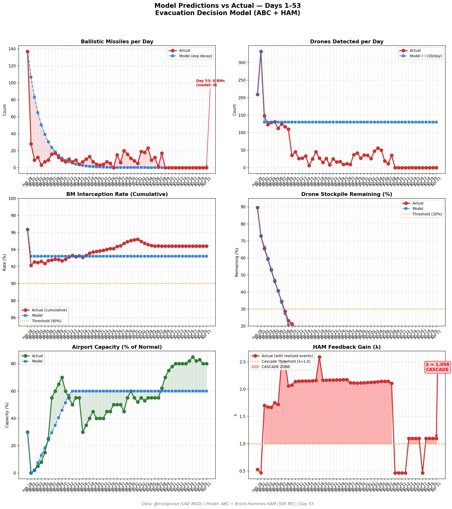
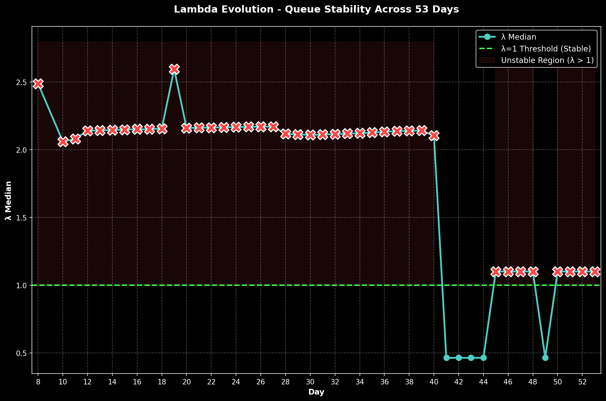

# Day 53 Update — April 21, 2026

> 🌐 **EN** | [中文](../zh/updates/day53-april21.md)

**Status: UNSTABLE** | **Breaches: 2/5** | **λ median = 1.101**

---

## New Data

| Metric | Day 52 | Day 53 | Cumulative |
|--------|-------|-------|------------|
| Ballistic Missiles | 0 | **0** | **536** |
| BM Intercepted | 0 | 0 | 506 |
| Drones Detected | 0 | ~0 | ~2362 |
| Drones Intercepted | 0 | 0 | ~2172 |
| Cruise Missiles | 0 | 0 | 19 |
| BM Intercept Rate (cum) | — | — | 94.4% |
| Drone Stockpile | — | — | -18.1% (-362/2000) |

**Key Events:**
- Ceasefire Day 13: Thirteenth consecutive zero-attack day on UAE — the ceasefire technically holds on its penultimate day but remains under visible strain
- CEASEFIRE EXPIRES TOMORROW: Two-week ceasefire (began Apr 7) ends Wednesday evening Washington time (Apr 22); Trump maintains extension is 'highly unlikely' absent a deal (CNN, ABC News)
- VANCE DEPARTS FOR PAKISTAN: VP JD Vance departs Washington for Islamabad today to lead US delegation at round-two talks with Iran Wednesday; Pakistani Army Chief Gen. Asim Munir remains in Tehran coordinating
- IRAN RETALIATION THREATS: Tehran continues to warn of 'swift retaliation' for Sunday's seizure of Iranian-flagged container ship in Gulf of Oman; IRGC maintains posture; no kinetic response yet
- UAE 'VICTORIOUS' FRAMING HOLDS: UAE MOFA and Gargash reiterate UAE position — Iran must adhere to cessation of attacks and ensure freedom of navigation through Hormuz as conditions for any durable settlement
- HORMUZ: Strait remains closed per Iran's Supreme National Security Council; ~12 ship crossings today (vs 16 yesterday) as carriers wait for Wednesday outcome; VLCC rates ease slightly to ~$415K/day
- OIL STABILIZES AT ELEVATED: WTI ~$90.5, Brent ~$96 — markets consolidating Day-52 jump, holding ~$4-5 war-risk premium ahead of Wednesday's ceasefire decision; Bloomberg analysis flags $120+ risk on Hormuz closure scenario
- DXB: Capacity ~80%; foreign-carrier one-rotation cap in second day; Emirates ~145-150 daily departures (~70% normal); flydubai ~70-73 daily (~40% normal); EASA conflict-zone bulletin runs through Apr 24
- Polymarket: Ceasefire extension by Apr 21 prediction markets resolving today; general ceasefire sentiment drops further to ~56% (from ~58% Day 52) on Vance-departure symbolism and final-countdown posturing
- US CARRIERS: 3 CSGs on station; blockade enforcement continues through ceasefire expiry; ~27 Navy vessels engaged
- Cumulative (official, unchanged): 537 BMs, 26 cruise missiles, 2,256 drones; ~13 dead, ~230 injured (thirteenth consecutive zero-casualty day)
- ANALYTICAL NOTE: Day 53 is the last ceasefire day; Wednesday's round-two Islamabad talks will determine whether hostilities resume or the truce is extended. Model inputs dominated by diplomatic-tail uncertainty, not kinetic activity

---

## Lambda Recalculation

```
λ = 1.0
  + λ_launcher           = -0.544
  + λ_drone              = +0.236
  + λ_intercept          = +0.000
  + λ_hormuz             = +0.630
  + λ_proxy              = +0.000
  + λ_weapon             = +0.000
  + λ_bm_rebound         = +0.000
  + λ_naval              = -0.240
  ──────────────────────────────
  λ median           = 1.101  (50K Monte Carlo)
```

| Metric | Value |
|--------|-------|
| λ median | **1.101** |
| λ 95th percentile | **1.515** |
| P(λ > 1.0) | **67.3%** |
| P(λ > 1.5) | **5.2%** |
| P(λ > 2.0) | **2.4%** |
| Verdict | **UNSTABLE** |
| Breaches | **2/5** (launcher, drone_stockpile) |

---

## Charts





---

## Recommendation

**EVACUATE.** System has crossed cascade threshold.

---

## Sources

| Source | Type |
|--------|------|
| @modgovae (X.com) | UAE MOD daily update |
| Model pipeline | ABC + HAM (50K MC) |
| Generated | 2026-04-21 11:59 |
