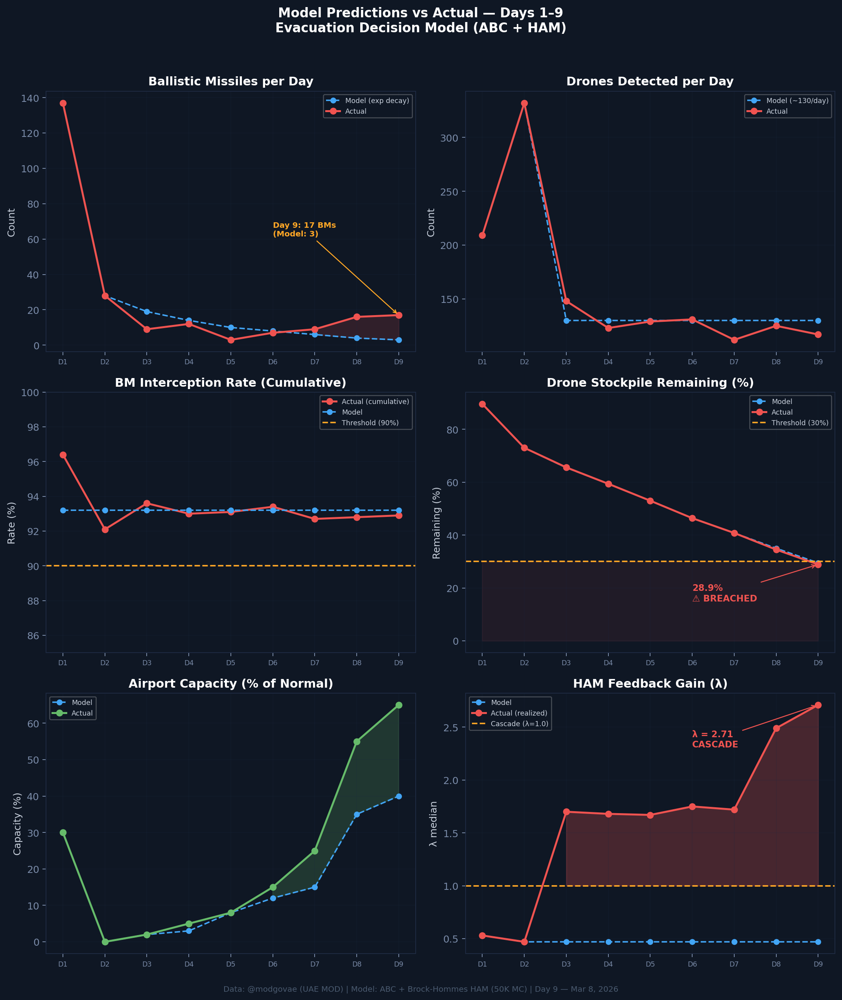

# Day 9 Update — March 08, 2026

> 🌐 **EN** | [中文](../zh/updates/day9-march8.md)

**Status: UNSTABLE** | **Breaches: 3/5** | **λ median = 2.712**

---

## New Data

| Metric | Day 8 | Day 9 | Cumulative |
|--------|-------|-------|------------|
| Ballistic Missiles | 16 | **17** | **238** |
| BM Intercepted | 15 | 16 | 221 |
| Drones Detected | ~125 | 117 | ~1,422 |
| Drones Intercepted | 119 | 113 | ~1,342 |
| Cruise Missiles | 0 | 0 | 8 |
| BM Intercept Rate (cum) | 92.8% | — | 92.9% |
| Drone Stockpile | 34.5% (691/2000) | — | 28.9% (578/2000) |

**Key Events:**
- 17 BMs detected — back-to-back daily high (16→17), confirming rebound is not noise
- 4th civilian killed: Pakistani driver in Dubai (Al Barsha) — debris from interception
- Drone stockpile **breaches 30% threshold** (28.9%) — first time below model threshold
- Emirates targeting 100% capacity "in coming days"; Air Arabia resumes March 9
- Brent crude hits ~$100; Morgan Stanley raises forecast; 35% weekly gain (largest since 1983)
- Polymarket ceasefire by Mar 31: 59% (↓ from 61%)

---

## Lambda Recalculation

```
λ = 1.0
  + λ_launcher           = -0.350
  + λ_drone              = +0.210
  + λ_intercept          = +0.001
  + λ_hormuz             = +0.630
  + λ_proxy              = +0.500
  + λ_weapon             = +0.400
  + λ_bm_rebound         = +0.350
  + λ_naval              = -0.150
  ──────────────────────────────
  λ median           = 2.712  (50K Monte Carlo)
```

| Metric | Value |
|--------|-------|
| λ median | **2.712** |
| λ 95th percentile | **3.481** |
| P(λ > 1.0) | **100.0%** |
| P(λ > 1.5) | **100.0%** |
| P(λ > 2.0) | **95.8%** |
| Verdict | **UNSTABLE** |
| Breaches | **3/5** (casualties, new_weapon, drone_stockpile) |

---

## What Changed Day 8 → Day 9

```
Day 8 → Day 9 Lambda Decomposition:

Component          Day 8            Day 9               Change
─────────────────────────────────────────────────────────────────
λ_launcher         -0.413           -0.350              +0.063  (depletion revised: 73%→~67%)
λ_drone            +0.131           +0.210              +0.079  ⚠️ Stockpile breaches 30%
λ_intercept        +0.001           +0.001               0.000
λ_proxy            +0.500           +0.500               0.000
λ_hormuz           +0.630           +0.630               0.000
λ_weapon           +0.400           +0.400               0.000
λ_bm_rebound       +0.300           +0.350              +0.050  (3→7→9→16→17 trend)
λ_naval            -0.184           -0.150              +0.034  (CVN-77 transit continues)
─────────────────────────────────────────────────────────────────
λ total (median)    2.488            2.712              +0.224
```

Key drivers of the Day 9 increase:
1. **Drone stockpile breach** (+0.079): Estimated 578/2000 remaining (28.9%) — below the 30% cascade threshold for the first time. At current burn rate (~120/day), stockpile exhaustion in ~5 days
2. **BM rebound persistence** (+0.050): 17 BMs confirms accelerating trend is structural, not noise. Launcher depletion estimate revised down to ~67%
3. **Launcher depletion revision** (+0.063): Hidden TEL reserves or resupply confirmed by sustained high-volume launch

---

## Charts




---

## Defense Cost Update

As of Day 9, the cumulative defense interceptor inventory and cost:

| Category | Intercepted | System | 1:1 Cost ($M) | 1:2 Cost ($M) |
|----------|------------|--------|---------------|---------------|
| BM (THAAD, 60%) | 133 | THAAD @ $12.7M | 1,685 | 3,370 |
| BM (PAC-3, 40%) | 88 | PAC-3 @ $3.9M | 345 | 689 |
| Cruise Missiles | 8 | PAC-3 @ $3.9M | 31 | 62 |
| Drones | 1,342 | SHORAD @ $0.7M | 939 | 1,879 |
| **TOTAL** | **1,571** | | **$3,000** | **$6,000** |

### Oil Revenue Not Sold (Cumulative, 9 days)

| Component | Volume | Revenue Loss |
|-----------|--------|-------------|
| Stranded oil (no Hormuz) | 1.7M bbl/d × 9 days × $100 | **$1,530M** |
| Voluntary production cuts | 0.5M bbl/d × 9 days × $100 | **$450M** |
| **TOTAL OIL LOSS** | | **$1,980M ($1.98B)** |

### Grand Total Cost to UAE (Day 9)

| Scenario | Defense | Oil Loss | **Grand Total** |
|----------|---------|----------|----------------|
| 1:1 | $3.00B | $1.98B | **$4.98B** |
| 1:2 | $6.00B | $1.98B | **$7.98B** |
| 1:3 | $9.00B | $1.98B | **$10.98B** |

*Iran's estimated offensive cost: ~$280–540M (midpoint ~$410M). Defense-to-offense ratio: 7.3–21.9×*

---

## Recommendation

**EVACUATE IMMEDIATELY.** Drone stockpile has breached the 30% threshold — once exhausted, Iran shifts entirely to ballistic missiles where interception cost is 10–18× higher per unit. The narrowing asymmetry accelerates cascade risk. Airport capacity window remains open but may close if BM volume continues escalating.

---

## Sources

| Source | Type |
|--------|------|
| [@modgovae](https://x.com/modgovae/status/2030596754287247788) | UAE MOD daily update (Mar 8) |
| [Arab News](https://www.arabnews.com/node/2635645/middle-east) | 16 BM, 113 drones confirmed |
| [Pakistan Today](https://www.pakistantoday.com.pk/2026/03/08/second-pakistani-national-killed-in-uae-by-falling-debris-from-aerial-interception) | 4th casualty confirmed |
| [CNBC](https://www.cnbc.com/2026/03/06/iran-us-war-oil-prices-brent-wti-barrel-futures.html) | Oil 35% weekly gain |
| [Morgan Stanley](https://www.businesstoday.in/world/middle-east/story/west-asia-conflict-morgan-stanley-raises-oil-price-forecasts-as-hormuz-risk-premium-builds-brent-nears-90-519570-2026-03-07) | Brent forecast raised |
| [Polymarket](https://polymarket.com/event/us-x-iran-ceasefire-by) | Ceasefire odds |
| Model pipeline | ABC + HAM (50K MC) |
| Generated | 2026-03-08 12:00 |
