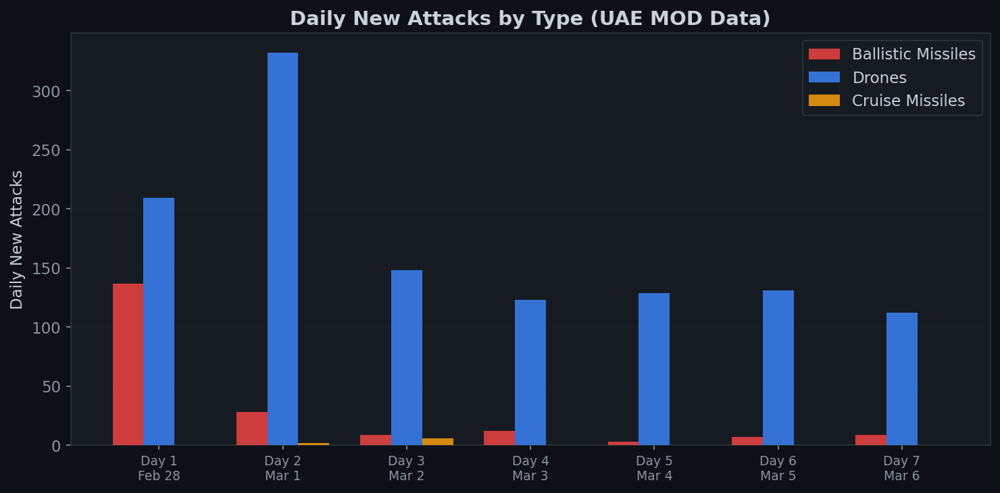

# 阿联酋国防部攻击数据

> 🌐 [English](../../data/mod-attack-data.md) | **中文**

## 累计数据表（第1-7天）

| 天 | 日期 | 累计弹道导弹 | 已拦截 | 海面坠落 | 陆地 | 巡航导弹 | 无人机 | 拦截率 |
|----|------|------------|--------|---------|------|---------|--------|--------|
| 1 | 2月28日 | 137 | 132 | 5 | 0 | 0 | 209 | — |
| 2 | 3月1日 | 165 | 152 | 13 | 0 | 2 | 541 | — |
| 3 | 3月2日 | 174 | 161 | 13 | 0 | 8 | 689 | 93.6% |
| 4 | 3月3日 | 186 | 172 | 13 | 1 | 8 | 812 | 93.0% |
| 5 | 3月4日 | 189 | 175 | 13 | 1 | 8 | 941 | 93.1% |
| 6 | 3月5日 | 196 | 181 | 13 | 2 | 8 | 1072 | 93.4% |
| 7 | 3月6日 | 205 | 190 | 13 | 2 | 8 | 1184 | 92.7% |

## 每日新增攻击（差分）

| 天 | 日期 | 新增弹道导弹 | 新增巡航导弹 | 新增无人机 | 合计 |
|----|------|------------|------------|----------|------|
| 1 | 2月28日 | 137 | 0 | 209 | 346 |
| 2 | 3月1日 | 28 | 2 | 332 | 362 |
| 3 | 3月2日 | 9 | 6 | 148 | 163 |
| 4 | 3月3日 | 12 | 0 | 123 | 135 |
| 5 | 3月4日 | 3 | 0 | 129 | 132 |
| 6 | 3月5日 | 7 | 0 | 131 | 138 |
| 7 | 3月6日 | 9 | 0 | 112 | 121 |

## 关键观察

**弹道导弹：** 第1天首轮齐射137枚，到第5天迅速降至个位数。第7天出现小幅反弹（7→9），打破单调递减。这可能反映残余机动TEL发射，而非持续反弹。

**无人机：** 第2天日发射量达峰值332架，从第4天起稳定在110-130架/天。产能受限模式表明稳态制造能力约130架/天。

**巡航导弹：** 零星部署 — 7天内共8枚。非主要攻击载体。

**拦截率：** 持续高于92%，范围在92.7%至93.6%之间。萨德和爱国者系统在设计参数内运行。

## 确认伤亡

截至3月7日：**3人死亡，112人受伤**（累计）。鉴于攻击量级，伤亡数字极低，归功于>92%的拦截率。
