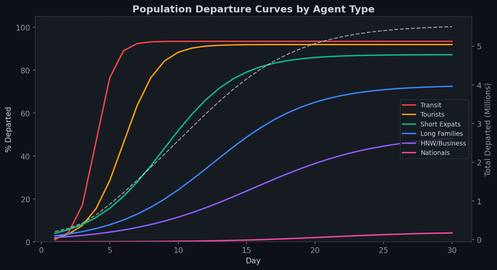

# 4. 人口外流模型

> 🌐 [English](../../method/population-flight.md) | **中文**


人口外流模块改编了 **Brock & Hommes (1998) 异质代理模型**用于撤离动态分析。六种代理类型代表不同的平民群体，各有独特的风险阈值、离境速度和敏感度配置。

## 代理类型

| 代理 | 人口占比 | 规模 | 风险阈值 | 离境速度 | 攻击敏感度 | 社会传染 | 基础设施 |
|------|---------|------|---------|---------|-----------|---------|---------|
| 过境/滞留旅客 | 2% | 20万 | 0.01 | 0.99 | 1.0 | 0.0 | 0.0 |
| 游客 | 5% | 50万 | 0.05 | 0.85 | 2.5 | 1.5 | 0.5 |
| 短期外籍人士 | 15% | 150万 | 0.15 | 0.30 | 1.5 | 1.2 | 1.0 |
| 长期家庭 | 45% | 450万 | 0.28 | 0.12 | 0.9 | 1.0 | 2.5 |
| 高净值/商务 | 5% | 50万 | 0.38 | 0.08 | 0.6 | 0.8 | 2.0 |
| 本国公民 | 12% | 120万 | 0.75 | 0.015 | 0.3 | 0.2 | 0.5 |

**设计理念：** 过境旅客无论条件如何立即离开。游客阈值低、速度快。长期家庭是最大群体，但需要持续压力（高基础设施敏感度反映学校关闭、服务中断）。本国公民阈值最高 — 深厚的根基、房产、大家庭网络。

## 感知风险函数

Brock-Hommes改编的感知风险函数包含六个分量：

```
R_a(d) = 0.25 · M(d) · α_atk     // 记忆加权攻击强度
       + 0.15 · SC(d) · α_soc     // 社会传染（羊群效应）
       + 0.10 · ID(d) · α_inf     // 基础设施退化
       + 0.30 · DS(d)             // 持续时间压力
       + 0.10 · U(d)              // 不确定性溢价
       + 0.10 · SD(d) · α_inf     // 服务中断
```

### 记忆加权攻击强度

在7天回溯窗口内使用指数衰减：

```
M(d) = Σ_{k=0..6} AI(d-k) · 0.7^k / Σ_{k=0..6} 0.7^k
```

这捕捉了心理现实：近期攻击的权重高于较早的攻击，但记忆不会立即重置。

### 社会传染（羊群效应）

```
SC(d) = (总离境比例)^0.5
```

非线性：一旦离境率超过~5%阈值即加速。这是Brock-Hommes的核心洞察 — 代理人观察其他代理人的决策并将其纳入自身的风险评估。

### 持续时间压力

```
DS(d) = 1 - exp(-0.10 · d)
```

捕捉"即使是耐心的家庭最终也会崩溃"的动态。第10天达到0.63，第30天达到0.95。这是关键的校准修正 — 没有持续时间压力，长期家庭和本国公民永远无法达到其离境阈值。

### 基础设施退化

```
ID(d) = 1 / (1 + exp(10 · (EA(d) - 0.50)))
```

经济活动剩余量的S型函数。当经济活动降至50%以下时急剧触发。

## 离境决策规则

```python
if R_a(d) > θ_a:
    excess = (R_a(d) - θ_a) / (1 - θ_a)
    new_wanting = remaining_a · speed_a · excess^1.3
```

1.3次幂创造凸形响应 — 小的风险超额产生温和的离境，但大的超额触发快速外流。

## 机场运力约束

实际离境受GCAA机场运力恢复曲线限制：

```python
AIRPORT_CAPACITY = {
    "normal_daily": 310_000,
    "recovery": {
        0: 0.30, 1: 0.00, 2: 0.02, 3: 0.03, 4: 0.08,
        5: 0.12, 6: 0.15, 7: 0.25, 8: 0.35, 9: 0.45,
        10: 0.50, 14: 0.65, 20: 0.80, 29: 0.90,
    }
}
```

这在冲突初期创造瓶颈（第1天：机场关闭，第2-3天：最低运力），产生大量想离开但无法登机的排队人群。



## 第30天模型输出

| 代理 | 已离境 (%) | 已离境（人数） |
|------|-----------|---------------|
| 过境/滞留旅客 | ~93% | ~18.6万 |
| 游客 | ~92% | ~46万 |
| 短期外籍人士 | ~87% | ~131万 |
| 长期家庭 | ~62% | ~279万 |
| 高净值/商务 | ~50% | ~25万 |
| 本国公民 | ~4.6% | ~5.5万 |
| **合计** | — | **~504万** |

报告目标：555万（约91%匹配）。
