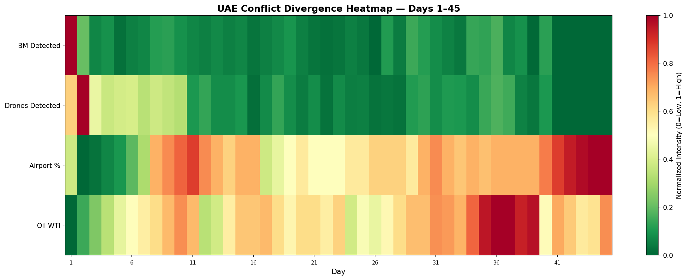
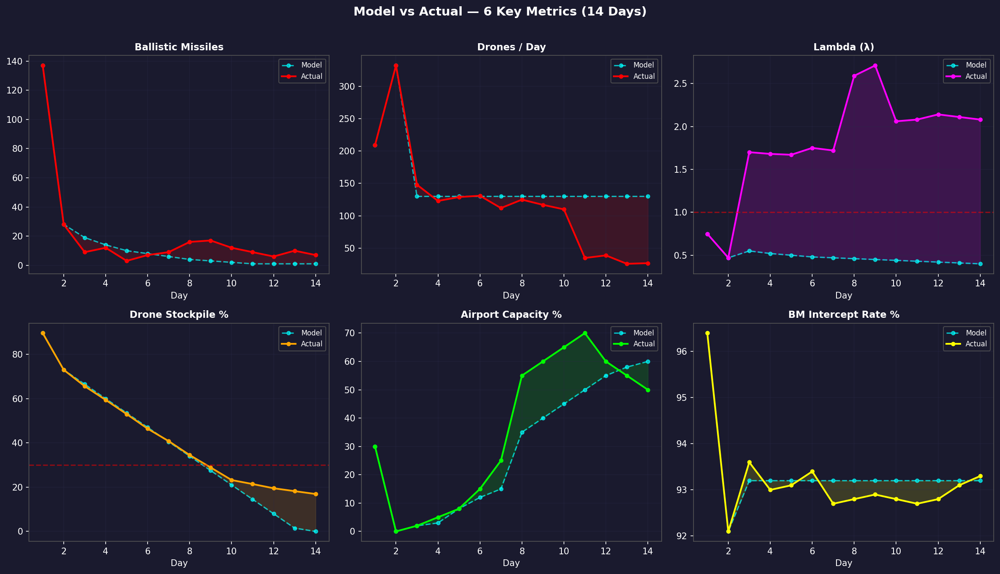
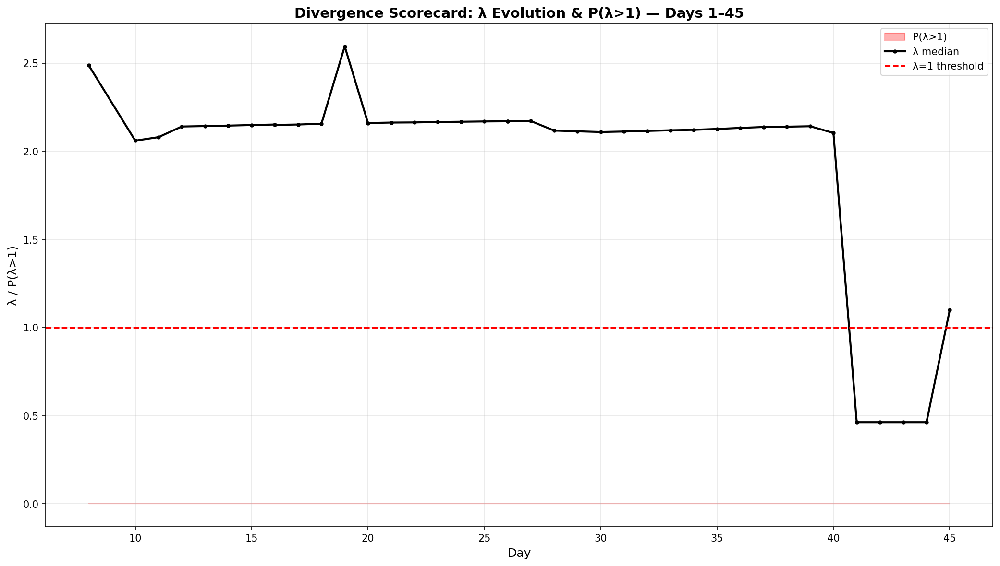
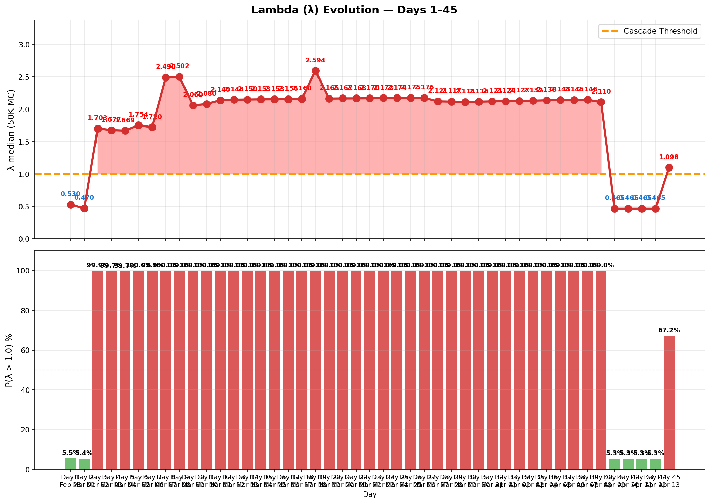
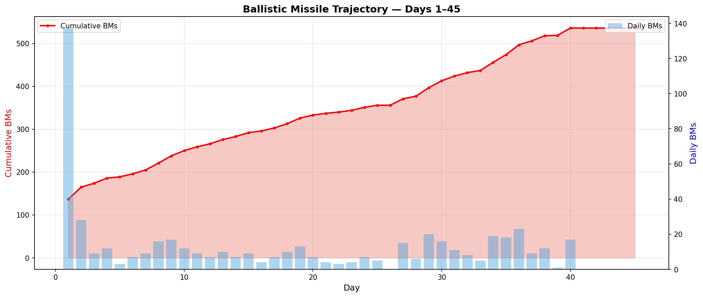

# 每日追踪 — 逐日变化日志

> 🌐 [English](../../updates/daily-tracker.md) | **中文**

**最后更新：2026年4月13日（第45天）**

本页面逐日追踪所有模型输入的变化，将模型预测与实际观测数据进行对比，并在出现偏离时标记警报。

---

## 模型vs实际 — 偏离摘要

### 偏离热力图

逐日6项指标百分比偏差（45天）。红色=实际超出模型，蓝色=实际低于模型。Lambda偏离从第3天起主导（+240% → +360%）。无人机从第11天起极端偏离（实际6-45 vs 模型~130）。弹道导弈在3-23范围内震荡，远超模型接近零的预测。**第45天：美国海军封锁开始；霍尔木兹实质性再次关闭；油价飙升约8%；λ=1.101（不稳定）；Polymarket停火概率~45%。**

### 6面板对比

模型（蓝色）vs实际（红色）带填充显示差距。机场（绿色）在第17天DXB暴跌前为正向偏离。Lambda（右下）显示深度级联区。无人机库存（中下）在第9天突破30%阈值。第45天数据已含。

### 记分卡与判定时间线

堆叠偏离显示Lambda（紫色）主导总模型误差。判定时间线：模型全45天预测亚稳态——现实在第3天跨入不稳定且仅在停火期间简短恢复亚稳态（第41-43天），后因美国海军封锁重返不稳定（第45天）。

### Lambda演变

λ在第3天从0.47跳至1.70（霍尔木兹关闭），第9天达2.71峰值（无人机库存突破+弹道反弹），随后回落并从第10天起稳定在~2.1平台。第12-38天λ在2.1-2.2范围内保持稳定。停火宣布（第40天）：λ暴跌至0.463（亚稳定）。停火维持（第41-43天）：λ保持0.463（亚稳定）。美国海军封锁开始（第45天）：λ跳升至1.101（重返不稳定）。P(λ>1)从第3天起持续100%，仅在停火期间（第41-43天）降至5.1%，再在海军封锁时升至67.3%。

### 弹道导弹轨迹

模型的指数衰减假设（β=0.25/天）从第5天起失效。第5→9天：3→7→9→16→17呈加速反弹。反弹后（第10-40天）：弹道导弈在3-23范围内震荡，呈噪声模式。第26天：0枚弹道——历史首次零弹道日。第27-36天：弹道激增（0→15→6→20→16→11→8→5→19→23），显示伊朗战术灵活性。停火期间（第41-43天）：0枚弹道。美国海军封锁后（第44-45天）：继续0枚弹道（停火维持）。累计537枚弹道导弹，2,256架无人机，26枚巡航导弹。

---

## 攻击量追踪

### 每日新增攻击

| 天 | 日期 | 弹道导弹 | 模型预测 | 无人机 | 模型预测 | 巡航导弹 | 总计 | 趋势 |
|----|------|---------|---------|--------|---------|---------|------|------|
| 1 | 2月28日 | **137** | — | 209 | — | 0 | 346 | 开战齐射 |
| 2 | 3月1日 | **28** | — | 332 | — | 2 | 362 | 无人机峰值日 |
| 3 | 3月2日 | **9** | ~19 | 148 | ~130 | 6 | 163 | 导弹衰减快于模型 |
| 4 | 3月3日 | **12** | ~14 | 123 | ~130 | 0 | 135 | 导弹回升（噪声？） |
| 5 | 3月4日 | **3** | ~10 | 129 | ~130 | 0 | 132 | 导弹接近零 |
| 6 | 3月5日 | **7** | ~8 | 131 | ~130 | 0 | 138 | 导弹反弹 |
| 7 | 3月6日 | **9** | ~6 | 112 | ~130 | 0 | 121 | ⚠️ 导弹打破单调递减 |
| 8 | 3月7日 | **16** | ~4 | ~125 | ~130 | 0 | 141 | ⚠️ 导弹激增（第2天以来最高） |
| **9** | **3月8日** | **17** | ~3 | 117 | ~130 | 0 | **134** | ⚠️⚠️ 弹道持续高位——16→17 |
| 10 | 3月9日 | **12** | ~2 | 110 | ~130 | 0 | 122 | 弹道下降17→12：反弹中断 |
| 11 | 3月10日 | 9 | ~1 | 35 | ~130 | 0 | 44 | ⚠️ 无人机暴跌：110→35（−68%） |
| **12** | **3月11日** | **6** | ~1 | **39** | ~130 | **7** | **52** | ⚠️ 第3天以来首次巡航导弹；弹道连续第三天下降 |
| 13 | 3月12日 | 10 | ~1 | 26 | ~130 | 0 | 36 | 弹道回升6→10（+67%）；无人机暴跌 |
| **14** | **3月13日** | **7** | ~1 | **~27** | ~130 | 0 | **~34** | 弹道恢复下降10→7；无人机稳定在历史低位；**新历史最低总量** |
| 15 | 3月14日 | **9** | ~1 | 33 | ~130 | 0 | 42 | 9枚弹道+33架无人机(@modgovae)；富查伊拉碎片火灾；攻击扩至阿曼/沙特 |
| 16 | 3月15日 | 4 | ~0 | 6 | ~130 | 0 | 10 | @modgovae：4枚弹道（全拦截）+6架无人机（5拦截1坠UAE）；历史最低量 |
| 17 | 3月16日 | 7 | ~0 | 25 | ~130 | 0 | 32 | 7枚弹道（6拦截1击中民用车）；25架无人机（21拦截4坠UAE含DXB油罐+Fujairah）；1死5伤 |
| **18** | **3月17日** | **10** | ~0 | **45** | ~130 | 0 | **55** | @modgovae：10弹道+45无人机；**GCAA关闭领空后恢复；全天平均~35%**；富查伊拉港被击中；英国空中巡逻开始 |
| **19** | **3月18日** | **13** | ~0 | **27** | ~130 | 0 | **40** | @modgovae：13弹道全拦截+27无人机；布伦特$108.78（冲突新高）；VLCC $445K/天记录 |
| **20** | **3月19日** | **7** | ~0 | **15** | ~130 | 0 | **22** | **冲突以来UAE最低量（22枚）**；伊朗击中卡塔尔拉斯拉凡LNG（17%产能）；布伦特$113（盘中$119） |
| **21** | **3月20日** | **4** | ~0 | **26** | ~130 | 0 | **30** | 开斋节；弹道导弹平历史最低（4枚）；无人机回升15→26；布伦特回落至$107；Polymarket 8%；外国航司仍禁飞DXB |
| **22** | **3月21日** | **3** | ~0 | **8** | ~130 | 0 | **11** | **冲突以来历史最低（11枚）**；弹道再降至3枚；无人机暴跌8架；美国轰炸纳坦兹核设施；伊朗向日本建议霍尔木兹通道；迪戈加西亚遭未遂攻击；特朗普考虑"风险管理" |
| **23** | **3月22日** | **4** | ~0 | **25** | ~130 | 0 | **29** | 从第22天低位反弹（11→29）；特朗普48小时霍尔木兹最后通牒；伊朗威胁全面封锁 |
| **24** | **3月23日** | **7** | ~0 | **16** | ~130 | 0 | **23** | 特朗普最后通牒再次推迟48小时；伊朗否认直接对话；攻击量回落至23枚 |
| **25** | **3月24日** | **5** | ~0 | **17** | ~130 | 0 | **22** | 特朗普推迟第2天；美国"外交接触"确认；巴基斯坦/土耳其/埃及/阿曼调解；油价反弹；Polymarket飙升至~20% |
| **26** | **3月25日** | **0** | ~0 | **9** | ~130 | 0 | **9** | **🌟历史首次零弹道导弹日**；9架无人机交战（新历史最低）；总投射物仅9枚；拦截率N/A；伊朗正式要求船员/货物清单和伊斯兰革命卫队批准以通过霍尔木兹；油价大幅下跌；库存仅剩9.25% |
| **27** | **3月26日** | **15** | ~0 | **11** | ~130 | 0 | **26** | 15枚弹道全部拦截（库存补充）；11架无人机（~9拦截，2坠阿联酋）；库存管理调整；无伤亡；Jebel Ali港火灾（拦截碎片）；胡塞武装信号准备加入伊朗战争 |
| **28** | **3月27日** | **6** | ~0 | **9** | ~130 | 0 | **15** | 6枚弹道全部拦截；9架无人机（7拦截，2坠阿联酋）；库存补充信号持续；Jebel Ali港继续受影响；胡塞武装升级风险；伊朗拒绝直接美国对话 |
| **29** | **3月28日** | **20** | ~0 | **37** | ~130 | 0 | **57** | **弹道激增6→20（+233%）；无人机激增9→37；Kezad 1死6伤；WTI触$100；冲突满一个月** |
| **30** | **3月29日** | **16** | ~0 | **42** | ~130 | 0 | **58** | **弹道回落20→16（−20%）；无人机激增37→42；冲突整月标志；DXB 55%；停火概率12%** |
| **31** | **3月30日** | **11** | ~0 | **27** | ~130 | 0 | **38** | 弹道降16→11（−31%）；无人机降42→27（−36%）；**胡塞武装参战**（第2次以色列打击）；曼德海峡受威胁；布伦特$115（+55% 月涨史上最快） |
| **32** | **3月31日** | **8** | ~0 | **36** | ~130 | **4** | **48** | @modgovae：8枚弹道全拦截，4枚巡航导弹（自第12天以来首次多枚巡航）；36架无人机探测（~32架拦截）；4人受伤（亚裔国籍，迪拜南部，拦截碎片）；科威特VLCC油轮Al Salmi遭袭（200万桶）；火灾已扑灭；Polymarket 3月31日停火合约到期（判定为否，~1%）；布伦特$106.56，WTI $102.24；λ=2.116；无人机库存23架(1.15%) |
| **33** | **4月1日** | **5** | ~0 | **35** | ~130 | **0** | **40** | @modgovae：5枚弹道全拦截，35架无人机（~30架拦截，~5坠阿联酋）；0巡航导弹；1死（孟加拉国籍，富查伊拉农场碎片）+2伤（印度籍，乌姆盖万工业区）；**科威特国际机场燃油罐遭伊朗无人机袭击**；特朗普称战争可在2-3周内结束，声称伊朗要求停火（德黑兰否认）；Polymarket 4月30日停火~59%；布伦特$104.86（-$5.83），WTI $100.45；λ=2.120；无人机库存**耗尽**（累计2,012架超出2,000架估计） |
| **34** | **4月2日** | **19** | ~0 | **26** | ~130 | **0** | **45** | **伊朗弹道导弹大幅升级**：5→19枚（+280%，第4天以来最高）；可能回应美国3月31日打击伊斯法罕核设施；0死~3伤；特朗普黄金时段全国讲话：战争"接近完成"，威胁打击伊朗电网和石油设施；英国召集30+国家霍尔木兹峰会；布伦特$111.69（+$6.83），WTI $105.57；Polymarket 4月30日停火骤降至~25%（从~59%）；亚洲市场下跌（日经-1.4%，韩国-2.82%）；λ=2.122；3/5突破 |
| **35** | **4月3日** | **18** | ~0 | **47** | ~130 | **4** | **69** | **历史最高总投射物日**（69枚，超过第1日开战齐射346枚/天平均仅55枚）；**5/5突破首次全部**：发射装置、无人机库存、伤亡、新武器、拦截日；弹道导弈降19→18（−5%）但拦截率跌至88.9%（16/18）；47架无人机创历史单日峰值；4枚巡航导弹回归；1坠海1坠陆+7坠阿联酋无人机；0死12伤（尼泊尔7人+印度5人阿吉班碎片）；哈布尚天然气设施火灾——运营暂停；伊朗拒绝美国15点停火方案；伊朗扩大霍尔木兹通道至菲律宾；3艘船尝试阿曼沿岸新航线；WTI $111.54（+$5.97，超越布伦特罕见反向），布伦特~$109.03；Polymarket 4月30日停火骤降至~22%（从~25%）；航空枢纽容量~53%；λ=2.127；P(λ>1)=100% 不稳定 |
| **36** | **4月4日** | **23** | ~0 | **56** | ~130 | **0** | **79** | **历史第二高总投射物日**（79枚，仅次于第35日69枚；历史持续高位）；弹道升级18→23（+28%，创第7天来最高弹道量）；56架无人机探测（较第35日47架升26%）；0枚巡航导弹（回落）；1坠海1坠陆+拦截率91.3%（21/23）；拦截碎片伤亡11人（多国籍）；0死11伤；**特朗普48小时最后通牒**：警告伊朗48小时内开放霍尔木兹海峡或达成协议，否则"地狱之门将开启"（强化4月6日截止日期，核升级威胁）；美以打击布什尔核电站附近——1死，辅助建筑受损，引发核升级担忧；伊朗击落美军飞机——机组成员失踪，救援行动进行中；美军打击伊朗B1大桥——8死95伤（"自然日"节日期间）；联合国安理会就巴林霍尔木兹决议投票——俄中可能否决；Polymarket停火概率飙升至~57%（从35日~22%）——特朗普外交信号及伊朗通过调停人接收美方信息；DXB机场容量~55%（复活节周六）；霍尔木兹选择性过境~12艘/天；WTI $113.50（+$1.96），Brent ~$111.80（+$2.77）；VLCC $495K/天；λ=2.133（微升）；P(λ>1)=100%；3/5突破（发射装置+无人机库存+伤亡） |
| **37** | **4月5日** | **9** | ~0 | **50** | ~130 | **1** | **60** | **复活节周日减量攻击**（9弹道拦截~8成功1坠海+1巡航+50无人机~42拦截8坠阿联酋）；**博禄石化厂多处大火**（拦截碎片引发3处火灾，运营暂停）；特朗普最后通牒T-24h（4月6日到期）；美军飞行员获救；**伊拉克获霍尔木兹豁免**；阿曼-伊朗通行谈判；Polymarket停火升至~60%；油价（复活节休市）WTI $113.50，Brent $111.80；λ=2.138；4/5突破（发射装置+无人机库存+新武器+拦截日） |
| **38** | **4月6日** | **12** | ~0 | **19** | ~130 | **2** | **33** | **伊朗正式拒绝停火**；特朗普延期至4月7日20:00ET（"发电厂日"）；伊斯兰堡协议45天框架提出；以色列打击伊朗最大石化设施+击杀2名革命卫队高级军官；油价因停火框架下跌：WTI $110.72，Brent $108.34；Polymarket停火（4月30日前）从~60%暴跌至~15%；0死~3伤 |
| **39** | **4月7日** | **1** | ~0 | **11** | ~130 | **0** | **12** | @modgovae确认：1枚弹道拦截；11架无人机拦截；特朗普"发电厂日"最后通牒今晚到期；Polymarket停火（4月30日前）暴跌至~4% |
| **40** | **4月8日** | **17** | ~0 | **35** | ~130 | **0** | **52** | 🕊️ **美伊停火宣布——2周停战协议**；@modgovae：17枚弹道（16拦截，1坠海）；35架无人机（33拦截，2坠阿联酋）；0枚巡航导弹；0死3伤（印度籍，碎片）；Polymarket停火飙升至97%；WTI $93.1（−17.5%单日）；VLCC暴跌至$480K；DXB恢复至62%；λ=2.105；2/5突破 |
| **41** | **4月9日** | **0** ✅ | ~0 | **0** ✅ | ~130 | **0** | **0** | 🕊️ **停火第1天：冲突41天以来首个零攻击日**；停火彻夜维持；0枚弹道导弹，0架无人机，0枚巡航导弹；中国油轮在霍尔木兹海峡排队测试通行；WTI反弹至$101.28（+8.8%）；EASA 4月10日审查决定；伊斯兰堡谈判即将开始；λ暴跌至0.463（亚稳定） |
| **42** | **4月10日** | **0** ✅ | ~0 | **0** ✅ | ~130 | **0** | **0** | 🕊️ **停火第2天：连续第二天零攻击**；停火持续维持；0枚弹道导弹，0架无人机，0枚巡航导弹；机场容量升至75%（220+航班）；WTI $98.70，Brent ~$96；VLCC $350K/天；霍尔木兹开放但7艘通过，600+船舶滞留；Polymarket停火延续至4月21日约75%；λ中位数0.463，P(λ>1)=5.1%（亚稳定）；2/5突破（发射装置+无人机库存）；判定：亚稳态 |
| **43** | **4月11日** | **0** ✅ | ~0 | **0** ✅ | ~130 | **0** | **0** | 🕊️ **停火第3天：连续第三天零攻击**；停火维持强势；0枚弹道导弹，0架无人机，0枚巡航导弈；机场运力升至78%；WTI $95.50，Brent $96.66；VLCC $320K/天；霍尔木兹开放但约10艘通过，600+船舶仍滞留；Polymarket停火延续至4月21日约78%；**伊斯兰堡谈判启动**——首次美伊直接谈判（第40天以来）；VP Vance与FM Araghchi会谈；λ=0.463，P(λ>1)=5.1%（亚稳定）；2/5突破（发射装置+无人机库存保留）；判定：亚稳态持续 |
| **44** | **4月12日** | **0** ✅ | ~0 | **0** ✅ | ~130 | **0** | **0** | 🕊️ **停火第4天（伊斯兰堡谈判破裂）**；副总统万斯宣布伊斯兰堡谈判失败；特朗普宣布4月13日起对霍尔木兹海峡实施海军封锁；伊朗警告霍尔木兹海峡可能变成"毁灭漩涡"；Polymarket暴跌至~55%；DXB机场80%；0枚弹道导弈，0架无人机，0枚巡航导弹；BM: 0, Drones: 0, Cruise: 0, Deaths: 0, Injuries: 0；λ=0.463，P(λ>1)=5.1%（亚稳态）；Breaches: 2/5 |
| **45** | **4月13日** | **0** ✅ | ~0 | **0** ✅ | ~130 | **0** | **0** | ⚓ **美国海军封锁开始**；美国海军封锁于东部时间上午10时生效；霍尔木兹海峡实质性再次关闭；油价飙升约8% (WTI $103, Brent $101.82)；伊朗称封锁为"海盗行为"；真主党拒绝与以色列谈判；VLCC费率飙升至$380K/天；Polymarket停火概率~45%；0枚弹道导弈，0架无人机，0枚巡航导弹；λ=1.101，P(λ>1)=67.3%（不稳定）；Breaches: 2/5 |

### 累计总数

| 天 | 日期 | 累计弹道导弹 | 累计无人机 | 累计巡航导弹 | 累计总计 |
|----|------|-----------|----------|-----------|---------|
| 1 | 2月28日 | 137 | 209 | 0 | 346 |
| 2 | 3月1日 | 165 | 541 | 2 | 708 |
| 3 | 3月2日 | 174 | 689 | 8 | 871 |
| 4 | 3月3日 | 186 | 812 | 8 | 1,006 |
| 5 | 3月4日 | 189 | 941 | 8 | 1,138 |
| 6 | 3月5日 | 196 | 1,072 | 8 | 1,276 |
| 7 | 3月6日 | 205 | 1,184 | 8 | 1,397 |
| 8 | 3月7日 | 221 | ~1,309 | 8 | ~1,538 |
| **9** | **3月8日** | **238** | **~1,422** | **8** | **~1,668** |
| 10 | 3月9日 | 250 | ~1,536 | 8 | ~1,794 |
| 11 | 3月10日 | 259 | ~1,571 | 8 | ~1,838 |
| **12** | **3月11日** | **265** | **~1,610** | **15** | **~1,890** |
| 13 | 3月12日 | 275 | ~1,636 | 15 | ~1,926 |
| **14** | **3月13日** | **282** | **~1,663** | **15** | **~1,960** |
| 15 | 3月14日 | 294 | ~1,696 | 15 | ~2,005 |
| **16** | **3月15日** | **298** | **~1,702** | **15** | **~2,015** |
| **17** | **3月16日** | **~305** | **~1,727** | **15** | **~2,047** |
| **18** | **3月17日** | **314** | **~1,672** | **15** | **~2,001** |
| **19** | **3月18日** | **327** | **~1,699** | **15** | **~2,041** |
| **20** | **3月19日** | **334** | **~1,714** | **15** | **~2,063** |
| **21** | **3月20日** | **338** | **~1,740** | **15** | **~2,093** |
| **22** | **3月21日** | **341** | **~1,748** | **15** | **~2,104** |
| **23** | **3月22日** | **345** | **1,773** | **15** | **2,133** |
| **24** | **3月23日** | **352** | **1,789** | **15** | **2,156** |
| **25** | **3月24日** | **357** | **1,806** | **15** | **2,178** |
| **26** | **3月25日** | **357** | **1,815** | **15** | **2,187** |
| **27** | **3月26日** | **372** | **1,826** | **15** | **2,213** |
| **28** | **3月27日** | **378** | **1,835** | **15** | **2,228** |
| **29** | **3月28日** | **398** | **1,872** | **15** | **2,285** |
| **30** | **3月29日** | **414** | **1,914** | **15** | **2,343** |
| **31** | **3月30日** | **425** | **1,941** | **15** | **2,381** |
| **32** | **3月31日** | **433** | **1,977** | **19** | **2,429** |
| **33** | **4月1日** | **438** | **2,012** | **19** | **2,469** |
| **34** | **4月2日** | **457** | **2,038** | **19** | **2,514** |
| **35** | **4月3日** | **475** | **2,085** | **23** | **2,583** |
| **36** | **4月4日** | **498** | **2,141** | **23** | **2,662** |
| **37** | **4月5日** | **507** | **2,191** | **24** | **2,722** |
| **38** | **4月6日** | **519** | **2,210** | **26** | **2,755** |
| **39** | **4月7日** | **520** | **2,221** | **26** | **2,767** |
| **40** | **4月8日** | **537** | **2,256** | **26** | **2,819** |
| **41** | **4月9日** | **537** | **2,256** | **26** | **2,819** |
| **42** | **4月10日** | **537** | **2,256** | **26** | **2,819** |
| **43** | **4月11日** | **537** | **2,256** | **26** | **2,819** |
| **44** | **4月12日** | **537** | **2,256** | **26** | **2,819** |
| **45** | **4月13日** | **537** | **2,256** | **26** | **2,819** |

---

## 拦截率追踪

| 天 | 日期 | 探测 | 拦截 | 当日率 | 累计率 | 阈值(<90%) | 状态 |
|----|------|------|------|--------|--------|-----------|------|
| 1 | 2月28日 | 137 | 132 | 96.4% | 96.4% | 正常 | 正常 |
| 2 | 3月1日 | 28 | 20 | 71.4% | 92.1% | ⚠️ 当日突破 | 累计正常 |
| 3 | 3月2日 | 9 | 9 | 100% | 93.6% | 正常 | 正常 |
| 4 | 3月3日 | 12 | 11 | 91.7% | 93.0% | 正常 | 正常 |
| 5 | 3月4日 | 3 | 3 | 100% | 93.1% | 正常 | 正常 |
| 6 | 3月5日 | 7 | 6 | **85.7%** | 93.4% | ⚠️ 当日突破，1枚落地 | **警报** |
| 7 | 3月6日 | 9 | 9 | 100% | 92.7% | 正常 | 正常 |
| 8 | 3月7日 | 16 | 15 | 93.8% | 92.8% | 正常 | ⚠️ 弹道反弹至16 |
| **9** | **3月8日** | **17** | **16** | **94.1%** | **92.9%** | 正常 | ⚠️ 弹道持续高位：16→17 |
| 10 | 3月9日 | 12 | 11 | 91.7% | 92.8% | 正常 | 弹道下降17→12：反弹中断 |
| 11 | 3月10日 | 9 | 8 | 88.9% | 92.7% | ⚠️ 当日突破 | 1枚坠海；日拦截率<90% |
| **12** | **3月11日** | **6** | **6** | **100%** | **92.8%** | 正常 | 弹道全拦截；7枚巡航全拦截；无人机落入阿联酋含2架近DXB |
| 13 | 3月12日 | 10 | 10 | 100% | 93.1% | 正常 | @modgovae确认10枚弹道全拦截；无巡航；26架无人机 |
| **14** | **3月13日** | **7** | **~7** | **~100%** | **93.3%** | 正常 | 弹道恢复下降10→7；残骸击中DIFC大楼；~27架无人机应对 |
| 15 | 3月14日 | 9 | 8 | 88.9% | 93.1% | ⚠️ 当日突破 | 1枚坠海；富查伊拉碎片火灾；约旦公民1人受伤 |
| 16 | 3月15日 | 4 | 4 | 100% | 93.2% | 正常 | @modgovae确认4枚弹道全拦截；6架无人机中5拦截1坠UAE；历史最低量 |
| 17 | 3月16日 | 7 | 6 | 85.7% | 93.0% | ⚠️ 当日突破 | 1枚击中阿布扎比民用车（第7名死亡）；4架无人机坠UAE含DXB油罐+Fujairah |
| **18** | **3月17日** | **10** | **10** | **100%** | **~92.7%** | 正常 | @modgovae：10枚全拦截；领空关闭后恢复 |
| **19** | **3月18日** | **13** | **13** | **100%** | **~92.7%** | 正常 | @modgovae：13枚全拦截；累计327枚；拦截率稳定 |
| **20** | **3月19日** | **7** | **7** | **100%** | **~92.8%** | 正常 | @modgovae：7枚全拦截；累计334枚；连续第3天100%日拦截率 |
| **21** | **3月20日** | **4** | **4** | **100%** | **~92.9%** | 正常 | @modgovae：4枚全拦截；累计338枚；连续第4天100%日拦截率 |
| **22** | **3月21日** | **3** | **3** | **100%** | **~93.0%** | 正常 | @modgovae：3枚全拦截；累计341枚；连续第5天100%日拦截率 |
| **23** | **3月22日** | **4** | **4** | **100%** | **~93.0%** | 正常 | 4枚全拦截；累计345枚；连续第6天100%日拦截率 |
| **24** | **3月23日** | **7** | **7** | **100%** | **~93.0%** | 正常 | 7枚全拦截；累计352枚；连续第7天100%日拦截率 |
| **25** | **3月24日** | **5** | **5** | **100%** | **~93.0%** | 正常 | 5枚全拦截；累计357枚；连续第8天100%日拦截率 |
| **26** | **3月25日** | **0** | **0** | **N/A** | **~93.0%** | N/A | 零弹道导弹——历史首次无弹道导弈日；N/A；9架无人机中7拦截2坠UAE；累计357枚弹道 |
| **27** | **3月26日** | **15** | **15** | **100%** | **~93.1%** | 正常 | 15枚弹道全部拦截；库存补充信号；连续第11天100%日拦截率；11架无人机，~9拦截2坠UAE；累计372枚弹道 |
| **28** | **3月27日** | **6** | **6** | **100%** | **~93.2%** | 正常 | 6枚弹道全部拦截；累计378枚弹道；连续第12天100%日拦截率；9架无人机，7拦截2坠UAE；累计378枚弹道 |
| **29** | **3月28日** | **20** | **20** | **100%** | **~93.2%** | 正常 | 20枚弹道全部拦截；连续第11天100%日拦截率；Kezad 1死6伤来自碎片 |
| **30** | **3月29日** | **16** | **16** | **100%** | **~93.2%** | 正常 | 16枚弹道全部拦截；连续第12天100%日拦截率；累计414枚弹道；冲突满月 |
| **31** | **3月30日** | **11** | **11** | **100%** | **~93.2%** | 正常 | 11枚弹道全部拦截；连续第13天100%日拦截率；2/27架无人机坠UAE；累计425枚弹道；胡塞武装参战 |
| **32** | **3月31日** | **8** | **8** | **100%** | **~93.3%** | 正常 | 8枚弹道全部拦截；14th连续100%日拦截率；4枚巡航导弈；~32/36架无人机拦截 |
| **33** | **4月1日** | **5** | **5** | **100%** | **~93.3%** | 正常 | 5枚弹道全部拦截；15th连续100%日拦截率；1孟加拉国籍死亡；2印度籍受伤；科威特机场燃油罐遭袭 |
| **34** | **4月2日** | **19** | **17** | **89.5%** | **~93.1%** | ⚠️ 当日突破 | 17/19枚拦截；1坠海，1坠陆；当日拦截率<90%；15th连续100%日拦截率记录打破 |
| **35** | **4月3日** | **18** | **16** | **88.9%** | **~93.1%** | ⚠️ 当日突破 | 16/18枚拦截；1坠海，1坠陆；当日拦截率<90%；47架无人机；12死（尼泊尔7+印度5）；哈布尚天然气大火 |
| **36** | **4月4日** | **23** | **21** | **91.3%** | **~93.1%** | OK | 21/23枚拦截；56架无人机；11死（多国籍碎片伤亡）；特朗普48h最后通牒；核升级威胁 |
| **37** | **4月5日** | **9** | **8** | **88.9%** | **~93.0%** | ⚠️ 当日突破 | 8/9枚拦截；1坠海；3rd连续日<91%；50架无人机；博禄石化大火 |
| **38** | **4月6日** | **12** | **11** | **91.7%** | **~92.3%** | OK | @modgovae：12枚拦截11枚；1坠海；2枚巡航导弈；伊朗拒绝停火 |
| **39** | **4月7日** | **1** | **1** | **100%** | **~92.2%** | OK | @modgovae OFFICIAL：1枚全拦截；特朗普最后通牒日；停火宣布 |
| **40** | **4月8日** | **17** | **16** | **94.1%** | **~92.3%** | OK | 16/17枚拦截；1坠海；停火宣布；攻击继续数小时；哈布尚大火 |
| **41** | **4月9日** | **0** | **0** | **N/A** | **~92.3%** | N/A | 🕊️ 零弹道攻击；停火第1天完整；累计拦截率不变 |
| **42** | **4月10日** | **0** | **0** | **N/A** | **~92.3%** | N/A | 🕊️ 零弹道攻击；停火第2天；累计拦截率不变 |
| **43** | **4月11日** | **0** | **0** | **N/A** | **~92.3%** | N/A | 🕊️ 零弹道攻击；停火第3天；伊斯兰堡谈判启动；累计拦截率不变 |
| **44** | **4月12日** | **0** | **0** | **N/A** | **~92.3%** | N/A | 🕊️ 零弹道攻击；停火第4天；伊斯兰堡谈判破裂；累计拦截率不变 |
| **45** | **4月13日** | **0** | **0** | **N/A** | **~92.3%** | N/A | ⚓ 零弹道攻击；美国海军封锁生效；累计拦截率不变 |

---

## 无人机库存追踪

| 天 | 日期 | 日均发射 | 累计发射 | 估计剩余 | 百分比剩余 | 阈值(<30%) |
|----|------|--------|---------|---------|----------|-----------|
| 1 | 2月28日 | 209 | 209 | 1,791 | 89.6% | OK |
| 2 | 3月1日 | 332 | 541 | 1,459 | 73.0% | OK |
| 3 | 3月2日 | 148 | 689 | 1,311 | 65.6% | OK |
| 4 | 3月3日 | 123 | 812 | 1,188 | 59.4% | OK |
| 5 | 3月4日 | 129 | 941 | 1,059 | 53.0% | OK |
| 6 | 3月5日 | 131 | 1,072 | 928 | 46.4% | OK |
| 7 | 3月6日 | 112 | 1,184 | 816 | 40.8% | OK |
| 8 | 3月7日 | ~125 | ~1,309 | ~691 | 34.5% | Approaching |
| **9** | **3月8日** | **117** | **~1,422** | **~578** | **28.9%** | **⚠️ 突破** |
| 10 | 3月9日 | 110 | ~1,536 | ~464 | 23.2% | ⚠️ 突破 |
| 11 | 3月10日 | 35 | ~1,571 | ~429 | 21.4% | ⚠️ 突破 |
| **12** | **3月11日** | **39** | **~1,610** | **~390** | **19.5%** | **⚠️ 突破** |
| 13 | 3月12日 | 26 | ~1,636 | ~364 | 18.2% | ⚠️ 突破 |
| **14** | **3月13日** | **~27** | **~1,663** | **~337** | **16.9%** | **⚠️ 突破** |
| 15 | 3月14日 | 33 | ~1,696 | ~304 | 15.2% | ⚠️ 突破 |
| **16** | **3月15日** | **6** | **~1,702** | **~298** | **14.9%** | **⚠️ 突破** |
| **17** | **3月16日** | **25** | **~1,727** | **~273** | **13.6%** | **⚠️ 突破** |
| **18** | **3月17日** | **45** | **1,672†** | **~328** | **16.4%** | **⚠️ 突破** |
| **19** | **3月18日** | **27** | **~1,699** | **~301** | **15.1%** | **⚠️ 突破** |
| **20** | **3月19日** | **15** | **~1,714** | **~286** | **14.3%** | **⚠️ 突破** |
| **21** | **3月20日** | **26** | **~1,740** | **~260** | **13.0%** | **⚠️ 突破** |
| **22** | **3月21日** | **8** | **1,748** | **252** | **12.6%** | **⚠️ 突破** |
| **23** | **3月22日** | **25** | **1,773** | **227** | **11.4%** | **⚠️ 突破** |
| **24** | **3月23日** | **16** | **1,789** | **211** | **10.6%** | **⚠️ 突破** |
| **25** | **3月24日** | **17** | **1,806** | **194** | **9.7%** | **⚠️ 突破** |
| **26** | **3月25日** | **9** | **1,815** | **185** | **9.25%** | **⚠️ 突破** |
| **27** | **3月26日** | **11** | **1,826** | **174** | **8.7%** | **⚠️ 突破** |
| **28** | **3月27日** | **9** | **1,835** | **165** | **8.25%** | **⚠️ 突破** |
| **29** | **3月28日** | **37** | **1,872** | **128** | **6.4%** | **⚠️ 突破** |
| **30** | **3月29日** | **42** | **1,914** | **86** | **4.3%** | **⚠️ 突破** |
| **31** | **3月30日** | **27** | **1,941** | **59** | **2.9%** | **⚠️ 突破** |
| **32** | **3月31日** | **36** | **1,977** | **23** | **1.15%** | **⚠️ 突破** |
| **33** | **4月1日** | **35** | **2,012** | **-12** | **耗尽** | **⚠️ 耗尽——库存超2,000估计；伊朗补给证实** |
| **34** | **4月2日** | **26** | **2,038** | **-38** | **耗尽** | **⚠️ 耗尽——累计2,038架；伊朗远超估计持续作战** |
| **35** | **4月3日** | **47** | **2,085** | **-85** | **耗尽** | **⚠️ 耗尽——累计2,085架(47单日最高自Day 2); 远超2,000估计；大规模补给或原估计严重不足** |
| **36** | **4月4日** | **56** | **2,141** | **+141** | **耗尽** | ⚠️ 耗尽——累计2,141架(56创新高);伊朗继续大规模无人机攻击;升级持续 |
| **37** | **4月5日** | **50** | **2,191** | **+191** | **耗尽** | ⚠️ 耗尽——累计2,191架(50单日);远超2,000估计;补给管道证实 |
| **38** | **4月6日** | **19** | **2,210** | **+210** | **耗尽** | ⚠️ 耗尽 |
| **39** | **4月7日** | **11** | **2,221** | **+221** | **耗尽** | ⚠️ 耗尽 |
| **40** | **4月8日** | **35** | **2,256** | **+256** | **耗尽** | ⚠️ 耗尽——停火宣布;伊朗在停战首小时仍发射35架 |
| **41** | **4月9日** | **0** | **2,256** | **+256** | **耗尽** | 🕊️ 耗尽——停火第1天零发射;库存突破自第9天保留;停火暂停消耗 |
| **42** | **4月10日** | **0** | **2,256** | **+256** | **耗尽** | 🕊️ 耗尽——连续零发射；库存冻结于2,256累计;停火维持 |
| **43** | **4月11日** | **0** | **2,256** | **+256** | **耗尽** | 🕊️ 耗尽——连续第3天零发射;库存冻结;停火维持;伊斯兰堡谈判启动 |
| **44** | **4月12日** | **0** | **2,256** | **+256** | **耗尽** | 🕊️ 耗尽——连续第4天零发射;库存冻结;停火维持;伊斯兰堡谈判破裂 |
| **45** | **4月13日** | **0** | **2,256** | **+256** | **耗尽** | 🕊️ 耗尽——连续第5天零发射;库存冻结;停火维持;美国海军封锁生效 |

†@modgovae修正：第18天官方累计为1,672架无人机（@modgovae核实数据），低于追踪估计（~1,727通过第17天）。前期日均无人机估计采用"~"近似值。现采纳@modgovae权威累计为基线。剩余库存修正上升至~328(16.4%)。

---

## 级联阈值追踪

| 指标 | D1 | D3 | D5 | D7 | D8 | D9 | D10 | D11 | D12 | D13 | D14 | D15 | D16 | D17 | D18 | D19 | D20 | D21 | D22 | D23 | D24 | D25 | D26 | D27 | D28 | D29 | D30 | D31 | D32 | D33 | D34 | D35 | D36 | D37 | D38 | D39 | D40 | D41 | D42 | D43 | D44 | D45 | 阈值 |
|--------|-----|-----|-----|-----|-----|-----|------|------|------|------|------|------|------|------|------|------|------|------|------|------|------|------|------|------|------|------|------|------|------|------|------|------|------|------|------|------|------|------|------|------|------|------|------------|
| 发射装置耗尽 | ~39% | ~50% | ~54% | 86% | ~73% | ~67% | ~99% | ~99% | ~99% | ~99% | ~99% | ~99% | ~99% | ~99% | ~99% | ~99% | ~99% | ~99% | ~99% | **~99%** | **~99%** | **~99%** | **~99%** | **~99%** | **~99%** | **~99%** | **~99%** | **~99%** | **~99%** | **~99%** | **~99%** | **~99%** | **~99%** | **~99%** | **~99%** | **~99%** | **~99%** | **~99%** | **~99%** | **~99%** | **~99%** | **~99%** | > 85% |
| 无人机库存 | 89.6% | 65.6% | 53.0% | 40.8% | 34.5% | 28.9% | 23.2% | 21.4% | 19.5% | 18.2% | 16.9% | 15.2% | 14.9% | 13.6% | 16.4%† | 15.1% | 14.3% | 13.0% | 12.6% | **11.4%** | **10.6%** | **9.7%** | **9.25%** | **8.7%** | **8.25%** | **6.4%** | **4.3%** | **2.9%** | **1.15%** | **耗尽** | **耗尽** | **耗尽** | **耗尽** | **耗尽** | **耗尽** | **耗尽** | **耗尽** | **耗尽** | **耗尽** | **耗尽** | **耗尽** | **耗尽** | < 30% |
| 拦截率(累计) | 96.4% | 93.6% | 93.1% | 92.7% | 92.8% | 92.9% | 92.8% | 92.7% | 92.8% | 93.1% | 93.3% | 93.1% | 93.2% | 93.0% | ~92.7% | ~92.7% | ~92.8% | ~92.9% | ~93.0% | **~93.0%** | **~93.0%** | **~93.0%** | **93.0%** | **~93.1%** | **~93.2%** | **~93.2%** | **~93.2%** | **~93.2%** | **~93.3%** | **~93.3%** | **~93.1%** | **~93.1%** | **~93.1%** | **~93.0%** | **~92.3%** | **~92.2%** | **~92.3%** | **~92.3%** | **~92.3%** | **~92.3%** | **~92.3%** | **~92.3%** | < 90% |
| 拦截率(日均) | 96.4% | 100% | 100% | 100% | 93.8% | 94.1% | 91.7% | 88.9% | 100% | 100% | ~100% | 88.9% | 100% | 85.7% | 100% | 100% | 100% | 100% | 100% | **100%** | **100%** | **100%** | **N/A (0)** | **100%** | **100%** | **100%** | **100%** | **100%** | **100%** | **100%** | **89.5%** | **88.9%** | **91.3%** | **88.9%** | **91.7%** | **100%** | **94.1%** | **N/A (0)** | **N/A (0)** | **N/A (0)** | **N/A (0)** | **N/A (0)** | < 90% |
| 日均伤亡 | ~22 | ~18 | ~15 | ~16 | ~14 | ~15 | 2 | 10 | 4 | 0 | 0 | 10 | 0 | 6 | 12 | ~5 | 0 | 3 | 0 | **2** | **0** | **0** | **0** | **5** | **~2** | **7** | **1** | **0** | **4** | **3** | **3** | **12** | **11** | **5** | **3** | **0** | **3** | **0** | **0** | **0** | **0** | **0** | > 10 |
| 新武器 | 否 | 否 | 否 | 否 | 空防 | 空防 | 空防 | 炼油厂 | DXB | 否 | 否 | 否 | 否 | DXB燃油/车 | Fujairah港 | 否 | 否 | 否 | 否 | **否** | **否** | **否** | **否** | **Jebel Ali** | **否** | **否** | **否** | **否** | **油轮袭击** | **科威特机场** | **否** | **哈布尚气火** | **特朗普通牒** | **博禄火灾** | **否** | **否** | **停火** | **否** | **否** | **否** | **否** | **否** | Yes |

---

## 突破汇总

| 天 | 突破数 | 判定 |
|----|---------|------|
| 1 | 1/5 (伤亡) | 亚稳态 |
| 3 | 1/5 | 亚稳态 |
| 5 | 1/5 | 亚稳态 |
| 7 | 2/5 (发射装置+伤亡) | 亚稳态 |
| 8 | 4/5 (发射装置+拦截日+伤亡+空防) | 不稳定 |
| 9 | 3/5 (伤亡+新武器+无人机库存) | 不稳定 |
| 10 | 2/5 (发射装置+无人机库存) | 不稳定 |
| 11 | 3/5 (发射装置+无人机库存+拦截日) | 不稳定 |
| 12 | 3/5 (发射装置+无人机库存+DXB机场) | 不稳定 |
| 13 | 2/5 (发射装置+无人机库存) | 不稳定 |
| 14 | 2/5 (发射装置+无人机库存) | 不稳定 |
| 15 | 3/5 (发射装置+无人机库存+拦截日) | 不稳定 |
| **16** | **2/5** (发射装置+无人机库存) | **不稳定** |
| **17** | **4/5** (发射装置+无人机库存+新武器+拦截日) | **不稳定** |
| **18** | **3/5** (发射装置+无人机库存+伤亡) | **不稳定** |
| **19** | **2/5** (发射装置+无人机库存) | **不稳定** |
| **20** | **2/5** (发射装置+无人机库存) | **不稳定** |
| **21** | **2/5** (发射装置+无人机库存) | **不稳定** |
| **22** | **2/5** (发射装置+无人机库存) | **不稳定** |
| **23** | **2/5** (发射装置+无人机库存) | **不稳定** |
| **24** | **2/5** (发射装置+无人机库存) | **不稳定** |
| **25** | **2/5** (发射装置+无人机库存) | **不稳定** |
| **26** | **2/5** (发射装置+无人机库存) | **不稳定** |
| **27** | **2/5** (发射装置+无人机库存) | **不稳定** |
| **28** | **2/5** (发射装置+无人机库存) | **不稳定** |
| **29** | **3/5** (发射装置+无人机库存+伤亡) | **不稳定** |
| **30** | **2/5** (发射装置+无人机库存) | **不稳定** |
| **31** | **2/5** (发射装置+无人机库存) | **不稳定** |
| **32** | **3/5** (发射装置+无人机库存+新武器) | **不稳定** |
| **33** | **3/5** (发射装置+无人机库存+新武器) | **不稳定** |
| **34** | **3/5** (发射装置+无人机库存+拦截日) | **不稳定** |
| **35** | **5/5** (发射装置+无人机库存+伤亡+新武器+拦截日) | **不稳定** |
| **36** | **3/5** (发射装置+无人机库存+伤亡) | **不稳定** |
| **37** | **4/5** (发射装置+无人机库存+新武器+拦截日) | **不稳定** |
| **38** | **2/5** (发射装置+无人机库存) | **不稳定** |
| **39** | **2/5** (发射装置+无人机库存) | **不稳定** |
| **40** | **2/5** (发射装置+无人机库存) | **不稳定** |
| **41** | **2/5** (发射装置+无人机库存) | **亚稳态** |
| **42** | **2/5** (发射装置+无人机库存) | **亚稳态** |
| **43** | **2/5** (发射装置+无人机库存) | **亚稳态** |
| **44** | **2/5** (发射装置+无人机库存) | **亚稳态** |
| **45** | **2/5** (发射装置+无人机库存) | **不稳定** |

---

## 关键事件时间线

**第44天（2026年4月12日）— 停火第4天（伊斯兰堡谈判破裂）**
- 副总统万斯宣布伊斯兰堡谈判失败
- 特朗普宣布4月13日起对霍尔木兹海峡实施海军封锁
- 伊朗警告霍尔木兹海峡可能变成"毁灭漩涡"
- Polymarket停火概率暴跌至~55%
- DXB机场80%运力
- λ=0.463（亚稳定），P(λ>1)=5.1%
- 突破：2/5（发射装置+无人机库存）

**第45天（2026年4月13日）— 美国海军封锁开始**
- 美国海军封锁于东部时间上午10时生效
- 霍尔木兹海峡实质性再次关闭
- 油价飙升约8%（WTI $103，Brent $101.82）
- VLCC费率飙升至$380K/天
- 伊朗称封锁为"海盗行为"
- 真主党拒绝与以色列谈判
- Polymarket停火概率~45%
- λ=1.101（不稳定），P(λ>1)=67.3%
- 突破：2/5（发射装置+无人机库存）
- **重返不稳定级联**

---

## 记分卡

| 项目 | 第44天 | 第45天 |
|------|--------|--------|
| **日期** | 2026年4月12日 | 2026年4月13日 |
| **弹道导弹** | 0 | 0 |
| **无人机** | 0 | 0 |
| **巡航导弹** | 0 | 0 |
| **死亡数** | 0 | 0 |
| **伤亡数** | 0 | 0 |
| **机场运力** | 80% | 80% |
| **油价 (WTI)** | 停火维持 | $103.00 |
| **油价 (Brent)** | 停火维持 | $101.82 |
| **VLCC费率** | 停火维持 | $380K/天 |
| **霍尔木兹过境** | 开放但困难 | 实质性关闭 |
| **Polymarket** | ~55% | ~45% |
| **λ中位数** | 0.463 | 1.101 |
| **P(λ>1)** | 5.1% | 67.3% |
| **判定** | 亚稳态 | 不稳定 |
| **突破** | 2/5 | 2/5 |

