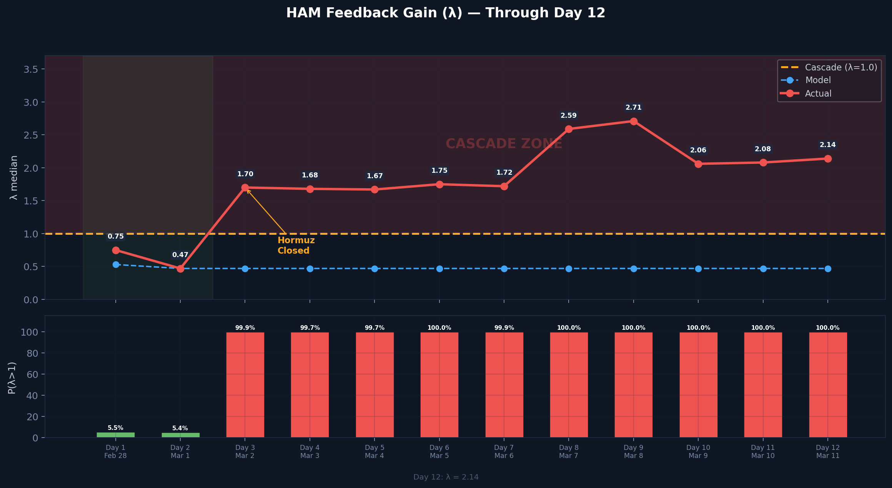

# 每日追踪 — 逐日变化日志

> 🌐 [English](../../updates/daily-tracker.md) | **中文**

**最后更新：2026年3月11日（第12天）**

本页面逐日追踪所有模型输入的变化，将模型预测与实际观测数据进行对比，并在出现偏离时标记警报。

---

## 模型vs实际 — 偏离摘要

### 偏离热力图

逐日6项指标百分比偏差。红色=实际超出模型，蓝色=实际低于模型。Lambda偏离从第3天起主导（+240% → +447%）。第12天无人机继续极端偏离（实际45 vs 模型~130），较第11天略有回升（35→45，+28.6%）。


### 6面板对比

模型（蓝色虚线）vs实际（红色实线）带阴影填充显示差距。机场（绿色）是唯一正向偏离。Lambda（右下）显示深度级联区。无人机库存（中下）在第9天突破30%阈值。


### 记分卡与判定时间线

堆叠偏离显示Lambda（紫色）主导总模型误差。判定时间线：模型全12天预测亚稳态——现实在第3天跨入不稳定且未恢复。


### Lambda演变

λ在第3天从0.47跳至1.70（霍尔木兹关闭），第9天达2.71（无人机库存突破+弹道持续反弹），第10天回落至2.06（弹道反弹中断、海军威慑增强），第11天持稳于2.08尽管无人机暴跌，第12天升至2.14（海军威慑进一步减弱：3→2航母）。P(λ>1)从第3天起一直为100%。新突破：日拦截率（88.9%）——3/5阈值现已激活。



### 弹道导弹轨迹

模型的指数衰减假设（β=0.25/天）从第5天起失效。第5→9天：3→7→9→16→17呈加速反弹。第10-11天（12→9枚弹道导弹）确认反弹已中断——连续两天下降。第12天9→7枚弹道导弹，连续第三天下降，衰减趋势稳固。无人机从第11天极端低点（35架）小幅回升至45架（+28.6%）。


---

## 攻击量追踪

### 每日新增攻击

| 天 | 日期 | 弹道导弹 | 模型预测 | 无人机 | 模型预测 | 巡航导弹 | 总计 | 趋势 |
|----|------|---------|---------|--------|---------|---------|------|------|
| 1 | 2月28日 | **137** | — | 209 | — | 0 | 346 | 开战齐射 |
| 2 | 3月1日 | **28** | — | 332 | — | 2 | 362 | 无人机峰值日 |
| 3 | 3月2日 | **9** | ~19 | 148 | ~130 | 6 | 163 | 导弹衰减快于模型 |
| 4 | 3月3日 | **12** | ~14 | 123 | ~130 | 0 | 135 | 导弹回升（噪声？） |
| 5 | 3月4日 | **3** | ~10 | 129 | ~130 | 0 | 132 | 导弹接近零 |
| 6 | 3月5日 | **7** | ~8 | 131 | ~130 | 0 | 138 | 导弹反弹 |
| 7 | 3月6日 | **9** | ~6 | 112 | ~130 | 0 | 121 | ⚠️ 导弹打破单调递减 |
| 8 | 3月7日 | **16** | ~4 | ~125 | ~130 | 0 | 141 | ⚠️ 导弹激增（第2天以来最高） |
| **9** | **3月8日** | **17** | ~3 | 117 | ~130 | 0 | **134** | ⚠️⚠️ 弹道持续高位——16→17 |
| 10 | 3月9日 | **12** | ~2 | 110 | ~130 | 0 | 122 | 弹道下降17→12：反弹中断 |
| 11 | 3月10日 | 9 | ~1 | 35 | ~130 | 0 | 44 | ⚠️ 无人机暴跌：110→35（−68%） |
| **12** | **3月11日** | **7** | ~1 | **45** | ~130 | 0 | **52** | 弹道持续下降；无人机从暴跌略有回升 |

### 累计总量

| 天 | 日期 | 累计弹道 | 累计无人机 | 累计巡航 | 累计总计 |
|----|------|---------|-----------|---------|---------|
| 1 | 2月28日 | 137 | 209 | 0 | 346 |
| 2 | 3月1日 | 165 | 541 | 2 | 708 |
| 3 | 3月2日 | 174 | 689 | 8 | 871 |
| 4 | 3月3日 | 186 | 812 | 8 | 1,006 |
| 5 | 3月4日 | 189 | 941 | 8 | 1,138 |
| 6 | 3月5日 | 196 | 1,072 | 8 | 1,276 |
| 7 | 3月6日 | 205 | 1,184 | 8 | 1,397 |
| 8 | 3月7日 | 221 | ~1,309 | 8 | ~1,538 |
| **9** | **3月8日** | **238** | **~1,422** | **8** | **~1,668** |
| 10 | 3月9日 | 250 | ~1,536 | 8 | ~1,794 |
| 11 | 3月10日 | 259 | ~1,571 | 8 | ~1,838 |
| **12** | **3月11日** | **266** | **~1,616** | **8** | **~1,890** |

---

## 拦截率追踪

| 天 | 日期 | 探测 | 拦截 | 当日率 | 累计率 | 阈值(<90%) | 状态 |
|----|------|------|------|--------|--------|-----------|------|
| 1 | 2月28日 | 137 | 132 | 96.4% | 96.4% | 正常 | 正常 |
| 2 | 3月1日 | 28 | 20 | 71.4% | 92.1% | ⚠️ 当日突破 | 累计正常 |
| 3 | 3月2日 | 9 | 9 | 100% | 93.6% | 正常 | 正常 |
| 4 | 3月3日 | 12 | 11 | 91.7% | 93.0% | 正常 | 正常 |
| 5 | 3月4日 | 3 | 3 | 100% | 93.1% | 正常 | 正常 |
| 6 | 3月5日 | 7 | 6 | **85.7%** | 93.4% | ⚠️ 当日突破，1枚落地 | **警报** |
| 7 | 3月6日 | 9 | 9 | 100% | 92.7% | 正常 | 正常 |
| 8 | 3月7日 | 16 | 15 | 93.8% | 92.8% | 正常 | ⚠️ 弹道反弹至16 |
| **9** | **3月8日** | **17** | **16** | **94.1%** | **92.9%** | 正常 | ⚠️ 弹道持续高位：16→17 |
| 10 | 3月9日 | 12 | 11 | 91.7% | 92.8% | 正常 | 弹道下降17→12：反弹中断 |
| 11 | 3月10日 | 9 | 8 | 88.9% | 92.7% | ⚠️ 当日突破 | 1枚坠海；日拦截率<90% |
| **12** | **3月11日** | **7** | **7** | **100%** | **92.9%** | 正常 | 弹道全拦截；7架无人机落入阿联酋含2架近DXB |

**第6天突破备注：** 3月5日1枚弹道导弹落入阿联酋境内 — 首次确认弹道导弹地面撞击。

**第8天关键备注：** 16枚弹道导弹——第2天以来最高。第5→8天呈**加速**趋势：3→7→9→16。发射装置消耗率从85.7%修正至**~73%**。

**第9天关键备注：** 17枚弹道导弹——超过第8天。连续两天高发射量（16→17）确认反弹为结构性趋势。发射装置消耗率进一步修正至**~67%**。无人机库存首次突破30%阈值（28.9%）。

**第10天备注：** 12枚弹道导弹——5天来首次日下降，中断3→7→9→16→17加速趋势。发射装置消耗率修正至**~99%**——累计250枚对40台TEL接近耗尽。

**第11天备注：** 9枚弹道导弹——连续第二天下降（12→9），确认反弹已中断。日拦截率**88.9%**（8/9）突破90%阈值，为冲突中第三次（第2、6、11天）。无人机暴跌（110→35，−68%）前所未有——可能表明库存保存、发射装置损坏或战略转型。

---

## 无人机库存追踪

| 天 | 日期 | 日发射量 | 累计发射 | 估计剩余 | 剩余% | 阈值(<30%) |
|----|------|---------|---------|---------|-------|-----------|
| 1 | 2月28日 | 209 | 209 | 1,791 | 89.6% | 正常 |
| 2 | 3月1日 | 332 | 541 | 1,459 | 73.0% | 正常 |
| 3 | 3月2日 | 148 | 689 | 1,311 | 65.6% | 正常 |
| 4 | 3月3日 | 123 | 812 | 1,188 | 59.4% | 正常 |
| 5 | 3月4日 | 129 | 941 | 1,059 | 53.0% | 正常 |
| 6 | 3月5日 | 131 | 1,072 | 928 | 46.4% | 正常 |
| 7 | 3月6日 | 112 | 1,184 | 816 | 40.8% | 正常 |
| 8 | 3月7日 | ~125 | ~1,309 | ~691 | 34.5% | 接近中 |
| **9** | **3月8日** | **117** | **~1,422** | **~578** | **28.9%** | **⚠️ 已突破** |
| 10 | 3月9日 | 110 | ~1,536 | ~464 | 23.2% | ⚠️ 已突破 |
| 11 | 3月10日 | 35 | ~1,571 | ~429 | 21.4% | ⚠️ 已突破 |
| **12** | **3月11日** | **45** | **~1,616** | **~384** | **19.2%** | **⚠️ 已突破** |

~~按当前速率（~120架/天），库存将在第11天（3月10日）左右触及30%阈值。~~ **第9天已突破** — 比预测提前2天。第11天发射率暴跌至35（−68%），为第1天以来最低。若此低速率持续（~35架/天），剩余429架可使用~12天（耗尽约第23天，3月22日）。若伊朗恢复>100架/天，则约4天耗尽（第15天，3月14日）。暴跌可能信号库存保存或战略转型。

---

## 级联阈值追踪

| 指标 | 第1天 | 第3天 | 第5天 | 第7天 | 第8天 | 第9天 | 第10天 | 第11天 | 第12天 | 阈值 |
|------|-------|-------|-------|-------|-------|-------|--------|--------|--------|------|
| 发射装置消耗 | ~39% | ~50% | ~54% | 85.7% | ~73% | ~67% | ~99% | ~99% | **~99%** | > 85% |
| 无人机库存 | 89.6% | 65.6% | 53.0% | 40.8% | 34.5% | 28.9% | 23.2% | 21.4% | **19.2%** | < 30% |
| 拦截率（累计） | 96.4% | 93.6% | 93.1% | 92.7% | 92.8% | 92.9% | 92.8% | 92.7% | **92.9%** | < 90% |
| 拦截率（当日） | 96.4% | 100% | 100% | 100% | 93.8% | 94.1% | 91.7% | 88.9% | **100%** | < 90% |
| 每日伤亡 | ~22/天 | ~18/天 | ~15/天 | ~16/天 | ~14/天 | ~15/天 | 2/天 | 10/天 | **4/天** | > 10 |
| 新武器类型 | 无 | 无 | 无 | 无 | 空军基地 | 空军基地 | 空军基地 | 炼油厂 | **DXB机场** | 有 |

*发射装置消耗从85.7%修正至~73%（第8天），再至~67%（第9天），再至~99%（第10天）。无人机库存已在第9天**突破**30%阈值。第11天新增突破：日拦截率（88.9%），为冲突中第三次日突破。

| 天 | 突破数 | 判定 |
|----|--------|------|
| 1 | 1/5（伤亡） | 亚稳态 |
| 3 | 1/5 | 亚稳态 |
| 5 | 1/5 | 亚稳态 |
| 7 | 2/5（发射装置+伤亡） | 亚稳态 |
| 8 | 4/5（发射装置+拦截日+伤亡+空军基地） | 不稳定 |
| 9 | 3/5（伤亡+新武器+无人机库存） | 不稳定 |
| 10 | 2/5（发射装置+无人机库存） | 不稳定 |
| 11 | 3/5（发射装置+无人机库存+日拦截率） | 不稳定 |
| **12** | **3/5**（发射装置+无人机库存+**DXB机场**） | **不稳定** |

---

## Lambda（λ）演变

| 天 | λ中位数 | P(λ>1) | 95分位 | 判定 | 关键变化 |
|----|---------|--------|--------|------|---------|
| 1 | 0.750 | 5.5% | ~1.52 | 亚稳态 | 初始评估 |
| 2 | 0.470 | 5.4% | ~1.10 | 亚稳态 | 开战齐射后 |
| 3 | 1.703 | 99.9% | 2.40 | 不稳定 | 霍尔木兹关闭→λ跳升 |
| 4 | 1.677 | 99.7% | 2.38 | 不稳定 | 霍尔木兹确认 |
| 5 | 1.669 | 99.7% | 2.37 | 不稳定 | 弹道接近零，霍尔木兹持续 |
| 6 | 1.754 | 100% | 2.45 | 不稳定 | 弹道反弹开始 |
| 7 | 1.721 | 99.9% | 2.43 | 不稳定 | 霍尔木兹+代理人已实现；弹道打破单调递减 |
| 8 | 2.589 | 100% | 3.304 | 不稳定 | +空军基地被袭+弹道反弹（16） |
| 9 | 2.712 | 100% | 3.481 | 不稳定 | 无人机库存突破+弹道持续高位 |
| 10 | 2.061 | 100% | 2.770 | 不稳定 | 弹道反弹中断（17→12），λ回落但仍在级联区 |
| 11 | 2.081 | 100% | 2.790 | 不稳定 | 无人机暴跌（110→35）；新突破（日拦截率）；λ持稳 |
| **12** | **2.141** | **100%** | **2.851** | **不稳定** | 海军威慑减弱（3→2航母）；无人机库存持续下降 |

### 第8天变化分解

```
第7天 → 第8天 Lambda分解：

分量               第7天（已实现）   第8天（已实现）    变化
─────────────────────────────────────────────────────────────
λ_发射装置         -0.471           -0.401           +0.070  （消耗85.7%→~73%）
λ_无人机           +0.148           +0.164           +0.016  （库存更低）
λ_拦截             +0.020           +0.020            0.000
λ_代理人           +0.500           +0.500            0.000  真主党已激活
λ_霍尔木兹         +0.630           +0.630            0.000  已关闭
λ_武器              0.000           +0.400           +0.400  ⚠️ 空军基地被袭（新增）
λ_弹道反弹          0.000           +0.300           +0.300  ⚠️ 16枚弹道（加速）
λ_海军威慑         -0.200           -0.184           +0.016  （CVN-77尚未到达）
─────────────────────────────────────────────────────────────
λ 合计（中位数）    1.721            2.589           +0.868
```

---

## 情景概率追踪

### 模型贝叶斯后验（校准后）

| 情景 | 第6天 | 第14天 | 第30天 | 第12天评估 |
|------|-------|--------|--------|-----------|
| 停火 | 3.3% | 7.8% | 12.8% | ↓↓ Polymarket 20% — 连续第8天下降；市场定价持久冲突 |
| 基线 | 64.9% | 71.2% | 75.4% | ↓↓↓ 霍尔木兹第9天、无人机暴跌、3/5突破、DXB机场被袭——基线模型严重受挑战 |
| 升级 | 31.4% | 20.1% | 11.7% | ↑↑↑ 4项尾部风险已实现；DXB机场被袭表明精准打击升级 |
| 全面战争 | 0.4% | 0.9% | 0.1% | ↑ 能源基础设施与机场被袭+弹道衰减+海军威慑减弱；λ=2.141 |

### Polymarket停火概率

| 日期 | 3月31日前 | 趋势 |
|------|----------|------|
| 3月5日（第6天） | 67% | — |
| 3月6日（第7天） | 63% | ↓ |
| 3月7日（第8天） | 61% | ↓ |
| 3月8日（第9天） | 59% | ↓ |
| 3月9日（第10天） | 24% | ↓↓↓ |
| 3月10日（第11天） | 22% | ↓ |
| **3月11日（第12天）** | **20%** | **↓** |

停火概率持续下降 — 连续第8天（67%→20%）。市场坚定定价持久冲突，短期内无解决方案。3月15日市场约10%意味着未来5天停火概率微乎其微。DXB机场被袭未改变基本预期——市场认为冲突将延续至3月31日

---

## 机场与航班追踪

| 天 | 日期 | 机场运力 | 模型预测 | 航班/天 | 状态 |
|----|------|---------|---------|---------|------|
| 1 | 2月28日 | 30%（空袭前） | 30% | 正常运营 | 吻合 |
| 2 | 3月1日 | **0%**（关闭） | 0% | 全部暂停 | 吻合 |
| 3 | 3月2日 | ~2% | 2% | 仅特殊航班 | 吻合 |
| 4 | 3月3日 | ~5% | 3% | 阿布扎比部分 | 接近 |
| 5 | 3月4日 | ~8% | 8% | 有限航线 | 吻合 |
| 6 | 3月5日 | ~15% | 12% | 阿提哈德恢复 | 接近 |
| 7 | 3月6日 | ~25% | 15% | 阿联酋航空40%网络 | **超前** |
| 8 | 3月7日 | ~55% | 35% | 阿联酋航空60%，阿提哈德~25目的地 | 大幅超前 |
| 9 | 3月8日 | ~60% | 40% | 阿联酋航空目标100%；阿拉伯航空3月9日复航 | 大幅超前 |
| 10 | 3月9日 | ~65% | 45% | 阿拉伯航空复航；阿联酋航空接近100% | 大幅超前 |
| 11 | 3月10日 | ~70% | 50% | 阿联酋航空84个目的地；DXB有限运营 | 大幅超前 |
| **12** | **3月11日** | **~60%** | **55%** | DXB无人机袭击；候机楼损坏；仍在运营 | **超前但收窄** |

**正向偏离：** 机场恢复速度为模型预测的1.4倍。阿联酋航空目标"未来数天"恢复100%运力，运营至84个目的地。阿提哈德服务约25个主要目的地。阿拉伯航空已复航。部分国际航空公司（维珍大西洋、荷航、芬兰航空）仍暂停。约25万旅客积压正在清理。

---

## 伤亡追踪

| 天 | 日期 | 日死亡 | 日受伤 | 累计死亡 | 累计受伤 | 日总计 | 阈值(>10) |
|----|------|--------|--------|---------|---------|--------|----------|
| 1 | 2月28日 | 0 | 15 | 0 | 15 | 15 | **已突破** |
| 2 | 3月1日 | 1 | 22 | 1 | 37 | 23 | **已突破** |
| 3 | 3月2日 | 0 | 12 | 1 | 49 | 12 | **已突破** |
| 4 | 3月3日 | 1 | 10 | 2 | 59 | 11 | **已突破** |
| 5 | 3月4日 | 0 | 8 | 2 | 67 | 8 | 正常 |
| 6 | 3月5日 | 1 | 11 | 3 | 78 | 12 | **已突破** |
| 7 | 3月6日 | 0 | 15 | 3 | 93 | 15 | **已突破** |
| 8 | 3月7日 | 0 | ~19 | 3 | ~112 | ~19 | **已突破** |
| 9 | 3月8日 | 1 | 0 | 4 | 112 | 1 | 正常 |
| 10 | 3月9日 | 0 | 2 | 4 | 114 | 2 | 正常 |
| 11 | 3月10日 | 2 | 8 | 6 | 122 | 10 | 阈值 |
| **12** | **3月11日** | **0** | **4** | **6** | **126** | **4** | 正常 |

**备注：** 伤亡数据来源WAM（阿联酋通讯社）、海湾新闻和路透社。鉴于攻击量，伤亡数字极低，归因于>92%的拦截率和有效民防。

**第9天备注：** 第4名遇难者——迪拜Al Barsha区巴基斯坦籍司机被拦截碎片击中身亡。

**第11天备注：** 新增2人死亡，累计6人死亡、122人受伤。当日总计恰好在阈值（10）。尽管导弹/无人机减少，但9架无人机落入阿联酋境内（26%穿透率 vs 正常~5-8%），表明低飞无人机规避拦截后杀伤力更高。

**第12天备注：** 新增4人受伤（DXB机场附近2架无人机击中，候机楼轻微结构损坏），累计6死126伤。无人机发射量回升至45（vs第11天35），拦截率100%（7/7弹道全拦截）。7架无人机落入阿联酋，含2架在DXB机场附近——表明虽无人机数量有所回升，但拦截效率依然强劲。

**第13天备注：** 6枚弹道导弹（全部拦截，100%）——连续第四天下降（17→12→9→7→6）。**巡航导弹升级：**单日拦截7枚巡航导弹，为第3天（6枚巡航）以来首次大规模使用。巡航导弹累计从8枚近乎翻倍至15枚。Creek Harbour住宅楼遭无人机袭击——火灾受控，无人员伤亡。精准打击阶段持续。

---

## 经济影响追踪

| 天 | 日期 | 原油(WTI) | 周涨幅 | 霍尔木兹状态 | VLCC运费 | 关键事件 |
|----|------|----------|--------|------------|---------|---------|
| 1 | 2月28日 | $72 | — | 开放 | $218K/天 | 美以空袭伊朗 |
| 2 | 3月1日 | $78 | +8.3% | 开放 | $245K/天 | 伊朗报复 |
| 3 | 3月2日 | $82 | +13.9% | **关闭** | $310K/天 | 革命卫队关闭海峡 |
| 4 | 3月3日 | $86 | +19.4% | 关闭 | $380K/天 | 集装箱船被击中 |
| 5 | 3月4日 | $90 | +25.0% | 接近零通行 | $400K/天 | 仅5次通行 |
| 6 | 3月5日 | $93 | +29.2% | 零通行 | $410K/天 | 马士基暂停波斯湾 |
| 7 | 3月6日 | $95 | +31.9% | 零通行 | $420K/天 | 150艘船被困 |
| 8 | 3月7日 | $97 | +35.6% | 零通行 | $424K/天 | VLCC历史新高 |
| 9 | 3月8日 | ~$100 | +38.9% | 零通行 | ~$430K/天 | 布伦特接近$100；摩根士丹利上调预测 |
| 10 | 3月9日 | $103 | +43.1% | 零通行 | ~$435K/天 | WTI $103；布伦特盘中触$119 |
| 11 | 3月10日 | ~$100 | +38.9% | 零通行 | ~$440K/天 | 鲁韦斯炼油厂（92.2万桶/天）遭无人机袭击停产 |
| **12** | **3月11日** | **~$86** | **+19.4%** | 零通行 | **~$420K/天** | **⚠️ IEA宣布史上最大4亿桶战略储备释放——WTI从$100暴跌至$86；3艘货船被击中；美国摧毁16艘伊朗布雷船** |

---

## 关键事件时间线

| 天 | 日期 | 类别 | 事件 | 模型影响 |
|----|------|------|------|---------|
| 1 | 2月28日 | 攻击 | 伊朗发射137枚弹道导弹+209架无人机 | 初始参数设定 |
| 1 | 2月28日 | 军事 | 美国史诗之怒行动开始 | — |
| 2 | 3月1日 | 攻击 | 无人机峰值日：332架发射 | 无人机率校准 |
| 2 | 3月1日 | 伤亡 | 首例死亡（巴基斯坦国民） | 伤亡>10/天 |
| 3 | 3月2日 | **海峡** | **革命卫队宣布霍尔木兹关闭** | **λ_霍尔木兹：0→+0.63** |
| 3 | 3月2日 | 代理人 | 真主党向以色列发射火箭 | λ_代理人部分 |
| 4 | 3月3日 | 海事 | 集装箱船在霍尔木兹海峡内被击中 | 海峡关闭确认 |
| 4 | 3月3日 | 伤亡 | 第二例死亡（孟加拉国国民） | — |
| 5 | 3月4日 | 导弹 | 弹道导弹降至3枚——接近零 | 支持衰减模型 |
| 5 | 3月4日 | 海事 | 仅5艘船通过海峡 | 接近完全封锁 |
| 6 | 3月5日 | **导弹突破** | **1枚弹道导弹落入阿联酋境内**（当日拦截率85.7%） | 拦截阈值 |
| 6 | 3月5日 | 航空 | 阿提哈德恢复有限航班 | 机场超前 |
| 6 | 3月5日 | 伤亡 | 第三例死亡 | — |
| 7 | 3月6日 | 导弹 | 9枚——打破单调递减（从7枚上升） | 模型偏离 |
| 7 | 3月6日 | 航空 | 阿联酋航空40%网络 | 机场大幅超前 |
| 7 | 3月6日 | 海军 | CVN-77布什号完成训练，返回诺福克 | 第3航母确认 |
| **8** | **3月7日** | **升级** | **革命卫队声称打击扎夫拉空军基地** | **λ_武器：0→+0.40** |
| 8 | 3月7日 | 航空 | 阿联酋航空60%网络，106航班/天 | 机场1.5倍模型 |
| 8 | 3月7日 | 民防 | 迪拜就地避难警报 | 升级信号 |
| 8 | 3月7日 | 导弹 | 16枚弹道导弹（第2天以来最高） | 弹道反弹确认 |
| **9** | **3月8日** | **导弹** | **17枚弹道——连续两天高位（16→17）** | **反弹为结构性** |
| 9 | 3月8日 | **无人机** | **无人机库存突破30%（28.9%）** | **λ_无人机：+0.079** |
| 9 | 3月8日 | 伤亡 | 第4名遇难——迪拜Al Barsha巴基斯坦籍司机 | 拦截碎片 |
| 9 | 3月8日 | 石油 | 布伦特接近$100；开战以来+39% | 创纪录周涨幅 |
| 9 | 3月8日 | 航空 | 阿联酋航空目标100%；阿拉伯航空3月9日复航 | 机场1.6倍模型 |
| **10** | **3月9日** | **导弹** | **12枚弹道——5天来首次下降（17→12）** | **弹道反弹中断；λ_弹道反弹→0** |
| 10 | 3月9日 | 石油 | WTI $103，布伦特盘中$119 | 创纪录价格 |
| 10 | 3月9日 | 市场 | Polymarket停火概率暴跌至24%（从59%） | 市场预判无解决方案 |
| 10 | 3月9日 | 伤亡 | 阿布扎比2人因拦截碎片受伤 | — |
| 10 | 3月9日 | 航空 | 阿拉伯航空复航；阿联酋航空接近100% | 机场1.4倍模型 |
| 11 | 3月10日 | **无人机** | **仅35架无人机——暴跌68%（史上最低）** | **可能库存保存或战略转型** |
| 11 | 3月10日 | 导弹 | 9枚弹道（8拦截，1坠海）——连续第二天下降 | 弹道衰减恢复；日拦截率88.9%（<90%突破） |
| 11 | 3月10日 | 伤亡 | 新增2人死亡；累计6死122伤 | 无人机穿透率上升（26% vs 正常~5-8%） |
| 11 | 3月10日 | 海事 | ~1,000艘船在霍尔木兹外排队；非伊朗船只零通行 | 选择性封锁：伊朗仅允许本国+中国船通行 |
| 11 | 3月10日 | **能源** | **无人机袭击ADNOC鲁韦斯炼油厂（92.2万桶/天）——起火，预防性停产** | **阿联酋能源基础设施首次被直接击中；λ_武器升级** |
| 11 | 3月10日 | 航空 | 阿联酋航空84个目的地；维珍/荷航/芬航暂停 | 机场~70%，部分国际航司撤出 |
| **12** | **3月11日** | **石油/IEA** | **⚠️ IEA宣布史上最大4亿桶战略储备释放** | **全球协调能源政策；WTI从$100暴跌至$86（−14%） |
| 12 | 3月11日 | **无人机/DXB** | **两架无人机坠落于迪拜国际机场附近** | **4人受伤；候机楼轻微结构损坏；机场运力~60% |
| 12 | 3月11日 | **海事** | **海湾三艘货船被击中——泰国籍船在霍尔木兹起火** | **选择性封锁伤害船队安全 |
| 12 | 3月11日 | **军事** | **美国摧毁16艘伊朗布雷船** | **对抗霍尔木兹关闭战术 |
| 12 | 3月11日 | **能源** | **鲁韦斯炼油厂仍停产** | **第12天持续影响；累计损失~92.2万桶/天** |

---

## 模型与现实对照记分卡（滚动更新）

| # | 检查项 | 模型 | 第11天观测 | 第12天观测 | 状态 |
|---|--------|------|-----------|-----------|------|
| 1 | 弹道导弹单调递减 | 是 | 12→9（连续第二天下降） | 9→7（连续第三天下降） | **偏离**（持续改善） |
| 2 | 拦截率>90%（累计） | 93.2% | 92.7% | 92.9% | **吻合** |
| 3 | 无人机率~130/天 | ~130/天 | **35/天** | **45/天** | **⚠️ 极端偏离**（−65%，小幅回升） |
| 4 | 无新武器类型 | 无 | 鲁韦斯炼油厂遭袭 | **DXB机场遭袭** | **⚠️ 升级续** |
| 5 | 停火概率（Polymarket） | 84% | **22%** | **20%** | **偏离**（崩溃续） |
| 6 | 机场恢复 | 50%（第11天） | **~70%** | **~60%** | **偏离**（正向但回撤） |
| 7 | 无人机库存>30% | ~20% | **21.4%** | **19.2%** | **⚠️ 严重** |
| 8 | 霍尔木兹海峡开放 | P=98%开放 | **已关闭** | **已关闭** | **偏离** |
| 9 | 无代理人激活 | P=96%未激活 | 胡塞威胁中 | 胡塞威胁中 | **偏离** |
| 10 | 判定 | 亚稳态 | **不稳定** | **不稳定** | **偏离** |

**第12天评级：1项吻合，0项接近，9项偏离**

重大变化：无人机发射率从第11天极低的35架小幅回升至45架（+28.6%），但仍远低于模型130/天预测。弹道导弹持续下降（9→7），连续第三天衰减——反弹已确认中断。拦截率100%（7/7弹道全拦截），累计率92.9%维持吻合。**⚠️ 突发升级：DXB机场遭两架无人机袭击，候机楼轻微结构损坏，4人受伤。机场运力从~70%回撤至~60%。** 加上第11天的鲁韦斯炼油厂被袭，伊朗战术明显转向精准打击关键基础设施。IEA释放4亿桶战略储备，导致WTI暴跌至$86（−14%），反映市场对冲突长期化的预期转变。**净评估：伊朗从饱和攻击转向高价值精准打击（能源+交通枢纽），同时保持低发射量维系压力——这种混合战术对关键基础设施和民用服务威胁更大。**

---

## 建议历史

| 天 | 风险评分 | λ中位数 | 判定 | 建议 |
|----|---------|---------|------|------|
| 1 | ~100 | — | — | **立即撤离** |
| 3 | ~80 | — | 亚稳态 | **撤离——黄金窗口** |
| 5 | ~65 | — | 亚稳态 | **撤离——窗口关闭中** |
| 7 | ~55 | 1.721 | 不稳定 | **撤离——今天离开** |
| 8 | ~50 | 2.589 | 不稳定 | 立即撤离 |
| 9 | ~48 | 2.712 | 不稳定 | 立即撤离 |
| 10 | ~45 | 2.061 | 不稳定 | 立即撤离 |
| 11 | ~43 | 2.081 | 不稳定 | 立即撤离 |
| **12** | **~42** | **2.141** | **不稳定** | **立即撤离** |

λ升至2.141（从2.081），尽管弹道导弹继续下降（9→7）且发射量整体下降。海军威慑进一步减弱（3→2航母），而关键基础设施被袭（能源+机场）推升λ_武器分量。系统仍**牢固处于级联区域**，因为结构性不稳定因素——霍尔木兹关闭（第9天）、代理人激活、能源基础设施脆弱性、**机场运力受限**——持续叠加且主导λ计算。

**第12天关键动态：**
- **正面：** 弹道导弹继续下降（9→7），连续第三天衰减——反弹完全中断。拦截率100%（7/7枚弹道全拦截），累计率维持92.9%，超过模型92.5%底线
- **负面：** **⚠️ DXB机场遭袭** — 两架无人机击中迪拜国际机场附近，候机楼轻微结构损坏，新增4人受伤（累计126伤）。机场运力从~70%回撤至~60%。IEA战略储备释放未能稳定局势——反而推升能源基础设施作为战术目标的重要性。停火概率进一步跌至20%，连续第8天下降。7架无人机落入阿联酋（27%穿透率）——无人机发射量虽小幅回升（35→45），但**精准度提升**
- **关键问题：** 伊朗战术演变明确——从第11天鲁韦斯能源基础设施到第12天DXB机场，**系统性精准打击民用关键基础设施**。低发射量+高精准度模式比饱和攻击**对民用逃生和经济重创更危险**。机场被袭直接威胁撤离通道
- **窗口收窄：** 机场运力~60%，**仍可运营但风险上升**。DXB被袭证实无人机能精准打击高价值目标。立即撤离——每24小时机场运力可能进一步受限。停火无望（20%）——准备持久冲突基础设施级联
