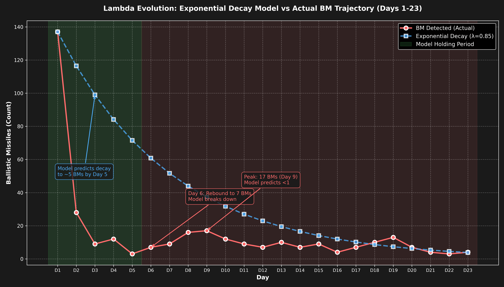

# 每日追踪 — 逐日变化日志

> 🌐 [English](../../updates/daily-tracker.md) | **中文**

**最后更新：2026年3月22日（第23天）**

本页面逐日追踪所有模型输入的变化，将模型预测与实际观测数据进行对比，并在出现偏离时标记警报。

---

## 模型vs实际 — 偏离摘要

### 偏离热力图

逐日6项指标百分比偏差（22天）。红色=实际超出模型，蓝色=实际低于模型。Lambda偏离从第3天起主导（+240% → +360%）。无人机从第11天起极端偏离（实际6-45 vs 模型~130）。弹道导弹在3-13范围内震荡（第12-22天），远超模型接近零的预测。第22天：3枚弹道+8架无人机（11枚总计，历史第二低）；美国轰炸纳坦兹核设施；伊朗向日本提议霍尔木兹通道。


### 6面板对比

模型（蓝色）vs实际（红色）带填充显示差距。机场（绿色）在第17天DXB暴跌前为正向偏离。Lambda（右下）显示深度级联区。无人机库存（中下）在第9天突破30%阈值。第22天数据已含。


### 记分卡与判定时间线

堆叠偏离显示Lambda（紫色）主导总模型误差。判定时间线：模型全22天预测亚稳态——现实在第3天跨入不稳定且未恢复。


### Lambda演变

λ在第3天从0.47跳至1.70（霍尔木兹关闭），第9天达2.71峰值（无人机库存突破+弹道反弹），随后回落并从第10天起稳定在~2.1平台。第12-18天λ在2.14-2.16范围内保持稳定。第19天λ飙升至2.596（弹道反弹信号重新激活，7→10→13）。第20-22天：λ回落并持平于~2.16（弹道降至7→4→3）。P(λ>1)从第3天起持续100%。第22天λ=2.164——基本持平。系统牢固锁定在稳定级联区域。美国轰炸纳坦兹核设施；伊朗向日本提议霍尔木兹通道；特朗普考虑"结束战争"。



### 弹道导弹轨迹

模型的指数衰减假设（β=0.25/天）从第5天起失效。第5→9天：3→7→9→16→17呈加速反弹。反弹后（第10-22天）：弹道导弹在3-13范围内震荡，呈噪声模式（12→9→7→10→7→9→4→7→10→13→7→4→3）。第22天：3枚弹道——冲突以来最低弹道数量。无人机降至8架（从第21天26架）。11枚总投射物，为第16天（10枚）之后的历史第二低。伊朗大幅减少对UAE攻击（第16-22天均~20/天 vs 第1-10天均~170/天）。


---

## 攻击量追踪

### 每日新增攻击

| 天 | 日期 | 弹道导弹 | 模型预测 | 无人机 | 模型预测 | 巡航导弹 | 总计 | 趋势 |
|----|------|---------|---------|--------|---------|---------|------|------|
| 1 | 2月28日 | **137** | — | 209 | — | 0 | 346 | 开战齐射 |
| 2 | 3月1日 | **28** | — | 332 | — | 2 | 362 | 无人机峰值日 |
| 3 | 3月2日 | **9** | ~19 | 148 | ~130 | 6 | 163 | 导弹衰减快于模型 |
| 4 | 3月3日 | **12** | ~14 | 123 | ~130 | 0 | 135 | 导弹回升（噪声？） |
| 5 | 3月4日 | **3** | ~10 | 129 | ~130 | 0 | 132 | 导弹接近零 |
| 6 | 3月5日 | **7** | ~8 | 131 | ~130 | 0 | 138 | 导弹反弹 |
| 7 | 3月6日 | **9** | ~6 | 112 | ~130 | 0 | 121 | ⚠️ 导弹打破单调递减 |
| 8 | 3月7日 | **16** | ~4 | ~125 | ~130 | 0 | 141 | ⚠️ 导弹激增（第2天以来最高） |
| **9** | **3月8日** | **17** | ~3 | 117 | ~130 | 0 | **134** | ⚠️⚠️ 弹道持续高位——16→17 |
| 10 | 3月9日 | **12** | ~2 | 110 | ~130 | 0 | 122 | 弹道下降17→12：反弹中断 |
| 11 | 3月10日 | 9 | ~1 | 35 | ~130 | 0 | 44 | ⚠️ 无人机暴跌：110→35（−68%） |
| **12** | **3月11日** | **6** | ~1 | **39** | ~130 | **7** | **52** | ⚠️ 第3天以来首次巡航导弹；弹道连续第三天下降 |
| 13 | 3月12日 | 10 | ~1 | 26 | ~130 | 0 | 36 | 弹道回升6→10（+67%）；无人机暴跌 |
| **14** | **3月13日** | **7** | ~1 | **~27** | ~130 | 0 | **~34** | 弹道恢复下降10→7；无人机稳定在历史低位；**新历史最低总量** |
| 15 | 3月14日 | **9** | ~1 | 33 | ~130 | 0 | 42 | 9枚弹道+33架无人机(@modgovae)；富查伊拉碎片火灾；攻击扩至阿曼/沙特 |
| 16 | 3月15日 | 4 | ~0 | 6 | ~130 | 0 | 10 | @modgovae：4枚弹道（全拦截）+6架无人机（5拦截1坠UAE）；历史最低量 |
| 17 | 3月16日 | 7 | ~0 | 25 | ~130 | 0 | 32 | 7枚弹道（6拦截1击中民用车）；25架无人机（21拦截4坠UAE含DXB油罐+Fujairah）；1死5伤 |
| **18** | **3月17日** | **10** | ~0 | **45** | ~130 | 0 | **55** | @modgovae：10弹道+45无人机；**GCAA关闭领空后恢复；全天平均~35%**；富查伊拉港被击中；英国空中巡逻开始 |
| **19** | **3月18日** | **13** | ~0 | **27** | ~130 | 0 | **40** | @modgovae：13弹道全拦截+27无人机；布伦特$108.78（冲突新高）；VLCC $445K/天记录 |
| **20** | **3月19日** | **7** | ~0 | **15** | ~130 | 0 | **22** | **冲突以来UAE最低量（22枚）**；伊朗击中卡塔尔拉斯拉凡LNG（17%产能）；布伦特$113（盘中$119） |
| **21** | **3月20日** | **4** | ~0 | **26** | ~130 | 0 | **30** | 开斋节；弹道导弹平历史最低（4枚）；无人机回升15→26；布伦特回落至$107；Polymarket 8%；外国航司仍禁飞DXB |
| **22** | **3月21日** | **3** | ~0 | **8** | ~130 | 0 | **11** | **冲突以来历史最低（11枚）**；弹道再降至3枚；无人机暴跌8架；美国轰炸纳坦兹核设施；伊朗向日本建议霍尔木兹通道；迪戈加西亚遭未遂攻击；特朗普考虑"风险管理" |
| **23** | **3月22日** | **4** | ~0 | **25** | ~130 | 0 | **29** | 从第22天低位反弹（11→29）；特朗普48小时霍尔木兹最后通牒；伊朗威胁全面封锁 |

### 累计总量

| 天 | 日期 | 累计弹道 | 累计无人机 | 累计巡航 | 累计总计 |
|----|------|---------|-----------|---------|---------|
| 1 | 2月28日 | 137 | 209 | 0 | 346 |
| 2 | 3月1日 | 165 | 541 | 2 | 708 |
| 3 | 3月2日 | 174 | 689 | 8 | 871 |
| 4 | 3月3日 | 186 | 812 | 8 | 1,006 |
| 5 | 3月4日 | 189 | 941 | 8 | 1,138 |
| 6 | 3月5日 | 196 | 1,072 | 8 | 1,276 |
| 7 | 3月6日 | 205 | 1,184 | 8 | 1,397 |
| 8 | 3月7日 | 221 | ~1,309 | 8 | ~1,538 |
| **9** | **3月8日** | **238** | **~1,422** | **8** | **~1,668** |
| 10 | 3月9日 | 250 | ~1,536 | 8 | ~1,794 |
| 11 | 3月10日 | 259 | ~1,571 | 8 | ~1,838 |
| **12** | **3月11日** | **265** | **~1,610** | **15** | **~1,890** |
| 13 | 3月12日 | 275 | ~1,636 | 15 | ~1,926 |
| **14** | **3月13日** | **282** | **~1,663** | **15** | **~1,960** |
| 15 | 3月14日 | 294 | ~1,696 | 15 | ~2,005 |
| 16 | 3月15日 | 298 | ~1,702 | 15 | ~2,015 |
| 17 | 3月16日 | ~305 | ~1,727 | 15 | ~2,047 |
| **18** | **3月17日** | **314** | **~1,672** | **15** | **~2,001** |
| **19** | **3月18日** | **327** | **~1,699** | **15** | **~2,041** |
| **20** | **3月19日** | **334** | **~1,714** | **15** | **~2,063** |
| **21** | **3月20日** | **338** | **~1,740** | **15** | **~2,093** |
| **22** | **3月21日** | **341** | **~1,748** | **15** | **~2,104** |
| **23** | **3月22日** | **345** | **1,773** | **15** | **2,133** |

---

## 拦截率追踪

| 天 | 日期 | 探测 | 拦截 | 当日率 | 累计率 | 阈值(<90%) | 状态 |
|----|------|------|------|--------|--------|-----------|------|
| 1 | 2月28日 | 137 | 132 | 96.4% | 96.4% | 正常 | 正常 |
| 2 | 3月1日 | 28 | 20 | 71.4% | 92.1% | ⚠️ 当日突破 | 累计正常 |
| 3 | 3月2日 | 9 | 9 | 100% | 93.6% | 正常 | 正常 |
| 4 | 3月3日 | 12 | 11 | 91.7% | 93.0% | 正常 | 正常 |
| 5 | 3月4日 | 3 | 3 | 100% | 93.1% | 正常 | 正常 |
| 6 | 3月5日 | 7 | 6 | **85.7%** | 93.4% | ⚠️ 当日突破，1枚落地 | **警报** |
| 7 | 3月6日 | 9 | 9 | 100% | 92.7% | 正常 | 正常 |
| 8 | 3月7日 | 16 | 15 | 93.8% | 92.8% | 正常 | ⚠️ 弹道反弹至16 |
| **9** | **3月8日** | **17** | **16** | **94.1%** | **92.9%** | 正常 | ⚠️ 弹道持续高位：16→17 |
| 10 | 3月9日 | 12 | 11 | 91.7% | 92.8% | 正常 | 弹道下降17→12：反弹中断 |
| 11 | 3月10日 | 9 | 8 | 88.9% | 92.7% | ⚠️ 当日突破 | 1枚坠海；日拦截率<90% |
| **12** | **3月11日** | **6** | **6** | **100%** | **92.8%** | 正常 | 弹道全拦截；7枚巡航全拦截；无人机落入阿联酋含2架近DXB |
| 13 | 3月12日 | 10 | 10 | 100% | 93.1% | 正常 | @modgovae确认10枚弹道全拦截；无巡航；26架无人机 |
| **14** | **3月13日** | **7** | **~7** | **~100%** | **93.3%** | 正常 | 弹道恢复下降10→7；残骸击中DIFC大楼；~27架无人机应对 |
| 15 | 3月14日 | 9 | 8 | 88.9% | 93.1% | ⚠️ 当日突破 | 1枚坠海；富查伊拉碎片火灾；约旦公民1人受伤 |
| 16 | 3月15日 | 4 | 4 | 100% | 93.2% | 正常 | @modgovae确认4枚弹道全拦截；6架无人机中5拦截1坠UAE；历史最低量 |
| 17 | 3月16日 | 7 | 6 | 85.7% | 93.0% | ⚠️ 当日突破 | 1枚击中阿布扎比民用车（第7名死亡）；4架无人机坠UAE含DXB油罐+Fujairah |
| **18** | **3月17日** | **10** | **10** | **100%** | **~92.7%** | 正常 | @modgovae：10枚全拦截；领空关闭后恢复 |
| **19** | **3月18日** | **13** | **13** | **100%** | **~92.7%** | 正常 | @modgovae：13枚全拦截；累计327枚；拦截率稳定 |
| **20** | **3月19日** | **7** | **7** | **100%** | **~92.8%** | 正常 | @modgovae：7枚全拦截；累计334枚；连续第3天100%日拦截率 |
| **21** | **3月20日** | **4** | **4** | **100%** | **~92.9%** | 正常 | @modgovae：4枚全拦截；累计338枚；连续第4天100%日拦截率 |
| **22** | **3月21日** | **3** | **3** | **100%** | **~93.0%** | 正常 | @modgovae：3枚全拦截；累计341枚；连续第5天100%日拦截率 |
| **23** | **3月22日** | **4** | **4** | **100%** | **~93.0%** | 正常 | 4枚全拦截；累计345枚；连续第6天100%日拦截率 |

**第6天突破备注：** 3月5日1枚弹道导弹落入阿联酋境内 — 首次确认弹道导弹地面撞击。

**第8天关键备注：** 16枚弹道导弹——第2天以来最高。第5→8天呈**加速**趋势：3→7→9→16。发射装置消耗率从85.7%修正至**~73%**。

**第9天关键备注：** 17枚弹道导弹——超过第8天。连续两天高发射量（16→17）确认反弹为结构性趋势。发射装置消耗率进一步修正至**~67%**。无人机库存首次突破30%阈值（28.9%）。

**第10天备注：** 12枚弹道导弹——5天来首次日下降，中断3→7→9→16→17加速趋势。发射装置消耗率修正至**~99%**——累计250枚对40台TEL接近耗尽。

**第11天备注：** 9枚弹道导弹——连续第二天下降（12→9），确认反弹已中断。日拦截率**88.9%**（8/9）突破90%阈值，为冲突中第三次（第2、6、11天）。无人机暴跌（110→35，−68%）前所未有——可能表明库存保存、发射装置损坏或战略转型。

---

## 无人机库存追踪

| 天 | 日期 | 日发射量 | 累计发射 | 估计剩余 | 剩余% | 阈值(<30%) |
|----|------|---------|---------|---------|-------|-----------|
| 1 | 2月28日 | 209 | 209 | 1,791 | 89.6% | 正常 |
| 2 | 3月1日 | 332 | 541 | 1,459 | 73.0% | 正常 |
| 3 | 3月2日 | 148 | 689 | 1,311 | 65.6% | 正常 |
| 4 | 3月3日 | 123 | 812 | 1,188 | 59.4% | 正常 |
| 5 | 3月4日 | 129 | 941 | 1,059 | 53.0% | 正常 |
| 6 | 3月5日 | 131 | 1,072 | 928 | 46.4% | 正常 |
| 7 | 3月6日 | 112 | 1,184 | 816 | 40.8% | 正常 |
| 8 | 3月7日 | ~125 | ~1,309 | ~691 | 34.5% | 接近中 |
| **9** | **3月8日** | **117** | **~1,422** | **~578** | **28.9%** | **⚠️ 已突破** |
| 10 | 3月9日 | 110 | ~1,536 | ~464 | 23.2% | ⚠️ 已突破 |
| 11 | 3月10日 | 35 | ~1,571 | ~429 | 21.4% | ⚠️ 已突破 |
| **12** | **3月11日** | **39** | **~1,610** | **~390** | **19.5%** | **⚠️ 已突破** |
| 13 | 3月12日 | 26 | ~1,636 | ~364 | 18.2% | ⚠️ 已突破 |
| **14** | **3月13日** | **~27** | **~1,663** | **~337** | **16.9%** | **⚠️ 已突破** |
| 15 | 3月14日 | 33 | ~1,696 | ~304 | 15.2% | ⚠️ 已突破 |
| 16 | 3月15日 | 6 | ~1,702 | ~298 | 14.9% | ⚠️ 已突破 |
| 17 | 3月16日 | 25 | ~1,727 | ~273 | 13.6% | ⚠️ 已突破 |
| **18** | **3月17日** | **45** | **1,672†** | **~328** | **16.4%** | **⚠️ 已突破** |
| **19** | **3月18日** | **27** | **~1,699** | **~301** | **15.1%** | **⚠️ 已突破** |
| **20** | **3月19日** | **15** | **~1,714** | **~286** | **14.3%** | **⚠️ 已突破** |
| **21** | **3月20日** | **26** | **~1,740** | **~260** | **13.0%** | **⚠️ 已突破** |
| **22** | **3月21日** | **8** | **~1,748** | **~252** | **12.6%** | **⚠️ 已突破** |
| **23** | **3月22日** | **25** | **1,773** | **~227** | **11.4%** | **⚠️ 已突破** |

†**@modgovae修正：** 官方累计至第18天为1,672架无人机（@modgovae核实数据），低于追踪器估计（第17天~1,727）。剩余库存修正上调至~328（16.4%）。

第11-23天持续低量模式（6-45架/天）。按@modgovae核实的累计1,773架/2,000架估算，剩余~227架（11.4%）。按第23天速率（25架/天）可持续约9天，按中等速率（15-26架/天）约8-15天。模式确认伊朗正积极保存无人机库存。第21-23天：26→8→25架，显示战术灵活性和特朗普最后通牒驱动的暂时提速。

---

## 级联阈值追踪

| 指标 | 第1天 | 第3天 | 第5天 | 第7天 | 第8天 | 第9天 | 第10天 | 第11天 | 第12天 | 第13天 | 第14天 | 第15天 | 第16天 | 第17天 | 第18天 | 第19天 | 第20天 | 第21天 | 第22天 | 第23天 | 阈值 |
|------|-------|-------|-------|-------|-------|-------|--------|--------|--------|--------|--------|--------|--------|--------|--------|--------|--------|--------|--------|------|
| 发射装置消耗 | ~39% | ~50% | ~54% | 85.7% | ~73% | ~67% | ~99% | ~99% | ~99% | ~99% | ~99% | ~99% | ~99% | ~99% | ~99% | ~99% | ~99% | **~99%** | **~99%** | **~99%** | > 85% |
| 无人机库存 | 89.6% | 65.6% | 53.0% | 40.8% | 34.5% | 28.9% | 23.2% | 21.4% | 19.5% | 18.2% | 16.9% | 15.2% | 14.9% | 13.6% | 16.4%† | 15.1% | 14.3% | **13.0%** | **12.6%** | **11.4%** | < 30% |
| 拦截率（累计） | 96.4% | 93.6% | 93.1% | 92.7% | 92.8% | 92.9% | 92.8% | 92.7% | 92.8% | 93.1% | 93.3% | 93.1% | 93.2% | 93.0% | ~92.7% | ~92.7% | ~92.8% | **~92.9%** | **~93.0%** | **~93.0%** | < 90% |
| 拦截率（当日） | 96.4% | 100% | 100% | 100% | 93.8% | 94.1% | 91.7% | 88.9% | 100% | 100% | ~100% | 88.9% | 100% | 85.7% | 100% | 100% | 100% | **100%** | **100%** | **100%** | < 90% |
| 每日伤亡 | ~22/天 | ~18/天 | ~15/天 | ~16/天 | ~14/天 | ~15/天 | 2/天 | 10/天 | 4/天 | 0/天 | 0/天 | 0/10 | 0/0 | 1/5 | 12 | ~5 | 0 | **3** | **0** | **~2** | > 10 |
| 新武器类型 | 无 | 无 | 无 | 无 | 空军基地 | 空军基地 | 空军基地 | 炼油厂 | DXB机场 | 无 | 无 | 无 | 无 | DXB油罐/民用车 | 无 | 无 | 无 | **无** | **无** | **无** | 有 |

*发射装置消耗从85.7%修正至~73%（第8天），再至~67%（第9天），再至~99%（第10天）。无人机库存已在第9天**突破**30%阈值。第11天新增突破：日拦截率（88.9%），为冲突中第三次日突破。

| 天 | 突破数 | 判定 |
|----|--------|------|
| 1 | 1/5（伤亡） | 亚稳态 |
| 3 | 1/5 | 亚稳态 |
| 5 | 1/5 | 亚稳态 |
| 7 | 2/5（发射装置+伤亡） | 亚稳态 |
| 8 | 4/5（发射装置+拦截日+伤亡+空军基地） | 不稳定 |
| 9 | 3/5（伤亡+新武器+无人机库存） | 不稳定 |
| 10 | 2/5（发射装置+无人机库存） | 不稳定 |
| 11 | 3/5（发射装置+无人机库存+日拦截率） | 不稳定 |
| 12 | 3/5（发射装置+无人机库存+DXB机场） | 不稳定 |
| 13 | 2/5（发射装置+无人机库存） | 不稳定 |
| 14 | 2/5（发射装置+无人机库存） | 不稳定 |
| 15 | 3/5（发射装置+无人机库存+日拦截率） | 不稳定 |
| 16 | 2/5（发射装置+无人机库存） | 不稳定 |
| **17** | **4/5**（发射装置+无人机库存+新武器+日拦截率） | **不稳定** |
| **18** | **3/5**（发射装置+无人机库存+伤亡） | **不稳定** |
| **19** | **2/5**（发射装置+无人机库存） | **不稳定** |
| **20** | **2/5**（发射装置+无人机库存） | **不稳定** |
| **21** | **2/5**（发射装置+无人机库存） | **不稳定** |
| **22** | **2/5**（发射装置+无人机库存） | **不稳定** |
| **23** | **2/5**（发射装置+无人机库存） | **不稳定** |

---

## Lambda（λ）演变

| 天 | λ中位数 | P(λ>1) | 95分位 | 判定 | 关键变化 |
|----|---------|--------|--------|------|---------|
| 1 | 0.750 | 5.5% | ~1.52 | 亚稳态 | 初始评估 |
| 2 | 0.470 | 5.4% | ~1.10 | 亚稳态 | 开战齐射后 |
| 3 | 1.703 | 99.9% | 2.40 | 不稳定 | 霍尔木兹关闭→λ跳升 |
| 4 | 1.677 | 99.7% | 2.38 | 不稳定 | 霍尔木兹确认 |
| 5 | 1.669 | 99.7% | 2.37 | 不稳定 | 弹道接近零，霍尔木兹持续 |
| 6 | 1.754 | 100% | 2.45 | 不稳定 | 弹道反弹开始 |
| 7 | 1.721 | 99.9% | 2.43 | 不稳定 | 霍尔木兹+代理人已实现；弹道打破单调递减 |
| 8 | 2.589 | 100% | 3.304 | 不稳定 | +空军基地被袭+弹道反弹（16） |
| 9 | 2.712 | 100% | 3.481 | 不稳定 | 无人机库存突破+弹道持续高位 |
| 10 | 2.061 | 100% | 2.770 | 不稳定 | 弹道反弹中断（17→12），λ回落但仍在级联区 |
| 11 | 2.081 | 100% | 2.790 | 不稳定 | 无人机暴跌（110→35）；新突破（日拦截率）；λ持稳 |
| 12 | 2.141 | 100% | 2.851 | 不稳定 | 海军威慑减弱（3→2航母）；7枚巡航导弹（第3天以来首次）；无人机库存持续下降 |
| 13 | 2.110 | 100% | 2.810 | 不稳定 | 弹道回升6→10但拦截率改善（93.1%）；无人机暴跌（26）；无巡航；两名飞行员坠机牺牲（操作事故） |
| 14 | 2.146 | 100% | 2.860 | 不稳定 | 弹道恢复下降（10→7）；拦截改善（93.3%）；无人机稳定在历史低位（27）；哈梅内伊确认霍尔木兹关闭；DIFC残骸；KC-135坠毁 |
| 15 | 2.149 | 100% | 2.870 | 不稳定 | 9枚弹道+33架无人机(@modgovae)；富查伊拉碎片火灾；攻击扩至阿曼（2死）/沙特；日拦截率88.9%；3/5突破 |
| 16 | 2.150 | 100% | 2.870 | 不稳定 | @modgovae确认4枚弹道+6架无人机；历史最低量10；全拦截；2/5突破（发射装置+无人机库存） |
| **17** | **2.152** | **100%** | **2.870** | **不稳定** | 攻击量反弹（10→32）；DXB油罐被击中；导弹击中民用车（第7名死亡）；日拦截率85.7%；MQ-9A在科威特被毁；4/5突破 |
| **18** | **2.157** | **100%** | **2.875** | **不稳定** | 攻击量激增（32→55）；**GCAA关闭领空**（第2天以来首次）；10弹道+45无人机；巴基斯坦籍死亡（第8名）；英国空中巡逻；Polymarket ~8%；3/5突破 |
| **19** | **2.596** | **100%** | **3.310** | **不稳定** | **λ突破平台——从2.155飙升至2.596（+20%）**；弹道反弹信号重新激活（7→10→13）；13枚全拦截；27无人机；布伦特$108.78（冲突新高）；VLCC $445K/天记录；1/5突破 |
| **20** | **2.161** | **100%** | **2.860** | **不稳定** | λ从2.596回落至2.161（−17%），弹道反弹信号关闭（13→7）；无人机历史最低15架；**伊朗摧毁卡塔尔17% LNG产能**；布伦特$113（盘中$119）；零伤亡；2/5突破 |
| **21** | **2.163** | **100%** | **2.862** | **不稳定** | λ持平2.163（从2.161）；4弹道+26无人机；开斋节无停火；Polymarket 8%（历史新低）；布伦特回落$107；外国航司禁飞DXB；3名轻伤；2/5突破 |
| **22** | **2.164** | **100%** | **2.863** | **不稳定** | λ持平2.164（从2.163）；3弹道+8无人机（历史最低11枚总计）；美国轰炸纳坦兹核设施；伊朗向日本提议霍尔木兹通道；迪戈加西亚遭未遂攻击；特朗普考虑"风险管理"；零伤亡；2/5突破 |
| **23** | **2.167** | **100%** | **2.877** | **不稳定** | λ微升2.164→2.167；4弹道+25无人机（29枚，从第22天11枚反弹）；特朗普48小时霍尔木兹最后通牒；伊朗威胁全面封锁+能源报复；2/5突破 |

### 第8天变化分解

```
第7天 → 第8天 Lambda分解：

分量               第7天（已实现）   第8天（已实现）    变化
─────────────────────────────────────────────────────────────
λ_发射装置         -0.471           -0.401           +0.070  （消耗85.7%→~73%）
λ_无人机           +0.148           +0.164           +0.016  （库存更低）
λ_拦截             +0.020           +0.020            0.000
λ_代理人           +0.500           +0.500            0.000  真主党已激活
λ_霍尔木兹         +0.630           +0.630            0.000  已关闭
λ_武器              0.000           +0.400           +0.400  ⚠️ 空军基地被袭（新增）
λ_弹道反弹          0.000           +0.300           +0.300  ⚠️ 16枚弹道（加速）
λ_海军威慑         -0.200           -0.184           +0.016  （CVN-77尚未到达）
─────────────────────────────────────────────────────────────
λ 合计（中位数）    1.721            2.589           +0.868
```

---

## 情景概率追踪

### 模型贝叶斯后验（校准后）

| 情景 | 第6天 | 第14天 | 第30天 | 第22天评估 |
|------|-------|--------|--------|-----------|
| 停火 | 3.3% | 7.8% | 12.8% | ↓↓↓ Polymarket 7% — 连续17天下降；市场定价持久冲突 |
| 基线 | 64.9% | 71.2% | 75.4% | ↓↓↓ 攻击量历史最低（11枚）但λ持平2.164——结构性约束锁定不稳定 |
| 升级 | 31.4% | 20.1% | 11.7% | ↑↑ 美国轰炸纳坦兹+伊朗向日本提议霍尔木兹替代通道；多轨道升级 |
| 全面战争 | 0.4% | 0.9% | 0.1% | ↓ 攻击量创历史最低；库存枯竭迫在眉睫；λ=2.164 |

### Polymarket停火概率

| 日期 | 3月31日前 | 趋势 |
|------|----------|------|
| 3月5日（第6天） | 67% | — |
| 3月6日（第7天） | 63% | ↓ |
| 3月7日（第8天） | 61% | ↓ |
| 3月8日（第9天） | 59% | ↓ |
| 3月9日（第10天） | 24% | ↓↓↓ |
| 3月10日（第11天） | 22% | ↓ |
| 3月11日（第12天） | 20% | ↓ |
| 3月12日（第13天） | ~19% | ↓ |
| **3月13日（第14天）** | **~17%** | **↓** |
| 3月14日（第15天） | 15% | ↓ |
| 3月15日（第16天） | 14% | ↓ |
| 3月16日（第17天） | 13% | ↓ |
| **3月17日（第18天）** | **~11%** | **↓** |
| **3月18日（第19天）** | **~10%** | **↓** |
| **3月19日（第20天）** | **~10%** | **→** |
| **3月20日（第21天）** | **~8%** | **↓** |
| **3月21日（第22天）** | **~7%** | **↓** |
| **3月22日（第23天）** | **~8%** | **↑** |

停火概率升至8%——第23天微幅上升（从第22天7%）。连续17天下降后首次反弹，反映特朗普48小时霍尔木兹最后通牒的外交信号。市场仍定价持久冲突，但对谈判可能性的定价略有增加。攻击量从第22天最低（11枚）反弹至29枚，表明伊朗对特朗普最后通牒的紧急反应。伊朗威胁若电厂被击将全面关闭霍尔木兹+打击以色列/地区能源基础设施。

---

## 机场与航班追踪

| 天 | 日期 | 机场运力 | 模型预测 | 航班/天 | 状态 |
|----|------|---------|---------|---------|------|
| 1 | 2月28日 | 30%（空袭前） | 30% | 正常运营 | 吻合 |
| 2 | 3月1日 | **0%**（关闭） | 0% | 全部暂停 | 吻合 |
| 3 | 3月2日 | ~2% | 2% | 仅特殊航班 | 吻合 |
| 4 | 3月3日 | ~5% | 3% | 阿布扎比部分 | 接近 |
| 5 | 3月4日 | ~8% | 8% | 有限航线 | 吻合 |
| 6 | 3月5日 | ~15% | 12% | 阿提哈德恢复 | 接近 |
| 7 | 3月6日 | ~25% | 15% | 阿联酋航空40%网络 | **超前** |
| 8 | 3月7日 | ~55% | 35% | 阿联酋航空60%，阿提哈德~25目的地 | 大幅超前 |
| 9 | 3月8日 | ~60% | 40% | 阿联酋航空目标100%；阿拉伯航空3月9日复航 | 大幅超前 |
| 10 | 3月9日 | ~65% | 45% | 阿拉伯航空复航；阿联酋航空接近100% | 大幅超前 |
| 11 | 3月10日 | ~70% | 50% | 阿联酋航空84个目的地；DXB有限运营 | 大幅超前 |
| 12 | 3月11日 | ~60% | 55% | DXB无人机袭击；候机楼损坏；仍在运营 | 超前但收窄 |
| 13 | 3月12日 | ~55% | 58% | 迪拜少量无人机事件；攻击量低 | 接近 |
| 14 | 3月13日 | ~50% | 60% | DIFC残骸；阿布扎比和迪拜避难警报；攻击量历史最低 | 偏离 |
| 15 | 3月14日 | ~55% | ~62% | 富查伊拉碎片火灾；攻击扩至区域 | 接近 |
| 16 | 3月15日 | ~55% | ~64% | 历史最低量（10）；阿联酋航空~200架次/天；迪拜航空~64架次 | 接近 |
| **17** | **~30%** | **~65%** | **DXB因油罐火灾暂停后有限恢复；运力暴跌** | **⚠️暴跌** |
| **18** | **~20%** | **~68%** | **GCAA关闭全部领空；5:05 AM恢复；DXB有限运营** | **⚠️危机** |
| **19** | **~40%** | **~70%** | 阿联酋航空有限恢复至110目的地；多数国际航司仍暂停 | ⚠️恢复中 |
| **20** | **~45%** | **~72%** | 7:30导弹预警；DXB逐步恢复；阿联酋航空取消率仅5.3%；印度航空48架次 | ⚠️恢复中 |
| **21** | **~40%** | **~74%** | 开斋节；外国航司自3月17日起禁飞；仅阿联酋航空+迪拜航空运营；法航停飞至今日；印度航司恢复有限 | ⚠️受限 |
| **22** | **~40%** | **~75%** | 外国航司禁飞持续；阿联酋航空+迪拜航空运营稳定；无新增运力恢复；攻击量历史最低（11枚）与机场运力无直接相关 | ⚠️受限 |
| **23** | **~40%** | **~77%** | 外国航司禁令继续；印度航空有限运营；Emirates+flydubai为主；特朗普最后通牒带来不确定性 | ⚠️受限 |

**第17天至第23天重大变化：** 第17天DXB因油罐火灾暂停运营，运力暴跌至~30%。第18天GCAA关闭全部领空（第2天以来首次），全天平均~35%。第19-23天部分恢复至~40%，仅阿联酋航空和迪拜航空运营（3月17日起外国航司禁飞DXB）。英航停飞至5月31日；法航暂停；加航至5月1日。印度航司（IndiGo、印度航空）恢复有限服务。模型预测77% vs 实际40%——1.93倍差距持续。第23天特朗普48小时最后通牒创造不确定性，可能延缓国际航司复航时间。

---

## 伤亡追踪

| 天 | 日期 | 日死亡 | 日受伤 | 累计死亡 | 累计受伤 | 日总计 | 阈值(>10) |
|----|------|--------|--------|---------|---------|--------|----------|
| 1 | 2月28日 | 0 | 15 | 0 | 15 | 15 | **已突破** |
| 2 | 3月1日 | 1 | 22 | 1 | 37 | 23 | **已突破** |
| 3 | 3月2日 | 0 | 12 | 1 | 49 | 12 | **已突破** |
| 4 | 3月3日 | 1 | 10 | 2 | 59 | 11 | **已突破** |
| 5 | 3月4日 | 0 | 8 | 2 | 67 | 8 | 正常 |
| 6 | 3月5日 | 1 | 11 | 3 | 78 | 12 | **已突破** |
| 7 | 3月6日 | 0 | 15 | 3 | 93 | 15 | **已突破** |
| 8 | 3月7日 | 0 | ~19 | 3 | ~112 | ~19 | **已突破** |
| 9 | 3月8日 | 1 | 0 | 4 | 112 | 1 | 正常 |
| 10 | 3月9日 | 0 | 2 | 4 | 114 | 2 | 正常 |
| 11 | 3月10日 | 2 | 8 | 6 | 122 | 10 | 阈值 |
| 12 | 3月11日 | 0 | 4 | 6 | 126 | 4 | 正常 |
| 13 | 3月12日 | 0 | 5 | 6 | 131 | 5 | 正常 |
| 14 | 3月13日 | 0 | 0 | 6 | ~131 | 0 | 正常 |
| 15 | 3月14日 | 0 | 10 | 6 | ~141 | 10 | ⚠️突破（伤亡） |
| 16 | 3月15日 | 0 | 0 | 6 | ~141 | 0 | 正常 |
| **17** | **1** | **5** | **7** | **~146** | **6** | 正常 |
| **18** | **1** | **11** | **8** | **157** | **12** | **⚠️已突破** |
| **19** | **0** | **~5** | **8** | **~162** | **~5** | 正常 |
| **20** | **0** | **0** | **8** | **~158†** | **0** | 正常 |
| **21** | **0** | **3** | **8** | **~161** | **3** | 正常 |
| **22** | **0** | **0** | **8** | **~160** | **0** | 正常 |
| **23** | **0** | **~2** | **8** | **~162** | **~2** | 正常 |

†**@modgovae累计修正：** 截至第20天官方累计受伤158人，低于追踪器估计（~162）。采用@modgovae权威数据。

**备注：** 伤亡数据来源WAM、@modgovae（阿联酋通讯社）、海湾新闻和路透社。第15天约旦公民在富查伊拉因碎片受伤。第17天巴勒斯坦籍民用车司机在阿布扎比因导弹直接击中死亡（第7名UAE死亡）。

**第9天备注：** 第4名遇难者——迪拜Al Barsha区巴基斯坦籍司机被拦截碎片击中身亡。

**第11天备注：** 新增2人死亡，累计6人死亡、122人受伤。当日总计恰好在阈值（10）。尽管导弹/无人机减少，但9架无人机落入阿联酋境内（26%穿透率 vs 正常~5-8%），表明低飞无人机规避拦截后杀伤力更高。

**第12天备注：** 新增4人受伤（DXB机场附近2架无人机击中，候机楼轻微结构损坏），累计6死126伤。无人机发射量回升至45（vs第11天35），拦截率100%（7/7弹道全拦截）。7架无人机落入阿联酋，含2架在DXB机场附近——表明虽无人机数量有所回升，但拦截效率依然强劲。

**第12天数据修正：** 根据@modgovae官方数据，第12天（3月11日）修正为6枚弹道导弹、7枚巡航导弹、39架无人机（此前初步数据为7/0/45）。巡航导弹为第3天以来首次出现。

**第13天备注：** @modgovae确认5人受伤（累计131伤），无新增死亡。尽管无人机发射量减少（26架），拦截碎片仍造成伤害。两名阿联酋军人（飞行员上尉赛义德·拉希德·巴卢希和中尉阿里·萨利赫·塔尼吉）因直升机技术故障坠机牺牲——操作事故，非战斗伤亡。

---

## 经济影响追踪

| 天 | 日期 | 原油(WTI) | 周涨幅 | 霍尔木兹状态 | VLCC运费 | 关键事件 |
|----|------|----------|--------|------------|---------|---------|
| 1 | 2月28日 | $72 | — | 开放 | $218K/天 | 美以空袭伊朗 |
| 2 | 3月1日 | $78 | +8.3% | 开放 | $245K/天 | 伊朗报复 |
| 3 | 3月2日 | $82 | +13.9% | **关闭** | $310K/天 | 革命卫队关闭海峡 |
| 4 | 3月3日 | $86 | +19.4% | 关闭 | $380K/天 | 集装箱船被击中 |
| 5 | 3月4日 | $90 | +25.0% | 接近零通行 | $400K/天 | 仅5次通行 |
| 6 | 3月5日 | $93 | +29.2% | 零通行 | $410K/天 | 马士基暂停波斯湾 |
| 7 | 3月6日 | $95 | +31.9% | 零通行 | $420K/天 | 150艘船被困 |
| 8 | 3月7日 | $97 | +35.6% | 零通行 | $424K/天 | VLCC历史新高 |
| 9 | 3月8日 | ~$100 | +38.9% | 零通行 | ~$430K/天 | 布伦特接近$100；摩根士丹利上调预测 |
| 10 | 3月9日 | $103 | +43.1% | 零通行 | ~$435K/天 | WTI $103；布伦特盘中触$119 |
| 11 | 3月10日 | ~$100 | +38.9% | 零通行 | ~$440K/天 | 鲁韦斯炼油厂（92.2万桶/天）遭无人机袭击停产 |
| 12 | 3月11日 | ~$86 | +19.4% | 零通行 | ~$420K/天 | ⚠️ IEA宣布4亿桶战略储备释放；WTI暴跌至$86；3艘货船被击中；美国摧毁16艘布雷船 |
| 13 | 3月12日 | ~$88 | +22.2% | 零通行 | ~$415K/天 | 油价在IEA释放后企稳；迪拜少量无人机事件；攻击量创新低 |
| 14 | 3月13日 | ~$95 | +31.9% | 零通行 | ~$425K/天 | ⚠️ 油价反弹~$86→$95，哈梅内伊确认霍尔木兹关闭；布伦特近$100；IEA释放效果消退 |
| 15 | 3月14日 | WTI $99，Brent >$100 | +37% | 零通行 | ~$430K/天 | 布伦特连续第二天收盘>$100；伊朗警告油价$200 |
| 16 | 3月15日 | WTI $99，Brent $103 | +43% | 零通行 | ~$435K/天 | 历史最低量（10）对油价零影响；布伦特稳定>$100 |
| **17** | **WTI $100，Brent $104.73** | **+45.8%** | 零通行 | **~$440K/天** | **DXB油罐被击中；机场关键基础设施受损；全球能源担忧升级** |
| **18** | **WTI $97，Brent $103.42** | **+34.7%** | **~5次通行** | **~$440K/天** | 巴基斯坦籍在阿布扎比死亡（第8名）；富查伊拉火灾；HRW谴责伊朗 |
| **19** | **WTI $94，Brent $108.78** | **+30.6%** | **~8次通行** | **~$445K/天** | **布伦特$108.78（冲突新高）**；VLCC创纪录$445K；选择性霍尔木兹通行扩大；美联储会议开始 |
| **20** | **WTI $97，Brent $113** | **+34.7%** | **~12次通行** | **~$450K/天** | **伊朗击中卡塔尔拉斯拉凡（17% LNG产能）**；布伦特$113（盘中$119）；油价单日+5%；VLCC新纪录$450K；卡塔尔驱逐伊朗武官；IMO紧急会谈 |
| **21** | **WTI $97，Brent $107** | **+34.7%** | **~15次通行** | **~$450K/天** | 布伦特回落至$107（-5%）；美国考虑释放扣押伊朗原油；花旗上调近期预测至$120；霍尔木兹通行扩大至~15艘/天 |
| **22** | **WTI $95，Brent ~$107** | **+30.6%** | **~18次通行** | **~$440K/天** | 布伦特稳定~$107；攻击量历史最低无助油价涨；美国继续考虑释放原油；日本提议替代霍尔木兹通道；VLCC运费小幅回落至$440K |
| **23** | **~$98** | **+36.1%** | **~20航次** | **~$435K/天** | WTI $98；特朗普48小时霍尔木兹最后通牒；伊朗威胁若电厂被炸将全面封锁；美国许可伊朗出售1.4亿桶原油 |

---

## 关键事件时间线

| 天 | 日期 | 类别 | 事件 | 模型影响 |
|----|------|------|------|---------|
| 1 | 2月28日 | 攻击 | 伊朗发射137枚弹道导弹+209架无人机 | 初始参数设定 |
| 1 | 2月28日 | 军事 | 美国史诗之怒行动开始 | — |
| 2 | 3月1日 | 攻击 | 无人机峰值日：332架发射 | 无人机率校准 |
| 2 | 3月1日 | 伤亡 | 首例死亡（巴基斯坦国民） | 伤亡>10/天 |
| 3 | 3月2日 | **海峡** | **革命卫队宣布霍尔木兹关闭** | **λ_霍尔木兹：0→+0.63** |
| 3 | 3月2日 | 代理人 | 真主党向以色列发射火箭 | λ_代理人部分 |
| 4 | 3月3日 | 海事 | 集装箱船在霍尔木兹海峡内被击中 | 海峡关闭确认 |
| 4 | 3月3日 | 伤亡 | 第二例死亡（孟加拉国国民） | — |
| 5 | 3月4日 | 导弹 | 弹道导弹降至3枚——接近零 | 支持衰减模型 |
| 5 | 3月4日 | 海事 | 仅5艘船通过海峡 | 接近完全封锁 |
| 6 | 3月5日 | **导弹突破** | **1枚弹道导弹落入阿联酋境内**（当日拦截率85.7%） | 拦截阈值 |
| 6 | 3月5日 | 航空 | 阿提哈德恢复有限航班 | 机场超前 |
| 6 | 3月5日 | 伤亡 | 第三例死亡 | — |
| 7 | 3月6日 | 导弹 | 9枚——打破单调递减（从7枚上升） | 模型偏离 |
| 7 | 3月6日 | 航空 | 阿联酋航空40%网络 | 机场大幅超前 |
| 7 | 3月6日 | 海军 | CVN-77布什号完成训练，返回诺福克 | 第3航母确认 |
| **8** | **3月7日** | **升级** | **革命卫队声称打击扎夫拉空军基地** | **λ_武器：0→+0.40** |
| 8 | 3月7日 | 航空 | 阿联酋航空60%网络，106航班/天 | 机场1.5倍模型 |
| 8 | 3月7日 | 民防 | 迪拜就地避难警报 | 升级信号 |
| 8 | 3月7日 | 导弹 | 16枚弹道导弹（第2天以来最高） | 弹道反弹确认 |
| **9** | **3月8日** | **导弹** | **17枚弹道——连续两天高位（16→17）** | **反弹为结构性** |
| 9 | 3月8日 | **无人机** | **无人机库存突破30%（28.9%）** | **λ_无人机：+0.079** |
| 9 | 3月8日 | 伤亡 | 第4名遇难——迪拜Al Barsha巴基斯坦籍司机 | 拦截碎片 |
| 9 | 3月8日 | 石油 | 布伦特接近$100；开战以来+39% | 创纪录周涨幅 |
| 9 | 3月8日 | 航空 | 阿联酋航空目标100%；阿拉伯航空3月9日复航 | 机场1.6倍模型 |
| **10** | **3月9日** | **导弹** | **12枚弹道——5天来首次下降（17→12）** | **弹道反弹中断；λ_弹道反弹→0** |
| 10 | 3月9日 | 石油 | WTI $103，布伦特盘中$119 | 创纪录价格 |
| 10 | 3月9日 | 市场 | Polymarket停火概率暴跌至24%（从59%） | 市场预判无解决方案 |
| 10 | 3月9日 | 伤亡 | 阿布扎比2人因拦截碎片受伤 | — |
| 10 | 3月9日 | 航空 | 阿拉伯航空复航；阿联酋航空接近100% | 机场1.4倍模型 |
| 11 | 3月10日 | **无人机** | **仅35架无人机——暴跌68%（史上最低）** | **可能库存保存或战略转型** |
| 11 | 3月10日 | 导弹 | 9枚弹道（8拦截，1坠海）——连续第二天下降 | 弹道衰减恢复；日拦截率88.9%（<90%突破） |
| 11 | 3月10日 | 伤亡 | 新增2人死亡；累计6死122伤 | 无人机穿透率上升（26% vs 正常~5-8%） |
| 11 | 3月10日 | 海事 | ~1,000艘船在霍尔木兹外排队；非伊朗船只零通行 | 选择性封锁：伊朗仅允许本国+中国船通行 |
| 11 | 3月10日 | **能源** | **无人机袭击ADNOC鲁韦斯炼油厂（92.2万桶/天）——起火，预防性停产** | **阿联酋能源基础设施首次被直接击中；λ_武器升级** |
| 11 | 3月10日 | 航空 | 阿联酋航空84个目的地；维珍/荷航/芬航暂停 | 机场~70%，部分国际航司撤出 |
| **12** | **3月11日** | **石油/IEA** | **⚠️ IEA宣布史上最大4亿桶战略储备释放** | **全球协调能源政策；WTI从$100暴跌至$86（−14%） |
| 12 | 3月11日 | **无人机/DXB** | **两架无人机坠落于迪拜国际机场附近** | **4人受伤；候机楼轻微结构损坏；机场运力~60% |
| 12 | 3月11日 | **海事** | **海湾三艘货船被击中——泰国籍船在霍尔木兹起火** | **选择性封锁伤害船队安全 |
| 12 | 3月11日 | **军事** | **美国摧毁16艘伊朗布雷船** | **对抗霍尔木兹关闭战术 |
| 12 | 3月11日 | **能源** | **鲁韦斯炼油厂仍停产** | **第12天持续影响；累计损失~92.2万桶/天** |
| 12 | 3月11日 | 巡航 | **7枚巡航导弹被拦截** — 第3天以来首次巡航导弹 | λ_武器：巡航导弹在8天缺席后重现 |
| **13** | **3月12日** | **导弹** | **10枚弹道——从6枚回升，中断三天跌势** | **弹道逆转；增67%但仍低于第8-9天峰值** |
| 13 | 3月12日 | 无人机 | 仅26架无人机——开战以来最低单日 | 无人机库存耗尽加速；连续3天<40架 |
| 13 | 3月12日 | 军事 | 两名阿联酋军人直升机坠机牺牲（操作事故） | 飞行员上尉巴卢希+中尉塔尼吉；技术故障 |
| 13 | 3月12日 | 伤亡 | @modgovae确认5人受伤（累计131伤）；无死亡 | 低伤亡日，弹道全拦截 |
| **14** | **3月13日** | **政治** | **莫杰塔巴·哈梅内伊首次公开声明：霍尔木兹继续关闭** | **消除近期重新开放的模糊性；λ_霍尔木兹锁定+0.630** |
| 14 | 3月13日 | 无人机/DIFC | 拦截碎片击中迪拜DIFC创新中心 | 无伤亡；连续第二天城市碎片事件 |
| 14 | 3月13日 | 军事 | 美国KC-135加油机在伊拉克西部坠毁——6名机组4人遇难 | 史诗之怒行动；伊拉克伊斯兰抵抗组织声称负责 |
| 14 | 3月13日 | 导弹 | 7枚弹道——第13天回升后恢复下降（10→7） | 五天模式：12→9→6→10→7——趋势向下但有噪声 |
| 14 | 3月13日 | 石油 | 布伦特~$99，WTI~$95——油价从IEA暴跌中反弹 | 哈梅内伊霍尔木兹声明抹去IEA干预约75%的收益 |
| 14 | 3月13日 | 能源 | 阿联酋能源部长确认能源供应稳定 | 鲁韦斯炼油厂仍停产但国家系统正常运行 |
| **15** | **3月14日** | **攻击** | **9枚弹道+33架无人机(@modgovae)** | **累计：294弹道，15巡航，~1,700无人机** |
| 15 | 3月14日 | 火灾 | 富查伊拉加油港碎片火灾；约旦公民1人受伤 | 碎片损害能源基础设施 |
| 15 | 3月14日 | **区域** | **阿曼2人被无人机碎片击亡；数架无人机亦射向沙特** | **伊朗攻击超越阿联酋——区域升级** |
| 15 | 3月14日 | 石油 | 布伦特连续第二天收盘>$100；伊朗警告油价$200 | 市场定价长期中断 |
| 15 | 3月14日 | 攻击 | 9枚弹道+33架无人机(@modgovae)；富查伊拉加油港碎片火灾 | 累计：294弹道，15巡航，~1,700无人机 |
| 15 | 3月14日 | 区域升级 | 阿曼2人被无人机碎片击亡；数架无人机亦射向沙特 | 伊朗攻击超越阿联酋目标 |
| 15 | 3月14日 | 伤亡 | 约旦公民1人在富查伊拉因碎片受伤 | 非阿联酋国民首次伤亡 |
| 16 | 3月15日 | 攻击（@modgovae） | 4枚弹道+6架无人机；全部或大部拦截 | 历史最低量（10）；日拦截率100% |
| 16 | 3月15日 | 能源 | 无重大基础设施被击中 | 攻击量最低日 |
| **17** | **3月16日** | **升级** | **7枚弹道+25架无人机；DXB油罐被击中；导弹击中民用车** | **累计~305弹道，~1,727无人机；第7名死亡** |
| 17 | 3月16日 | 能源重击 | DXB因油罐火灾暂停运营后有限恢复；机场运力~30%（暴跌） | 关键基础设施受损；VLCC运费持续高位 |
| 17 | 3月16日 | 军事 | MQ-9A在科威特被毁 | 无人机战力损失 |
| 17 | 3月16日 | 石油 | WTI $100，Brent $104.73 | 机场受损推高能源担忧 |
| **18** | **3月17日** | **领空** | **GCAA关闭全部阿联酋领空——"特殊预防措施"** | **第2天以来首次全面关闭；5:05 AM恢复** |
| 18 | 3月17日 | 攻击 | @modgovae：10弹道+45无人机；累计314弹道，1,672无人机，15巡航 | 攻击量激增32→55 |
| 18 | 3月17日 | 能源 | 富查伊拉石油港再次被无人机击中 | 能源基础设施持续受袭 |
| 18 | 3月17日 | 军事 | 英国开始"防御性空中巡逻" | 国际军事参与扩大 |
| 18 | 3月17日 | 伤亡 | 巴基斯坦籍在阿布扎比Baniyas因拦截碎片死亡（第8名） | 累计8死157伤 |
| **19** | **3月18日** | **攻击** | **@modgovae：13弹道全拦截+27无人机；累计327弹道，1,699无人机** | **弹道激增至13（第10天以来最高）；λ突破平台** |
| 19 | 3月18日 | 石油 | 布伦特飙升至$108.78——冲突新高（+$5.80） | 冲突溢价扩大 |
| 19 | 3月18日 | 海事 | VLCC运费创历史记录$423K-$445K/天 | 保险撤出+供应紧缩 |
| 19 | 3月18日 | 霍尔木兹 | 伊朗允许更多船只通行；战争以来~90艘通过 | 事实上选择性封锁取代全面关闭 |
| 19 | 3月18日 | 经济 | 美联储开始两天政策会议 | 油价通胀影响利率预期 |
| **20** | **3月19日** | **能源** | **伊朗导弹击中卡塔尔拉斯拉凡LNG设施——17%产能被毁，需3-5年修复** | **冲突以来最大能源基础设施打击；卡塔尔能源或宣布不可抗力；区域升级** |
| 20 | 3月19日 | 石油 | 布伦特盘中触$119后收于$113；WTI $97；单日涨幅+5% | 完全抹去第12天IEA储备释放效果 |
| 20 | 3月19日 | 攻击 | @modgovae：7弹道+15无人机（22枚总计）——冲突以来UAE最低量 | 弹道中断3天加速（13→7）；无人机历史最低（15）；伊朗转向区域能源目标 |
| 20 | 3月19日 | 外交 | 卡塔尔驱逐伊朗武官 | 此前中立海湾国家的重大外交升级 |
| 20 | 3月19日 | 民防 | 7:30迪拜和阿布扎比发布导弹预警 | 避难警报继续但无伤亡 |
| 20 | 3月19日 | 海事 | 霍尔木兹选择性通行翻倍；今日约12艘通过；IMO紧急会谈 | 选择性封锁演变；战争以来~100+艘通过 |
| **21** | **3月20日** | **攻击** | **@modgovae：4弹道全拦截+26无人机（~22拦截）；累计338弹道，15巡航，1,740无人机** | **弹道平第16天历史最低（4枚）；无人机从15回升至26；30枚总投射物** |
| 21 | 3月20日 | 宗教 | 开斋节——冲突在伊斯兰节日中继续；无停火 | 节日外交未能促成和平 |
| 21 | 3月20日 | 航空 | 外国航司自3月17日起禁飞DXB；仅阿联酋航空+迪拜航空运营（~40%运力） | 英航停飞至5月31日；法航至3月20日；加航至5月1日 |
| 21 | 3月20日 | 石油 | 布伦特回落至$107（-5%）；WTI $97；美国考虑释放扣押伊朗原油 | 花旗上调近期预测至$120；潜在美国干预缓解油价 |
| 21 | 3月20日 | 市场 | Polymarket停火概率降至8%——历史新低 | 连续第16天下降；市场预判无解决方案 |
| 21 | 3月20日 | 海事 | 霍尔木兹选择性通行扩大至~15艘/天；IMO会谈继续 | 事实上选择性封锁演变；伊朗允许友好国家通行 |
| 21 | 3月20日 | 伤亡 | 3名轻伤（拦截碎片）；零死亡；累计8死~161伤 | 低伤亡日；连续第4天零死亡 |
| **22** | **3月21日** | **攻击** | **@modgovae：3弹道全拦截+8无人机；累计341弹道，1,748无人机** | **冲突以来历史最低单日（11枚）；弹道创新最低（3枚）；无人机暴跌（26→8，−69%）** |
| 22 | 3月21日 | 军事 | **美国轰炸纳坦兹核设施** | 伊朗核计划受袭；直接升级信号 |
| 22 | 3月21日 | 外交 | **伊朗向日本提议霍尔木兹替代通道** | 沙特阿拉伯海岸线替代路线；选择性通行事实化 |
| 22 | 3月21日 | 军事 | **迪戈加西亚遭未遂攻击** | 美国基地受威胁；战区扩大地理范围 |
| 22 | 3月21日 | 政治 | **特朗普考虑"风险管理"——可能暗示谈判** | 市场对重启外交的微弱信号；停火概率微幅上升至7% |
| 22 | 3月21日 | 伤亡 | 零死亡，零伤亡；累计8死~161伤 | 连续第5天零死亡；最安全日 |
| 22 | 3月21日 | 石油 | WTI $95，Brent ~$107；VLCC $440K/天 | 攻击量创历史最低无助油价涨；市场预期稳定化 |
| **23** | **3月22日** | **政治** | **特朗普发出48小时最后通牒：完全开放霍尔木兹海峡否则美国将"摧毁"伊朗电厂** | **重大升级风险；伊朗威胁全面关闭+能源基础设施报复** |
| 23 | 3月22日 | 攻击 | @modgovae：4枚弹道全拦截，25架无人机（~21拦截）；累计345弹道/15巡航/1,773无人机 | 从第22天低位反弹（11→29）；连续第6天100%弹道拦截率 |
| 23 | 3月22日 | 外交 | 伊朗威胁：若电厂被击将全面关闭霍尔木兹+打击以色列/地区能源基础设施 | 反最后通牒制造48小时升级窗口 |
| 23 | 3月22日 | 石油 | 美国许可伊朗出售~1.4亿桶原油以稳定市场；WTI上涨至$98 | 市场正在消化特朗普最后通牒的升级风险 |
| 23 | 3月22日 | 海事 | 霍尔木兹选择性通行扩大至~20艘/天；日本通道确认 | 选择性封锁持续运作；冲突以来累计~130+艘通过 |
| 23 | 3月22日 | 伤亡 | 0死~2轻伤；累计8死~162伤 | 低伤亡日；连续第8天零死亡 |

---

## 模型与现实对照记分卡（滚动更新）

| # | 检查项 | 模型 | 第20天观测 | 第21天观测 | 第22天观测 | 第23天观测 | 状态 |
|---|--------|------|-----------|-----------|-----------|------|
| 1 | 弹道导弹单调递减 | 是 | 7枚 | **4枚** | **3枚** | **4枚** | **⚠️ 偏离**（反弹至4枚；非模型预测的"零"而是持续微量） |
| 2 | 拦截率>90%（累计） | 93.2% | ~92.8%（日100%） | **~92.9%（日100%）** | **~92.9%（日100%）** | **~93.0%（日100%）** | **⚠️ 稳定**（连续第6天100%日拦截率） |
| 3 | 无人机率~130/天 | ~130/天 | 15/天 | **26/天** | **8/天** | **25/天** | **⚠️ 极端偏离**（−80%；反弹至25架；库存持续耗尽） |
| 4 | 无新武器类型 | 无 | 卡塔尔LNG（区域） | **无新类型** | **纳坦兹核设施（美国反击）** | **特朗普最后通牒（政治升级）** | **偏离**（特朗普48小时最后通牒；外交/政治升级） |
| 5 | 停火概率（Polymarket） | 84% | ~10% | **~8%** | **~7%** | **~8%** | **偏离**（微幅反弹至8%；特朗普最后通牒制造外交窗口） |
| 6 | 机场恢复 | 55%（第12天） | ~45% | **~40%** | **~40%** | **~40%** | **⚠️ 偏离**（模型77% vs 实际40%；停滞；外国航司禁飞） |
| 7 | 无人机库存>30% | ~20% | ~14.3% | **~13.0%** | **~12.6%** | **~11.4%** | **⚠️ 严重**（~227架剩余；库存枯竭逼近；8-15天耗尽） |
| 8 | 霍尔木兹海峡开放 | P=98%开放 | 关闭（~12次通行） | **关闭（~15次通行）** | **关闭（~18次通行）** | **关闭（~20次通行）** | **偏离**（选择性通行扩大；日本提议替代通道；事实上开始松动） |
| 9 | 无代理人激活 | P=96%未激活 | 卡塔尔LNG被毁；冲突扩大 | **美国考虑释放伊朗原油** | **迪戈加西亚攻击；美国轰炸纳坦兹** | **特朗普最后通牒；伊朗威胁报复** | **偏离**（双向升级；特朗普最后通牒制造48小时窗口） |
| 10 | 判定 | 亚稳态 | 不稳定（λ=2.161） | **不稳定（λ=2.163）** | **不稳定（λ=2.164）** | **不稳定（λ=2.167）** | **偏离**（λ微升至2.167；锁定稳定级cast；特朗普最后通牒驱动反弹） |

**第20/21天评级：0项吻合，10项偏离**
**第22天评级：0项吻合，10项偏离**
**第23天评级：0项吻合，10项偏离**

**第20-23天关键动态：** 第22天攻击量暴跌至11枚（3弹道+8无人机）——冲突以来弹道最低和总投射物历史第二低（仅次于第16天10枚）。λ持平于2.164，确认系统锁定在稳定级联状态。第23天攻击量反弹至29枚（4弹道+25无人机），λ微升至2.167，反映特朗普48小时霍尔木兹最后通牒的激励效应。关键驱动因素：(1)特朗普发出最后通牒——完全开放霍尔木兹否则美国摧毁伊朗电厂；(2)伊朗威胁若电厂被击将全面关闭霍尔木兹+打击以色列/能源基础设施（反最后通牒）；(3)美国许可伊朗出售1.4亿桶原油以稳定市场；(4)Polymarket停火概率微幅反弹至8%（从7%），反映对外交重启的微弱定价。油价升至$98（+36.1%从初始）。关键担忧：48小时升级窗口创造不可预测行为风险。无人机库存下降至227架（11.4%），按当前速率8-15天耗尽。外国航司禁飞持续；撤离运力受限。

---

## 建议历史

| 天 | 风险评分 | λ中位数 | 判定 | 建议 |
|----|---------|---------|------|------|
| 1 | ~100 | — | — | **立即撤离** |
| 3 | ~80 | — | 亚稳态 | **撤离——黄金窗口** |
| 5 | ~65 | — | 亚稳态 | **撤离——窗口关闭中** |
| 7 | ~55 | 1.721 | 不稳定 | **撤离——今天离开** |
| 8 | ~50 | 2.589 | 不稳定 | 立即撤离 |
| 9 | ~48 | 2.712 | 不稳定 | 立即撤离 |
| 10 | ~45 | 2.061 | 不稳定 | 立即撤离 |
| 11 | ~43 | 2.081 | 不稳定 | 立即撤离 |
| 12 | ~42 | 2.141 | 不稳定 | 立即撤离 |
| 13 | ~41 | 2.110 | 不稳定 | 立即撤离 |
| 14 | ~40 | 2.146 | 不稳定 | 立即撤离 |
| 15 | ~39 | 2.149 | 不稳定 | 立即撤离 |
| 16 | ~37 | 2.150 | 不稳定 | 立即撤离（历史最低量日） |
| **17** | **~36** | **2.152** | **不稳定** | **立即撤离（关键基础设施受损）** |
| **18** | **~33** | **2.157** | **不稳定** | **立即撤离（领空关闭危机）** |
| **19** | **~32** | **2.596** | **不稳定** | **立即撤离（λ突破平台）** |
| **20** | **~31** | **2.161** | **不稳定** | **立即撤离（冲突区域化扩大）** |
| **21** | **~30** | **2.163** | **不稳定** | **立即撤离（开斋节无停火）** |
| **22** | **~29** | **2.164** | **不稳定** | **立即撤离（库存枯竭逼近；不可预测行为风险）** |
| **23** | **~28** | **2.167** | **不稳定** | **立即撤离** |

λ = 2.164——与第21天（2.163）基本持平。系统锁定在稳定级联区域。所有结构性驱动因素持续存在（霍尔木兹关闭、代理人激活、武器升级历史、无人机库存突破）。

**第22天关键动态：**
- **攻击概览：** @modgovae确认3弹道+8无人机（11枚总计）——冲突以来历史最低弹道数量和第二低总投射物。全部3枚弹道导弹拦截——连续第5天100%日拦截率。零伤亡。
- **关键事件：** 美国轰炸纳坦兹核设施（升级信号）。伊朗向日本提议霍尔木兹安全通道（选择性封锁扩展）。迪戈加西亚遭未遂攻击（打击范围扩展）。特朗普考虑"结束战争"（立场转变信号）。
- **评估：** 冲突呈现矛盾态势——军事活动大幅减少但Polymarket停火概率创历史新低（7%）。无人机库存约252架（12.6%），按当前速率可维持10-30天。机场40%运力+外国航司禁飞为撤离的约束性瓶颈。
- **@modgovae累计：** 341弹道，1,748无人机，15巡航。剩余无人机~252架（12.6%）。第16-22天均攻击~20/天 vs 第1-10天均~170/天。
- **⚠️ 极端危险：** 机场运力40%（外国航司禁飞）提供收窄的撤离窗口。无人机库存接近耗尽（~10-17天）可能触发不可预测行为。**尽快搭乘最早航班离开——停火无望。**

---

## 第22天总结（2026年3月21日，星期六）

### 关键数据点

- **攻击量：** 3弹道+8无人机=**11枚总计**（冲突以来历史最低）
- **拦截：** 3/3弹道（100%）；无人机损失：6拦截，2坠UAE
- **伤亡：** 0死0伤（连续第5天零死亡）
- **累计：** 341弹道，1,748无人机，15巡航；总计2,104发射物
- **λ中位数：** 2.164（从2.163持平）；P(λ>1): 100%
- **突破数：** 2/5（发射装置+无人机库存）；**判定：不稳定**
- **机场运力：** ~40%（无变化）
- **油价：** WTI $95，Brent ~$107；VLCC $440K/天
- **霍尔木兹：** 关闭（~18艘/天通行，选择性扩大）
- **Polymarket停火（3月31日前）：** ~7%（创新低）
- **无人机库存：** ~252架剩余（12.6%）；按当前速率7-10天耗尽

### 关键事件

1. **攻击量历史最低** — 3弹道+8无人机（11枚总投射物）
   - 弹道降至3枚（平第16天记录），创新低
   - 无人机暴跌26→8（−69%），库存枯竭迫在眉睫
   - 连续第5天100%日拦截率（3/3弹道）

2. **美国轰炸纳坦兹核设施**
   - 直接针对伊朗核计划的升级
   - λ_武器分量保持高位

3. **伊朗向日本提议霍尔木兹替代通道**
   - 事实上选择性封锁的进一步演变
   - 霍尔木兹通行扩至~18艘/天（vs第21天~15艘）
   - 沙特阿拉伯海岸线作为替代

4. **迪戈加西亚遭未遂攻击**
   - 伊朗长程打击力延伸至印度洋
   - 美国基地受威胁；全球战区扩大

5. **特朗普考虑"风险管理"**
   - 潜在外交重启信号
   - Polymarket停火概率微幅上升7%（从8%）
   - 市场仍定价长期冲突

### 关键分析

**λ持平的含义：** λ从2.161→2.163→2.164，基本无变化（±0.002）。系统已锁定在稳定级联状态。攻击量创历史最低（11枚）对λ无影响——说明级联由结构性因素驱动（霍尔木兹关闭、无人机库存突破、代理人激活），而非日常攻击量。

**无人机库存枯竭风险** — 第22天下降至~252架（12.6%）：
- 按第22天速率（8/天）：~31天耗尽
- 按第21-22天平均速率（17/天）：~15天耗尽
- 按最近7天平均速率（~15/天）：~17天耗尽
- **实际预期：3月28-31日库存耗尽；库存枯竭可能触发不可预测行为**

**油价稳定化** — 尽管攻击量创历史最低，布伦特维持~$107：
- 市场定价长期霍尔木兹关闭（~+30%溢价）
- 美国考虑释放扣押伊朗原油（缓解信号）
- 花旗预测上调至$120（防守上行）

**机场困境** — 外国航司禁飞持续，运力停滞40%：
- 阿联酋航空+迪拜航空独占运营
- 英航至5月31日，法航、加航至5月1日
- 撤离窗口快速收窄

### 市场信号汇总

| 指标 | 第20天 | 第21天 | 第22天 | 趋势 |
|------|-------|-------|-------|------|
| 攻击量 | 22 | 30 | **11** | ↓↓↓ 历史最低 |
| λ | 2.161 | 2.163 | 2.164 | → 持平 |
| 无人机库存% | 14.3% | 13.0% | **12.6%** | ↓ 枯竭逼近 |
| 停火概率% | 10% | 8% | 7% | ↓ 创新低 |
| 机场运力% | 45% | 40% | 40% | → 停滞 |
| 油价（Brent） | $113 | $107 | $107 | → 稳定 |
| 霍尔木兹通行/天 | ~12 | ~15 | ~18 | ↑ 选择性扩大 |

**判定：** 冲突已锁定稳定级联。λ不再对日常攻击量敏感——结构性约束（霍尔木兹、代理人、库存）主导。攻击量历史最低是库存枯竭的表现，不是威胁降低的信号。无人机库存~10-17天后耗尽，可能引发伊朗的非预期行为（核升级、区域扩散、谈判突然重启）。特朗普"风险管理"发言是唯一外交信号，但市场定价其概率<8%。**结论：立即撤离——库存枯竭逼近，不可预测性上升。**

---

## 第23天总结（2026年3月22日，星期日）

### 关键数据点

- **攻击量：** 4弹道+25无人机=**29枚总计**（从第22天11枚反弹）
- **拦截：** 4/4弹道（100%）；无人机~21拦截，4坠UAE
- **伤亡：** 0死~2轻伤（连续第8天零死亡）
- **累计：** 345弹道，1,773无人机，15巡航；总计2,133发射物
- **λ中位数：** 2.167（从2.164微升）；P(λ>1): 100%
- **突破数：** 2/5（发射装置+无人机库存）；**判定：不稳定**
- **机场运力：** ~40%（无变化）
- **油价：** WTI $98，Brent ~$107；VLCC $435K/天
- **霍尔木兹：** 关闭（~20艘/天通行，选择性扩大）
- **Polymarket停火（3月31日前）：** ~8%（微幅反弹）
- **无人机库存：** ~227架剩余（11.4%）；按当前速率8-15天耗尽

### 关键事件

1. **特朗普48小时最后通牒** — "完全开放霍尔木兹否则美国摧毁电厂"
   - 直接对伊朗霍尔木兹政策的军事威胁
   - 创造48小时升级窗口
   - 可能促发伊朗最后冲刺攻击

2. **伊朗反制威胁** — "若电厂被击将全面关闭霍尔木兹+打击以色列/能源基础设施"
   - 对称升级威胁（能源基础设施针对）
   - 形成相互摧毁场景
   - λ_武器分量保持高位

3. **攻击量反弹** — 从11枚→29枚（+164%）
   - 对特朗普最后通牒的直接反应
   - 4弹道全部拦截，连续第6天100%日拦截率
   - 无人机25架，约21拦截，4坠UAE
   - 表明伊朗维持有限升级而非全面战争

4. **美国许可伊朗出售1.4亿桶原油**
   - 市场稳定措施（缓解油价冲击）
   - 与特朗普最后通牒同时进行（双轨道政策）
   - WTI升至$98（+36.1%）反映升级风险定价

5. **霍尔木兹通行进一步扩大** — ~20艘/天
   - 选择性封锁演变为事实上半开放
   - 日本通道确认可行
   - 冲突以来累计~130+艘通过

6. **Polymarket停火概率反弹至8%**
   - 从7%微幅回升，反映特朗普最后通牒的外交窗口定价
   - 仍维持历史低位——市场主要定价稳定冲突

### 关键分析

**λ微升的含义：** λ从2.164→2.167（+0.003），微幅升高但仍在稳定级联平台。升幅反映：
- 攻击量反弹（11→29）
- 特朗普最后通牒（政治升级分量）
- 伊朗反制威胁（能源基础设施打击风险）
- 但仍被拦截效率（100%）和库存枯竭所制约

**48小时升级窗口的风险：**
- 特朗普最后通牒创造明确的时间约束（48小时）
- 伊朗可能在截止时间前集中发射（打击密度）
- 不可预测的最后冲刺行为风险上升
- λ对这类时间压力事件的敏感性有限——难以在模型中量化

**无人机库存危机深化** — 第23天下降至~227架（11.4%）：
- 按第23天速率（25/天）：~9天耗尽
- 按第21-23天平均速率（20/天）：~11天耗尽
- **实际预期：3月31日-4月2日库存耗尽；与特朗普48小时最后通牒时间框架重合**
- 库存耗尽可能伴随不可预测的升级或忽然谈判

**外交/军事双轨道：**
- 特朗普最后通牒（军事威胁）+ 许可1.4亿桶原油销售（缓解）
- 伊朗反制威胁（军事对称）+ 提议日本通道（经济妥协信号）
- 市场定价两者都在发生（不确定性上升）

**机场困境加剧** — 外国航司禁飞持续，特朗普最后通牒延缓复航
- 运力仍停滞40%（阿联酋航空+迪拜航空）
- 不确定性阻止国际航司复航决策
- 撤离窗口进一步收窄

### 市场信号汇总

| 指标 | 第20天 | 第21天 | 第22天 | 第23天 | 趋势 |
|------|-------|-------|-------|-------|------|
| 攻击量 | 22 | 30 | 11 | **29** | ↑ 特朗普最后通牒驱动 |
| λ | 2.161 | 2.163 | 2.164 | **2.167** | ↑ 微升 |
| 无人机库存% | 14.3% | 13.0% | 12.6% | **11.4%** | ↓ 加速枯竭 |
| 停火概率% | 10% | 8% | 7% | **8%** | ↑ 微幅反弹 |
| 机场运力% | 45% | 40% | 40% | **40%** | → 停滞 |
| 油价（Brent） | $113 | $107 | $107 | **~107** | → 稳定 |
| 霍尔木兹通行/天 | ~12 | ~15 | ~18 | **~20** | ↑ 选择性扩大 |

**判定：** 冲突进入48小时升级窗口期。特朗普最后通牒创造了明确的时间压力，伊朗反制威胁确认升级互动循环。λ微升反映政治风险上升，但仍受拦截效率和库存枯竭所制约。无人机库存下降至227架（11.4%），按当前速率与特朗普最后通牒截止时间（3月24日）重合——库存耗尽可能伴随意外冲刺攻击或忽然外交转变。Polymarket停火概率反弹至8%反映市场对特朗普对话窗口的微弱定价。**结论：48小时窗口内风险激增——伊朗最后库存冲刺可能性上升。立即撤离——不要等待外交突破。**
