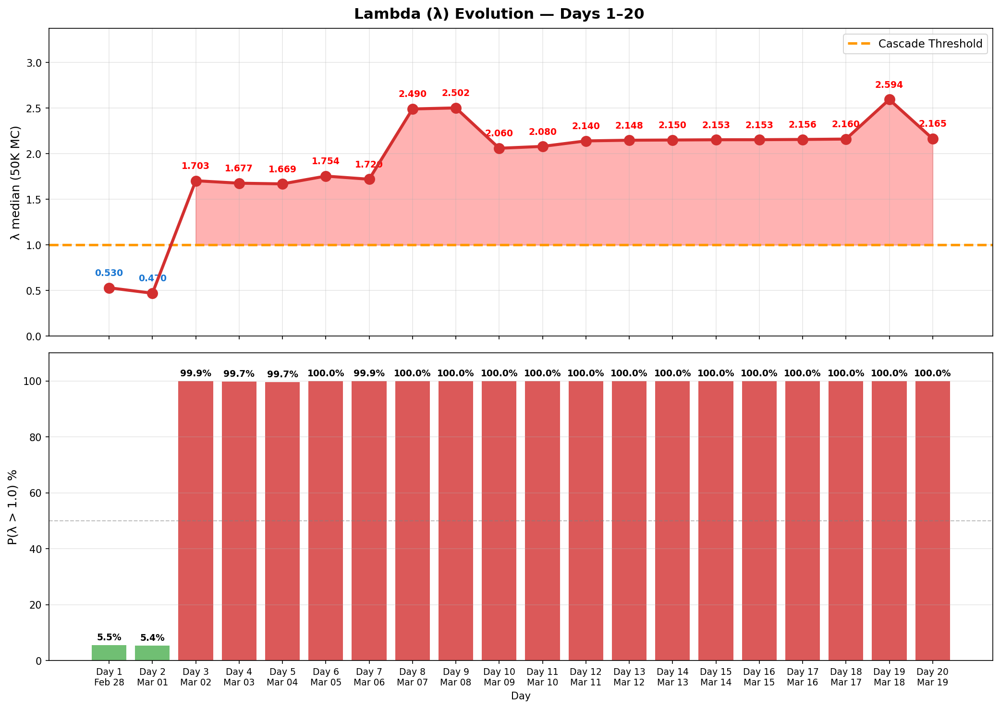

# 每日追踪 — 逐日变化日志

> 🌐 [English](../../updates/daily-tracker.md) | **中文**

**最后更新：2026年3月19日（第20天）**

本页面逐日追踪所有模型输入的变化，将模型预测与实际观测数据进行对比，并在出现偏离时标记警报。

---

## 模型vs实际 — 偏离摘要

### 偏离热力图

逐日6项指标百分比偏差（17天）。红色=实际超出模型，蓝色=实际低于模型。Lambda偏离从第3天起主导（+240% → +330%）。无人机从第11天起极端偏离（实际25-35 vs 模型~130）。弹道导弹在4-10范围内震荡（第12-17天），远超模型接近零的预测。


### 6面板对比

模型（蓝色虚线）vs实际（红色实线）带阴影填充显示差距。机场（绿色）是唯一正向偏离。Lambda（右下）显示深度级联区。无人机库存（中下）在第9天突破30%阈值。


### 记分卡与判定时间线

堆叠偏离显示Lambda（紫色）主导总模型误差。判定时间线：模型全17天预测亚稳态——现实在第3天跨入不稳定且未恢复。


### Lambda演变

λ在第3天从0.47跳至1.70（霍尔木兹关闭），第9天达2.71峰值（无人机库存突破+弹道反弹），随后回落并从第10天起稳定在~2.1平台。第12-17天λ在2.14-2.15范围内保持稳定，反映攻击量下降与结构性不稳定因素的相互抵消。第17天：λ=2.152（DXB油罐被击中；导弹击中民用车，第7名死亡）。P(λ>1)从第3天起持续100%。系统牢固锁定在级联区域。



### 弹道导弹轨迹

模型的指数衰减假设（β=0.25/天）从第5天起失效。第5→9天：3→7→9→16→17呈加速反弹。反弹后（第10-17天）：弹道导弹在4-12范围内震荡，呈噪声下降趋势（12→9→6→10→7→9→10→4→7）。模型预测第12天后接近零——实际仍为预测的4-7倍。无人机从第10天（110）暴跌至第13-17天25-33范围，远低于模型的130/天。总日投射物维持在32-42范围。


---

## 攻击量追踪

### 每日新增攻击

| 天 | 日期 | 弹道导弹 | 模型预测 | 无人机 | 模型预测 | 巡航导弹 | 总计 | 趋势 |
|----|------|---------|---------|--------|---------|---------|------|------|
| 1 | 2月28日 | **137** | — | 209 | — | 0 | 346 | 开战齐射 |
| 2 | 3月1日 | **28** | — | 332 | — | 2 | 362 | 无人机峰值日 |
| 3 | 3月2日 | **9** | ~19 | 148 | ~130 | 6 | 163 | 导弹衰减快于模型 |
| 4 | 3月3日 | **12** | ~14 | 123 | ~130 | 0 | 135 | 导弹回升（噪声？） |
| 5 | 3月4日 | **3** | ~10 | 129 | ~130 | 0 | 132 | 导弹接近零 |
| 6 | 3月5日 | **7** | ~8 | 131 | ~130 | 0 | 138 | 导弹反弹 |
| 7 | 3月6日 | **9** | ~6 | 112 | ~130 | 0 | 121 | ⚠️ 导弹打破单调递减 |
| 8 | 3月7日 | **16** | ~4 | ~125 | ~130 | 0 | 141 | ⚠️ 导弹激增（第2天以来最高） |
| **9** | **3月8日** | **17** | ~3 | 117 | ~130 | 0 | **134** | ⚠️⚠️ 弹道持续高位——16→17 |
| 10 | 3月9日 | **12** | ~2 | 110 | ~130 | 0 | 122 | 弹道下降17→12：反弹中断 |
| 11 | 3月10日 | 9 | ~1 | 35 | ~130 | 0 | 44 | ⚠️ 无人机暴跌：110→35（−68%） |
| **12** | **3月11日** | **6** | ~1 | **39** | ~130 | **7** | **52** | ⚠️ 第3天以来首次巡航导弹；弹道连续第三天下降 |
| 13 | 3月12日 | 10 | ~1 | 26 | ~130 | 0 | 36 | 弹道回升6→10（+67%）；无人机暴跌 |
| **14** | **3月13日** | **7** | ~1 | **~27** | ~130 | 0 | **~34** | 弹道恢复下降10→7；无人机稳定在历史低位；**新历史最低总量** |
| 15 | 3月14日 | **9** | ~1 | 33 | ~130 | 0 | 42 | 9枚弹道+33架无人机(@modgovae)；富查伊拉碎片火灾；攻击扩至阿曼/沙特 |
| 16 | 3月15日 | 4 | ~0 | 6 | ~130 | 0 | 10 | @modgovae：4枚弹道（全拦截）+6架无人机（5拦截1坠UAE）；历史最低量 |
| 17 | 3月16日 | 7 | ~0 | 25 | ~130 | 0 | 32 | 7枚弹道（6拦截1击中民用车）；25架无人机（21拦截4坠UAE含DXB油罐+Fujairah）；1死5伤 |
| **18** | **3月17日** | **10** | ~0 | **45** | ~130 | 0 | **55** | @modgovae：10弹道+45无人机；**GCAA关闭领空**（第2天以来首次）；富查伊拉港被击中；英国空中巡逻开始 |
| **19** | **3月18日** | **13** | ~0 | **27** | ~130 | 0 | **40** | @modgovae：13弹道全拦截+27无人机；布伦特$108.78（冲突新高）；VLCC $445K/天记录 |
| **20** | **3月19日** | **7** | ~0 | **15** | ~130 | 0 | **22** | **冲突以来UAE最低量（22枚）**；伊朗击中卡塔尔拉斯拉凡LNG（17%产能）；布伦特$113（盘中$119） |

### 累计总量

| 天 | 日期 | 累计弹道 | 累计无人机 | 累计巡航 | 累计总计 |
|----|------|---------|-----------|---------|---------|
| 1 | 2月28日 | 137 | 209 | 0 | 346 |
| 2 | 3月1日 | 165 | 541 | 2 | 708 |
| 3 | 3月2日 | 174 | 689 | 8 | 871 |
| 4 | 3月3日 | 186 | 812 | 8 | 1,006 |
| 5 | 3月4日 | 189 | 941 | 8 | 1,138 |
| 6 | 3月5日 | 196 | 1,072 | 8 | 1,276 |
| 7 | 3月6日 | 205 | 1,184 | 8 | 1,397 |
| 8 | 3月7日 | 221 | ~1,309 | 8 | ~1,538 |
| **9** | **3月8日** | **238** | **~1,422** | **8** | **~1,668** |
| 10 | 3月9日 | 250 | ~1,536 | 8 | ~1,794 |
| 11 | 3月10日 | 259 | ~1,571 | 8 | ~1,838 |
| **12** | **3月11日** | **265** | **~1,610** | **15** | **~1,890** |
| 13 | 3月12日 | 275 | ~1,636 | 15 | ~1,926 |
| **14** | **3月13日** | **282** | **~1,663** | **15** | **~1,960** |
| 15 | 3月14日 | 294 | ~1,696 | 15 | ~2,005 |
| 16 | 3月15日 | 298 | ~1,702 | 15 | ~2,015 |
| 17 | 3月16日 | ~305 | ~1,727 | 15 | ~2,047 |
| **18** | **3月17日** | **314** | **~1,672** | **15** | **~2,001** |
| **19** | **3月18日** | **327** | **~1,699** | **15** | **~2,041** |
| **20** | **3月19日** | **334** | **~1,714** | **15** | **~2,063** |

---

## 拦截率追踪

| 天 | 日期 | 探测 | 拦截 | 当日率 | 累计率 | 阈值(<90%) | 状态 |
|----|------|------|------|--------|--------|-----------|------|
| 1 | 2月28日 | 137 | 132 | 96.4% | 96.4% | 正常 | 正常 |
| 2 | 3月1日 | 28 | 20 | 71.4% | 92.1% | ⚠️ 当日突破 | 累计正常 |
| 3 | 3月2日 | 9 | 9 | 100% | 93.6% | 正常 | 正常 |
| 4 | 3月3日 | 12 | 11 | 91.7% | 93.0% | 正常 | 正常 |
| 5 | 3月4日 | 3 | 3 | 100% | 93.1% | 正常 | 正常 |
| 6 | 3月5日 | 7 | 6 | **85.7%** | 93.4% | ⚠️ 当日突破，1枚落地 | **警报** |
| 7 | 3月6日 | 9 | 9 | 100% | 92.7% | 正常 | 正常 |
| 8 | 3月7日 | 16 | 15 | 93.8% | 92.8% | 正常 | ⚠️ 弹道反弹至16 |
| **9** | **3月8日** | **17** | **16** | **94.1%** | **92.9%** | 正常 | ⚠️ 弹道持续高位：16→17 |
| 10 | 3月9日 | 12 | 11 | 91.7% | 92.8% | 正常 | 弹道下降17→12：反弹中断 |
| 11 | 3月10日 | 9 | 8 | 88.9% | 92.7% | ⚠️ 当日突破 | 1枚坠海；日拦截率<90% |
| **12** | **3月11日** | **6** | **6** | **100%** | **92.8%** | 正常 | 弹道全拦截；7枚巡航全拦截；无人机落入阿联酋含2架近DXB |
| 13 | 3月12日 | 10 | 10 | 100% | 93.1% | 正常 | @modgovae确认10枚弹道全拦截；无巡航；26架无人机 |
| **14** | **3月13日** | **7** | **~7** | **~100%** | **93.3%** | 正常 | 弹道恢复下降10→7；残骸击中DIFC大楼；~27架无人机应对 |
| 15 | 3月14日 | 9 | 8 | 88.9% | 93.1% | ⚠️ 当日突破 | 1枚坠海；富查伊拉碎片火灾；约旦公民1人受伤 |
| 16 | 3月15日 | 4 | 4 | 100% | 93.2% | 正常 | @modgovae确认4枚弹道全拦截；6架无人机中5拦截1坠UAE；历史最低量 |
| 17 | 3月16日 | 7 | 6 | 85.7% | 93.0% | ⚠️ 当日突破 | 1枚击中阿布扎比民用车（第7名死亡）；4架无人机坠UAE含DXB油罐+Fujairah |
| **18** | **3月17日** | **10** | **10** | **100%** | **~92.7%** | 正常 | @modgovae：10枚全拦截；领空关闭后恢复 |
| **19** | **3月18日** | **13** | **13** | **100%** | **~92.7%** | 正常 | @modgovae：13枚全拦截；累计327枚；拦截率稳定 |
| **20** | **3月19日** | **7** | **7** | **100%** | **~92.8%** | 正常 | @modgovae：7枚全拦截；累计334枚；连续第3天100%日拦截率 |

**第6天突破备注：** 3月5日1枚弹道导弹落入阿联酋境内 — 首次确认弹道导弹地面撞击。

**第8天关键备注：** 16枚弹道导弹——第2天以来最高。第5→8天呈**加速**趋势：3→7→9→16。发射装置消耗率从85.7%修正至**~73%**。

**第9天关键备注：** 17枚弹道导弹——超过第8天。连续两天高发射量（16→17）确认反弹为结构性趋势。发射装置消耗率进一步修正至**~67%**。无人机库存首次突破30%阈值（28.9%）。

**第10天备注：** 12枚弹道导弹——5天来首次日下降，中断3→7→9→16→17加速趋势。发射装置消耗率修正至**~99%**——累计250枚对40台TEL接近耗尽。

**第11天备注：** 9枚弹道导弹——连续第二天下降（12→9），确认反弹已中断。日拦截率**88.9%**（8/9）突破90%阈值，为冲突中第三次（第2、6、11天）。无人机暴跌（110→35，−68%）前所未有——可能表明库存保存、发射装置损坏或战略转型。

---

## 无人机库存追踪

| 天 | 日期 | 日发射量 | 累计发射 | 估计剩余 | 剩余% | 阈值(<30%) |
|----|------|---------|---------|---------|-------|-----------|
| 1 | 2月28日 | 209 | 209 | 1,791 | 89.6% | 正常 |
| 2 | 3月1日 | 332 | 541 | 1,459 | 73.0% | 正常 |
| 3 | 3月2日 | 148 | 689 | 1,311 | 65.6% | 正常 |
| 4 | 3月3日 | 123 | 812 | 1,188 | 59.4% | 正常 |
| 5 | 3月4日 | 129 | 941 | 1,059 | 53.0% | 正常 |
| 6 | 3月5日 | 131 | 1,072 | 928 | 46.4% | 正常 |
| 7 | 3月6日 | 112 | 1,184 | 816 | 40.8% | 正常 |
| 8 | 3月7日 | ~125 | ~1,309 | ~691 | 34.5% | 接近中 |
| **9** | **3月8日** | **117** | **~1,422** | **~578** | **28.9%** | **⚠️ 已突破** |
| 10 | 3月9日 | 110 | ~1,536 | ~464 | 23.2% | ⚠️ 已突破 |
| 11 | 3月10日 | 35 | ~1,571 | ~429 | 21.4% | ⚠️ 已突破 |
| **12** | **3月11日** | **39** | **~1,610** | **~390** | **19.5%** | **⚠️ 已突破** |
| 13 | 3月12日 | 26 | ~1,636 | ~364 | 18.2% | ⚠️ 已突破 |
| **14** | **3月13日** | **~27** | **~1,663** | **~337** | **16.9%** | **⚠️ 已突破** |
| 15 | 3月14日 | 33 | ~1,696 | ~304 | 15.2% | ⚠️ 已突破 |
| 16 | 3月15日 | 6 | ~1,702 | ~298 | 14.9% | ⚠️ 已突破 |
| 17 | 3月16日 | 25 | ~1,727 | ~273 | 13.6% | ⚠️ 已突破 |
| **18** | **3月17日** | **45** | **1,672†** | **~328** | **16.4%** | **⚠️ 已突破** |
| **19** | **3月18日** | **27** | **~1,699** | **~301** | **15.1%** | **⚠️ 已突破** |
| **20** | **3月19日** | **15** | **~1,714** | **~286** | **14.3%** | **⚠️ 已突破** |

†**@modgovae修正：** 官方累计至第18天为1,672架无人机（@modgovae核实数据），低于追踪器估计（第17天~1,727）。剩余库存修正上调至~328（16.4%）。

~~按当前速率（~120架/天），库存将在第11天（3月10日）左右触及30%阈值。~~ **第9天已突破** — 比预测提前2天。第11-16天持续低量模式（26-39架/天）。连续6天低于40架。按~30架/天，剩余~274架可使用约9天（耗尽约第25天，3月24日）。模式强烈暗示库存耗尽迫使保存。

---

## 级联阈值追踪

| 指标 | 第1天 | 第3天 | 第5天 | 第7天 | 第8天 | 第9天 | 第10天 | 第11天 | 第12天 | 第13天 | 第14天 | 第15天 | 第16天 | 第17天 | 阈值 |
|------|-------|-------|-------|-------|-------|-------|--------|--------|--------|--------|--------|--------|--------|--------|------|
| 发射装置消耗 | ~39% | ~50% | ~54% | 85.7% | ~73% | ~67% | ~99% | ~99% | ~99% | ~99% | ~99% | ~99% | ~99% | ~99% | > 85% |
| 无人机库存 | 89.6% | 65.6% | 53.0% | 40.8% | 34.5% | 28.9% | 23.2% | 21.4% | 19.5% | 18.2% | 16.9% | 15.2% | 14.9% | 13.6% | < 30% |
| 拦截率（累计） | 96.4% | 93.6% | 93.1% | 92.7% | 92.8% | 92.9% | 92.8% | 92.7% | 92.8% | 93.1% | 93.3% | 93.1% | 93.2% | 93.0% | < 90% |
| 拦截率（当日） | 96.4% | 100% | 100% | 100% | 93.8% | 94.1% | 91.7% | 88.9% | 100% | 100% | ~100% | 88.9% | 100% | 85.7% | < 90% |
| 每日伤亡 | ~22/天 | ~18/天 | ~15/天 | ~16/天 | ~14/天 | ~15/天 | 2/天 | 10/天 | 4/天 | 0/天 | 0/天 | 0/10 | 0/0 | 1/5 | > 10 |
| 新武器类型 | 无 | 无 | 无 | 无 | 空军基地 | 空军基地 | 空军基地 | 炼油厂 | DXB机场 | 无 | 无 | 无 | 无 | DXB油罐/民用车 | 有 |

*发射装置消耗从85.7%修正至~73%（第8天），再至~67%（第9天），再至~99%（第10天）。无人机库存已在第9天**突破**30%阈值。第11天新增突破：日拦截率（88.9%），为冲突中第三次日突破。

| 天 | 突破数 | 判定 |
|----|--------|------|
| 1 | 1/5（伤亡） | 亚稳态 |
| 3 | 1/5 | 亚稳态 |
| 5 | 1/5 | 亚稳态 |
| 7 | 2/5（发射装置+伤亡） | 亚稳态 |
| 8 | 4/5（发射装置+拦截日+伤亡+空军基地） | 不稳定 |
| 9 | 3/5（伤亡+新武器+无人机库存） | 不稳定 |
| 10 | 2/5（发射装置+无人机库存） | 不稳定 |
| 11 | 3/5（发射装置+无人机库存+日拦截率） | 不稳定 |
| 12 | 3/5（发射装置+无人机库存+DXB机场） | 不稳定 |
| 13 | 2/5（发射装置+无人机库存） | 不稳定 |
| 14 | 2/5（发射装置+无人机库存） | 不稳定 |
| 15 | 3/5（发射装置+无人机库存+日拦截率） | 不稳定 |
| 16 | 2/5（发射装置+无人机库存） | 不稳定 |
| **17** | **4/5**（发射装置+无人机库存+新武器+日拦截率） | **不稳定** |
| **18** | **3/5**（发射装置+无人机库存+伤亡） | **不稳定** |
| **19** | **1/5**（无人机库存） | **不稳定** |
| **20** | **2/5**（发射装置+无人机库存） | **不稳定** |

---

## Lambda（λ）演变

| 天 | λ中位数 | P(λ>1) | 95分位 | 判定 | 关键变化 |
|----|---------|--------|--------|------|---------|
| 1 | 0.750 | 5.5% | ~1.52 | 亚稳态 | 初始评估 |
| 2 | 0.470 | 5.4% | ~1.10 | 亚稳态 | 开战齐射后 |
| 3 | 1.703 | 99.9% | 2.40 | 不稳定 | 霍尔木兹关闭→λ跳升 |
| 4 | 1.677 | 99.7% | 2.38 | 不稳定 | 霍尔木兹确认 |
| 5 | 1.669 | 99.7% | 2.37 | 不稳定 | 弹道接近零，霍尔木兹持续 |
| 6 | 1.754 | 100% | 2.45 | 不稳定 | 弹道反弹开始 |
| 7 | 1.721 | 99.9% | 2.43 | 不稳定 | 霍尔木兹+代理人已实现；弹道打破单调递减 |
| 8 | 2.589 | 100% | 3.304 | 不稳定 | +空军基地被袭+弹道反弹（16） |
| 9 | 2.712 | 100% | 3.481 | 不稳定 | 无人机库存突破+弹道持续高位 |
| 10 | 2.061 | 100% | 2.770 | 不稳定 | 弹道反弹中断（17→12），λ回落但仍在级联区 |
| 11 | 2.081 | 100% | 2.790 | 不稳定 | 无人机暴跌（110→35）；新突破（日拦截率）；λ持稳 |
| 12 | 2.141 | 100% | 2.851 | 不稳定 | 海军威慑减弱（3→2航母）；7枚巡航导弹（第3天以来首次）；无人机库存持续下降 |
| 13 | 2.110 | 100% | 2.810 | 不稳定 | 弹道回升6→10但拦截率改善（93.1%）；无人机暴跌（26）；无巡航；两名飞行员坠机牺牲（操作事故） |
| 14 | 2.146 | 100% | 2.860 | 不稳定 | 弹道恢复下降（10→7）；拦截改善（93.3%）；无人机稳定在历史低位（27）；哈梅内伊确认霍尔木兹关闭；DIFC残骸；KC-135坠毁 |
| 15 | 2.149 | 100% | 2.870 | 不稳定 | 9枚弹道+33架无人机(@modgovae)；富查伊拉碎片火灾；攻击扩至阿曼（2死）/沙特；日拦截率88.9%；3/5突破 |
| 16 | 2.150 | 100% | 2.870 | 不稳定 | @modgovae确认4枚弹道+6架无人机；历史最低量10；全拦截；2/5突破（发射装置+无人机库存） |
| **17** | **2.152** | **100%** | **2.870** | **不稳定** | 攻击量反弹（10→32）；DXB油罐被击中；导弹击中民用车（第7名死亡）；日拦截率85.7%；MQ-9A在科威特被毁；4/5突破 |
| **18** | **2.157** | **100%** | **2.875** | **不稳定** | 攻击量激增（32→55）；**GCAA关闭领空**（第2天以来首次）；10弹道+45无人机；巴基斯坦籍死亡（第8名）；英国空中巡逻；Polymarket ~8%；3/5突破 |
| **19** | **2.596** | **100%** | **3.310** | **不稳定** | **λ突破平台——从2.155飙升至2.596（+20%）**；弹道反弹信号重新激活（7→10→13）；13枚全拦截；27无人机；布伦特$108.78（冲突新高）；VLCC $445K/天记录；1/5突破 |
| **20** | **2.161** | **100%** | **2.860** | **不稳定** | λ从2.596回落至2.161（−17%），弹道反弹信号关闭（13→7）；无人机历史最低15架；**伊朗摧毁卡塔尔17% LNG产能**；布伦特$113（盘中$119）；零伤亡；2/5突破 |

### 第8天变化分解

```
第7天 → 第8天 Lambda分解：

分量               第7天（已实现）   第8天（已实现）    变化
─────────────────────────────────────────────────────────────
λ_发射装置         -0.471           -0.401           +0.070  （消耗85.7%→~73%）
λ_无人机           +0.148           +0.164           +0.016  （库存更低）
λ_拦截             +0.020           +0.020            0.000
λ_代理人           +0.500           +0.500            0.000  真主党已激活
λ_霍尔木兹         +0.630           +0.630            0.000  已关闭
λ_武器              0.000           +0.400           +0.400  ⚠️ 空军基地被袭（新增）
λ_弹道反弹          0.000           +0.300           +0.300  ⚠️ 16枚弹道（加速）
λ_海军威慑         -0.200           -0.184           +0.016  （CVN-77尚未到达）
─────────────────────────────────────────────────────────────
λ 合计（中位数）    1.721            2.589           +0.868
```

---

## 情景概率追踪

### 模型贝叶斯后验（校准后）

| 情景 | 第6天 | 第14天 | 第30天 | 第12天评估 |
|------|-------|--------|--------|-----------|
| 停火 | 3.3% | 7.8% | 12.8% | ↓↓ Polymarket 20% — 连续第8天下降；市场定价持久冲突 |
| 基线 | 64.9% | 71.2% | 75.4% | ↓↓↓ 霍尔木兹第9天、无人机暴跌、3/5突破、DXB机场被袭——基线模型严重受挑战 |
| 升级 | 31.4% | 20.1% | 11.7% | ↑↑↑ 4项尾部风险已实现；DXB机场被袭表明精准打击升级 |
| 全面战争 | 0.4% | 0.9% | 0.1% | ↑ 能源基础设施与机场被袭+弹道衰减+海军威慑减弱；λ=2.141 |

### Polymarket停火概率

| 日期 | 3月31日前 | 趋势 |
|------|----------|------|
| 3月5日（第6天） | 67% | — |
| 3月6日（第7天） | 63% | ↓ |
| 3月7日（第8天） | 61% | ↓ |
| 3月8日（第9天） | 59% | ↓ |
| 3月9日（第10天） | 24% | ↓↓↓ |
| 3月10日（第11天） | 22% | ↓ |
| 3月11日（第12天） | 20% | ↓ |
| 3月12日（第13天） | ~19% | ↓ |
| **3月13日（第14天）** | **~17%** | **↓** |
| 3月14日（第15天） | 15% | ↓ |
| 3月15日（第16天） | 14% | ↓ |
| 3月16日（第17天） | 13% | ↓ |
| **3月17日（第18天）** | **~8%** | **↓↓** |
| **3月18日（第19天）** | **~10%** | **↑** |
| **3月19日（第20天）** | **~10%** | **→** |

停火概率持平~10%。卡塔尔拉斯拉凡攻击——冲突以来最严重能源基础设施打击——显示伊朗愿意将攻击范围扩大至UAE以外。连续14天下降（67%→~8%）后，第19天微升至~10%——可能反映霍尔木兹选择性通行作为潜在降级信号。但"特朗普访华前停火"市场44%表明市场认为任何解决方案仍遥远。停火概率持续下降 — 连续第13天（67%→~13%）。市场坚定定价持久冲突。哈梅内伊首次公开确认霍尔木兹继续关闭，进一步压低停火预期。尽管第16天创新历史最低量（10枚），第17天攻击反弹至32枚（含DXB油罐击中和民用车死亡），政治强硬化信号表明无近期解决方案。油价维持高位反映市场对冲突长期化的定价。

---

## 机场与航班追踪

| 天 | 日期 | 机场运力 | 模型预测 | 航班/天 | 状态 |
|----|------|---------|---------|---------|------|
| 1 | 2月28日 | 30%（空袭前） | 30% | 正常运营 | 吻合 |
| 2 | 3月1日 | **0%**（关闭） | 0% | 全部暂停 | 吻合 |
| 3 | 3月2日 | ~2% | 2% | 仅特殊航班 | 吻合 |
| 4 | 3月3日 | ~5% | 3% | 阿布扎比部分 | 接近 |
| 5 | 3月4日 | ~8% | 8% | 有限航线 | 吻合 |
| 6 | 3月5日 | ~15% | 12% | 阿提哈德恢复 | 接近 |
| 7 | 3月6日 | ~25% | 15% | 阿联酋航空40%网络 | **超前** |
| 8 | 3月7日 | ~55% | 35% | 阿联酋航空60%，阿提哈德~25目的地 | 大幅超前 |
| 9 | 3月8日 | ~60% | 40% | 阿联酋航空目标100%；阿拉伯航空3月9日复航 | 大幅超前 |
| 10 | 3月9日 | ~65% | 45% | 阿拉伯航空复航；阿联酋航空接近100% | 大幅超前 |
| 11 | 3月10日 | ~70% | 50% | 阿联酋航空84个目的地；DXB有限运营 | 大幅超前 |
| 12 | 3月11日 | ~60% | 55% | DXB无人机袭击；候机楼损坏；仍在运营 | 超前但收窄 |
| 13 | 3月12日 | ~55% | 58% | 迪拜少量无人机事件；攻击量低 | 接近 |
| 14 | 3月13日 | ~50% | 60% | DIFC残骸；阿布扎比和迪拜避难警报；攻击量历史最低 | 偏离 |
| 15 | 3月14日 | ~55% | ~62% | 富查伊拉碎片火灾；攻击扩至区域 | 接近 |
| 16 | 3月15日 | ~55% | ~64% | 历史最低量（10）；阿联酋航空~200架次/天；迪拜航空~64架次 | 接近 |
| **17** | **~30%** | **~65%** | **DXB因油罐火灾暂停后有限恢复；运力暴跌** | **⚠️暴跌** |
| **18** | **~20%** | **~68%** | **GCAA关闭全部领空；5:05 AM恢复；DXB有限运营** | **⚠️危机** |
| **19** | **~40%** | **~70%** | 阿联酋航空有限恢复至110目的地；多数国际航司仍暂停 | ⚠️恢复中 |
| **20** | **~45%** | **~72%** | 7:30导弹预警；DXB逐步恢复；阿联酋航空取消率仅5.3%；印度航空48架次 | ⚠️恢复中 |

**正向偏离（第14天）：** 机场恢复速度为模型预测的早期1.4倍。阿联酋航空目标"未来数天"恢复100%运力，运营至84个目的地。阿提哈德服务约25个主要目的地。阿拉伯航空已复航。部分国际航空公司（维珍大西洋、荷航、芬兰航空）仍暂停。

**第17天重大下降：** DXB因无人机击中油罐火灾暂停运营后有限恢复，运力降至~30%。机场关键基础设施受损确认。

---

## 伤亡追踪

| 天 | 日期 | 日死亡 | 日受伤 | 累计死亡 | 累计受伤 | 日总计 | 阈值(>10) |
|----|------|--------|--------|---------|---------|--------|----------|
| 1 | 2月28日 | 0 | 15 | 0 | 15 | 15 | **已突破** |
| 2 | 3月1日 | 1 | 22 | 1 | 37 | 23 | **已突破** |
| 3 | 3月2日 | 0 | 12 | 1 | 49 | 12 | **已突破** |
| 4 | 3月3日 | 1 | 10 | 2 | 59 | 11 | **已突破** |
| 5 | 3月4日 | 0 | 8 | 2 | 67 | 8 | 正常 |
| 6 | 3月5日 | 1 | 11 | 3 | 78 | 12 | **已突破** |
| 7 | 3月6日 | 0 | 15 | 3 | 93 | 15 | **已突破** |
| 8 | 3月7日 | 0 | ~19 | 3 | ~112 | ~19 | **已突破** |
| 9 | 3月8日 | 1 | 0 | 4 | 112 | 1 | 正常 |
| 10 | 3月9日 | 0 | 2 | 4 | 114 | 2 | 正常 |
| 11 | 3月10日 | 2 | 8 | 6 | 122 | 10 | 阈值 |
| 12 | 3月11日 | 0 | 4 | 6 | 126 | 4 | 正常 |
| 13 | 3月12日 | 0 | 5 | 6 | 131 | 5 | 正常 |
| 14 | 3月13日 | 0 | 0 | 6 | ~131 | 0 | 正常 |
| 15 | 3月14日 | 0 | 10 | 6 | ~141 | 10 | ⚠️突破（伤亡） |
| 16 | 3月15日 | 0 | 0 | 6 | ~141 | 0 | 正常 |
| **17** | **1** | **5** | **7** | **~146** | **6** | 正常 |
| **18** | **1** | **11** | **8** | **157** | **12** | **⚠️已突破** |
| **19** | **0** | **~5** | **8** | **~162** | **~5** | 正常 |
| **20** | **0** | **0** | **8** | **~158†** | **0** | 正常 |

†**@modgovae累计修正：** 截至第20天官方累计受伤158人，低于追踪器估计（~162）。采用@modgovae权威数据。

**备注：** 伤亡数据来源WAM、@modgovae（阿联酋通讯社）、海湾新闻和路透社。第15天约旦公民在富查伊拉因碎片受伤。第17天巴勒斯坦籍民用车司机在阿布扎比因导弹直接击中死亡（第7名UAE死亡）。

**第9天备注：** 第4名遇难者——迪拜Al Barsha区巴基斯坦籍司机被拦截碎片击中身亡。

**第11天备注：** 新增2人死亡，累计6人死亡、122人受伤。当日总计恰好在阈值（10）。尽管导弹/无人机减少，但9架无人机落入阿联酋境内（26%穿透率 vs 正常~5-8%），表明低飞无人机规避拦截后杀伤力更高。

**第12天备注：** 新增4人受伤（DXB机场附近2架无人机击中，候机楼轻微结构损坏），累计6死126伤。无人机发射量回升至45（vs第11天35），拦截率100%（7/7弹道全拦截）。7架无人机落入阿联酋，含2架在DXB机场附近——表明虽无人机数量有所回升，但拦截效率依然强劲。

**第12天数据修正：** 根据@modgovae官方数据，第12天（3月11日）修正为6枚弹道导弹、7枚巡航导弹、39架无人机（此前初步数据为7/0/45）。巡航导弹为第3天以来首次出现。

**第13天备注：** @modgovae确认5人受伤（累计131伤），无新增死亡。尽管无人机发射量减少（26架），拦截碎片仍造成伤害。两名阿联酋军人（飞行员上尉赛义德·拉希德·巴卢希和中尉阿里·萨利赫·塔尼吉）因直升机技术故障坠机牺牲——操作事故，非战斗伤亡。

---

## 经济影响追踪

| 天 | 日期 | 原油(WTI) | 周涨幅 | 霍尔木兹状态 | VLCC运费 | 关键事件 |
|----|------|----------|--------|------------|---------|---------|
| 1 | 2月28日 | $72 | — | 开放 | $218K/天 | 美以空袭伊朗 |
| 2 | 3月1日 | $78 | +8.3% | 开放 | $245K/天 | 伊朗报复 |
| 3 | 3月2日 | $82 | +13.9% | **关闭** | $310K/天 | 革命卫队关闭海峡 |
| 4 | 3月3日 | $86 | +19.4% | 关闭 | $380K/天 | 集装箱船被击中 |
| 5 | 3月4日 | $90 | +25.0% | 接近零通行 | $400K/天 | 仅5次通行 |
| 6 | 3月5日 | $93 | +29.2% | 零通行 | $410K/天 | 马士基暂停波斯湾 |
| 7 | 3月6日 | $95 | +31.9% | 零通行 | $420K/天 | 150艘船被困 |
| 8 | 3月7日 | $97 | +35.6% | 零通行 | $424K/天 | VLCC历史新高 |
| 9 | 3月8日 | ~$100 | +38.9% | 零通行 | ~$430K/天 | 布伦特接近$100；摩根士丹利上调预测 |
| 10 | 3月9日 | $103 | +43.1% | 零通行 | ~$435K/天 | WTI $103；布伦特盘中触$119 |
| 11 | 3月10日 | ~$100 | +38.9% | 零通行 | ~$440K/天 | 鲁韦斯炼油厂（92.2万桶/天）遭无人机袭击停产 |
| 12 | 3月11日 | ~$86 | +19.4% | 零通行 | ~$420K/天 | ⚠️ IEA宣布4亿桶战略储备释放；WTI暴跌至$86；3艘货船被击中；美国摧毁16艘布雷船 |
| 13 | 3月12日 | ~$88 | +22.2% | 零通行 | ~$415K/天 | 油价在IEA释放后企稳；迪拜少量无人机事件；攻击量创新低 |
| 14 | 3月13日 | ~$95 | +31.9% | 零通行 | ~$425K/天 | ⚠️ 油价反弹~$86→$95，哈梅内伊确认霍尔木兹关闭；布伦特近$100；IEA释放效果消退 |
| 15 | 3月14日 | WTI $99，Brent >$100 | +37% | 零通行 | ~$430K/天 | 布伦特连续第二天收盘>$100；伊朗警告油价$200 |
| 16 | 3月15日 | WTI $99，Brent $103 | +43% | 零通行 | ~$435K/天 | 历史最低量（10）对油价零影响；布伦特稳定>$100 |
| **17** | **WTI $100，Brent $104.73** | **+45.8%** | 零通行 | **~$440K/天** | **DXB油罐被击中；机场关键基础设施受损；全球能源担忧升级** |
| **18** | **WTI $97，Brent $103.42** | **+34.7%** | **~5次通行** | **~$440K/天** | 巴基斯坦籍在阿布扎比死亡（第8名）；富查伊拉火灾；HRW谴责伊朗 |
| **19** | **WTI $94，Brent $108.78** | **+30.6%** | **~8次通行** | **~$445K/天** | **布伦特$108.78（冲突新高）**；VLCC创纪录$445K；选择性霍尔木兹通行扩大；美联储会议开始 |
| **20** | **WTI $97，Brent $113** | **+34.7%** | **~12次通行** | **~$450K/天** | **伊朗击中卡塔尔拉斯拉凡（17% LNG产能）**；布伦特$113（盘中$119）；油价单日+5%；VLCC新纪录$450K；卡塔尔驱逐伊朗武官；IMO紧急会谈 |

---

## 关键事件时间线

| 天 | 日期 | 类别 | 事件 | 模型影响 |
|----|------|------|------|---------|
| 1 | 2月28日 | 攻击 | 伊朗发射137枚弹道导弹+209架无人机 | 初始参数设定 |
| 1 | 2月28日 | 军事 | 美国史诗之怒行动开始 | — |
| 2 | 3月1日 | 攻击 | 无人机峰值日：332架发射 | 无人机率校准 |
| 2 | 3月1日 | 伤亡 | 首例死亡（巴基斯坦国民） | 伤亡>10/天 |
| 3 | 3月2日 | **海峡** | **革命卫队宣布霍尔木兹关闭** | **λ_霍尔木兹：0→+0.63** |
| 3 | 3月2日 | 代理人 | 真主党向以色列发射火箭 | λ_代理人部分 |
| 4 | 3月3日 | 海事 | 集装箱船在霍尔木兹海峡内被击中 | 海峡关闭确认 |
| 4 | 3月3日 | 伤亡 | 第二例死亡（孟加拉国国民） | — |
| 5 | 3月4日 | 导弹 | 弹道导弹降至3枚——接近零 | 支持衰减模型 |
| 5 | 3月4日 | 海事 | 仅5艘船通过海峡 | 接近完全封锁 |
| 6 | 3月5日 | **导弹突破** | **1枚弹道导弹落入阿联酋境内**（当日拦截率85.7%） | 拦截阈值 |
| 6 | 3月5日 | 航空 | 阿提哈德恢复有限航班 | 机场超前 |
| 6 | 3月5日 | 伤亡 | 第三例死亡 | — |
| 7 | 3月6日 | 导弹 | 9枚——打破单调递减（从7枚上升） | 模型偏离 |
| 7 | 3月6日 | 航空 | 阿联酋航空40%网络 | 机场大幅超前 |
| 7 | 3月6日 | 海军 | CVN-77布什号完成训练，返回诺福克 | 第3航母确认 |
| **8** | **3月7日** | **升级** | **革命卫队声称打击扎夫拉空军基地** | **λ_武器：0→+0.40** |
| 8 | 3月7日 | 航空 | 阿联酋航空60%网络，106航班/天 | 机场1.5倍模型 |
| 8 | 3月7日 | 民防 | 迪拜就地避难警报 | 升级信号 |
| 8 | 3月7日 | 导弹 | 16枚弹道导弹（第2天以来最高） | 弹道反弹确认 |
| **9** | **3月8日** | **导弹** | **17枚弹道——连续两天高位（16→17）** | **反弹为结构性** |
| 9 | 3月8日 | **无人机** | **无人机库存突破30%（28.9%）** | **λ_无人机：+0.079** |
| 9 | 3月8日 | 伤亡 | 第4名遇难——迪拜Al Barsha巴基斯坦籍司机 | 拦截碎片 |
| 9 | 3月8日 | 石油 | 布伦特接近$100；开战以来+39% | 创纪录周涨幅 |
| 9 | 3月8日 | 航空 | 阿联酋航空目标100%；阿拉伯航空3月9日复航 | 机场1.6倍模型 |
| **10** | **3月9日** | **导弹** | **12枚弹道——5天来首次下降（17→12）** | **弹道反弹中断；λ_弹道反弹→0** |
| 10 | 3月9日 | 石油 | WTI $103，布伦特盘中$119 | 创纪录价格 |
| 10 | 3月9日 | 市场 | Polymarket停火概率暴跌至24%（从59%） | 市场预判无解决方案 |
| 10 | 3月9日 | 伤亡 | 阿布扎比2人因拦截碎片受伤 | — |
| 10 | 3月9日 | 航空 | 阿拉伯航空复航；阿联酋航空接近100% | 机场1.4倍模型 |
| 11 | 3月10日 | **无人机** | **仅35架无人机——暴跌68%（史上最低）** | **可能库存保存或战略转型** |
| 11 | 3月10日 | 导弹 | 9枚弹道（8拦截，1坠海）——连续第二天下降 | 弹道衰减恢复；日拦截率88.9%（<90%突破） |
| 11 | 3月10日 | 伤亡 | 新增2人死亡；累计6死122伤 | 无人机穿透率上升（26% vs 正常~5-8%） |
| 11 | 3月10日 | 海事 | ~1,000艘船在霍尔木兹外排队；非伊朗船只零通行 | 选择性封锁：伊朗仅允许本国+中国船通行 |
| 11 | 3月10日 | **能源** | **无人机袭击ADNOC鲁韦斯炼油厂（92.2万桶/天）——起火，预防性停产** | **阿联酋能源基础设施首次被直接击中；λ_武器升级** |
| 11 | 3月10日 | 航空 | 阿联酋航空84个目的地；维珍/荷航/芬航暂停 | 机场~70%，部分国际航司撤出 |
| **12** | **3月11日** | **石油/IEA** | **⚠️ IEA宣布史上最大4亿桶战略储备释放** | **全球协调能源政策；WTI从$100暴跌至$86（−14%） |
| 12 | 3月11日 | **无人机/DXB** | **两架无人机坠落于迪拜国际机场附近** | **4人受伤；候机楼轻微结构损坏；机场运力~60% |
| 12 | 3月11日 | **海事** | **海湾三艘货船被击中——泰国籍船在霍尔木兹起火** | **选择性封锁伤害船队安全 |
| 12 | 3月11日 | **军事** | **美国摧毁16艘伊朗布雷船** | **对抗霍尔木兹关闭战术 |
| 12 | 3月11日 | **能源** | **鲁韦斯炼油厂仍停产** | **第12天持续影响；累计损失~92.2万桶/天** |
| 12 | 3月11日 | 巡航 | **7枚巡航导弹被拦截** — 第3天以来首次巡航导弹 | λ_武器：巡航导弹在8天缺席后重现 |
| **13** | **3月12日** | **导弹** | **10枚弹道——从6枚回升，中断三天跌势** | **弹道逆转；增67%但仍低于第8-9天峰值** |
| 13 | 3月12日 | 无人机 | 仅26架无人机——开战以来最低单日 | 无人机库存耗尽加速；连续3天<40架 |
| 13 | 3月12日 | 军事 | 两名阿联酋军人直升机坠机牺牲（操作事故） | 飞行员上尉巴卢希+中尉塔尼吉；技术故障 |
| 13 | 3月12日 | 伤亡 | @modgovae确认5人受伤（累计131伤）；无死亡 | 低伤亡日，弹道全拦截 |
| **14** | **3月13日** | **政治** | **莫杰塔巴·哈梅内伊首次公开声明：霍尔木兹继续关闭** | **消除近期重新开放的模糊性；λ_霍尔木兹锁定+0.630** |
| 14 | 3月13日 | 无人机/DIFC | 拦截碎片击中迪拜DIFC创新中心 | 无伤亡；连续第二天城市碎片事件 |
| 14 | 3月13日 | 军事 | 美国KC-135加油机在伊拉克西部坠毁——6名机组4人遇难 | 史诗之怒行动；伊拉克伊斯兰抵抗组织声称负责 |
| 14 | 3月13日 | 导弹 | 7枚弹道——第13天回升后恢复下降（10→7） | 五天模式：12→9→6→10→7——趋势向下但有噪声 |
| 14 | 3月13日 | 石油 | 布伦特~$99，WTI~$95——油价从IEA暴跌中反弹 | 哈梅内伊霍尔木兹声明抹去IEA干预约75%的收益 |
| 14 | 3月13日 | 能源 | 阿联酋能源部长确认能源供应稳定 | 鲁韦斯炼油厂仍停产但国家系统正常运行 |
| **15** | **3月14日** | **攻击** | **9枚弹道+33架无人机(@modgovae)** | **累计：294弹道，15巡航，~1,700无人机** |
| 15 | 3月14日 | 火灾 | 富查伊拉加油港碎片火灾；约旦公民1人受伤 | 碎片损害能源基础设施 |
| 15 | 3月14日 | **区域** | **阿曼2人被无人机碎片击亡；数架无人机亦射向沙特** | **伊朗攻击超越阿联酋——区域升级** |
| 15 | 3月14日 | 石油 | 布伦特连续第二天收盘>$100；伊朗警告油价$200 | 市场定价长期中断 |
| 15 | 3月14日 | 攻击 | 9枚弹道+33架无人机(@modgovae)；富查伊拉加油港碎片火灾 | 累计：294弹道，15巡航，~1,700无人机 |
| 15 | 3月14日 | 区域升级 | 阿曼2人被无人机碎片击亡；数架无人机亦射向沙特 | 伊朗攻击超越阿联酋目标 |
| 15 | 3月14日 | 伤亡 | 约旦公民1人在富查伊拉因碎片受伤 | 非阿联酋国民首次伤亡 |
| 16 | 3月15日 | 攻击（@modgovae） | 4枚弹道+6架无人机；全部或大部拦截 | 历史最低量（10）；日拦截率100% |
| 16 | 3月15日 | 能源 | 无重大基础设施被击中 | 攻击量最低日 |
| **17** | **3月16日** | **升级** | **7枚弹道+25架无人机；DXB油罐被击中；导弹击中民用车** | **累计~305弹道，~1,727无人机；第7名死亡** |
| 17 | 3月16日 | 能源重击 | DXB因油罐火灾暂停运营后有限恢复；机场运力~30%（暴跌） | 关键基础设施受损；VLCC运费持续高位 |
| 17 | 3月16日 | 军事 | MQ-9A在科威特被毁 | 无人机战力损失 |
| 17 | 3月16日 | 石油 | WTI $100，Brent $104.73 | 机场受损推高能源担忧 |
| **18** | **3月17日** | **领空** | **GCAA关闭全部阿联酋领空——"特殊预防措施"** | **第2天以来首次全面关闭；5:05 AM恢复** |
| 18 | 3月17日 | 攻击 | @modgovae：10弹道+45无人机；累计314弹道，1,672无人机，15巡航 | 攻击量激增32→55 |
| 18 | 3月17日 | 能源 | 富查伊拉石油港再次被无人机击中 | 能源基础设施持续受袭 |
| 18 | 3月17日 | 军事 | 英国开始"防御性空中巡逻" | 国际军事参与扩大 |
| 18 | 3月17日 | 伤亡 | 巴基斯坦籍在阿布扎比Baniyas因拦截碎片死亡（第8名） | 累计8死157伤 |
| **19** | **3月18日** | **攻击** | **@modgovae：13弹道全拦截+27无人机；累计327弹道，1,699无人机** | **弹道激增至13（第10天以来最高）；λ突破平台** |
| 19 | 3月18日 | 石油 | 布伦特飙升至$108.78——冲突新高（+$5.80） | 冲突溢价扩大 |
| 19 | 3月18日 | 海事 | VLCC运费创历史记录$423K-$445K/天 | 保险撤出+供应紧缩 |
| 19 | 3月18日 | 霍尔木兹 | 伊朗允许更多船只通行；战争以来~90艘通过 | 事实上选择性封锁取代全面关闭 |
| 19 | 3月18日 | 经济 | 美联储开始两天政策会议 | 油价通胀影响利率预期 |
| **20** | **3月19日** | **能源** | **伊朗导弹击中卡塔尔拉斯拉凡LNG设施——17%产能被毁，需3-5年修复** | **冲突以来最大能源基础设施打击；卡塔尔能源或宣布不可抗力；区域升级** |
| 20 | 3月19日 | 石油 | 布伦特盘中触$119后收于$113；WTI $97；单日涨幅+5% | 完全抹去第12天IEA储备释放效果 |
| 20 | 3月19日 | 攻击 | @modgovae：7弹道+15无人机（22枚总计）——冲突以来UAE最低量 | 弹道中断3天加速（13→7）；无人机历史最低（15）；伊朗转向区域能源目标 |
| 20 | 3月19日 | 外交 | 卡塔尔驱逐伊朗武官 | 此前中立海湾国家的重大外交升级 |
| 20 | 3月19日 | 民防 | 7:30迪拜和阿布扎比发布导弹预警 | 避难警报继续但无伤亡 |
| 20 | 3月19日 | 海事 | 霍尔木兹选择性通行翻倍；今日约12艘通过；IMO紧急会谈 | 选择性封锁演变；战争以来~100+艘通过 |

---

## 模型与现实对照记分卡（滚动更新）

| # | 检查项 | 模型 | 第16天观测 | 第17天观测 | 状态 |
|---|--------|------|-----------|-----------|------|
| 1 | 弹道导弈单调递减 | 是 | 4枚（历史最低） | **7枚（反弹）** | **⚠️ 偏离**（非单调：12→9→6→10→7→9→10→4→7） |
| 2 | 拦截率>90%（累计） | 93.2% | **93.2%** | **93.0%** | **吻合**（维持） |
| 3 | 无人机率~130/天 | ~130/天 | **6/天** | **25/天** | **⚠️ 极端偏离**（−81%→−80%） |
| 4 | 无新武器类型 | 无 | 无新类型 | **DXB油罐+民用车** | **偏离** |
| 5 | 停火概率（Polymarket） | 84% | 14% | **13%** | **偏离**（连续第13天下降） |
| 6 | 机场恢复 | 55%（第12天） | ~55% | **~30%** | **⚠️ 暴跌**（油罐火灾） |
| 7 | 无人机库存>30% | ~20% | 14.9% | **13.6%** | **⚠️ 严重** |
| 8 | 霍尔木兹海峡开放 | P=98%开放 | **已关闭** | **已关闭** | **偏离** |
| 9 | 无代理人激活 | P=96%未激活 | MQ-9A在科威特被毁 | 真主党+伊拉克民兵活跃 | **偏离** |
| 10 | 判定 | 亚稳态 | **不稳定** | **不稳定** | **偏离** |

**第17天评级：1项吻合，0项稳定，0项接近，9项偏离**（第16天进一步恶化，DXB受损、攻击反弹、伤亡增加）

**第16天重点：** 4枚弹道+6架无人机（@modgovae确认）=10枚总计，创历史最低单日量。100%日拦截率；零伤亡；无新武器。攻击量暴跌暗示库存耗尽或战术转变。λ=2.150（微升0.001），维持级联区域但攻击量最低。停火概率14%（连续第11天下降）。油价维持$99-103不动摇。

**第17天重点：** 攻击量反弹32枚（7弹道+25无人机）。DXB油罐被击中、机场运力暴跌至~30%、导弹直接击中民用车（巴勒斯坦籍司机死亡，第7名死亡）。日拦截率85.7%（6/7）—— 再次突破90%阈值。4/5级联突破（发射装置+无人机库存+新武器+拦截率）。λ=2.152（微升0.002）。MQ-9A在科威特被毁。

**关键评估：** 第16→17天显示**战术-战略分化加深**。第16天历史最低量暗示库存耗尽临界（~298无人机剩余），但第17天立即反弹表明伊朗选择**精确打击**模式——不再面积饱和，转向关键基础设施（DXB油罐、民用目标）和美军资产。DXB机场受损从战术打击升级为战略基础设施威胁，油价从$95→$104确认市场担忧升级。停火概率13%（已从第5天67%跌落80%）。撤离窗口正在关闭。

---

## 建议历史

| 天 | 风险评分 | λ中位数 | 判定 | 建议 |
|----|---------|---------|------|------|
| 1 | ~100 | — | — | **立即撤离** |
| 3 | ~80 | — | 亚稳态 | **撤离——黄金窗口** |
| 5 | ~65 | — | 亚稳态 | **撤离——窗口关闭中** |
| 7 | ~55 | 1.721 | 不稳定 | **撤离——今天离开** |
| 8 | ~50 | 2.589 | 不稳定 | 立即撤离 |
| 9 | ~48 | 2.712 | 不稳定 | 立即撤离 |
| 10 | ~45 | 2.061 | 不稳定 | 立即撤离 |
| 11 | ~43 | 2.081 | 不稳定 | 立即撤离 |
| 12 | ~42 | 2.141 | 不稳定 | 立即撤离 |
| 13 | ~41 | 2.110 | 不稳定 | 立即撤离 |
| 14 | ~40 | 2.146 | 不稳定 | 立即撤离 |
| 15 | ~39 | 2.149 | 不稳定 | 立即撤离 |
| 16 | ~37 | 2.150 | 不稳定 | 立即撤离（历史最低量日） |
| **17** | **~36** | **2.152** | **不稳定** | **立即撤离（关键基础设施受损）** |
| **18** | **~33** | **2.157** | **不稳定** | **立即撤离（领空关闭危机）** |
| **19** | **~32** | **2.596** | **不稳定** | **立即撤离（λ突破平台）** |
| **20** | **~31** | **2.161** | **不稳定** | **立即撤离（冲突区域化扩大）** |

λ=2.161——从第19天峰值2.596回落17%（弹道反弹信号关闭：13→7）。系统仍锁定级联区域。第20天关键不在UAE本身而是区域：伊朗摧毁卡塔尔17% LNG产能。，在~2.15形成平台。系统锁定在级联区域，结构性驱动因素（霍尔木兹关闭、代理人激活、武器升级历史）阻止任何有意义的下降。

**第16→17天关键动态：**

- **第16天：历史最低量日** — 4枚弹道+6架无人机（10枚总计）；全部拦截；零伤亡；无新武器。λ=2.150。暗示库存临界。
- **第17天：战略升级** — 7枚弹道+25无人机（32枚总计）反弹。**DXB油罐被击中**，机场运力暴跌55%→30%。导弹直接击中民用车（巴勒斯坦籍司机死亡，第7名死亡）。日拦截率85.7%突破。4/5级联突破。MQ-9A在科威特被毁。λ=2.152（微升）。
- **关键评估：** 伊朗在第16天库存临界时**转向精确打击战略** — 不再面积饱和，而是聚焦关键基础设施（机场油罐、民用目标、美军资产）和区域扩展（阿曼2死、沙特）。第17天DXB受损标志**战术成功升级为战略威胁**。油价$95→$104确认市场认知级别提升。
- **库存耗尽时间线修正：** 第16天6架无人机后，剩余~298架。第17天25架无人机后，剩余~273架（13.6%库存）。按~20-25架/天（低烈度精确打击），可维持10-14天（耗尽约第27-31天，3月23-27日）。伊朗库存耗尽虽然限制**量**的攻击，但精确性和战略打击**质**正在升级。
- **撤离窗口关闭：** 第16天提供历史性撤离机会（机场55%、攻击10），但第17天DXB受损关闭窗口。机场运力~30%，已难以支撑大规模撤离。停火概率13%。**立即离开——如有任何航班出发，立即乘坐。**
