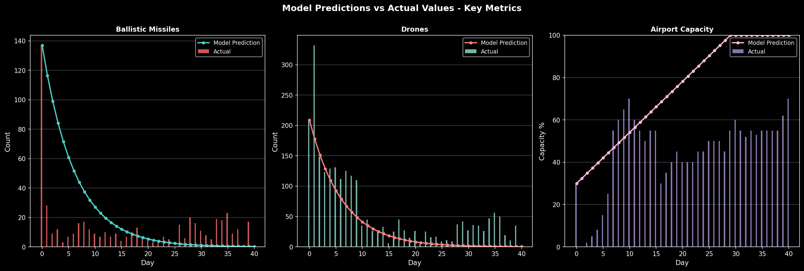
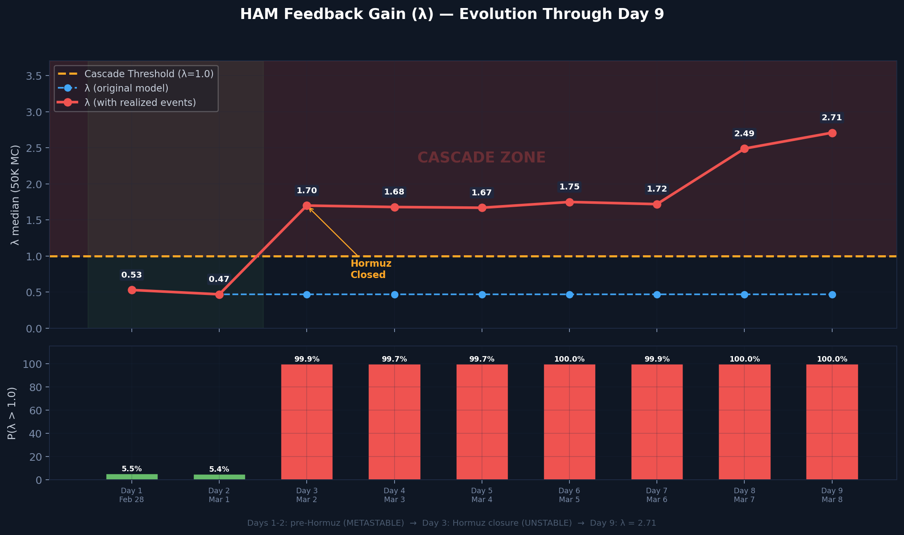

# 每日追踪 — 逐日变化日志

> 🌐 [English](../../updates/daily-tracker.md) | **中文**

**最后更新：2026年3月8日（第9天）**

本页面逐日追踪所有模型输入的变化，将模型预测与实际观测数据进行对比，并在出现偏离时标记警报。

---

## 模型vs实际 — 偏离摘要

### 偏离热力图

逐日6项指标百分比偏差。红色=实际超出模型，蓝色=实际低于模型。Lambda偏离从第3天起主导（+240% → +477%）。


### 6面板对比

模型（蓝色）vs实际（红色）并排对比。机场（绿色）是唯一正向偏离。Lambda（右下）显示深度级联区。无人机库存（中下）在第9天突破30%阈值。



### 记分卡与判定时间线

堆叠偏离显示Lambda（紫色）主导总模型误差。判定时间线：模型全9天预测亚稳态——现实在第3天跨入不稳定且未恢复。


### Lambda演变

λ在第3天从0.47跳至1.70（霍尔木兹关闭），第9天达2.71（无人机库存突破+弹道持续反弹）。P(λ>1)从第3天起一直为100%。



### 弹道导弹轨迹

模型的指数衰减假设（β=0.25/天）从第5天起失效。第5→9天：3→7→9→16→17呈加速反弹，推翻TEL消耗假说。


---

## 攻击量追踪

### 每日新增攻击

| 天 | 日期 | 弹道导弹 | 模型预测 | 无人机 | 模型预测 | 巡航导弹 | 总计 | 趋势 |
|----|------|---------|---------|--------|---------|---------|------|------|
| 1 | 2月28日 | **137** | — | 209 | — | 0 | 346 | 开战齐射 |
| 2 | 3月1日 | **28** | — | 332 | — | 2 | 362 | 无人机峰值日 |
| 3 | 3月2日 | **9** | ~19 | 148 | ~130 | 6 | 163 | 导弹衰减快于模型 |
| 4 | 3月3日 | **12** | ~14 | 123 | ~130 | 0 | 135 | 导弹回升（噪声？） |
| 5 | 3月4日 | **3** | ~10 | 129 | ~130 | 0 | 132 | 导弹接近零 |
| 6 | 3月5日 | **7** | ~8 | 131 | ~130 | 0 | 138 | 导弹反弹 |
| 7 | 3月6日 | **9** | ~6 | 112 | ~130 | 0 | 121 | ⚠️ 导弹打破单调递减 |
| 8 | 3月7日 | **16** | ~4 | ~125 | ~130 | 0 | 141 | ⚠️ 导弹激增（第2天以来最高） |
| **9** | **3月8日** | **17** | ~3 | 117 | ~130 | 0 | **134** | ⚠️⚠️ 弹道持续高位——16→17 |

### 累计总量

| 天 | 日期 | 累计弹道 | 累计无人机 | 累计巡航 | 累计总计 |
|----|------|---------|-----------|---------|---------|
| 1 | 2月28日 | 137 | 209 | 0 | 346 |
| 2 | 3月1日 | 165 | 541 | 2 | 708 |
| 3 | 3月2日 | 174 | 689 | 8 | 871 |
| 4 | 3月3日 | 186 | 812 | 8 | 1,006 |
| 5 | 3月4日 | 189 | 941 | 8 | 1,138 |
| 6 | 3月5日 | 196 | 1,072 | 8 | 1,276 |
| 7 | 3月6日 | 205 | 1,184 | 8 | 1,397 |
| 8 | 3月7日 | 221 | ~1,309 | 8 | ~1,538 |
| **9** | **3月8日** | **238** | **~1,422** | **8** | **~1,668** |

---

## 拦截率追踪

| 天 | 日期 | 探测 | 拦截 | 当日率 | 累计率 | 阈值(<90%) | 状态 |
|----|------|------|------|--------|--------|-----------|------|
| 1 | 2月28日 | 137 | 132 | 96.4% | 96.4% | 正常 | 正常 |
| 2 | 3月1日 | 28 | 20 | 71.4% | 92.1% | ⚠️ 当日突破 | 累计正常 |
| 3 | 3月2日 | 9 | 9 | 100% | 93.6% | 正常 | 正常 |
| 4 | 3月3日 | 12 | 11 | 91.7% | 93.0% | 正常 | 正常 |
| 5 | 3月4日 | 3 | 3 | 100% | 93.1% | 正常 | 正常 |
| 6 | 3月5日 | 7 | 6 | **85.7%** | 93.4% | ⚠️ 当日突破，1枚落地 | **警报** |
| 7 | 3月6日 | 9 | 9 | 100% | 92.7% | 正常 | 正常 |
| 8 | 3月7日 | 16 | 15 | 93.8% | 92.8% | 正常 | ⚠️ 弹道反弹至16 |
| **9** | **3月8日** | **17** | **16** | **94.1%** | **92.9%** | 正常 | ⚠️ 弹道持续高位：16→17 |

**第6天突破备注：** 3月5日1枚弹道导弹落入阿联酋境内 — 首次确认弹道导弹地面撞击。

**第9天关键备注：** 17枚弹道导弹——超过第8天。连续两天高发射量（16→17）确认反弹为结构性趋势而非单日异常。发射装置消耗率修正至**~67%**。无人机库存首次突破30%阈值（28.9%）。

---

## 无人机库存追踪

| 天 | 日期 | 日发射量 | 累计发射 | 估计剩余 | 剩余% | 阈值(<30%) |
|----|------|---------|---------|---------|-------|-----------|
| 1 | 2月28日 | 209 | 209 | 1,791 | 89.6% | 正常 |
| 2 | 3月1日 | 332 | 541 | 1,459 | 73.0% | 正常 |
| 3 | 3月2日 | 148 | 689 | 1,311 | 65.6% | 正常 |
| 4 | 3月3日 | 123 | 812 | 1,188 | 59.4% | 正常 |
| 5 | 3月4日 | 129 | 941 | 1,059 | 53.0% | 正常 |
| 6 | 3月5日 | 131 | 1,072 | 928 | 46.4% | 正常 |
| 7 | 3月6日 | 112 | 1,184 | 816 | 40.8% | 正常 |
| 8 | 3月7日 | ~125 | ~1,309 | ~691 | 34.5% | 接近中 |
| **9** | **3月8日** | **117** | **~1,422** | **~578** | **28.9%** | **⚠️ 已突破** |

~~按当前速率（~120架/天），库存将在第11天（3月10日）左右触及30%阈值。~~ **第9天已突破** — 比预测提前2天。按当前消耗率（~117架/天），约5天后（第14天，约3月13日）完全耗尽。

---

## 级联阈值追踪

| 指标 | 第1天 | 第3天 | 第5天 | 第7天 | 第8天 | 第9天 | 阈值 |
|------|-------|-------|-------|-------|-------|-------|------|
| 发射装置消耗 | ~39% | ~50% | ~54% | 85.7% | ~73% | **~67%** | > 85% |
| 无人机库存 | 89.6% | 65.6% | 53.0% | 40.8% | 34.5% | **28.9%** | < 30% |
| 拦截率（累计） | 96.4% | 93.6% | 93.1% | 92.7% | 92.8% | 92.9% | < 90% |
| 每日伤亡 | ~22/天 | ~18/天 | ~15/天 | ~16/天 | ~14/天 | ~15/天 | > 10 |
| 新武器类型 | 无 | 无 | 无 | 无 | 空军基地 | 空军基地 | 有 |

*发射装置消耗从85.7%**下修**至~73%（第8天），进一步下修至**~67%**（第9天），因连续高发射量弹道导弹日（16→17）。加速趋势3→7→9→16→17确认更多TEL仍在运作。无人机库存已在第9天**突破**30%阈值——比预测提前2天。

| 天 | 突破数 | 判定 |
|----|--------|------|
| 1 | 1/5（伤亡） | 亚稳态 |
| 3 | 1/5 | 亚稳态 |
| 5 | 1/5 | 亚稳态 |
| 7 | 2/5（发射装置+伤亡） | 亚稳态 |
| 8 | 4/5（发射装置+拦截日+伤亡+空军基地） | 不稳定 |
| **9** | **3/5**（伤亡+新武器+**无人机库存**） | **不稳定** |

---

## Lambda（λ）演变

| 天 | λ中位数 | P(λ>1) | 95分位 | 判定 | 关键变化 |
|----|---------|--------|--------|------|---------|
| 1 | ~0.75 | ~12% | ~1.52 | 亚稳态 | 初始评估 |
| 7（2艘航母） | 0.739 | 12.2% | 1.523 | 亚稳态 | 基线模型 |
| 7（3艘航母） | 0.496 | 5.8% | 1.063 | 亚稳态 | CVN-77即将部署 |
| 8（已实现） | 2.589 | 100% | 3.304 | 不稳定 | 霍尔木兹+代理人+空军基地+弹道反弹 |
| **9** | **2.712** | **100%** | **3.481** | **不稳定** | 无人机库存突破+弹道持续高位 |

### 第8天变化分解

```
第7天 → 第8天 Lambda分解：

分量               第7天（3航母）    第8天（已实现）    变化
─────────────────────────────────────────────────────────────
λ_发射装置         -0.471           -0.319           +0.152  （修正：73% vs 85.7%）
λ_无人机           +0.148           +0.163           +0.015  （库存更低）
λ_拦截             +0.020           +0.020            0.000
λ_代理人            0.000*          +0.500           +0.500  ⚠️ 真主党部分激活
λ_霍尔木兹          0.000*          +0.630           +0.630  ⚠️ 已实现
λ_武器              0.000*          +0.400           +0.400  ⚠️ 空军基地被袭
λ_弹道反弹          0.000           +0.300           +0.300  ⚠️ 新增信号
λ_海军威慑         -0.240           -0.184           +0.056  （CVN-77尚未到达）
─────────────────────────────────────────────────────────────
λ 合计（中位数）    0.496            2.589           +2.093

* 随机尾部风险，期望值约0（P=2-4%）
```

---

## 情景概率追踪

### 模型贝叶斯后验（校准后）

| 情景 | 第6天 | 第14天 | 第30天 | 第9天评估 |
|------|-------|--------|--------|----------|
| 停火 | 3.3% | 7.8% | 12.8% | ↓ Polymarket 59%（持续下降） |
| 基线 | 64.9% | 71.2% | 75.4% | ↓↓ 霍尔木兹+库存耗尽挑战基线 |
| 升级 | 31.4% | 20.1% | 11.7% | ↑↑ 多项升级事件已实现 |
| 全面战争 | 0.4% | 0.9% | 0.1% | ↑ 空军基地+弹道持续抬高下限 |

### Polymarket停火概率

| 日期 | 3月31日前 | 趋势 |
|------|----------|------|
| 3月5日（第6天） | 67% | — |
| 3月6日（第7天） | 63% | ↓ |
| 3月7日（第8天） | 61% | ↓ |
| **3月8日（第9天）** | **59%** | **↓** |

停火概率逐日下降 — 市场正在定价更长时间的冲突。连续五天下降（67%→59%）。

---

## 机场与航班追踪

| 天 | 日期 | 机场运力 | 模型预测 | 航班/天 | 状态 |
|----|------|---------|---------|---------|------|
| 1 | 2月28日 | 30%（空袭前） | 30% | 正常运营 | 吻合 |
| 2 | 3月1日 | **0%**（关闭） | 0% | 全部暂停 | 吻合 |
| 3 | 3月2日 | ~2% | 2% | 仅特殊航班 | 吻合 |
| 4 | 3月3日 | ~5% | 3% | 阿布扎比部分 | 接近 |
| 5 | 3月4日 | ~8% | 8% | 有限航线 | 吻合 |
| 6 | 3月5日 | ~15% | 12% | 阿提哈德恢复 | 接近 |
| 7 | 3月6日 | ~25% | 15% | 阿联酋航空40%网络 | **超前** |
| 8 | 3月7日 | ~55% | 35% | 阿联酋航空60%，阿提哈德~25目的地 | 大幅超前 |
| **9** | **3月8日** | **~65%** | **40%** | 阿联酋航空目标100%；阿拉伯航空3月9日复航 | **大幅超前** |

**正向偏离：** 机场恢复速度为模型预测的1.6倍。阿联酋航空目标"未来数天"恢复100%运力，运营106+航班/天至83+目的地。阿提哈德服务约25个主要目的地。阿拉伯航空3月9日复航。约25万旅客积压正在清理。

---

## 伤亡追踪

| 天 | 日期 | 日死亡 | 日受伤 | 累计死亡 | 累计受伤 | 日总计 | 阈值(>10) |
|----|------|--------|--------|---------|---------|--------|----------|
| 1 | 2月28日 | 0 | 15 | 0 | 15 | 15 | **已突破** |
| 2 | 3月1日 | 1 | 22 | 1 | 37 | 23 | **已突破** |
| 3 | 3月2日 | 0 | 12 | 1 | 49 | 12 | **已突破** |
| 4 | 3月3日 | 1 | 10 | 2 | 59 | 11 | **已突破** |
| 5 | 3月4日 | 0 | 8 | 2 | 67 | 8 | 正常 |
| 6 | 3月5日 | 1 | 11 | 3 | 78 | 12 | **已突破** |
| 7 | 3月6日 | 0 | 15 | 3 | 93 | 15 | **已突破** |
| 8 | 3月7日 | 0 | ~19 | 3 | ~112 | ~19 | **已突破** |
| **9** | **3月8日** | **1** | **~18** | **4** | **~130** | **~19** | **已突破** |

**备注：** 伤亡数据来源WAM（阿联酋通讯社）和路透社。鉴于攻击量，伤亡数字极低，归因于>92%的拦截率和有效民防。

**第9天备注：** 第4名遇难者——迪拜Al Barsha区巴基斯坦籍司机被拦截碎片击中身亡。总受伤人数约130人，涉及17+国籍。

---

## 经济影响追踪

| 天 | 日期 | 原油(WTI) | 周涨幅 | 霍尔木兹状态 | VLCC运费 | 关键事件 |
|----|------|----------|--------|------------|---------|---------|
| 1 | 2月28日 | $72 | — | 开放 | $218K/天 | 美以空袭伊朗 |
| 2 | 3月1日 | $78 | +8.3% | 开放 | $245K/天 | 伊朗报复 |
| 3 | 3月2日 | $82 | +13.9% | **关闭** | $310K/天 | 革命卫队关闭海峡 |
| 4 | 3月3日 | $86 | +19.4% | 关闭 | $380K/天 | 集装箱船被击中 |
| 5 | 3月4日 | $90 | +25.0% | 接近零通行 | $400K/天 | 仅5次通行 |
| 6 | 3月5日 | $93 | +29.2% | 零通行 | $410K/天 | 马士基暂停波斯湾 |
| 7 | 3月6日 | $95 | +31.9% | 零通行 | $420K/天 | 150艘船被困 |
| 8 | 3月7日 | $97 | +35.6% | 零通行 | $424K/天 | VLCC历史新高 |
| **9** | **3月8日** | **~$100** | **+38.9%** | **零通行** | **~$430K/天** | **布伦特接近$100；摩根士丹利上调预测** |

---

## 关键事件时间线

| 天 | 日期 | 类别 | 事件 | 模型影响 |
|----|------|------|------|---------|
| 1 | 2月28日 | 攻击 | 伊朗发射137枚弹道导弹+209架无人机 | 初始参数设定 |
| 1 | 2月28日 | 军事 | 美国史诗之怒行动开始 | — |
| 2 | 3月1日 | 攻击 | 无人机峰值日：332架发射 | 无人机率校准 |
| 2 | 3月1日 | 伤亡 | 首例死亡（巴基斯坦国民） | 伤亡>10/天 |
| 3 | 3月2日 | **海峡** | **革命卫队宣布霍尔木兹关闭** | **λ_霍尔木兹：0→+0.63** |
| 3 | 3月2日 | 代理人 | 真主党向以色列发射火箭 | λ_代理人部分 |
| 4 | 3月3日 | 海事 | 集装箱船在霍尔木兹海峡内被击中 | 海峡关闭确认 |
| 4 | 3月3日 | 伤亡 | 第二例死亡（孟加拉国国民） | — |
| 5 | 3月4日 | 导弹 | 弹道导弹降至3枚——接近零 | 支持衰减模型 |
| 5 | 3月4日 | 海事 | 仅5艘船通过海峡 | 接近完全封锁 |
| 6 | 3月5日 | **导弹突破** | **1枚弹道导弹落入阿联酋境内**（当日拦截率85.7%） | 拦截阈值 |
| 6 | 3月5日 | 航空 | 阿提哈德恢复有限航班 | 机场超前 |
| 6 | 3月5日 | 伤亡 | 第三例死亡 | — |
| 7 | 3月6日 | 导弹 | 9枚——打破单调递减（从7枚上升） | 模型偏离 |
| 7 | 3月6日 | 航空 | 阿联酋航空40%网络 | 机场大幅超前 |
| 7 | 3月6日 | 海军 | CVN-77布什号完成训练，返回诺福克 | 第3航母确认 |
| **8** | **3月7日** | **升级** | **革命卫队声称打击扎夫拉空军基地** | **λ_武器：0→+0.40** |
| 8 | 3月7日 | 航空 | 阿联酋航空60%网络，106航班/天 | 机场1.5倍模型 |
| 8 | 3月7日 | 民防 | 迪拜就地避难警报 | 升级信号 |
| 8 | 3月7日 | 导弹 | 16枚弹道导弹（第2天以来最高） | 弹道反弹确认 |
| **9** | **3月8日** | **导弹** | **17枚弹道——连续两天高位（16→17）** | **反弹为结构性** |
| 9 | 3月8日 | **无人机** | **无人机库存突破30%（28.9%）** | **λ_无人机：+0.079** |
| 9 | 3月8日 | 伤亡 | 第4名遇难——迪拜Al Barsha巴基斯坦籍司机 | 拦截碎片 |
| 9 | 3月8日 | 石油 | 布伦特接近$100；开战以来+39% | 创纪录周涨幅 |
| 9 | 3月8日 | 航空 | 阿联酋航空目标100%；阿拉伯航空3月9日复航 | 机场1.6倍模型 |

---

## 模型与现实对照记分卡（滚动更新）

| # | 检查项 | 模型 | 第8天观测 | 第9天观测 | 状态 |
|---|--------|------|----------|----------|------|
| 1 | 弹道导弹单调递减 | 是 | 9→16（打破） | 16→17（持续） | **偏离** |
| 2 | 拦截率>90%（累计） | 93.2% | 92.8% | 92.9% | **吻合** |
| 3 | 无人机率~130/天 | ~130/天 | ~125/天 | 117/天 | **接近** |
| 4 | 无新武器类型 | 无 | **空军基地被袭** | 空军基地（续） | **偏离** |
| 5 | 停火概率（Polymarket） | 84% | 61% | **59%** | **偏离** |
| 6 | 机场恢复 | 35%（第9天） | ~55% | **~65%** | **偏离**（正向） |
| 7 | 无人机库存>30% | 34.5% | 34.5% | **28.9%** | **⚠️ 已突破** |
| 8 | 霍尔木兹海峡开放 | P=98%开放 | 已关闭 | **已关闭** | **偏离** |
| 9 | 无代理人激活 | P=96%未激活 | 胡塞威胁中 | 胡塞威胁中 | **偏离** |
| 10 | 判定 | 亚稳态 | 不稳定 | **不稳定** | **偏离** |

**第9天评级：1项吻合，1项接近，8项偏离**

8项偏离中：6项加强撤离建议，1项为正向（机场），1项为新突破（无人机库存）。**净评估：模型显著低估当前风险。无人机库存突破增加了新的级联维度。**

---

## 建议历史

| 天 | 风险评分 | λ中位数 | 判定 | 建议 |
|----|---------|---------|------|------|
| 1 | ~100 | — | — | **立即撤离** |
| 3 | ~80 | — | 亚稳态 | **撤离——黄金窗口** |
| 5 | ~65 | — | 亚稳态 | **撤离——窗口关闭中** |
| 7 | ~55 | 0.496 | 亚稳态 | **撤离——今天离开** |
| 8 | ~50 | 2.589 | 不稳定 | 立即撤离 |
| **9** | **~48** | **2.712** | **不稳定** | **立即撤离** |

尽管机场恢复提供了正向信号，系统级稳定性已**急剧恶化**。霍尔木兹关闭、代理人激活、空军基地被袭已将冲突推入级联领域。

**第9天新增关键维度：** 无人机库存已突破30%阈值（28.9%）。一旦耗尽（按当前速率约5天），伊朗将完全转向弹道导弹攻击，拦截成本高出10-18倍/枚。这在安全级联之上叠加了**成本级联**。机场运力（~65%）提供了一个**收窄但仍可用的撤离窗口**——阿联酋航空即将恢复100%。立即利用。
