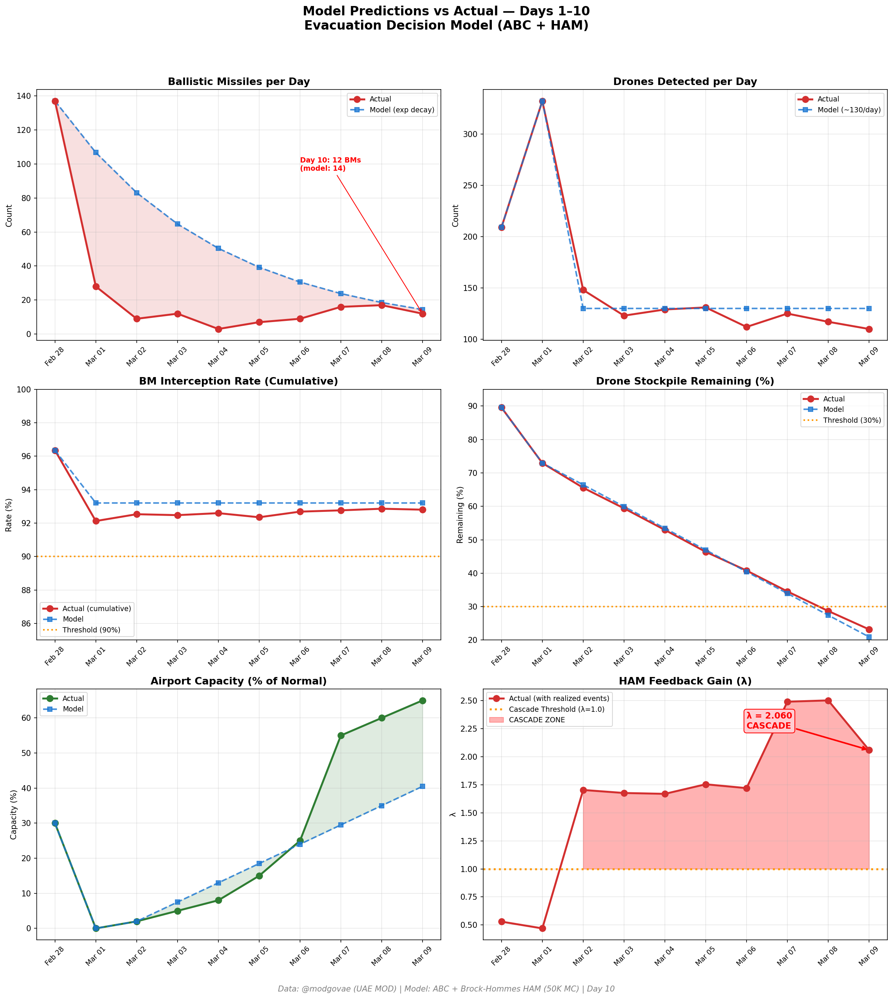
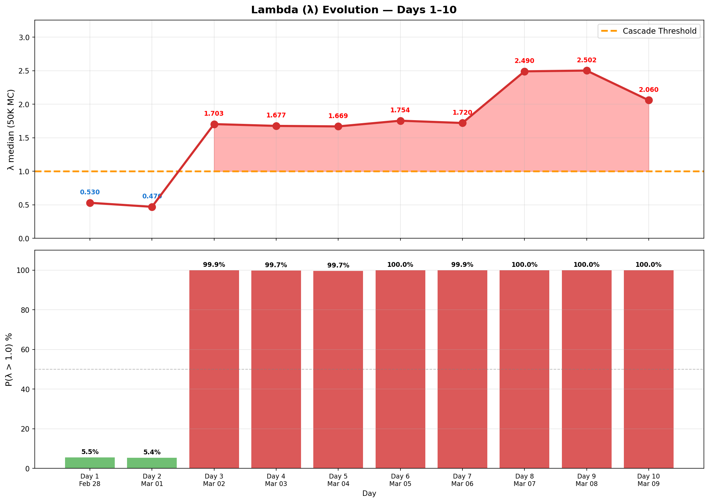

# 第10天更新 — 2026年3月9日

> 🌐 [English](../../updates/day10-march9.md) | **中文**

**状态：不稳定** | **突破：2/5** | **λ中位数 = 2.061**

---

## 新数据

| 指标 | 第9天 | 第10天 | 累计 |
|------|-------|-------|------|
| 弹道导弹 | 17 | **12** | **250** |
| 弹道导弹拦截 | 16 | 11 | 232 |
| 无人机探测 | 117 | ~110 | ~1536 |
| 无人机拦截 | 113 | 105 | ~1472 |
| 巡航导弹 | 0 | 0 | 8 |
| 弹道导弹拦截率（累计） | — | — | 92.8% |
| 无人机库存剩余 | — | — | 23.2%（464/2000） |

**关键事件：**
- 12 BMs detected — first daily decline in 5 days, breaks rebound trend
- 2 injured in Abu Dhabi from interception debris
- WTI surges past $103; Brent touches $119 intraday
- Polymarket ceasefire odds crash to 24% (from 59%)
- Air Arabia resumes; Emirates targeting 100% capacity

---

## Lambda重新计算

```
λ = 1.0
  + λ_发射装置         = -0.544
  + λ_无人机          = +0.154
  + λ_拦截           = +0.001
  + λ_霍尔木兹         = +0.630
  + λ_代理人          = +0.500
  + λ_武器           = +0.400
  + λ_弹道反弹         = +0.000
  + λ_海军威慑         = -0.200
  ────────────────────────────
  λ 中位数       = 2.061（50K蒙特卡罗）
```

| 指标 | 数值 |
|------|------|
| λ 中位数 | **2.061** |
| λ 第95百分位 | **2.770** |
| P(λ > 1.0) | **100.0%** |
| P(λ > 1.5) | **96.2%** |
| P(λ > 2.0) | **56.7%** |
| 判定 | **不稳定** |
| 突破数 | **2/5** |

---

## 图表





---

## 建议

**立即撤离。** 系统处于级联区域。

---

## 数据来源

| 来源 | 类型 |
|------|------|
| @modgovae (X.com) | 阿联酋国防部每日更新 |
| 模型管线 | ABC + HAM (50K MC) |
| 生成时间 | 2026-03-09 22:28 |
