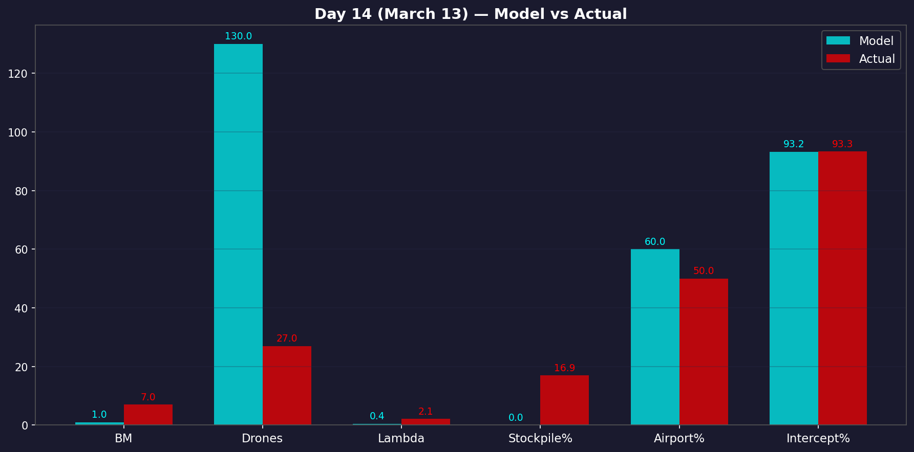
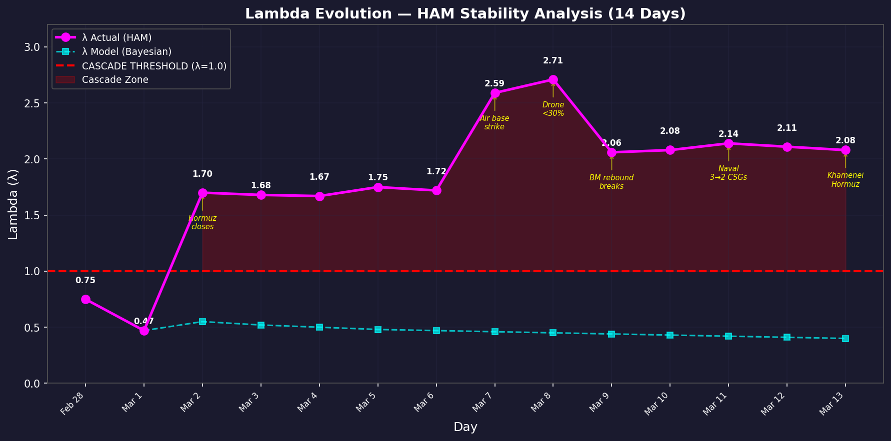

# 第14天更新 — 2026年3月13日

> 🌐 [English](../../updates/day14-march13.md) | **中文**

**状态：不稳定** | **突破：2/5** | **λ中位数 = 2.080**

---

## 新数据

| 指标 | 第13天 | 第14天 | 累计 |
|------|--------|--------|------|
| 弹道导弹 | 10 | **7** | **282** |
| 弹道拦截 | 10 | ~7 | ~263 |
| 无人机探测 | ~26 | ~27 | ~1663 |
| 无人机拦截 | ~20 | ~21 | ~1577 |
| 巡航导弹 | 0 | 0 | 15 |
| 弹道拦截率（累计） | — | — | 93.3% |
| 无人机库存 | — | — | 16.9%（337/2000） |

**@modgovae官方（2026年3月13日晚8:51）：** "阿联酋防空部队应对伊朗弹道导弹、巡航导弹和无人机攻击。" 累计据Gulf News第14天直播：285枚弹道导弹、15枚巡航导弹、1567架无人机。

**关键事件：**
- 弹道下降：10→7，恢复三天下降趋势（12→9→6→10→**7**）
- 无人机稳定在历史低位：约27架——接近昨日的历史最低26架
- 无巡航导弹（连续第二天；第12天曾有7枚）
- 每日投射物总计34枚——**新历史最低**，超越第13天的36枚
- 拦截残骸击中迪拜国际金融中心（DIFC）创新中心大楼——迪拜媒体办公室确认**无人受伤**
- 穆杰塔巴·哈梅内伊（新最高领袖）首次公开声明：誓言霍尔木兹海峡将继续关闭作为"施压工具"
- 伊朗驻联合国大使数小时后矛盾哈梅内伊说法——信号混乱
- 美军KC-135加油机在西伊拉克执行"史诗之怒"行动时坠毁——6人中4人阵亡；伊拉克伊斯兰抵抗组织声称负责（美军中央司令部称非敌方火力）
- 油价反弹：布伦特约$99/桶，WTI约$95——抹去国际能源署储备释放大部分降幅
- 沙特击落10+架瞄准东部和中部省份的无人机
- 以色列对德黑兰发动新一轮大规模打击
- 阿联酋能源部长确认能源供应稳定，国家能源系统正常运行

---

## Lambda重新计算

```
λ = 1.0
  + λ_发射装置           = -0.544
  + λ_无人机              = +0.168
  + λ_拦截                = -0.004
  + λ_霍尔木兹            = +0.630
  + λ_代理人              = +0.500
  + λ_武器                = +0.400
  + λ_弹道反弹            = +0.000
  + λ_海军威慑            = -0.128
  ──────────────────────────────
  λ 中位数           = 2.080（50K蒙特卡洛）
```

| 指标 | 值 |
|------|------|
| λ 中位数 | **2.080** |
| λ 95分位 | **2.780** |
| P(λ > 1.0) | **100.0%** |
| P(λ > 1.5) | **97.5%** |
| P(λ > 2.0) | **56.8%** |
| 判定 | **不稳定** |
| 突破 | **2/5**（发射装置、无人机库存） |

---

## 第13天→第14天变化

```
第13天 → 第14天 Lambda分解：

分量               第13天           第14天              变化
─────────────────────────────────────────────────────────────────
λ_发射装置         -0.544           -0.544               0.000  （消耗率维持~99%）
λ_无人机           +0.165           +0.168              +0.003  （库存18.2%→16.9%）
λ_拦截             -0.002           -0.004              -0.002  （累计率改善93.1%→93.3%）
λ_代理人           +0.500           +0.500               0.000  仍活跃（伊拉克代理声称KC-135）
λ_霍尔木兹         +0.630           +0.630               0.000  哈梅内伊明确确认关闭
λ_武器             +0.400           +0.400               0.000  无新武器类型
λ_弹道反弹         +0.000           +0.000               0.000  10→7继续下降
λ_海军威慑         -0.128           -0.128               0.000  2个航母战斗群，未变
─────────────────────────────────────────────────────────────────
λ 合计（中位数）    2.110            2.080              -0.030
```

**净评估：** λ从2.110降至2.080。系统仍处于级联区域，但趋势连续第三天边际改善（2.141→2.110→2.080）。攻击量创新低（34枚总量）。然而哈梅内伊明确的霍尔木兹声明和油价反弹至$99表明主导λ的结构性不稳定因素依然牢固。

---

## 防御成本更新

| 类别 | 拦截数 | 系统 | 1:1成本（$M） | 1:2成本（$M） |
|------|--------|------|--------------|--------------|
| 弹道（THAAD，60%） | 158 | THAAD @ $12.7M | $2,007 | $4,013 |
| 弹道（PAC-3，40%） | 105 | PAC-3 @ $3.9M | $410 | $819 |
| 巡航导弹 | 15 | PAC-3 @ $3.9M | $59 | $117 |
| 无人机 | ~1,577 | SHORAD @ $0.7M | $1,104 | $2,208 |
| **合计** | **~1,855** | | **$3,579** | **$7,157** |

### 石油收入损失（累计，霍尔木兹关闭12天）

| 项目 | 产量 | 收入损失 |
|------|------|---------|
| 滞留石油（无霍尔木兹） | 170万桶/天 × 12天 × $95 | **$19.38亿** |
| 自愿减产 | 50万桶/天 × 12天 × $95 | **$5.70亿** |
| **石油总损失** | | **$25.08亿** |

### 阿联酋总成本（第14天）

| 场景 | 防御 | 石油损失 | **总计** |
|------|------|---------|---------|
| 1:1 | $35.79亿 | $25.08亿 | **$60.87亿** |
| 1:2 | $71.57亿 | $25.08亿 | **$96.65亿** |
| 1:3 | $107.36亿 | $25.08亿 | **$132.44亿** |

---

## 图表





---

## 建议

**立即撤离。** 系统仍处于级联区域（λ = 2.080，P(λ>1) = 100%）。

**第14天关键动态：**
- **正面：** 弹道恢复下降（10→7），确认第13天升高为噪声。累计拦截率改善至93.3%——第4天以来最佳。总攻击量创**新历史最低**（34枚）。零战斗死亡。DIFC残骸事件无人受伤。阿联酋能源部长确认能源供应稳定。攻击量较峰值下降约90%。
- **负面：** 穆杰塔巴·哈梅内伊作为新最高领袖的首次公开声明**明确确认霍尔木兹继续关闭**——消除近期重新开放的任何模糊性。油价反弹至约$99/桶，抹去国际能源署干预成果。KC-135加油机在伊拉克坠毁致4名美军死亡。停火概率继续下降（约17%）。
- **DIFC残骸事件：** 拦截攻击的残骸落在迪拜国际金融中心创新中心——无人受伤，但证明即使成功拦截也对城市区域构成风险。连续两天迪拜市中心出现残骸/无人机事件。
- **油价反弹：** 哈梅内伊声明后布伦特重回$100附近。IEA创纪录的4亿桶储备释放（第12天）仅2天就丧失约75%的价格影响。市场定价霍尔木兹长期关闭。
- **撤离窗口：** 机场运力约50%。持续低攻击量维持**战术平静撤离窗口**。哈梅内伊声明表明无近期缓和信号。趁攻击量低时立即离开。

---

## 来源

| 来源 | 类型 |
|------|------|
| [@modgovae](https://x.com/modgovae/status/2032439385149604064) | 阿联酋国防部更新（3月13日晚8:51） |
| [Gulf News — 第14天直播](https://gulfnews.com/uae/us-israel-war-on-iran-day-14-us-refuelling-aircraft-crashes-in-iraq-iran-threatens-gulf-energy-sites-1.500472879) | 每日态势 |
| [Al Jazeera — 第14天](https://www.aljazeera.com/news/2026/3/13/iran-war-what-is-happening-on-day-14-of-us-israel-attacks) | 区域背景 |
| [The National — DIFC残骸](https://www.thenationalnews.com/news/uae/2026/03/13/debris-hits-dubai-building-after-air-strike-intercepted-as-more-alerts-issued/) | 迪拜残骸事件 |
| [NBC News — 哈梅内伊霍尔木兹](https://www.nbcnews.com/world/iran/live-blog/live-updates-iran-war-oil-ship-attacks-hormuz-trump-israel-lebanon-rcna263101) | 哈梅内伊声明 |
| [CNBC — KC-135坠毁](https://www.cnbc.com/2026/03/13/us-kc135-crash-iraq-iran-threats-shipping-attacks.html) | 美军坠机 |
| [Polymarket](https://polymarket.com/event/us-x-iran-ceasefire-by) | 停火概率 |
| 模型管道 | ABC + HAM（50K MC） |
| 生成日期 | 2026-03-14 |
