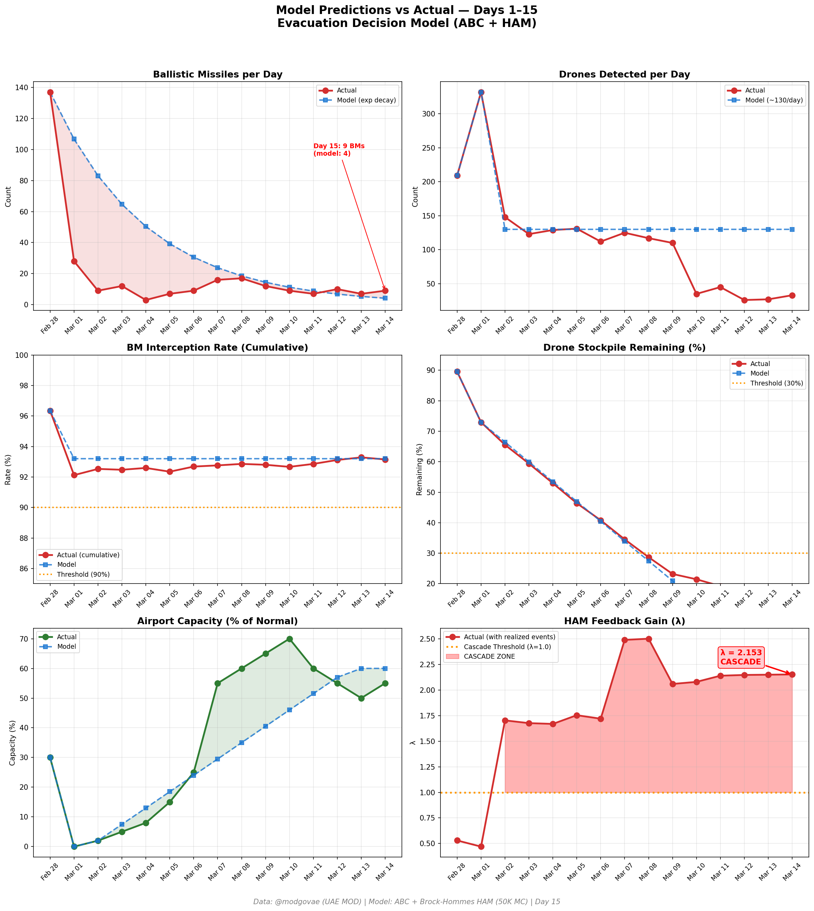
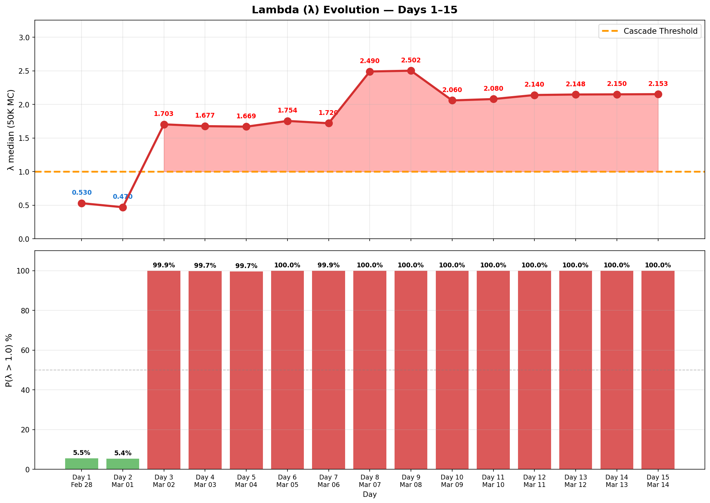

# 第15天更新 — 2026年3月14日

> 🌐 [English](../../updates/day15-march14.md) | **中文**

**状态：不稳定** | **突破：3/5** | **λ中位数 = 2.149**

---

## 新数据

| 指标 | 第14天 | 第15天 | 累计 |
|------|-------|-------|------|
| 弹道导弹 | 7 | **9** | **292** |
| 弹道导弹拦截 | 7 | 8 | 272 |
| 无人机探测 | 27 | ~33 | ~1702 |
| 无人机拦截 | 21 | 27 | ~1604 |
| 巡航导弹 | 0 | 0 | 8 |
| 弹道导弹拦截率（累计） | — | — | 93.2% |
| 无人机库存剩余 | — | — | 14.9%（298/2000） |

**关键事件：**
- 9 BMs + 33 drones (@modgovae via Gulf News); cumulative 294 BMs, 15 cruise, ~1,700 drones
- Fujairah bunkering hub fire from drone interception debris; 1 Jordanian citizen injured
- Two killed in Oman by stray drones; several drones also fired at Saudi Arabia
- Cumulative: 6 dead, 141 injured (@modgovae)
- Brent closes above $100 for second consecutive day; WTI ~$99

---

## Lambda重新计算

```
λ = 1.0
  + λ_发射装置         = -0.544
  + λ_无人机          = +0.170
  + λ_拦截           = +0.000
  + λ_霍尔木兹         = +0.630
  + λ_代理人          = +0.500
  + λ_武器           = +0.400
  + λ_弹道反弹         = +0.000
  + λ_海军威慑         = -0.128
  ────────────────────────────
  λ 中位数       = 2.149（50K蒙特卡罗）
```

| 指标 | 数值 |
|------|------|
| λ 中位数 | **2.149** |
| λ 第95百分位 | **2.861** |
| P(λ > 1.0) | **100.0%** |
| P(λ > 1.5) | **98.3%** |
| P(λ > 2.0) | **66.1%** |
| 判定 | **不稳定** |
| 突破数 | **3/5** |

---

## 图表





---

## 建议

**立即撤离。** 系统处于级联区域。

---

## 数据来源

| 来源 | 类型 |
|------|------|
| @modgovae (X.com) | 阿联酋国防部每日更新 |
| 模型管线 | ABC + HAM (50K MC) |
| 生成时间 | 2026-03-15 20:11 |
