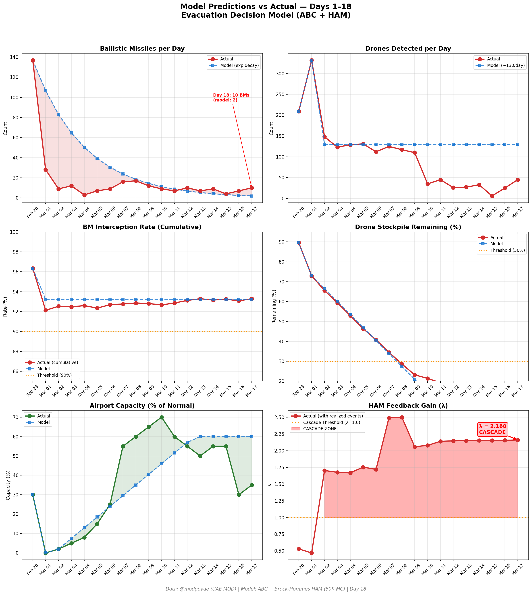
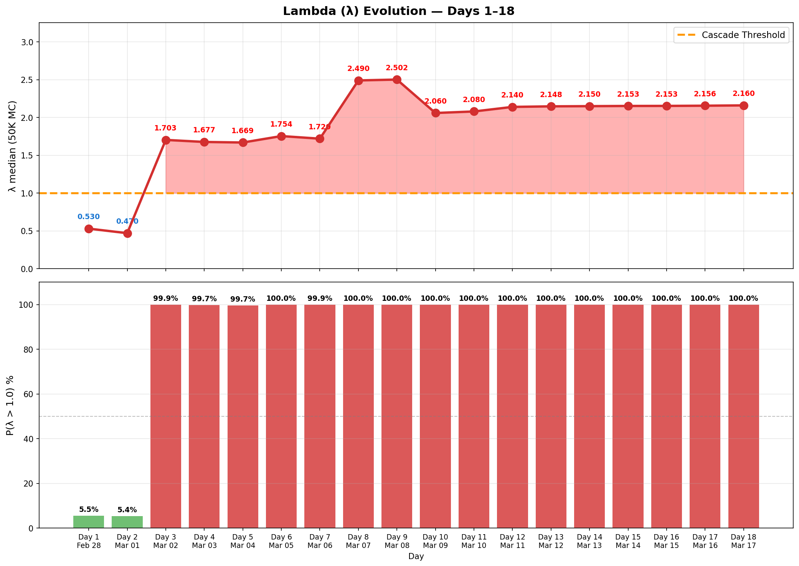

# 第18天更新 — 2026年3月17日

> 🌐 [English](../../updates/day18-march17.md) | **中文**

**状态：不稳定** | **突破：3/5** | **λ中位数 = 2.157**

---

## 新数据

| 指标 | 第17天 | 第18天 | 累计 |
|------|-------|-------|------|
| 弹道导弹 | 7 | **10** | **313** |
| 弹道导弹拦截 | 6 | 10 | 292 |
| 无人机探测 | 25 | ~45 | ~1778 |
| 无人机拦截 | 21 | 38 | ~1668 |
| 巡航导弹 | 0 | 0 | 8 |
| 弹道导弹拦截率（累计） | — | — | 93.3% |
| 无人机库存剩余 | — | — | 11.1%（222/2000） |

**关键事件：**
- @modgovae: 10 BMs intercepted, 45 drones detected; cumulative 314 BMs, 1,672 drones, 15 cruise
- Pakistani citizen killed by interception debris in Baniyas, Abu Dhabi (8th death total)
- UAE airspace closed early morning, reopened by 5am; flights gradually resumed
- Fujairah Oil Industry Zone fire from drone attack; no casualties
- HRW condemns Iran unlawful strikes across Gulf endangering civilians
- ~90 ships crossed Hormuz since war began; selective Iran-permitted transit emerging

---

## Lambda重新计算

```
λ = 1.0
  + λ_发射装置         = -0.544
  + λ_无人机          = +0.178
  + λ_拦截           = +0.000
  + λ_霍尔木兹         = +0.630
  + λ_代理人          = +0.500
  + λ_武器           = +0.400
  + λ_弹道反弹         = +0.000
  + λ_海军威慑         = -0.128
  ────────────────────────────
  λ 中位数       = 2.157（50K蒙特卡罗）
```

| 指标 | 数值 |
|------|------|
| λ 中位数 | **2.157** |
| λ 第95百分位 | **2.869** |
| P(λ > 1.0) | **100.0%** |
| P(λ > 1.5) | **98.4%** |
| P(λ > 2.0) | **66.9%** |
| 判定 | **不稳定** |
| 突破数 | **3/5** |

---

## 图表





---

## 建议

**立即撤离。** 系统处于级联区域。

---

## 数据来源

| 来源 | 类型 |
|------|------|
| @modgovae (X.com) | 阿联酋国防部每日更新 |
| 模型管线 | ABC + HAM (50K MC) |
| 生成时间 | 2026-03-18 23:07 |
