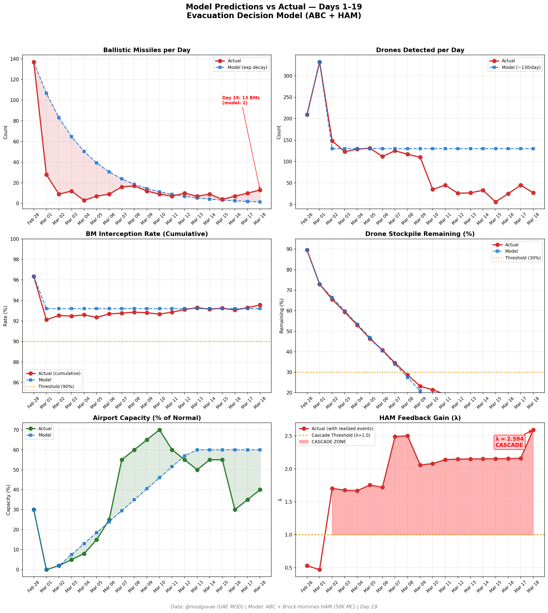
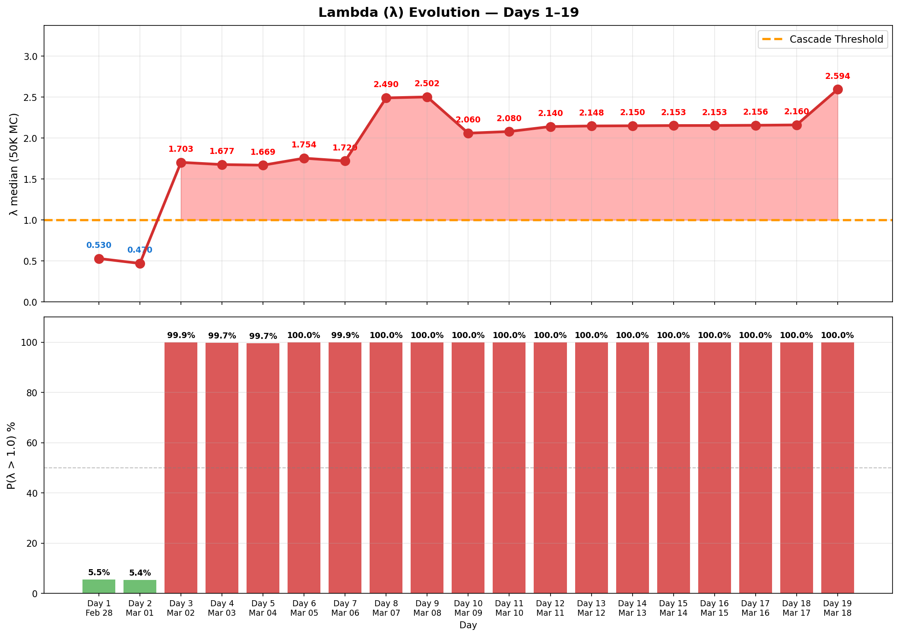

# 第19天更新 — 2026年3月18日

> 🌐 [English](../../updates/day19-march18.md) | **中文**

**状态：不稳定** | **突破：1/5** | **λ中位数 = 2.596**

---

## 新数据

| 指标 | 第18天 | 第19天 | 累计 |
|------|-------|-------|------|
| 弹道导弹 | 10 | **13** | **326** |
| 弹道导弹拦截 | 10 | 13 | 305 |
| 无人机探测 | 45 | ~27 | ~1805 |
| 无人机拦截 | 38 | 22 | ~1690 |
| 巡航导弹 | 0 | 0 | 8 |
| 弹道导弹拦截率（累计） | — | — | 93.6% |
| 无人机库存剩余 | — | — | 9.8%（195/2000） |

**关键事件：**
- @modgovae: 13 BMs intercepted, 27 drones; cumulative 327 BMs, 1,699 drones, 15 cruise
- Brent surges to $108.78 (+$5.80); WTI at $94; VLCC rates hit record $423K-445K/day
- Iran allowing more ships through Hormuz; selective transit expanding (~90 since war began)
- Fed begins two-day policy meeting amid oil price surge concerns
- Emirates operating limited schedule to 110 destinations; most intl carriers still suspended

---

## Lambda重新计算

```
λ = 1.0
  + λ_发射装置         = -0.413
  + λ_无人机          = +0.180
  + λ_拦截           = +0.000
  + λ_霍尔木兹         = +0.630
  + λ_代理人          = +0.500
  + λ_武器           = +0.400
  + λ_弹道反弹         = +0.300
  + λ_海军威慑         = -0.128
  ────────────────────────────
  λ 中位数       = 2.596（50K蒙特卡罗）
```

| 指标 | 数值 |
|------|------|
| λ 中位数 | **2.596** |
| λ 第95百分位 | **3.318** |
| P(λ > 1.0) | **100.0%** |
| P(λ > 1.5) | **100.0%** |
| P(λ > 2.0) | **96.6%** |
| 判定 | **不稳定** |
| 突破数 | **1/5** |

---

## 图表





---

## 建议

**立即撤离。** 系统处于级联区域。

---

## 数据来源

| 来源 | 类型 |
|------|------|
| @modgovae (X.com) | 阿联酋国防部每日更新 |
| 模型管线 | ABC + HAM (50K MC) |
| 生成时间 | 2026-03-18 23:07 |
