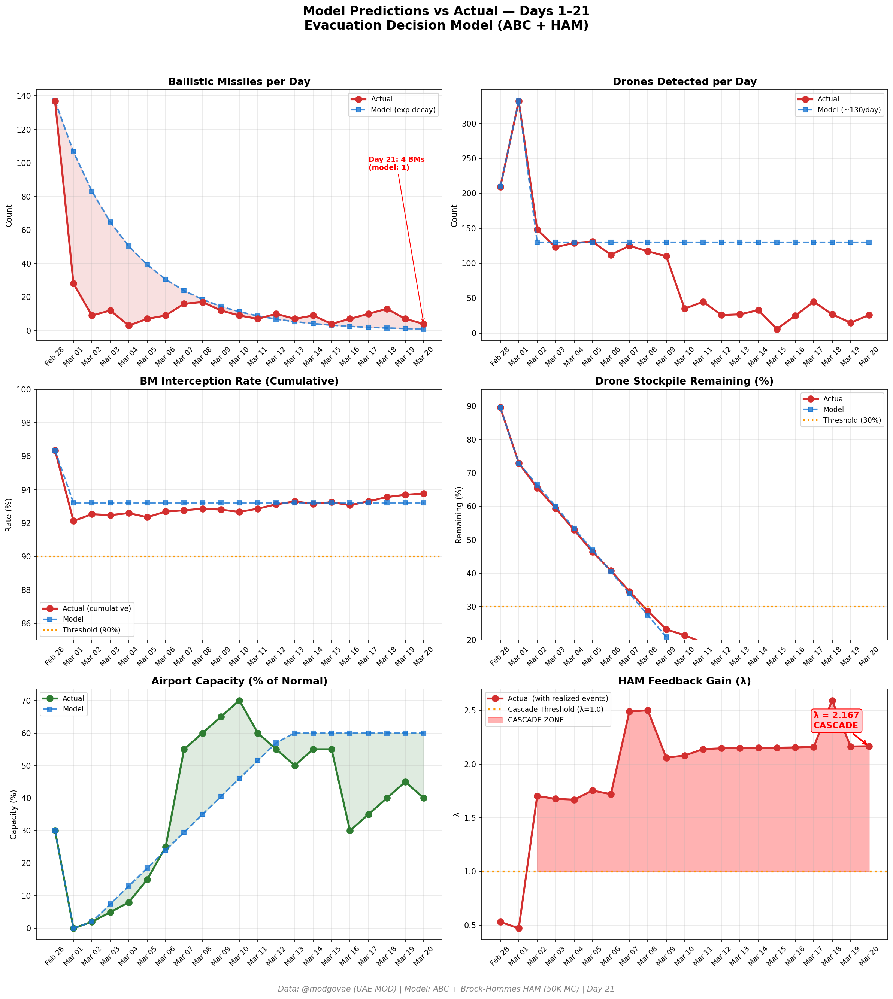

# 第21天更新 — 2026年3月20日

> 🌐 [English](../../updates/day21-march20.md) | **中文**

**状态：不稳定** | **突破：2/5** | **λ中位数 = 2.163**

---

## 新数据

| 指标 | 第20天 | 第21天 | 累计 |
|------|-------|-------|------|
| 弹道导弹 | 7 | **4** | **337** |
| 弹道导弹拦截 | 7 | 4 | 316 |
| 无人机探测 | 15 | ~26 | ~1846 |
| 无人机拦截 | 13 | 22 | ~1725 |
| 巡航导弹 | 0 | 0 | 8 |
| 弹道导弹拦截率（累计） | — | — | 93.8% |
| 无人机库存剩余 | — | — | 7.7%（154/2000） |

**关键事件：**
- @modgovae: 4 BMs intercepted, 26 drones detected (~22 intercepted); cumulative 338 BMs, 15 cruise, 1,740 drones
- Eid al-Fitr — conflict continues through holiday; no ceasefire despite diplomatic hopes
- Foreign airlines remain banned from DXB since Mar 17; only Emirates and flydubai operating (~40% capacity)
- US weighs releasing sanctioned Iranian crude to ease oil prices (CNBC)
- Brent drops to ~$107 (from $113 close); WTI ~$97; Citi raises forecast to $120 near-term
- Polymarket ceasefire-by-Mar-31 odds collapse to 8% (from 10%)
- Hormuz selective transits continue expanding; ~15 vessels through today; IMO emergency talks ongoing
- Cumulative: 8 dead, ~161 injured (@modgovae)

---

## Lambda重新计算

```
λ = 1.0
  + λ_发射装置         = -0.544
  + λ_无人机          = +0.185
  + λ_拦截           = +0.000
  + λ_霍尔木兹         = +0.630
  + λ_代理人          = +0.500
  + λ_武器           = +0.400
  + λ_弹道反弹         = +0.000
  + λ_海军威慑         = -0.128
  ────────────────────────────
  λ 中位数       = 2.163（50K蒙特卡罗）
```

| 指标 | 数值 |
|------|------|
| λ 中位数 | **2.163** |
| λ 第95百分位 | **2.876** |
| P(λ > 1.0) | **100.0%** |
| P(λ > 1.5) | **98.5%** |
| P(λ > 2.0) | **67.6%** |
| 判定 | **不稳定** |
| 突破数 | **2/5** |

---

## 图表




---

## 建议

**立即撤离。** 系统处于级联区域。

---

## 数据来源

| 来源 | 类型 |
|------|------|
| @modgovae (X.com) | 阿联酋国防部每日更新 |
| 模型管线 | ABC + HAM (50K MC) |
| 生成时间 | 2026-03-20 23:06 |
