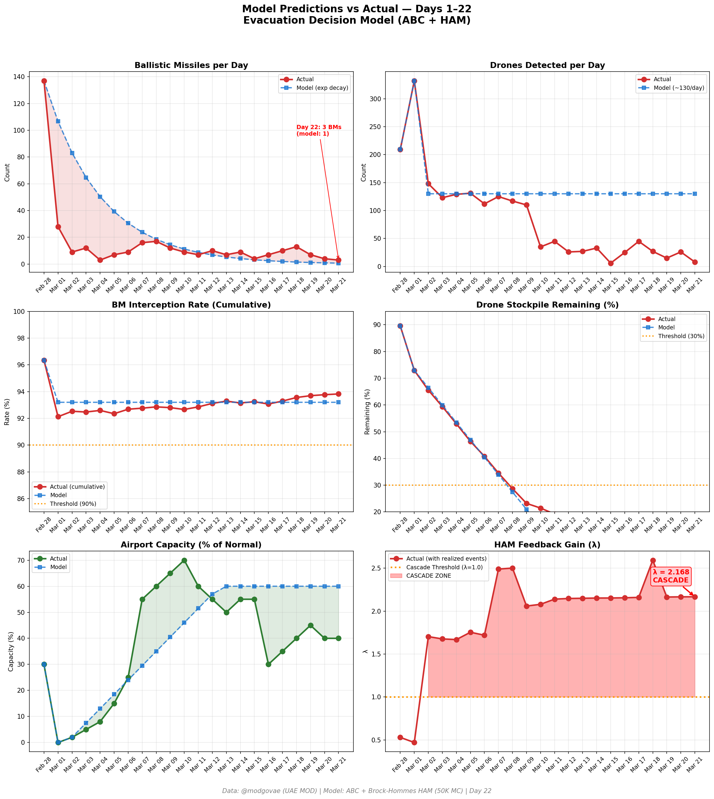
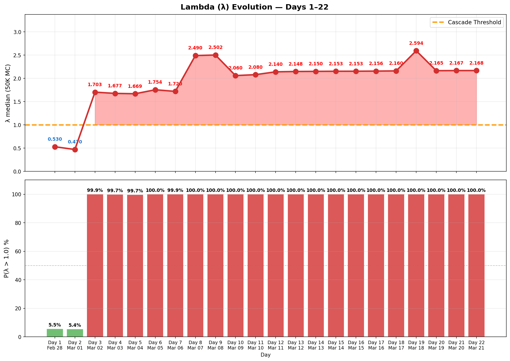

# 第22天更新 — 2026年3月21日

> 🌐 [English](../../updates/day22-march21.md) | **中文**

**状态：不稳定** | **突破：2/5** | **λ中位数 = 2.164**

---

## 新数据

| 指标 | 第21天 | 第22天 | 累计 |
|------|-------|-------|------|
| 弹道导弹 | 4 | **3** | **340** |
| 弹道导弹拦截 | 4 | 3 | 319 |
| 无人机探测 | 26 | ~8 | ~1854 |
| 无人机拦截 | 22 | 6 | ~1731 |
| 巡航导弹 | 0 | 0 | 8 |
| 弹道导弹拦截率（累计） | — | — | 93.8% |
| 无人机库存剩余 | — | — | 7.3%（146/2000） |

**关键事件：**
- @modgovae: 3 BMs intercepted, 8 drones detected; cumulative 341 BMs, 15 cruise, 1,748 drones
- US strikes Natanz uranium enrichment facility with bunker busters — second attack on nuclear site; IAEA reports no radiation leak
- Iran offers Japan safe passage through Hormuz — selective blockade expanding to China, India, Pakistan, and now Japan
- Iran fires 2 BMs at Diego Garcia (UK-US base in Indian Ocean) — unsuccessful per UK officials
- Trump says mulling 'winding down' the Iran war despite continued strikes
- Brent ~$107 (down from $113 peak); WTI ~$95; VLCC rates declining as tankers flee Gulf
- Cumulative: 8 dead, ~160 injured (@modgovae); no new casualties today

---

## Lambda重新计算

```
λ = 1.0
  + λ_发射装置         = -0.544
  + λ_无人机          = +0.185
  + λ_拦截           = +0.000
  + λ_霍尔木兹         = +0.630
  + λ_代理人          = +0.500
  + λ_武器           = +0.400
  + λ_弹道反弹         = +0.000
  + λ_海军威慑         = -0.128
  ────────────────────────────
  λ 中位数       = 2.164（50K蒙特卡罗）
```

| 指标 | 数值 |
|------|------|
| λ 中位数 | **2.164** |
| λ 第95百分位 | **2.877** |
| P(λ > 1.0) | **100.0%** |
| P(λ > 1.5) | **98.5%** |
| P(λ > 2.0) | **67.7%** |
| 判定 | **不稳定** |
| 突破数 | **2/5** |

---

## 图表





---

## 建议

**立即撤离。** 系统处于级联区域。

---

## 数据来源

| 来源 | 类型 |
|------|------|
| @modgovae (X.com) | 阿联酋国防部每日更新 |
| 模型管线 | ABC + HAM (50K MC) |
| 生成时间 | 2026-03-21 23:07 |
