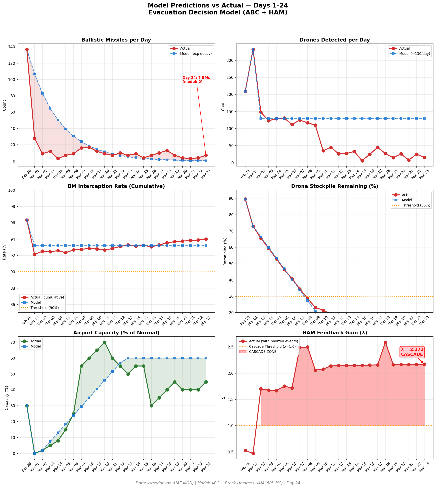
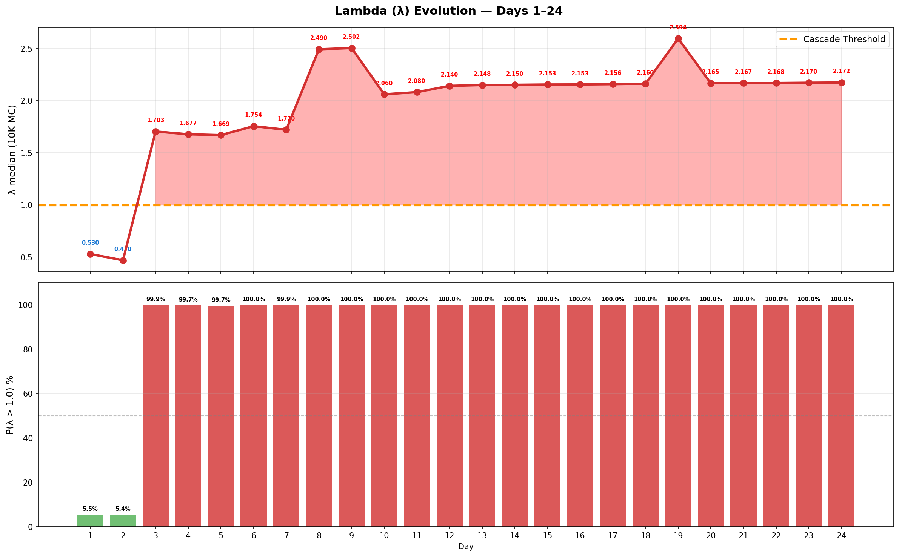

# 第24天更新 — 2026年3月23日

> 🌐 [English](../../updates/day24-march23.md) | **中文**

**状态：不稳定** | **突破：2/5** | **λ中位数 = 2.168**

---

## 新数据

| 指标 | 第23天 | 第24天 | 累计 |
|------|-------|-------|------|
| 弹道导弹 | 4 | **7** | **351** |
| 弹道导弹拦截 | 4 | 7 | 330 |
| 无人机探测 | 25 | ~16 | ~1895 |
| 无人机拦截 | 21 | 14 | ~1766 |
| 巡航导弹 | 0 | 0 | 8 |
| 弹道导弹拦截率（累计） | — | — | 94.0% |
| 无人机库存剩余 | — | — | 5.2%（105/2000） |

**关键事件：**
- @modgovae: 7 BMs intercepted, 16 drones detected; cumulative 352 BMs, 15 cruise, 1,789 drones
- Trump postpones 48-hour Hormuz ultimatum, citing 'very good and productive conversations' with Iran
- Iran denies any direct talks; state media claims Trump 'retreated out of fear of Iran's response'
- Oil crashes: WTI plunges >10% to $88.13; Brent falls to ~$100 (Trump de-escalation signal + prior IEA release effect)
- ADNOC CEO calls Iran Hormuz attacks 'economic terrorism against every nation'
- Emirates + flydubai operating 198 flights from DXB; missile warning issued but flights continued normally
- Polymarket ceasefire-by-Mar-31 odds spike from 8% to ~12% on diplomatic hopes
- Selective Hormuz transits continue expanding; ~22 vessels/day

---

## Lambda重新计算

```
λ = 1.0
  + λ_发射装置         = -0.544
  + λ_无人机          = +0.190
  + λ_拦截           = +0.000
  + λ_霍尔木兹         = +0.630
  + λ_代理人          = +0.500
  + λ_武器           = +0.400
  + λ_弹道反弹         = +0.000
  + λ_海军威慑         = -0.128
  ────────────────────────────
  λ 中位数       = 2.168（50K蒙特卡罗）
```

| 指标 | 数值 |
|------|------|
| λ 中位数 | **2.168** |
| λ 第95百分位 | **2.881** |
| P(λ > 1.0) | **100.0%** |
| P(λ > 1.5) | **98.6%** |
| P(λ > 2.0) | **68.1%** |
| 判定 | **不稳定** |
| 突破数 | **2/5** |

---

## 图表





---

## 建议

**立即撤离。** 系统处于级联区域。

---

## 数据来源

| 来源 | 类型 |
|------|------|
| @modgovae (X.com) | 阿联酋国防部每日更新 |
| 模型管线 | ABC + HAM (50K MC) |
| 生成时间 | 2026-03-24 09:41 |
