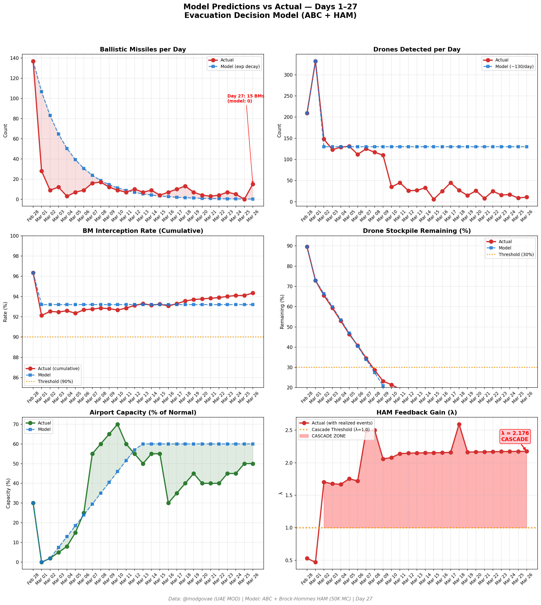
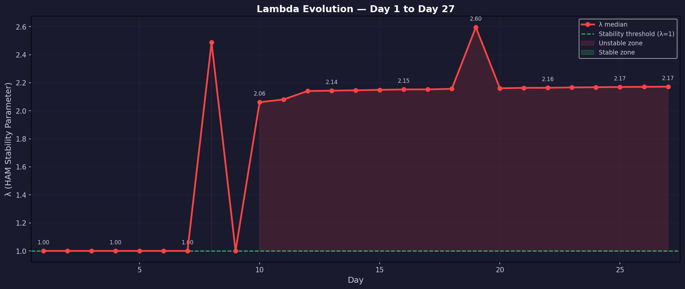

# 第27天更新 — 2026年3月26日

> 🌐 [English](../../updates/day27-march26.md) | **中文**

**状态：不稳定** | **突破：2/5** | **λ中位数 = 2.172**

---

## 新数据

| 指标 | 第26天 | 第27天 | 累计 |
|------|-------|-------|------|
| 弹道导弹 | 0 | **15** | **371** |
| 弹道导弹拦截 | 0 | 15 | 350 |
| 无人机探测 | 9 | ~11 | ~1932 |
| 无人机拦截 | 7 | 9 | ~1796 |
| 巡航导弹 | 0 | 0 | 8 |
| 弹道导弹拦截率（累计） | — | — | 94.3% |
| 无人机库存剩余 | — | — | 3.4%（68/2000） |

**关键事件：**
- @modgovae: 15 BMs intercepted, 11 drones detected; cumulative 372 BMs, 15 cruise, 1,826 drones
- MASSIVE BM REBOUND: 0→15 — largest single-day BM surge since Day 1; shatters Day 26 'zero BM' milestone
- 2 killed in Abu Dhabi: Indian + Pakistani killed by intercepted missile debris on Sweihan Road; 3 injured
- Jebel Ali Port fire from interception debris — no injuries; Dubai Civil Defense responds
- DXB Terminal 3 arrivals roof hit by drone debris early morning; temporary shutdown then resumed
- Iran formally rejects direct US talks; oil rebounds: WTI +3.6% to $93.61, Brent +3.8% to $106.12
- Houthis signal readiness to join Iran war if needed — new escalation risk
- Emirates + flydubai operating ~207 departures; DXB ~50% capacity
- Hormuz selective transit continues; Iran formalizes crew/cargo manifest + IRGC approval system; ~5 vessels transited
- Polymarket ceasefire-by-Mar-31 steady at ~17%; insider trading scrutiny continues
- Cumulative: 11 dead, ~169 injured

---

## Lambda重新计算

```
λ = 1.0
  + λ_发射装置         = -0.544
  + λ_无人机          = +0.193
  + λ_拦截           = +0.000
  + λ_霍尔木兹         = +0.630
  + λ_代理人          = +0.500
  + λ_武器           = +0.400
  + λ_弹道反弹         = +0.000
  + λ_海军威慑         = -0.128
  ────────────────────────────
  λ 中位数       = 2.172（50K蒙特卡罗）
```

| 指标 | 数值 |
|------|------|
| λ 中位数 | **2.172** |
| λ 第95百分位 | **2.885** |
| P(λ > 1.0) | **100.0%** |
| P(λ > 1.5) | **98.6%** |
| P(λ > 2.0) | **68.4%** |
| 判定 | **不稳定** |
| 突破数 | **2/5** |

---

## 图表





---

## 建议

**立即撤离。** 系统处于级联区域。

---

## 数据来源

| 来源 | 类型 |
|------|------|
| @modgovae (X.com) | 阿联酋国防部每日更新 |
| 模型管线 | ABC + HAM (50K MC) |
| 生成时间 | 2026-03-26 23:15 |
