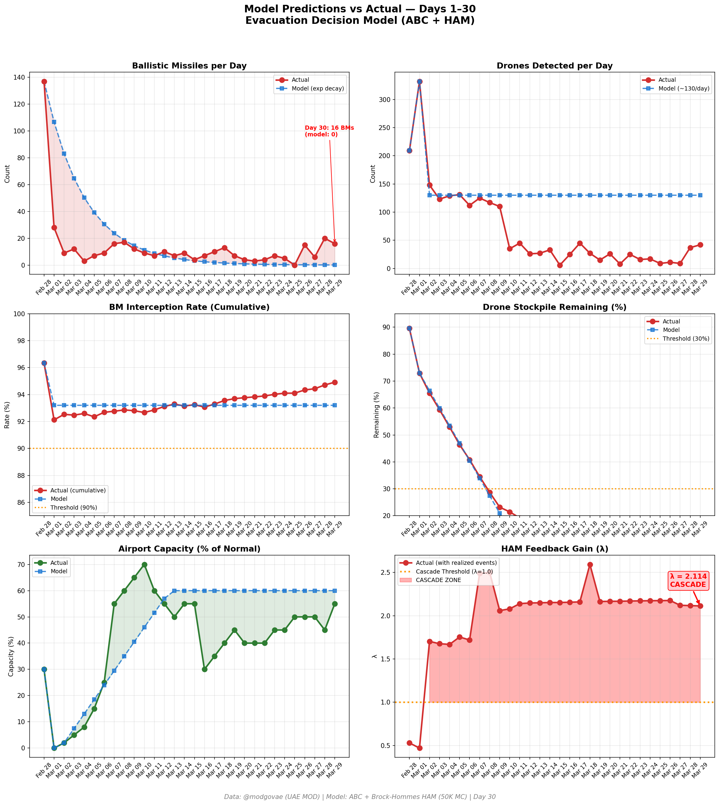

# 第30天更新 — 2026年3月29日

> 🌐 [English](../../updates/day30-march29.md) | **中文**

**状态：不稳定** | **突破：2/5** | **λ中位数 = 2.110**

---

## 新数据

| 指标 | 第29天 | 第30天 | 累计 |
|------|-------|-------|------|
| 弹道导弹 | 20 | **16** | **413** |
| 弹道导弹拦截 | 20 | 16 | 392 |
| 无人机探测 | 37 | ~42 | ~2020 |
| 无人机拦截 | 33 | 37 | ~1873 |
| 巡航导弹 | 0 | 0 | 8 |
| 弹道导弹拦截率（累计） | — | — | 94.9% |
| 无人机库存剩余 | — | — | -1.0%（-20/2000） |

**关键事件：**
- @modgovae: 16 BMs intercepted, 42 drones detected (37 intercepted, 5 fell UAE); cumulative 414 BMs, 15 cruise, 1,914 drones
- BM PATTERN STABILIZES: 20→16 (−20%); still elevated vs Day 28 low (6); volatile week: 0→15→6→20→16
- 0 new deaths; 1 minor injury from drone debris in Sharjah; cumulative: 12 dead, ~178 injured
- DXB improving to ~55% capacity; Emirates targeting full restoration; flydubai expanding schedule
- WTI holds near $100 (Sunday; $99.64 Friday close); Brent $112.57; markets closed for weekend
- Hormuz toll system stabilizing: ~3 selective transits (Chinese, Indian flagged); IRGC approval pipeline continues
- USS George H.W. Bush (3rd CSG) approaching theater; 3 carrier strike groups converging on region
- Polymarket ceasefire-by-Mar-31 drops to ~12% with only 2 days remaining; market pricing near-zero diplomacy odds
- Iran rejects all direct negotiation overtures; Pakistan/Oman backchannel continues
- War enters Day 30 — one full month of sustained Iranian strikes on UAE

---

## Lambda重新计算

```
λ = 1.0
  + λ_发射装置         = -0.544
  + λ_无人机          = +0.202
  + λ_拦截           = +0.000
  + λ_霍尔木兹         = +0.630
  + λ_代理人          = +0.500
  + λ_武器           = +0.400
  + λ_弹道反弹         = +0.000
  + λ_海军威慑         = -0.200
  ────────────────────────────
  λ 中位数       = 2.110（50K蒙特卡罗）
```

| 指标 | 数值 |
|------|------|
| λ 中位数 | **2.110** |
| λ 第95百分位 | **2.822** |
| P(λ > 1.0) | **100.0%** |
| P(λ > 1.5) | **97.4%** |
| P(λ > 2.0) | **61.7%** |
| 判定 | **不稳定** |
| 突破数 | **2/5** |

---

## 图表




---

## 建议

**立即撤离。** 系统处于级联区域。

---

## 数据来源

| 来源 | 类型 |
|------|------|
| @modgovae (X.com) | 阿联酋国防部每日更新 |
| 模型管线 | ABC + HAM (50K MC) |
| 生成时间 | 2026-03-29 23:05 |
