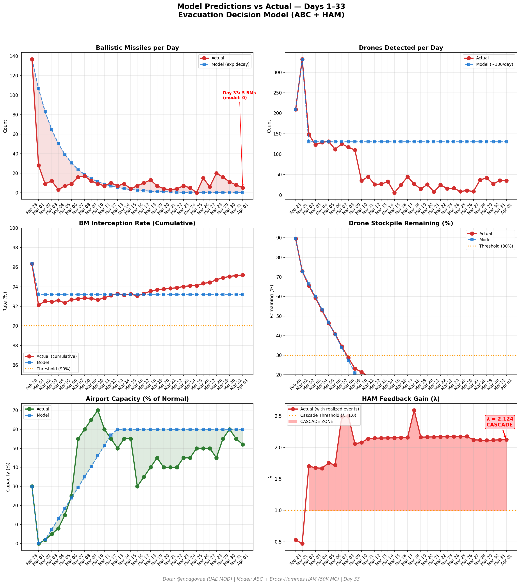
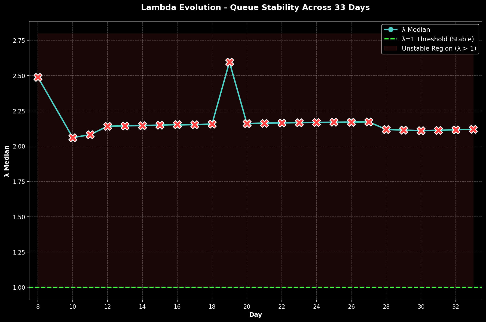

# 第33天更新 — 2026年4月1日

> 🌐 [English](../../updates/day33-april1.md) | **中文**

**状态：不稳定** | **突破：3/5** | **λ中位数 = 2.120**

---

## 新数据

| 指标 | 第32天 | 第33天 | 累计 |
|------|-------|-------|------|
| 弹道导弹 | 8 | **5** | **437** |
| 弹道导弹拦截 | 8 | 5 | 416 |
| 无人机探测 | 36 | ~35 | ~2118 |
| 无人机拦截 | 32 | 30 | ~1960 |
| 巡航导弹 | 4 | 0 | 12 |
| 弹道导弹拦截率（累计） | — | — | 95.2% |
| 无人机库存剩余 | — | — | -5.9%（-118/2000） |

**关键事件：**
- @modgovae: 5 BMs intercepted (all), 0 cruise missiles, 35 drones detected (~30 intercepted, ~5 fell UAE); cumulative 438 BMs, 19 cruise, 2,012 drones
- Bangladeshi national killed by intercepted drone debris falling on farm in Fujairah (Al Rifa'a area)
- Indian expat injured by drone debris in Umm Al Quwain (Umm Al Thaoub industrial zone)
- KUWAIT AIRPORT STRUCK: Iranian drone hits fuel tanks at Kuwait International Airport — aviation fuel facility fire; airport remains closed
- Trump says war could end in 'two to three weeks'; claims Iran's president asked for ceasefire — Tehran denies
- Trump plans address to nation on April 2; signals potential US military wind-down
- Iran rejects ceasefire claim; FM says Iran prepared for 'at least six months' of war
- Polymarket ceasefire-by-Mar-31 resolved NO; ceasefire-by-Apr-30 at ~59%
- Oil pulls back: WTI ~$100.45, Brent ~$104.86 (Brent -$5.83 from Day 32 on Trump de-escalation comments)
- DXB operating at ~52% capacity; Air France suspension through Mar 31 expired; Lufthansa suspended through May 31
- Hormuz selective transits continue; ~4 vessels; Iran toll booth system active
- Cumulative: ~13 dead, ~190 injured

---

## Lambda重新计算

```
λ = 1.0
  + λ_发射装置         = -0.544
  + λ_无人机          = +0.212
  + λ_拦截           = +0.000
  + λ_霍尔木兹         = +0.630
  + λ_代理人          = +0.500
  + λ_武器           = +0.400
  + λ_弹道反弹         = +0.000
  + λ_海军威慑         = -0.200
  ────────────────────────────
  λ 中位数       = 2.120（50K蒙特卡罗）
```

| 指标 | 数值 |
|------|------|
| λ 中位数 | **2.120** |
| λ 第95百分位 | **2.832** |
| P(λ > 1.0) | **100.0%** |
| P(λ > 1.5) | **97.6%** |
| P(λ > 2.0) | **62.8%** |
| 判定 | **不稳定** |
| 突破数 | **3/5** |

---

## 图表





---

## 建议

**立即撤离。** 系统处于级联区域。

---

## 数据来源

| 来源 | 类型 |
|------|------|
| @modgovae (X.com) | 阿联酋国防部每日更新 |
| 模型管线 | ABC + HAM (50K MC) |
| 生成时间 | 2026-04-01 23:06 |
