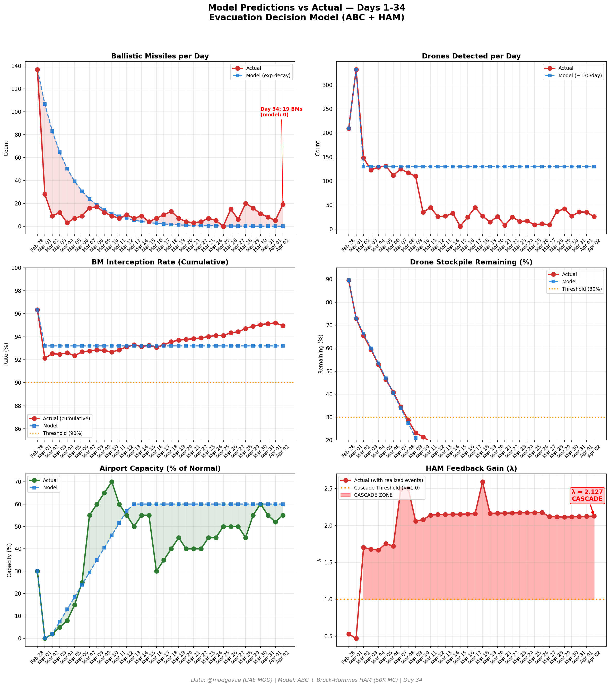
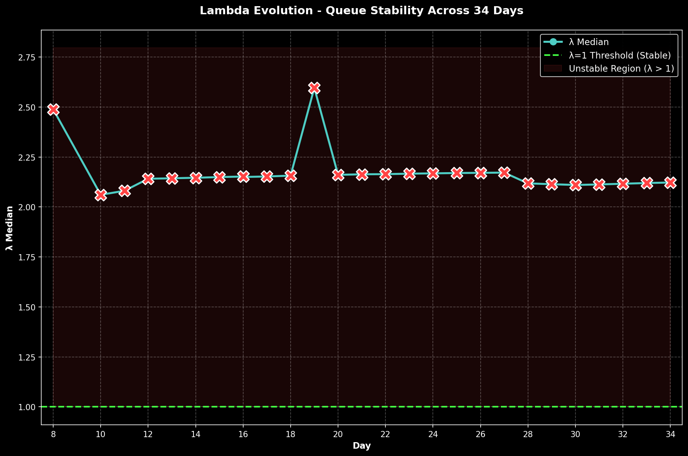

# 第34天更新 — 2026年4月2日

> 🌐 [English](../../updates/day34-april2.md) | **中文**

**状态：不稳定** | **突破：3/5** | **λ中位数 = 2.122**

---

## 新数据

| 指标 | 第33天 | 第34天 | 累计 |
|------|-------|-------|------|
| 弹道导弹 | 5 | **19** | **456** |
| 弹道导弹拦截 | 5 | 17 | 433 |
| 无人机探测 | 35 | ~26 | ~2144 |
| 无人机拦截 | 30 | 22 | ~1982 |
| 巡航导弹 | 0 | 0 | 12 |
| 弹道导弹拦截率（累计） | — | — | 95.0% |
| 无人机库存剩余 | — | — | -7.2%（-144/2000） |

**关键事件：**
- @modgovae: 19 BMs intercepted, 26 drones detected (~22 intercepted, ~4 fell UAE); 0 cruise missiles; cumulative 457 BMs, 19 cruise, 2,038 drones
- IRAN ESCALATES BMs: 19 ballistic missiles — highest single-day BM count since Day 4 (likely response to US Isfahan nuclear site strikes Mar 31)
- Trump primetime address to nation: war 'nearing completion,' pledges 'extremely hard' strikes next 2-3 weeks, threatens Iran's power grid and oil infrastructure
- UK gathers 30+ nations for Hormuz summit in London — diplomatic push to reopen strait
- Bloomberg: ships paying Iran yuan and crypto tolls for Hormuz safe passage
- Oil surges: Brent $111.69 (+$6.83), WTI $105.57 (+$5.12) on BM escalation and Hormuz fears
- Polymarket ceasefire-by-Apr-30 drops to ~25% (from ~59% Day 33) — markets skeptical despite Trump optimism
- Air France expected to resume Paris-Dubai; DXB ~55% capacity; Emirates serving ~127 destinations, 20 routes still suspended
- Asia-Pacific markets fall: Nikkei -1.4%, Kospi -2.82% after Trump address
- No fatalities reported; ~3 minor injuries from missile/drone debris
- Hormuz selective transits continue ~4/day; Iran toll booth system active

---

## Lambda重新计算

```
λ = 1.0
  + λ_发射装置         = -0.544
  + λ_无人机          = +0.214
  + λ_拦截           = +0.000
  + λ_霍尔木兹         = +0.630
  + λ_代理人          = +0.500
  + λ_武器           = +0.400
  + λ_弹道反弹         = +0.000
  + λ_海军威慑         = -0.200
  ────────────────────────────
  λ 中位数       = 2.122（50K蒙特卡罗）
```

| 指标 | 数值 |
|------|------|
| λ 中位数 | **2.122** |
| λ 第95百分位 | **2.835** |
| P(λ > 1.0) | **100.0%** |
| P(λ > 1.5) | **97.7%** |
| P(λ > 2.0) | **63.0%** |
| 判定 | **不稳定** |
| 突破数 | **3/5** |

---

## 图表





---

## 建议

**立即撤离。** 系统处于级联区域。

---

## 数据来源

| 来源 | 类型 |
|------|------|
| @modgovae (X.com) | 阿联酋国防部每日更新 |
| 模型管线 | ABC + HAM (50K MC) |
| 生成时间 | 2026-04-02 23:36 |
