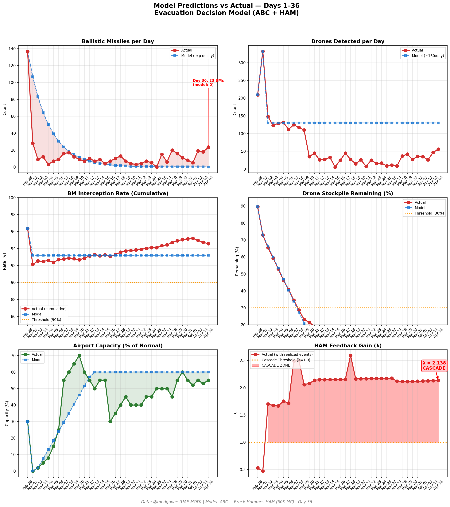
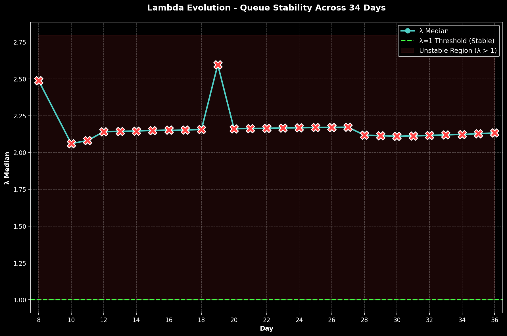

# 第36天更新 — 2026年4月4日

> 🌐 [English](../../updates/day36-april4.md) | **中文**

**状态：不稳定** | **突破：3/5** | **λ中位数 = 2.133**

---

## 新数据

| 指标 | 第35天 | 第36天 | 累计 |
|------|-------|-------|------|
| 弹道导弹 | 18 | **23** | **497** |
| 弹道导弹拦截 | 16 | 21 | 470 |
| 无人机探测 | 47 | ~56 | ~2247 |
| 无人机拦截 | 40 | 48 | ~2070 |
| 巡航导弹 | 4 | 0 | 16 |
| 弹道导弹拦截率（累计） | — | — | 94.6% |
| 无人机库存剩余 | — | — | -12.3%（-247/2000） |

**关键事件：**
- @modgovae: 23 BMs engaged (~21 intercepted, 1 fell sea, 1 fell land), 0 cruise missiles, 56 drones detected (~48 intercepted, ~8 fell UAE); cumulative 498 BMs, 23 cruise, 2,141 drones
- TRUMP 48-HOUR ULTIMATUM: Trump warns Iran to open Strait of Hormuz or make a deal within 48 hours or face 'all hell' -- reinforcing April 6 deadline; posts on Truth Social
- BUSHEHR NUCLEAR PLANT TARGETED: US-Israeli strike hits grounds near Bushehr nuclear facility -- 1 person killed, auxiliary buildings damaged; raises nuclear escalation fears
- US AIRCRAFT SHOT DOWN: Iran shoots down US military aircraft in Gulf operations; at least one crew member missing -- search and rescue ongoing (CBS News live coverage)
- US STRIKES IRAN B1 BRIDGE: US strikes Iran's B1 bridge during Iran's Nature Day holiday gatherings -- 8 killed, 95 wounded; major civilian outcry
- UN Security Council votes on Bahrain Hormuz proposal -- Russia and China signal likely veto citing escalation risk
- Polymarket ceasefire-by-Apr-30 surges to ~57% (from 22% Day 35) on Trump renewed diplomatic pressure and Iran receiving US message via mediators
- Oil prices elevated: WTI ~13.50 (continues WTI>Brent inversion); Brent ~11.80 on Bushehr strike and ultimatum
- 11 injuries reported (debris/shrapnel) -- no fatalities; cumulative 13 dead, ~217 injured
- DXB operating at ~55% capacity (Easter Saturday); Emirates serving ~127 destinations; most European/North American carriers still suspended
- Hormuz selective transits ~12/day; Philippines-flagged vessels now permitted; France and Japan-flagged vessels transiting; Iran toll booth system active
- Cumulative: ~13 dead, ~217 injured

---

## Lambda重新计算

```
λ = 1.0
  + λ_发射装置         = -0.544
  + λ_无人机          = +0.225
  + λ_拦截           = +0.000
  + λ_霍尔木兹         = +0.630
  + λ_代理人          = +0.500
  + λ_武器           = +0.400
  + λ_弹道反弹         = +0.000
  + λ_海军威慑         = -0.200
  ────────────────────────────
  λ 中位数       = 2.133（50K蒙特卡罗）
```

| 指标 | 数值 |
|------|------|
| λ 中位数 | **2.133** |
| λ 第95百分位 | **2.846** |
| P(λ > 1.0) | **100.0%** |
| P(λ > 1.5) | **97.8%** |
| P(λ > 2.0) | **64.1%** |
| 判定 | **不稳定** |
| 突破数 | **3/5** |

---

## 图表





---

## 建议

**立即撤离。** 系统处于级联区域。

---

## 数据来源

| 来源 | 类型 |
|------|------|
| @modgovae (X.com) | 阿联酋国防部每日更新 |
| 模型管线 | ABC + HAM (50K MC) |
| 生成时间 | 2026-04-04 23:23 |
