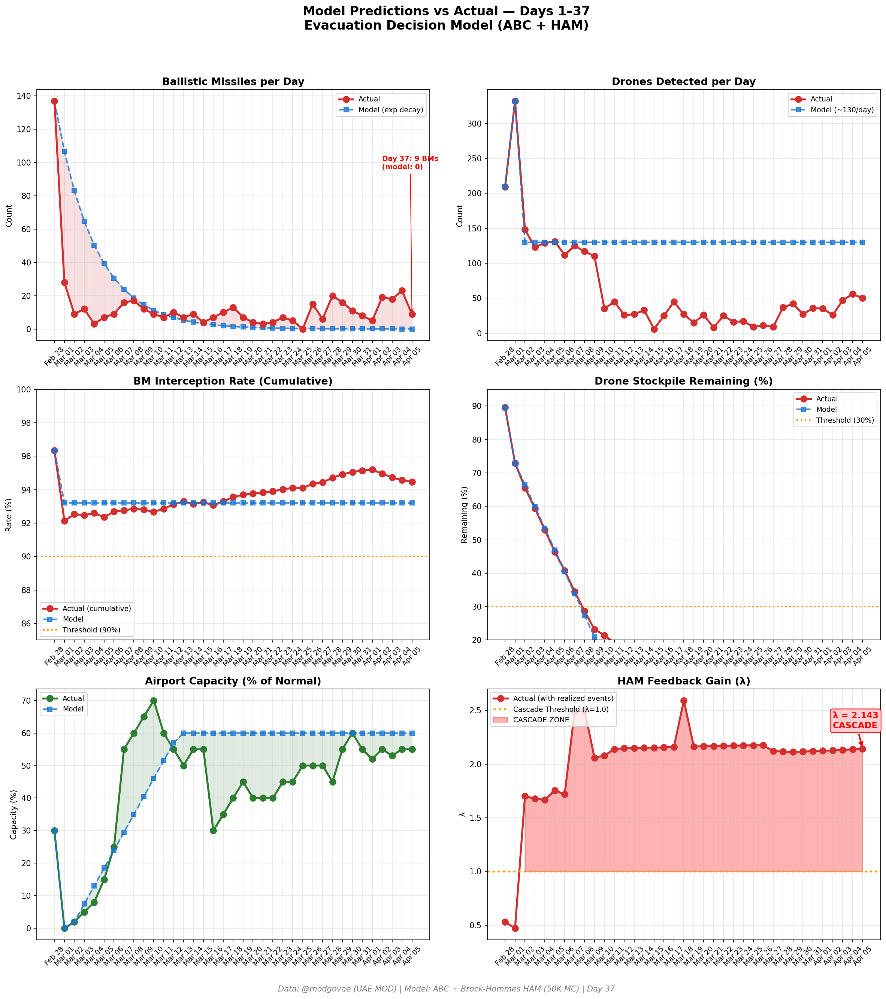
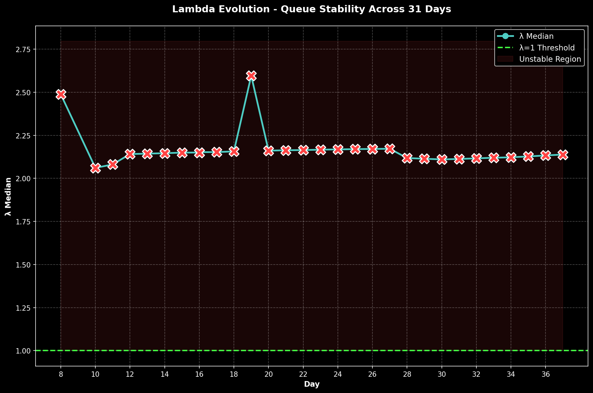

# 第37天更新 — 2026年4月5日

> 🌐 [English](../../updates/day37-april5.md) | **中文**

**状态：不稳定** | **突破：4/5** | **λ中位数 = 2.138**

---

## 新数据

| 指标 | 第36天 | 第37天 | 累计 |
|------|-------|-------|------|
| 弹道导弹 | 23 | **9** | **506** |
| 弹道导弹拦截 | 21 | 8 | 478 |
| 无人机探测 | 56 | ~50 | ~2297 |
| 无人机拦截 | 48 | 42 | ~2112 |
| 巡航导弹 | 0 | 1 | 17 |
| 弹道导弹拦截率（累计） | — | — | 94.5% |
| 无人机库存剩余 | — | — | -14.8%（-297/2000） |

**关键事件：**
- @modgovae: 9 BMs engaged (~8 intercepted, 1 fell sea), 1 cruise missile, 50 drones detected (~42 intercepted, ~8 fell UAE); cumulative ~506 BMs, ~17 cruise, ~2,297 drones
- BOROUGE PETROCHEMICAL FIRES: Multiple fires at Borouge petrochemicals plant in Ruwais from interception debris; 3 separate fires confirmed; operations immediately suspended; no injuries reported (Gulf News, Bloomberg, Khaleej Times)
- US PILOT RESCUED: Missing F-15E weapons system officer rescued by US special forces from Iranian mountains after 36+ hours of evasion; 'seriously wounded' but walking; Trump confirms rescue of 'highly respected Colonel' (NPR, CBS, Axios)
- TRUMP DEADLINE T-24H: Trump's 48-hour ultimatum (issued Apr 4) expires April 6; Trump says US will target Iran's power grid, bridges, and oil infrastructure if Hormuz stays closed (Khaleej Times Day 37 live)
- IRAQ HORMUZ EXEMPTION: Iran grants Iraq special exemption for Hormuz transit; Suezmax Ocean Thunder (Iraqi cargo) seen transiting to Malaysia (Bloomberg)
- Oman and Iran hold talks on measures for smooth Hormuz transit (The National)
- Polymarket ceasefire-by-Apr-30 rises to ~60% on deadline pressure and pilot rescue as face-saving moment; ceasefire-by-Dec-31 at 71% (Polymarket)
- Oil markets closed (Easter Sunday); WTI ~$113.50, Brent ~$111.80 (Friday close carried forward)
- DXB operating at ~55% capacity (Easter Sunday); Emirates ~127 destinations; most European/North American carriers still suspended
- Hormuz expanding selective transits: ~15 vessels/day with Iraqi, French, Japanese, Philippine, Omani flagged vessels; Iran toll system active
- ~5 injuries estimated from debris; 0 fatalities; cumulative ~13 dead, ~222 injured
- Vatican issues statement on conflict; Pope calls for immediate ceasefire
- CENTCOM: US forces destroying Iranian attack drone launch sites targeting civilians in neighboring countries

---

## Lambda重新计算

```
λ = 1.0
  + λ_发射装置         = -0.544
  + λ_无人机          = +0.230
  + λ_拦截           = +0.000
  + λ_霍尔木兹         = +0.630
  + λ_代理人          = +0.500
  + λ_武器           = +0.400
  + λ_弹道反弹         = +0.000
  + λ_海军威慑         = -0.200
  ────────────────────────────
  λ 中位数       = 2.138（50K蒙特卡罗）
```

| 指标 | 数值 |
|------|------|
| λ 中位数 | **2.138** |
| λ 第95百分位 | **2.852** |
| P(λ > 1.0) | **100.0%** |
| P(λ > 1.5) | **97.9%** |
| P(λ > 2.0) | **64.7%** |
| 判定 | **不稳定** |
| 突破数 | **4/5** |

---

## 图表





---

## 建议

**立即撤离。** 系统处于级联区域。

---

## 数据来源

| 来源 | 类型 |
|------|------|
| @modgovae (X.com) | 阿联酋国防部每日更新 |
| 模型管线 | ABC + HAM (50K MC) |
| 生成时间 | 2026-04-05 23:06 |
