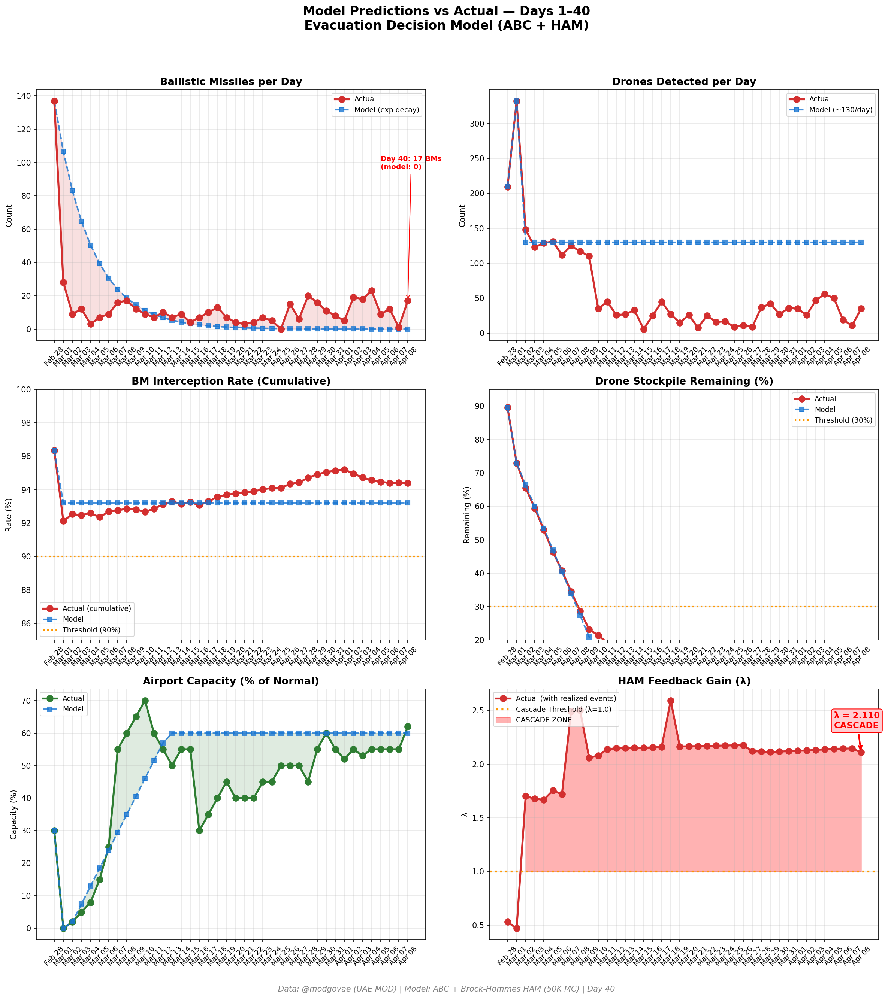
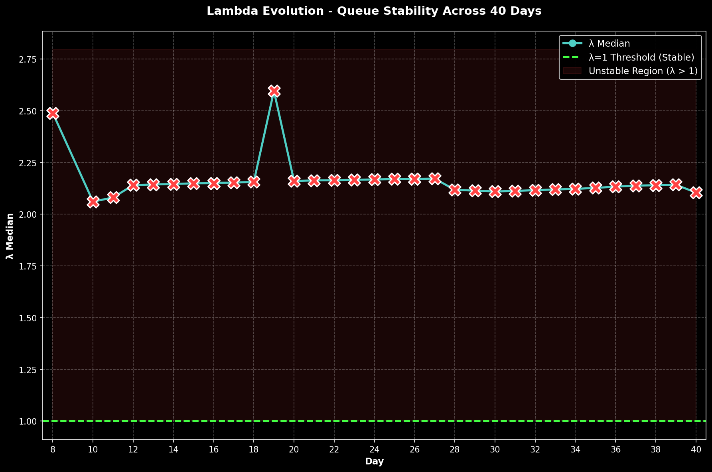

# 第40天更新 — 2026年4月8日

> 🌐 [English](../../updates/day40-april8.md) | **中文**

**状态：不稳定** | **突破：2/5** | **λ中位数 = 2.105**

---

## 新数据

| 指标 | 第39天 | 第40天 | 累计 |
|------|-------|-------|------|
| 弹道导弹 | 1 | **17** | **536** |
| 弹道导弹拦截 | 1 | 16 | 506 |
| 无人机探测 | 11 | ~35 | ~2362 |
| 无人机拦截 | 11 | 33 | ~2172 |
| 巡航导弹 | 0 | 0 | 19 |
| 弹道导弹拦截率（累计） | — | — | 94.4% |
| 无人机库存剩余 | — | — | -18.1%（-362/2000） |

**关键事件：**
- @modgovae OFFICIAL: 17 BMs (~16 intercepted, 1 fell sea), 0 cruise missiles, 35 drones (~33 intercepted, ~2 fell UAE); cumulative 537 BMs, 26 cruise, 2,256 drones
- US-IRAN 2-WEEK CEASEFIRE ANNOUNCED: Pakistan-brokered truce takes effect Day 40; Iran agrees to 'complete, immediate and safe opening' of Strait of Hormuz; US pauses strikes claiming military objectives 'met' (CBS News, NBC News, NPR)
- ATTACKS CONTINUE DESPITE CEASEFIRE: 17 BMs and 35 drones intercepted after ceasefire announcement — ceasefire implementation fragile; Al Jazeera: 'Saudi Arabia, UAE, Kuwait, Bahrain report attacks after Iran-US ceasefire' (Al Jazeera, CNBC)
- HABSHAN GAS COMPLEX FIRE: Debris from interception hits Habshan gas complex (Abu Dhabi) — fires started, 3 injured (2 Emiratis, 1 Indian), operations temporarily suspended; second Habshan incident after April 5 debris fire (Khaleej Times, Liveuamap)
- HORMUZ REOPENING — EXTREMELY SLOW: Iran agreed to open Hormuz but only 2 ships (Liberia-flagged Daytona Beach, Greek-owned NJ Earth) passed in first 12 hours; 426 tankers + 34 LPG + 19 LNG vessels still waiting (Bloomberg, 19FortyFive)
- OIL CRASHES ~17%: WTI falls to ~$93.10 (from ~$112 Day 39 estimate); Brent ~$91.50; largest single-day oil drop since COVID crash in 2020 on ceasefire news (CNBC, Trading Economics)
- UAE TRIUMPHANT: Dr Gargash (UAE presidential advisor) says UAE has 'triumphed in war it sought to avoid'; UAE's air defense system performance praised globally (The National, Khaleej Times)
- ISLAMABAD TALKS FRIDAY: US-Iran delegations to meet in Islamabad to negotiate longer-term deal; Iran's 10-point proposal: sanctions lifted, uranium enrichment recognized, US forces leave region, war damage compensated
- Polymarket ceasefire-by-Apr-30 surges to ~97% on ceasefire announcement; ceasefire-by-Dec-31 at 76%
- DXB operating at ~62% capacity; April 7 was busiest day since crisis (223 outbound flights = Emirates ~70% + flydubai ~40% of pre-conflict levels); ceasefire may accelerate airline resumptions
- Cumulative casualties: ~13 dead, ~230 injured (3 new injuries from Habshan debris)
- IRGC-affiliated media: Iran's Hormuz blockade achieved objective of 'bringing US to negotiating table'; Iran frames ceasefire as victory
- GCC emergency summit called for April 10 to coordinate post-ceasefire response and reconstruction planning

---

## Lambda重新计算

```
λ = 1.0
  + λ_发射装置         = -0.544
  + λ_无人机          = +0.236
  + λ_拦截           = +0.000
  + λ_霍尔木兹         = +0.630
  + λ_代理人          = +0.500
  + λ_武器           = +0.400
  + λ_弹道反弹         = +0.000
  + λ_海军威慑         = -0.240
  ────────────────────────────
  λ 中位数       = 2.105（50K蒙特卡罗）
```

| 指标 | 数值 |
|------|------|
| λ 中位数 | **2.105** |
| λ 第95百分位 | **2.819** |
| P(λ > 1.0) | **100.0%** |
| P(λ > 1.5) | **97.2%** |
| P(λ > 2.0) | **61.1%** |
| 判定 | **不稳定** |
| 突破数 | **2/5** |

---

## 图表





---

## 建议

**立即撤离。** 系统处于级联区域。

---

## 数据来源

| 来源 | 类型 |
|------|------|
| @modgovae (X.com) | 阿联酋国防部每日更新 |
| 模型管线 | ABC + HAM (50K MC) |
| 生成时间 | 2026-04-09 00:00 |
